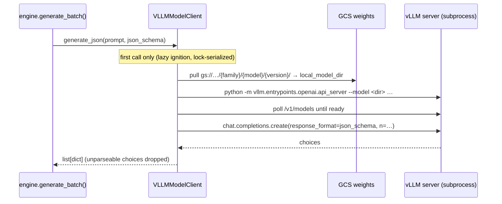

# Skill — `ModelClient` and the engine-owned vLLM server

The engines never import `vllm`. They call
`ModelClient.generate_json(prompt, json_schema)`. On Dataflow that Protocol is
implemented by `VLLMModelClient`, which **owns the vLLM OpenAI-compatible
server on the worker** ([ADR 0014](../../docs/adr/0014-vllm-model-client-owns-server.md),
amending [ADR 0011](../../docs/adr/0011-adopt-beam-vllm-model-handler.md)).



## Why not `RunInference` / `apache_beam.ml.inference.vllm_inference`

Beam ships `VLLMCompletionsModelHandler` / `VLLMChatModelHandler`, and ADR 0011
first adopted them. ADR 0014 reversed that the next day:

- **Call shape.** A `ModelHandler` runs inference over a `PCollection` of
  prompts. The engines call the LLM **O(1) times per run** — value pools and
  distribution inference, never per row (ADR 0013) — synchronously, from inside
  `generate_batch()` in the generation `DoFn`. There is no `PCollection` of
  prompts to batch.
- **Per-call schema.** `inference_args` are fixed per `RunInference` transform;
  the JSON schema here changes with every call.
- **What the client adds** (each from a failed run, cited at the code site):
  GCS warm-pull, dtype ↔ GPU compute-capability guard, `gpu-memory-utilization`
  from free VRAM, `max-model-len` clamped before spawn, one server shared by
  sibling SDK processes (`_PortMutex`, ref-counted teardown), a spawn-failure
  budget, lazy ignition.

`RunInference` and `ModelHandler` are used **nowhere** in this repository.

## Files

- `packages/sdfb-core/src/sdfb_core/engines/base.py` — the `ModelClient` Protocol.
- `packages/sdfb-beam/src/sdfb_beam/handlers/vllm_client.py` — `VLLMModelClient`.
- `packages/sdfb-beam/src/sdfb_beam/handlers/fake_client.py` — fixture-driven test impl (laptop).
- `packages/sdfb-beam/src/sdfb_beam/handlers/mlx_client.py` — Apple Silicon smoke impl ([ADR 0010](../../docs/adr/0010-m4-local-smoke-mlx.md)).
- `packages/sdfb-beam/src/sdfb_beam/cli/run_pipeline.py` — `build_model_client()` (`--client_type` ∈ `vllm | mlx | fake`).
- `config/models.yml` — GCS URI, `vllm_server_kwargs`, licence per model.

## The request — structured outputs on the chat endpoint

```python
client.chat.completions.create(
    model=served_model_name,                 # == local_model_dir
    messages=[{"role": "user", "content": prompt}],
    n=n, temperature=temperature, max_tokens=max_tokens,
    response_format={"type": "json_schema",
                     "json_schema": {"name": "sdfb_record", "schema": json_schema}},
    extra_body={"chat_template_kwargs": {"enable_thinking": False}},
)
```

- **`response_format`, not `guided_json`.** vLLM ≥ 0.10 reads the schema from
  the OpenAI-standard field. The legacy `extra_body={"guided_json": …}` is
  silently ignored: free-form text, every choice dropped.
- **Chat, not completions.** Only the chat endpoint applies the model's chat
  template, which is what lets `enable_thinking: False` suppress a thinking
  channel.
- **`n > 1` is not diversity.** Under structured outputs the choices come back
  identical. Ask for one completion carrying an array of values.
- **`seed`** is sent only when the caller passes one; **`top_p` / `top_k`**
  override a `generation_config.json` that pins the nucleus (`top_k` travels in
  `extra_body`).

REFs: [vLLM structured outputs](https://docs.vllm.ai/en/latest/usage/structured_outputs.html) ·
[vLLM OpenAI-compatible server](https://docs.vllm.ai/en/latest/serving/openai_compatible_server.html) ·
[Beam `vllm_inference`](https://beam.apache.org/releases/pydoc/current/apache_beam.ml.inference.vllm_inference.html) (evaluated, not used)

## Model load — from GCS, never the Hub

`setup()` pulls the `gs://` prefix with the **`google-cloud-storage` Python
client** (not `gsutil`: the CLI would add an apt repository to the image) into
`local_model_dir`, then spawns the server on that path. A bare local path skips
the pull. `HF_HUB_OFFLINE=1` and `TRANSFORMERS_OFFLINE=1` in `docker/Dockerfile`
make an accidental Hub call fail fast. Layout: [`docs/MODEL_LAYOUT.md`](../../docs/MODEL_LAYOUT.md).

## dtype and VRAM

- Qwen ships bf16 checkpoints; a T4 (compute capability 7.5) needs
  `vllm_dtype=float16`. The client refuses float16 for Gemma-family checkpoints
  (fp16 Gemma emits empty output) and refuses bf16 on a GPU below 8.0.
- `gpu-memory-utilization` is derived from **free** VRAM at spawn, and
  `max-model-len` is clamped to what the KV cache can hold. An unfittable length
  raises a transient error so the engine's retry ladder waits (ADR 0033).

## Testing

`VLLMModelClient` is CUDA-only, so the laptop exercises it with mocks: every
heavy dependency (`vllm`, `openai`, `google.cloud.storage`) is imported inside
`setup()` / `generate_json()`, never at module load. Real-server behavior is
validated on Dataflow GPU workers; mark such tests `@pytest.mark.gpu`.
