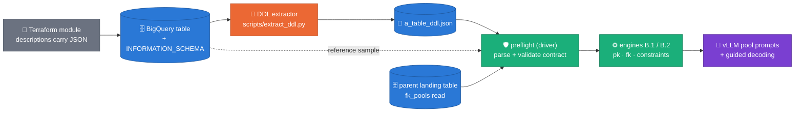
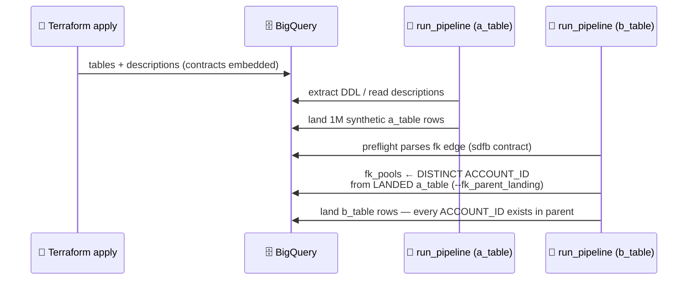

# DDL description contract — user guide (Terraform ⇄ `_ddl.json` ⇄ engines)

**Audience:** the person provisioning target tables (Terraform) and wiring
synthetic runs. This is the *configuration* companion to
[ADR 0021](adr/0021-relational-contract-in-descriptions.md) (table-level
relational contract) and [ADR 0024](adr/0024-structured-prompt-constraint-templates.md)
(column-level prompt constraints); design rationale and evidence live in
[the wave-2 design doc](designs/2026-08-10-prompt-constraints.md). Everything
below is copy-paste-ready and matches the parsers in
`packages/sdfb-core/src/sdfb_core/contracts/`.

---

## 1. Why the contract lives in *descriptions* (the Terraform reminder)

BigQuery's PK/FK "constraints" are **metadata only — never enforced**
([BigQuery table constraints](https://cloud.google.com/bigquery/docs/primary-foreign-keys)),
and the enterprise Terraform module for `google_bigquery_table` does **not
expose** a primary-key block at all
([registry: `google_bigquery_table`](https://registry.terraform.io/providers/hashicorp/google/latest/docs/resources/bigquery_table)).
So there is no Terraform-native way to declare the relationships the
generator must honor.

ADR 0021's answer: a **versioned JSON contract embedded in the table
description**, plus per-column generation hints embedded in **column
descriptions**. Descriptions are plain strings — Terraform can set them, the
DDL extractor reads them back from `INFORMATION_SCHEMA`, and the pipeline
*actually enforces* what they declare (PK uniqueness via
`--uniqueness_mode=exact`, FK referential integrity via parent-landed key
pools). The description is the single source of truth; nothing else carries
relationships.



**Precedence rule** (`run_pipeline.py::_load_reference_and_preflight`): the
contract *defaults* `pk`/`identity`; explicit `--pk_cols` / `--identity_cols`
CLI flags **win** when passed. FK pools load only when the contract declares
`fk` **and** `--fk_parent_landing` names the landing dataset.

> **WHERE the contract lives (ADR 0027 D2, 2026-08-21): on the LANDING
> (synthetic/target) table — never the source.** The pipeline reads the
> description surfaces live from `--landing_table`'s `INFORMATION_SCHEMA`
> at every launch and overlays them onto the source table's structure;
> the source (lake) table's descriptions are another team's prose and are
> deliberately stripped, never used to steer generation. Declare the
> `{"sdfb":1,…}` contract and every `llm_prompt_constraint` in the
> Terraform that provisions your `synthetic_data.*` tables (worked
> examples below apply unchanged — put them on the landing twin). A
> `terraform apply` there reaches the very next trigger
> (`target_metadata_overlaid` in the launcher log); no DDL re-extraction
> step. `--ddl_uri` pins are only the offline fallback and should be
> extracted from the LANDING table.

## 2. The two surfaces at a glance

| Surface | Marker key | Owns | Parser |
|---|---|---|---|
| **Table** description | `"sdfb"` | relationships: `pk`, `fk`, `identity` | `contracts/relational.py::parse_relational_contract` |
| **Column** description | `"llm_prompt_constraint"` | per-column generation hints (string or object) | `contracts/prompt_constraint.py::parse_prompt_constraint` |

### Placement is free — prose around the JSON is expected

The extractor walks brace-balanced `{…}` candidates and takes the first one
carrying the marker key. All four of these column descriptions parse
identically:

```text
1) JSON only:
   {"llm_prompt_constraint": {"format": "24-char uppercase hex"}}

2) Prose before:
   Card token, PAN-derived. {"llm_prompt_constraint": {"format": "24-char uppercase hex"}}

3) Prose after:
   {"llm_prompt_constraint": {"format": "24-char uppercase hex"}} Populated by the auth service.

4) Prose both sides (table-level looks the same):
   Ledger accounts. {"sdfb": 1, "pk": ["ACCOUNT_ID"]} Owned by team-core-banking.
```

Two hard rules, both loud by design:

- a **marked but unparseable** JSON object fails the run at preflight
  (`DescriptionJsonError`) — a half-parsed contract silently dropping an FK
  is worse than a stop;
- **unknown keys inside a constraint object are skipped with a WARNING**
  (`prompt_constraint_unknown_keys` milestone) — newer descriptions never
  break older engines, and vice versa (ADR 0024 forward/backward
  compatibility).

## 3. Table-level contract — every settable field

```jsonc
{"sdfb": 1,                                  // REQUIRED version tag
 "pk": ["ACCOUNT_ID"],                       // 0..n columns; composite OK
 "identity": ["IBAN"],                       // unique-but-not-key columns
 "fk": [                                     // 0..n edges
   {"cols": ["ACCOUNT_ID"],                  // this table's columns
    "ref": "core_banking.a_table",           // parent as dataset.table (MUST be qualified)
    "ref_cols": ["ACCOUNT_ID"]}              // parent columns, same arity
 ]}
```

| Field | Validation | What the pipeline does with it |
|---|---|---|
| `sdfb` | required int (version) | contract versioning; `1` today |
| `pk` | list of column names | uniqueness enforcement (`--uniqueness_mode=exact`), duplicate gate in validation, `pk_analysis` in the E2E probe |
| `identity` | list of column names | per-row unique identifier generation (never pool-drawn, never folded) |
| `fk[].cols` / `ref_cols` | non-empty, equal arity | child columns sample from the parent's **landed synthetic** keys (`io/fk_pools.py`) — referential integrity beats the child's marginal (v1) |
| `fk[].ref` | must be `dataset.table` | resolved to `{landing_dataset}.{table}` at run time via `--fk_parent_landing` |
| `fk[].informational` | bool, default `false` | **documentation-only edge (ADR 0029)**: drawn dashed in FK-model diagrams (`fk_model_pretty` logs, reports), excluded from ALL enforcement — no column-existence check, no `fk_parent_landing` requirement, no FK pool, no orphan rule, no generation-order constraint. For relationships whose join key is absent from the DDL (the 6-table example's `PARTY_KEY`) |

> **v1 scope, on record:** single-column FKs are exact. Composite FKs load
> aligned per-column pools but draw columns independently — joint tuple
> draws are the M2 follow-up (`io/fk_pools.py` docstring, ROADMAP).

**Relational scenarios (ADR 0029).** `--generate_fk_relationships`
(default `true`, also a Composer param) is the switch between relational
and isolated generation; every launch logs `fk_generation_mode` and its
resolved model as pasteable mermaid (`fk_model_pretty`). Multi-table
sets run parents-first in waves via `scripts/run_tableset.py`
(`--max-parallel`, `--emit-trigger-configs` for Airflow). Worked 6-table
example — composite FKs, an informational `PARTY_KEY` edge, letter-
prefixed anonymization: [`docs/assets/fk_relationship_example.tf`](assets/fk_relationship_example.tf)
(diagram: [`fk_relationship_example.png`](assets/fk_relationship_example.png)).

## 4. Column-level constraint — every settable field

String form (legacy, still first-class): free prose appended to the pool
prompt. Object form (ADR 0024): typed keys, rendered deterministically,
prefix-cache-safe. All keys optional; combine freely.

| Key | Type / cap | Functional capability it unlocks | Engine mechanics |
|---|---|---|---|
| `format` | str ≤ 500 | tell the LLM the business format in words | prompt clause `format=…` |
| `pattern` | anchored regex ≤ 200, must compile | **guarantee** the shape, not just request it | prompt clause **and** vLLM guided decoding (`items.pattern`) — overrides the derived regex |
| `examples` | ≤ 8 strings, ≤ 64 ch each | show fictitious canonical values | prompt clause; echoes are rejected from pools (never land as data) |
| `values` | ≤ 64 strings | closed vocabulary | prompt clause `allowed values=[…]` |
| `prefix` / `suffix` | str | literal affixes (`E2F…`) | prompt clauses |
| `charset` | str | restrict the alphabet | prompt clause |
| `length` | int or `[min, max]` | pin width | prompt clause; **suppresses** the measured length hint (no duplicate tokens) |
| `units` | str | semantic scale ("EUR cents") | prompt clause |
| `locale` | str | language of prose ("es-ES") | prompt clause |
| `route` | `"auto"` \| `"llm"` | **force a typed column onto the LLM route** (constant/categorical/temporal/identifier STRING columns) | profiler override; non-STRING types warn `prompt_constraint_route_unsupported` and keep their typed route |
| `families` | `{prefix: share}` (or pair list) | prefix-family mass targets (`{"E2F3": 0.57, "E2F1": 0.42, "2301": 0.007}`) — replaces prose percentages, which no sampler can parse | ADR 0028 Tier-P weighted sampling; shares normalized; **not** rendered into the prompt |
| `notes` | str ≤ 500 | anything else, free prose | appended last (the legacy string form lands here) |

**Routing (ADR 0028).** A constrained column no longer always means an
LLM pool. Launcher-visible in the `generation_plan` milestone's
`pool_sources` and the `constraint_sampler_active` /
`freetext_pool_byte_template` milestones:

- **`pattern` present and samplable** (anchored; literals, classes,
  `\d`, bounded repeats, groups, alternation — no `+`/`*`, negated
  classes, backrefs, lookarounds) → a seeded CPU **pattern sampler**
  generates format-exact, unlimited unique values; `families` weights
  apply. No LLM call, no pool cap. **Author `pattern` first, always** —
  it is the difference between a guaranteed format and a request.
- **Binary payloads** (control-byte values mis-stored as STRING) →
  a **byte template** (`prefix` + random tail at pinned `length`) —
  never source copies, per the privacy note such clauses carry.
- **Anything else** → the LLM pool ladder, as before.

**PK columns** (declared in the table contract): preflight P4 refuses a
launch whose PK generator cannot cover `num_rows` unique values — give
PK columns a samplable `pattern`. Declared FKs require
`--fk_parent_landing` at launch (P6; `skip` is the loud opt-out).

Debugging the result: run with `--prompt_debug=redacted` and grep Dataflow
worker logs for `freetext_pool_prompt` — you see exactly the instruction +
rendered clause the model received, seeds elided (design doc §3c).

## 5. Worked example — `a_table_ddl.json` (parent)

Fictitious core-banking accounts table. Every constraint style appears at
least once; comments call out which §4 row each column exercises.

```jsonc
{
  "table_info": {
    "table_id": "demo_project.core_banking.a_table",
    // Table-level contract: PK + identity, prose around the JSON is fine.
    "description": "Customer accounts, one row per account. {\"sdfb\": 1, \"pk\": [\"ACCOUNT_ID\"], \"identity\": [\"CARD_TOKEN\"]} Owned by team-core-banking.",
    "data_location": "EU",
    "table_type": "TABLE"
  },
  "schema": [
    {"name": "ACCOUNT_ID", "type": "STRING", "mode": "REQUIRED", "max_length": 10,
     // format + pattern + length: guaranteed 10-digit shape via guided decoding
     "description": "{\"llm_prompt_constraint\": {\"format\": \"10-digit account number, bank code then office code\", \"pattern\": \"^[0-9]{10}$\", \"length\": 10}}"},

    {"name": "CARD_TOKEN", "type": "STRING", "mode": "REQUIRED", "max_length": 24,
     // prefix + charset + examples: the COL_001-class hex identifier
     "description": "PAN-derived token. {\"llm_prompt_constraint\": {\"format\": \"24-character uppercase hexadecimal identifier\", \"pattern\": \"^[0-9A-F]{24}$\", \"prefix\": \"E2F\", \"charset\": \"0-9A-F\", \"examples\": [\"E2F0AA11BB22CC33DD44EE55\"]}}"},

    {"name": "PRODUCT_CODE", "type": "STRING", "mode": "REQUIRED", "max_length": 12,
     // composite positional format spelled out in `format`, pinned by pattern
     "description": "{\"llm_prompt_constraint\": {\"format\": \"3-digit account type + 2-digit contract counter + 2-digit modality + 1-digit closed-contract counter + 4-char product code\", \"pattern\": \"^[0-9]{8}[A-Z0-9]{4}$\", \"examples\": [\"00100000VIST\"]}} Translated in table TG0362."},

    {"name": "ACCOUNT_DIRECTION", "type": "STRING", "mode": "REQUIRED", "max_length": 1,
     // closed vocabulary with business meanings in notes
     "description": "{\"llm_prompt_constraint\": {\"values\": [\"I\", \"O\"], \"notes\": \"I=account input, O=account output\"}}"},

    {"name": "HOLDER_REGIME", "type": "STRING", "mode": "NULLABLE", "max_length": 2,
     // route:llm — low-cardinality STRING that would classify CATEGORICAL;
     // forced onto the LLM route WITH its vocabulary
     "description": "{\"llm_prompt_constraint\": {\"route\": \"llm\", \"values\": [\"1\", \"2\", \"3\", \"4\", \"99\"], \"notes\": \"1=individual 2=indistinct 3=joint 4=solidary 99=undefined\"}}"},

    {"name": "OPEN_DATE_TXT", "type": "STRING", "mode": "NULLABLE", "max_length": 10,
     // date-as-text: without a constraint this routes TEMPORAL automatically;
     // the constraint documents the rendering for humans AND the LLM fallback
     "description": "{\"llm_prompt_constraint\": {\"format\": \"calendar date as DD.MM.YYYY\", \"pattern\": \"^[0-3][0-9]\\\\.[0-1][0-9]\\\\.[1-2][0-9]{3}$\", \"examples\": [\"28.08.2019\"]}}"},

    {"name": "BALANCE_CENTS", "type": "INT64", "mode": "REQUIRED",
     // non-STRING: constraints render but route stays typed (numeric sampler);
     // a route:llm here would WARN and be ignored
     "description": "Amount in euro cents, no separators. {\"llm_prompt_constraint\": {\"units\": \"EUR cents\", \"charset\": \"0-9\"}}"},

    {"name": "SETTLEMENT_REF", "type": "STRING", "mode": "NULLABLE", "max_length": 32,
     // space-padded composite (COL_038-class): pattern pins the LITERAL
     // three-space run the LLM otherwise normalizes
     "description": "{\"llm_prompt_constraint\": {\"format\": \"5 letters, 1 digit, exactly three spaces, 2-letter code, 20 digits, final letter\", \"pattern\": \"^[A-Z]{5}[0-9] {3}[A-Z]{2}[0-9]{20}[A-Z]$\"}}"},

    {"name": "CONCEPT_TEXT", "type": "STRING", "mode": "NULLABLE", "max_length": 35,
     // prose narrative, language-pinned
     "description": "{\"llm_prompt_constraint\": {\"format\": \"short payment concept phrase, uppercase\", \"locale\": \"es-ES\", \"examples\": [\"PAGO CHEQUE 1234567\"]}}"},

    {"name": "BRANCH_NOTES", "type": "STRING", "mode": "NULLABLE", "max_length": 254,
     // legacy STRING constraint — still fully supported, renders verbatim
     "description": "{\"llm_prompt_constraint\": \"free-form Spanish branch annotation, may mention a department name\"}"},

    {"name": "USER_STAMP", "type": "STRING", "mode": "REQUIRED", "max_length": 8}
    // no constraint at all — profiling alone drives generation (always valid)
  ],
  "primary_keys": ["ACCOUNT_ID"],
  "partitioning": {"type": "DAY", "field": "_PARTITIONTIME"},
  "clustering": {"fields": ["PRODUCT_CODE"]}
}
```

## 6. Worked example — `b_table_ddl.json` (child, FK → a_table)

```jsonc
{
  "table_info": {
    "table_id": "demo_project.core_banking.b_table",
    // FK edge: this table's ACCOUNT_ID samples from a_table's LANDED keys.
    // ref MUST be dataset-qualified; composite edges allowed (v1 caveat §3).
    "description": "Account movements. {\"sdfb\": 1, \"pk\": [\"MOVEMENT_ID\"], \"fk\": [{\"cols\": [\"ACCOUNT_ID\"], \"ref\": \"core_banking.a_table\", \"ref_cols\": [\"ACCOUNT_ID\"]}]}",
    "data_location": "EU",
    "table_type": "TABLE"
  },
  "schema": [
    {"name": "MOVEMENT_ID", "type": "STRING", "mode": "REQUIRED", "max_length": 12,
     "description": "{\"llm_prompt_constraint\": {\"format\": \"12-char uppercase hexadecimal movement id\", \"pattern\": \"^[0-9A-F]{12}$\"}}"},

    {"name": "ACCOUNT_ID", "type": "STRING", "mode": "REQUIRED", "max_length": 10,
     // FK column: NO constraint needed — fk_pools overrides whatever the
     // profiler would do; referential integrity beats the marginal (v1)
     "description": "FK to a_table.ACCOUNT_ID (see table description contract)."},

    {"name": "OPERATION_CODE", "type": "STRING", "mode": "REQUIRED", "max_length": 4,
     "description": "{\"llm_prompt_constraint\": {\"values\": [\"ADTW\", \"DEPO\", \"XFER\", \"CHRG\"]}}"},

    {"name": "AMOUNT_CENTS", "type": "INT64", "mode": "REQUIRED",
     "description": "{\"llm_prompt_constraint\": {\"units\": \"EUR cents\"}} Example: 1000 for 10 EUR."},

    {"name": "VALUE_TS", "type": "TIMESTAMP", "mode": "REQUIRED"},

    {"name": "OPERATOR_STAMP", "type": "STRING", "mode": "NULLABLE", "max_length": 8,
     "description": "{\"llm_prompt_constraint\": {\"format\": \"U + 6 digits for users, letter-prefixed 7-char code for programs\", \"examples\": [\"U824488\", \"PPAE900\"]}}"}
  ],
  "primary_keys": ["MOVEMENT_ID"]
}
```

## 7. Terraform wiring

The schema JSON files above double as the `schema` payload of
`google_bigquery_table` — descriptions travel inside them. The table-level
contract goes in the resource's `description`. Two equivalent styles:

```hcl
locals {
  # Style A — jsonencode() builds the contract; HCL-native, no escaping.
  a_table_contract = jsonencode({
    sdfb     = 1
    pk       = ["ACCOUNT_ID"]
    identity = ["CARD_TOKEN"]
  })

  b_table_contract = jsonencode({
    sdfb = 1
    pk   = ["MOVEMENT_ID"]
    fk = [{
      cols     = ["ACCOUNT_ID"]
      ref      = "core_banking.a_table"   # dataset-qualified, ALWAYS
      ref_cols = ["ACCOUNT_ID"]
    }]
  })
}

resource "google_bigquery_table" "a_table" {
  dataset_id  = google_bigquery_dataset.core_banking.dataset_id
  table_id    = "a_table"
  # Prose + contract in one description — the parser finds the JSON anywhere.
  description = "Customer accounts, one row per account. ${local.a_table_contract} Owned by team-core-banking."

  # Column array identical to the "schema" list of a_table_ddl.json §5 —
  # keep it in a versioned file so Terraform and the pipeline share one truth.
  schema = file("${path.module}/schemas/a_table.schema.json")

  # ⚠️ DO NOT reach for primary-key / table_constraints blocks here:
  # BigQuery constraints are unenforced metadata and the enterprise module
  # does not expose them — the sdfb JSON above is what the pipeline
  # actually enforces (ADR 0021).
}

resource "google_bigquery_table" "b_table" {
  dataset_id  = google_bigquery_dataset.core_banking.dataset_id
  table_id    = "b_table"
  description = "Account movements. ${local.b_table_contract}"
  schema      = file("${path.module}/schemas/b_table.schema.json")
}
```

```hcl
# Style B — heredoc with literal JSON (handy when copying from a _ddl.json).
# Plain JSON contains no ${…}, so no escaping is needed inside the heredoc.
resource "google_bigquery_table" "a_table_literal" {
  dataset_id  = google_bigquery_dataset.core_banking.dataset_id
  table_id    = "a_table"
  description = <<-EOT
    Customer accounts, one row per account.
    {"sdfb": 1, "pk": ["ACCOUNT_ID"], "identity": ["CARD_TOKEN"]}
  EOT
  schema      = file("${path.module}/schemas/a_table.schema.json")
}
```

`schemas/a_table.schema.json` is exactly the `"schema"` array from §5 (the
`google_bigquery_table.schema` attribute takes the column array, not the
whole `_ddl.json`):

```json
[
  {"name": "ACCOUNT_ID", "type": "STRING", "mode": "REQUIRED", "maxLength": "10",
   "description": "{\"llm_prompt_constraint\": {\"format\": \"10-digit account number, bank code then office code\", \"pattern\": \"^[0-9]{10}$\", \"length\": 10}}"},
  {"name": "CARD_TOKEN", "type": "STRING", "mode": "REQUIRED", "maxLength": "24",
   "description": "PAN-derived token. {\"llm_prompt_constraint\": {\"format\": \"24-character uppercase hexadecimal identifier\", \"pattern\": \"^[0-9A-F]{24}$\", \"prefix\": \"E2F\", \"charset\": \"0-9A-F\", \"examples\": [\"E2F0AA11BB22CC33DD44EE55\"]}}"}
]
```

## 8. Running the pair — parent first, always



```bash
# 0. Extract the DDL JSONs from the live (Terraform-created) tables
python scripts/extract_ddl.py --project demo_project \
  --dataset core_banking --table a_table --output_base ./output
python scripts/extract_ddl.py --project demo_project \
  --dataset core_banking --table b_table --output_base ./output

# 1. Parent run — pk/identity come from the description contract
#    (pass --pk_cols/--identity_cols only to OVERRIDE the contract)
python -m sdfb_beam.cli.run_pipeline \
  --ddl_uri output/a_table_ddl.json \
  --reference_table demo_project.core_banking.a_table \
  --landing_table demo_project.synthetic_data.a_table \
  --uniqueness_mode exact --prompt_constraints on \
  --prompt_debug redacted ... # debug-run only; drop for production

# 2. Child run — the fk edge activates via --fk_parent_landing
python -m sdfb_beam.cli.run_pipeline \
  --ddl_uri output/b_table_ddl.json \
  --reference_table demo_project.core_banking.b_table \
  --landing_table demo_project.synthetic_data.b_table \
  --fk_parent_landing demo_project.synthetic_data \
  --uniqueness_mode exact --prompt_constraints on ...
```

## 9. Functional ⇄ technical capability map

| You want… | You write… | The pipeline does… | Proof it worked |
|---|---|---|---|
| unique keys | `"pk"` in the table contract | exact per-run dedup + validation gate | `pk_analysis` clean, `validation_runs` PASSED |
| rows that join to the parent | `"fk"` edge + `--fk_parent_landing` | child samples parent's landed keys | join query returns 0 orphans |
| unique non-key identifiers | `"identity"` | per-row unique generation, never pooled | duplicate probe on the column = 0 |
| exact string shapes | `pattern` (+ `format`) | guided decoding — the model *cannot* emit off-pattern | crosscheck `shape_recall` → 1.0 |
| preserved literal padding | `pattern` with explicit ` {3}` runs | decoding + collapsed-mask pool gate | `spurious_shapes` empty |
| closed vocabularies | `values` | prompt vocabulary clause | `top_values` ⊆ declared set |
| business-realistic prose | `format` + `locale` + `examples` | steered pool prompts | eyeball sample + `freetext_pool_prompt` milestone |
| LLM on a "boring" column | `route: "llm"` | classification override (STRING only) | `generation_plan` shows the column on the LLM route |
| to see the actual prompts | `--prompt_debug redacted` | logs instruction + clause, seeds elided | `freetext_pool_prompt` in Dataflow logs |

## 10. Common pitfalls

| Pitfall | Symptom | Fix |
|---|---|---|
| `"ref": "a_table"` (unqualified) | loud preflight failure | always `dataset.table` |
| real values pasted into `examples` | privacy leak into prompts/logs | examples must be **fictitious**; pools reject echoes, but don't tempt it |
| `route: "llm"` on INT64 | WARNING, route unchanged | only STRING-typed columns re-route |
| unescaped regex in JSON | `DescriptionJsonError` at preflight | JSON-escape backslashes: `\\\\.` for a literal dot |
| constraint typo in a *marked* object | loud stop (by design) | fix the JSON; prose outside the braces is always safe |
| Terraform `table_constraints` block | silently unenforced metadata | declare relationships in the `sdfb` contract instead |

---

Citations (retrieved 2026-08-11): [BigQuery primary & foreign keys —
unenforced](https://cloud.google.com/bigquery/docs/primary-foreign-keys),
[Terraform `google_bigquery_table`](https://registry.terraform.io/providers/hashicorp/google/latest/docs/resources/bigquery_table).
Parsers: `contracts/relational.py`, `contracts/prompt_constraint.py`;
consumption: `cli/run_pipeline.py::_load_reference_and_preflight`,
`io/fk_pools.py`. Fixture-shape reference:
`packages/sdfb-tests/fixtures/ddl/*.json`.
