# WS8 E2E run playbook — validating ADR 0021 + 0022 from scratch

The campaign companion to [`RUN_PLAYBOOK.md`](RUN_PLAYBOOK.md) (GPU verdict,
Dataflow options, L4 capacity ladder, report recipe — all still apply and are
not repeated here). This doc is the **run matrix for the WS8 features**:
relational contract + FK pools (ADR 0021), tiered `source_table_stats`,
exact-distinct pool sizing, B.2 inverse-CDF sampling, measured length hints,
shape-preserving expansion (ADR 0022 / [design](designs/2026-08-05-source-table-stats.md)
— each `--source_stats` / `--freetext_expansion` mode has its own diagram
panel there and in
[`2026-08-05-freetext-expansion-modes.md`](designs/2026-08-05-freetext-expansion-modes.md);
not redrawn here).

Model note for this campaign (qwen on T4): keep `vllm_dtype=float16` (the
DAG default — qwen ships bf16, T4 is CC 7.5) and `vllm_max_model_len=8192`;
if staging a qwen2.5 build, remember the local-dir rename before GCS staging
and that a missing `special_tokens_map.json` is expected and handled.

---

## 0. From-scratch reset (once, before R1)

Deploy/align the stats table first (the ws8 schema added
`sample_rows`/`stats_tier`/`profiler_version`):

```bash
# new table:
bq mk --table "${PROJECT}:synthetic_rag.source_table_stats" \
  config/bq_schema/synthetic_rag/source_table_stats.schema.json
# pre-existing table (additive, no data rewrite):
bq update "${PROJECT}:synthetic_rag.source_table_stats" \
  config/bq_schema/synthetic_rag/source_table_stats.schema.json
```

Then wipe state so every store path is exercised cold:

```bash
for t in \
  "synthetic_data.<LANDING_A>" "synthetic_data.<LANDING_B>" \
  "synthetic_data_quality.dlq" "synthetic_data_quality.validation_runs" \
  "synthetic_rag.freetext_pools" "synthetic_rag.rag_chunks" \
  "synthetic_rag.source_table_stats"; do
  bq query --use_legacy_sql=false "TRUNCATE TABLE \`${PROJECT}.${t}\`"
done
```

Truncating `freetext_pools`/`rag_chunks`/`source_table_stats` resets every
digest — **all first runs are cold** (full pool ladder + embed + stats
write). That is the point of the campaign, but it is also the expensive
part: sequence warm runs immediately after their cold twin.

Preflight (step 11 must now report the stats table OK, not ACTION):

```bash
python scripts/deployment_prerequisites.py --project ${PROJECT} \
  --source-stats-table ${PROJECT}.synthetic_rag.source_table_stats
```

## 1. Campaign map

```mermaid
flowchart LR
  classDef cpu   fill:#1baf7a,color:#fff,stroke:#127a55
  classDef gpu   fill:#7a3fd1,color:#fff,stroke:#5a2f9d
  classDef store fill:#2a78d6,color:#fff,stroke:#1d5599

  R0["⚙️ R0 fake smoke<br/>plumbing after truncate"]:::cpu --> R1["🧠 R1 cold defaults<br/>b1 · 1M · table A"]:::gpu
  R1 --> R2["⚙️ R2 warm twin<br/>skip-key + store hits"]:::cpu
  R2 --> R3["🧠 R3 exact stats<br/>pool-size lift"]:::gpu
  R3 --> R4["⚙️ R4 expansion arms<br/>off vs all"]:::cpu
  R4 --> R5["🧠 R5 B.2 engine<br/>inverse-CDF live"]:::gpu
  R5 --> R6["🧠 R6 table B cold<br/>+ FK child (ADR 0021)"]:::gpu
  R6 --> R7["🧠 R7 10M scale<br/>warm everything"]:::gpu
  R1 -.-> ST[("🗄️ source_table_stats<br/>pools · chunks")]:::store
  ST -.-> R2
```



Order matters twice: R2 must follow R1 *without* clearing anything (it
proves the skip keys), and R3/R4-off must clear `freetext_pools` for the
digest first or the persisted pool masks the effect being measured (the
§6c do-not-confound rule of the main playbook).

## 2. Run matrix

Common to every vLLM run: `client_type=vllm`, qwen + `vllm_dtype=float16`
(DAG default), `vllm_max_model_len=8192`, `identity_cols`/`pk_cols` set to
the table's real columns, fresh Airflow trigger per run (salted `run_id` is
derived). `batch_size=1000` for 1M/10M rows (WS5 T3; the DAG's `16` default
is sized for smokes). Params not listed = DAG defaults (which already carry
the WS8 posture: `source_stats=sample`, `freetext_expansion=identifiers`,
`prompt_constraints=on`, `build_pool_layer=true`, `build_rag_layer=true`,
`uniqueness_mode=exact`, `pool_seed_strategy=centroid`).

| Run | Trigger config (overrides only) | Validates | Expect |
|---|---|---|---|
| **R0** smoke | `{"client_type":"fake","num_rows":"10000","batch_size":"16"}` | plumbing after truncate: preflight, landing/dlq/validation_runs writes, stats write path — no GPU | `source_stats_written` (tier `sample`, `profiler_version=2`, `__table__` row present); `validation_runs.valid_count=10000` |
| **R1** cold baseline | `{"num_rows":"1000000","batch_size":"1000"}` — pure defaults otherwise | the default WS8 posture end-to-end on table A: sample-tier stats, pool build + persist, chunk build, expansion=identifiers | one `vllm_ready`; `pool_branch_emitted`; `source_stats_written`; `freetext_pool_built` per LLM column; landing = 1M |
| **R2** warm twin | identical to R1, re-trigger | append-only skip semantics + every store's read path | `source_stats_skipped`; `pool_build_skipped` + `freetext_pool_store_hit`; `b1_chunks_reused`; **zero** vLLM spawns (12.6-min-class run); output differs from R1 (salted run_id) |
| **R3** exact stats | `{"num_rows":"1000000","batch_size":"1000","source_stats":"exact"}` — **first**: `DELETE FROM freetext_pools WHERE reference_digest='<digest>'` | Tier 2: one aggregate scan; tier-aware skip key (sample rows exist, exact must still write); exact-distinct pool sizing | `source_stats_exact` with column count; NEW stats rows `stats_tier='exact'`; pool targets ≥ R1's on sample-starved columns (compare `freetext_pool_built target=`); job survives even if the scan fails (`source_stats_exact_failed` → sample tier) |
| **R4a** expansion off | `{"num_rows":"1000000","batch_size":"1000","freetext_expansion":"off"}` (pools warm — expansion is post-pool CPU) | the July diversity ceiling, reproduced on purpose (control arm) | crosscheck: freetext `distinct == pool size` again |
| **R4b** expansion all | same with `"freetext_expansion":"all"` | maximum diversity: shape expander + digit-run mutation on texty draws | crosscheck: distinct ≫ pool size, shapes still match `shape_mix`; zero extra LLM calls vs R4a |
| **R5** B.2 engine | `{"engine":"b2_library","num_rows":"1000000","batch_size":"1000"}` | inverse-CDF numeric+temporal live (ADR 0022 acceptance 5); B.2 empty-parity + length hints | numeric/temporal decile overlap vs source beats the July uniform baseline (KS drop in crosscheck); `temporal_range_clamped` where applicable |
| **R6** table B + FK | table B cold: `{"table_fqn":"<TABLE_B>", "num_rows":"1000000","batch_size":"1000"}` then, if B declares FKs to A in its `{"sdfb":1,...}` description contract: add `"fk_parent_landing":"${PROJECT}.synthetic_data"` | second-table generality of R1 + ADR 0021 referential integrity (child FK columns sample A's landed keys) | preflight P1–P5 pass on the contract; constraint-discovery lines in driver log; post-run orphan query (§4) = **0 rows** |
| **R7** 10M scale | `{"num_rows":"10000000","batch_size":"1000"}` — warm digest, all stores populated | throughput at scale with the full WS8 posture (July 10M: 26.4 min / ~6.3k rows/s, but `distinct==pool size`) | ≥ 6k rows/s class; the diversity ceiling GONE (expansion default on); stats skipped (warm digest) |

Optional control if length-hint attribution is ever questioned:
`{"prompt_constraints":"off"}` with cleared pools — pool prompts lose the
DDL constraint *and* the measured length band together (one gate), so
compare `len_p50` parity in the crosscheck against R1.

Multi-table alternative for R6: `scripts/run_tableset.py` orders the set
parent-first from the contracts and runs the same single-table job per
table (dry-run first).

## 3. New milestones to read out (WS8 additions to §6d/§7c)

```bash
grep -o 'name=[a-z_]*' worker_logs.jsonl | sort | uniq -c | sort -rn
```

| Milestone | Reads as |
|---|---|
| `source_stats_written` / `source_stats_skipped` | stats landed / versioned skip key hit (digest + `profiler_version` + achieved tier) |
| `source_stats_exact` | Tier-2 aggregate scan merged; `source_distinct` threaded to pool sizing |
| `source_stats_exact_failed` (WARNING) | exact scan failed; run degraded to sample tier and stays retryable — investigate, not fatal |
| `temporal_range_clamped` | a temporal column's floor hit now−10y; its decile vector was clamped too |
| `freetext_pool_built target=` | compare per-column targets R1 vs R3 — the exact-distinct lift |
| `generation_plan` (detail) | per-column route + null/empty/shapes/constraint — the first thing to check when a column misbehaves |
| `freetext_pool_source_filter size=` | ADR 0023: the column's FULL source domain is in the pool rejection set |
| `freetext_pool_source_filter_absent` / `_error` (WARNING) | domain above cap / store error — pool built with sample-only rejection; check copy_fraction post-run |
| `pool_taint_rebuild` (WARNING, launcher) | warm pools overlapped the live source → deleted + rebuilt clean (expected ONCE per tainted pre-ADR-0023 digest) |
| `pool_taint_check_error` / `pool_taint_delete_error` | preflight could not verify/clear — warm pools kept, verify copy_fraction post-run |
| `vllm_unfittable_wait` (WARNING) | VRAM transiently short — in-process re-measure instead of a bundle retry (2026-08-05 R1 cost ~80 s + a setup cycle) |

## 4. WS8 pass criteria (on top of the main playbook's §2 list)

1. **Stats contract** — every row this campaign wrote:

   ```sql
   SELECT stats_tier, profiler_version, COUNT(*) n,
          COUNTIF(sample_rows IS NULL) missing_sample_rows
   FROM `${PROJECT}.synthetic_rag.source_table_stats`
   GROUP BY 1, 2;
   -- expect: (sample, 2) rows from R0/R1/R6; (exact, 2) rows from R3;
   -- missing_sample_rows = 0 everywhere
   ```

2. **Privacy gate** — no literal values persisted for high-cardinality
   columns:

   ```sql
   SELECT `column` FROM `${PROJECT}.synthetic_rag.source_table_stats`
   WHERE `distinct` > 50
     AND JSON_VALUE(stats, '$.top_values[0][0]') IS NOT NULL;
   -- expect: zero rows
   ```

3. **Skip-key tiers** — after R3, the same `(table_fqn, reference_digest)`
   must hold BOTH tiers (sample from R1, exact from R3): the tier-aware
   `exists()` worked; a single-tier result means the R1 rows blocked R3.
4. **FK integrity** (R6 child) — orphan target is zero:

   ```sql
   SELECT COUNT(*) FROM `${PROJECT}.synthetic_data.<LANDING_B>` c
   LEFT JOIN `${PROJECT}.synthetic_data.<LANDING_A>` p
     ON c.<FK_COL> = p.<PK_COL>
   WHERE p.<PK_COL> IS NULL AND c.<FK_COL> IS NOT NULL;
   ```

5. **B.2 marginals** (R5) — in the crosscheck/report, numeric and temporal
   columns' decile overlap vs source improves on the July uniform baseline;
   a synthetic amounts column no longer lands flat.
6. **Diversity ceiling** (R4b, R7) — freetext `distinct` is no longer
   pinned at pool size; shapes still conform to the observed `shape_mix`.
7. **thresholds.yml freetext rules** — `freetext.empty_parity`,
   `freetext.distinct_floor` pass; `freetext.copy_fraction` (BLOCKER) at 0.

After each run, the standard three-command report recipe
([`RUN_PLAYBOOK.md` §5](RUN_PLAYBOOK.md)) plus
`scripts/e2e/freetext_crosscheck.py` for the per-column fidelity readout;
interpretation is `e2e-interpreter`'s job as usual.

## 5. 2026-08-05/07 four-run findings → shipped remediations

The R1 (A_TABLE + B_TABLE, 1M cold) + R7 (both tables, 10M warm) cycle
landed four code fixes; what to expect on the next runs:

| Finding (run) | Fix | Next-run readout |
|---|---|---|
| B_TABLE pools memorized 33–99% of 10 columns; R7 replayed them at 10M ([ADR 0023](adr/0023-source-domain-pool-rejection.md)) | full-source-domain rejection at build + launcher taint preflight | first B_TABLE launch: `pool_taint_rebuild` then a clean cold build; A_TABLE (clean pools) keeps `pool_build_skipped`; crosscheck `copy_fraction = 0` |
| A_TABLE 10M: 24 generate batches stalled 120–908 s in `strptime` (global parser lock, 16 threads × 7 temporal formats) | lock-free `temporal_parse.py` on every profiler/sampler parse path | `batch_done seconds=` p99 collapses to the p50 class; no `Operation ongoing … GenerateRecordsDoFn` warnings |
| 4/13 B_TABLE columns reproduced 0% of source shapes under the relaxed fallback (leading-space padding lost) | `_shape_fallback_pool` templates from `shape_mix` (literal padding preserved) | crosscheck shape recall > 0 on COL_026-class columns |
| 13 `vllm_max_model_len_unfittable` aborts + ~80 s bundle retry on T4 | in-process wait-and-re-measure (6 × 20 s window) | `vllm_unfittable_wait` instead of a failed-bundle cycle |

Cost note from R7: a fully-warm run (`pool_build_skipped` + every store
hit) never ignites vLLM — the T4s idle for the whole run. Warm replays of
an already-built digest can drop the GPU worker pool entirely
(CPU-only `n1-highmem-8` runs the same DAG; the embedder already demotes).

Deferred, with rationale: B.1 numeric decile-KS drift (14 A_TABLE + 8
B_TABLE columns) is the designed marginal-blend ceiling — **R5 (B.2
inverse-CDF) is the acceptance run**, and B.2 needs the ADR 0023 seam
wired before its memorization numbers are read as engine truth; COL_048
(binary-garbage source column) stays accepted as-is.

### §5b Verification + second remediation wave (2026-08-07 A_TABLE R1, job `…09_44_36-8456…`, image `cc8cf7d`)

The first post-fix cold run **verified all four §5 fixes**: batch
`seconds=` p50 1.2 / p99 7.1 / max 8.4 (the 120–908 s stall class is gone,
zero stuck-bundle warnings); `freetext_pool_source_filter` fired per LLM
column (19,815 / 1,298 / 3,030 values, no `_absent`/`_error`); all pools
hit target via shape top-up (no stagnation, no undersize); one clean vLLM
spawn. It also exposed the next findings, remediated 2026-08-08:

| Finding (job `…09_44_36`) | Fix | Next-run readout |
|---|---|---|
| Probe scored COL_048 62.8% "copies" on a 62.4%-empty column — empty-parity (and, ahead: head-value) re-emission counted as memorization; the same artifact inflated the 2026-08-05 B_TABLE 33–99% numbers | `copy_ratio_substantive` (excludes NULL/trimmed-empty/date-sentinels; k-anonymity floor: source values with freq ≥ 10 are enum mass) — scored by `memorization_flags` + `freetext.copy_fraction` | memorization table lists substantive ratios; empty-heavy columns stop false-flagging CRITICAL |
| COL_053/COL_054 miss their dominant literal (`KW3000`/`BATCH`, 77%+ share) — ADR 0023 rightly bans it from pools, nothing re-emits it | `head_values` on FREE_TEXT profiles (share ≥ 5%, count ≥ 10, top 8) re-emitted at observed frequency after null/empty | crosscheck shape recall > 0.75 on both; `top1_share` parity |
| COL_001 reproduces 0% of source masks — collapsed identifier template merges variant masks into digit+upper | identifier route draws from `shape_mix` when top masks cover ≥ 50% of distinct values (random-mask ids keep the collapsed template) | crosscheck: synthetic masks ⊆ source masks on rigid-mask columns; COL_064-class diversity unchanged |
| Pool branch logs `freetext_pool_store_absent` (its own by-design blank) — misread as store outage in two reports | `ctx.pool_branch` suppresses the WARNING inside the branch | warning appears only when no `--freetext_pools_table` was passed |

### §5c Before FK/PK + stress runs — measured watch-list (not code changes)

- **Pool build is the cold-run bottleneck** (`PoolTrigger` 14.9 min = 43%
  of stage time here; 22.4 min on B_TABLE): all ladders run on ONE worker
  while the fleet idles. If cold-run wall time starts to matter, split the
  branch per column (`Create(columns) → Reshuffle → per-column ladder`) so
  each GPU ignites once and builds its share — design change, measure first.
- **Launcher phase is ~8.6 min** (`launcher_start → workers_starting`):
  dominated by the Flex launcher VM pulling the multi-GB single image
  (ADR 0009). Accepted cost; revisit only if launch latency matters.
- **Uniqueness at 10M+ is stress-ready** — `CombinePerKey` first-wins keeps
  memory flat (WS6 W4); no change needed for PK runs.
- **FK pools cap** — `io/fk_pools.py` loads ≤ 100k parent keys per edge into
  the pickled context; fine for R6-scale parents, and composite-FK joint
  tuples remain the recorded M2 limitation.
- **Per-row pydantic cost** — the engine validates each record and the DoFn
  re-dumps it (`model_validate` + `model_dump` × 10M). Candidate CPU win,
  but it changes DLQ semantics — profile on M4 before touching.
- **B.2 parity (R5 gate)** — ✅ done 2026-08-08: `FreeTextHook` consults the
  ADR 0023 `SourceValueStore` in its pool novelty filter and shape fallback
  (same `freetext_pool_source_filter*` milestones as B.1). The store rides
  the generate path (`source_values_table` → worker-side attach, fetches
  process-cached) because B.2 builds pools lazily in Generate workers — no
  pool branch. The reference blend stays: it is confined to ≤100-distinct
  enum columns, the same category-reuse the substantive copy metric exempts.
  R5 memorization numbers are now engine-comparable.

### §5d Third remediation wave (2026-08-11 R1 pair → shipped on ws8)

The two R1 cold baselines (`…04_07_50-11228…` A_TABLE, `…06_04_05-9010…`
B_TABLE, 1M rows each) were read column-by-column across both bundles'
stats-diff, crosscheck, probe metrics and worker logs. Every failing
column reduced to five engine defect classes + three tooling gaps —
design + decisions in [ADR 0025](adr/0025-marginal-fidelity-by-construction.md)
and `docs/designs/2026-08-20-marginal-fidelity-wave3.md`:

| Finding (both R1s) | Fix | Next-run readout |
|---|---|---|
| 22 numeric columns at decile-KS 0.40–0.90 (A: 14+3 warn, B: 8); COL_009-class 40-prefixed band broken mid-range — the anchored+uniform VALUE-AVERAGE is a convolution, one in-range outlier hands uniform mass the whole span | B.1 numeric = inverse transform sampling through the full sorted observed sample (`_fidelity.py`); `similarity` no longer shapes numerics | `stats_diff` decile-KS ≤ 0.2 (new `numeric.decile_ks` rule) on every B.1 numeric column; COL_009 keeps its leading-40 band |
| ~25 categorical columns with entropy gaps −0.2…−0.99 (COL_004-class: source ~all EUR, synthetic near-uniform) — the substantive similarity blend flattened every skewed enum at the default 0.5 | categorical draws follow the empirical frequency table at ANY similarity | `stats_diff` entropy_gap ≈ 0 / top1_delta ≈ 0 on categorical columns |
| COL_001/COL_005 lost their literal `E2F3`-class prefix; COL_064 lost the UUID v4 version/variant nibbles (mask fill drew from column-wide alphabets) | `positional_alphabets` narrow every mask-table fill per position; singleton positions pin as literals | crosscheck: synthetic values carry the fixed prefix; COL_064 emits valid v4 |
| COL_001 mask recall 0.38 — mask table only ever saw the ≤10k reference sample | identifier columns pull their full source domain through the ADR 0023 store (`identifier_source_filter` milestone); rejection set covers the whole keyspace | shape recall on identifier columns rises toward source-mask coverage; novelty vs full domain by construction |
| Row-mass inversions: COL_054 digit-delta +0.22, B_TABLE COL_024 92% `99`-mask vs source 32%, COL_015 48% hallucinated alpha mass — `shape_mix`/mask weights counted DISTINCT values, not rows, and head values were double-counted | `build_shape_mix` input = rows minus heads (top_k 8→32); `build_mask_table` weights = row occurrences; all-literal buckets no longer count toward the mix-coverage pivot | crosscheck shape-share deltas ≈ 0 on COL_054/COL_024/COL_015-class columns; COL_015 `format_rejected` > 0 (gate re-armed) |
| Tooling: 5 false `freetext.copy_fraction` BLOCKERs on day-granularity temporal columns; crosscheck 0.27-vs-probe-0.000 split on COL_015; `_full_report.md` had no supported small variant (the R1 recaps were deliberately shared annex-free for size, leaving the ToC over-promising) | day-granularity exemption (tagged, visible, passing); enum-reuse carve-out (`copy_fraction` vs `copy_fraction_raw`); `build_full_report.py --annexes list` | copy_fraction section reads clean on temporal columns; the two copy metrics agree; small recaps regenerate with a consistent ToC |

B.2 keeps its distinct-weighted mix this wave (its coverage pivot divides
by the deduped pool; row plumbing lands with R5 — ADR 0025 §Consequences).
`generation_plan.columns_detail` now carries `expandable` per column, so
the next postmortem reads the draw path instead of re-deriving it.
