# ADR 0014 — `VLLMModelClient` owns the vLLM OpenAI server (amends ADR 0011)

- **Status**: accepted (2026-05-21) — amends [ADR 0011](0011-adopt-beam-vllm-model-handler.md) · **amended 2026-09-19**: the comparison with Beam's handlers is drawn and checked against Beam 2.74.0 ([The two shapes](#the-two-shapes)), and the request shape in the Decision is corrected ([Amendment](#amendment-2026-09-19))

## Context

ADR 0011 chose Beam's `apache_beam.ml.inference.vllm_inference.VLLMCompletionsModelHandler` for the §9 serving path. That handler is a **`RunInference` component** — it's driven by a Beam `PTransform` over a `PCollection`.

But the engines (B.1/B.2, ADR 0013) do **not** call the LLM via RunInference. They call `model_client.generate_json(prompt, json_schema, …)` **synchronously**, inside `generate_batch()`, inside the DoFn — and only O(1) times (free-text pools / distribution inference), not per row. There is no PCollection of prompts to run inference over. So a RunInference handler is the wrong shape for the `ModelClient` Protocol.

Two further constraints landed after ADR 0011:
- Gemma 4 IT emits a chain-of-thought channel that must be suppressed via the **chat** template (`chat_template_kwargs={"enable_thinking": False}`) — the completions endpoint doesn't apply the chat template (see ADR 0013).
- Gemma 4 needs vLLM ≥ 0.21 + transformers ≥ 5.5.0 (pinned in `packages/sdfb-beam/pyproject.toml`); weights are pulled via the `google-cloud-storage` client, not gcloud.

## Decision

`VLLMModelClient` (`packages/sdfb-beam/src/sdfb_beam/handlers/vllm_client.py`) **owns a vLLM OpenAI-compatible server directly**, instead of going through Beam's RunInference handler:

- `setup()` (once per worker): pull weights GCS→`/local-ssd/model` via the `google-cloud-storage` client; launch `python -m vllm.entrypoints.openai.api_server --model /local-ssd/model <vllm_server_kwargs>` as a subprocess (poll `/v1/models` for readiness); create an `openai` client at `http://localhost:<port>/v1`.
- `generate_json(prompt, json_schema, *, max_tokens, temperature, n, seed)`: call the **chat** endpoint — `client.chat.completions.create(messages=[{role:user, content:prompt}], …, extra_body={"guided_json": json_schema, "chat_template_kwargs": {"enable_thinking": False}, "guided_decoding_backend": "outlines"})` — and parse `choices[*].message.content` (JSON) into `list[dict]`.
- `teardown()`: terminate the server subprocess.

This is the productionized form of the (now-deleted) `vllm_spike.py` logic, fitted to the `ModelClient` Protocol. `vllm_server_kwargs` (quantization, max-model-len, gpu-memory-utilization, max-num-seqs) come from `config/models.yml`.

## The two shapes

**Claim: Beam's vLLM handlers run inference over a `PCollection` of prompts;
this pipeline has no such collection, because its prompts are decided one at
a time by a loop that reads the previous answer.** Both start the same
server (`python -m vllm.entrypoints.openai.api_server`) from the `vllm`
package in the worker image; what differs is who drives it.

```mermaid
flowchart TB
  classDef beam  fill:#eb6834,color:#fff,stroke:#b44f26
  classDef cpu   fill:#1baf7a,color:#fff,stroke:#127a55
  classDef gpu   fill:#7a3fd1,color:#fff,stroke:#5a2f9d
  classDef store fill:#2a78d6,color:#fff,stroke:#1d5599
  classDef data  fill:#6b7280,color:#fff,stroke:#4b5563

  subgraph A["Beam vllm_inference — prompts are the data"]
    direction LR
    A1["🧺 PCollection<br/>of prompts"]:::beam
    A2["🔀 RunInference<br/>VLLM…ModelHandler"]:::beam
    A3["🧠 vLLM server<br/>started in load_model"]:::gpu
    A4["🧺 PCollection of<br/>PredictionResult"]:::beam
    A1 --> A2 -->|"one inference_args<br/>for every element"| A3 --> A4
  end

  subgraph B["This pipeline — rows are the data, prompts are a loop"]
    direction LR
    B1["🔀 generation DoFn<br/>engine.generate_batch"]:::beam
    B2["⚙️ build prompt<br/>for this round"]:::cpu
    B3["🧠 generate_json<br/>schema of this column"]:::gpu
    B4["🛡️ filter answer<br/>format, novelty"]:::cpu
    B5{"pool at<br/>target?"}
    B6["🎲 sample rows<br/>NumPy, no LLM"]:::cpu
    B7[("🗄️ persisted pools<br/>reused next run")]:::store
    B1 --> B2 --> B3 --> B4 --> B5
    B5 -->|"no: re-seed, raise<br/>temperature"| B2
    B5 -->|yes| B6
    B5 -.-> B7
    B7 -.->|"warm: no call,<br/>no server"| B6
  end
```

| | Beam `vllm_inference` (2.74.0) | `VLLMModelClient` |
| :-- | :-- | :-- |
| **What flows through the LLM step** | Prompts: `ModelHandler[str, PredictionResult, …]`, so inference is a `PTransform` between two `PCollection`s | Nothing. The `PCollection` carries row batches; the LLM is called from inside `generate_batch()` and returns to the caller |
| **Who decides the next prompt** | The graph. Every prompt exists before inference starts; a Beam graph has no loop | The engine: `while attempts < max_calls and len(pool) < target` (`b1_rag/engine.py::_pool_llm_yield`). Each round re-seeds the prompt, takes the next temperature level, filters the answer by format and by novelty against the source domain ([ADR 0023](0023-source-domain-pool-rejection.md)), and only then decides whether to ask again ([ADR 0033](0033-pool-ladder-integrity-at-scale.md)) |
| **Request arguments** | One `inference_args` dict per transform, spread into every request of the batch (`**inference_args`) | Per call: the JSON schema of that column, the temperature of that ladder level, optional `seed` / `top_p` / `top_k` |
| **How many calls** | One per element: cost grows with the collection | A bounded number per free-text column, independent of the row count ([ADR 0013](0013-distribution-estimator-spine.md)) |
| **When the server starts** | In `load_model()`, on every worker that runs the transform | On the first real call. A table with no free-text column, or a run whose pools are already persisted ([ADR 0020](0020-freetext-pools-as-persisted-artifact.md)), never loads a model |
| **Model location** | `model_name` goes to `--model` as given | A `gs://` prefix is pulled to local disk once per worker (no model hub at run time, [ADR 0001](0001-no-managed-gcp-services.md)) |
| **dtype against the GPU** | Not checked | Refuses bfloat16 below compute capability 8.0, and a float16 downcast for a family that emits empty output in float16 |
| **GPU memory** | The flags the caller passes; the docstring advises lower values on 16 GB GPUs | `gpu-memory-utilization` from **free** VRAM at spawn (the embedder shares the GPU), `max-model-len` clamped to what the KV cache can hold |
| **Where the engine can run** | Needs Beam and a runner to reach the model | `sdfb-core` imports no Beam: the same engine runs against a fake client on a laptop, MLX on Apple Silicon ([ADR 0010](0010-m4-local-smoke-mlx.md)) and vLLM on Dataflow ([ADR 0006](0006-generation-engine-abc.md)) |

What is **not** a difference: both can use the chat endpoint
(`VLLMChatModelHandler`), and Beam's handlers pass `response_format` or
`extra_body` through `inference_args` unchanged. Structured output and
chat-template arguments are therefore possible with Beam; what is not possible
is varying them per call, or letting an answer choose the next question.

### When Beam's handler is the right tool

Whenever prompts *are* the data: classify, summarize or extract from each
element of a collection, as the DSG `ml_ai_python` guide does. If this
pipeline ever generates a free-text value per row with the model, that stage
should be `RunInference` with `VLLMChatModelHandler`, and the `ModelClient`
seam lets it be added without touching the engines.

### What owning the server costs

The client carries about a thousand lines of lifecycle code (spawn, readiness
poll, port mutex for sibling SDK processes, reference-counted teardown,
spawn-failure budget) that Beam's `_VLLMModelServer` and shared-model
machinery would otherwise provide. It gets no `RunInference` metrics and
reports through its own milestone log lines instead, and it has to follow
vLLM's server flags release by release on its own.

## Consequences

- **Enables**: the synchronous `ModelClient.generate_json` contract the engines actually use; server-side thinking suppression + guided JSON in one call; reuse of vLLM's batched OpenAI server without the RunInference wrapper.
- **Supersedes** (of ADR 0011): the choice of `VLLMCompletionsModelHandler`/RunInference. We keep ADR 0011's *substance* — vLLM's OpenAI-compatible server + guided JSON via `extra_body` — but the client manages the server itself and uses the **chat** endpoint.
- **Costs**: the client owns subprocess lifecycle (spawn/health-check/teardown) — code the Beam handler would otherwise have provided. Offline-untestable (CUDA-only); validated at §11 on L4 (unit-tested with a mocked `openai` client on the laptop).
- **Unchanged**: ADR 0013's distribution-estimator spine — the LLM is still O(1); this client serves only the free-text path.

## Amendment (2026-09-19)

- **The reversal was made on paper.** ADR 0011 was accepted on 2026-05-20 and
  amended by this ADR the next day, once the engines' call pattern was fixed
  by ADR 0013. No code in this repository ever constructed a Beam vLLM
  handler: the comparison above is a reading of Beam's source, not the
  post-mortem of a failed run.
- **The request shape in the Decision is superseded.** The schema no longer
  travels in `extra_body={"guided_json": …, "guided_decoding_backend": …}`.
  vLLM ≥ 0.10 reads it from the OpenAI-standard `response_format`
  (`{"type": "json_schema", …}`) and silently ignores the legacy fields: the
  2026-07-15 run returned free-form text and every choice was dropped.
  `chat_template_kwargs` still travels in `extra_body`. `seed` is sent only
  when a caller asks for one, because a pinned seed with `n > 1` returns `n`
  identical choices.
- **Lifecycle since the Decision:** ignition moved from `setup()` to the first
  `generate_json()` call; the dtype, free-VRAM and `max-model-len` checks and
  the cross-process port mutex ([ADR 0034](0034-generation-throughput-single-barrier-shared-engines.md))
  were added, each after the run that needed it. The code site carries the run.

Primary sources: Beam
[`vllm_inference` API](https://beam.apache.org/releases/pydoc/current/apache_beam.ml.inference.vllm_inference.html)
and its [source at v2.74.0](https://github.com/apache/beam/blob/v2.74.0/sdks/python/apache_beam/ml/inference/vllm_inference.py)
(the pinned SDK, read 2026-09-19);
[vLLM structured outputs](https://docs.vllm.ai/en/latest/usage/structured_outputs.html);
[vLLM OpenAI-compatible server](https://docs.vllm.ai/en/latest/serving/openai_compatible_server.html).

## Related
- [ADR 0011](0011-adopt-beam-vllm-model-handler.md) (amended), [ADR 0013](0013-distribution-estimator-spine.md) (spine).
- `.claude/skills/model-handler.md`, `config/models.yml` (`vllm_server_kwargs`).
