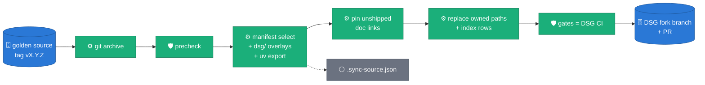
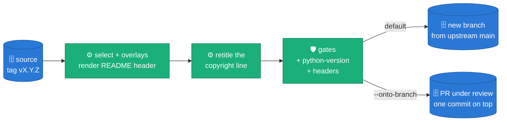

# ADR 0040 — Donated to the Dataflow Solution Guides; this repository stays the golden source

**Status:** ACCEPTED (2026-09-14) — **amended 2026-09-19** after the first DSG review ([Amendment](#amendment-2026-09-19--the-first-dsg-review-pr-289): what ships, headers, provenance, publishing onto a PR under review) · **amended 2026-09-26** after the merge ([Amendment](#amendment-2026-09-26--aligned-with-the-dsg-baseline): Python 3.14, Beam 2.76). Laptop-proven: the sync, precheck and Terraform gates are green. The acceptance gates still outstanding are DSG CI on the first sync PR and a live Dataflow run of the DSG launch scripts.
**Target:** [GoogleCloudPlatform/dataflow-solution-guides](https://github.com/GoogleCloudPlatform/dataflow-solution-guides) (the DSG)
**Runbook:** [`.claude/skills/dsg-sync/SKILL.md`](../../.claude/skills/dsg-sync/SKILL.md) · `/dsg-sync <ref>`
**Relies on:** [ADR 0009](0009-single-flex-template-image.md) (one image, two entrypoints) · [ADR 0032](0032-relationships-as-config.md) (relationship models as config)

## Context

The solution is donated to the DSG as a batch guide: a pipeline directory,
a Terraform module and a use-case page. Both repositories are public and
both will keep changing. Without a rule, the copy drifts: reviewers edit
it, the source moves on, and each later donation becomes a merge.

The DSG also has its own contract, and it differs from this repository's:

| Concern | This repository | DSG CI (`.github/workflows/pull_request.yml`) |
| :-- | :-- | :-- |
| Dependencies | uv workspace, `uv.lock` | pipenv + `requirements*.txt` + top-level `setup.py` |
| Style | ruff + mypy | yapf `--style yapf` + pylint with `pipelines/pylintrc` (Google style) |
| Tests | `pytest` over `packages/sdfb-tests/tests` | `pytest tests/` in the pipeline directory |
| Infrastructure | bring-your-own (docs) | Terraform per guide, Fabric modules, a generated `scripts/00_set_variables.sh` |

The donation also exposed a hazard. Content derived from a real source
table had been committed here and was public. A copy must never be the
place where that is discovered.

## Decision

**D1 — One direction, one source.** Everything under
`pipelines/synthetic-llm-dataflow-bigquery/`,
`terraform/synthetic-llm-dataflow-bigquery/` and
`use_cases/Synthetic_Data_Generation.md` is generated from one ref of this
repository and replaced wholesale on every sync. `.sync-source.json` records
the ref and sha. A change requested on the DSG side is made here, released,
and synced. DSG commits and PRs carry only the maintainer's git identity: the DSG is
Google-owned, so there are no co-author or tool-attribution trailers and no AI footers.
Each ref is published on its own fork branch, `sync/<pipeline>-<ref>`, so the
PR head names the version under review. Publishing closes the older open sync
PRs from the fork, leaving one PR open.

**D2 — The DSG contract lives here, as an overlay.** DSG-only files are
versioned in `dsg/`: launch scripts `01`–`05`, `setup.py`, Cloud Build
configs, the `tests/` wrapper, the Terraform module, the use-case page and
the README header. `dsg/manifest.yaml` states what else ships, which DSG
paths are owned, and the index rows (one row per DSG index table, applied
idempotently). It also lists `patches`: exact line replacements in DSG files
outside the owned paths, each with a reason. They carry fixes the guide needs
from DSG itself, such as its CI, while the upstream change is under review. A
patch is a no-op once its replacement has landed upstream, and it stops the sync
if neither side is found. An old tag syncs with the manifest it shipped with.

**D3 — Derive, don't duplicate.**
- `requirements*.txt` come from `uv export` of `uv.lock`, so pins cannot diverge.
- Links to documents that don't ship are rewritten to the golden source at the synced sha, so the copy stays small without dead links.
- The image tag and `setup.py` version come from the synced ref.

**D4 — This repository adopts DSG code style natively.** yapf (`--style
yapf`) and pylint with a vendored copy of the DSG `pylintrc` (`dsg/pylintrc`)
gate this repository's CI. Code is copied byte-for-byte, with no reformat on
the way out. The sync fails if DSG's `pylintrc` changes (`pylintrc-parity`),
so the rule cannot silently fork.

**D5 — A sensitive-content gate runs on both sides.**
`scripts/dsg/precheck.py` rejects:
- forbidden paths (evidence bundles, run journals, credentials);
- secret patterns, card numbers (checksum-validated), IBANs (checksum-validated);
- e-mail addresses outside an allowlist;
- tokens whose salted SHA-256 is in `dsg/sensitive_token_hashes.txt`, so the blocklist never holds the values it blocks.

It gates every source PR and every staged tree before the DSG checkout is touched.

**D6 — Gates mirror DSG CI and run before any commit.** The gates are:
precheck, pylintrc parity, link check, `bash -n`, yapf + pylint, Terraform
`fmt`/`init`/`validate`/`test`, and the pipenv build (`setup.py sdist`,
`pytest tests/`, `compileall`). Any failure stops the sync before `git
commit`. The PR body carries the gate table. It says "Not yet run in Google
Cloud" unless `--cloud-run` names a verifying job.

**D7 — The demo is relational and public.** The DSG launch generates
`users → orders → order_items` from the fictitious
`bigquery-public-data.thelook_ecommerce` dataset, with
`config/relationships/gcp_public_fk_example.yaml`:
- orders is driven by users;
- order_items is driven by orders, via an edge widened to carry `user_id`, which makes its users edge implied;
- `product_id` comes from an external catalog parent.

Terraform snapshots the sources with their parent filters applied, so the
source has referential integrity. The snapshots and the landing tables keep
the public tables' names and schemas (landing tables are created `LIKE` the
public ones, and the job never creates a table); GEOGRAPHY values are nulled
in the snapshot, because the generator would invent WKT that BigQuery rejects
on load, and an all-NULL column generates NULLs. Every other table is created
from its `config/bq_schema` file. Model weights are staged once from public
Hugging Face (or ModelScope) repositories by Cloud Build, never by Terraform
and never at runtime. The job launches from gcloud or, optionally, from
Terraform with the same parameters. The `gpu` variable ties the GPU to its
machine family and vLLM dtype: an L4 on G2 serves the bf16 checkpoints as
shipped (`auto`), a T4 on N1 serves Qwen downcast to `float16` and never
Gemma, which is not fp16-safe.

## Amendment (2026-09-19) — the first DSG review (PR #289)

The first sync PR was reviewed by a DSG maintainer, who also pushed two
commits onto the PR branch (DSG CI support for `docker/Dockerfile` and for
this guide's Python version). The review changed five things. D1's direction
(fix here, release, sync) is unchanged, and is how every one of them landed.

**A1 — A PR under review is updated in place (amends D1).** Rebuilding the
branch from `upstream/main` and force-pushing would have erased the
reviewer's commits and detached every review thread, and a new tag would
have opened a second PR and closed the first. `--onto-branch BRANCH` fetches
the fork's branch, bases on its tip, replaces the owned paths, and publishes
**one new commit with a plain push**. A push that is not a fast-forward stops
the sync; it never forces. The PR keeps its number, its threads and the
reviewer's commits; only its title and body move to the new ref. The default
path (a fresh versioned branch, older sync PRs superseded) is unchanged and
is what a sync after the merge uses.

**A2 — The guide ships one design document, not the decision records
(amends D2).** `docs/adr/**` and `docs/designs/**` read as a development log
to someone adopting the guide. They stay here. `docs/DESIGN.md` ships, with
the figures it embeds, and its ADR reference map is the one place an ADR
number is paired with a section. Code still cites decisions by number, so
each shipped module that does names the section to read in its docstring
(`scripts/doc/sync_design_refs.py` derives the line from the map, and CI
fails when a cited ADR has no row). Links to the records are pinned to this
repository by the link rewrite D3 already had.

**A3 — One copyright header, two holders, the same lines (amends D4).** The
DSG requires the identical `Copyright <year> Google LLC` Apache header on
every source file. Every source file here carries the same block under this
repository's holder (`scripts/dsg/headers.py`, gated in CI), and staging
rewrites **only the holder line**. "Byte-for-byte" in D4 therefore becomes
"line-for-line": a traceback names the same line in both trees. The `headers`
gate fails the sync on a missing block, another holder, or the source holder
named anywhere in the staged tree.

**A4 — No provenance file, no licence copy (amends D1 and D3).**
`.sync-source.json` and `LICENSE` do not belong in the DSG. The README header
names the release and the commit instead, and the sync reads that line (or
the `Source:` trailer of the last sync commit) to build the compare link. The
`setup.py` version and the Terraform image tag are the static guide version,
as in the other guides; D3's "come from the synced ref" no longer holds.
Without the file, Terraform had silently tagged images `dev`. The guide's
wording no longer claims an automated synchronization: it says where the
pipeline is developed and which release the copy corresponds to.

**A5 — One Python version, from one file (adds to D6).** The review found the
container on 3.11 and the shipped `.python-version` on 3.12. The cause was a
second `.python-version` in the `dsg/` overlay that replaced this
repository's own. The overlay copy is gone, `requires-python` admits exactly
one minor, and the `python-version` gate compares every pin (Beam SDK and
launcher images, site-packages paths, Cloud Build images, ruff and mypy
targets) with that file. The guide stays on 3.11 because every Dataflow run
to date used the 3.11 image. The DSG's other guides run 3.13 and 3.14, which
this stack cannot reach yet: `whylogs-sketching`, the compiled backend of the
profiler, publishes wheels up to CPython 3.12
([PyPI](https://pypi.org/project/whylogs-sketching/#files), checked
2026-09-19).

## Amendment (2026-09-26) — aligned with the DSG baseline

PR #289 merged on 2026-09-25 with the guide marked beta. The maintainer's
[comment](https://github.com/GoogleCloudPlatform/dataflow-solution-guides/pull/289#issuecomment-5837875462)
names the baseline the rest of the repository runs: Python 3.14, Beam 2.76,
Cloud Foundation Fabric v58. Fabric was already at `v58.0.0`.

**A6 — Python 3.14 and Beam 2.76 (supersedes A5's choice of 3.11).** A5's
blocker was not a real dependency: `whylogs` was declared in `sdfb-beam` but
no module imports it (the profiler DoFn it was meant for was never built).
Dropping it removes `whylogs-sketching`, and every other locked package
publishes a CPython 3.14 wheel for linux x86_64. `ml_ai_python` already runs
vLLM and torch on 3.14 with Beam 2.76 on L4 workers. Beam 2.76 also drops
`envoy-data-plane`, so the `betterproto==2.0.0b6` pre-release constraint
goes with it. A5's single-source rule is unchanged: `.python-version` now
says 3.14, and the `python-version` gate holds every other pin to it. The
Beam SDK image and the `apache-beam` wheel move together
(`apache/beam_python3.14_sdk:2.76.0`, `apache-beam[gcp]==2.76.0`), as do the
launcher base (`python314-template-launcher-base`) and the model-staging
Cloud Build image. F-string fields keep their single quotes: 3.14 accepts
reused quotes ([PEP 701](https://peps.python.org/pep-0701/)), but yapf 0.43,
the latest release and the DSG's pin, cannot parse them. Laptop gates are green on
3.14. Dataflow acceptance is a corp end-to-end run on the rebuilt image
before the next sync.

## Alternatives considered

- **[Copybara](https://github.com/google/copybara)** (Google's tool for
  moving code between repositories with transformations). It fits the
  problem and is the model for D1–D3, but it needs a JVM toolchain and its
  own configuration language for a one-origin, one-destination flow. The
  manifest plus a tested Python script covers what we need; migrating to
  Copybara stays open if more destinations appear.
- **`git subtree` / submodule into the DSG.** Rejected: the DSG layout
  differs from this repository's (overlays, generated files, pinned links),
  and a subtree would carry this repository's full history into the DSG.
- **Manual copy per release.** Rejected: that is how drift and leaks start.

## Consequences

- One reformat commit touches every Python file; it is listed in `.git-blame-ignore-revs`.
- DSG review comments cost a release cycle, not a direct commit. The PR body and the DSG `AGENTS.md` section say so.
- The DSG copy keeps only the documents the code cites (ADRs, designs, three guides). Everything else stays here, one pinned link away.
- CI here grows by the precheck, yapf and pylint steps.

## Acceptance criteria

1. `uv run python scripts/dsg/sync.py --ref <tag> --dsg <checkout> --gates full` passes every gate on a clean DSG checkout.
2. A second run with the same ref produces no diff in the DSG checkout (idempotence).
3. The DSG PR's `Build and validation` checks are green.
4. `scripts/04_run_dataflow.sh` then `scripts/05_verify_run.sh RUN_ID` report zero PK duplicates and zero FK orphans on a live project.
