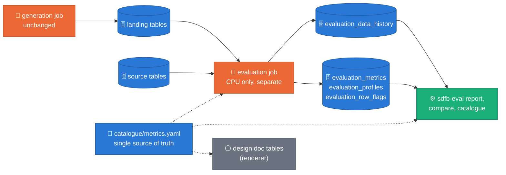
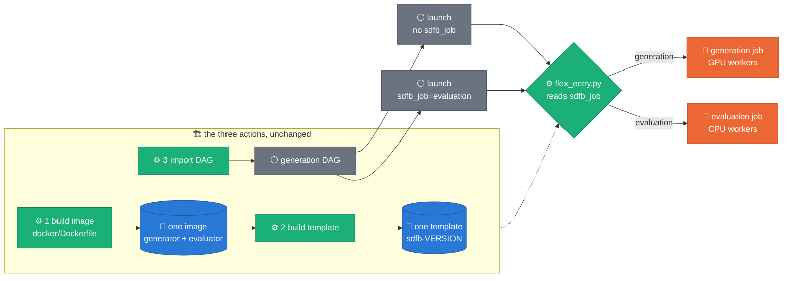
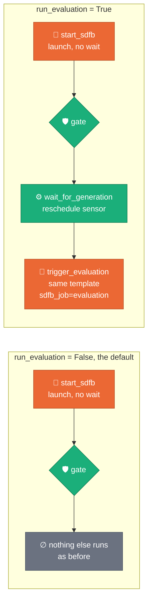

# ADR 0041 — Evaluation is a standalone package and a separate job

**Status:** ACCEPTED (2026-10-05) — **built and reviewed on a laptop; not yet run on Google Cloud.** The statistics, planning, Beam transforms and the composed pipeline are tested on invented data with an in-process Beam runner and fake BigQuery clients. The `sdfb-eval` command line has run on invented data only. The scoping SQL (`APPENDS`, time travel, snapshot clones) has been generated and unit-tested as text and never executed by BigQuery. The CPU image has never been built, the flex template never launched, and the Composer DAG never parsed by Airflow. The acceptance gate still open is the first run on GCP (criteria 5-13 of the design's §11). **Amended 2026-10-06:** the evaluator has no image, template or DAG import of its own any more; see [the amendment](#amendment-2026-10-06-one-image-one-template) at the end.
**Design:** [`2026-07-07-evaluation-framework-design.md`](../designs/2026-07-07-evaluation-framework-design.md) · section [§11 of `DESIGN.md`](../DESIGN.md#11-evaluation-sdfb-evaluation)
**Package:** [`packages/sdfb-evaluation/`](../../packages/sdfb-evaluation/README.md) (evaluator `0.1.0`, metric catalogue `1.0.0`)
**Relies on:** [ADR 0001](0001-no-managed-gcp-services.md) (no managed GCP services) · [ADR 0009](0009-single-flex-template-image.md) (dispatch entrypoint) · [ADR 0022](0022-stats-driven-generation.md) (the literal policy) · [ADR 0032](0032-relationships-as-config.md) (relationship model) · [ADR 0040](0040-dsg-donation-golden-source-sync.md) (the DSG manifest)
**Supersedes:** the evaluation proposal of 2026-07-07 (an in-job evaluation branch, three metric tiers, one history table). None of it was merged.

## Context

The first evaluation design was built on the branch `ws3-eval-framework`: a
post-`WriteLanding` branch inside the generation pipeline, a single
`EvaluationDoFn` fed by a stratified reservoir sample, SDMetrics quality and
diagnostic reports on a pandas frame, a memorization gate that failed the
generation job, and one history table. Reading it against what the evaluation
has to answer shows structural limits, not bugs to patch:

| Limit of the in-job branch | Why it matters |
| :-- | :-- |
| Fidelity is read against the generator's own reference sample | A generator that copied the 10k sample would score perfectly. The honest floor is how far the sample itself sits from the full source |
| A fixed threshold, no noise floor | At small n sampling noise crosses it; at tens of millions of rows every difference is "significant" ([Lin, Lucas & Shmueli 2013](https://doi.org/10.1287/isre.2013.0480)) |
| It runs inside the generation job, on one worker, on a sample | Evaluation cost and failure are coupled to generation, and the metrics are limited to what one worker holds in memory |
| A metrics library and pandas on the runtime path | Heavy dependencies in the generation image, and a metric whose definition is whatever the library does |
| A memorization gate that fails the generation job | A measurement outcome would change whether data landed |
| One history row per run | No per-column, per-pair, per-edge or per-table grain to query; the details sit in one JSON blob |

The same design had to respect the standing constraints: nothing managed, no
Vertex, Dataplex or Looker ([ADR 0001](0001-no-managed-gcp-services.md)), and
results in BigQuery tables and local or object-store files only.

## Decision

**Claim:** evaluation is a separate CPU job that shares files with the generator, never code, and answers one question per metric row: how far is this unit of the synthetic data from the source, and is that distance more than sampling noise?

Evaluation is its own job, started after generation, reading the landing
tables and the source and writing four tables in `synthetic_data_quality`.
The generation job is not touched. A status describes the run
(`SUCCEEDED`, `PARTIAL`, ...), not the data: a run whose metrics fail still
succeeded, and evaluation never fails the generation run. A calling script may
turn metric statuses into an exit code with the optional `--fail_on`, and
nothing more.

**D1 — A standalone nested project.** `packages/sdfb-evaluation` is not a
workspace member: the root `[tool.uv.workspace]` has
`exclude = ["packages/sdfb-evaluation"]`
([uv workspaces](https://docs.astral.sh/uv/concepts/projects/workspaces/)). It
has its own `pyproject.toml`, `uv.lock` and Python 3.11 pin. A fourth member
would break `docker/Dockerfile` (it copies three member project files, then
syncs every package) and the DSG unit, which ships the root project file and
lock ([ADR 0040](0040-dsg-donation-golden-source-sync.md)). A later bump of
Python or Beam touches this package alone. A CI job installs it from its own
lock and asserts that no generator module is importable.

**D2 — Parity by two-sided golden files, never by import.** The few pieces
whose semantics must match the generator (the relationship-model reader, the
reference digest, the reference query, the row-document limit) are
re-implemented. One golden file, produced by
`scripts/evaluation/make_parity_goldens.py` on the originals, is checked from
both sides: a root test proves the originals still produce it, a package test
proves the mirrors do. An AST test fails on any import of `sdfb_core`,
`sdfb_beam` or `sdfb_tests`.

**D3 — The reference sets come from the generator's own order.** R, E, H and
H_E are prefixes of one ranking of the source by row fingerprint (the
`FARM_FINGERPRINT` order of the reference sample, [BigQuery hash
functions](https://docs.cloud.google.com/bigquery/docs/reference/standard-sql/hash_functions)):
R is the sample the generator read, E the prompt-exposed prefix, H the next n
rows (a holdout, after [Platzer & Reutterer 2021](https://doi.org/10.3389/fdata.2021.679939)),
H_E its exposed-sized prefix. R and H are exchangeable, so chance matches fall
on both and a ratio between them does not depend on how dense the value domain
is.

**D4 — Fidelity is measured against the full source, as the job saw it.** The
source is pinned by time travel at the generation job's create time while that
is inside the table's [time-travel window](https://docs.cloud.google.com/bigquery/docs/time-travel).
Every fidelity row also stores `baseline_value = metric(R, source)`, the floor
that a perfect copier of the sample would score.

**D5 — Status reads effect sizes and sampling noise.** A metric warns or fails
only when its value crosses the threshold and that crossing is not explained by
its noise floor. Lifts and the holdout share gate on a confidence bound. No
p-value is reported. Metrics whose raw value depends on sample size (entropy,
distinct count, coverage, DCR, density, detection AUC) are computed at matched
n.

**D6 — Outputs honour the literal policy.** A value is written literally only
when its column has at most 50 distinct source values
([ADR 0022](0022-stats-driven-generation.md)) and the value occurs at least 10
times in the source. Everything else is a keyed hash label, and source keys in
row flags are keyed hashes by default. A value held by a handful of records is
a quasi-identifier ([Sweeney 2002](https://doi.org/10.1142/S0218488502001648)).
The same k = 10 bounds the numeric values a profile publishes: a histogram edge
or a quantile is published only with at least 10 source records at or beyond it
on each side, two published histogram edges are at least 10 source records
apart, and two published quantile probabilities are at least 10 of that side's
records apart. For one column the exact source values it publishes (histogram
edges, the quantile values of every side, the pair axis's labels) come from
that one set of edges. Counts are not values: a profile may still store a
count below 10 (top-k items under hashed labels, null patterns, contingency
cells, length histograms, calendar and shape mixes, a rate or a tail mass with
its n). The design's §4.9 lists those places and the four disclosure channels
that are accepted.

**D7 — The registry is append-only events.** A run writes a `RUNNING` row and
exactly one terminal row (`SUCCEEDED`, `SUCCEEDED_WITH_WARNINGS`, `PARTIAL`,
`SKIPPED`, `FAILED`). The view `evaluation_latest` picks the last event per
`evaluation_id`; `evaluation_latest_per_job` the last final row per generation
job. The terminal row is written after the metric tables' load and copy jobs
have finished, so a row that says a run finished implies its metrics are
readable.

**A separate CPU job.** The evaluation runs on CPU workers from its own image
and flex template (`packages/sdfb-evaluation/deploy/build_flex_template.sh`),
launched by `sdfb-eval run`, by the template, or by a Composer DAG
(`composer/evaluation_framework.py`) that the generation DAG may trigger,
opt-in and off by default. *(Amended 2026-10-06, see [the amendment](#amendment-2026-10-06-one-image-one-template).)* A local run executes on Beam's in-process
`FnApiRunner`; `--runner DirectRunner` is the user-facing spelling. Beam 2.74's
`DirectRunner` hands a batch pipeline to Prism, which could start a step before
its side input was complete in this package's tests (see
[apache/beam#36563](https://github.com/apache/beam/issues/36563), closed), so
the evaluator refuses Prism.

**The catalogue is the single source of truth.** `catalogue/metrics.yaml`
defines every metric once: id, level, family, direction, thresholds, noise
rule, pitfalls and the explanation text. Three readers consume it: the scoring
code, `sdfb-eval report` / `catalogue`, and `scripts/doc/render_eval_catalogue.py`,
which generates the design document's catalogue tables (a CI check fails on
drift). A GUI on another branch reads the same file and the table schemas as
its data contract and grades nothing itself.

**Four tables, two views**, in `synthetic_data_quality` and defined inside the
package (`schemas/`), never under `config/bq_schema/`, which belongs to the
generator's Terraform:

| Table | Grain |
| :-- | :-- |
| `evaluation_data_history` | one row per event (`RUNNING`, `FINAL`) |
| `evaluation_metrics` | one row per metric x table x column, pair or edge |
| `evaluation_profiles` | one row per profile x table x column or edge x side |
| `evaluation_row_flags` | at most `--row_flags_top_k` rows per table and check, expiring after 180 days |

## Consequences

- The generation job, its image, its tests and the DSG unit are unchanged. The
  generator and the evaluator evolve independently, at the price of the
  mirrors of D2, which a golden file keeps honest. *(Amended 2026-10-06, see [the amendment](#amendment-2026-10-06-one-image-one-template).)*
- Evaluation can be re-run on a past generation job while the source's
  time-travel window and the landing table's history allow it; after that the
  source is read as it is now and the plan says so.
- Evaluation needs its own IAM: read on the source and landing tables, job
  listing, Dataflow and log viewing, snapshot permissions on a temporary
  dataset, and write on `synthetic_data_quality` (see
  [`DEPLOYMENT_PREREQUISITES.md`](../DEPLOYMENT_PREREQUISITES.md)).
- Every metric row carries its own noise, so two runs can be compared
  without a significance test; the privacy metrics remain risk indicators,
  not guarantees ([Stadler, Oprisanu & Troncoso 2022](https://arxiv.org/abs/2011.07018);
  [Ganev & De Cristofaro 2023](https://arxiv.org/abs/2312.05114)).
- The old in-job evaluation code (`sdfb_core/evaluation/`, the branch
  `ws3-eval-framework`) is retired by a later task, with its salvage mapped to
  the new modules. Metric tiers 2 and 3 (SDMetrics reports, SynthEval,
  Evidently) are dropped at runtime. Also dropped with the old design, each
  stated here because nothing else records it:
  - The old `profile` module's stratified row sampling and its per-stratum cap.
    The new package samples rows with a deterministic bottom-k hash sample
    (`sampling/reservoir.py`, after [Cohen & Kaplan 2007](https://doi.org/10.1145/1281100.1281133)),
    which is uniform over rows, not stratified. (The value sampling of the
    census is a separate stratified design, design §4.6.) The design gives no
    reason for the change.
  - The in-job lookup of the previous run for a run-versus-run PSI. Two stored
    evaluations are compared with `sdfb-eval compare`, a manual step, which
    gives the PSI only when both runs' histograms carry the same `edges_digest`.
  - The old diagnostic's "data structure" check (synthetic columns equal the
    source columns). The evaluator scores only the columns both sides share,
    records the one-sided columns in a plan note ("columns [...] exist on one
    side only and are not compared", `context/plan.py`), and does not fail on
    the difference; `beam/encode.py` fails only on a row that lacks a plan
    column. A column-set mismatch is therefore reported, not gated.
  - The Evidently HTML drift report as a deliverable and the `--eval_tier`
    knob: the reports are markdown and JSON (`sdfb-eval report`, `compare`),
    and there are no tiers.
- **Unverified until the first GCP run:** the scoping SQL on real BigQuery,
  snapshot creation with the evaluator's roles, the image build and the
  dispatch entrypoint, a template launch, the shuffle prediction against a
  real job, the Composer deferrable wait and failure callback, and the
  deploy workflow substituting `{{EVALUATOR_VERSION}}` into the DAG.
  *(Amended 2026-10-06, see [the amendment](#amendment-2026-10-06-one-image-one-template).)*

## Alternatives rejected

| Alternative | Why not |
| :-- | :-- |
| **The in-job branch** (the 2026-07-07 proposal) | Couples evaluation cost and failure to generation, limits metrics to one worker's memory, and measures fidelity only against the generator's own sample. See Context |
| **A fourth uv workspace member** | Breaks the image build and the DSG unit, and forces the evaluator's Python and Beam pins onto the generator (D1) |
| **SDMetrics at runtime** | Built instead: statistics in numpy and scipy, with the lock holding no pandas and no synthetic-data metrics library (design [§9](../designs/2026-07-07-evaluation-framework-design.md#9-packaging-and-the-dsg-unit)). Several metric names follow [SDMetrics](https://docs.sdv.dev/sdmetrics); no SDMetrics code runs (design [§4.3](../designs/2026-07-07-evaluation-framework-design.md#43-distributions-on-a-fixed-grid)). The design gives no further reason for not using it; the ws3 branch used it on a pandas frame (Context) |
| **SQL-only pushdown** | Built instead: BigQuery SQL for planning (counts, quantile grids, dictionaries, one aggregate scan per table side) and one Beam graph for the per-row pass, which encodes each row once (design [§5.1](../designs/2026-07-07-evaluation-framework-design.md#51-planning-before-a-row-is-read), [§5.2](../designs/2026-07-07-evaluation-framework-design.md#52-the-graph)). The design does not state why SQL alone was rejected. Reasoning of this ADR, not measured: an exact Gower nearest-neighbour search and a classifier are not expressible in standard BigQuery SQL |
| **Beam `ApproximateQuantiles`** | The first plan considered it; the build replaced it with a planning-time grid. Built instead: planning asks BigQuery for a 1,001-point grid per side ([`APPROX_QUANTILES`](https://docs.cloud.google.com/bigquery/docs/reference/standard-sql/approximate_aggregate_functions)) and the Beam pass counts every row exactly against that fixed grid. The design's reason: "A column of a hundred million rows cannot be sorted in a Beam combiner, and it does not need to be"; two passes, plan then count, replace a sort (design [§4.3](../designs/2026-07-07-evaluation-framework-design.md#43-distributions-on-a-fixed-grid)). No other reason is recorded |
| **A gate inside generation** | Evaluation is post-hoc by decision; the generation job keeps its own blocker rules |
| **p-values** | At scale everything is significant; each row carries a noise floor instead (D5) |

## Amendment (2026-10-06): one image, one template

**Status of the amendment:** built and tested on a laptop. The image has not
been built, the template has not been launched, and Airflow has parsed neither
DAG. Everything below about a build, a launch or a DAG run describes what the
files are written to do.

**Claim:** the deployment's three existing actions (build the image, build the
template, import the generation DAG) are enough to generate and to evaluate.
Evaluation stays a separate package and a separate job; what it loses is an
image, a template and a DAG import of its own.

**Why.** Two reasons, both about the deployment and neither about the
statistics:

1. The deployment has three actions and must need no fourth. The first design
   (above, "A separate CPU job") needed a second image build, a second template
   build and a second DAG import with a marker of its own.
2. The generation job records `relationships_uri=config/relationships`, a
   folder inside the generator's image, and the evaluator reuses the recorded
   value. In an image of its own that folder does not exist, so planning a
   relational launch would fail. The shared image carries the folder.

*One image and one template serve two jobs; the template parameter `sdfb_job`
picks the entry. Implemented in `docker/flex_entry.py::main`.*

| | Before this amendment | Now |
| :-- | :-- | :-- |
| Image | the generator's, and a CPU image for the evaluator | one, `docker/Dockerfile`: it also carries the evaluator's source, which runs on the environment `uv sync` installs for the generator |
| Entry | each image ran its own file | one dispatcher, `docker/flex_entry.py`, which reads `sdfb_job` and calls the generator's or the evaluator's `main` |
| Template | one per image | one, whose metadata declares the generator's parameters, `sdfb_job` and the evaluator's; every parameter is optional |
| Orchestration | the generation DAG triggered a second DAG | the generation DAG waits for its own job and launches the evaluation itself; the second DAG is optional |

**What did not change.** The package is still a standalone project with its own
`pyproject.toml` and `uv.lock` for development and CI (D1), and neither side
imports the other (D2): the dispatcher is the only file that names both. The
evaluation is still a separate Dataflow job after generation, on CPU workers,
that never gates or fails the generation run. The four tables, the two views,
the registry's events (D7) and the command line are untouched.

**A1. One image.** `docker/Dockerfile` copies the evaluator's `src` through a
throwaway [build stage](https://docs.docker.com/build/building/multi-stage/)
that copies `packages/` and looks for the directory in shell, so the same file
builds in a tree without the evaluator (the DSG copy has none; the image then
runs generation only). There is no second `uv sync` and no second virtualenv.
The source is made importable the way the generator's is: last on the
launcher's `PYTHONPATH`, and as a path line of the worker bridge `.pth`
([`site`](https://docs.python.org/3/library/site.html) adds such a line only
when the directory exists). The existing build argument also sets the
evaluator's worker-image variable, so its workers run this same image
([custom containers](https://docs.cloud.google.com/dataflow/docs/guides/build-container-image)).

**A2. One environment, checked.** The evaluator runs on the generator's
dependency versions, not on its own lock's. Two of its dependencies, scipy and
scikit-learn, are in the image only because an extra of the generator installs
them. Three things turn that into a checked fact: a test that every dependency
the evaluator declares is in the root lock inside its range; a test that the
extras named on the image's `uv sync` line still reach each of them in the
lock's dependency graph; and a build step that imports the evaluator's two
entry modules in the launcher's context and in the worker's, so an image that
lost one fails at build and not at the first evaluation launch
(`packages/sdfb-tests/tests/unit/docker/test_shared_image.py`).

**A3. One template, every parameter optional.** A launch for one job cannot be
made to supply the other's parameters, so the template requires none
([Flex Template metadata](https://docs.cloud.google.com/dataflow/docs/guides/templates/configuring-flex-templates)).
What a job needs is refused by its own argument parser, in the launcher. The
three names both jobs use (`relationships_uri`, `run_id`, `thresholds_uri`)
appear once; `run_id` loses its pattern, because both parsers take any text
and an evaluation may pass it empty.

*The two modes of the generation DAG's `run_evaluation` parameter
(`composer/synthetic_beam_bigquery.py`).*

**A4. The chain is inside the generation DAG.** `start_sdfb >>
run_evaluation_gate >> wait_for_generation >> trigger_evaluation`. The wait is
a sensor in [reschedule mode](https://airflow.apache.org/docs/apache-airflow/stable/core-concepts/sensors.html),
which holds no worker slot between two reads of the job's state and needs no
triggerer; it is stated as not deferrable because the environment may have
none. `trigger_evaluation` launches the same template with
`sdfb_job=evaluation` and the generation job's id, as a CPU job in the
generation job's network, and does not wait. It also passes Beam's own
[`disk_size_gb`](https://docs.cloud.google.com/dataflow/docs/reference/pipeline-options):
the evaluation job's workers unpack the same multi-GB image and the evaluator
pins no boot disk, where the generator pins one for itself.

**A5. The standalone DAG is the optional path.** `composer/evaluation_framework.py`
launches from the same template, reads the marker the import workflow already
substitutes for the generation DAG, and keeps what the chain does not have: a
launch that waits for its job and a failure callback that closes the registry
row. It accepts a list of generation job ids and then starts one run of itself
per id, so the per-job path is the reviewed one. The evaluator's CPU
`Dockerfile` stays for the package copied out as a unit of its own, and its
build script now builds only a template from an existing image.

**Costs.**

- The evaluation job's workers pull and unpack the large GPU image: a slower
  start than a small CPU image, and a 200 GB boot disk per worker.
- The evaluator runs on the generator's versions. They are inside its declared
  ranges and guarded as in A2; the evaluator's own suite was also run once on
  the root lock's versions on a laptop and passed. On a worker, packages the
  Beam base image installs globally come ahead of the image's virtualenv on the
  path, as they always have for the generator: which numpy, scipy and
  scikit-learn a worker imports is unverified until a real job.
- The template no longer refuses a generation launch that lacks a required
  parameter: the launcher does, a moment later, and the launch's job fails
  there.
- A chained evaluation that dies after it was launched leaves its `RUNNING`
  row open. Nothing in the generation DAG closes it; a run of the standalone
  DAG for the same job is the path that does.
- The copy that ships to the Dataflow Solution Guides has a `Dockerfile` and a
  template metadata that mention an evaluator it does not ship.

**Unverified until a real build, launch and Airflow parse:** the image build
with and without the evaluator's directory; the import check in both contexts;
the dispatcher under the template launcher; a template with every parameter
optional; the sensor's behaviour when the generation job fails or is
cancelled (the provider's source was not available to read); `maxWorkers`
rendered as a string; the boot disk reaching the evaluation job's workers; the
standalone DAG re-triggering itself.

**Note (2026-10-08): the template's name for the generation job is
`generation_job_id`.** The first chained launch reached the evaluator without
its target: the Flex Template Python launcher logged `Skipping dissallowed
override: job_id` and ran the entry with no `--job_id`, so the evaluator
refused to start (exit 2). The launcher owns a few option names for Python
([the documented five are `runner`, `project`, `job_name`, `template_location`
and `region`](https://cloud.google.com/dataflow/docs/guides/troubleshoot-templates));
`job_id` is not among them, and the log line is the evidence that it is dropped
too. A template launch therefore names the generation job
`generation_job_id`, in both metadata files and in both DAGs. In the CLI it is
a second option string of the same argument, so `--job_id` still works, and is
still the name the documents use, for a direct command line. A test now holds
every template parameter clear of the six names.

## Sources

[Lin, Lucas & Shmueli 2013](https://doi.org/10.1287/isre.2013.0480) (p-values at scale) ·
[Stadler et al. 2022](https://arxiv.org/abs/2011.07018) and [Ganev & De Cristofaro 2023](https://arxiv.org/abs/2312.05114) (limits of similarity metrics) ·
[Sweeney 2002](https://doi.org/10.1142/S0218488502001648) (k-anonymity) ·
[Platzer & Reutterer 2021](https://doi.org/10.3389/fdata.2021.679939) (the holdout design) ·
[BigQuery time travel](https://docs.cloud.google.com/bigquery/docs/time-travel),
[table snapshots](https://docs.cloud.google.com/bigquery/docs/table-snapshots-intro),
[`INFORMATION_SCHEMA.JOBS`](https://docs.cloud.google.com/bigquery/docs/information-schema-jobs) ·
[Dataflow Flex Templates](https://docs.cloud.google.com/dataflow/docs/guides/templates/using-flex-templates) ·
[uv workspaces](https://docs.astral.sh/uv/concepts/projects/workspaces/) ·
[apache/beam#36563](https://github.com/apache/beam/issues/36563). The full list, each fetched and checked, is the design document's §14.
