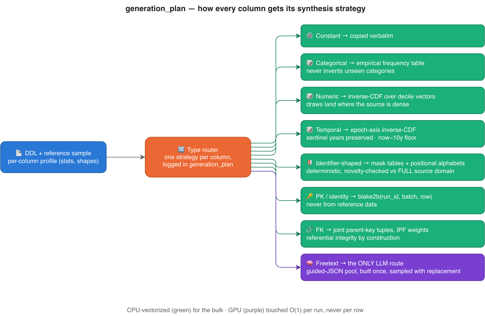

# Building Banking Synthetic Data for a Lakehouse with Gemma — Part 1: why, what, and the shape of the machine

*Self-hosted LLM generation on Apache Beam / Dataflow / BigQuery — the series
behind the Apache Beam Summit 2025 session of the same name.*

## The problem nobody is allowed to solve the easy way

Every data team I've worked with has the same recurring conversation. Someone
needs realistic rows outside production — an integration test, a demo
environment, an ML prototype, a partner enablement — and the table they need
is exactly the one they cannot copy: accounts, movements, customer records.

The easy exits are all blocked in a regulated (banking) environment:

- **Masking** degrades the statistics you were trying to keep — masked joins
  stop joining, masked amounts stop being skewed the way real amounts are.
- **Manual fixtures** don't scale past a demo, and they encode one
  engineer's guesses about what the data looks like.
- **"Just ask ChatGPT for lookalike rows"** means sending real schema and
  sample values to an external AI API. In a bank, that sentence ends the
  meeting.

So the interesting version of the problem has hard constraints baked in:
produce **fictitious-but-realistic rows for any BigQuery table**, driven only
by its DDL and a bounded reference sample, where **no data, prompt, or model
call ever leaves your own cloud project** — no external LLM APIs, no model
hubs at runtime, open-weight models only, and **memorization measured and
gated on every run**. That framing aligned well enough with what the
community cares about that it was accepted for presentation at Apache Beam
Summit 2025 — which is also why this series exists: the design deserves a
longer conversation than a conference slot.

## The shape of the machine

One Dataflow job reads a table's DDL plus a deterministic ≤10k-row reference
sample, generates rows on GPU workers where a **vLLM server runs inside the
worker itself**, validates everything in-pipeline, and writes three kinds of
output back to BigQuery: the landing table, a dead-letter queue with every
rejected row, and an audit trail.

*One Dataflow job generates parent and child tables with FK integrity by
construction — and nothing leaves the project boundary:*

Three decisions define the architecture, and each will get its own deep-dive
article:

1. **The LLM runs O(1) times per run, never per row.** The naive design —
   "prompt the model for each row" — is unaffordable at 10M rows and
   unnecessary. Instead, the LLM's job is to infer *per-column value pools
   and distributions once*; the bulk of row synthesis is vectorized NumPy on
   CPU. A 10M-row run touches the GPU for minutes, not hours.
2. **The LLM server lives inside the Beam DoFn lifecycle.** Each worker
   warm-pulls open-weight model checkpoints (Qwen / Gemma) from GCS to local
   SSD once, then spawns a single vLLM server subprocess it owns — VRAM is
   measured before spawn, threads share the server, and a lost spawn race
   adopts the healthy server instead of killing it. No Vertex AI, no
   external serving layer, no Hugging Face Hub at runtime.
3. **Two interchangeable engines behind one interface.** `b1_rag` embeds the
   reference sample, retrieves representative exemplars with exact FAISS
   search, and has the LLM infer value pools; `b2_library` wraps an
   open-source tabular synthesizer (`sdgx`) fitted once per worker, with the
   LLM only patching free-text columns. Same pipeline, same validation, same
   audit — swap with a flag.

## One plan per run: how each column type is synthesized

The single most useful log line the pipeline emits is the
`generation_plan`: for every column, which strategy will produce its values.
It makes each run's synthesis auditable from worker logs alone — and it is
the map of the whole type system:

*Every column takes exactly one route, and only free-text ever reaches the
LLM:*

A few of these routes hide the most interesting engineering:

- **Numerics and timestamps don't sample uniformly in range.** Uniform
  sampling flattens skewed columns — real amounts cluster, real event times
  burst. Draws go through an inverse CDF built on an 11-point decile vector
  per column, so synthetic values land where the source is dense:

  *Inverse-CDF sampling over decile vectors reproduces distribution shape —
  uniform-in-range sampling destroys it:*

  

- **Categoricals never invent unseen categories.** They reproduce the
  measured frequency table — a 40% / 35% / 25% split of payment types stays
  a 40% / 35% / 25% split, within sampling noise.
- **Identifiers never reach the LLM.** Account-number-shaped strings are
  generated from mask tables and per-position alphabets, and checked for
  novelty against the column's *full* source domain — realistic shape,
  guaranteed non-collision with real keys.
- **Free-text is the only LLM route**, and it is schema-constrained: guided
  JSON decoding fills a bounded pool of novel values that the run then
  samples with replacement. If the LLM path is unhealthy, the run fails
  loudly (`strict_freetext`) instead of silently copying source values —
  because a silent fallback is a privacy leak wearing a green checkmark.

Part 2 unpacks the free-text machinery (pools, thresholds, format gates,
failovers, the RAG interplay); Part 8 covers the statistics.

## The flagship result: referential integrity by construction

Single-table synthetic data is a solved-ish problem. The result that made
this project worth a conference session is relational: generate a parent
table *and* its child table so that **every foreign key in the child
resolves to a generated parent row** — not by post-hoc repair, but by
construction.

The mechanism, in one paragraph: relationships are declared in versioned
YAML config (never inferred from table descriptions); one Dataflow job
generates parents first and hands their keys to the child generation as a
side input; child FK columns are drawn as **whole key tuples from observed
parent combinations**, weighted so the child's marginal distributions
survive; and an orphaned child row is a BLOCKER-severity defect that fails
the run.

*Drawing FK columns independently produces orphans at scale; drawing joint
key tuples produces zero:*

Measured on the acceptance pair (1M and 10M rows per table, FK enforced):
**0 orphans in 10,000,000 child rows**, verified by an independent SQL full
join — not by the pipeline grading its own homework. Part 6 tells the whole
story, including the measured failure mode that motivated joint draws (an
early two-table run with per-column draws produced 81.8% orphans).

## The vocabulary this series will use

Twelve terms carry most of the series; each is *as implemented*, not
textbook-general:

1. **Reference sample** — the deterministic ≤10k-row sample of the real
   table; every statistic is measured from it, and it is all the pipeline
   ever reads.
2. **Fidelity** — how closely synthetic statistics match the source's.
3. **Memorization** — synthetic rows identical to real rows; any identical
   match fails the run.
4. **Copy rate** — the fraction of a column's synthetic values appearing
   verbatim in the source; gated on high-cardinality columns.
5. **Pool** — a bounded, deduplicated set of LLM-generated values per
   free-text column, built once, persisted, sampled with replacement — the
   reason LLM cost is O(1).
6. **Guided JSON decoding** — constraining the LLM at decode time so output
   must parse against a schema; malformed output is impossible by
   construction.
7. **DLQ** — the dead-letter table receiving every rejected row with full
   error context; nothing is silently dropped.
8. **Blocker gate** — the run-level check that fails the job when
   blocking-severity defects exceed the environment's budget.
9. **Decile vector** — an 11-point quantile summary of a column's
   distribution shape; the input to inverse-CDF sampling.
10. **Entropy** — how evenly a column's values spread; the skew measure that
    distinct counts can't provide, and a free mode-collapse detector.
11. **Orphan rate** — the fraction of child rows whose FK matches no parent
    row; the relational quality gate (measured: 0/10M).
12. **Generation plan** — the per-run log of which strategy every column
    got; the audit trail this whole section was reading.

The full glossary (40+ terms, including the statistical machinery) lives in
the project README.

## Where this series goes

1. **This article** — why, what, and the shape of the machine.
2. **Type system & freetext resolution** — the router, pools, thresholds,
   failovers, and how RAG feeds the prompts.
3. **Common runtime** — the CPU/GPU split, vLLM serving inside Beam,
   uniqueness enforcement, DLQ, autoscaling.
4. **b1_rag deep dive** — embedders, FAISS, retrieval geometry, byte-level
   decisions.
5. **b2_library deep dive** — wrapping an open-source synthesizer without
   losing the privacy gates.
6. **Relational generation by construction** — the 0/10M-orphans story.
7. **Integration testing with GitHub agents** — prompts as test
   interpreters, metrics contracts, redacted evidence bundles.
8. **Stats, stress & scale** — the fidelity math and the 1M/10M performance
   anatomy.
9. **CI/CD & infra** — flex templates, registries, dtype maps, GPU machine
   matrix.
10. **Evaluation framework** — once it merges.

If you run Beam or Dataflow in production, work on synthetic data or LLM
serving, or see a decision here you'd have made differently — I want to hear
it. The comment section is part of the project: corrections, experiment
ideas, and "have you tried X" all feed the backlog (candidate next
experiments already include vLLM serving tweaks and fraud/anomaly-detection
pipelines on the same substrate).

---

*Provenance (dropped on Medium): sources and figures per front-matter;
measured claims verified at repo commit `c1e4b4c` (v0.1.0 era). Figures:
`architecture-overview.png` + `generation-plan-routing.png` (drawio sources
committed side-by-side), `stats-inverse-cdf.png` + `fk-orphan-rate.png`
(generated by `scripts/doc/` figure scripts from `MEASURED`/`CONCEPT`
blocks).*
