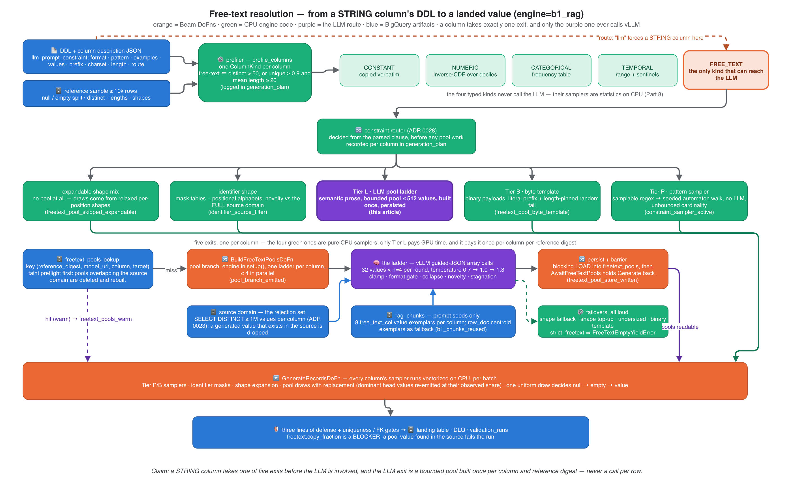
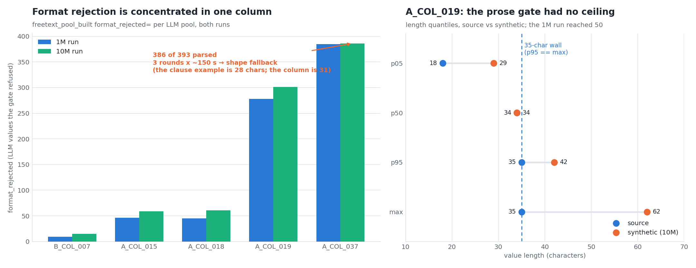
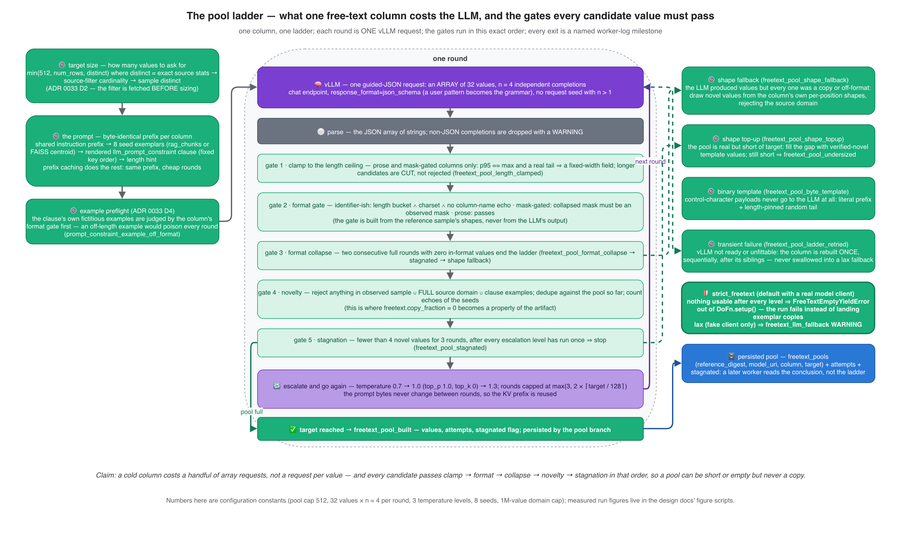
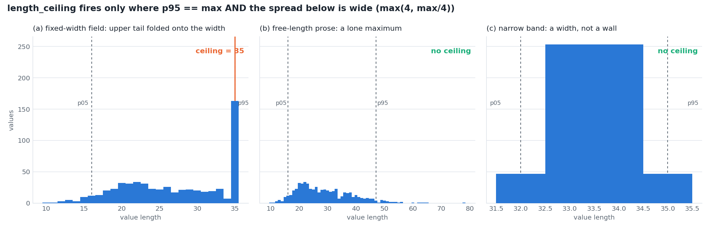
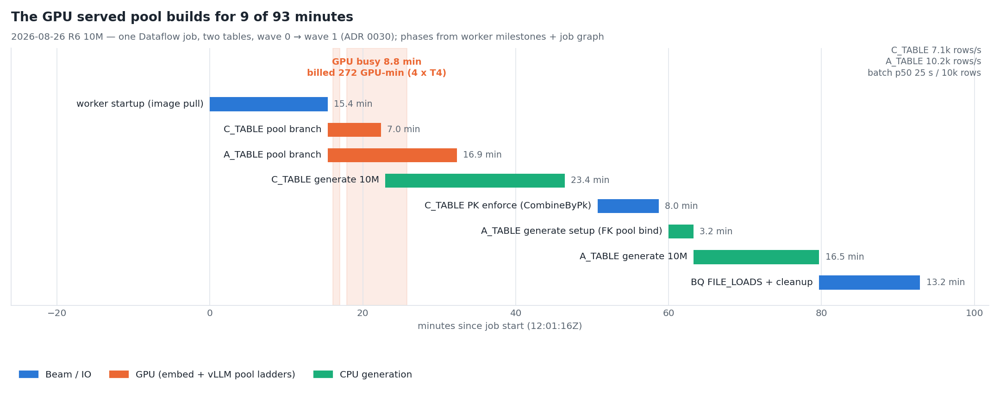
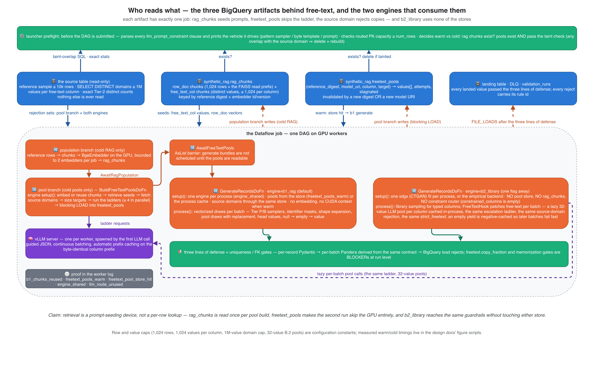
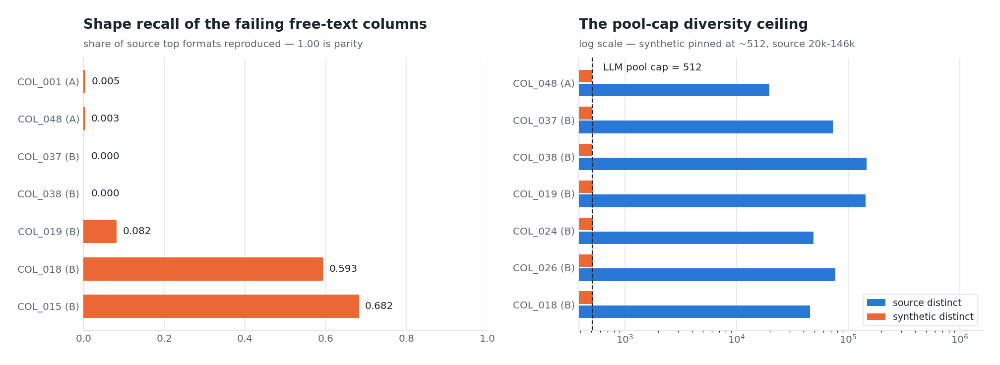
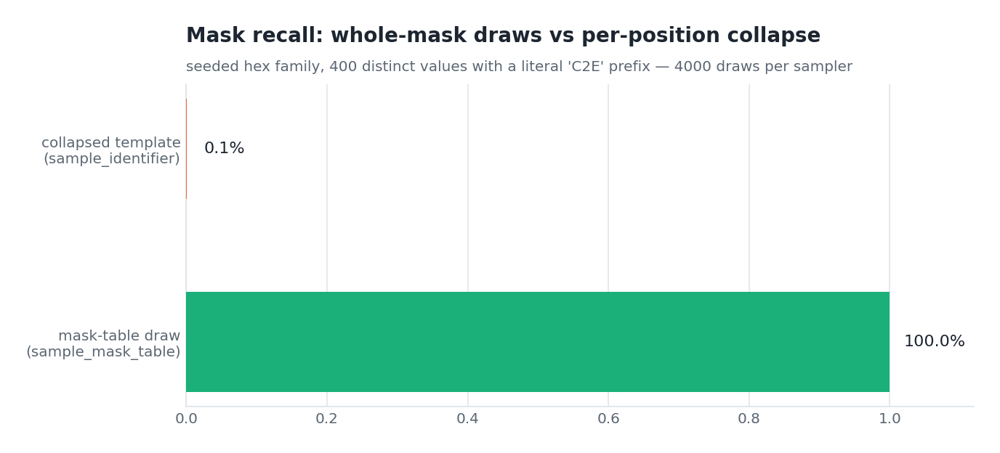

# LLM and Statistical Synthetic Data with Dataflow — Part 2: the type system, and how free-text is actually resolved

*Self-hosted LLM generation on Apache Beam / Dataflow / BigQuery — Part 2
of the series behind the Apache Beam Summit 2025 session "Building Banking
Synthetic Data for a Lakehouse with Gemma".*

Part 1 ended on one log line: the `generation_plan`, which says for every
column of the target table which strategy will produce its values. This
part is about the strategy that everyone asks about first and trusts
least — the free-text route, the only one that reaches the LLM on its own —
and about the type system that decides, column by column, whether a value
is copied, sampled from statistics, walked out of a regex, or generated.

The short version, before the diagrams: **a STRING column takes one of
five exits, and only one of them ever calls vLLM. That exit builds a
bounded pool of novel values once per column, persists it, and the run
samples from it.** Every value in that pool has passed the same gates in
the same order, and the loudest gate is "does this value exist in the real
table?" — if it does, the value is dropped, and if the run lands one
anyway, the run fails.

## Where Part 1 stopped: one route per column

*Every column takes exactly one route — free-text is the only route that
reaches the LLM automatically, and a DDL-declared override can force more
columns onto it:*


The router behind that figure is not a classifier trained on anything. It
is a **profiler** that reads the BigQuery DDL type, the ≤10k-row reference
sample, and the column's description JSON, and applies a fixed decision
order. The order matters more than the thresholds, so here it is verbatim
from the code (`profile_columns` in the B.1 engine):

1. Parse the column description for an `llm_prompt_constraint` clause. If
   it says `route: "llm"`, remember that: it will short-circuit steps 2, 5
   and 6 for a STRING column (and be refused, loudly, on any other type).
2. Exactly one distinct non-null value and no nulls → **constant**, copied
   verbatim.
3. Numeric BigQuery types → **numeric**, sampled through an inverse CDF
   over the column's decile vector (Part 8 owns the math). Twenty or fewer
   distinct values demote to categorical — a "number" with five values is
   a code list.
4. STRUCT / REPEATED → categorical over the JSON rendering.
5. String-like types → the string profiler, below.
6. Temporal types → **temporal**, range-sampled with the observed
   sentinel years (0001, 9999) re-injected at their observed frequency.
7. Anything else (BOOL, unknown) → **categorical**.

Nulls and trimmed-empty strings leave the value stream before any of this
and come back at generation time as a single uniform draw per value:
null → empty → substantive value, at the observed shares. A column that is
91% empty stays 91% empty.

The string profiler is where the interesting decisions live. Its rules and
defaults, in the order they are applied:

| Rule | Default | What it decides |
|---|---|---|
| free-text test | more than 50 distinct values, **or** unique ratio ≥ 0.9 and mean length ≥ 20 | a STRING is free-text unless it is a code list |
| head values | share ≥ 5% of rows, at least 10 rows, at most 8 values | dominant literals (an `N/A`, a default label) are re-emitted at their exact share, not "generated" |
| temporal-shaped string | parses as a date/time | leaves the string route for the temporal sampler |
| identifier shape | fixed length ≥ 8, no whitespace, every position resolves to a literal or a narrow character class | account-number-shaped strings never reach the LLM: mask tables + per-position alphabets |
| free-text seeds | up to 64 distinct exemplars | what the LLM will be shown, later, as "values like these" |
| otherwise | — | categorical: reproduce the frequency table |

Two of those rows are privacy decisions dressed as type decisions. The
identifier exit exists because the worst thing a synthetic account number
can do is collide with a real one — so identifiers are generated from the
*shape* of the observed values and checked for novelty against the
column's **full** source domain, not the 10k sample. And the head-values
row exists because an LLM asked for "values like `N/A`" produces variations
of `N/A`; the pipeline copies the literal at its measured share instead.

## Five exits before the LLM

*A STRING column takes one of five exits before the LLM is involved, and
the LLM exit is a bounded pool built once per column and reference
digest — never a call per row:*



Read the figure top to bottom. The profiler produces the five kinds; only
`FREE_TEXT` continues. Then the **constraint router** — decided
launcher-side from the parsed clause, recorded per column in the
`generation_plan`, before any pool work — sends the column to one of five
exits:

- **Tier P — pattern sampler.** The clause carries a *samplable* anchored
  regex (literals, character classes, `\d`, bounded repeats, groups,
  alternation — no `+`/`*`, no backreferences, no lookarounds). A seeded
  automaton walk produces values on CPU. No LLM, no pool cap, unbounded
  cardinality, format rejections impossible by construction.
- **Tier B — byte template.** The observed values are control-character
  payloads (binary stored as STRING). A literal prefix plus a
  length-pinned random tail; the LLM never sees them.
- **Identifier shape.** Decided by the profiler, as above: mask tables and
  positional alphabets, novelty against the full source domain.
- **Expandable shape mix.** Columns whose observed values can be
  templated per position skip the pool entirely and draw from relaxed
  shapes — the skip predicate *is* the draw predicate, so the two can
  never disagree. A column carrying any `llm_prompt_constraint` never
  takes this exit: a clause means the operator wants the constrained
  route, not a template.
- **Tier L — the LLM pool ladder.** Semantic prose. This is the rest of
  the article.

(There is a Tier S on the drawing board — charset/shape prose seeded by a
small LLM pool and expanded by templates. It is deferred, and the ADRs say
so; I mention it only so nobody goes looking for it in the code.)

Why does a type system need a router on top of it? Because the pool route
has a cap, and a cap is fine for prose and fatal for keys. The run that
made this obvious:

*512 values cannot key 1M rows — a declared primary key drew from a
constrained pool while its own pattern clause defined a 10²⁴-value space:*


The key column had a perfectly good regex clause in its description. The
pool route honored it as a *prompt hint*, built its 512 values, and the
uniqueness gate then diverted 999,488 of 1,000,000 rows to the dead-letter
queue as `pk.duplicate` — discovered 37 minutes and 1,586 GPU-seconds
after launch. The fix was not a bigger pool. The fix was that a samplable
`pattern` becomes a **sampler**, and that a launcher preflight now refuses
a run whose routed key capacity is below `num_rows`. Two other findings
from the same run shaped the tiers:

*Guided decoding rejects nothing, the prose clause leaked twelve rejects,
and the binary "fallback" landed verbatim source values against a clause
that said "never copied":*


The left panel is the argument for guided decoding: a pattern compiled
into the decoder's grammar produced zero off-format values, while the
same intent written as prose leaked twelve past the prompt. The right
panel is the argument for Tier B: the pre-router "binary fallback" had
quietly served 58 distinct **real** values from a 19,815-value domain —
copy rate 100%, on a column whose clause forbade copying. A silent fallback
is a privacy leak wearing a green checkmark; now a never-copy clause may
never be served source values, by construction.

## Steering a column: `llm_prompt_constraint` and `route: "llm"`

Everything the router and the ladder know about the operator's intent
arrives through one JSON object in the column's BigQuery description —
on the **landing** table, read live from `INFORMATION_SCHEMA` at launch
(source-table descriptions are deliberately ignored; they carry
production prose). One parse site, one typed model, one deterministic
renderer, shared by both engines:

| Key | Limits | What it drives |
|---|---|---|
| `format` | ≤ 500 chars of prose | the prompt suffix |
| `pattern` | anchored regex, ≤ 200 chars, must compile | **the sampler (Tier P) if samplable; guided decoding otherwise** |
| `examples` | ≤ 8 × ≤ 64 chars, must sit in the observed length bucket and charset | the prompt suffix; also added to the rejection set |
| `values` | ≤ 64 literals | allowed values in the prompt |
| `prefix` / `suffix` | literals | the prompt; a byte template's literal head |
| `charset` | prose or class | the prompt suffix |
| `length` | int or `[min, max]` | pins the length hint (suppresses the derived one) |
| `units` / `locale` | prose | the prompt suffix |
| `families` | `{prefix: share}` | Tier-P family weights — **not** rendered into the prompt |
| `route` | `"auto"` (default) or `"llm"` | STRING only: forces the free-text kind past constant / temporal / identifier detection |
| `notes` | ≤ 500 chars | the prompt suffix (a legacy plain-string clause lands here) |

Unknown keys warn and are skipped; a marked-but-unparseable clause stops
the launch. The rendered clause is a **per-column constant suffix after a
shared prefix**, keys in a fixed order — which is what lets vLLM's
automatic prefix caching reuse the KV prefix round after round (Part 3
goes deeper into serving).

The authoring priority is the one lesson worth carrying out of this
section: **write `pattern` first, then `families`, then `charset`, then
prose.** A pattern is enforced by a sampler or a grammar; prose is a
request. And keep worked examples honest, because the ladder judges them
with the column's own format gate *before* spending a round:

*One off-length example poisoned every round — the clause's fictitious
example was 28 characters on a 31-character fixed-width column, and the
gate refused 386 of 393 parsed values:*



The model echoed the example's length faithfully, the gate refused
faithfully, and three rounds of GPU time produced nothing until the shape
fallback took over. Today that example is caught at preflight
(`prompt_constraint_example_off_format`) — the clause is still the
operator's to fix. The right panel is the second lesson from the same
runs: a prose column with a fixed-width source has no "long values", it
has values that were **cut** — so the ladder now clamps to the observed
ceiling instead of letting the model run to 62 characters.

A minimal clause, and the only line that changes a typed column's route:

```json
{"llm_prompt_constraint": {
  "format": "short merchant descriptor as printed on a card statement",
  "charset": "upper-case letters, digits, spaces and asterisks",
  "length": [8, 22],
  "examples": ["CAFE ARBOL*MADRID", "TFL TRAVEL CH"],
  "route": "llm"
}}
```

`route: "llm"` is the override from Part 1: the profiler would have typed
a low-cardinality STRING as categorical and reproduced its frequency
table; with the override it is generated under the clause, guided
decoding included. Declare it on an INT64 and the run warns
(`prompt_constraint_route_unsupported`) and keeps the typed route.

## The ladder: what one column costs the LLM

*A cold column costs a handful of array requests, not a request per
value — and every candidate passes clamp → format → collapse → novelty →
stagnation in that order, so a pool can be short or empty but never a
copy:*



The ladder is the whole "LLM runs O(1) times" claim from Part 1 made
concrete. Its constants:

| Constant | Default | Why |
|---|---|---|
| pool cap | 512 values | a GPU-time decision, not a fidelity one: on a T4 a 512-value ladder is minutes |
| target | min(512, `num_rows`, distinct) | distinct = exact source stats → source-filter cardinality → sample distinct, in that order |
| values per request | 32, as one JSON array | one round trip per round, not per value |
| completions per request | n = 4 | four independent arrays, de-duplicated across them |
| escalation | temperature 0.7 → 1.0 → 1.3 (with `top_p` 1.0, `top_k` 0 on the upper levels) | a stalled ladder is asked to be more surprising, once per level |
| rounds | max(3, 2 × ⌈target / 128⌉) | bounded, whatever the model does |
| stagnation | fewer than 4 novel values for 3 rounds, after every level ran once | the ladder stops asking |
| format collapse | 2 consecutive full rounds with zero in-format values | the ladder stops asking *earlier* |
| seeds | 8 exemplars | what the prompt shows as "values like these" |
| rejection set | observed sample ∪ full source domain (≤ 1M distinct) ∪ clause examples | what a candidate must not be |
| parallel ladders | ≤ 4 per worker | columns are independent; the GPU is not |

Two of those rows fixed real defects, and the figures own the numbers.
The **target** row exists because a column's 10k-sample cardinality is not
its cardinality:

*A pool target was sized from the 10k sample (94 distinct) while the
source filter fetched by the same setup held 4,022 — the source-domain
count now sizes the target:*


And the **clamp** exists because of the "values that were cut" argument —
the concept figure shows the three length distributions the rule tells
apart, and the rule itself: p95 equals the maximum *and* the maximum sits
a real distance above p05 means a fixed-width field, so candidates are
truncated before the novelty check rather than rejected after it:

*A field stored at a fixed width does not have long values — it has values
that were cut; the ceiling rule separates that shape from a genuinely
long tail:*



### The failovers, all of them loud

The ladder's exits are the part I would ask about first if this were
someone else's pipeline, because every exit is a place where a silent
"good enough" could land memorized data. There is no silent exit:

- **Shape fallback** (`freetext_pool_shape_fallback`): the model produced
  values but every one was a copy or off-format. Novel values are drawn
  from the column's own per-position shapes, rejecting the source domain.
- **Shape top-up** (`freetext_pool_shape_topup`): the pool is real but
  short of target; the gap is filled with verified-novel template values.
  Still short → `freetext_pool_undersized`, and the run proceeds with a
  smaller pool, saying so.
- **Binary template** (`freetext_pool_byte_template`): control-character
  payloads never reach the LLM (Tier B, above).
- **Transient failure** (`freetext_pool_ladder_retried`): vLLM not ready,
  or a KV budget that cannot fit the request yet. The column is rebuilt
  once, sequentially, after its siblings — never swallowed into a lax
  fallback. This one was found the hard way:

*One lost fit race failed a bundle whose three sibling ladders had already
finished — transient errors are now classified, collected, and retried
once instead of failing the branch:*


- **`strict_freetext`** — the default whenever a real model client is
  configured. Nothing usable after every escalation level raises
  `FreeTextEmptyYieldError` out of `DoFn.setup()`: the run fails instead of
  landing exemplar copies. The lax mode exists for the fake client in
  tests; with a real model it is a WARNING you should never see.

## Calls into vLLM, at a high level

Part 3 owns serving — the in-worker spawn, VRAM fitting, the multi-process
topology. What the ladder needs from it fits in a paragraph:

- **Structured output, not prose parsing.** Each round is one request to
  the chat endpoint with `response_format = json_schema`; a user `pattern`
  becomes part of the grammar the decoder is constrained to. Malformed
  output is impossible by construction; a completion that is not a JSON
  array is dropped with a WARNING, not repaired.
- **No request seed when n > 1** — a pinned seed collapses the four
  completions into four copies. Determinism lives elsewhere: the pool is
  persisted, and every draw from it is seeded per batch.
- **Prefix caching is a property of the prompt, not a flag.** The shared
  instruction prefix, the seeds and the rendered clause are byte-identical
  across rounds, so vLLM's automatic prefix caching reuses the KV prefix;
  the one seed strategy that rotates exemplars per round forfeits it by
  design and says so in its help text.
- **The KV budget is measured, not assumed.** The client sizes
  `gpu-memory-utilization` and `max-model-len` from free VRAM at ignition;
  a request the budget cannot fit waits (`vllm_unfittable_wait`) inside a
  bounded window rather than failing the ladder.

The measured consequence is the O(1) claim as a wall-clock fact:

*vLLM was busy for 7.9 minutes of a 93-minute, 10M-row relational run —
four T4s billed 272 GPU-minutes while the LLM's actual work was the pool
phase:*



Everything after the pool phase in that run was CPU: vectorized draws,
validation, dedup, load. (Part 3 and Part 8 tell the throughput story —
that 93-minute job runs in well under an hour on the same fleet after the
v0.2.0 changes, and the GPU minutes did not move.)

## RAG interplay: yes — and only as prompt seeds

This is the question I get asked most precisely, so here is the precise
answer. **Retrieval is used exactly once per pool build, to choose the
eight exemplars the prompt shows the model. It is not used per row, and
it is not used for any other column kind.** The marginal statistics that
drive numerics, categoricals and temporals come from a pure statistical
pass over the reference sample; embeddings play no part in them.

*Retrieval is a prompt-seeding device, not a per-row lookup — `rag_chunks`
is read once per pool build, `freetext_pools` makes the second run skip
the GPU entirely, and `b2_library` reaches the same guardrails without
touching either store:*



The `rag_chunks` table holds two kinds of chunk, and each has one
consumer:

- **`row_doc` chunks** — the first 1,024 reference rows serialized
  per-column and embedded with a small open-weight embedder
  (`bge-small-en-v1.5`, 384 dimensions, pulled once from GCS). The engine
  loads them into an exact FAISS index and retrieves the top-8 rows
  nearest the sample centroid — representative rows, not lookalikes of a
  query. They are the fallback seeds.
- **`free_text_col` chunks** — the distinct values of each free-text
  column (≤ 1,024 per column), deduplicated driver-side. They are the
  primary seeds: eight per column, chosen by centroid or k-center over the
  column's own values.

Both are keyed by the reference digest and the embedder id/version, so a
new sample or a new embedder invalidates them; a warm store is read back
all-or-nothing (`b1_chunks_reused`), and a cold run embeds on the GPU and
demotes the embedder to CPU **before** vLLM sizes its KV budget. Under
the multi-process worker topology that embed is bounded to two processes
per job and the pool branch waits for it — a 2026-09 lesson, when the
first attempt ran fifty-six CPU embedders and starved the model pull.

So: are `rag_chunks` used for "the rest of the fields"? No. Are they used
for free-text? Yes — to seed the prompt, never to copy from. A seed can be
echoed by the model; the novelty gate counts echoes and the rejection set
drops them.

## The pool store in BigQuery: build once, read forever

Pools are a **persisted artifact**, not per-worker work. The first run that
saw 108 pool builds in a 68-minute job — 36 rebuilds for each of three
columns, 19.1 GPU-hours of LLM service for values that were identical each
time — is the reason (ADR 0020). Today:

- `synthetic_rag.freetext_pools` is keyed by `(reference_digest,
  model_uri, column, target)` and stores the values plus `attempts` and
  `stagnated`, so a later worker reads the *conclusion*, not the ladder.
  A new reference sample or a new model URI invalidates it; a new run id
  does not.
- Resolution order is **store → process cache → build**; the store is an
  optimization, never a dependency: no store, no digest, a read error or
  an empty pool all fall through to the ladder.
- The pool branch is one Beam DoFn per worker that blanks its own read
  path (so it can never short-circuit itself), builds every column's
  ladder, and writes through a blocking LOAD job. Its output is the
  `AwaitFreeTextPools` barrier: generate bundles are not even scheduled
  until the rows are readable — an earlier cold run had two workers each
  build the same thirteen ladders concurrently.
- Warm pools must **prove they are clean.** The launcher's taint preflight
  runs one overlap query per column against the source domain; any
  overlap deletes the digest's pools and rebuilds them, and the log
  carries counts only, never values. This exists because a warm run once
  replayed pools that a since-fixed bug had memorized — `exists()` was the
  only guard.

On a fully warm run the free-text route never ignites vLLM at all: the
workers log `freetext_pools_warm`, `b1_chunks_reused`, and — if no column
needed an LLM-derived pool — `llm_route_unused`. That is the economics
behind "the GPU is touched O(1) times per run": O(1) per *reference
digest*, amortized across every run that shares it.

## And `engine=b2_library`?

Part 1 promised the two engines are one flag apart, and for free-text the
seam is worth describing honestly:

- `b2_library` wraps an open-source tabular synthesizer (`sdgx`, CTGAN,
  with an empirical fallback) fitted once per worker process. Typed
  columns come from the library.
- Free-text is patched **per batch** by a hook that builds a lazy 32-value
  LLM pool per column and caches it in-process — the same escalation
  ladder, the same source-domain rejection, the same `strict_freetext`.
  An empty yield is negative-cached so later batches fail fast instead
  of paying three LLM calls per batch to rebuild a pool that cannot
  succeed (a 35-minute lesson from an early run).
- What it does **not** share yet: the persisted pool store, the
  `rag_chunks` seeds, and the constraint router — a `b2_library` column
  with a `pattern` clause keeps pool behavior; its `constrained_columns`
  set is empty, which is why the DoFn's identity synthesis treats it as
  owning nothing. The ADRs list "B.2 routing parity" as the open item, and
  Part 5 is the engine's own deep dive.

## The measured state of free-text, and what it taught

Nothing above was designed on a whiteboard first. The prompt-constraint
work started from a measurement that looked like a model problem and
turned out to be three different mechanisms:

*Three columns with 0% shape recall failed through three different
mechanisms — identifier mask collapse, whitespace-run normalization the
gate could not see, and a sparse column whose seeds under-represented its
format — while seven more sat at the ~512 pool-cap diversity ceiling:*



The identifier case is the one worth remembering, because its fix is a
sampling rule, not a prompt: when the observed top masks cover too little
of the column, drawing per-position characters independently produces
masks that never existed. Drawing a *whole observed mask* first, then
filling it, reproduces the source mask marginal by construction:

*Drawing a whole observed mask and then filling it reproduces the source
mask marginal; drawing positions independently collapses it:*



The right panel of the evidence figure — synthetic distinct pinned at
~512 against source cardinalities of 20k–146k — is the cap doing exactly
what it is meant to do, and the reason Tier P, shape expansion and the
persisted store exist: cardinality comes from samplers and templates,
the LLM supplies *semantics*, and neither is asked to do the other's job.

## What to remember

1. **Five exits, one LLM route.** Constant, numeric, categorical,
   temporal, identifier-shaped and templated strings never see the model;
   a regex clause becomes a sampler; only semantic prose runs the ladder.
2. **The ladder is bounded on every axis** — values per request, requests
   per column, escalation levels, pool size — and every exit is a named
   milestone.
3. **Novelty is checked against the full source domain**, not the sample,
   and `freetext.copy_fraction` is a run-level BLOCKER. A pool can be
   short or empty; it cannot be a copy.
4. **`pattern` beats prose.** A samplable pattern is enforced by
   construction; prose is a request the gate then polices.
5. **Examples are judged before they are used**, by the same gate that
   judges the model.
6. **RAG seeds prompts; it does not generate rows.** Eight exemplars per
   column, retrieved once per pool build.
7. **Pools persist per reference digest**, are taint-checked before reuse,
   and gate the generate stage behind a barrier.
8. **`strict_freetext` is the default with a real model.** No silent
   fallback lands data.

## Where this goes next

Part 3 is the common runtime: the CPU/GPU split, vLLM inside the Beam
DoFn lifecycle, the multi-process SDK topology that took a 10M-row
relational job from 94 to under 50 minutes, uniqueness enforcement modes,
the DLQ, capped autoscaling. Part 4 opens the B.1 engine's retrieval
geometry; Part 5 does the same for `b2_library`.

If you run Beam or Dataflow in production, work on synthetic data or LLM
serving, or think a gate here is in the wrong place — say so. The
comment section is part of the project: corrections, experiment ideas
and "have you tried X" feed the backlog (a Tier S seed-and-expand route
and B.2 routing parity are the two candidates this article touches).

---

*Provenance (dropped on Medium): sources and figures per front-matter;
claims verified at repo commit `9bf595a` (v0.2.0). Figures:
`generation-plan-routing.png`, `freetext-resolution-flow.png`,
`freetext-pool-ladder.png`, `freetext-components.png` (drawio sources
committed side-by-side in `docs/articles/assets/`; exported with the
next-ai-drawio MCP plugin); the `constraint-router-*`, `r6-scale-*` and
`prompt-constraints-*` figures are generated by `scripts/doc/` figure
scripts from their `MEASURED` / `CONCEPT` blocks — every measured number
quoted above is typed once, in those scripts. Tables are pasted to Medium
as images or lists. Configuration constants (pool cap 512, 32 × 4 values
per round, 8 seeds, 1M-value domain cap, 1,024-row/value chunk caps,
32-value B.2 pools) are the defaults at the synced commit.*
