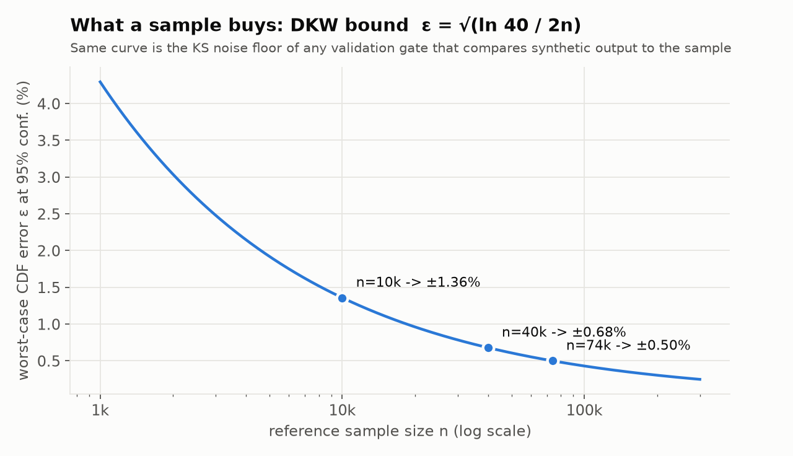

# LLM and Statistical Synthetic Data with Dataflow — Part 2: the type system, and how free-text is actually resolved

*Self-hosted LLM generation on Apache Beam / Dataflow / BigQuery — Part 2
of the series behind the Apache Beam Summit 2025 session "Building Banking
Synthetic Data for a Lakehouse with Gemma".*

Part 1 ended on one log line: the `generation_plan`, which says for every
column of the target table which strategy will produce its values. This
part is about the strategy that everyone asks about first and trusts
least — the free-text route, the only one that reaches the LLM on its own —
and about the type system that decides, column by column, whether a value
is copied, sampled from statistics, walked out of a regex, or generated.

The short version, before the diagrams: **a STRING column takes one of
five exits, and only one of them ever calls vLLM. That exit builds a
bounded pool of novel values once per column, persists it, and the run
samples from it.** Every value in that pool has passed the same gates in
the same order, and the loudest gate is "does this value exist in the real
table?" — if it does, the value is dropped, and if the run lands one
anyway, the run fails.

The split between statistics and LLM is not a taste: cell-by-cell LLM
generation of a whole table is roughly four orders of magnitude slower
than statistical sampling ([Yang et al. 2025](https://arxiv.org/abs/2507.19334))
and follows token frequency rather than data frequency, flattening
distributions toward uniform ([Sidorenko 2025](https://arxiv.org/abs/2505.02659)).
So the LLM runs O(1) times per column, the spine that
[FASTGEN](https://arxiv.org/abs/2507.15839) (Nguyen et al. 2025) argues
for, and the bulk is sampled from marginals on CPU. The LLM's one job is
the thing statistics cannot do: invent plausible *prose* that is not a
copy.

### What this article leans on

| | Name | Role in this article | Primary source |
|---|---|---|---|
| 📰 series | Part 1 — the routing story | where the `generation_plan` and the "one route per column" idea come from | [Building banking synthetic data — intro](01-building-banking-synthetic-data-intro.md) |
| 📰 series | Parts 3 · 4 · 5 | serving runtime · B.1 retrieval geometry · `b2_library` deep dive | upcoming |
| 🧠 GenAI | LLM tabular generation | why the LLM runs O(1) times per column, not per row | [GReaT, Borisov et al. 2023](https://arxiv.org/abs/2210.06280) · [FASTGEN, Nguyen et al. 2025](https://arxiv.org/abs/2507.15839) |
| 🧠 GenAI | per-cell LLM sampling, and why not | the ~9,500× cost gap; distributions flattened toward uniform | [Yang et al. 2025](https://arxiv.org/abs/2507.19334) · [Sidorenko 2025](https://arxiv.org/abs/2505.02659) |
| 🧠 GenAI | KV prefix caching | one byte-identical prompt per column, paid for once, reused every ladder round | [vLLM automatic prefix caching](https://docs.vllm.ai/en/stable/design/prefix_caching/) |
| 🧠 GenAI | guided decoding / structured outputs | a `pattern` compiled into the decoder's grammar; JSON arrays by construction | [Willard & Louf 2023](https://arxiv.org/abs/2307.09702) · [vLLM structured outputs](https://docs.vllm.ai/en/latest/features/structured_outputs.html) |
| 🧠 GenAI | RAG as prompt seeding | eight exemplars per column, retrieved once per pool build, never per row | [FAISS](https://github.com/facebookresearch/faiss) ([Douze et al. 2024](https://arxiv.org/abs/2401.08281)) · [bge-small-en-v1.5](https://huggingface.co/BAAI/bge-small-en-v1.5) ([C-Pack](https://arxiv.org/abs/2309.07597)) |
| 🧠 GenAI | training-data extraction | why an echoed seed is a leak; the novelty gate runs against the full domain | [Carlini et al. 2021](https://arxiv.org/abs/2012.07805) |
| 📐 statistics | sampling error of a 10k sample | what the reference sample can and cannot see (DKW bound) | [Dvoretzky, Kiefer & Wolfowitz 1956](https://doi.org/10.1214/aoms/1177728174) · [Massart 1990](https://doi.org/10.1214/aop/1176990746) |
| 📐 statistics | inverse-CDF sampling | the numeric route: uniform draws through the column's decile vector | [Devroye 1986, ch. II](https://luc.devroye.org/rnbookindex.html) |
| 📐 statistics | approximate aggregates over the full table | exact-tier stats: HLL++ distinct counts, quantiles, top-k in one scan | [Heule et al. 2013](https://research.google.com/pubs/archive/40671.pdf) · [BigQuery approximate aggregation](https://cloud.google.com/bigquery/docs/reference/standard-sql/approximate_aggregate_functions) |
| 📐 statistics | CTGAN | the model behind `b2_library`'s default backend | [Xu et al., NeurIPS 2019](https://arxiv.org/abs/1907.00503) · [sdgx](https://github.com/hitsz-ids/synthetic-data-generator) |
| 🔀 Beam | `RunInference` | the transform the vLLM model handler plugs into | [ML inference in Beam](https://beam.apache.org/documentation/ml/about-ml/) |

### How to read this article

Three kinds of paragraphs sit under the figures, and they are labelled so
they are never confused:

- 📉 **What the run showed** — a measurement from a named E2E run, usually
  a defect. This is the lesson. The number in it belongs to the figure.
- 🔧 **What the code does now** — the mechanism that exists *today*
  because of that run, with the worker-log milestone or preflight that
  names it. This is the current implementation.
- 💡 **Concept, not a run** — a figure that teaches the mechanism with
  synthetic data; it carries no measured number.

NOTE: Diagrams with none of these labels describe the current implementation.
A lesson that has no figure says so, and its numbers come from the ADR or
code comment that recorded the run. A ledger at the end of the article
lists every lesson → fix pair in one table, so the mechanism sections can
be read on their own.

## Where Part 1 stopped: one route per column

*Every column takes exactly one route — free-text is the only route that
reaches the LLM automatically, and a DDL-declared override can force more
columns onto it:*


The router behind the figure is not a classifier trained on anything. It
is a **profiler** that reads the BigQuery DDL type, the ≤10k-row reference
sample, and the column's description JSON, and applies a fixed decision
order. The order matters more than the thresholds, so here it is verbatim
from the code (`profile_columns` in the B.1 engine):

1. Parse the column description for an `llm_prompt_constraint` clause. If
   it says `route: "llm"`, remember that: it will short-circuit steps 2, 5
   and 6 for a STRING column (and be refused, loudly, on any other type).
2. Exactly one distinct non-null value and no nulls → **constant**, copied
   verbatim.
3. Numeric BigQuery types → **numeric**, sampled through an inverse CDF
   over the column's decile vector (the textbook method — [Devroye 1986,
   ch. II](https://luc.devroye.org/rnbookindex.html); Part 8 owns the
   math). Twenty or fewer distinct values demote to categorical — a
   "number" with five values is a code list.
4. STRUCT / REPEATED → categorical over the JSON rendering.
5. String-like types → the string profiler, below.
6. Temporal types → **temporal**, range-sampled with the observed
   sentinel years (0001, 9999) re-injected at their observed frequency.
7. Anything else (BOOL, unknown) → **categorical**.

Nulls and trimmed-empty strings leave the value stream before any of this
and come back at generation time as a single uniform draw per value:
null → empty → substantive value, at the observed shares. A column that is
91% empty stays 91% empty.

The string profiler is where the interesting decisions live. Its rules and
defaults, in the order they are applied:

| Rule | Default | What it decides |
|---|---|---|
| free-text test | more than 50 distinct values, **or** unique ratio ≥ 0.9 and mean length ≥ 20 | a STRING is free-text unless it is a code list |
| head values | share ≥ 5% of rows, at least 10 rows, at most 8 values | dominant literals (an `N/A`, a default label) are re-emitted at their exact share, not "generated" |
| temporal-shaped string | parses as a date/time | leaves the string route for the temporal sampler |
| identifier shape | fixed length ≥ 8, no whitespace, every position resolves to a literal or a narrow character class | account-number-shaped strings never reach the LLM: mask tables + per-position alphabets |
| free-text seeds | up to 64 distinct exemplars | what the LLM will be shown, later, as "values like these" |
| otherwise | — | categorical: reproduce the frequency table |

Two of those rows are privacy decisions dressed as type decisions. The
identifier exit exists because the worst thing a synthetic account number
can do is collide with a real one — so identifiers are generated from the
*shape* of the observed values and checked for novelty against the
column's **full** source domain, not the 10k sample. And the head-values
row exists because an LLM asked for "values like `N/A`" produces variations
of `N/A`; the pipeline copies the literal at its measured share instead.

## The 10k reference sample: what it sees, and what it cannot

Everything the profiler decided above, it decided from a **reference
sample**, and the sample is the most-cited and least-explained number in
this pipeline. Here is the whole contract.

**What it is.** One query at launch, run driver-side, live against the
source table every run (no snapshot — [ADR 0005](../adr/0005-live-select-reference-data.md)):

```sql
SELECT * FROM `source` AS ref
ORDER BY FARM_FINGERPRINT(TO_JSON_STRING(ref))
LIMIT 10000            -- --reference_rows_limit
```

The rows are hashed into the `reference_digest`, and that digest is the
key of everything downstream: the persisted pools, the `rag_chunks`, the
stats rows, the `validation_runs` provenance. Same table contents → same
sample → same digest → the next run is warm. A changed table, or a
changed `--reference_rows_limit`, is a new digest and a cold run.

The ordering clause is not decoration. It was a lesson — one of the few
in this article with no figure: the numbers below come from the launcher
code that records the run, not from a figure script.

📉 **What the run showed.** The first E2E runs used a bare `LIMIT`. A bare
`LIMIT` returns a storage-contiguous slice, and on 2026-07-15 51% of the
sample came from a single load batch. The profiler saw that slice as the
table: columns with 897 distinct values were typed as ≤9-value
categoricals, and the marginals and fidelity scores were skewed with
them.

🔧 **What the code does now.** Ordering by a fingerprint of the whole row
spreads the sample across the table deterministically. It is the same
sample on every retrigger, which is what makes the digest a usable cache
key at all. The proof is in two places: `validation_runs` carries the
`reference_digest` and `reference_row_count` of every run, and the worker
milestone `b1_embed_done rows=` must equal `--reference_rows_limit`, not
the table's row count.

**Scope — what depends on it, and what does not.** The sample feeds six
consumers, and they are not equally sensitive to its size:

| Consumer | Needs from the sample | Sensitivity to size |
|---|---|---|
| column profiles (types, frequencies, deciles, null shares, shapes) | marginals | **high** — everything below applies |
| `reference_digest` | determinism | none |
| `rag_chunks` + FAISS index | mode coverage for the eight exemplars | low — the row chunks are a 1,024-row prefix; more rows do not change eight seeds |
| free-text pool seeds | diverse in-prompt exemplars | low — bounded by the 512 pool cap, not by the sample |
| `b2_library` fit | a training set | moderate — plateaus |
| validation gate | the baseline it compares against | **high** — the sample's own error is the gate's noise floor |

Just as important is what **never** depends on it. The novelty rejection
set is the column's **full** source domain (up to 1M distinct values),
not the sample. The taint preflight queries the live table. The
source-filter cardinality that sizes a pool target is fetched from the
table. And with `--source_stats=exact`, one aggregate scan of the whole
table supplies HLL++ distinct counts, quantiles and top-k that override
the sample's estimates. The sample decides *what kind* of column it is
looking at and *what the marginals look like*; the privacy and
cardinality questions are answered against the table.

**Implications — the arithmetic behind 10,000.** The sample size follows
the *estimand*, not the output volume: generating 10M rows from profiles
fitted on 10k is not statistically worse per row than generating 10k.
What changes at scale is that an estimation error stops being noise and
becomes a property of every generated row.

*What a sample buys: at n = 10k every column's full CDF is pinned to
within ±1.36 points of mass at 95% confidence, and the same curve is the
noise floor of any gate that compares synthetic output to the sample:*



💡 **Concept, not a run.** The curve is the DKW inequality with Massart's
tight constant, ε = √(ln 40 / 2n) at 95% confidence. Halving the error
costs four times the rows, forever. What that means column by column:

- **Marginals are fine.** Deciles and category shares of anything that
  is not rare are estimated to about a point of mass.
- **Rare categories are the first casualty.** A category needs roughly
  3/p rows to appear at all: a 1% category is well estimated, a 0.1%
  category is merely present (about ten rows), a 0.01% category is a coin
  flip to exist in the sample — and a category absent from the sample is
  absent from **all** generated output.
- **Tails are fragile.** p99 rests on a hundred points, p99.9 on ten,
  p99.99 on one. For amounts and overdraft-shaped columns whose extremes
  matter downstream, the sample alone is not enough.
- **Cardinality is truncated at the sample size.** A 10k sample cannot
  see more than 10k distinct values, and usually sees far fewer — which is
  exactly the pool-target lesson later in this article (94 seen versus
  4,022 real). This is the one estimate the sample gets *systematically*
  wrong, and the reason the exact tier and the source-filter count exist.
- **Segments inherit all of the above.** A 1% segment has an effective
  sample of 100 rows; every within-segment estimate is a 100-row estimate.

**Pros and cons, honestly.**

| Property | Why it matters |
|---|---|
| ✅ cheap and fast | one query, cents, seconds; profiling is driver-side and costs the DAG nothing |
| ✅ deterministic | same contents → same digest → warm pools, warm chunks, comparable validation scores |
| ✅ bounded blast radius | reference rows live in the driver and the workers' setup; nothing per-row ever touches the table |
| ✅ enough for what it is asked | marginals, types, shapes, and eight seeds plateau long before 10k |
| ⚠️ blind to rarity and tails | anything below ~0.1% share or beyond p99.9 is a guess |
| ⚠️ blind to cardinality | never trust a sample distinct count — the code no longer does |
| ⚠️ live, so it drifts | two runs on a changing table see different rows; compare digests before comparing scores |
| ⚠️ PII is not masked in the sample | a DEV-only assumption today; the sample is real data in the driver's memory and, redacted, in the logs |

**What you can set, and what happens when you do.**

| Knob | Default | Effect | The aftermath |
|---|---|---|---|
| `--reference_rows_limit` | 10,000 | more rows → smaller ε (4× rows per halving), better tails and rare categories | a new digest: every pool and chunk rebuilds, the run is cold; driver memory and profiling time grow linearly; cardinality is *still* truncated at n |
| `--source_stats` | `sample` | `exact` adds one aggregate scan: HLL++ distinct, deciles, top-k over the whole table; exact distinct sizes the pool target | one BigQuery scan of the source per run; a failed scan degrades loudly to the sample tier (`source_stats_exact_failed`), never kills the run |
| `--source_stats_table` / `--source_stats_json` | off | persist the stats rows / artifact | rows keyed by `(table, digest, tier, profiler version)`; existing rows are never rewritten |
| `--reference_table` | required | which table the sample is drawn from | the digest is the *only* provenance of "what rows did we see"; a filtered or different reference changes the population silently — the digest changes, the log does not explain why |
| stratified sampling | not a flag | a per-stratum `QUALIFY ROW_NUMBER() OVER (PARTITION BY … ORDER BY FARM_FINGERPRINT(…))` query | the design doc's remedy for rare segments; not wired into the launcher today |

The rule of thumb that falls out of this: **do not raise the sample to
fix cardinality or privacy — those are answered against the table. Raise
it when a tail or a rare category matters, and expect a cold run.**

## Five exits before the LLM

*A STRING column takes one of five exits before the LLM is involved, and
the LLM exit is a bounded pool built once per column and reference
digest — never a call per row:*


Read the figure top to bottom. The profiler produces the five kinds; only
`FREE_TEXT` continues. Then the **constraint router** — decided
launcher-side from the parsed clause, recorded per column in the
`generation_plan`, before any pool work — sends the column to one of five
exits:

- **Tier P — pattern sampler.** The clause carries a *samplable* anchored
  regex (literals, character classes, `\d`, bounded repeats, groups,
  alternation — no `+`/`*`, no backreferences, no lookarounds). A seeded
  automaton walk produces values on CPU. No LLM, no pool cap, unbounded
  cardinality, format rejections impossible by construction.
- **Tier B — byte template.** The observed values are control-character
  payloads (binary stored as STRING). A literal prefix plus a
  length-pinned random tail; the LLM never sees them.
- **Identifier shape.** Decided by the profiler, as above: mask tables and
  positional alphabets, novelty against the full source domain.
- **Expandable shape mix.** Columns whose observed values can be
  templated per position skip the pool entirely and draw from relaxed
  shapes — the skip predicate *is* the draw predicate, so the two can
  never disagree. A column carrying any `llm_prompt_constraint` never
  takes this exit: a clause means the operator wants the constrained
  route, not a template.
- **Tier L — the LLM pool ladder.** Semantic prose. This is the rest of
  the article.

(There is a Tier S on the drawing board — charset/shape prose seeded by a
small LLM pool and expanded by templates. It is deferred, and the ADRs say
so; I mention it only so nobody goes looking for it in the code.)

### The run that made the router necessary

Why does a type system need a router on top of it? Because the pool route
has a cap, and a cap is fine for prose and fatal for keys.

*512 values cannot key 1M rows — a declared primary key drew from a
constrained pool while its own pattern clause defined a 10²⁴-value space:*


📉 **What the run showed.** The key column had a perfectly good regex
clause in its description. The pool route honored it as a *prompt hint*,
built its 512 values, and the uniqueness gate then diverted 999,488 of
1,000,000 rows to the dead-letter queue as `pk.duplicate` — discovered
37 minutes and 1,586 GPU-seconds after launch. The right panel is the
same run's clock: every GPU second sat in the pool phase; generation
itself ran on CPU.

🔧 **What the code does now.** The fix was not a bigger pool. A samplable
`pattern` now becomes a **sampler** (Tier P, unbounded cardinality), and a
launcher preflight refuses a run whose routed key capacity is below
`num_rows` — the job never starts, so the 37 minutes are never spent.

Two other findings from the same run shaped the tiers:

*Guided decoding rejects nothing, the prose clause leaked twelve rejects,
and the binary "fallback" landed verbatim source values against a clause
that said "never copied":*


📉 **What the run showed.** Left panel: a pattern compiled into the
decoder's grammar produced zero off-format values, while the same intent
written as prose leaked twelve past the prompt. Right panel: the
pre-router "binary fallback" had quietly served 58 distinct **real**
values from a 19,815-value domain — copy rate 100%, on a column whose
clause forbade copying. A silent fallback is a privacy leak wearing a
green checkmark.

🔧 **What the code does now.** A `pattern` is enforced by construction —
as a Tier P sampler when samplable, otherwise compiled into vLLM's
[structured-output grammar](https://docs.vllm.ai/en/latest/features/structured_outputs.html)
(the mechanism is the finite-state guided decoding of
[Willard & Louf 2023](https://arxiv.org/abs/2307.09702)). Binary payloads
take Tier B, a template that never reaches the LLM, and a never-copy
clause may never be served source values: the binary fallback that did so
no longer exists.

## Steering a column: `llm_prompt_constraint` and `route: "llm"`

Everything the router and the ladder know about the operator's intent
arrives through one JSON object in the column's BigQuery description —
on the **landing** table, read live from `INFORMATION_SCHEMA` at launch
(source-table descriptions are deliberately ignored; they carry
production prose). One parse site, one typed model, one deterministic
renderer, shared by both engines:

| Key | Limits | What it drives |
|---|---|---|
| `format` | ≤ 500 chars of prose | the prompt suffix |
| `pattern` | anchored regex, ≤ 200 chars, must compile | **the sampler (Tier P) if samplable; guided decoding otherwise** |
| `examples` | ≤ 8 × ≤ 64 chars, must sit in the observed length bucket and charset | the prompt suffix; also added to the rejection set |
| `values` | ≤ 64 literals | allowed values in the prompt |
| `prefix` / `suffix` | literals | the prompt; a byte template's literal head |
| `charset` | prose or class | the prompt suffix |
| `length` | int or `[min, max]` | pins the length hint (suppresses the derived one) |
| `units` / `locale` | prose | the prompt suffix |
| `families` | `{prefix: share}` | Tier-P family weights — **not** rendered into the prompt |
| `route` | `"auto"` (default) or `"llm"` | STRING only: forces the free-text kind past constant / temporal / identifier detection |
| `notes` | ≤ 500 chars | the prompt suffix (a legacy plain-string clause lands here) |

Unknown keys warn and are skipped; a marked-but-unparseable clause stops
the launch. The rendered clause is a **per-column constant suffix after a
shared prefix**, keys in a fixed order — which is what lets vLLM's
[automatic prefix caching](https://docs.vllm.ai/en/stable/design/prefix_caching/)
reuse the KV prefix round after round (Part 3 goes deeper into serving).

The authoring priority is the one lesson worth carrying out of this
section: **write `pattern` first, then `families`, then `charset`, then
prose.** A pattern is enforced by a sampler or a grammar; prose is a
request. And keep worked examples honest, because the ladder judges them
with the column's own format gate *before* spending a round:

*One off-length example poisoned every round — the clause's fictitious
example was 28 characters on a 31-character fixed-width column, and the
gate refused 386 of 393 parsed values:*


📉 **What the run showed.** Left panel: the model echoed the example's
length faithfully, the gate refused faithfully, and three rounds of GPU
time produced nothing until the shape fallback took over. Right panel: a
prose column whose source is a fixed-width field had a hard 35-character
wall, and the synthetic values ran past it to 62 — a "long tail" the
source never had.

🔧 **What the code does now.** An off-format example is caught at launch
(`prompt_constraint_example_off_format`) before any GPU time is spent —
the clause is still the operator's to fix. Two full rounds with zero
in-format values now end a ladder early (`freetext_pool_format_collapse`)
instead of riding out the budget. And a fixed-width source clamps the
ladder to the observed ceiling (`freetext_pool_length_clamped`): a field
stored at a fixed width has no long values, it has values that were
**cut**, so candidates are cut the same way.

A minimal clause, and the only line that changes a typed column's route:

```json
{"llm_prompt_constraint": {
  "format": "short merchant descriptor as printed on a card statement",
  "charset": "upper-case letters, digits, spaces and asterisks",
  "length": [8, 22],
  "examples": ["CAFE ARBOL*MADRID", "TFL TRAVEL CH"],
  "route": "llm"
}}
```

`route: "llm"` is the override from Part 1: the profiler would have typed
a low-cardinality STRING as categorical and reproduced its frequency
table; with the override it is generated under the clause, guided
decoding included. Declare it on an INT64 and the run warns
(`prompt_constraint_route_unsupported`) and keeps the typed route.

## The ladder: what one column costs the LLM

*A cold column costs a handful of array requests, not a request per
value — and every candidate passes clamp → format → collapse → novelty →
stagnation in that order, so a pool can be short or empty but never a
copy:*


The ladder is the whole "LLM runs O(1) times" claim from Part 1 made
concrete. The purple elements in the figure are one idea: the prompt —
shared instruction prefix, eight seed exemplars, the rendered clause, the
length hint — is byte-identical for every round of a column, so vLLM's
[automatic prefix caching](https://docs.vllm.ai/en/latest/features/automatic_prefix_caching.html)
computes its KV cache on round 1 and every later round reuses it; only
the sampling parameters change. That is why a round costs decode time,
not prefill time, and why the escalation ladder is cheap to climb. The
ladder's constants:

| Constant | Default | Why |
|---|---|---|
| pool cap | 512 values | a GPU-time budget, not a fidelity target — see the next section |
| target | min(512, `num_rows`, distinct) | distinct = exact source stats → source-filter cardinality → sample distinct, in that order |
| values per request | 32, as one JSON array | one round trip per round, not per value |
| completions per request | n = 4 | four independent arrays, de-duplicated across them |
| escalation | temperature 0.7 → 1.0 → 1.3 (with `top_p` 1.0, `top_k` 0 on the upper levels) | a stalled ladder is asked to be more surprising, once per level |
| rounds | max(3, 2 × ⌈target / 128⌉) | bounded, whatever the model does |
| stagnation | fewer than 4 novel values for 3 rounds, after every level ran once | the ladder stops asking |
| format collapse | 2 consecutive full rounds with zero in-format values | the ladder stops asking *earlier* |
| seeds | 8 exemplars | what the prompt shows as "values like these" |
| rejection set | observed sample ∪ full source domain (≤ 1M distinct) ∪ clause examples | what a candidate must not be |
| parallel ladders | ≤ 4 per worker | columns are independent; the GPU is not |

### What the 512 cap buys, and what it costs

The cap is the one constant readers push back on, so here is exactly what
it does. `FREE_TEXT_POOL_MAX = 512` is a **ceiling on the number of
distinct LLM-generated values a column can have**, and everything else
in the table derives from it:

- **It bounds the GPU bill per column.** Rounds are capped at
  2 × ⌈target / 128⌉, so a full 512-value pool is at most eight
  requests of 32 × 4 candidates. When the model complies, the router
  figure above shows a whole 512-value pool costing between roughly 80
  and 230 T4-seconds; when the model fights the format gate, the
  collapse and stagnation exits stop it well before the eight-round
  budget. Multiply by the number of free-text columns, divide by the
  four parallel ladders per worker, and that is the entire LLM cost of a
  cold run — paid once per reference digest, because the pool is
  persisted.
- **It is a diversity ceiling, by design.** The generate stage draws from
  the pool *with replacement*: a pooled column in a 10M-row table
  repeats each of its 512 values tens of thousands of times, however
  many distinct values the source had. A distinct-count parity check on
  that column will read as a defect (the measured-state figure at the
  end shows exactly this: synthetic distinct pinned at ~512 against
  source cardinalities of 20k–146k). This is the intended trade: the LLM
  supplies *semantics* — plausible merchant names, plausible remarks —
  and cardinality comes from somewhere else.
- **It is fatal for keys, so keys are refused.** A primary key that
  reaches the pool route caps at 512 unique values, which is the PK
  blocker run above. Today the launcher computes the routed capacity of
  every key column and refuses to submit when it is below `num_rows`.
- **Raising it is not the fix it looks like.** The rejection set grows
  with the pool, and the model's novel yield decays round over round —
  that decay is why the stagnation exit exists at all. Doubling the cap
  roughly doubles the round budget and does not double the distinct
  count. When a column needs cardinality, the answer is a `pattern`
  (Tier P has no cap), an identifier or expandable shape (templates have
  no cap), or accepting that the column carries meaning, not identity.
- **It is part of the pool's identity.** The persisted pool is keyed by
  `(reference_digest, model_uri, column, target)`; changing the cap
  changes the target, so the next run builds a new pool rather than
  reading a stale one.
- **It has nothing to do with privacy.** The novelty gate runs on every
  candidate whatever the cap; a smaller or larger pool is equally free
  of copies.

Two other rows of the constants table fixed real defects, and the figures
own the numbers. The **target** row exists because a column's 10k-sample
cardinality is not its cardinality:

*A pool target was sized from the 10k sample (94 distinct) while the
source filter fetched by the same setup held 4,022 — the source-domain
count now sizes the target:*


📉 **What the run showed.** Five pools were built in both R6 runs; four
reached the 512 cap and one stopped at 94 — the sample's distinct count —
even though the source filter fetched in the same setup held 4,022
values. The pool was starved by its own sizing, not by the model.

🔧 **What the code does now.** The target is sized from the best distinct
count available, in a fixed order: the exact source statistics when they
exist, else the cardinality of the source filter (which is fetched
*before* sizing for exactly this reason), and only then the sample
distinct. The same column now targets min(4,022, 512) = 512.

And the **clamp** row is the "values that were cut" argument from the
format-gate figure, generalised into a rule:

*A field stored at a fixed width does not have long values — it has values
that were cut; the ceiling rule separates that shape from a genuinely
long tail:*


💡 **Concept, not a run.** The three length distributions are synthetic.
The rule they illustrate is the one in the code: when p95 equals the
maximum *and* the maximum sits a real distance above p05, the field is
fixed-width, and candidates are truncated to it before the novelty check
rather than rejected after it. A genuinely long tail (p95 below max) is
left alone.

### The failovers, all of them loud

The ladder's exits are the part I would ask about first if this were
someone else's pipeline, because every exit is a place where a silent
"good enough" could land memorized data. There is no silent exit:

- **Shape fallback** (`freetext_pool_shape_fallback`): the model produced
  values but every one was a copy or off-format. Novel values are drawn
  from the column's own per-position shapes, rejecting the source domain.
- **Shape top-up** (`freetext_pool_shape_topup`): the pool is real but
  short of target; the gap is filled with verified-novel template values.
  Still short → `freetext_pool_undersized`, and the run proceeds with a
  smaller pool, saying so.
- **Binary template** (`freetext_pool_byte_template`): control-character
  payloads never reach the LLM (Tier B, above).
- **Transient failure** (`freetext_pool_ladder_retried`): vLLM not ready,
  or a KV budget that cannot fit the request yet. The column is rebuilt
  once, sequentially, after its siblings — never swallowed into a lax
  fallback.
- **`strict_freetext`** — the default whenever a real model client is
  configured. Nothing usable after every escalation level raises
  `FreeTextEmptyYieldError` out of `DoFn.setup()`: the run fails instead of
  landing exemplar copies. The lax mode exists for the fake client in
  tests; with a real model it is a WARNING you should never see.

The transient-failure exit was found the hard way:

*One lost fit race failed a bundle whose three sibling ladders had already
finished — transient errors are now classified, collected, and retried
once instead of failing the branch:*


📉 **What the run showed.** Two threads set up engines on the same worker.
Thread 1 waited for vLLM to fit its request, gave up after five 20-second
waits, and its error was re-raised at the end of the bundle — *after* the
three sibling ladders had finished, 706 seconds of pool work thrown away.
Dataflow's retry then re-embedded and rebuilt everything.

🔧 **What the code does now.** "Not ready" and "cannot fit yet" are
classified as transient, collected instead of raised, and the affected
column is rebuilt once, sequentially, after its siblings — the milestone
is `freetext_pool_ladder_retried`. The fit-wait window was widened to
cover what the measurement said the fit actually needed. A genuine error
still fails the bundle.

## Calls into vLLM, at a high level

Part 3 owns serving — the in-worker spawn, VRAM fitting, the multi-process
topology. What the ladder needs from it fits in a paragraph:

- **Structured output, not prose parsing.** Each round is one request to
  the chat endpoint with `response_format = json_schema`; a user `pattern`
  becomes part of the grammar the decoder is constrained to
  ([vLLM structured outputs](https://docs.vllm.ai/en/latest/features/structured_outputs.html)).
  Malformed output is impossible by construction; a completion that is
  not a JSON array is dropped with a WARNING, not repaired.
- **No request seed when n > 1** — a pinned seed collapses the four
  completions into four copies. Determinism lives elsewhere: the pool is
  persisted, and every draw from it is seeded per batch.
- **Prefix caching is a property of the prompt, not a flag.** The shared
  instruction prefix, the seeds and the rendered clause are byte-identical
  across rounds, so vLLM's
  [automatic prefix caching](https://docs.vllm.ai/en/stable/design/prefix_caching/)
  reuses the KV prefix; the one seed strategy that rotates exemplars per
  round forfeits it by design and says so in its help text.
- **The KV budget is measured, not assumed.** The client sizes
  `gpu-memory-utilization` and `max-model-len` from free VRAM at ignition;
  a request the budget cannot fit waits (`vllm_unfittable_wait`) inside a
  bounded window rather than failing the ladder.

The measured consequence is the O(1) claim as a wall-clock fact:

*vLLM was busy for 7.9 minutes of a 93-minute, 10M-row relational run —
four T4s billed 272 GPU-minutes while the LLM's actual work was the pool
phase:*


📉 **What the run showed.** Everything after the pool phase in that run
was CPU: vectorized draws, validation, dedup, load. The GPUs were billed
for the whole job and used for a few minutes of it.

🔧 **What the code does now.** Nothing changed in the ladder — this is the
design working as intended. What changed is around it: Part 3 and Part 8
tell how the v0.2.0 throughput work brought that 93-minute job to well
under an hour on the same fleet, and the GPU minutes did not move.

## RAG interplay: yes — and only as prompt seeds

This is the question I get asked most precisely, so here is the precise
answer. **Retrieval is used exactly once per pool build, to choose the
eight exemplars the prompt shows the model. It is not used per row, and
it is not used for any other column kind.** The marginal statistics that
drive numerics, categoricals and temporals come from a pure statistical
pass over the reference sample; embeddings play no part in them.

*Retrieval is a prompt-seeding device, not a per-row lookup — ①
`rag_chunks` is read once per pool build, ② `freetext_pools` makes the
second run skip the GPU entirely, and ③ `b2_library` reaches the same
guardrails without touching either store:*


Follow the numbered arrows:

- **①** The pool branch reads `rag_chunks` once per pool build — the
  seeds go into the prompt, the prompt goes to vLLM, and nothing in the
  generate stage ever touches the chunks again. The population branch
  writes them only on a cold run.
- **②** The pool branch's blocking LOAD into `freetext_pools` is what the
  *next* run reads: a store hit in `setup()` means the generate stage
  never ignites vLLM at all.
- **③** `b2_library` bypasses both stores — a lazy 32-value pool per
  column, built per batch through the same ladder — and lands in the same
  three lines of defense as `b1_rag`.

The `rag_chunks` table holds two kinds of chunk, and each has one
consumer:

- **`row_doc` chunks** — the first 1,024 reference rows serialized
  per-column (the row-as-text framing of
  [GReaT, Borisov et al. 2023](https://arxiv.org/abs/2210.06280)) and
  embedded with a small open-weight embedder
  ([`bge-small-en-v1.5`](https://huggingface.co/BAAI/bge-small-en-v1.5),
  384 dimensions, from the [C-Pack](https://arxiv.org/abs/2309.07597)
  family; pulled once from GCS, never from the Hub at runtime). The
  engine loads them into an exact
  [FAISS](https://github.com/facebookresearch/faiss) index
  ([Douze et al. 2024](https://arxiv.org/abs/2401.08281)) and retrieves
  the top-8 rows nearest the sample centroid — representative rows, not
  lookalikes of a query. They are the fallback seeds.
- **`free_text_col` chunks** — the distinct values of each free-text
  column (≤ 1,024 per column), deduplicated driver-side. They are the
  primary seeds: eight per column, chosen by centroid or k-center over the
  column's own values.

Both are keyed by the reference digest and the embedder id/version, so a
new sample or a new embedder invalidates them; a warm store is read back
all-or-nothing (`b1_chunks_reused`), and a cold run embeds on the GPU and
demotes the embedder to CPU **before** vLLM sizes its KV budget. Under
the multi-process worker topology that embed is bounded to two processes
per job and the pool branch waits for it — a 2026-09 lesson, when the
first attempt ran fifty-six CPU embedders and starved the model pull.

So: are `rag_chunks` used for "the rest of the fields"? No. Are they used
for free-text? Yes — to seed the prompt, never to copy from. A seed can be
echoed by the model (the extraction risk
[Carlini et al. 2021](https://arxiv.org/abs/2012.07805) describe is
exactly an echo); the novelty gate counts echoes and the rejection set
drops them.

## The pool store in BigQuery: build once, read forever

Pools are a **persisted artifact**, not per-worker work. The first run that
saw 108 pool builds in a 68-minute job — 36 rebuilds for each of three
columns, 19.1 GPU-hours of LLM service for values that were identical each
time — is the reason (ADR 0020). Today:

- `synthetic_rag.freetext_pools` is keyed by `(reference_digest,
  model_uri, column, target)` and stores the values plus `attempts` and
  `stagnated`, so a later worker reads the *conclusion*, not the ladder.
  A new reference sample or a new model URI invalidates it; a new run id
  does not.
- Resolution order is **store → process cache → build**; the store is an
  optimization, never a dependency: no store, no digest, a read error or
  an empty pool all fall through to the ladder.
- The pool branch is one Beam DoFn per worker that blanks its own read
  path (so it can never short-circuit itself), builds every column's
  ladder, and writes through a blocking LOAD job. Its output is the
  `AwaitFreeTextPools` barrier: generate bundles are not even scheduled
  until the rows are readable — an earlier cold run had two workers each
  build the same thirteen ladders concurrently.
- Warm pools must **prove they are clean.** The launcher's taint preflight
  runs one overlap query per column against the source domain; any
  overlap deletes the digest's pools and rebuilds them, and the log
  carries counts only, never values. This exists because a warm run once
  replayed pools that a since-fixed bug had memorized — `exists()` was the
  only guard.

On a fully warm run the free-text route never ignites vLLM at all: the
workers log `freetext_pools_warm`, `b1_chunks_reused`, and — if no column
needed an LLM-derived pool — `llm_route_unused`. That is the economics
behind "the GPU is touched O(1) times per run": O(1) per *reference
digest*, amortized across every run that shares it.

## And `engine=b2_library`?

Part 1 promised the two engines are one flag apart, and for free-text the
seam is worth describing honestly:

- `b2_library` wraps an open-source tabular synthesizer —
  [`sdgx`](https://github.com/hitsz-ids/synthetic-data-generator), whose
  default model is CTGAN ([Xu et al., NeurIPS 2019](https://arxiv.org/abs/1907.00503)),
  with an empirical fallback — fitted once per worker process. Typed
  columns come from the library.
- Free-text is patched **per batch** by a hook that builds a lazy 32-value
  LLM pool per column and caches it in-process — the same escalation
  ladder, the same source-domain rejection, the same `strict_freetext`.
  An empty yield is negative-cached so later batches fail fast instead
  of paying three LLM calls per batch to rebuild a pool that cannot
  succeed (a 35-minute lesson from an early run).
- What it does **not** share yet: the persisted pool store, the
  `rag_chunks` seeds, and the constraint router — a `b2_library` column
  with a `pattern` clause keeps pool behavior; its `constrained_columns`
  set is empty, which is why the DoFn's identity synthesis treats it as
  owning nothing. The ADRs list "B.2 routing parity" as the open item, and
  Part 5 is the engine's own deep dive.

## The measured state of free-text, and the lessons ledger

Nothing above was designed on a whiteboard first. The prompt-constraint
work started from a measurement that looked like a model problem and
turned out to be three different mechanisms:

*Three columns with 0% shape recall failed through three different
mechanisms — identifier mask collapse, whitespace-run normalization the
gate could not see, and a sparse column whose seeds under-represented its
format — while seven more sat at the ~512 pool-cap diversity ceiling:*


📉 **What the run showed.** Left panel: three columns reproduced
essentially none of the source's top formats, and the causes were
different in each — an identifier whose per-position draws produced masks
that never existed, a column whose whitespace runs were normalised away
before the gate could see them, and a sparse column whose eight seeds
under-represented its format. Right panel: seven more columns sat at the
512-value ceiling against source cardinalities of 20k–146k.

🔧 **What the code does now.** The identifier case draws a *whole observed
mask* first and fills it (the concept figure below). The whitespace and
sparse cases share one gate: a candidate must reproduce an observed
*collapsed* mask — digit and letter runs collapse, whitespace runs stay
literal — so whitespace-normalised output is rejected and a wrong-format
guess is rejected even when the seeds under-represented the format,
because the observed sample still carries the true masks; an operator
`format` or `pattern` clause then closes the loop from the prompt side.
And the right panel is the cap doing
exactly what it is meant to do — it is the reason Tier P, shape expansion
and the persisted store exist: cardinality comes from samplers and
templates, the LLM supplies *semantics*, and neither is asked to do the
other's job.

*Drawing a whole observed mask and then filling it reproduces the source
mask marginal; drawing positions independently collapses it:*


💡 **Concept, not a run.** When the observed top masks cover too little
of a column, drawing per-position characters independently produces
masks that never existed; drawing a whole observed mask and then filling
it reproduces the source mask marginal by construction. Its fix is a
sampling rule, not a prompt.

### The ledger

Every lesson in this article, and the mechanism that exists because of
it:

| Figure | 📉 What the run showed | 🔧 What the code does now |
|---|---|---|
| *(no figure)* storage-contiguous sample | a bare `LIMIT` took 51% of the 2026-07-15 sample from one load batch; 897-distinct columns typed as ≤9-value categoricals | `ORDER BY FARM_FINGERPRINT(TO_JSON_STRING(row))` — deterministic, spread across the table, stable digest |
| PK blocker | a declared PK drew from the 512-cap pool; 999,488 of 1M rows DLQ'd as `pk.duplicate` after 37 min | samplable `pattern` → Tier P sampler; launcher refuses a run whose routed key capacity < `num_rows` |
| Router outcomes | prose clause leaked 12 rejects; a "binary fallback" served 58 real values against a never-copy clause | `pattern` → grammar or sampler; Tier B byte template; the copying fallback is gone |
| Format gate | a 28-char example on a 31-char column: 386 of 393 values refused, three rounds wasted; prose ran to 62 chars past a 35-char wall | `prompt_constraint_example_off_format` at launch; `freetext_pool_format_collapse`; `freetext_pool_length_clamped` |
| Pool targets | one pool sized from the sample (94) while the fetched filter held 4,022 | target = exact stats → source-filter cardinality → sample distinct, filter fetched before sizing |
| Pool race | a lost fit-wait failed a bundle after its three sibling ladders had finished | transient errors classified and retried once, sequentially (`freetext_pool_ladder_retried`); wider fit window |
| Where time went | vLLM busy 7.9 min of a 93-min 10M run; GPUs billed throughout | unchanged — the O(1) design confirmed; v0.2.0 moved the CPU side |
| Prompt-constraints evidence | three 0%-recall columns, three mechanisms; seven at the 512 ceiling | mask-first identifier draws; collapsed-mask candidate gate (whitespace kept literal); `format`/`pattern` clause for the under-seeded column; the ceiling is by design |
| *(no figure)* 108 pool builds in a 68-min job | identical pools rebuilt 36× per column, 19.1 GPU-hours | `freetext_pools` persisted per digest; `AwaitFreeTextPools` barrier |
| *(no figure)* warm pools replayed a since-fixed memorization bug | `exists()` was the only guard | taint preflight: overlap query per column, delete + rebuild on any hit |
| *(no figure)* 56 CPU embedders starved the model pull | the multi-process topology fanned the cold embed out | embed bounded to two processes per job; pool branch waits for it |
| *(no figure)* B.2 paid three LLM calls per batch on a pool that could not succeed | 35 minutes of retries | empty yield negative-cached per column |

## What to remember

1. **Five exits, one LLM route.** Constant, numeric, categorical,
   temporal, identifier-shaped and templated strings never see the model;
   a regex clause becomes a sampler; only semantic prose runs the ladder.
2. **The ladder is bounded on every axis** — values per request, requests
   per column, escalation levels, pool size — and every exit is a named
   milestone.
3. **The 512 cap is a GPU budget and a diversity ceiling**, on purpose.
   Cardinality comes from patterns and templates; the LLM supplies
   meaning. Keys are refused before launch.
4. **Novelty is checked against the full source domain**, not the sample,
   and `freetext.copy_fraction` is a run-level BLOCKER. A pool can be
   short or empty; it cannot be a copy.
5. **`pattern` beats prose.** A samplable pattern is enforced by
   construction; prose is a request the gate then polices.
6. **Examples are judged before they are used**, by the same gate that
   judges the model.
7. **RAG seeds prompts; it does not generate rows.** Eight exemplars per
   column, retrieved once per pool build.
8. **Pools persist per reference digest**, are taint-checked before reuse,
   and gate the generate stage behind a barrier.
9. **`strict_freetext` is the default with a real model.** No silent
   fallback lands data.
10. **The 10k sample sizes the estimate, not the output.** It is
    deterministic and cheap, blind to rare categories, tails and
    cardinality — and cardinality and privacy are answered against the
    full table, never against the sample.

## Where this goes next

Part 3 is the common runtime: the CPU/GPU split, vLLM inside the Beam
DoFn lifecycle, the multi-process SDK topology that took a 10M-row
relational job from 94 to under 50 minutes, uniqueness enforcement modes,
the DLQ, capped autoscaling. Part 4 opens the B.1 engine's retrieval
geometry; Part 5 does the same for `b2_library`.

If you run Beam or Dataflow in production, work on synthetic data or LLM
serving, or think a gate here is in the wrong place — say so. The
comment section is part of the project: corrections, experiment ideas
and "have you tried X" feed the backlog (a Tier S seed-and-expand route
and B.2 routing parity are the two candidates this article touches).

## References

**The statistical side**

- Xu, Skoularidou, Cuesta-Infante, Veeramachaneni — *Modeling Tabular
  Data using Conditional GAN* (CTGAN), NeurIPS 2019 —
  [arXiv 1907.00503](https://arxiv.org/abs/1907.00503). The model behind
  `b2_library`'s default backend.
- [`sdgx` — Synthetic Data Generator](https://github.com/hitsz-ids/synthetic-data-generator)
  (hitsz-ids, Apache-2.0), the library `b2_library` wraps; the
  [Synthetic Data Vault](https://sdv.dev/) is the family it belongs to.
- Devroye — *Non-Uniform Random Variate Generation*, Springer 1986
  ([full text](https://luc.devroye.org/rnbookindex.html)), ch. II for
  the inverse-CDF sampling the numeric route uses.
- Dvoretzky, Kiefer & Wolfowitz — *Asymptotic Minimax Character of the
  Sample Distribution Function*, Ann. Math. Statist. 1956 —
  [doi:10.1214/aoms/1177728174](https://doi.org/10.1214/aoms/1177728174);
  Massart — *The Tight Constant in the Dvoretzky-Kiefer-Wolfowitz
  Inequality*, Ann. Probab. 1990 —
  [doi:10.1214/aop/1176990746](https://doi.org/10.1214/aop/1176990746).
  The bound behind "10k rows ≈ ±1.36% of mass".
- Heule, Nunkesser & Hall — *HyperLogLog in Practice*, EDBT 2013 —
  [Google Research](https://research.google.com/pubs/archive/40671.pdf);
  [BigQuery approximate aggregate functions](https://cloud.google.com/bigquery/docs/reference/standard-sql/approximate_aggregate_functions)
  and [hash functions](https://cloud.google.com/bigquery/docs/reference/standard-sql/hash_functions)
  (`FARM_FINGERPRINT`). The exact-tier stats and the deterministic sample.

**The LLM side of tabular and free-text synthesis**

- Borisov, Seßler, Leemann, Pawelczyk, Kasneci — *Language Models are
  Realistic Tabular Data Generators* (GReaT), ICLR 2023 —
  [arXiv 2210.06280](https://arxiv.org/abs/2210.06280). Row-as-text
  serialization; the per-row generation cost this pipeline avoids.
- Nguyen, Schafft, Hale et al. — *FASTGEN: Fast and Cost-Effective
  Synthetic Tabular Data Generation with LLMs*, 2025 —
  [arXiv 2507.15839](https://arxiv.org/abs/2507.15839). The
  "LLM infers, statistics sample" spine both engines follow.
- Yang, Zhang, Prenkaj et al. — *Doubling Your Data in Minutes: Ultra-fast
  Tabular Data Generation via LLM-Induced Dependency Graphs*, 2025 —
  [arXiv 2507.19334](https://arxiv.org/abs/2507.19334). The ~9,500×
  cost gap between per-cell LLM generation and statistical sampling.
- Sidorenko — *A Note on Statistically Accurate Tabular Data Generation
  Using Large Language Models*, 2025 —
  [arXiv 2505.02659](https://arxiv.org/abs/2505.02659). Why per-cell LLM
  sampling flattens distributions toward uniform.
- Carlini, Tramèr, Wallace et al. — *Extracting Training Data from Large
  Language Models*, USENIX Security 2021 —
  [arXiv 2012.07805](https://arxiv.org/abs/2012.07805). Why an echoed
  seed is a leak, and why the novelty gate runs against the full domain.
- Willard & Louf — *Efficient Guided Generation for Large Language
  Models*, 2023 — [arXiv 2307.09702](https://arxiv.org/abs/2307.09702).
  The finite-state guided decoding behind `pattern` → grammar.

**Mechanisms and components**

- vLLM — [automatic prefix caching: design](https://docs.vllm.ai/en/stable/design/prefix_caching/)
  and [feature page](https://docs.vllm.ai/en/latest/features/automatic_prefix_caching.html);
  [structured outputs](https://docs.vllm.ai/en/latest/features/structured_outputs.html).
- FAISS — [facebookresearch/faiss](https://github.com/facebookresearch/faiss);
  Douze, Guzhva, Deng et al. — *The Faiss library*, 2024 —
  [arXiv 2401.08281](https://arxiv.org/abs/2401.08281).
- BGE embedder — [`BAAI/bge-small-en-v1.5`](https://huggingface.co/BAAI/bge-small-en-v1.5)
  model card; Xiao, Liu, Zhang, Muennighoff — *C-Pack: Packed Resources
  for General Chinese Embeddings*, 2023 —
  [arXiv 2309.07597](https://arxiv.org/abs/2309.07597).
- Apache Beam — [ML inference in Beam pipelines](https://beam.apache.org/documentation/ml/about-ml/)
  (`RunInference`, the transform the model handler plugs into).

---

*Provenance (dropped on Medium): sources and figures per front-matter;
claims verified at repo commit `9bf595a` (v0.2.0). Figures:
`generation-plan-routing.png`, `freetext-resolution-flow.png`,
`freetext-pool-ladder.png`, `freetext-components.png` (drawio sources
committed side-by-side in `docs/articles/assets/`; exported with the
next-ai-drawio MCP plugin); the `constraint-router-*`, `r6-scale-*` and
`prompt-constraints-*` figures are generated by `scripts/doc/` figure
scripts from their `MEASURED` / `CONCEPT` blocks — every measured number
quoted above is typed once, in those scripts. Tables are pasted to Medium
as images or lists. Configuration constants (pool cap 512, 32 × 4 values
per round, 8 seeds, 1M-value domain cap, 1,024-row/value chunk caps,
32-value B.2 pools) are the defaults at the synced commit. External
links retrieved 2026-09-08.*
