# LLM and Statistical Synthetic Data with Dataflow — Part 3: the common runtime — one worker pool, a CPU/GPU split, and vLLM inside the DoFn

*Self-hosted LLM generation on Apache Beam / Dataflow / BigQuery — Part 3
of the series behind the Apache Beam Summit 2025 session "Building Banking
Synthetic Data for a Lakehouse with Gemma".*

Part 2 ended with a wall-clock fact that looked like a paradox: a 10M-row
relational run billed four T4s for 93 minutes and used the LLM for eight of
them. This part is about the machine that produces that shape — the one
Dataflow worker pool every stage runs on, the split of that pool's time
between CPU and GPU, and the vLLM server that lives *inside* a Beam DoFn's
lifecycle — and about the three weeks of measurement that took the same job
from 94 minutes to 50 on the same fleet without touching the GPU side.

The short version, before the diagrams: **the GPU is a bounded,
front-loaded tenant of each worker (one embed, one ignition, a handful of
array requests per column, all before the first row exists), everything
after that is CPU, Dataflow Shuffle and BigQuery — and the levers that
halved the job were interpreters per worker, barriers per table, and a
fleet that starts full.** vLLM is used for what it is good at (batched,
grammar-constrained decoding with a cached prefix) and kept off everything
else.

### What this article leans on

| | Name | Role in this article | Primary source |
|---|---|---|---|
| 📰 series | Part 1 · Part 2 | the architecture and the free-text route this runtime serves | [intro](01-building-banking-synthetic-data-intro.md) · [type system & freetext](02-type-system-freetext-resolution.md) |
| 📰 series | Parts 4 · 5 · 8 | retrieval geometry · `b2_library` · the stats and scale math | upcoming |
| 🧠 GenAI | LLM tabular generation | why the LLM runs O(1) times per column — the fact the whole CPU/GPU split rests on | [GReaT, Borisov et al. 2023](https://arxiv.org/abs/2210.06280) · [FASTGEN, Nguyen et al. 2025](https://arxiv.org/abs/2507.15839) |
| 🧠 GenAI | PagedAttention | vLLM's block-granular KV cache; what "the KV budget" is made of | [Kwon et al., SOSP 2023](https://arxiv.org/abs/2309.06180) |
| 🧠 GenAI | KV prefix caching | one byte-identical prompt per column, paid for once, reused every ladder round — measured here | [vLLM automatic prefix caching](https://docs.vllm.ai/en/stable/design/prefix_caching/) |
| 🧠 GenAI | guided decoding / structured outputs | the decoder-side guardrail: a JSON array (and a `pattern`) compiled into the decode mask | [Willard & Louf 2023](https://arxiv.org/abs/2307.09702) · [Dong et al. 2024 (xgrammar)](https://arxiv.org/abs/2411.15100) · [vLLM structured outputs](https://docs.vllm.ai/en/latest/features/structured_outputs.html) |
| 🧠 GenAI | RAG as prompt seeding | eight exemplars per column, retrieved once per pool build; the only reason an embedder shares the card | [FAISS](https://github.com/facebookresearch/faiss) ([Douze et al. 2024](https://arxiv.org/abs/2401.08281)) · [bge-small-en-v1.5](https://huggingface.co/BAAI/bge-small-en-v1.5) |
| 🧠 GenAI | training-data extraction | why an echoed seed is a leak; the pipeline-side rail | [Carlini et al. 2021](https://arxiv.org/abs/2012.07805) |
| 🧠 GenAI | KV offload / ANN retrieval | the two optimizations evaluated and not adopted, with their triggers | [LMCache](https://docs.lmcache.ai/) · [TurboQuant, Zandieh et al. 2025](https://arxiv.org/abs/2504.19874) |
| 🔀 Beam | `RunInference` + vLLM handlers | the shape Beam offers, and why this pipeline uses a client instead | [Beam vLLM model handlers](https://beam.apache.org/releases/pydoc/current/apache_beam.ml.inference.vllm_inference.html) · [ML inference in Beam](https://beam.apache.org/documentation/ml/about-ml/) |
| ☁️ Dataflow | GPUs on workers | how the accelerator and its driver are requested | [Run a pipeline with GPUs](https://docs.cloud.google.com/dataflow/docs/gpu/use-gpus) · [vLLM on Dataflow](https://docs.cloud.google.com/dataflow/docs/notebooks/run_inference_vllm) |
| ☁️ Dataflow | SDK processes per worker | one process vs one per vCPU — the GIL story | [`no_use_multiple_sdk_containers`](https://docs.cloud.google.com/dataflow/docs/guides/troubleshoot-oom) · [Portable Runner](https://docs.cloud.google.com/dataflow/docs/runner-v2) · [Python GIL](https://docs.python.org/3/glossary.html#term-global-interpreter-lock) |
| ☁️ Dataflow | autoscaling · MPS · BigQuery loads | fleet sizing, the shared-GPU option, and why rows land through load jobs | [Horizontal autoscaling](https://docs.cloud.google.com/dataflow/docs/horizontal-autoscaling) · [NVIDIA MPS](https://docs.cloud.google.com/dataflow/docs/gpu/use-nvidia-mps) · [BigQuery I/O](https://beam.apache.org/documentation/io/built-in/google-bigquery/) |

### How to read this article

The same three labels as Part 2, so a measurement is never confused with
a mechanism:

- 📉 **What the run showed** — a measurement from a named E2E run. The
  number belongs to the figure, which is generated from a committed
  script.
- 🔧 **What the code does now** — the mechanism that exists *today*
  because of that run, with the worker-log milestone that names it.
- 💡 **Concept, not a run** — a figure that teaches the mechanism; where
  it carries a measured marker, the caption says which.

A ledger at the end lists every lesson → fix pair; the mechanism sections
can be read on their own.

## One worker pool, split by stage

*One pool of identical GPU workers runs every stage; the GPU is a
bounded, front-loaded tenant of each worker, and the CPU topology is
whatever the runner is told to spawn:*

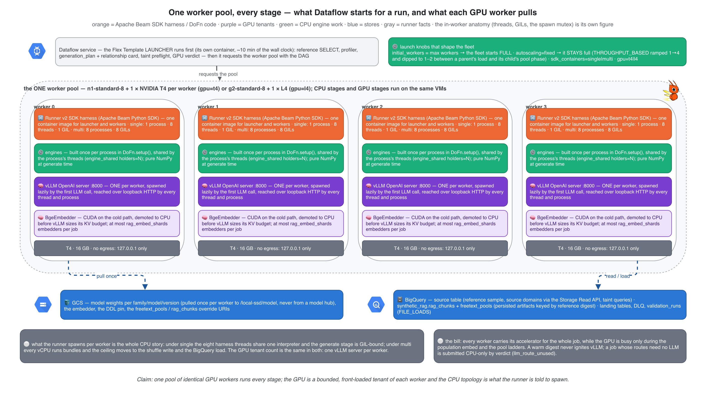

A Dataflow batch job has one worker pool, so the choice is not "CPU
workers here, GPU workers there" — it is which stages run on the
accelerator-carrying VMs and for how long. Three facts from Parts 1 and 2
make the answer almost forced:

- **The LLM runs O(1) times per column, not per row.** Free-text pools
  are built once per column and reference digest, persisted, and drawn
  from with replacement. The cell-by-cell alternative is four orders of
  magnitude slower ([Yang et al. 2025](https://arxiv.org/abs/2507.19334))
  and flattens distributions ([Sidorenko 2025](https://arxiv.org/abs/2505.02659)).
- **Everything per row is NumPy.** Inverse-CDF draws, categorical
  frequencies, positional alphabets, identity synthesis, FK keys from the
  parent's landed keys — none of it touches CUDA.
- **The embedder exists to pick eight seeds.** Retrieval runs once per
  pool build, over ≤ 10k vectors; the FAISS index costs seconds per job.

So the GPU has two jobs, both before the first row: embed the reference
chunks (cold RAG only) and run the pool ladders (cold pools only). The
sequence below is the whole run on one page; purple bars are the only
moments the card works.

*A relational launch is one job on one pool — the driver decides, the GPU
seeds, the CPU generates and defends, the runner shuffles once, BigQuery
loads and judges:*

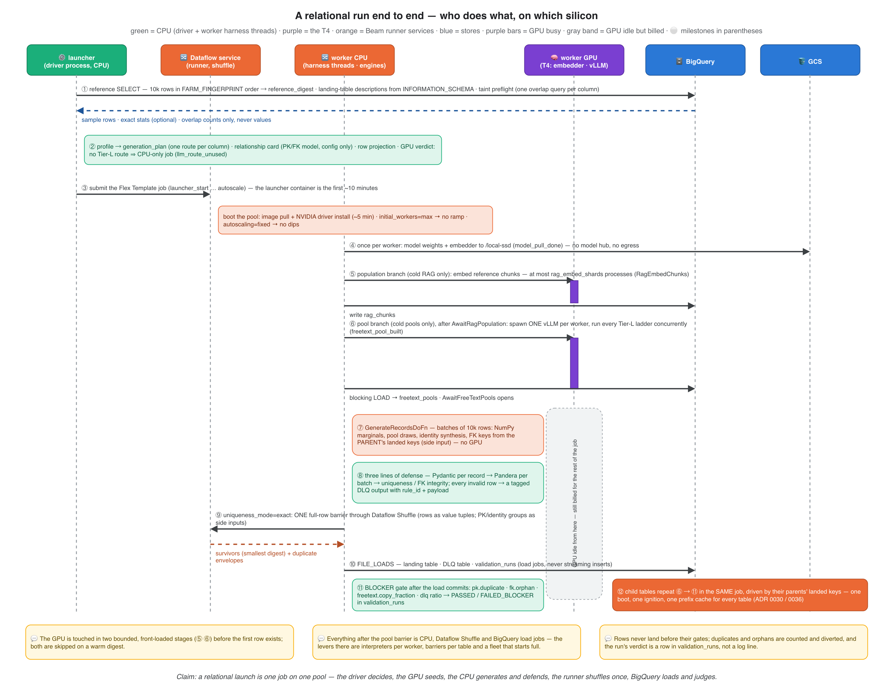

Read the lanes left to right. The launcher (a CPU-only container) does
the thinking: reference sample, profiles, the `generation_plan`, the
relationship card, the taint preflight — and a **GPU verdict**: a job
whose routes need no LLM is submitted CPU-only (`llm_route_unused` is a
prediction at launch, not a post-mortem). Workers pull weights once from
GCS, embed and ladder on the GPU, then generate, validate, deduplicate
and load on CPU, Dataflow Shuffle and BigQuery. Child tables repeat the
worker half in the same job, driven by their parents' landed keys — one
boot, one ignition, one prefix cache for every table.

*Warming removes only the 8-minute pool branch; CPU generation and the
dedup shuffle barriers are ~70% of both jobs, and the GPU served pool
ladders for ~11 of the cold job's 94 minutes:*

📉 **What the run showed.** The 2026-08-29 R6 pair — a cold 10M-row
relational run and its immediate warm re-trigger — is the measurement
this whole article hangs on. Both were clean (PK uniqueness 1.0, 0/10M
orphans, `dlq_by_rule={}`). The cold run took 93.8 minutes; the warm one,
with zero vLLM spawns and every store hit, still took 86. Warming buys
the pool branch and nothing else. The time is in the green and hatched
bars: CPU generation and the dedup barriers.

*The GPU was busy 11 of the 274 minutes it was billed cold, and 0 of 272
warm — the LLM is O(1) per column, the accelerator bill is O(wall
time):*

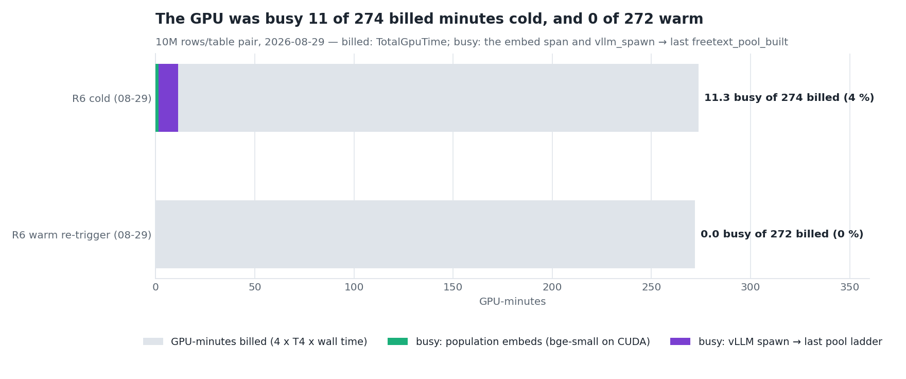

🔧 **What the code does now.** The GPU side did not change after this
pair — it was already the design working as intended. What changed is the
CPU side, and the rest of this article is that story: one engine per
process instead of one per thread, eight interpreters per worker instead
of one, one shuffle barrier instead of three, a fleet that starts full.
The honest trade-off stays on record: a single pool means the accelerator
is billed for the CPU phases. The alternatives — a population-only
GPU-less template, or a second CPU-only job for generation — were
deferred ([ADR 0019](https://github.com/albertols/synthetic-llm-dataflow-bigquery/blob/master/docs/adr/0019-rag-population-scoped-to-consumers.md), [ADR 0030](https://github.com/albertols/synthetic-llm-dataflow-bigquery/blob/master/docs/adr/0030-single-job-relational-generation.md)) because the pool branch finishes inside the
generate stage's setup and a second job would re-pay the 15-minute
launch. A quantized checkpoint and the CPU-only verdict are the cheaper
levers on that bill, and both are configuration, not code.

## vLLM inside the DoFn: a server the client owns

Beam ships vLLM model handlers for `RunInference`
([`VLLMCompletionsModelHandler`](https://beam.apache.org/releases/pydoc/current/apache_beam.ml.inference.vllm_inference.html)),
and Dataflow documents that path end to end
([vLLM on Dataflow](https://docs.cloud.google.com/dataflow/docs/notebooks/run_inference_vllm)).
This pipeline adopted vLLM through that door ([ADR 0011](https://github.com/albertols/synthetic-llm-dataflow-bigquery/blob/master/docs/adr/0011-adopt-beam-vllm-model-handler.md)) and then walked
out of it ([ADR 0014](https://github.com/albertols/synthetic-llm-dataflow-bigquery/blob/master/docs/adr/0014-vllm-model-client-owns-server.md)), for a reason of *shape*: `RunInference` is a
`PTransform` over a `PCollection` of prompts, and there is no PCollection
of prompts here. The engines call `model_client.generate_json(prompt,
schema, n=4, …)` **synchronously**, inside `DoFn.setup()`, O(1) times per
column. So `VLLMModelClient` owns a vLLM OpenAI-compatible server as a
subprocess and talks to it over loopback HTTP. Everything vLLM is good at
— continuous batching, PagedAttention, structured outputs, prefix caching
— is still there; what is gone is a transform that would have needed a
PCollection to run inference over. (If your workload *is* per-element
inference over a stream, the handler is the right shape — the last
section says so plainly.)

*A cold column costs the GPU one embed, one ignition and a handful of
array requests; a warm one costs it nothing — and every step has a
milestone name in the worker log:*

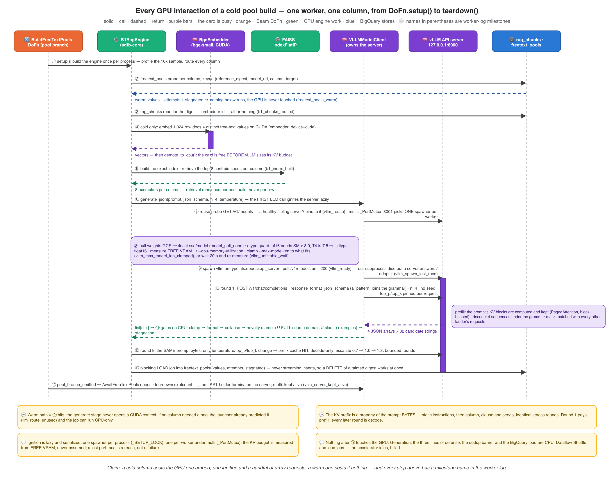

Follow the circled numbers. ② is the warm exit: a `freetext_pools` hit
means nothing below it runs and the generate stage never opens a CUDA
context. ④ is the embedder's only turn on the card — it demotes itself to
CPU before vLLM sizes its KV budget, because vLLM asks for a *fraction of
total* memory and a 150 MB tenant it does not know about is enough to
fail its engine init. ⑥–⑨ are ignition, and they are where the
engineering is:

- **Lazy.** The first real LLM call ignites the server. A run with no
  Tier-L column never pays it.
- **Serialized twice.** One spawner per process (`_SETUP_LOCK`) and,
  under the multi-process topology, one per worker (`_PortMutex`, a
  bound loopback port every SDK container on the VM can see). The
  losers poll the reuse probe (`GET /v1/models`) and bind to the winner
  (`vllm_reuse`, `vllm_spawn_lock_wait`).
- **Measured, never assumed.** The client reads the model's
  `config.json` and checkpoint bytes, queries free VRAM, derives
  `--gpu-memory-utilization` from what is actually free (capped at 0.85),
  and clamps `--max-model-len` to what the remaining budget can host
  (`vllm_max_model_len_clamped`). A card that cannot host the 4,096-token
  floor is not spawned into: the client waits 20 s and re-measures, up to
  twelve times (`vllm_unfittable_wait`), because sibling embedders demote
  within that window.
- **Refused early when doomed.** A bf16-only family on a Turing card
  raises `ModelGpuIncompatibleError` before the spawn; three consecutive
  startup failures suppress further spawns for the process so a bad
  model path fails the bundle in seconds instead of thrashing the GPU
  for fifty minutes.
- **A lost race is a reuse.** If our subprocess exits "address already
  in use" while a healthy sibling serves the port, the client adopts the
  sibling (`vllm_spawn_lost_race`) instead of failing the bundle.
- **Refcounted.** Every client bound to the server counts; `teardown()`
  terminates only from the last holder (a spawner that leaves early
  parks its handle for the last one out). Under the multi-process
  topology the server is never terminated by a client — a sibling
  process's refcount is invisible — so it is kept alive and the VM reaps
  it (`vllm_server_kept_alive`).
- **Zero egress.** The server binds `127.0.0.1:8000`; weights come from
  GCS to `/local-ssd/model` once per worker; `HF_HUB_OFFLINE=1` in the
  image. No prompt, schema or sample value leaves the VM.

Every one of those bullets is a lesson, and the measured one deserves its
figure:

*In the first 1M-row run, free-text pools were rebuilt 108 times — 36
per column — for 19.1 GPU-hours of identical LLM service, and the last
pool completed at t+64 of a 68-minute job:*

📉 **What the run showed.** Before pools were a persisted artifact, every
`DoFn.setup()` on every autoscaled worker rebuilt them; the pool cache
was per process, and autoscaling multiplied the build by the number of
processes. The follow-up run (2026-07-26, the WS6 design) added the
retry cascade: three spawns raced for the fixed port within 72 seconds,
the losers crashed `setup()`, Dataflow retried the bundle in the *same*
process, and the retry's embedder found 2.8 MiB free on a card the
winning vLLM already owned — 4 startup failures, 11 setup retries, 12
CUDA OOMs from one unchecked assumption.

🔧 **What the code does now.** Pools persist per reference digest behind
a runner-level barrier (`AwaitFreeTextPools` — generate bundles are not
scheduled until the rows are readable); `device="auto"` means *CUDA if
there is room* (512 MiB free, else `embedder_cuda_no_room`); the port
race is a reuse; utilization is derived from free memory. The whole
bullet list above is the residue of those two runs.

## What the engine does with a request

A `ModelClient` request is one chat completion with
`response_format=json_schema`, `n=4`, no seed (a pinned seed with `n>1`
makes vLLM return four identical choices), and `top_p`/`top_k` pinned
per request — the served model's `generation_config.json` had silently
overridden the defaults (`top_k=20, top_p=0.8`) and collapsed the nucleus
onto exemplar echoes at every temperature. What vLLM does with that
request has two phases, and the vocabulary matters for everything that
follows:

- **Prefill** processes the prompt tokens and writes their key/value
  tensors into the KV cache. Its cost is the prompt length; its output is
  the first token — so *time to first token* is a prefill number.
- **Decode** produces one token per step per sequence, reading the whole
  KV cache each step. Its cost is the number of generated tokens; the
  engine batches every in-flight sequence into each step
  (*continuous batching*), so aggregate tokens/s grows with concurrency
  until memory or compute binds.

The pool ladder is built for that shape. Its prompt — static
instructions, then the column, the rendered clause, the eight seeds, the
length hint — is byte-identical across rounds, so vLLM's
[automatic prefix caching](https://docs.vllm.ai/en/stable/design/prefix_caching/)
(blocks hashed by their tokens and the prefix before them; only complete
blocks are cached) serves every round after the first from the cache.
And each request asks for an *array* of 32 values, four completions at a
time, so a column costs a handful of requests, not a request per value.

*The pool ladders are decode-bound and batched: with 28 requests in
flight one T4 sustained 225–294 generated tokens/s while the KV cache
never passed 38%, prompt tokens were paid only at round boundaries after
the first window, and the prefix cache hit rate climbed from 74% to 94%
over ten minutes:*

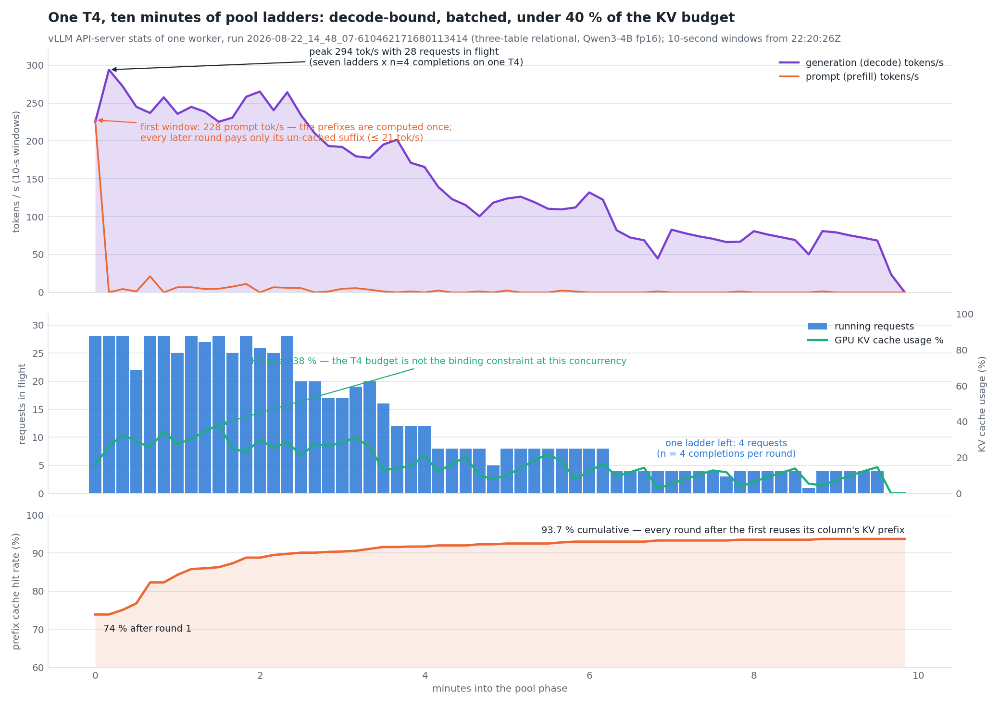

📉 **What the run showed.** These are vLLM's own 10-second stats lines
from one worker of a three-table relational run (2026-08-22), with
several tables' pool branches on the card at once — seven ladders × n=4
completions. Three things to take from the three panels:

- **Prompt vs completion tokens.** The first window carried 228 prompt
  tokens/s — every ladder's prefix computed once — and no later window
  exceeded 21. From then on the card did nothing but decode. A round's
  latency is its decode time; time to first token after round 1 is the
  un-cached suffix, a few tokens.
- **Concurrency is what makes it affordable.** At 28 requests the engine
  produced ~250 tokens/s; at 4 (one ladder left) ~75. The per-request
  decode rate is roughly what a single sequence gets on a T4; what
  batching buys is the multiplier. This is why every Tier-L ladder of a
  job submits concurrently ([ADR 0028](https://github.com/albertols/synthetic-llm-dataflow-bigquery/blob/master/docs/adr/0028-constraint-router-relational-plan.md) D6) instead of one column at a time:
  a half-empty queue is the expensive failure mode of a decode-bound
  workload.
- **Cache hit ratio.** vLLM reports the cumulative fraction of prompt
  blocks served from the cache. 74% after round 1 already reflects the
  shared static prefix across columns; 94% by the end says that rounds
  2..k paid for almost nothing but their sampling parameters. The trap
  the [ADR 0028](https://github.com/albertols/synthetic-llm-dataflow-bigquery/blob/master/docs/adr/0028-constraint-router-relational-plan.md) evidence found: the pool prompt used to interpolate the
  column name in its *first* sentence, so the cache was intra-column
  only — the layout is now static-prefix-first, and the preamble KV is
  shared across every column of every table.

🔧 **What the code does now.** Static-prefix-first prompt layout; all
ladders concurrent; sampling parameters pinned per request; no request
seed when `n>1`. The KV cache usage panel is the number that decides
whether any of the "not explored" optimizations later in this article
matter: it peaked at 38% with 28 requests in flight. The budget is not
binding at this concurrency.

Which raises the question of what the budget *is*. PagedAttention
([Kwon et al. 2023](https://arxiv.org/abs/2309.06180)) is the reason a
KV budget can be reasoned about at all: vLLM allocates the cache in
fixed-size blocks (16 tokens here) and maps a sequence's tokens onto
non-contiguous blocks, so the card's free memory translates linearly into
tokens of context. The client does exactly that arithmetic before it
spawns:

*Every gibibyte a sibling holds at ignition costs ~7,300 tokens of
context — on a free T4 the fp16 Qwen3-4B server fits its 8,192-token
request comfortably, and the client's clamp only ever lowers the flag:*

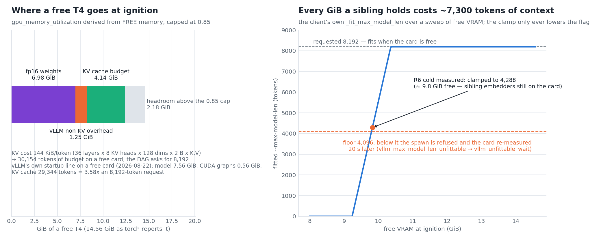

💡 **Concept, with one measured marker.** The left panel is where a free
T4 goes: the 0.85 cap, the fp16 weights, vLLM's own non-KV overhead
(measured at ~0.94 GiB on a July run, budgeted at 1.25), and what is left
for KV — at 144 KiB per token for Qwen3-4B's geometry, about 30k tokens.
vLLM's startup line on the same card agrees (29,344 tokens, 3.58× an
8,192-token request). The right panel runs the client's `_fit_max_model_len`
over a sweep of free VRAM; the orange marker is the R6 cold run, where
sibling embedders still held part of the card at ignition and the client
clamped 8,192 → 4,288 rather than let vLLM's engine init fail. Below
4,096 it refuses to spawn and waits. **PagedAttention is used, not
tuned:** at ≤ 4 ladders × n=4 per worker the cache is never the
constraint, so no block-size or swap-space knob was worth an experiment.
The lever that *would* move this figure is a 4-bit checkpoint — the
weights bar shrinks by ~5 GB and the clamp disappears — and that is a
`config/models.yml` decision.

## Guardrails on the LLM route

"Hallucination-free" is a claim readers rightly distrust, so here is
exactly what it means on this pipeline and where each guard is enforced.
Here a hallucination is not a wrong fact — the LLM is never asked for
facts. It is an **off-format value** (a remark that is 62 characters on
a 35-character fixed-width field, a code that is not a code) or a **copy
of a real value** (the extraction risk of
[Carlini et al. 2021](https://arxiv.org/abs/2012.07805), which for a
seeded prompt is simply an echo). Both are caught by deterministic code
against the reference sample and the source table; there is no
LLM-as-judge anywhere.

*Two rails bound what the decoder can emit and what the pipeline can
land; every candidate stops at nine stations in a fixed order, and no
exit is silent:*

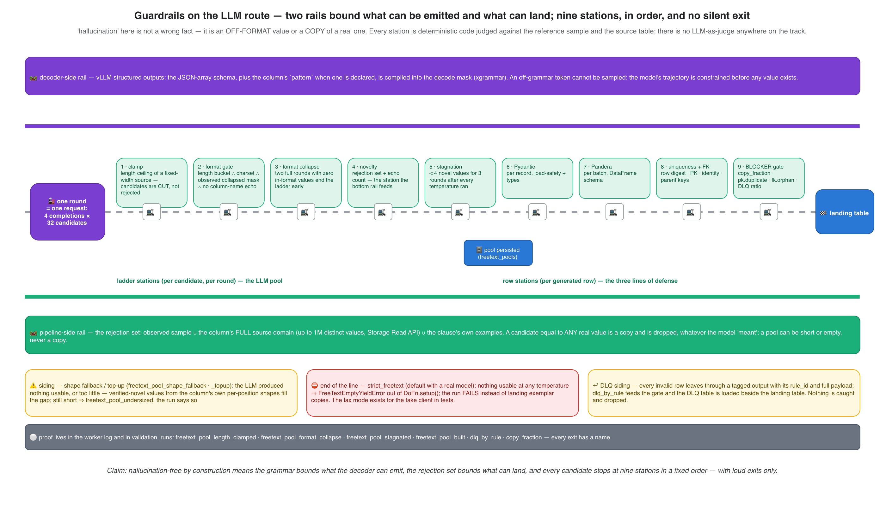

The two rails are the part that generalizes beyond synthetic data:

- **The decoder-side rail** is vLLM structured outputs
  ([Willard & Louf 2023](https://arxiv.org/abs/2307.09702) is the
  finite-state idea; [xgrammar](https://arxiv.org/abs/2411.15100) the
  implementation vLLM uses). The JSON-array schema — and the column's
  `pattern`, when the operator declared one — is compiled into the mask
  applied at every decode step. An off-grammar token cannot be sampled;
  malformed output is impossible by construction, and the measured result
  on the router evidence run was zero off-format values on pattern-guided
  columns against twelve leaks from the same intent written as prose.
- **The pipeline-side rail** is the rejection set: the observed sample ∪
  the column's *full* source domain (up to 1M distinct values, fetched
  through the BigQuery Storage Read API) ∪ the clause's own examples. A
  candidate equal to any real value is a copy, whatever the model
  "meant".

Between the rails, the stations are Part 2's ladder gates (clamp → format
→ collapse → novelty → stagnation) followed by the three lines of defense
every generated row passes (Pydantic per record → Pandera per batch →
uniqueness and FK integrity) and the run-level BLOCKER gate. The sidings
are the failovers, and each one is a named milestone: the shape fallback
and top-up, the `strict_freetext` failure that ends the run rather than
land exemplar copies, and the DLQ. The detailed ladder — every gate's
rule, the escalation, the exits — is Part 2's
[pool-ladder figure](assets/freetext-pool-ladder.png); this figure is the
same machine seen as guardrails.

## Parallelism: cores, threads, processes, and one GIL

This is the section that halved the job, and it starts with a fact
about Python rather than about GPUs. Dataflow's Runner v2 starts one SDK
harness process per vCPU by default; the GPU tiers had pinned
`no_use_multiple_sdk_containers` (one process per worker) because in
July every sibling process ran the full `DoFn.setup()` — its own weight
pull, its own vLLM spawn into the one card, its own embedding pass. One
process fixed that and quietly installed a ceiling: eight harness
threads on one interpreter, one
[GIL](https://docs.python.org/3/glossary.html#term-global-interpreter-lock).

*`single` runs one interpreter per worker — eight threads on one GIL —
while `multi` runs one per vCPU with the vLLM spawn serialized by a port
mutex and shared by the other seven:*

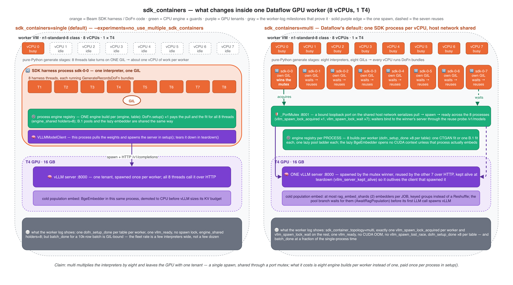

💡 **Concept, not a run.** Everything that changes inside one worker
between the two topologies: threads and GILs per vCPU, the engine
registry per process, the spawn mutex and the reuse probe, the bounded
population embed. The GPU tenant count is the same in both — one vLLM
server per worker.

*Generation was bound by one interpreter per worker: eight interpreters
measured 3× the fleet rate at four workers, and the 8× linear projection
is the hatched bar:*

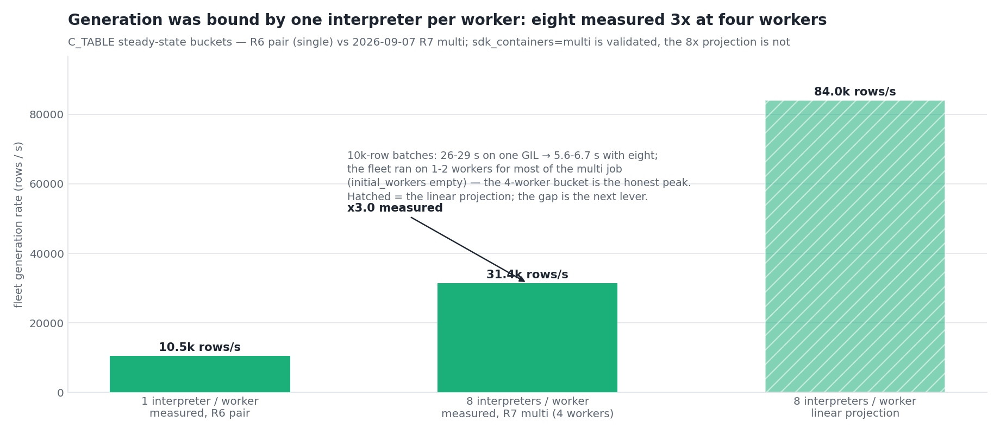

📉 **What the run showed.** On the R6 pair a 10k-row batch took 26–29 s
under eight-thread contention and 4 s uncontended; the fleet's steady
state was ~10.5k rows/s — four interpreters' worth of work for 32 billed
vCPUs. The 2026-09-07 acceptance pair ran the same job with
`sdk_containers=multi`: 5.6–6.7 s per batch, 31.4k rows/s in the one
bucket where four workers were up, exactly one `vllm_spawn_lock_acquired`
per worker, no CUDA OOM, no lost race.

*Thirty-two engine builds per table — four workers × eight threads —
cost 2,940 thread-seconds serialized on process locks and one GIL, when
one uncontended build costs 18 seconds:*

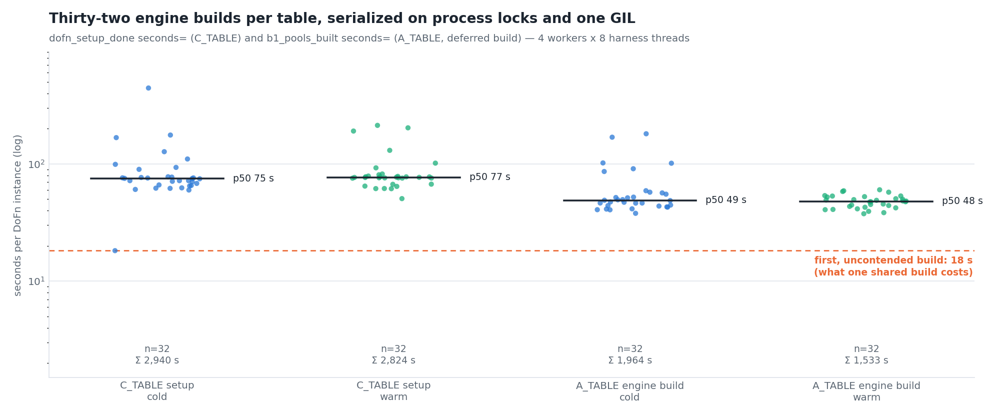

📉 **What the run showed.** Every `GenerateRecordsDoFn` instance built its
own engine: chunk-store read, FAISS index, pool-store reads, per-column
source-domain and k-anonymity fetches, the FK key-pool fit — 32 times per
table, p50 75 s, max 444 s, serialized on single-flight locks that
existed to stop duplicate *fetches* but not duplicate *engines*.

🔧 **What the code does now.** One engine per (engine, run, landing
table, reference digest) per process: the first DoFn builds under a
per-key lock, siblings share it (`engine_shared holders=8`), holders are
refcounted and the last one tears the engine and its `ModelClient` down.
Four builds per table instead of 32; p50 26 s. Under `multi` the same
seam gives eight builds per worker — one per process — which is the
price of eight GILs, paid once in `setup()`. `b2_library` gets the seam
for free: one CTGAN fit per process instead of eight.

Two more topology decisions belong here. **NVIDIA MPS**
([Dataflow docs](https://docs.cloud.google.com/dataflow/docs/gpu/use-nvidia-mps))
would share one CUDA context across SDK processes; it is meant for
`RunInference` with `model_copies > 1` on one card. Evaluated, not
adopted: the GPU already has exactly one tenant per worker, reached over
HTTP by every process, and the only other CUDA user — the cold
population embed — is bounded to two processes per job that finish
before the spawn. MPS becomes relevant with a second model process per
card, which is not this design. And **ladder parallelism** is bounded on
purpose: at most four ladders per engine, n=4 completions each, so a
pool branch keeps ≤ 16 requests in flight per table — enough to fill a
T4's decode batch, not enough to approach its KV budget.

## Starting full, staying full

*Five runs of one job shape: 93.8 → 76.5 → 50.5 → 52.5 → 56.9 minutes —
the single-barrier dedup halved the dedup phase, the multi-process
topology halved generation, and the last two runs gave minutes back to
the autoscaler's dips and to CPU population embeds:*

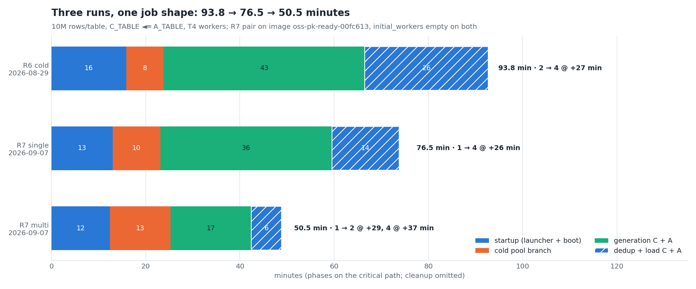

📉 **What the run showed.** Every one of the five launches left
`initial_workers` empty, and Dataflow's
[throughput-based autoscaler](https://docs.cloud.google.com/dataflow/docs/horizontal-autoscaling)
did what it is designed to do: start small, add workers on backlog, and
— on a relational job — drop to one or two workers through the parent's
load and the child's pool phase, then re-provision VMs for the child's
generate stage. C_TABLE ran its first eight minutes at a quarter of its
steady rate; the child ran short-handed. The 09-08 run added a second
lesson: moving the cold population embed to CPU under `multi` put
fifty-six embedders on the fleet's vCPUs and starved the model pull and
the engine init on the same VMs.

*The same 7.5 GB checkpoint ignited in 183 s on a free card and 599 s
beside fifty-six CPU embedders — ignition time is set by the card's and
the VM's other tenants, not by the model:*

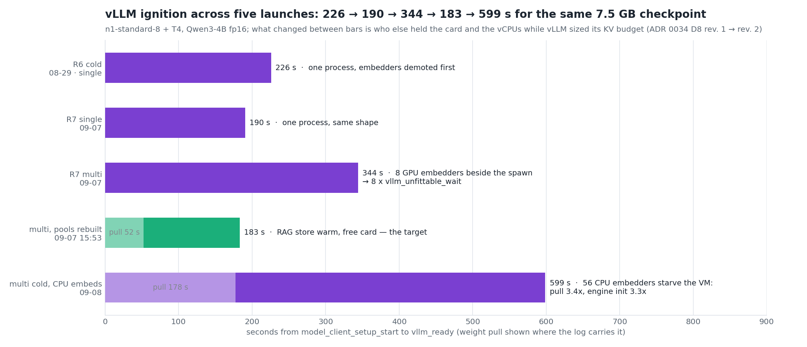

🔧 **What the code does now.** Three knobs, each a one-line launch
parameter:

- **`initial_workers`** — a scale run starts at its worker ceiling
  (pinned through `WorkerOptions.num_workers`).
- **`autoscaling=auto|throughput|fixed`** — `auto` pins Dataflow's
  `autoscaling_algorithm=NONE` exactly when `initial_workers` is given;
  `fixed` refuses to launch without it. A fleet sized by hand stays that
  size, through the parent's load and the child's pool phase. The cost is
  a fixed four-worker bill through load and cleanup — minutes on a
  10M-row run.
- **`max_num_workers`** stays capped at four on the GPU tiers: more GPU
  workers than the pool branch can use means more idle vLLM cold starts,
  not more throughput.

And one topology rule: the population embed stays on the GPU whatever
the topology, bounded to `rag_embed_shards` (two) processes per job by
keyed groups instead of a `Reshuffle`, and the pool branch waits for it
(`AwaitRagPopulation`) so its first LLM call — the one that spawns vLLM
— meets a free card and idle cores. Expected cold multi run with all
three in place: ≈ 44–46 minutes, to be read from the next launch.

## After the GPU: uniqueness, the DLQ, and load jobs

*Only 26 of 53 minutes actually generated rows: every idle band is a
worker wave paying the pool ladder again, and nothing landed until the
GroupByKey barrier released:*

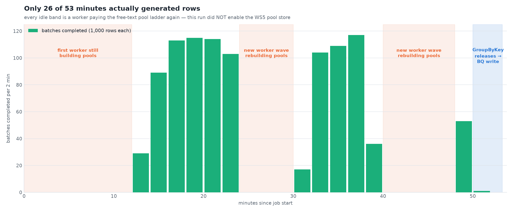

📉 **What the run showed.** Two things in one figure. The idle bands are
the pool-store lesson again (this run had not enabled it). The blue band
at the end is structural: `EnforceUniqueness` chained three full-row
`GroupByKey`s (row digest → PK → identity), and in batch Beam a
`GroupByKey` is a materialization barrier — no output until all input
has arrived. Rows cannot land while generation runs, and the whole
dataset crosses Dataflow Shuffle once per barrier.

*One dedup barrier instead of three: six full-row shuffle passes per
table become two, from 123 GB measured to ~24 GB projected per job, with
the same envelopes and counts:*

🔧 **What the code does now.** `uniqueness_mode` has three values, and
the design doc draws one panel per mode; the one-line version:

| Mode | Barrier | Duplicates | Use when |
|---|---|---|---|
| `exact` (default) | one full-row shuffle keyed by digest; PK and identity resolved from key-only collision groups delivered as side inputs; survivor = smallest digest | diverted to the DLQ with `row.duplicate` / `pk.duplicate` / `identity.unique` envelopes | you need duplicates removed |
| `exact_chained` | the chain of three barriers from before [ADR 0034](https://github.com/albertols/synthetic-llm-dataflow-bigquery/blob/master/docs/adr/0034-generation-throughput-single-barrier-shared-engines.md) | same envelopes, same counts, ~3× the shuffle bytes | A/B only |
| `streaming` | none — rows land as generated; a digest-only branch counts duplicates | land; the rate is measured and gated, `distinct_count` keeps the gate ratio honest | you want rows early and will re-run on a gate failure |

On the R6 pair the chain was 26 of 94 minutes and 123 GB through
Shuffle, with `resource exhausted` retry storms and a harness restart
inside each barrier phase; the single barrier halved the dedup phase on
the very next run.

Two conventions that never changed and are worth stating once:

- **The DLQ pattern.** Every validation DoFn — per-record Pydantic,
  per-batch Pandera, uniqueness, FK integrity — emits invalid rows on a
  **tagged output**, never drops them: each envelope carries the
  `rule_id`, the error context and the row's own payload. `dlq_by_rule`
  is aggregated into `validation_runs`, the DLQ table is loaded beside
  the landing table, and the BLOCKER gate (`pk.duplicate`, `fk.orphan`,
  `freetext.copy_fraction`, the DLQ ratio) runs *after* the load jobs
  commit, so a `FAILED_BLOCKER` run still has its own summary row.
- **`FILE_LOADS`, never streaming inserts.** Batch-shaped, cheaper, and
  — for the pool branch's blocking load into `freetext_pools` — the
  reason a tainted digest can be deleted and rebuilt immediately
  (streamed rows would sit in the streaming buffer where a `DELETE`
  cannot reach them).

## Accelerators, models, machine types, dtypes

The matrix the runs actually used, with the rule behind each cell. It
will grow as other open-weight families and accelerators are staged;
the rules are the part that stays.

| Tier | Machine · accelerator | Model · dtype | KV budget at 8,192 context | Status |
|---|---|---|---|---|
| `gpu=t4` | `n1-standard-8` (8 vCPU) · 1 × NVIDIA T4 16 GB, compute capability 7.5 (Turing) | `qwen3/4b-instruct-2507`, bf16 checkpoint served with `--dtype float16` | fits on a free card (≈ 30k tokens); clamped when siblings hold the card | every measurement in this article |
| `gpu=l4` | `g2-standard-8` · 1 × NVIDIA L4 24 GB, CC 8.9 (Ada) | Gemma 4 E4B-it (bf16) · Gemma 4 26B-A4B AWQ · Qwen 2.5 7B (bf16, L4-only by VRAM) | native bf16; the 26B-A4B AWQ checkpoint ≈ 16 GB | the fidelity profile; runs pending an L4 campaign |
| CPU | `e2-standard-8`, no accelerator | none — `client_type=fake` or a job whose routes need no LLM | — | smokes and CPU-only verdict runs |

The rules:

- **dtype follows compute capability.** bf16 needs SM ≥ 8.0; T4 is 7.5.
  A family that is fp16-safe (Qwen) is served with an explicit
  `--dtype float16` downcast; a family that is not (Gemma, which emits
  empty output in fp16 and whose attention head sizes exceed Turing's
  shared memory) is refused before the spawn by the dtype guard
  (`ModelGpuIncompatibleError`). There is no Gemma-on-T4 configuration,
  quantized or not — quantization shrinks weights, not the attention
  working set.
- **Attention backend follows the card.** FlashAttention-2 needs SM ≥
  8.0; on the T4 vLLM selected its Triton attention backend
  (`TRITON_ATTN` in the 2026-08-22 worker log). It works; it is one
  reason a T4 decodes at ~75 tokens/s per ladder while an L4 would not.
- **Context is capped, not native.** Qwen3's native 262K context would
  size a 36 GiB KV cache; the DAG pins `vllm_max_model_len=8192` and the
  client clamps below that from free VRAM. The floor is 4,096 because a
  pool round needs `max_tokens=2048` plus its prompt.
- **Weights never come from a hub.** `gs://{bucket}/synthetic/models/{family}/{model}/{version}/`,
  pulled once per worker to local SSD; `HF_HUB_OFFLINE=1` and
  `TRANSFORMERS_OFFLINE=1` in the image; the worker boot disk is pinned
  at 200 GB in the launcher for the image plus the checkpoint.
- **One image, two roles.** The Flex Template launcher and the workers
  run the same container (Beam Python SDK 2.74.0, vLLM ≥ 0.21 with
  transformers 5.x, torch with its own CUDA runtime libs; the NVIDIA
  driver comes from Dataflow's `install-nvidia-driver` experiment —
  pinned to the `5xx` series on T4 per Dataflow's own guidance).
- **Machine size is CPU headroom.** Both `g2-standard-4` and `-8` carry
  exactly one L4; `-8` exists for the CPU stages beside the GPU. On the
  T4 tier the same logic picks `n1-standard-8`.

## Optimizations assessed — and where each one sits

*What was adopted sits on the prefix and the grammar — the two places
this workload repeats itself; what was declined sits where it has no
pressure, and each verdict names the trigger that would reverse it:*

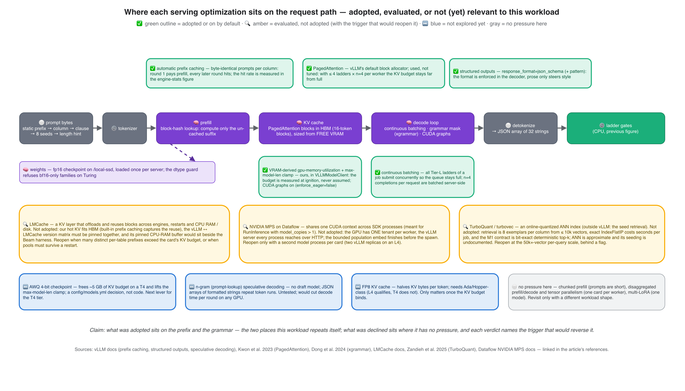

The verdicts, with the reasoning a future reader can re-check:

| Technique | What it does | Here | Verdict · trigger to revisit |
|---|---|---|---|
| Automatic prefix caching | reuses KV blocks for byte-identical prompt prefixes | every ladder round after the first; measured 74 → 94% | ✅ adopted; keep prompts static-prefix-first |
| Structured outputs (xgrammar) | compiles a schema / regex into the decode mask | the decoder-side rail; zero off-format on pattern-guided columns | ✅ adopted; prose steers style only |
| PagedAttention | block-granular KV cache | on by default; the KV budget arithmetic depends on it | ✅ used, not tuned — KV peaked at 38% |
| Continuous batching · CUDA graphs | batch every in-flight sequence per step; capture decode graphs | all ladders concurrent, n=4; `enforce_eager=false` | ✅ defaults kept |
| VRAM-derived utilization + `max-model-len` clamp | size the server from free memory at ignition | `VLLMModelClient`; `vllm_gpu_memory_utilization`, `vllm_max_model_len_clamped` | ✅ ours; the reason ignition survives a shared card |
| [LMCache](https://docs.lmcache.ai/) | KV layer: offload to CPU RAM / disk / remote, reuse across engines and restarts | hot KV fits HBM; built-in prefix caching captures the reuse; a pinned CPU-RAM buffer would sit beside the Beam harness; vLLM ↔ LMCache versions must be pinned together | 🔍 not adopted · revisit when many distinct per-table prefixes exceed the card's KV budget, or pools must survive a restart |
| [TurboQuant](https://arxiv.org/abs/2504.19874) / turbovec | online-quantized ANN vector index | retrieval is 8 seeds per column from ≤ 10k vectors; exact `IndexFlatIP` costs seconds per job; the contract is bit-exact deterministic top-k and ANN's seeding is undocumented | 🔍 not adopted · revisit at 50k+ vectors per query, behind a flag, with the determinism criterion re-scoped |
| [NVIDIA MPS](https://docs.cloud.google.com/dataflow/docs/gpu/use-nvidia-mps) | one CUDA context shared by SDK processes | one tenant per card already | 🔍 not adopted · a second model process per card |
| AWQ 4-bit checkpoint | ~5 GB less weights on the card | frees KV budget and lifts the clamp on T4 | ⏭ next lever; a `config/models.yml` decision |
| n-gram (prompt-lookup) [speculative decoding](https://docs.vllm.ai/en/latest/features/speculative_decoding.html) | drafts tokens from the prompt/output itself, no draft model | JSON arrays of formatted strings repeat token runs; would cut decode time per round | ⏭ untested; the one decode-side experiment worth running on a T4 |
| FP8 KV cache | halves KV bytes per token | needs Ada/Hopper-class (L4 yes, T4 no) | ⏭ only once the budget binds |
| Chunked prefill · disaggregated prefill/decode · tensor parallel · multi-LoRA | long prompts · separate fleets · multi-card · many adapters | short prompts, one card, one model | ⚪ no pressure |

## Observability and SLOs — what to watch (a proposal)

Nothing in this section is implemented as a dashboard; the repo's
contract is worker-log milestones plus rows in `validation_runs` and
`synthetic_data_quality.*`. But the numbers above map onto a small set of
signals a serving SLO could be written against, and most already exist as
log lines:

| Signal | Source today | Candidate SLO on the T4 tier |
|---|---|---|
| time to ignition (`model_client_setup_start` → `vllm_ready`) | milestones | ≤ 200 s on a free card; any `vllm_unfittable_wait` is a topology bug, not noise |
| pool ladder cost per column (`freetext_pool_built seconds=`, `attempts`) | milestones | p95 ≤ 300 s for a 512-value pool; collapse/stagnation exits counted |
| prefix cache hit rate, KV usage, running/waiting requests, tokens/s | vLLM's periodic stats line (also its `/metrics` Prometheus endpoint) | hit rate ≥ 80% after round 2; KV < 50%; waiting = 0 |
| GPU busy / billed ratio | `TotalGpuTime` vs the embed + ladder spans | a warm digest must be 0 busy; a cold one under ~10% on a 10M run |
| generate rate (`batch_done` per bucket), engine builds per table (`dofn_setup_done`, `engine_shared holders=`) | milestones | ≤ 4 builds per table under `single`, one per process under `multi`; first bucket within 2× of steady state |
| fleet shape (`Starting Unified Worker` after `workers_ready`) | job log | none with `initial_workers` + `autoscaling=fixed` |
| copies, duplicates, orphans (`copy_fraction`, `dlq_by_rule`, `fk.orphan`) | `validation_runs` | BLOCKER thresholds already enforced |

The one plumbing step that would turn these into alerts is exporting
Beam metrics counters (or log-based metrics on the milestone names) to
Cloud Monitoring; vLLM's `/metrics` endpoint is already there on every
worker and needs only a scraper.

## What carries to your next pipeline

For a forward-deployed engineer putting an open-weight model on Dataflow,
the transferable part of this article is a checklist, not a benchmark.
Throughput, latency and cost each have one owner here:

- **Throughput** is a CPU question until the GPU is saturated. Decide
  what runs per element and what runs O(1); then decide processes per
  worker (`multi` when the per-element work is pure Python; `single` when
  a process must own a device outright and the work is NumPy-heavy); then
  build heavy state once per process in `setup()` and share it.
- **Latency** on the GPU is decode length × (1 / batch multiplier). Keep
  prompts static-prefix-first so the prefix is cached; ask for arrays,
  not items; keep the queue full; pin sampling parameters per request.
- **Cost** is wall time × accelerator, so front-load the GPU work, skip it
  on a warm artifact, and start the fleet at its ceiling with autoscaling
  pinned. Measure busy vs billed; if busy is under 10%, the next lever is
  the CPU side or a CPU-only verdict, not a faster GPU.
- **Correctness under retries** is the part nobody budgets for: a Beam
  bundle retry lands in the same process, so every device-owning
  resource needs a refcount, a reuse probe, a lost-race path and a
  measured (not assumed) memory budget. Every bullet in the vLLM section
  came from a retry.
- **When the shape is different, use the handler.** A streaming pipeline
  doing per-element inference over a `PCollection` — classification,
  extraction, a judge — *is* `RunInference`'s shape: Beam's vLLM handlers
  batch per bundle, `model_copies` and MPS become the right knobs, and
  the SLO becomes per-element latency. The lifecycle lessons above
  (lazy ignition, VRAM-derived budgets, refcounted teardown) still apply
  inside the handler's `load_model`.

### The ledger

| Figure | 📉 What the run showed | 🔧 What the code does now |
|---|---|---|
| Where time went · GPU busy vs billed | R6 pair: 93.8 min cold, 86.1 warm; GPU busy 11 of 274 billed minutes, 0 of 272 warm | the GPU side confirmed as designed; every lever below is CPU-side |
| Cost anatomy | 108 pool rebuilds, 19.1 GPU-hours, last pool at t+64 of 68 min | pools persisted per digest behind `AwaitFreeTextPools` |
| *(no figure)* WS6 retry cascade | 3 spawns raced one port; 4 failures, 11 setup retries, 12 CUDA OOMs | lost race = reuse; `device="auto"` means room, not presence; utilization from free VRAM; spawn suppression after 3 failures |
| Engine stats | 28 requests → 294 tok/s peak; KV ≤ 38%; hit rate 74 → 94%; prompt tokens only at round boundaries | static-prefix-first prompts; all ladders concurrent; sampling pinned; no seed with n>1 |
| KV budget | R6 clamped 8,192 → 4,288 with siblings on the card | `_fit_max_model_len` before the spawn; 4,096 floor; 20-s re-measure window |
| GIL ceiling | 10.5k rows/s on one interpreter per worker; 3× at eight | `sdk_containers=multi` + `_PortMutex`; kept-alive server |
| Setup cost | 32 engine builds per table, p50 75 s vs 18 s uncontended | one engine per process, refcounted (`engine_shared holders=8`) |
| Evolution · ignition | autoscaler dips between parent and child; 56 CPU embedders → 599 s ignition | `initial_workers`, `autoscaling=fixed`, `rag_embed_shards=2` + `AwaitRagPopulation` |
| WS6 timeline · shuffle barriers | nothing lands until the third GroupByKey; 123 GB through Shuffle, 26 of 94 min | one full-row barrier; PK/identity from key-only side inputs; `streaming` mode for early landing |

## What to remember

1. **One pool, split by stage.** The GPU is touched in two bounded,
   front-loaded stages before the first row; everything after is CPU,
   Shuffle and BigQuery.
2. **vLLM is a subprocess the client owns**, not a `RunInference`
   handler — because the engines call it synchronously, O(1) times per
   column. The lifecycle (lazy, serialized, measured, refcounted,
   lost-race-tolerant) is where the engineering is.
3. **The ladder is decode-bound and batched.** Prefix caching makes rounds
   2..k cost decode only; concurrency is what makes decode affordable;
   the KV budget is not the constraint at this concurrency.
4. **Two rails, nine stations, no silent exit** — the grammar bounds what
   can be emitted, the rejection set bounds what can land.
5. **The GIL was the ceiling.** Eight interpreters per worker tripled the
   fleet rate; one engine per process made that affordable.
6. **Start full, stay full.** `initial_workers` and `autoscaling=fixed`
   are worth minutes on every relational run.
7. **One barrier, tagged DLQ outputs, load jobs.** Exact uniqueness with
   a third of the shuffle; nothing dropped silently; rows land through
   `FILE_LOADS`.
8. **dtype follows compute capability**; the KV budget follows free VRAM;
   the checkpoint is the next lever on a T4.
9. **Adopt where the workload repeats itself** (prefix, grammar); decline
   where it has no pressure, and write down the trigger.

## Where this goes next

Part 4 opens the B.1 engine's retrieval geometry — the embedder, the
chunk identity, exact retrieval, and why the seeds are centroids rather
than lookalikes. Part 5 does the same for `b2_library` and CTGAN. Part 8
returns to the numbers in this article with the fidelity math and the
1M/10M performance anatomy.

If you run Beam or Dataflow in production, serve open-weight models, or
would have placed a knob differently — say so. The comment section is
part of the project: the n-gram speculative-decoding experiment, the
4-bit T4 checkpoint and the L4 campaign are the three candidates this
article leaves open.

## References

**Serving and decoding**

- Kwon, Li, Zhuang, Sheng, Zheng, Yu, Gonzalez, Zhang, Stoica — *Efficient
  Memory Management for Large Language Model Serving with
  PagedAttention*, SOSP 2023 — [arXiv 2309.06180](https://arxiv.org/abs/2309.06180).
- vLLM — [automatic prefix caching: design](https://docs.vllm.ai/en/stable/design/prefix_caching/)
  · [structured outputs](https://docs.vllm.ai/en/latest/features/structured_outputs.html)
  · [speculative decoding](https://docs.vllm.ai/en/latest/features/speculative_decoding.html).
- Willard & Louf — *Efficient Guided Generation for Large Language
  Models*, 2023 — [arXiv 2307.09702](https://arxiv.org/abs/2307.09702);
  Dong, Chen, Guo et al. — *XGrammar: Flexible and Efficient Structured
  Generation Engine for Large Language Models*, 2024 —
  [arXiv 2411.15100](https://arxiv.org/abs/2411.15100).
- LMCache — [documentation](https://docs.lmcache.ai/). Zandieh, Daliri,
  Hadian, Mirrokni — *TurboQuant: Online Vector Quantization with
  Near-optimal Distortion Rate*, 2025 —
  [arXiv 2504.19874](https://arxiv.org/abs/2504.19874).
- Python — [global interpreter lock](https://docs.python.org/3/glossary.html#term-global-interpreter-lock).

**Apache Beam and Dataflow**

- Apache Beam — [ML inference in Beam pipelines](https://beam.apache.org/documentation/ml/about-ml/)
  · [vLLM model handlers](https://beam.apache.org/releases/pydoc/current/apache_beam.ml.inference.vllm_inference.html)
  · [Google BigQuery I/O connector](https://beam.apache.org/documentation/io/built-in/google-bigquery/)
  (load jobs vs streaming inserts) · [side inputs](https://beam.apache.org/documentation/programming-guide/#side-inputs).
- Google Cloud Dataflow — [Run a pipeline with GPUs](https://docs.cloud.google.com/dataflow/docs/gpu/use-gpus)
  · [Run ML inference by using vLLM on GPUs](https://docs.cloud.google.com/dataflow/docs/notebooks/run_inference_vllm)
  · [NVIDIA Multi-Process Service](https://docs.cloud.google.com/dataflow/docs/gpu/use-nvidia-mps)
  · [Troubleshoot out-of-memory errors](https://docs.cloud.google.com/dataflow/docs/guides/troubleshoot-oom)
  (`no_use_multiple_sdk_containers`) · [Dataflow Portable Runner](https://docs.cloud.google.com/dataflow/docs/runner-v2)
  · [Horizontal autoscaling](https://docs.cloud.google.com/dataflow/docs/horizontal-autoscaling).

**The LLM side of tabular synthesis (Parts 1–2)**

- Borisov et al. — GReaT, ICLR 2023 — [arXiv 2210.06280](https://arxiv.org/abs/2210.06280).
  Nguyen et al. — FASTGEN, 2025 — [arXiv 2507.15839](https://arxiv.org/abs/2507.15839).
  Yang et al. 2025 — [arXiv 2507.19334](https://arxiv.org/abs/2507.19334).
  Sidorenko 2025 — [arXiv 2505.02659](https://arxiv.org/abs/2505.02659).
  Carlini et al. — USENIX Security 2021 — [arXiv 2012.07805](https://arxiv.org/abs/2012.07805).
- FAISS — [facebookresearch/faiss](https://github.com/facebookresearch/faiss);
  Douze et al. 2024 — [arXiv 2401.08281](https://arxiv.org/abs/2401.08281).
  BGE — [`BAAI/bge-small-en-v1.5`](https://huggingface.co/BAAI/bge-small-en-v1.5).

---

*Provenance (dropped on Medium): sources and figures per front-matter;
claims verified at repo commit `d32c347` (v0.5.1). Figures:
`runtime-fleet-topology.png`, `runtime-cpu-gpu-sequence.png`,
`vllm-gpu-sequence.png`, `vllm-guardrails-track.png`,
`vllm-optimization-map.png` (drawio sources committed side-by-side in
`docs/articles/assets/`, exported with the next-ai-drawio MCP plugin;
they carry no measured numbers); `vllm-serving-*.png` are generated by
`scripts/doc/make_vllm_serving_figures.py` (MEASURED blocks name runs
`2026-08-22_14_48_07` and `2026-08-29_07_33_36`; ignition and GPU-minute
constants imported from `make_throughput_figures.py`; the KV-budget panel
runs `vllm_client._fit_max_model_len`); `throughput-*.png`,
`sdk-containers-topology.png`, `ws5-cost-anatomy.png` and
`ws6-run-timeline.png` are the [ADR 0034](https://github.com/albertols/synthetic-llm-dataflow-bigquery/blob/master/docs/adr/0034-generation-throughput-single-barrier-shared-engines.md) / WS5 / WS6 design assets, each
regenerated by its own `scripts/doc/make_*_figures.py` from a `MEASURED`
block — every measured number quoted above is typed once, in those
scripts. Configuration constants (pool cap 512, 32 × 4 values per round,
≤ 4 ladders per engine, 0.85 utilization cap, 1 GiB margin, 1.25 GiB
non-KV overhead, 4,096-token floor, 16-token block alignment, 12 × 20 s
unfittable window, `rag_embed_shards=2`) are the defaults at the synced
commit. The Apache Beam firefly mascot in the drawio diagrams is © the
Apache Software Foundation (beam.apache.org/community/mascot/, retrieved
2026-09-01, ASF trademark), used to identify Apache Beam; GCP product
icons are Google's official diagram set. External links retrieved
2026-09-15.*
