# LLM and Statistical Synthetic Data with Dataflow — Part 4: `b1_rag` — retrieval that seeds the prompt and never touches a row

*Self-hosted LLM generation on Apache Beam / Dataflow / BigQuery — Part 4
of the series behind the Apache Beam Summit 2025 session "Building Banking
Synthetic Data for a Lakehouse with Gemma".*

Most RAG systems answer a user. This one has no user and no question. It
has a table with a free-text column, an open-weight model that has never
seen that column, and one decision to make before the model is allowed to
invent five hundred fictional values: **which eight real ones may it look
at first?** Everything in this article — the chunks, the embedder, the
FAISS index, three seed strategies — exists to make that one choice well,
make it once per column, make it reproducible to the byte, and make sure
that a value the model merely *echoed* never lands in the output.

The short version, before the diagrams: **`b1_rag` retrieves once per
free-text column inside a Beam `DoFn.setup()`, over at most 1,024 vectors
held in an exact in-memory index; the retrieved values go into a prompt,
never into a row; the model's candidates are checked against the sample
and the column's full source domain before they may enter a pool; and the
row path that follows is
NumPy, three lines of defense and a BigQuery load job.** Retrieval is the
cheapest step in the pipeline and the one with the most leverage over
what the LLM writes.

### What this article leans on

| | Name | Role in this article | Primary source |
|---|---|---|---|
| 📰 series | Parts 1–3 | architecture · the free-text route and its ladder · the runtime this engine lives in | [intro](01-building-banking-synthetic-data-intro.md) · [type system & freetext](02-type-system-freetext-resolution.md) · common runtime (Part 3) |
| 🧠 GenAI | Retrieval-augmented generation | the pattern: retrieve, augment the prompt, generate | [Lewis et al., NeurIPS 2020](https://arxiv.org/abs/2005.11401) |
| 🧠 GenAI | Dense retrieval · sentence embeddings | why text becomes a vector and "similar" becomes "small angle" | [Karpukhin et al., EMNLP 2020 (DPR)](https://arxiv.org/abs/2004.04906) · [Reimers & Gurevych, EMNLP 2019 (SBERT)](https://arxiv.org/abs/1908.10084) |
| 🧠 GenAI | Rows as sentences | the `col is value, …` serialization every row chunk uses | [GReaT, Borisov et al., ICLR 2023](https://arxiv.org/abs/2210.06280) · counterpoint on column order: [Xu et al. 2024](https://arxiv.org/abs/2406.14541) |
| 🧠 GenAI | Which examples you show matters | the reason retrieval is worth having at all | [TabGen-ICL, Fang et al. 2025](https://arxiv.org/abs/2502.16414) · [EPIC, Kim et al., NeurIPS 2024](https://arxiv.org/abs/2404.12404) · [CLLM, Seedat et al., ICML 2024](https://arxiv.org/abs/2312.12112) |
| 🧠 GenAI | The LLM runs O(1) times | why retrieval is per column, not per row | [FASTGEN, Nguyen et al. 2025](https://arxiv.org/abs/2507.15839) · [Yang et al. 2025](https://arxiv.org/abs/2507.19334) · [Sidorenko 2025](https://arxiv.org/abs/2505.02659) |
| 🧠 GenAI | The embedder | 384 dimensions, 33.4M parameters, 512 tokens, MIT | [`BAAI/bge-small-en-v1.5`](https://huggingface.co/BAAI/bge-small-en-v1.5) · [C-Pack, Xiao et al., SIGIR 2024](https://arxiv.org/abs/2309.07597) |
| 🧠 GenAI | Exact vector search | what `IndexFlatIP` is, and when the library's own authors say to use it | [Johnson, Douze, Jégou 2017](https://arxiv.org/abs/1702.08734) · [Douze et al. 2024](https://arxiv.org/abs/2401.08281) · [FAISS: choosing an index](https://github.com/facebookresearch/faiss/wiki/Guidelines-to-choose-an-index) |
| 🧠 GenAI | Coverage instead of relevance | greedy k-center, and the classic diversity re-ranker it is not | [Gonzalez, TCS 1985](https://doi.org/10.1016/0304-3975(85)90224-5) · [Sener & Savarese, ICLR 2018](https://arxiv.org/abs/1708.00489) · [MMR, Carbonell & Goldstein, SIGIR 1998](https://doi.org/10.1145/290941.291025) |
| 🛡️ privacy | Echoes are leaks | why a shown example must never land, and how closeness is scored | [Carlini et al., USENIX Security 2021](https://arxiv.org/abs/2012.07805) · [DCR, Park et al., VLDB 2018](https://arxiv.org/abs/1806.03384) · [k-anonymity, Sweeney 2002](https://doi.org/10.1142/S0218488502001648) |
| 🔀 Beam | The first-party RAG package | what it is built for, and why this pipeline built something smaller | [`apache_beam.ml.rag`](https://beam.apache.org/releases/pydoc/current/apache_beam.ml.rag.html) · [LLMs in Beam pipelines](https://beam.apache.org/documentation/ml/large-language-modeling/) · [Enrichment transform](https://beam.apache.org/documentation/transforms/python/elementwise/enrichment/) |
| ☁️ GCP | Vector search in the warehouse | the managed alternative, and what it does with a table this small | [`VECTOR_SEARCH`](https://docs.cloud.google.com/bigquery/docs/reference/standard-sql/search_functions#vector_search) · [vector indexes](https://docs.cloud.google.com/bigquery/docs/vector-index) |
| 🧠 GenAI | KV prefix caching | the last link of the byte chain | [vLLM automatic prefix caching](https://docs.vllm.ai/en/stable/design/prefix_caching/) |

### How to read this article

The three labels of Parts 2 and 3, plus one that is new and matters more
than the others:

- 📉 **What the run showed** — a measurement from a named E2E run. The
  number belongs to a figure; where the figure predates the
  generated-by-a-committed-script convention, the ADR that owns the number
  is linked.
- 🔧 **What the code does now** — the mechanism that exists today because
  of that run.
- 💡 **Concept, not a run** — a figure that teaches a mechanism on seeded
  toy data. In the figures generated for this article the *selections*
  are computed by the pipeline's own functions; only the data is invented.
- 🔬 **In the code** — the `module::function` that implements what the
  paragraph just claimed.

**This article describes what the code does, not what a RAG system
usually does.** Every data example below is the printed output of
[`scripts/doc/b1_rag_walkthrough.py`](https://github.com/albertols/synthetic-llm-dataflow-bigquery/blob/master/scripts/doc/b1_rag_walkthrough.py),
which re-implements nothing: it calls `serialize_row`,
`compute_row_digest`, `build_index`, `select_seed_examples`,
`_build_pool_prompt`, `_pool_llm_yield` and `B1RagEngine` on a fictitious
96-row table (`demo.card_transactions`, till-receipt merchant names) —
and, for one section in extra time, on fifty footballers' names. It
runs on a laptop in seconds — no GPU, no GCP:

```bash
uv run --no-sync python3 scripts/doc/b1_rag_walkthrough.py
```

If the article and that script ever disagree, the script is right and the
article is stale. Laptop honesty, stated once: without the GPU extras the
embedder is the dependency-free `HashingEmbedder` (lexical, 384 buckets)
and the index is the pure-Python exact fallback — the same two seams that
production fills with `bge-small` and FAISS — and the "LLM" is a scripted
stand-in, so the *gates* in the examples are real and the *candidates*
are not a model's output.

## Why a `b1_rag` at all

Parts 1 and 2 established that statistics can reproduce almost
everything in a table — numerics by inverse CDF, categoricals at their
source frequency, dates in range, identifiers from their shapes — without
a single token from a model. What statistics cannot do is *invent a
plausible merchant name*. For that column there are four options, and
three of them are bad:

| Option | What the model is shown | What lands | Verdict |
|---|---|---|---|
| resample the observed values | — | real values, at the right frequency | perfect fidelity, zero originality — a leak with good statistics |
| ask an LLM, zero-shot | the column name | plausible prose in nobody's format | the model cannot know a till receipt reads `CAFE ARBOL*MADRID` |
| ask an LLM, per row | the row so far | something, nearly four orders of magnitude slower | cost (≈ 9,500×: a row-generating LLM against a non-LLM sampler, [Yang et al. 2025](https://arxiv.org/abs/2507.19334)) and over-smoothed, uniform-looking distributions when cells are generated one by one ([Sidorenko 2025](https://arxiv.org/abs/2505.02659), a short note) — rejected in [ADR 0013](https://github.com/albertols/synthetic-llm-dataflow-bigquery/blob/master/docs/adr/0013-distribution-estimator-spine.md) |
| **ask an LLM once per column, with a few well-chosen real examples, then check everything it says** | eight seeds | ≤ 512 novel values, drawn with replacement | `b1_rag` |

💡 The table is the argument, not a measurement. The last row is
few-shot prompting with two disciplines added. **Retrieval** decides
which few examples — and the tabular-generation literature is blunt that
this choice is not cosmetic: randomly selected in-context examples hamper
the model ([TabGen-ICL](https://arxiv.org/abs/2502.16414)), and grouped,
consistently formatted examples help
([EPIC](https://arxiv.org/abs/2404.12404)). **Curation** decides what
survives — not everything an LLM generates improves the data
([CLLM](https://arxiv.org/abs/2312.12112)), and anything it echoes is an
extraction ([Carlini et al. 2021](https://arxiv.org/abs/2012.07805)).

That is the whole engine: the LLM is a *distribution estimator* that runs
O(1) times per column ([ADR 0013](https://github.com/albertols/synthetic-llm-dataflow-bigquery/blob/master/docs/adr/0013-distribution-estimator-spine.md)),
and retrieval is how it is told what the distribution looks like.

## Where retrieval sits in the Beam job

*Retrieval is a once-per-column prompt-seeding step inside the pool
branch's `setup()`; the row path is NumPy, three lines of defense and a
load job:*

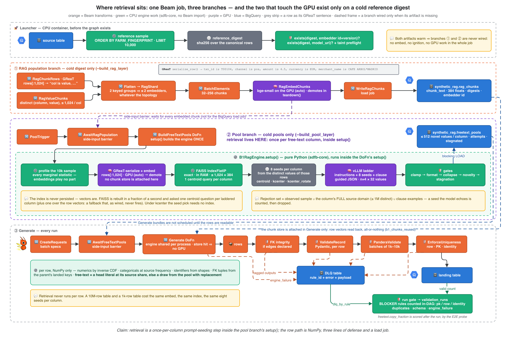

Read it top to bottom. The **launcher** draws the reference sample
(`ORDER BY FARM_FINGERPRINT(...) LIMIT 10,000`, [ADR 0005](https://github.com/albertols/synthetic-llm-dataflow-bigquery/blob/master/docs/adr/0005-live-select-reference-data.md)),
hashes it into the `reference_digest`, and asks two existence questions.
Their answers decide which branches the graph even contains:

| Step | Where | When | What it costs |
|---|---|---|---|
| chunk + embed the sample | branch ① — `RagChunkRows`, `RagValueChunks`, `RagEmbedChunks` | `--build_rag_layer`, and `rag_chunks` has nothing for this digest and embedder | one GPU embed of ≤ 1,024 rows plus the distinct free-text values |
| retrieve seeds, build pools | branch ② — `BuildFreeTextPools`, inside `B1RagEngine.setup()` | `--build_pool_layer`, and `freetext_pools` has nothing for this digest and model — or has pools that fail the taint preflight | one 1,024-row embed, one index build, a handful of queries, one LLM ladder per column |
| generate rows | branch ③ — `Generate` and everything after it | every run | CPU, Dataflow Shuffle, BigQuery |

Two Beam details carry the design. The branches are ordered by
**side-input barriers**, not by hope: `AwaitRagPopulation` holds the pool
branch until every chunk has been embedded (its side input is the
embedded-chunks PCollection, not the BigQuery write), and
`AwaitFreeTextPools` holds every Generate bundle until the pool rows are
readable. And the engine is built in **`setup()`**, not per element — one
engine per process, shared and refcounted; the one deliberate exception
is a child table whose parent keys arrive as a side input, which builds
once on its first bundle ([ADR 0034](https://github.com/albertols/synthetic-llm-dataflow-bigquery/blob/master/docs/adr/0034-generation-throughput-single-barrier-shared-engines.md)).
Part 3 owns that runtime; this part opens the green box.

🔬 **In the code.** `pipeline.py::build_pipeline` wires the three
branches; `pipeline.py::_population_branch` is branch ①;
`dofns/pools.py::BuildFreeTextPoolsDoFn` and
`engines/b1_rag/engine.py::B1RagEngine.setup` are branch ②;
`dofns/generate.py::GenerateRecordsDoFn` is branch ③.

## Step 1 — Chunking: a row becomes bytes, bytes become identity

A document RAG chunks by token window. A table has better units: the
**row** and the **cell**. `rag_chunks` holds exactly those two kinds:

- **`row_doc`** — one whole reference row, rendered as a
  [GReaT](https://arxiv.org/abs/2210.06280)-style sentence. Only the first
  1,024 rows of the (fingerprint-ordered, hence mode-agnostic) sample.
- **`free_text_col`** — one *distinct* value of one free-text column,
  ≤ 1,024 per column. The value is the chunk text.

An embedder reads text, and a table row is not text. GReaT's answer —
the one this pipeline borrows — is almost embarrassingly simple: say the
row out loud. Every cell becomes a three-word clause, *column is value*,
and the clauses are joined with commas:

*A row becomes a sentence an embedder can read — every clause keeps the
colour of its column, a missing value is written down, and the order is
the schema's:*

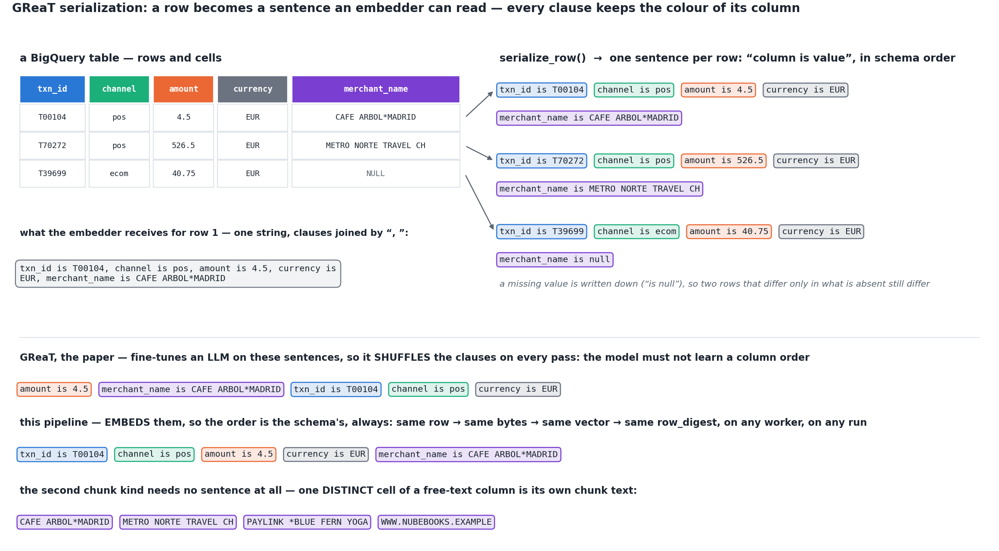

💡 **Concept, not a run.** The sentences are `serialize_row()`'s real
output for three rows of the toy table. Three things to take from it.
The **column name travels with the value**, so `amount is 4.5` and
`shirt is 4` are different sentences even though the cell is a small
number in both — the embedder gets the schema for free. **Nothing is
left out**: a `NULL` becomes `is null`, a boolean becomes `true` or
`false`, so the sentence always has one clause per column. And the
bottom half is the one place this pipeline departs from the paper —
GReaT shuffles the clauses because it *trains* a model on them; this
pipeline *embeds* them, and a shuffled sentence would be a different
vector for the same row.

The same function runs in two places, and they must agree to the byte:
the `RagChunkRows` transform that writes `rag_chunks`, and
`B1RagEngine.setup()` when it embeds rows itself (both are marked
*GReaT* in the flow diagram above). That agreement is the whole reuse
story of the next paragraphs: the stored vector is this row's vector
only if the stored sentence is this row's sentence.

```text
row            : {"txn_id": "T00104", "channel": "pos", "amount": 4.5, "currency": "EUR", "merchant_name": "CAFE ARBOL*MADRID"}
row_doc text   : txn_id is T00104, channel is pos, amount is 4.5, currency is EUR, merchant_name is CAFE ARBOL*MADRID
reference_digest (all 96 rows): 8501fac8020ae56b0bd9b3b54886c77b2bcbcdf4d8a0cb3517f11d1576574a61
row_digest     : cd7e7c765a57e53bd3645f589caadb55ebf7a973a32d39c3e9b600fca5425ac5
chunk_id       : e4046e5727ad957fab2f9d052cd7d5a28cc22d86cd7edccf5cda2a76a15f858f

same row, keys in another order:
  naive str()  : 1d1ea0c2e250a227 vs 0a347edd51ffcb27 (differ)
  row_digest   : cd7e7c765a57e53b vs cd7e7c765a57e53b (identical)
  row_doc text identical: True

chunk_row() -> [(0, 'row_doc'), (1, 'free_text_col')]
deduped value chunk (what the population branch writes):
  chunk_text : CAFE ARBOL*MADRID
  row_digest : dd373607d3b97ea9 … (digest of {column, value} — no row, no PK)
  source_pk  : None  metadata: {'column': 'merchant_name'}
  96 rows -> 81 distinct values to embed (the head literal repeats 16 times)
```

Three decisions are visible in that output.

**The column order is the schema's, always.** GReaT *randomly permutes*
the features, because it fine-tunes a model that should not learn an
order; this pipeline embeds, so it wants the opposite — the same row must
produce the same string and therefore the same vector, on any worker, on
any run. (Whether permutation is even desirable for tables is contested:
[Xu et al. 2024](https://arxiv.org/abs/2406.14541) argue it hampers
functional dependencies.) Missing keys render as `is null`, so two rows
that differ only in what is absent still differ.

**Identity is computed, not assigned.** `row_digest` is SHA-256 over the
canonical JSON (`sort_keys=True, default=str`); `chunk_id` is BLAKE2b over
`source_fqn:row_digest:index`. A dict that arrives with its keys in
another order has a different `str()` and the same digest. That single
property is what later lets a worker ask BigQuery "do you already have
*this row's* vector?" and trust the answer.

**A value chunk carries no row.** Its digest is over `{column, value}`,
its `source_pk` is `NULL`. That was a cost decision that turned out to be
a privacy one:

*The population branch once embedded 33,610 chunks on CPU for 60.8% of a
job's wall clock — about 90% of them unreadable by design or duplicates;
scoped to what its consumers can read, the same stage is estimated at
seconds on a GPU:*

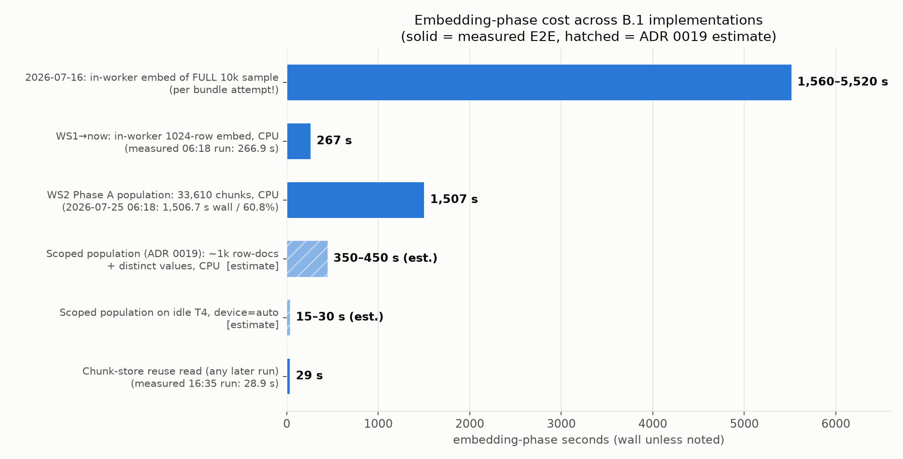

📉 **What the run showed.** The 2026-07-25 run chunked all 10,000 rows
and one value chunk *per occurrence*. The only reader of row vectors
reads the first 1,024, all-or-nothing; the only reader of value vectors
wants distinct values. Both T4s sat idle while a CPU embedded the rest.

🔧 **What the code does now.** Population writes exactly the consumers'
read contract ([ADR 0019](https://github.com/albertols/synthetic-llm-dataflow-bigquery/blob/master/docs/adr/0019-rag-population-scoped-to-consumers.md)):
`MAX_ROW_DOC_ROWS = 1024` is one constant shared by the writer and the
reader, values are deduplicated driver-side, and the embed is bounded to
two keyed groups per table — two embedders at once, not one per SDK
process. The hatched bars are
the ADR's estimates; the solid ones are measured.

🔬 **In the code.** `rag/serialize.py::serialize_row`,
`rag/chunking.py::compute_row_digest`, `::compute_chunk_id`,
`::chunk_free_text_value`, `::distinct_free_text_values`.

## Step 2 — Embedding: text becomes a direction

An embedding model maps a string to a point in space so that strings
that *mean* similar things land close together
([SBERT](https://arxiv.org/abs/1908.10084),
[DPR](https://arxiv.org/abs/2004.04906)). Here the model is
[`bge-small-en-v1.5`](https://huggingface.co/BAAI/bge-small-en-v1.5):
384 dimensions, 33.4M parameters, 512-token inputs, MIT-licensed — small
enough to share a T4 with nothing, and to be evicted from it quickly.
Weights come from GCS to local disk once per worker; `local_files_only`
and `HF_HUB_OFFLINE=1` make a Hub call impossible rather than unlikely.

The engine tokenizes, mean-pools the last hidden state over the attention
mask, and **L2-normalizes**. (An honest aside: bge was trained for `[CLS]` pooling and its model
card says so; the engine mean-pools, which is off-spec. It has been good
enough to pick eight representative values; whether `[CLS]` picks better
ones *here* is unmeasured, and cheap to find out.) Normalization is the
load-bearing step:

*On the unit sphere the inner product of two vectors is the cosine of the
angle between them — so an inner-product index ranks by cosine with zero
approximation, and "similar" means "small angle":*


💡 **Concept, not a run.** Panel A is the identity the layer rests on.
Panel B is the query `b1_rag` actually asks — and it is not a user's
question. It is the **mean of all the vectors**, a point *inside* the
sphere, and the eight nearest neighbours of that point are the eight most
typical items.

In three dimensions instead of 384, a free-text column looks like this:

*Every chunk is a point on a unit sphere; retrieval only decides which
eight the prompt shows — the centroid's eight neighbours all sit in the
dominant mode, a k-center walk reaches all five:*

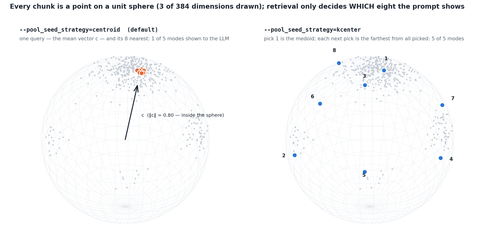

And in motion (Medium accepts GIF uploads; the PNG above is the still):

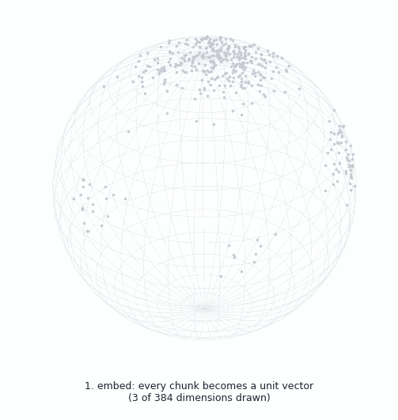

💡 **Concept, not a run.** Five modes of very unequal mass — one dominant
format, four rare ones — which is what Part 2's measured columns look
like. The picks are the output of the pipeline's
`select_seed_examples()` on the plotted vectors; the function is
dimension-agnostic, so the drawing is the algorithm.

On the laptop the same geometry is visible with the lexical stand-in:

```text
'CAFE ARBOL*MADRID' -> 384 floats, L2 norm 1.000
  non-zero components (index, value): [(84, -0.707), (186, -0.707)]
cosine similarity = inner product of unit vectors:
   0.50  'CAFE ARBOL*MADRID' · 'CAFE ARBOL*SEVILLA'
   0.00  'CAFE ARBOL*MADRID' · 'PANADERIA LUZ*MADRID'
   0.00  'CAFE ARBOL*MADRID' · 'METRO NORTE TRAVEL CH'
   0.50  'METRO NORTE TRAVEL CH' · 'TRANVIA SUR TRAVEL CH'
   0.25  'PAYLINK *BLUE FERN YOGA' · 'PAYLINK *TINY ROBOT TOYS'
```

Values that share a format share tokens, share a direction, and cluster.
With `bge-small` the clustering is semantic rather than lexical; the
mechanics are identical.

**What is persisted is one BigQuery row per chunk** — text, vector,
and the three digests that make it addressable:

```json
{
  "chunk_id": "b323d3554dc2118d…",
  "source_fqn": "demo.card_transactions",
  "source_pk": null,
  "row_digest": "dd373607d3b97ea9…",
  "reference_digest": "8501fac8020ae56b…",
  "chunk_index": 0,
  "chunk_kind": "free_text_col",
  "chunk_text": "CAFE ARBOL*MADRID",
  "embedder_id": "bge-small-en-v1.5",
  "embedder_version": "v1",
  "embedding": "[… 384 floats, L2 norm 1.0 …]",
  "metadata": "{\"column\": \"merchant_name\"}",
  "created_at": "2026-09-21T00:00:00+00:00"
}
```

Note what that row *is*: a real value from the source table. `rag_chunks`
is a bounded, digest-pinned copy of source data — 1,024 rows and ≤ 1,024
values per column, per digest — and must be governed exactly like the
source. The bound is a feature: an auditable leak surface, not an open
one. The table is append-only, though: every new digest adds its own
slice, and retention is the operator's job.

The embedder's lifecycle is Part 3's story (the card is shared with
vLLM), so only the rules: `device="auto"` means *CUDA if 512 MiB are
free*, not *CUDA if present* (and CPU again if the move itself runs out
of memory); the load is lazy and process-serialized (transformers 5.x
lazy imports are not thread-safe under Beam's bundle threads); and its
callers **demote it to CPU as soon as bulk embedding ends** — the engine
right after its 1,024-row embed, the population DoFn in `teardown()` —
because vLLM sizes its KV budget from free VRAM and a 130 MB tenant it
does not know about is enough to fail its engine init.

🔬 **In the code.** `rag/embedding.py::BgeEmbedder.embed`,
`::_resolve_auto_device`, `::demote_to_cpu`, `::HashingEmbedder`;
`sdfb_beam/rag/population.py::EmbedChunksDoFn`, `::chunk_to_bq_row`.

## Step 3 — FAISS: a matrix, asked a handful of questions

*The index is a ≤ 1.5 MB matrix asked a handful of questions per engine
build; persistence, identity and privacy live in the chunk bytes, not in
FAISS:*

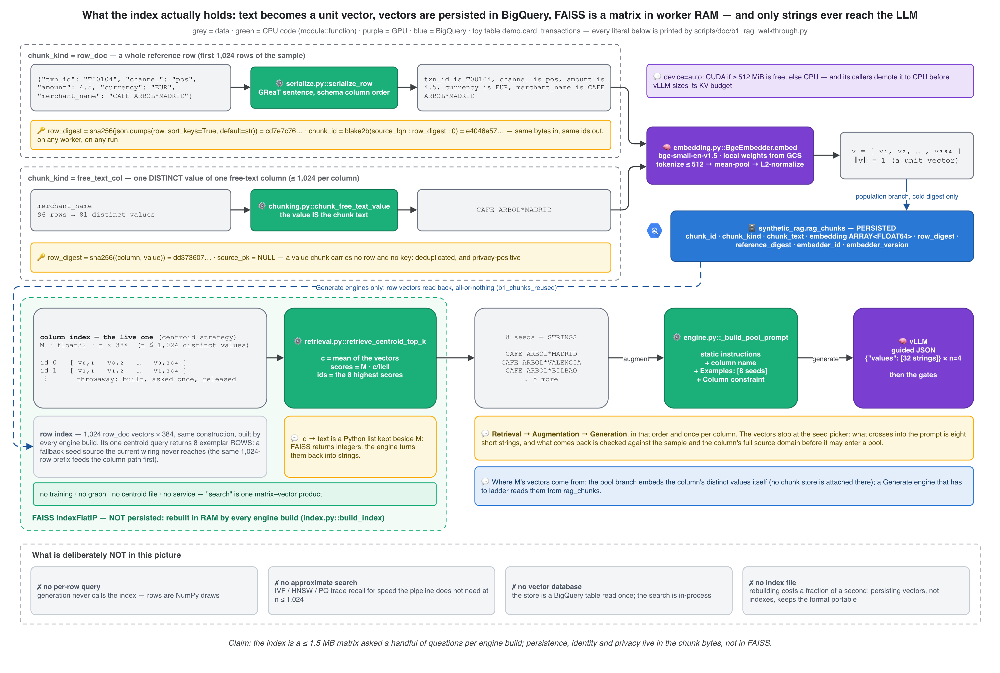

[FAISS](https://github.com/facebookresearch/faiss) is the library whose
founding paper searched a billion vectors on GPUs
([Johnson et al. 2017](https://arxiv.org/abs/1702.08734)). Here it holds
a thousand, on a CPU, and is consulted a handful of times per engine
build — the most over-qualified component in the pipeline, and chosen
for exactly one of its indexes:

- **`IndexFlatIP` is not an index in the database sense.** It is the
  vectors, stacked: `n × 384` float32 values — 1,572,864 bytes at the
  1,024-row cap. "Search" is one matrix–vector product and a top-k. There
  is no training, no graph, no centroid file, nothing to tune.
- **It is exact.** The library's own guidance: *"If you plan to perform
  only a few searches … the index building time will not be amortized by
  the search time. Then direct computation is the most efficient option"*
  — and *"the only index that can guarantee exact results is the
  IndexFlatL2 or IndexFlatIP"*
  ([FAISS wiki](https://github.com/facebookresearch/faiss/wiki/Guidelines-to-choose-an-index)).
  Both sentences describe this workload.
- **It is never persisted.** The *vectors* are (in BigQuery, keyed by
  digest and embedder); the index is rebuilt in RAM by every engine build.
  A Generate engine on a warm digest reads the 1,024 row vectors back —
  all-or-nothing, dimension checked, `b1_chunks_reused` — and stacks them
  again.
- **There are two of them, and only one is live.** The *column index* is
  a throwaway: under the default strategy, each column that reaches seed
  selection with more than eight distinct values gets its value vectors
  stacked, asked one centroid question, and released. That query picks
  the seeds the LLM sees. The *row index* — the 1,024 `row_doc` vectors —
  is built by every engine build and asked one centroid question whose
  answer, eight exemplar rows, is a fallback seed source that **cannot
  fire as the engine is wired today**: the same 1,024-row prefix feeds
  both paths, so whenever the row exemplars hold a value for a column,
  the column path has already produced seeds. It is the engine's original
  retrieval path, kept as a safety net that currently has nothing to
  catch. Under `kcenter` the seed pick needs no index at all; the
  farthest-point walk needs distances, not a search structure.
- **It is deterministic on purpose.** Exact search has no random state
  to begin with; the engine also pins single-threaded search
  (`omp_set_num_threads(1)`, belt and braces — FAISS documents its
  multi-threaded results as reproducible too), and ships a pure-Python
  fallback with the same contract (descending score, ties to the lower
  id) for when `faiss` is not installed — which is why this article's
  examples run on a laptop.

*Per worker setup, building the exact index cost a fraction of a second,
reading the vectors back cost seconds, and the LLM ladder cost minutes:*

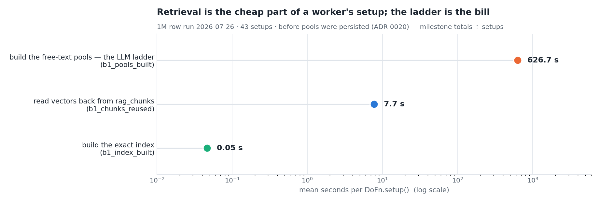

📉 **What the run showed.** The 2026-07-26 1M-row run, 43 engine builds,
before pools were persisted: the milestone totals divided by the builds
(the index milestone is logged to a tenth of a second, so read its dot as
"below the log's resolution" — an earlier run timed one 1,024-vector build
at 0.2 s).
Retrieval was never the bill. (The ladder was — 108 pool rebuilds in one
job is Part 3's cost-anatomy figure, and the reason pools are a persisted
artifact today, [ADR 0020](https://github.com/albertols/synthetic-llm-dataflow-bigquery/blob/master/docs/adr/0020-freetext-pools-as-persisted-artifact.md).)

**Why not something else?** Every alternative is a good tool for a
workload this is not:

| Alternative | What it is | When it wins | Here |
|---|---|---|---|
| [HNSW](https://arxiv.org/abs/1603.09320) ([hnswlib](https://github.com/nmslib/hnswlib)) | graph index, sublinear search | many queries, RAM to spare, approximate is fine | a handful of queries; build cost never amortizes |
| IVF / [product quantization](https://doi.org/10.1109/TPAMI.2010.57) | cluster, then compress | vectors do not fit in RAM, n ≫ 1M | 1.5 MB fits in a CPU cache |
| [ScaNN](https://arxiv.org/abs/1908.10396) | anisotropic quantization for inner-product search | very large scale MIPS | same |
| [Annoy](https://github.com/spotify/annoy) | random-projection trees, memory-mapped files | one static index shared by many processes | the index is cheaper to rebuild than to map |
| [BigQuery `VECTOR_SEARCH`](https://docs.cloud.google.com/bigquery/docs/reference/standard-sql/search_functions#vector_search) | search where the vectors already live | per-element lookups against a large, growing table | a [vector index is not populated below 10 MB](https://docs.cloud.google.com/bigquery/docs/vector-index) (≈ 3,200 chunks of 384 FLOAT64), which a single table's chunks often are — so BigQuery would brute-force too, behind a network round trip, for one single-vector query per column |
| Milvus · pgvector / AlloyDB · Vector Search | a vector *service* | streaming ingestion, many readers, per-request retrieval | a second system to operate, for 1,024 vectors |
| TurboQuant-style online quantized ANN | compressed, fast, approximate | 50k+ vectors *per query* | evaluated in Part 3: adopt-later, behind a flag, because approximate breaks the byte chain below |

The swap point is one function — `rag/index.py::build_index` returns an
`ExactIPIndex`, and anything with `search()` and `release()` would fit
behind it. There is no plug-in registry, because nothing has needed one.

🔬 **In the code.** `rag/index.py::build_index`, `::_FaissFlatIPIndex`,
`::_PyExactIPIndex`; `engine.py::B1RagEngine._vectors_from_store`.

## Step 4 — Retrieval: eight seeds, three strategies, no query

Classic RAG ranks by *relevance to a query*. `b1_rag` has no query: it
wants eight values that stand for a whole column. That changes which
algorithms even apply:

*Six ways to pick eight seeds from one column's value manifold — the
three the pipeline ships, and the three it does not:*

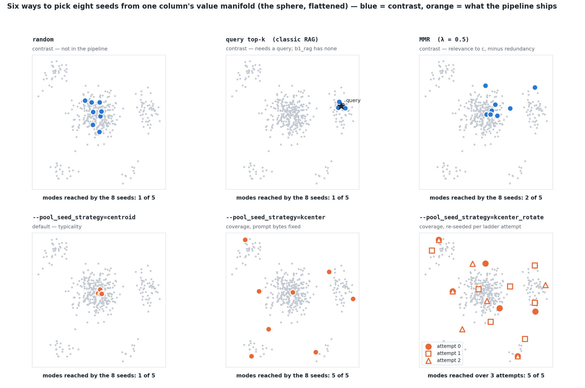

💡 **Concept, not a run.** Same toy manifold as the sphere, flattened.
The top row is contrast: **random** follows the mass (so does "the first
N values"); **query top-k** is superb at finding lookalikes of a query
and useless without one; **MMR**
([Carbonell & Goldstein 1998](https://doi.org/10.1145/290941.291025))
trades relevance against redundancy and still orbits its query. The
bottom row is `--pool_seed_strategy`:

| Value | What it picks | FAISS for the seed pick? | Prompt bytes across ladder rounds | Status |
|---|---|---|---|---|
| `centroid` (default) | the 8 values nearest the mean vector — *typicality* | yes, one query | identical ⇒ prefix cache hits | the only arm that has run on Dataflow |
| `kcenter` | the medoid, then 7 times "the value farthest from everything picked" — *coverage* | no | identical ⇒ prefix cache hits | implemented, unit-tested, A/B not yet run |
| `kcenter_rotate` | the same walk, restarted at item `attempt × 8 mod n` each round | no | differ from `Examples:` onwards ⇒ forfeits the cache past the instruction prefix, by design | implemented, unit-tested, A/B not yet run |

`kcenter` is farthest-point traversal
([Gonzalez 1985](https://doi.org/10.1016/0304-3975(85)90224-5)): greedy,
deterministic, O(n·k), and the same routine modern ML uses to pick
core-sets ([Sener & Savarese 2018](https://arxiv.org/abs/1708.00489)).
On the walkthrough's 81 distinct merchant names:

```text
--pool_seed_strategy=centroid
    name*city   CAFE ARBOL*MADRID
    name*city   CAFE ARBOL*VALENCIA
    name*city   CAFE ARBOL*BILBAO
    name*city   CAFE ARBOL*MALAGA
    name*city   CAFE ARBOL*VIGO
    name*city   CAFE PINO*MADRID
    name*city   CAFE PINO*VALENCIA
    name*city   CAFE PINO*BILBAO
    formats reached: ['name*city']

--pool_seed_strategy=kcenter
    name*city   CAFE ARBOL*BILBAO
    name*city   FARMACIA RIO*MADRID
    aggregator  PAYLINK *BLUE FERN YOGA
    web         WWW.NUBEBOOKS.EXAMPLE
    transport   METRO NORTE TRAVEL CH
    web         WWW.OSOTOOLS.EXAMPLE
    name*city   PANADERIA LUZ*MADRID
    name*city   FERRETERIA OSO*MADRID
    formats reached: ['aggregator', 'name*city', 'transport', 'web']

--pool_seed_strategy=kcenter_rotate (start = attempt * k mod n)
    attempt 0: starts at 'CAFE ARBOL*MADRID'; formats ['aggregator', 'name*city', 'transport', 'web']
    attempt 1: starts at 'PANADERIA LUZ*VALENCIA'; formats ['aggregator', 'name*city', 'transport', 'web']
    attempt 2: starts at 'FERRETERIA OSO*MALAGA'; formats ['aggregator', 'name*city', 'transport', 'web']
```

The honest status: **`centroid` is the default and the only strategy
with E2E evidence.** The three-arm comparison is defined (novel yield per
LLM call, final pool size, attempts to target — the
[WS5 design](https://github.com/albertols/synthetic-llm-dataflow-bigquery/blob/master/docs/designs/2026-07-26-ws5-generation-throughput.md),
§3) and waiting for a run. Typicality has one real argument on its side
— the model is asked for *one* format, and eight examples of the dominant
one are an unambiguous instruction — and one real weakness, which Part 2
measured: a sparse column whose eight seeds under-represented its format.
That column was fixed with a clause, not with a strategy. The A/B will
say whether it should have been.

**Why eight?**

*Spread seeds cover every mode of the toy column by k = 5; typical seeds
never leave the dominant one — and every extra seed is prompt bytes and
one more real value shown to the model:*

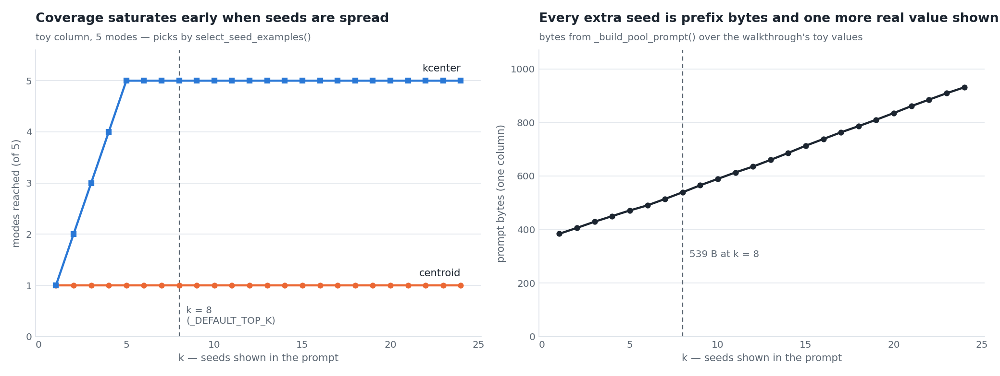

💡 **Concept, not a run.** Left: modes reached as k grows, picks by the
real function. Right: bytes of the real prompt. Eight is not a theorem —
it is where coverage has already saturated on anything k-center can help,
where the prompt is still a few hundred bytes of prefix, and where the
*leak surface* (values the model has literally read) is eight. More
seeds buy little and show more; fewer starve the format. It is
`_DEFAULT_TOP_K`, and changing it changes the prompt bytes, hence every
cached prefix.

**Where do the candidates come from?** In the code, a fixed order:
persisted `free_text_col` vectors (distinct values over the whole 10k
sample) → the column's own distinct values from the first 1,024 rows,
embedded locally → that column's values in the eight *row* exemplars →
the first eight observed examples. In a running job, which rung you land
on depends on **which DoFn is laddering**, and this is the part of the
wiring worth knowing:

- The **pool branch** — where ladders run whenever the pool layer is on,
  which is the normal configuration — is never handed a chunk store. Its
  engine embeds its own 1,024 rows on the GPU and picks seeds from the
  distinct values *of those rows*, embedded locally: rung two.
- A **Generate engine** is handed the chunk store. It reads the row
  vectors back (`b1_chunks_reused`) and fetches the value chunks — and
  then, on a pool-store hit, never selects a seed at all. Rung one is
  live only when Generate has to ladder itself: no pool layer, or a
  pool-store miss.
- Rung three cannot fire (see the row index, above); rung four needs a
  column with no value in the first 1,024 rows.

The seeds are equally real on either rung, and the cost is seconds; but
the persisted value chunks are, today, read far more often than they are
used. Handing the pool branch the chunk store is the obvious next change,
and this section will shrink when it lands.

One more selection question is still open — not *which eight seeds*, but
*which 1,024 rows get indexed*:

*A prefix follows the mass; a k-center selection would follow the space —
today the index holds a prefix:*

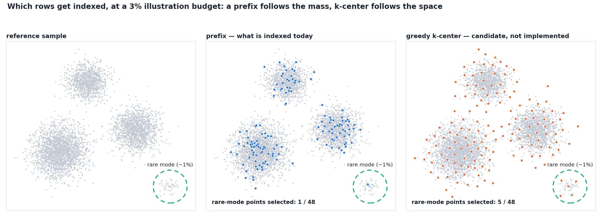

💡 **Concept, not a run.** A candidate from the
[retrieval-geometry design](https://github.com/albertols/synthetic-llm-dataflow-bigquery/blob/master/docs/designs/2026-07-25-rag-retrieval-geometry-roadmap.md),
not implemented: the prefix of a fingerprint-ordered sample is a uniform
sample, which is the right thing for a centroid and the wrong thing for a
rare mode.

🔬 **In the code.** `rag/retrieval.py::select_seed_examples`,
`::retrieve_centroid_top_k`, `::retrieve_kcenter_k`;
`engine.py::_column_seed_examples`, `::_retrieve_exemplars`,
`::_rotating_prompt`.

## Step 5 — Augment, generate, and the ladder in one paragraph

The eight strings — never the vectors — are interpolated into one prompt
per column:

```text
You generate synthetic tabular data.
First identify the exact format of these example values for the column 'merchant_name' (e.g.
UUID, hexadecimal identifier, numeric code, date, timestamp, natural-language text), then generate 32 NEW, distinct, fictitious values in exactly that format.
Never copy an example verbatim.
Examples: ['CAFE ARBOL*MADRID', 'CAFE ARBOL*VALENCIA', 'CAFE ARBOL*BILBAO', 'CAFE ARBOL*MALAGA', 'CAFE ARBOL*VIGO', 'CAFE PINO*MADRID', 'CAFE PINO*VALENCIA', 'CAFE PINO*BILBAO'].
Return JSON {"values": [...]}.
Column constraint: format=short store name as printed on a till receipt; length=8-28; charset=upper-case letters, digits, spaces, dots and asterisks.

680 bytes, sha256 9d6210d43b15ccd1…
```

That prompt is built **once** and sent on every round of the column's
ladder (`kcenter_rotate` is the exception: it rebuilds the `Examples:`
list per round). It asks for 32 values per completion — or fewer, when
the pool target is smaller. Part 2 owns the ladder; the recap is one
figure and one sentence:


Each round is one request for a JSON *array* of 32 values, four
completions at a time, under a grammar; the rounds escalate temperature
0.7 → 1.0 → 1.3 (unclamping `top_p`/`top_k` after the first); every
candidate passes clamp → format → collapse → novelty → stagnation; the
pool stops at `min(512, num_rows, distinct)` values and is persisted
under `(reference_digest, model_uri)`, one row per column — the target is
recorded, not keyed, so a pool built for a small run serves a large one. Feed the real gates a
scripted reply and they account for every candidate:

```text
request 1 sampling: {'n': 4, 'temperature': 0.7, 'top_p': None, 'top_k': None, 'max_tokens': 2048}
scripted reply : ['CAFE ROBLE*MADRID', 'CAFE ARBOL*MADRID', 'HELADERIA COPO*CADIZ', 'FARMACIA RIO*MALAGA',
                  'PAYLINK *RED KITE CYCLES', 'TRANVIA ESTE TRAVEL CH', 'merchant_name: CAFE', 'Here are some values!',
                  'BODEGA CLARETE*LOGRONO', 'ZAPATERIA PASO*TOLEDO', 'WWW.ROBLEHOME.EXAMPLE', 'QUESERIA PRADO*OVIEDO']
gate outcome   : parsed 12 | format_rejected 2 | copies 2 | seed echoes 1 | attempts 1
pool           : ['CAFE ROBLE*MADRID', 'HELADERIA COPO*CADIZ', 'PAYLINK *RED KITE CYCLES', 'TRANVIA ESTE TRAVEL CH',
                  'BODEGA CLARETE*LOGRONO', 'ZAPATERIA PASO*TOLEDO', 'WWW.ROBLEHOME.EXAMPLE', 'QUESERIA PRADO*OVIEDO']
```

Two were off-format (a column-name echo and a sentence). Two were
copies — and note which: `CAFE ARBOL*MADRID` was a seed the prompt
showed (an **echo**), while `FARMACIA RIO*MALAGA` was a real value the
prompt never showed. The second kind is why the rejection set is not
"the seeds" and not even "the sample", but the column's **full source
domain** — up to 1M distinct values, fetched through the Storage Read API
when it is available; above that cap the filter goes inactive, with a
WARNING rather than silently
([ADR 0023](https://github.com/albertols/synthetic-llm-dataflow-bigquery/blob/master/docs/adr/0023-source-domain-pool-rejection.md)).

📉 **What the run showed.** Before that ADR, a cold 1M-row run
(2026-08-05) reported 33–99% verbatim source values on ten free-text
columns while `validation_runs` said `PASSED`: the novelty check only
knew the 10k sample, and a model shown eight values of a 146k-value
domain is rather good at guessing some of the other 145,992. (An erratum
to the ADR records that part of that range was a probe artifact on
mostly-empty columns; the decision stood, and the probe now scores
substantive values only.)

*Fidelity pulls right, originality stops at the wall — a candidate may
sit near a real value, never on one:*

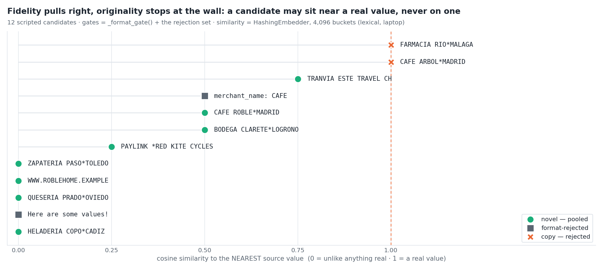

💡 **Concept, not a run.** The twelve scripted candidates on one axis:
similarity to their nearest real value. Seeds pull the model rightwards —
that is what fidelity *means* for a format — and the rejection set is a
wall at 1.0. Read the figure's limit honestly: **the gate is an
exact-match wall, not a distance threshold.** `TRANVIA ESTE TRAVEL CH`
sits at 0.75 and is pooled, because a transport operator that does not
exist is what the column is supposed to contain. Distance-to-closest-
record ([Park et al. 2018](https://arxiv.org/abs/1806.03384)) and its
ratio variants belong to the evaluation framework (Part 10), where they
score a landed table rather than veto a candidate.

🔬 **In the code.** `engine.py::_build_pool_prompt`,
`::_infer_free_text_pool`, `::_pool_llm_yield`, `::_absorb_round`,
`::_format_gate`, `::_fetch_source_values`.

## Extra time — PES mode: the same path on a column of names

Merchant names are a polite example. The column a privacy officer
actually loses sleep over is a column of **names** — so here is the same
path, on the most recognisable names available, in a format anyone who
owned a PlayStation around 2002 will recognise. Pro Evolution Soccer had
no licence for most of its players, so the greatest left-back of his
generation took his free kicks as *Roberto Larcos*. That is, precisely,
a synthetic-data system: real values in, plausible fictional values out.
It is also, as we are about to see, a *bad* one.

The toy table is `demo.squad_list`: fifty famous Brazilian footballers
(accents dropped, as a PS2 memory card would), standing in for the PII a
real table holds. The clause asks for something PES never tried — a
*fictional Brazilian footballer name with an Irish twist*:

```text
row_doc text   : player_name is Roberto Carlos, shirt is 8
50 distinct names, no clause      -> kind = categorical (re-emitted VERBATIM at source frequency)
50 distinct names, route: "llm"   -> kind = free_text (generated; every real name is rejected)

--pool_seed_strategy=centroid
    Roberto Carlos, Ronaldinho, Robinho, Edilson, Gerson, Carlos Alberto Torres, Emerson, Ricardinho

--pool_seed_strategy=kcenter
    Roberto Carlos, Branco, Garrincha, Zagallo, Dunga, Taffarel, Jorginho, Leonardo

prompt tail    : Examples: ['Roberto Carlos', 'Ronaldinho', 'Robinho', 'Edilson', 'Gerson', 'Carlos Alberto Torres', 'Emerson', 'Ricardinho']. Return JSON {"values": [...]}. Column constraint: format=fictional Brazilian footballer name with an Irish twist, as an unlicensed early-2000s football game would print it; charset=letters and spaces.
gate outcome   : parsed 22 | format_rejected 4 | copies 3 | seed echoes 2

candidate            verdict            nearest real name    cosine
Ronaldinho           COPY - rejected    Ronaldinho             1.00
Roberto Carlos       COPY - rejected    Roberto Carlos         1.00
Cafu                 COPY - rejected    Cafu                   1.00
Roberto Larcos       pooled (rename!)   Roberto Carlos         0.60
Ronarid              pooled (rename!)   Ronaldo                0.50
Naldorinho           pooled (rename!)   Ronaldinho             0.55
Facu                 pooled (rename!)   Falcao                 0.34
Fergalinho           pooled             Robinho                0.32
Oisinaldo            pooled             Ronaldo                0.45
Eoinilson            pooled             Edilson                0.56
Seamus da Silva      pooled             Leonidas da Silva      0.47
Cormac dos Santos    pooled             Djalma Santos          0.51
Padraig Peixoto      pooled             Pele                   0.22
Raphinha Keane       pooled             Robinho                0.27
Rivaldinho Doyle     pooled             Rivaldo                0.51
Thiago Gallagher     pooled             Zagallo                0.28
Ciaran Kelly         pooled (off-style) Cafu                   0.12
Declan Murphy        pooled (off-style) Denilson               0.27
Paddy O'Rivaldo      off-format         Rivaldo                0.53
Neymar O'Shea        off-format         Romario                0.19
RONALDO 9            off-format         Ronaldo                0.89
player_name: Pele    off-format         Pele                   0.53
```

*Fifty real names in embedding space: `centroid` shows the prompt the
two big spelling families, `kcenter` shows it the odd ones out — and a
copy lands on a real name, a rename lands beside one, an invention lands
in a family:*

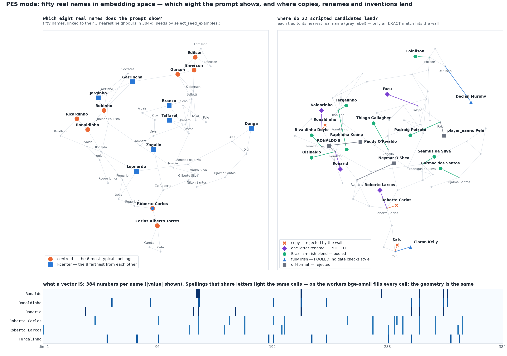

💡 **Concept, not a run.** Laptop stand-ins, stated plainly: the
`HashingEmbedder` is fed character trigrams so that spelling overlap
shows (a subword model like `bge-small` sees that natively), the
candidates are scripted, and the map is a spring layout of each name's
three nearest neighbours — it keeps *who sits next to whom*, not the
distances. The seeds are picked by `select_seed_examples()`, the
verdicts are the real gates', and the bottom strip is the literal
vector: 384 numbers per name, the same cells lit for the same letters.

*The same fifty names on a globe, one step at a time — chunk, embed,
retrieve (both strategies), generate, gate, pool, draw — with the data
each step produces listed beside it:*

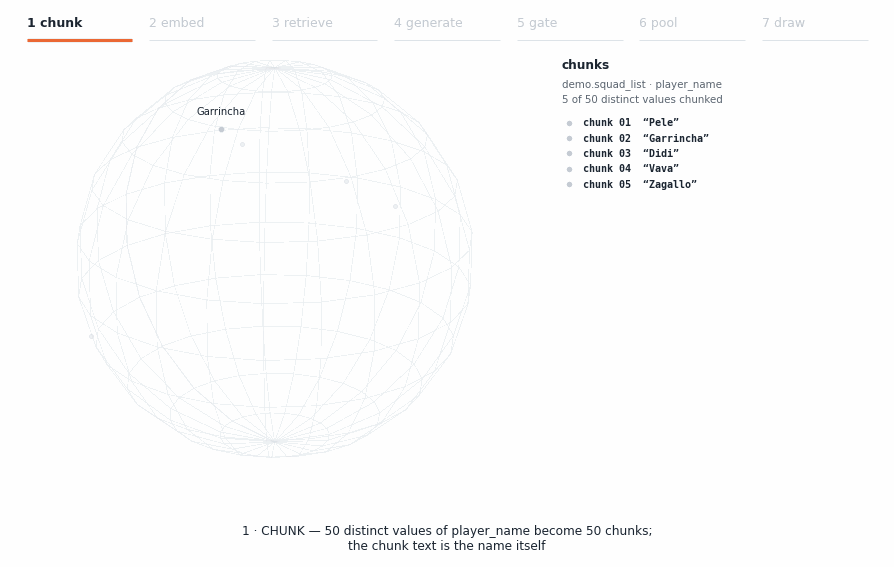

💡 **Concept, not a run.** *Intuition:* follow one name. It becomes a
chunk, then a point; eight points are picked as seeds; twenty-two
candidates land beside their nearest real name; the gate throws seven
off the sphere and keeps fifteen; every generated row then draws from
those fifteen and from nothing else. *Formally:* the globe is the same
3-nearest-neighbour spring layout as the map above, constrained to the
unit sphere where L2-normalised vectors live, so it keeps
neighbourhoods and not distances; the seeds are
`select_seed_examples(strategy="centroid" | "kcenter")`, the verdicts
are `_format_gate` then the exact-match wall in `_pool_llm_yield`'s
order, and the last step is a seeded uniform draw with replacement, as
`B1RagEngine._sample_free_text` does it. Watch the blue triangles.

Five things this column teaches that the merchant column could not:

- **A small column of names is an enum, and enums are copied.** Fifty
  distinct strings is under the profiler's free-text threshold, so left
  alone this column is typed *categorical* and re-emitted verbatim at
  its source frequency — perfect fidelity, zero privacy. This is the one
  place where `route: "llm"` earns its keep: it re-types the column as
  free text. A real names column clears fifty distinct values on its
  own; a short list of branch managers does not, and needs the clause.
- **The seeds set the style; the clause sets the twist.** `centroid`
  hands the model the `-inho` and `-son` families — a very clear picture
  of what a Brazilian footballer is called. `kcenter` hands it
  Garrincha, Zagallo and Taffarel, which is a better picture of how
  *varied* they are. Neither can say "Irish". That is what the clause is
  for — and *Fergalinho*, *Oisinaldo* and *Eoinilson* are what the two
  produce together.
- **The format gate is strict about punctuation, and it is right.**
  *Paddy O'Rivaldo* and *Neymar O'Shea* are rejected: no value in the
  source carries an apostrophe, so none may land. *RONALDO 9* — 0.89
  from the real man, the closest non-copy in the reply — goes the same
  way: the source has no all-capitals word and no digit. *Seamus da Silva* passes only because
  Leônidas da Silva played in 1938 and gave the column a lower-case
  particle. Sorry, Paddy.
- **A rename is not a synthesis.** The wall rejects `Ronaldinho`,
  `Roberto Carlos` and `Cafu` — exact copies, two of them seeds the
  prompt showed, the third a name it never saw (the wall checks the
  source, not the prompt). It pools `Roberto Larcos`, `Ronarid`, `Naldorinho` and `Facu`, because
  none of them *is* a real value. Every football fan re-identifies all
  four in under a second. Worse, no single distance sees the problem:
  `Roberto Larcos` sits at 0.60 from one man, `Eoinilson` at 0.56 from a
  whole family of `-ilson`s, and the trigram embedder files `Facu` next
  to Falcão when any fan can see whose shirt that is.
  Re-identification is a human act; a gate can only approximate it. That
  is why the exact-match wall is the *floor* of the privacy story and
  not its ceiling, why the evaluation looks at distance *distributions*
  against a holdout rather than one threshold (Part 10), and why the
  cheapest defence is upstream: a prompt that asks for an Irish twist
  stops the model orbiting the seeds in the first place.
- **No gate checks style.** *Raphinha Keane* is what the clause asked
  for. *Ciaran Kelly* is not — there is nothing Brazilian left in him —
  and he is pooled all the same, at 0.12 from his nearest real name: the
  *safest* value in the pool by the privacy yardstick, and the least
  faithful. The gates know two things: the column's character mask and
  the set of real values. "Does this still sound like the column?" is a
  fidelity question, and fidelity is measured *after* the run, on
  distributions (Part 10), not enforced per value. A model that drifts
  off-style is a prompt problem, and the prompt is where it is fixed.

PES eventually fixed its naming problem with licences. Synthetic data
cannot; it has to be *Fergalinho* from the start.

🔬 **In the code.** `profile.py::_profile_string` (the `force_llm`
re-typing), `engine.py::_format_gate` (the collapsed-mask gate),
`::_absorb_round`; `scripts/doc/b1_rag_walkthrough.py::step_pes_mode`.

## What lands: skew, cardinality, and which values travel together

The whole engine, end to end, on the laptop — `B1RagEngine.setup()` then
`generate_batch(12)`:

```text
12 generated rows (seed=2026):
  T34673 (novel id) pos    131.56 EUR ZAPATERIA PASO*TOLEDO     <- novel
  T24059 (novel id) pos     84.00 EUR HELADERIA COPO*CADIZ      <- novel
  T10515 (novel id) atm     64.33 EUR ZAPATERIA PASO*TOLEDO     <- novel
  T24179 (novel id) atm    606.50 EUR HELADERIA COPO*CADIZ      <- novel
  T49967 (novel id) ecom   263.70 EUR QUESERIA PRADO*OVIEDO     <- novel
  T46121 (novel id) ecom   179.28 EUR ZAPATERIA PASO*TOLEDO     <- novel
  T50074 (novel id) pos    205.06 EUR HELADERIA COPO*CADIZ      <- novel
  T11463 (novel id) atm    452.51 EUR CAFE ROBLE*MADRID         <- novel
  T55636 (novel id) atm    467.29 EUR ATM WITHDRAWAL            <- head literal, re-emitted at its source share
  T17727 (novel id) atm    657.34 EUR ATM WITHDRAWAL            <- head literal, re-emitted at its source share
  T28290 (novel id) atm    597.90 EUR HELADERIA COPO*CADIZ      <- novel
  T65643 (novel id) atm     88.15 EUR WWW.ROBLEHOME.EXAMPLE     <- novel
```

One row, five routes — and only one of them involved retrieval.
`currency` is a constant; `channel` is a categorical drawn at its source
frequency; `amount` is an inverse-CDF draw; `txn_id` comes from a
per-position shape, re-drawn (up to eight times) when it collides with an
observed id; `merchant_name` is
either a **head literal** or a draw from the pool. How a column gets its
cardinality and its skew, in one table:

| The source column has… | Route | Cardinality of the output | Skew of the output |
|---|---|---|---|
| few distinct strings (≤ 50, and not near-unique prose) | categorical | the source's | the source's, exactly (empirical frequencies) |
| an identifier shape | shape / mask sampler | scales with rows | per-mask row mass |
| free text with a dominant literal | head value + pool | pool size + heads | the head's share, exactly |
| free text, long tail | pool | ≤ 512 | **uniform over the pool** |

A **head value** is a literal holding at least 5% of the substantive rows
*and* at least 10 occurrences (at most eight per column). `ATM
WITHDRAWAL` is 16.7% of the toy column; it is re-emitted verbatim at
16.7%, and the pool can never contain it, because the rejection set
rejects every real value. (A head literal can be one of the eight seeds;
it is the one thing the model may be shown that is also allowed to land.) The count floor is a k-anonymity argument
([Sweeney 2002](https://doi.org/10.1142/S0218488502001648)): a value
shared by many rows is an enum member, not an identity. That is the only
real value a pooled column will ever emit, and it is emitted on purpose.

The last row of the table is the honest one. **Inside the tail, source
frequency is not reproduced**: the pool is drawn uniformly, with
replacement. The LLM supplies *semantics*; the head supplies *skew*;
cardinality in the tail is capped by design (Part 2's 512 section). A
column that needs a faithful long tail needs a `pattern` or a shape, not
a bigger pool.

**Which values travel together?** Embedding whole rows does put similar
*rows* near each other — and the engine uses that for exactly one thing,
the eight representative rows of the (currently unreachable) fallback. It
does **not** generate rows near a retrieved row. Every ordinary column is sampled from
its own marginal, so a `city` and a `postcode` with no declared
relationship will be crossed. What *is* kept together is what the
relationship model declares: FK columns are drawn as **tuples** with
IPF-fitted weights, so only real parent combinations appear and each
column's marginal still matches ([ADR 0031](https://github.com/albertols/synthetic-llm-dataflow-bigquery/blob/master/docs/adr/0031-joint-fk-key-draws.md));
driven children copy their parent's key and draw their PK-completing
cells jointly. Correlation between ordinary columns is `b2_library`'s
half of the bargain — and the first thing that would bring it to
`b1_rag` is this:

*One global centroid conditions every pool today; localized queries —
per cluster, never per row — would condition groups:*


💡 **Concept, not a run.** A candidate, not shipped: cluster the row
vectors, retrieve per cluster, build a pool per cluster, and draw a
row's free text from the pool of the cluster its typed columns fall in.
The LLM call count rises with the number of *clusters*, which is the
line [ADR 0013](https://github.com/albertols/synthetic-llm-dataflow-bigquery/blob/master/docs/adr/0013-distribution-estimator-spine.md)
draws: bounded is fine, per row is not.

🔬 **In the code.** `profile.py::_free_text_head_values`,
`engine.py::_with_head_values`, `::_sample_free_text`,
`::_draw_fk_columns`; `engines/fk_keys.py`.

## `llm_prompt_constraint` and RAG: both, one, or neither

Part 2 introduced the per-column clause. Does a column that has one still
need an embedder? It depends on how the column is typed and on what the
clause can express:

| The column… | Route | Seeds retrieved? | LLM? | Why |
|---|---|---|---|---|
| is free text and its clause has a compilable `pattern` (anchored, supported subset) | Tier P sampler | **no** | no | the regex *is* the value space: format-exact, uncapped, source-rejecting. Retrieval has nothing to add |
| holds binary payloads and has any clause | Tier B byte template | **no** | no | neither an LLM nor a grammar can emit control bytes |
| is free text and its clause has `format` / `charset` / `length` / `notes` | Tier L — the ladder | **yes** | yes | seeds and clause share one prompt (the example above is exactly this); a `pattern` that cannot be compiled into a sampler joins the decoding grammar instead |
| is free text with no clause | Tier L, or an exit before it | yes, if it reaches the ladder | yes | the seeds are the only description of the column the model gets |
| would be typed categorical, identifier-shaped or date-shaped | its typed route | no | no | a clause alone is decorative here; `route: "llm"` is the lever that re-types the column as free text — after which the rows above apply |

Is the combination worth it? Yes, precisely when neither half is enough.
A clause says what a regex can say — length, alphabet, a prefix. Seeds
say what it cannot: that till receipts abbreviate, that transport lines
end in `TRAVEL CH`, that the city comes after an asterisk. And the clause
covers the seeds' blind spot: eight typical examples of a sparse column
can all miss the format that matters, and one `format` line fixes that
without a second LLM call. The toy column above is that case on purpose —
left alone, the profiler sends `merchant_name` to the shape-expansion
exit and the LLM is never asked; **any non-empty clause takes a column
off that exit** and puts it on the ladder, where retrieval lives.

One inefficiency, stated plainly: the population branch does not look at
routes. It embeds the distinct values of every free-text column that is
not identifier-shaped — including Tier P, Tier B and shape-expanded
columns that will never pick a seed. At most 1,024 wasted embeds per
column, seconds on a GPU.

🔬 **In the code.** `engine.py::_route_constraint_samplers`,
`::_route_one`, `::_skip_routed_pools`, `::_draws_from_expansion`,
`::_column_constraint`, `::_pool_json_schema`.

## Why not `apache_beam.ml.rag`?

This is the section for the Beam community, and it starts with respect:
[`apache_beam.ml.rag`](https://beam.apache.org/releases/pydoc/current/apache_beam.ml.rag.html)
is a well-shaped package. Chunking, embedding under `MLTransform`,
writers for BigQuery, AlloyDB, Postgres, Cloud SQL, Spanner, Milvus and
Qdrant, and
`Enrichment` handlers that run `VECTOR_SEARCH` or a Milvus query per
element. If your corpus is prose, your ingestion is continuous and every
element of your stream needs its own neighbours, use it. This pipeline
weighed it and then kept a few hundred lines of its own
([ADR 0017](https://github.com/albertols/synthetic-llm-dataflow-bigquery/blob/master/docs/adr/0017-custom-rag-layer-over-beam-ml-rag.md)),
for reasons that are about *shape*, not quality:

*A document chunk is text with a label; a structured chunk is an address
— and every cache in this pipeline is keyed by one:*

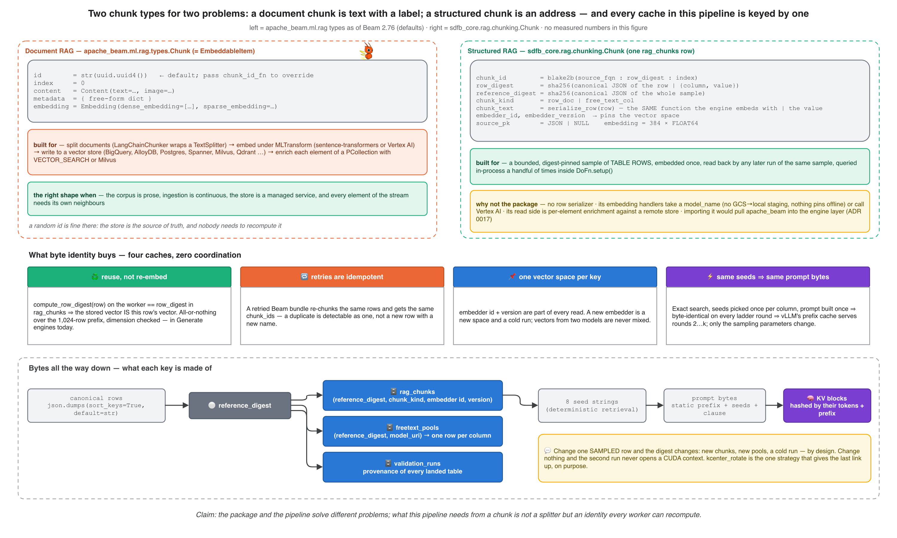

1. **The chunk is the wrong type.** `Chunk` (an alias of
   `EmbeddableItem`) is `content`, `index`, a free-form `metadata` dict —
   and an `id` that defaults to `uuid4()`. A random id is fine when the
   store is the source of truth. Here the *worker* must recompute the id
   from the row and find its vector: `chunk_id_fn` could supply that, but
   `row_digest`, `reference_digest`, `chunk_kind` and the embedder
   identity are first-class columns of a preflight-checked table, not
   keys in a dict. And there is no row serializer to adopt —
   `LangChainChunker` wraps a text splitter.
2. **The embedding handlers assume a hub or a managed service.**
   `HuggingfaceTextEmbeddings` hands a `model_name` to
   sentence-transformers; a local directory works by that library's
   semantics, but nothing stages weights from GCS and nothing pins the
   process offline. `VertexAITextEmbeddings` is Vertex in the serving
   path. Both are hard constraints here (self-hosted, no egress), so the
   "free" part of adopting the package would have been a custom
   embeddings manager around the embedder that already existed.
3. **The read side is inverted.** `Enrichment` is a per-element lookup
   against a remote store, with batching, throttling and retries — the
   right machinery for a stream. `b1_rag` retrieves once per column
   inside `setup()`, over vectors already in RAM, with a query (a
   centroid) that is not an element of any PCollection. There is no
   in-process handler to attach to, and nothing to enrich.
4. **Import direction.** Engines live in `sdfb-core` and must stay
   Beam-free so they run in a unit test without a runner. Sharing types
   with `ml.rag` pulls `apache_beam` into the engine layer.

What byte-level identity buys is the bottom half of the figure: reuse
instead of re-embedding, retries that reproduce their ids, one vector
space per key, and — the link that reaches the GPU — a prompt that is
byte-identical on every round of a ladder, so
[vLLM's prefix cache](https://docs.vllm.ai/en/stable/design/prefix_caching/)
serves rounds 2…k. Approximate retrieval would cut that chain at its
first link; that, more than speed, is why the index is exact.

What would change the verdict — the ADR's own list: streaming ingestion,
a managed vector store in place of the `rag_chunks` table, per-element
retrieval, or an offline embeddings manager landing upstream. An
in-process enrichment handler would be a fifth.

## Attaching and detaching an engine

*Swapping engines changes what `setup()` builds and what a batch draws
from — never the graph, the guardrails or the sinks:*

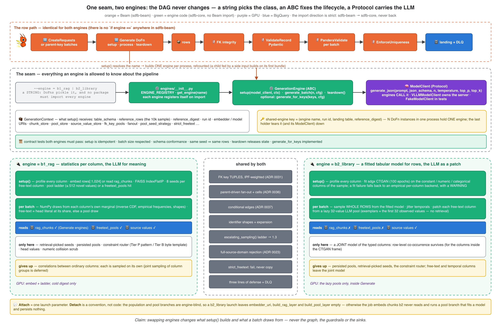

Everything in this article sits behind one string. `--engine=b1_rag`
resolves through a registry to a class with three abstract methods
(`setup`, `generate_batch`, `teardown`) and one optional one
(`generate_for_keys`, for children driven by their parent's keys);
the LLM arrives through a `ModelClient` Protocol the engine calls and
never owns. There is no `if engine ==` in the Beam package. Part 5 reuses
this figure from the other side; the comparison that matters here:

| | `b1_rag` | `b2_library` |
|---|---|---|
| typed columns | each from its own marginal, by construction | whole rows from a fitted CTGAN — co-occurrence survives |
| free-text exemplars | 8, retrieval-picked, per column | the first 32 observed values |
| pools | ≤ 512 values, built once per digest, persisted | 32 values, lazy, per process |
| needs an embedder / an index | yes / yes | no / no |
| where the LLM runs | `setup()`, before the first row | inside Generate, on first use |
| clause routing (Tier P / B) | yes | not yet — the clause is prompt text (and a `pattern` joins the grammar) |
| dominant literals, numeric collision scrub | yes | no |
| declared relational structure (FK tuples, fan-out) | shared | shared |
| what it costs you | correlations between ordinary columns | a fit per process, and the persisted-pool economics |

**Attach** is one launch parameter. **Detach** is a convention rather
than code: the population and pool branches are engine-blind, so a
`b2_library` launch leaves `embedder_uri`, `build_rag_layer` and
`build_pool_layer` empty. Otherwise the job dutifully embeds chunks that
engine never reads, and runs a pool branch that fits a CTGAN, finds no
pools to persist, writes nothing — and therefore does it again on the
next launch.

🔬 **In the code.** `engines/__init__.py::get_engine`,
`engines/base.py::GenerationEngine`, `::ModelClient`;
`dofns/generate.py::_acquire_shared_engine`.

## Nuances that did not fit a section

- **Only Generate engines read `rag_chunks` today.** The pool branch is
  not handed the chunk store, so its engine always embeds its own 1,024
  rows (GPU, then demote) and seeds from their distinct values; see Step
  4. The barrier it waits on is the embedded-chunks PCollection, not the
  BigQuery load job.
- **The seed phase is sequential, the ladders are parallel.** Hugging
  Face fast tokenizers are not thread-safe ("Already borrowed"), so every
  embedder call happens before the first ladder thread starts;
  `kcenter_rotate` re-seeds from a vector space captured in that phase
  and never touches the embedder from a thread.
- **The embedder's identity comes from the URI's last two segments**
  (`…/embedders/bge-small-en-v1.5/v1/`), read driver-side — on a worker
  the path is already `/local-ssd/embedder` and the identity is gone.
- **The pool store is an optimization; the chunk store is half of one.**
  No `--rag_chunks_table`, an empty result, a partial read or a dimension
  mismatch all mean "embed locally and carry on". A chunk-store *query
  error* — including a table that is configured but missing — is not
  caught: it fails `setup()` and the bundle. The pool store, by contrast,
  swallows its errors and ladders.
- **The BigQuery vector index is optional.** Nothing on the generation
  path calls `VECTOR_SEARCH`; the table is read with a plain
  parameterized `SELECT`.
- **Nothing here is approximate, and nothing here is per row.** If a
  future version changes either, this article flips to `Needs-sync`.

### The ledger

| Figure | 📉 What the run showed | 🔧 What the code does now |
|---|---|---|
| Embedding-phase cost | 33,610 chunks embedded on CPU for 60.8% of a job; ~90% unreadable or duplicate | population scoped to the read contract: 1,024 row docs + distinct values; GPU embed, then demote |
| Setup cost | index a fraction of a second, vector read-back seconds, ladder minutes per setup | exact flat index rebuilt per engine build; vectors persisted, index never |
| *(no figure — found writing this article)* | the pool branch never reads `rag_chunks`; the row-exemplar fallback cannot fire | documented as wired; attaching the chunk store to the pool branch is the open item |
| *(no figure)* 33–99% verbatim values, run `PASSED` | novelty was checked against the 10k sample only | rejection set = sample ∪ full source domain ∪ clause examples; taint preflight on warm pools |
| *(Part 2)* a sparse column's seeds missed its format | eight typical values can all be the wrong eight | clause + seeds in one prompt; k-center arms implemented, A/B pending |
| *(Part 3)* 56 CPU embedders starved the model pull | the cold embed fanned out per SDK process | embed bounded to two keyed groups; `AwaitRagPopulation` before the first LLM call |

## What to remember

1. **RAG here has no query.** It answers "which eight real values may
   the model see" — by typicality (`centroid`) or by coverage
   (`kcenter`).
2. **Retrieve → augment → generate happens once per column**, at engine
   build. The row path never touches an index.
3. **Chunks are rows and cells, not token windows** — serialized in
   schema order, identified by digests every worker can recompute.
4. **Vectors are persisted; the index is not.** FAISS is a ≤ 1.5 MB
   matrix, exact on purpose, rebuilt in a fraction of a second — and the
   index that matters is the per-column one, not the row one.
5. **Only strings reach the LLM, and nothing it echoes lands.** The
   rejection set is the full source domain, not the seeds.
6. **Heads keep the skew, pools supply the meaning.** Tail frequencies
   are uniform by design; key structure is joint by declaration;
   everything else is a marginal.
7. **A clause and seeds are complements.** A regex owns a column
   outright; prose constraints ride along with retrieval.
8. **`apache_beam.ml.rag` solves a different problem** — per-element
   retrieval over documents in a managed store. Use it when that is your
   shape.
9. **Bytes all the way down.** Same rows → same digest → same vectors →
   same seeds → same prompt → same KV prefix. Approximate anything and
   the chain breaks.
10. **A rename is not a synthesis.** *Roberto Larcos* passes an
    exact-match wall and fools nobody. The wall is the floor; the prompt
    and the evaluation are the rest of the house.

## Where this goes next

Part 5 opens the other plug: `b2_library`, CTGAN, what a fitted joint
model keeps that marginals cannot, and what it costs. Part 8 returns to
the fidelity math behind the 10k sample; Part 10 is where
distance-to-closest-record finally gets to judge a landed table.

If you run RAG on Beam, have opinions about seed selection for tabular
prompts, or know why mean pooling should lose to `[CLS]` on short
strings — say so. The open experiments this article leaves on the table
are the three-arm seed A/B, k-center selection of the indexed rows, and
per-cluster pools. The comment section is part of the project.

## References

**Retrieval and embeddings**

- Lewis, Perez, Piktus et al. — *Retrieval-Augmented Generation for
  Knowledge-Intensive NLP Tasks*, NeurIPS 2020 —
  [arXiv 2005.11401](https://arxiv.org/abs/2005.11401).
- Karpukhin et al. — *Dense Passage Retrieval*, EMNLP 2020 —
  [arXiv 2004.04906](https://arxiv.org/abs/2004.04906). Reimers &
  Gurevych — *Sentence-BERT*, EMNLP 2019 —
  [arXiv 1908.10084](https://arxiv.org/abs/1908.10084).
- Xiao, Liu, Zhang, Muennighoff, Lian, Nie — *C-Pack*, SIGIR 2024 —
  [arXiv 2309.07597](https://arxiv.org/abs/2309.07597);
  [`BAAI/bge-small-en-v1.5`](https://huggingface.co/BAAI/bge-small-en-v1.5)
  model card.
- Johnson, Douze, Jégou — *Billion-scale similarity search with GPUs* —
  [arXiv 1702.08734](https://arxiv.org/abs/1702.08734). Douze et al. —
  *The Faiss library*, 2024 —
  [arXiv 2401.08281](https://arxiv.org/abs/2401.08281). FAISS wiki —
  [Guidelines to choose an index](https://github.com/facebookresearch/faiss/wiki/Guidelines-to-choose-an-index)
  · [Faiss indexes](https://github.com/facebookresearch/faiss/wiki/Faiss-indexes)
  · [Threads and asynchronous calls](https://github.com/facebookresearch/faiss/wiki/Threads-and-asynchronous-calls).
- Malkov & Yashunin — *HNSW*, TPAMI 2020 —
  [arXiv 1603.09320](https://arxiv.org/abs/1603.09320). Guo et al. —
  *ScaNN*, ICML 2020 — [arXiv 1908.10396](https://arxiv.org/abs/1908.10396).
  Jégou, Douze, Schmid — *Product Quantization*, TPAMI 2011 —
  [doi 10.1109/TPAMI.2010.57](https://doi.org/10.1109/TPAMI.2010.57).
  [Annoy](https://github.com/spotify/annoy). Aumüller, Bernhardsson,
  Faithfull — [ANN-Benchmarks](https://ann-benchmarks.com), Information
  Systems 2020.
- Gonzalez — *Clustering to minimize the maximum intercluster distance*,
  TCS 1985 — [doi 10.1016/0304-3975(85)90224-5](https://doi.org/10.1016/0304-3975(85)90224-5).
  Sener & Savarese — *A Core-Set Approach*, ICLR 2018 —
  [arXiv 1708.00489](https://arxiv.org/abs/1708.00489). Carbonell &
  Goldstein — *MMR*, SIGIR 1998 —
  [doi 10.1145/290941.291025](https://doi.org/10.1145/290941.291025).

**LLMs for tabular synthesis**

- Borisov et al. — GReaT, ICLR 2023 —
  [arXiv 2210.06280](https://arxiv.org/abs/2210.06280). Xu et al. — *Why
  LLMs Are Bad at Synthetic Table Generation*, 2024 —
  [arXiv 2406.14541](https://arxiv.org/abs/2406.14541).
- Fang et al. — TabGen-ICL, 2025 —
  [arXiv 2502.16414](https://arxiv.org/abs/2502.16414). Kim, Kim, Choo —
  EPIC, NeurIPS 2024 — [arXiv 2404.12404](https://arxiv.org/abs/2404.12404).
  Seedat et al. — CLLM, ICML 2024 —
  [arXiv 2312.12112](https://arxiv.org/abs/2312.12112).
- Nguyen et al. — FASTGEN, 2025 —
  [arXiv 2507.15839](https://arxiv.org/abs/2507.15839). Yang, Zhang,
  Prenkaj, Kasneci — *Doubling Your Data in Minutes: Ultra-fast Tabular
  Data Generation via LLM-Induced Dependency Graphs*, 2025 —
  [arXiv 2507.19334](https://arxiv.org/abs/2507.19334). Sidorenko — *A
  Note on Statistically Accurate Tabular Data Generation Using Large
  Language Models*, 2025 —
  [arXiv 2505.02659](https://arxiv.org/abs/2505.02659).

**Privacy**

- Carlini et al. — *Extracting Training Data from Large Language Models*,
  USENIX Security 2021 — [arXiv 2012.07805](https://arxiv.org/abs/2012.07805).
  Park et al. — table-GAN (DCR), VLDB 2018 —
  [arXiv 1806.03384](https://arxiv.org/abs/1806.03384). Sweeney —
  *k-anonymity*, 2002 —
  [doi 10.1142/S0218488502001648](https://doi.org/10.1142/S0218488502001648).

**Apache Beam, BigQuery, vLLM**

- Apache Beam — [`apache_beam.ml.rag`](https://beam.apache.org/releases/pydoc/current/apache_beam.ml.rag.html)
  · [`ml.rag.types`](https://beam.apache.org/releases/pydoc/current/apache_beam.ml.rag.types.html)
  · [Large language models in Beam](https://beam.apache.org/documentation/ml/large-language-modeling/)
  · [Enrichment transform](https://beam.apache.org/documentation/transforms/python/elementwise/enrichment/).
- BigQuery — [`VECTOR_SEARCH`](https://docs.cloud.google.com/bigquery/docs/reference/standard-sql/search_functions#vector_search)
  · [Manage vector indexes](https://docs.cloud.google.com/bigquery/docs/vector-index).
- vLLM — [automatic prefix caching](https://docs.vllm.ai/en/stable/design/prefix_caching/).

---

*Provenance (dropped on Medium): sources and figures per front-matter;
claims verified at repo commit `4cba0b6` (v0.5.2). Every data example is
the output of `scripts/doc/b1_rag_walkthrough.py` at that commit (toy
table, `HashingEmbedder`, pure-Python index, scripted model reply — the
pipeline functions are the real ones). The PES-mode section uses the
public names of famous footballers as a stand-in for PII, feeds the
hashing embedder character trigrams, and draws its map (and the globe
of its GIF, the same layout constrained to the unit sphere) with a seeded
spring layout of the 3-nearest-neighbour cosine graph; the "PES-style"
renames are written for this article in the spirit of the game's
unlicensed squads (Pro Evolution Soccer is a trademark of Konami). Figures: `rag-end-to-end-flow`,
`rag-faiss-data-path`, `rag-chunk-identity`, `engine-attach-detach`
(drawio sources committed side-by-side in `docs/articles/assets/`,
exported with the next-ai-drawio MCP plugin; they carry no measured
numbers; `engine-attach-detach` is shared with Part 5);
`rag-dense-vectors-3d.png`, `rag-retrieval-sphere.gif`,
`rag-seed-pickers.png`, `rag-seed-budget.png`,
`rag-fidelity-originality.png`, `rag-great-serialization.png`,
`rag-names-pes-map.png`, `rag-names-pes-3d.gif`, `rag-setup-cost.png` and
`prefix-vs-kcenter-coverage.png` are generated by
`scripts/doc/make_rag_geometry_figures.py` — `CONCEPT` block seeded, all
selections computed by `sdfb_core.rag.retrieval`; the one evidence figure
imports the WS5 `MEASURED` block from `make_ws5_figures.py` (run
`2026-07-26_06_54_25`). `embedding-geometry-topk.png`,
`centroid-vs-perquery.png` and `embed-cost-evolution.png` are the
2026-07-25 retrieval-geometry design's assets (the measured bars of the
last one are owned by ADR 0019). `freetext-pool-ladder.png` is Part 2's.
Configuration constants (8 seeds, 1,024-row / 1,024-value chunk caps,
384 dimensions, 512 MiB CUDA floor, 512-value pool cap, 32 × 4 values per
round, head-value floors 5% / 10 rows / 8 heads, 50-category free-text
threshold, 2 embed shards) are the defaults at the synced commit. Beam
package facts checked against the 2.76.0 pydoc and source; BigQuery
vector-index behaviour against the docs page dated 2026-09-18; the Apache
Beam firefly mascot is © the Apache Software Foundation
(beam.apache.org/community/mascot/), used to identify Apache Beam; GCP
product icons are Google's official diagram set. External links retrieved
2026-09-21.*
