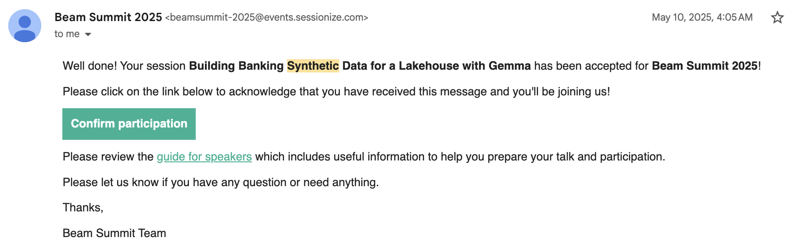
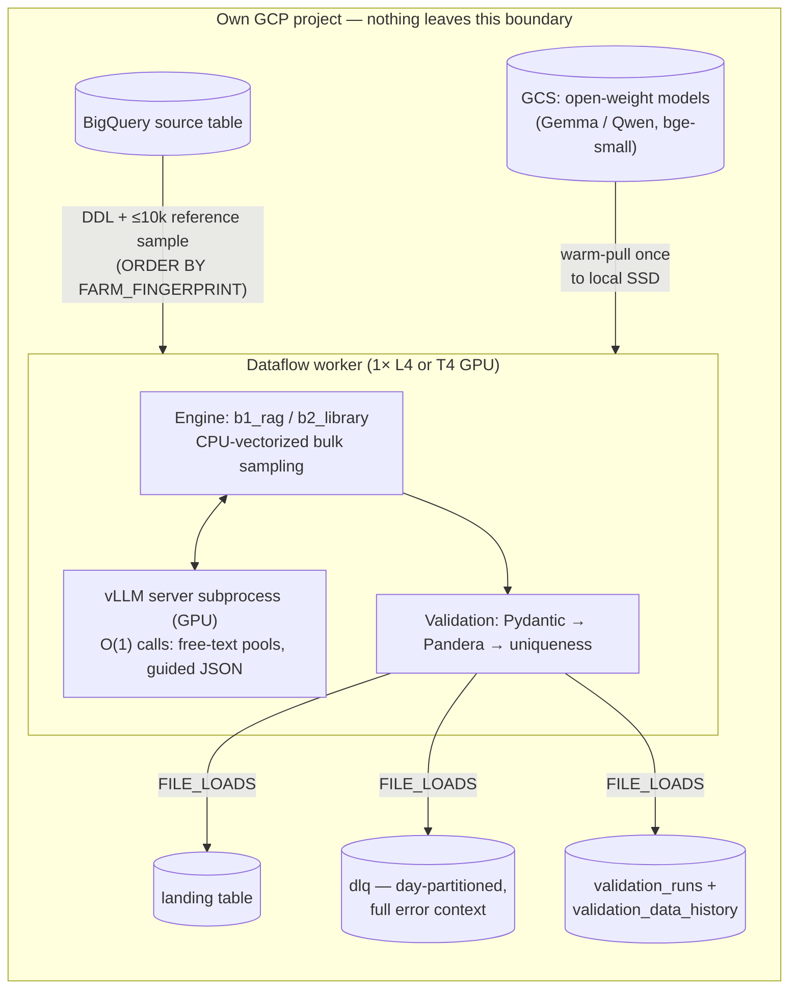

# AI Use Case — Experimentation Request

> **Status: DESIGN → EXPERIMENTATION REQUEST** · Prepared for the corporate AI Use Case registry (copy-paste source).
> Companion evidence: [`docs/adr/`](adr/), [`docs/RUN_PLAYBOOK.md`](RUN_PLAYBOOK.md), [`docs/designs/`](designs/).

---

## Title

**Building Banking Synthetic Data for a Lakehouse with Gemma — self-hosted LLM generation on Apache Beam / Dataflow / BigQuery**

## External validation

This solution was **accepted for presentation at Apache Beam Summit 2025** as the session *"Building Banking Synthetic Data for a Lakehouse with Gemma"* — independent, external peer review of the approach by the Apache Beam community.

## Abstract

Teams need realistic tabular data for development, testing, and analytics prototyping, but production BigQuery tables cannot be used directly for privacy, regulatory, and residency reasons. This use case generates fictitious-but-realistic synthetic rows for any target BigQuery table, driven only by its DDL schema plus a controlled reference sample. All LLM inference is **self-hosted on GPU workers inside the Dataflow pipeline** — no data or prompts ever leave the project boundary, no external AI APIs, no model hubs at runtime. Accepted for presentation at Apache Beam Summit 2025.

## Problem / Opportunity

**Context.** Modern data platforms centralize business data in warehouses such as BigQuery, where the most valuable tables are also the most sensitive. Engineering and analytics teams routinely need realistic data outside production — integration testing, demo environments, ML experimentation, partner enablement — but masking degrades statistical realism and manual fixtures do not scale. Sending real rows to external LLM APIs to produce "lookalike data" is prohibited in regulated (banking) environments.

**Problem/Opportunity.** There is no self-contained, cloud-native way to produce schema-conformant, statistically realistic synthetic rows for a BigQuery table without either exposing real data to third-party AI services or accepting low-fidelity random data. The opportunity: a pipeline that reads a table's DDL and a bounded reference sample, runs open-weight LLMs entirely inside the organization's own cloud project, and writes validated synthetic rows back to BigQuery — with **memorization measured and gated on every run**. The fully self-hosted design (no data egress, open-weight models only, auditable per-run quality records) aligns directly with EU AI Act and data-sensitivity expectations.

## Solution

### Architecture at a glance

Plain flow: `BigQuery (DDL + reference sample) → Dataflow GPU workers (GCS model weights warm-pulled; vLLM spawned in-worker; multi-threaded inference) → BigQuery (landing + DLQ + audit tables)`

### Generation engines (`engine=b1_rag` / `engine=b2_library`)

Two interchangeable engines behind one `GenerationEngine` interface; the LLM runs **O(1) times per run, never per row** (ADR 0013):

- **`b1_rag` (RAG engine)** — serialize reference rows to text → embed → exact vector index → retrieve representative exemplars → LLM infers per-column value pools **once** → bulk rows sampled vectorized in NumPy on CPU.
- **`b2_library` (library-wrapper engine)** — wraps the open-source `sdgx` synthesizer (CTGAN backend, empirical fallback), fitted once per worker; the LLM only patches free-text columns with bounded 32-value pools.

### RAG retrieval methods

- **Index**: FAISS `IndexFlatIP` (exact inner product over L2-normalized vectors = cosine), ≤1,024 vectors per worker; exact flat search beats approximate IVF below ~50k vectors and stays fully deterministic (single-threaded search, stable tie-breaks).
- **Centroid retrieval** (default): top-k = 8 exemplars nearest the centroid of all normalized row vectors — the most *typical* rows condition the LLM.
- **k-center seeding** (selectable): greedy farthest-point traversal picks a maximally *diverse* exemplar set; a rotating variant re-seeds per pool attempt to escape stagnation.
- **Per-column retrieval**: free-text columns retrieve exemplar *values* of that column (persisted chunks → locally embedded values → row docs, in priority order).

### Embedding model — and the byte justification

- **`bge-small-en-v1.5`** (BAAI, MIT license): 384-dim sentence embeddings, fp32, **~127 MiB on disk** (133,466,304 bytes of safetensors), 512-token window, mean-pooling + L2 normalization.
- **Why this size**: the embedder must co-reside on one GPU with a multi-GB generation model. ~130 MB of fp32 weights + activations is small enough to fit *before* vLLM sizes its KV cache — and cheap enough to run on CPU when it can't: CUDA is used only if ≥512 MiB VRAM is free, and the embedder is **demoted to CPU immediately after the bulk embed** so vLLM gets the GPU.
- Weights are staged in GCS and loaded offline — never from Hugging Face Hub at runtime.

### RAG layer — byte-level design decisions

- **Row → text**: rows are serialized GReaT-style (`"col is value, col is value, …"`, arXiv 2210.06280) in declared schema order; the persisted `chunk_text` is **byte-identical** to what the engine embeds — this identity is what makes stored vectors safely reusable across runs.
- **Provenance digests**: `row_digest` = SHA-256 of the row's canonical JSON (sorted keys); `reference_digest` = order-independent SHA-256 of the whole sample. One digest keys the vector store, the pool store, and the audit tables — cache reuse is provably tied to identical input data.
- **Chunk identity**: BLAKE2b-256 of `source:row_digest:index` (fast, non-cryptographic requirement); vectors persist as `ARRAY<FLOAT64>` in `synthetic_rag.rag_chunks`.
- **Prompt prefixes stay byte-identical** across calls (centroid/k-center modes) to exploit vLLM's automatic prefix caching — bytes are a performance contract, not just a storage detail.
- **Persisted free-text pools**: LLM-generated value pools (≤512 unique values/column) are stored in BigQuery keyed by `(reference_digest, model_uri, column, target)`. Measured motivation: a 1M-row run without persistence rebuilt pools 36× ≈ **19.1 GPU-hours** of duplicated LLM time.

### Validation: Pandera, DLQ pattern, evaluation framework

**Three lines of defense, in-pipeline (Mode A):**

- **Line 1 — Pydantic**: per-record type/constraint validation against a model generated from the BQ DDL.
- **Line 2 — Pandera**: batched dataframe validation (1,000–10,000 rows per frame, all failures collected lazily): dtypes, nullability, primary-key uniqueness, strict column set, string max-length.
- **Line 3 — Uniqueness**: run-scoped duplicate and identity-collision enforcement.

**DLQ pattern (no silent drops, ever):**

- Four tagged failure sources (engine errors, Pydantic-invalid, Pandera-invalid, duplicates) are flattened, normalized (`error_type`, `error_detail`, `rule_id`, `pipeline_step`, `run_id`, timestamp) and appended to a **day-partitioned `synthetic_data_quality.dlq` table** — every rejected row is queryable with its full error context.
- **Thresholds gate**: severity ladder BLOCKER → job FAILED / CRITICAL / MAJOR / MINOR; observed blocker ratio checked against a per-environment budget (dev 20% · uat 5% · prd 1%). The gate fires *after* BigQuery load jobs commit, so the audit row always lands even when the run fails.
- Every run writes one summary row to `synthetic_data_quality.validation_runs` (counts, DLQ breakdown, ratio, PASSED/FAILED_BLOCKER).

**Evaluation framework (branch `ws3-eval-framework`):**

- **Tier 1 (statistical)**: KS statistic + Wasserstein (numeric), total-variation distance (categorical), PSI/JSD vs the previous run, correlation-matrix and mutual-information drift, **DCR/NNDR privacy distances**, `identical_match_rate` (full-row memorization) and per-column **copy ratios**.
- **Tier 2 (fidelity)**: SDMetrics `QualityReport` / `DiagnosticReport` → a single 0–1 `fidelity_overall_score`.
- **Tier 3 (opt-in)**: SynthEval exact-Gower privacy, Evidently drift HTML report.
- Deterministic stratified reservoir sampling (≤50k rows) keeps evaluation cost bounded; one row per run lands in `synthetic_data_quality.validation_data_history` (partitioned; full metrics in `raw_metrics_json`).
- **Memorization gate**: BLOCKER in *every* environment — any identical real/synthetic row match (>0.0), or any column copy ratio ≥ 0.3, fails the run.

### CPU and GPU split

- One homogeneous worker pool per job; the split is **by stage, not by machine**: bulk row synthesis, validation, and IO are pure CPU (vectorized NumPy — ~7,257 CPU-seconds for 1M rows); the GPU is touched O(1) — free-text pool building via vLLM, plus the optional embedding pass.
- Machine matrix: **L4 → `g2-standard-8` (1× L4)** · **T4 → `n1-standard-8` + T4** (cost-capped experimentation) · **`e2-standard-8`, no GPU** for fake-client CI tiers.
- The embedder resolves its device at runtime (CUDA only with ≥512 MiB free VRAM, CPU otherwise) and always releases the GPU before vLLM ignition.

### Dataflow autoscaling & the GCS → Dataflow → BQ run shape

- **Autoscaling deliberately capped**: max workers = 1 on cost-capped tiers, 4 via the Composer DAG — GPU capacity and spend stay bounded and predictable.
- **`no_use_multiple_sdk_containers`** on every GPU tier: exactly one SDK process owns the GPU (the Runner-v2 default of one process per vCPU = 8 would contend for it); worker boot disk pinned at 200 GB.
- **vLLM spawn**: each worker warm-pulls model weights from GCS to local SSD once (idempotent marker + file lock), then spawns a single vLLM OpenAI-server subprocess owned by the engine's DoFn lifecycle (ADR 0014). VRAM is measured first — `gpu_memory_utilization` and `max-model-len` are fitted to actual free memory *before* spawn.
- **Resilience**: server shared across threads via lock + refcount; spawn-failure suppression after 3 strikes (no GPU thrash); a lost spawn race adopts the healthy server instead of killing it.
- **Multi-threaded inference**: up to 4 threads build column pools concurrently against vLLM's continuous batching.
- **Writes**: all sinks (landing, DLQ, audit) use BigQuery **`FILE_LOADS`** — batch-shaped and cheaper than streaming inserts; the reference sample is read live with deterministic `FARM_FINGERPRINT` ordering.

### `generation_plan` — per-type synthesis approach

Every run emits one structured `generation_plan` milestone log line (engine, per-column strategy map, seed strategy, pool sources) — the run's synthesis strategy is auditable from worker logs alone.

| Column type | Synthesis approach |
|---|---|
| **Constant** (1 distinct value) | Copied verbatim — never modeled. |
| **Integer** | Sampled within the observed `[min, max]` (uniform or exemplar-anchored blend), rounded; out-of-range values redrawn, not clipped. ≤20 distinct values → treated as categorical ("enum in disguise"). |
| **Float / NUMERIC** | Same range sampling; `NUMERIC`/`BIGNUMERIC` quantized to the exact DDL decimal scale. |
| **Date / Datetime / Timestamp** | Mapped to an epoch axis, sampled within the observed range, rendered back to the native type / observed format. Interim **now−10y floor** keeps generated dates recent; **sentinel years (0001, 9999) preserved at their observed frequency**; ≤20 distinct → categorical; TIME exempt from the floor. |
| **Categorical** (incl. Boolean) | Empirical frequency table measured from the full reference sample; a `similarity` knob blends empirical ↔ uniform; **never invents unseen categories**; nulls re-applied at the observed rate. |
| **String** | Routed by shape: ≤50 distinct → categorical · date-shaped → temporal · identifier-shaped → deterministic shaped identifiers (never reach the LLM) · high-cardinality/long → free-text. |
| **Freetext** | The only LLM-generated kind: schema-constrained **guided-JSON decoding** fills a bounded pool of novel values, sampled with replacement. `strict_freetext` fails the run loudly rather than silently copying source values. |
| **Primary key / identity** | Derived per row from `blake2b(run_id, batch_id, row_index, column)` — **never from reference data**; salted `run_id` + deterministic per-batch seeds make runs reproducible and collision-free. |

### Status & feasibility

- Codebase complete for Milestone 1: ~700 automated tests green in CI, CI-built GPU containers, DDL→contracts codegen, both engines, full validation/DLQ/audit chain.
- Real end-to-end Dataflow runs executed on GPU workers (T4 cost-capped tier; L4 target), validated against an 8-criteria run playbook including privacy/duplication audits; 1M-row scale measured and optimized (persisted pools, batched validation).
- Roadmap: multi-table generation with referential integrity (M2), extended fidelity reporting, production hardening (Terraform, multi-region) (M3).

## Key Links

- Apache Beam Summit 2025 — accepted session *"Building Banking Synthetic Data for a Lakehouse with Gemma"* — https://beamsummit.org
- Apache Beam (pipeline framework) — https://beam.apache.org
- vLLM (self-hosted inference server) — https://docs.vllm.ai
- `sdgx` — open-source tabular synthesizer wrapped by `b2_library` — https://github.com/hitsz-ids/synthetic-data-generator
- `bge-small-en-v1.5` embedding model (MIT) — https://huggingface.co/BAAI/bge-small-en-v1.5 (weights self-hosted in GCS; no Hub access at runtime)
- GReaT — LLM tabular serialization the RAG layer follows — https://arxiv.org/abs/2210.06280
- Project repository: ADRs, run playbook, design docs, validation reports — *internal repo link*

## Glossary — synthetic-data concepts as implemented here

- **Synthetic data** — artificial rows that mimic the *statistics* of a real table without containing its records.
- **Source / reference table** — the real BigQuery table being imitated; only its DDL and a bounded sample (≤10k rows) are ever read.
- **Reference sample** — the deterministic sample drawn from the source table; every distribution below is measured from it.
- **Reference digest** — SHA-256 fingerprint of the sample; keys every cached artifact and audit row, proving which data a run derived from.
- **Fidelity** — how closely synthetic data matches real-data statistics; scored 0–1 per run by SDMetrics (`fidelity_overall_score`).
- **Copy rate (`column_copy_ratios`)** — fraction of synthetic values in a column that also appear verbatim in the source; gated: ≥ 0.3 on any high-cardinality column **fails the run**.
- **Memorization (`identical_match_rate`)** — fraction of synthetic rows identical to a real row; any match > 0 **fails the run** in every environment.
- **DCR / NNDR** — distance-to-closest-record and nearest-neighbor distance ratio; low values mean synthetic rows sit suspiciously close to real ones (privacy risk indicators, recorded per run).
- **Freetext column** — high-cardinality text (names, descriptions, references) that statistical samplers can't produce; the only place the LLM generates values, always under schema-constrained decoding.
- **Categories / categorical column** — a column with a small closed set of values; reproduced from its measured frequency table, never extended with invented values.
- **Category proportions ("clustering percentages" from the source table)** — the share of each category measured in the reference sample (e.g. 40% "SEPA", 35% "SWIFT", 25% "INTERNAL") and reproduced in the synthetic output within sampling noise.
- **Clustering & synthetic generation** — in this implementation, clustering means selecting *representative or diverse* rows in embedding space (centroid / greedy k-center) to condition the LLM — not segment-level generative models; per-cluster generation is a roadmap candidate.
- **Numeric range** — observed `[min, max]` (plus null rate and decimal scale) per numeric column; synthesis stays inside it by construction.
- **Constant** — a column with one distinct value; copied verbatim.
- **Sentinel value** — a business placeholder (dates in year 0001/9999); detected, excluded from range modeling, re-injected at its observed frequency.
- **Embedding** — a 384-number vector representation of a row/value enabling similarity search; produced by a small self-hosted model (bge-small-en-v1.5).
- **RAG (retrieval-augmented generation)** — retrieving the most relevant reference examples (top-k = 8) to condition the LLM, instead of prompting it blind.
- **Pool** — a bounded, deduplicated set of LLM-generated values per freetext column, built once, persisted, and sampled with replacement — the reason LLM cost is O(1), not O(rows).
- **Similarity knob** — a 0–1 run parameter: →1 follows source statistics tightly; →0 flattens toward uniform (more privacy margin, less fidelity).
- **Guided JSON decoding** — constraining the LLM at decode time so output *must* parse against a JSON schema; malformed output is impossible by construction.
- **DLQ (dead-letter queue)** — the partitioned BigQuery table receiving every rejected row with full error context; nothing is silently dropped.
- **Blocker gate** — the run-level check that fails the Dataflow job when blocking-severity defects exceed the environment budget (dev 20% / uat 5% / prd 1%).
- **Generation plan** — the per-run structured log of which strategy every column got; makes each run's synthesis auditable.
- **PSI (population stability index)** — drift of a column's distribution vs the previous run; tracked in the run history table.
- **Determinism / seeding** — all sampling flows from `blake2b(run_id, batch_id)`-derived seeds: same inputs → same synthetic output, distinct batches → distinct draws.

---

### Evidence & provenance (internal — drop when pasting to the registry)

| Claim / number | Source of truth |
|---|---|
| 19.1 GPU-hours of duplicated pool builds (1M-row run, 36 rebuilds) | `docs/adr/0020-freetext-pools-as-persisted-artifact.md` |
| ~7,257 CPU-s bulk generation for 1M rows; batched Pandera bounds | `docs/designs/2026-07-27-ws6-pipeline-shape.md` |
| Embedder bytes (133,466,304 B fp32), 512 MiB VRAM gate, CPU demotion | `sdfb_core/rag/embedding.py`, ADR 0019 |
| Retrieval geometry (centroid top-k=8, k-center) + figures | `docs/designs/2026-07-25-rag-retrieval-geometry-roadmap.md` (assets: `embedding-geometry-topk.png`, `prefix-vs-kcenter-coverage.png`, `centroid-vs-perquery.png`) |
| Eval metrics, memorization gate thresholds (0.0 / 0.3) | branch `ws3-eval-framework`: `sdfb_core/evaluation/`, `config/thresholds.yml` |
| Machine matrix, SDK-container and worker caps | `docs/RUN_PLAYBOOK.md`, `composer/synthetic_beam_bigquery.py`, `public_cloud/deploy/gcp/tiers.yaml` |
| Engine-owned vLLM server (not Beam RunInference) | `docs/adr/0014-vllm-model-client-owns-server.md` |
| Beam Summit 2025 acceptance | `assets/beam-summit-2025-acceptance.png` (email, 2025-05-10) |
