# Design — Evaluation framework (`sdfb-evaluation`)

> **Status: REDESIGNED 2026-09-27 · BUILT AND REVIEWED · NOT YET RUN ON
> GOOGLE CLOUD.** This document was rewritten on 2026-10-05 for the code as
> built under [`packages/sdfb-evaluation/`](../../packages/sdfb-evaluation/README.md)
> (evaluator `0.1.0`, metric catalogue `1.0.0`).
>
> - **Supersedes** the proposal of 2026-07-07: an evaluation step inside the
>   generation pipeline, three metric tiers and one history table. None of
>   that was merged. The evaluator is now a standalone package and a
>   separate job, and it writes four tables.
> - **Decision record:**
>   [ADR 0041](../adr/0041-evaluation-standalone-package.md), "evaluation is
>   a standalone package and a separate job". The code cites it.
> - **Companions:** the [package README](../../packages/sdfb-evaluation/README.md)
>   (how to run it), [ADR 0022](../adr/0022-stats-driven-generation.md)
>   (source statistics and the literal policy),
>   [ADR 0026](../adr/0026-measurement-first-mask-integrity.md) (shape masks),
>   [ADR 0032](../adr/0032-relationships-as-config.md) (the relationship
>   model), [ADR 0036](../adr/0036-parent-driven-fanout-generation.md) to
>   [0038](../adr/0038-measured-conflicts-adjust-the-model.md) (relational
>   generation), and
>   [`2026-08-05-source-table-stats.md`](2026-08-05-source-table-stats.md)
>   (entropy and deciles on the source side).

**What has run, and what has not.** Read every section with this table in
mind. A sentence about BigQuery, Dataflow or Composer below describes what
the code is written to do, not something observed.

| Surface | State on 2026-10-05 |
| --- | --- |
| Statistics, planning, Beam transforms, the composed pipeline | Tested on a laptop, on invented data, with an in-process Beam runner and fake BigQuery clients |
| `sdfb-eval` command line | Run on invented data only (JSON fixtures, fake clients, local sinks). Never run against a real project |
| Scoping SQL: `APPENDS`, time travel, snapshot clones | Generated and unit-tested as text. Never executed by BigQuery |
| The image and the flex template (one of each, shared with the generator since 2026-10-06, §8.2) | Files and static tests exist. The image has never been built with the evaluator in it and the template has never been launched for an evaluation |
| Composer DAGs (the generation DAG's opt-in chain, and the standalone DAG) | Read by `ast` in tests; their pure functions are executed. Airflow has never parsed either |

Figures: every figure in this document is a **CONCEPT** figure, a seeded
simulation or a schematic that shows how a mechanism behaves, except
`eval-cpu-budget`, which carries laptop micro-benchmarks. None of them is a measurement of an
evaluation run, because no evaluation run exists yet. Each figure says which
it is, in the image and in its caption.

Rule numbers such as R73 in this document and in the code's docstrings are
review rulings made while the package was built. Each is stated here in
words; the number is given so that the code can be searched for it.

## Contents

1. [Goal, scope and evidence](#1-goal-scope-and-evidence)
2. [Architecture, independence and the seven decisions](#2-architecture-independence-and-the-seven-decisions)
3. [What gets evaluated: context, scope, panel](#3-what-gets-evaluated-context-scope-panel)
4. [The metric catalogue](#4-the-metric-catalogue)
5. [The Beam plan and the cost model](#5-the-beam-plan-and-the-cost-model)
6. [Data model and comparison queries](#6-data-model-and-comparison-queries)
7. [Scoring](#7-scoring)
8. [Integrations](#8-integrations)
9. [Packaging and the DSG unit](#9-packaging-and-the-dsg-unit)
10. [Testing strategy](#10-testing-strategy)
11. [Acceptance criteria](#11-acceptance-criteria)
12. [Out of scope](#12-out-of-scope)
13. [Figure provenance](#13-figure-provenance)
14. [References](#14-references)

## 1. Goal, scope and evidence

**Claim:** the evaluator answers one question per metric row, "how far is
this unit of the synthetic data from the source, and is that distance more
than sampling noise?", and writes the answer where runs can be compared.

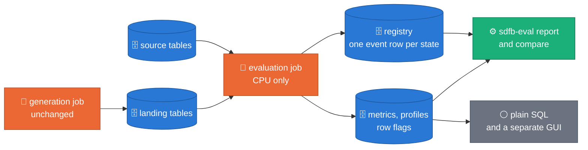
```mermaid
flowchart LR
  classDef beam  fill:#eb6834,color:#fff,stroke:#b44f26
  classDef cpu   fill:#1baf7a,color:#fff,stroke:#127a55
  classDef store fill:#2a78d6,color:#fff,stroke:#1d5599
  classDef data  fill:#6b7280,color:#fff,stroke:#4b5563

  GEN["🔀 generation job<br/>unchanged"]:::beam --> LAND[("🗄️ landing tables")]:::store
  SRC[("🗄️ source tables")]:::store --> EVAL
  LAND --> EVAL["🔀 evaluation job<br/>CPU only"]:::beam
  EVAL --> REG[("🗄️ registry<br/>one event row per state")]:::store
  EVAL --> MET[("🗄️ metrics, profiles<br/>row flags")]:::store
  REG --> CLI["⚙️ sdfb-eval report<br/>and compare"]:::cpu
  MET --> CLI
  MET --> SQL["⚪ plain SQL<br/>and a separate GUI"]:::data
```

The generation job is not touched. The evaluator starts after it, reads the
landing tables and the source, and writes its results to four BigQuery
tables in `synthetic_data_quality` and, optionally, to local JSON files.
Its only other writes are temporary tables that expire after 24 hours
(§3). No managed dashboard, lineage or data-quality-scan service is
involved ([ADR 0001](../adr/0001-no-managed-gcp-services.md)).

Three properties set this design apart from the proposal it replaces:

- **Post-hoc, never a gate inside generation.** An evaluation status
  describes the run (`SUCCEEDED`, `PARTIAL`, …), not the data: a run whose
  metrics fail still succeeded. A calling script can turn metric statuses
  into an exit code with `--fail_on`, and nothing more.
- **Effect sizes with a noise floor, never p-values.** At tens of millions
  of rows every difference is statistically significant
  ([Lin, Lucas & Shmueli 2013][linlucas2013]), so a significance test would
  fail every large table. Each row carries its own sampling noise instead
  (§4.2).
- **Similarity-based privacy metrics are risk indicators, not guarantees.**
  A table can pass all of them and still leak
  ([Stadler, Oprisanu & Troncoso 2022][stadler2022];
  [Ganev & De Cristofaro 2023][ganev2023]). The catalogue says so in each
  metric's pitfalls, and §12 lists what would be needed for more.

### 1.1 Levels and families

**Claim:** every metric looks at one unit of the data, from a single cell to
the whole launch, and belongs to one of four families.

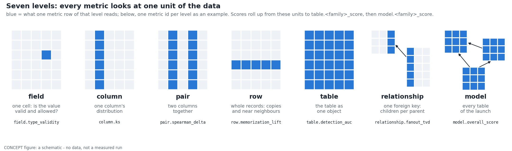

*CONCEPT figure (schematic, no data).* *Intuition:* a "field" metric judges
cells one at a time, a "column" metric a whole distribution, and so on up to
the model, which is every table of the launch. *Formally:* a metric id is
`<level>.<name>`, the level being one of `field, column, pair, row, table,
relationship, model`; the family is `fidelity`, `privacy`, `integrity` or
`diversity`, with `overall` reserved for roll-up scores
([Jordon et al. 2022][jordon2022] for the fidelity, privacy and utility
framing this narrows). *Code:* `catalogue/metrics.yaml` (`levels`,
`families`), parsed by `catalogue.load_catalogue`. The number of metrics per
level and family is in the generated table of §4.10, not in the figure.

| Family | The question it asks |
| --- | --- |
| fidelity | Does the synthetic data have the source's distributions, dependences and shapes? |
| privacy | Does it reproduce source records or rare values, beyond what chance explains? |
| integrity | Does it keep what generation promises by construction: types, keys, referential integrity, row counts? |
| diversity | Does it cover the source's variety without collapsing or repeating itself? |

### 1.2 Evidence so far

No evaluation has run on Google Cloud, so there is no run identifier to
cite and no evidence bundle under `docs/releases/`. What exists:

- **A planted-defect acceptance on a laptop.** The composed pipeline runs on
  an invented three-table launch with seven defects planted in it, and each
  defect must fail the metrics named for it (§10). It is a test, in
  `tests/beam/test_acceptance.py`, not a run on real data.
- **Laptop micro-benchmarks** of each transform, in `eval-cpu-budget`
  (§5.3). They size the design; they are not a Dataflow measurement.

The first run on GCP is the evidence this document is waiting for. §11
lists what that run has to show.

## 2. Architecture, independence and the seven decisions

**Claim:** the evaluator shares files with the generator, never code.

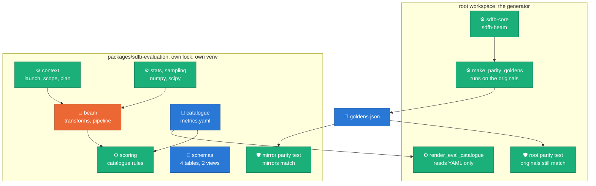
```mermaid
flowchart TB
  classDef beam  fill:#eb6834,color:#fff,stroke:#b44f26
  classDef cpu   fill:#1baf7a,color:#fff,stroke:#127a55
  classDef store fill:#2a78d6,color:#fff,stroke:#1d5599
  classDef data  fill:#6b7280,color:#fff,stroke:#4b5563

  subgraph ROOT["root workspace: the generator"]
    CORE["⚙️ sdfb-core<br/>sdfb-beam"]:::cpu
    GOLD["⚙️ make_parity_goldens<br/>runs on the originals"]:::cpu
    RTEST["🛡️ root parity test<br/>originals still match"]:::cpu
    RENDER["⚙️ render_eval_catalogue<br/>reads YAML only"]:::cpu
  end
  subgraph EVAL["packages/sdfb-evaluation: own lock, own venv"]
    CTX["⚙️ context<br/>launch, scope, plan"]:::cpu
    BEAM["🔀 beam<br/>transforms, pipeline"]:::beam
    STATS["⚙️ stats, sampling<br/>numpy, scipy"]:::cpu
    SCORE["⚙️ scoring<br/>catalogue rules"]:::cpu
    CAT["📄 catalogue<br/>metrics.yaml"]:::store
    SCH["📄 schemas<br/>4 tables, 2 views"]:::store
    ETEST["🛡️ mirror parity test<br/>mirrors match"]:::cpu
  end
  FILE["📄 goldens.json"]:::store

  CORE --> GOLD --> FILE
  FILE --> RTEST
  FILE --> ETEST
  CTX --> BEAM
  STATS --> BEAM
  BEAM --> SCORE
  CAT --> SCORE
  CAT --> RENDER
```

| Module | What it owns |
| --- | --- |
| `context/` | Everything decided before a row is read: the launch (`launch`, `jobs`, `runs`, `gcp`), the relationship model mirror (`relationships`), the scope and the source pin (`scope`), the reference panel (`reference`), the plan and its budgets (`plan`, `budget`), planning from in-memory rows (`offline`), and the one wrapper every BigQuery call goes through (`bq`) |
| `stats/`, `sampling/` | numpy and scipy statistics (the detection test also uses scikit-learn) and the bottom-k sampler. No Beam, no BigQuery |
| `beam/` | The encoder, five transforms (`dense`, `census`, `membership`, `privacy`, `relational`), sources and sinks (`io`), the label key (`label_key`), assembly and the composed pipeline |
| `scoring/` | Status, score and roll-ups, executed from the catalogue |
| `catalogue/`, `schemas/` | The two contracts: every metric, and the four tables with their two views |
| `cli/`, `report/` | `sdfb-eval`, the flex-template entry, the report and comparison renderers |

Independence is enforced, not assumed. A test walks the package's syntax
trees and fails on any import of `sdfb_core`, `sdfb_beam` or `sdfb_tests`
(`tests/unit/test_independence.py`); CI installs the package alone, with its
own lock, and asserts that none of those modules can be found.

### 2.1 The seven decisions

| | Decision | Why | Where it lives |
| --- | --- | --- | --- |
| D1 | **A standalone nested project**, excluded from the root workspace: its own `pyproject.toml`, `uv.lock` and Python pin | A fourth workspace member would break the generator's image build, which copies three member projects and then syncs every package, and the DSG unit, which ships the root project file and lock. The evaluator also pins its Python and Beam versions in its own lock, so a later bump touches this package alone | root `pyproject.toml` (`[tool.uv.workspace] exclude`), CI job `evaluation` |
| D2 | **Parity by two-sided golden files, never by import.** The evaluator re-implements the small pieces whose semantics must match the generator: the relationship-model reader, the reference digest, the reference query and the row-document limit | An import would end the independence of D1. A copy can drift, so one golden file is checked from both sides: a root test proves the originals still produce it, a package test proves the mirrors do. (Shape masks and the legacy decile distance are verbatim ports of this repository's scripts, with their own tests) | `scripts/evaluation/make_parity_goldens.py`, `tests/fixtures/parity/goldens.json`, `context/relationships.py`, `context/reference.py` |
| D3 | **The reference sets come from the generator's own order.** R, E, H and H_E are prefixes of one ranking of the source by row fingerprint (§3.5) | The generator's reference sample is the first n rows of that ranking. The next n rows are a holdout drawn the same way, so chance matches fall on R and H alike, and a ratio between them does not depend on how dense the value domain is | `context/reference.py` |
| D4 | **Fidelity is measured against the full source, as the job saw it.** The source is pinned by time travel at the job's create time while that is possible. Every fidelity row also stores `baseline_value = metric(R, source)` | A generator that read only the reference sample cannot be expected to beat the sample's own distance from the source. The baseline is that floor (§4.2) | `context/scope.py::pin_source`, `baseline: true` in the catalogue |
| D5 | **Status reads effect sizes and sampling noise.** A metric warns or fails only when its value crosses the threshold and that crossing is not explained by noise. Lifts and the holdout share gate on a confidence bound. No p-value is reported. Metrics whose raw value depends on sample size are computed at matched n | A fixed threshold is wrong at small n, where noise crosses it, and a significance test is wrong at large n, where everything is significant | `scoring.status_for`, `stats/noise.py` |
| D6 | **Outputs honour the literal policy.** A value is written literally only when its column has at most 50 distinct source values ([ADR 0022](../adr/0022-stats-driven-generation.md)) and the value occurs at least 10 times in the source. Everything else is a keyed hash label. Source keys in row flags are keyed hashes. The same k = 10 spaces the numeric values a profile publishes (§4.9: at least 10 source records beyond an edge and between two published edges) | The evaluation tables are read more widely than the source. A value held by a handful of records is a quasi-identifier ([Sweeney 2002][sweeney2002]) | `context/plan.py` (`literal_ok`), `canonical.hashed_label`, `beam/label_key.py` |
| D7 | **The registry is append-only events.** A run writes a `RUNNING` row and exactly one terminal row; a view picks the last event per evaluation. The terminal row is written after the metric tables' load and copy jobs have finished | A registry row that says a run finished must imply that its metrics are readable. With events only appended, every state a run went through stays on record | `beam/assemble.py`, `beam/pipeline.py`, `schemas/views.sql` |

## 3. What gets evaluated: context, scope, panel

### 3.1 From a target to a launch

**Claim:** a job id is enough, because five sources each answer part of the
question "what did this job write, and with which parameters?", and every
fallback taken is recorded as a warning.

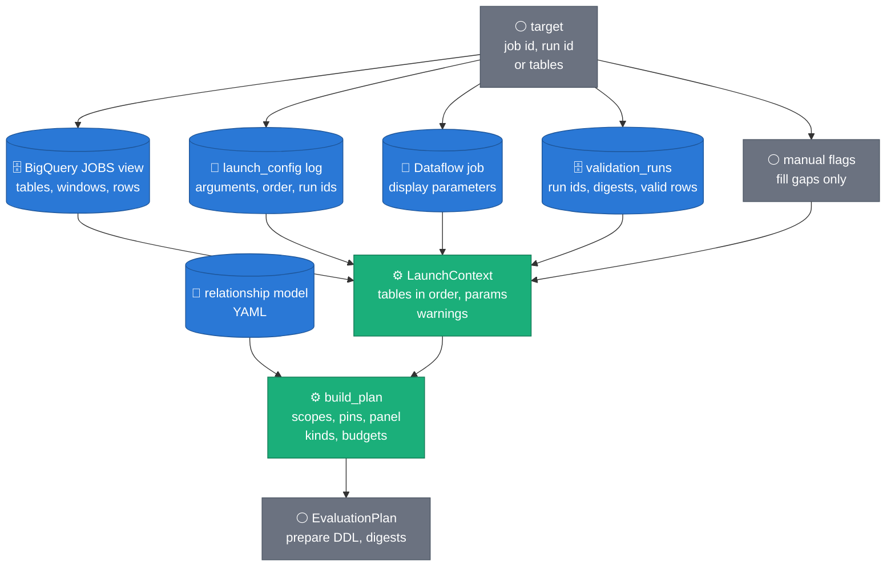
```mermaid
flowchart TD
  classDef cpu   fill:#1baf7a,color:#fff,stroke:#127a55
  classDef store fill:#2a78d6,color:#fff,stroke:#1d5599
  classDef data  fill:#6b7280,color:#fff,stroke:#4b5563

  T["⚪ target<br/>job id, run id<br/>or tables"]:::data
  T --> S1[("🗄️ BigQuery JOBS view<br/>tables, windows, rows")]:::store
  T --> S2[("📄 launch_config log<br/>arguments, order, run ids")]:::store
  T --> S3[("📄 Dataflow job<br/>display parameters")]:::store
  T --> S4[("🗄️ validation_runs<br/>run ids, digests, valid rows")]:::store
  T --> S5["⚪ manual flags<br/>fill gaps only"]:::data
  S1 --> L["⚙️ LaunchContext<br/>tables in order, params<br/>warnings"]:::cpu
  S2 --> L
  S3 --> L
  S4 --> L
  S5 --> L
  M[("📄 relationship model<br/>YAML")]:::store --> P
  L --> P["⚙️ build_plan<br/>scopes, pins, panel<br/>kinds, budgets"]:::cpu
  P --> E["⚪ EvaluationPlan<br/>prepare DDL, digests"]:::data
```

| Source | Answers | Lost when |
| --- | --- | --- |
| 1. Job labels in [`INFORMATION_SCHEMA.JOBS`][bq-jobs] | Which tables the job committed rows to, when, and how many. Per Beam's source, every load and copy job it submits is labelled with the Dataflow job id (never observed by this package) | The evaluator lacks `roles/bigquery.resourceViewer` on the project |
| 2. The launcher's `launch_config` log entry | Every launch argument, the table order, the run ids | Log retention has passed, or the launch predates the entry |
| 3. The Dataflow job's display parameters | The launch arguments | The job is past Dataflow's retention |
| 4. `validation_runs` | Run ids (`<base>-NN-<table>`), reference digests, valid row counts | The table is not read |
| 5. Manual flags | Anything still missing | — |

Manual input only fills gaps: a manual value that disagrees with a resolved
one is ignored and warned about. A relational launch is never silently
narrowed to the one table its `--landing_table` flag names. The context is
copied into the registry row (`generation_params`), because logs expire.
*Code:* `context/launch.py`.

Each table of the plan gets a role, from the enforced edges of the
relationship model, which is the only source of relational structure:

| Role | Meaning |
| --- | --- |
| `root` | No enforced edge of its own, and another launch table references it |
| `driven` | An enforced edge into another table of the launch |
| `side_input` | Enforced edges, all into tables outside the launch |
| `isolated` | Neither |
| `standalone` | A table evaluated without a model entry: a single-table launch, or relationships off |
| `external` | A parent that this job did not write. It is read, never evaluated |

### 3.2 Scope: which rows did this job write?

Landing rows carry no run id, so one job's rows are recovered from the
launch's write disposition and from the job's own commit window. `--scope
auto` picks one of four modes; `--scope manual` is the fifth. **One panel
per mode:**

**`table`: the job overwrote the table and nobody wrote after it.**


```mermaid
flowchart LR
  classDef beam  fill:#eb6834,color:#fff,stroke:#b44f26
  classDef cpu   fill:#1baf7a,color:#fff,stroke:#127a55
  classDef store fill:#2a78d6,color:#fff,stroke:#1d5599
  J["🔀 job overwrote<br/>the table"]:::beam --> T[("🗄️ landing table<br/>as it is now")]:::store --> R["⚙️ read the<br/>whole table"]:::cpu
```

**`as_of`: the job overwrote the table, then someone else wrote to it.**


```mermaid
flowchart LR
  classDef beam  fill:#eb6834,color:#fff,stroke:#b44f26
  classDef cpu   fill:#1baf7a,color:#fff,stroke:#127a55
  classDef store fill:#2a78d6,color:#fff,stroke:#1d5599
  J["🔀 job overwrote<br/>the table"]:::beam --> F["🔀 a later writer<br/>added rows"]:::beam --> T[("🗄️ landing table<br/>now holds both")]:::store
  T --> C[("🗄️ snapshot clone<br/>AS OF window end")]:::store --> R["⚙️ read the clone"]:::cpu
```

**`appends`: the job appended through load jobs or DML.**

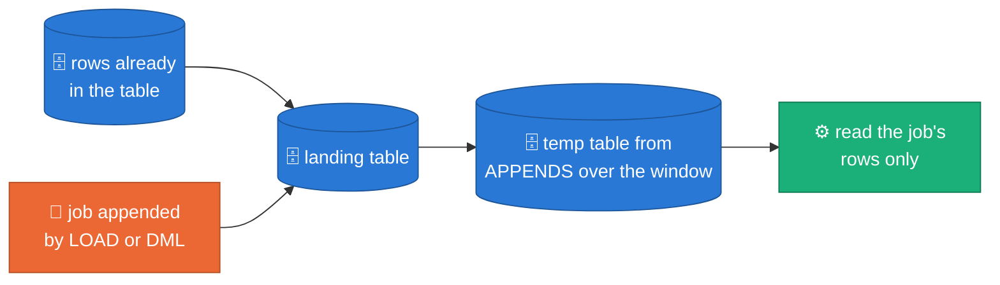
```mermaid
flowchart LR
  classDef beam  fill:#eb6834,color:#fff,stroke:#b44f26
  classDef cpu   fill:#1baf7a,color:#fff,stroke:#127a55
  classDef store fill:#2a78d6,color:#fff,stroke:#1d5599
  O[("🗄️ rows already<br/>in the table")]:::store --> T[("🗄️ landing table")]:::store
  J["🔀 job appended<br/>by LOAD or DML"]:::beam --> T
  T --> C[("🗄️ temp table from<br/>APPENDS over the window")]:::store --> R["⚙️ read the job's<br/>rows only"]:::cpu
```

**`as_of_diff`: the job appended through copy jobs.**

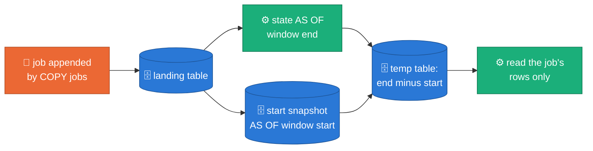
```mermaid
flowchart LR
  classDef beam  fill:#eb6834,color:#fff,stroke:#b44f26
  classDef cpu   fill:#1baf7a,color:#fff,stroke:#127a55
  classDef store fill:#2a78d6,color:#fff,stroke:#1d5599
  T[("🗄️ landing table")]:::store --> S[("🗄️ start snapshot<br/>AS OF window start")]:::store
  J["🔀 job appended<br/>by COPY jobs"]:::beam --> T
  T --> E["⚙️ state AS OF<br/>window end"]:::cpu
  E --> D[("🗄️ temp table:<br/>end minus start")]:::store
  S --> D
  D --> R["⚙️ read the job's<br/>rows only"]:::cpu
```

**`manual`: `--scope manual`, the table as it is now, no window.**

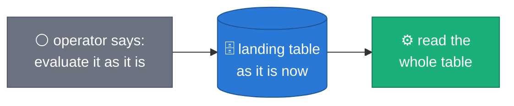
```mermaid
flowchart LR
  classDef cpu   fill:#1baf7a,color:#fff,stroke:#127a55
  classDef store fill:#2a78d6,color:#fff,stroke:#1d5599
  classDef data  fill:#6b7280,color:#fff,stroke:#4b5563
  O["⚪ operator says:<br/>evaluate it as it is"]:::data --> T[("🗄️ landing table<br/>as it is now")]:::store --> R["⚙️ read the<br/>whole table"]:::cpu
```

Why `as_of_diff` exists. BigQuery's change history lists the operations
that add rows to [`APPENDS`][bq-change-history]: the `CREATE TABLE`
statement, `INSERT`, the appended part of `MERGE`, loading data and
streaming ingestion. Copy jobs are not on that list, and Beam's file-loads
write lands large writes through temporary tables and copy jobs. So a
window that contains a copy job is read as an exact multiset difference of
two states of the table instead: rows are numbered within groups of
identical JSON text on both sides, and the end-side pairs absent from the
start side are kept. It takes two statements because "a single query
statement can't reference a single table at more than one point in time"
([`FOR SYSTEM_TIME AS OF`][bq-as-of]): planning creates a zero-byte
[snapshot][bq-snapshots] of the start state that expires after 24 hours,
and the difference then reads the table at one point and the snapshot at
another. That start snapshot is the one table planning creates. `sdfb-eval
plan --no_planning_snapshots` plans without it and reports such tables as
unplanned.

**`--no_planning_snapshots`: one panel for each side of the flag.**

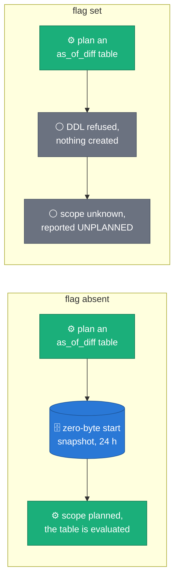
```mermaid
flowchart LR
  classDef cpu   fill:#1baf7a,color:#fff,stroke:#127a55
  classDef store fill:#2a78d6,color:#fff,stroke:#1d5599
  classDef data  fill:#6b7280,color:#fff,stroke:#4b5563
  subgraph OFF["flag absent"]
    A1["⚙️ plan an<br/>as_of_diff table"]:::cpu --> A2[("🗄️ zero-byte start<br/>snapshot, 24 h")]:::store --> A3["⚙️ scope planned,<br/>the table is evaluated"]:::cpu
  end
  subgraph ON["flag set"]
    B1["⚙️ plan an<br/>as_of_diff table"]:::cpu --> B2["⚪ DDL refused,<br/>nothing created"]:::data --> B3["⚪ scope unknown,<br/>reported UNPLANNED"]:::data
  end
```

Every other writer is placed against the job's window, and the scope ends
in one of six statuses:

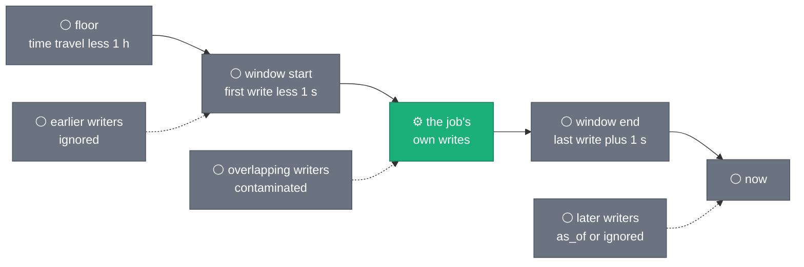
```mermaid
flowchart LR
  classDef cpu   fill:#1baf7a,color:#fff,stroke:#127a55
  classDef data  fill:#6b7280,color:#fff,stroke:#4b5563
  FL["⚪ floor<br/>time travel less 1 h"]:::data --> WS["⚪ window start<br/>first write less 1 s"]:::data --> JOB["⚙️ the job's<br/>own writes"]:::cpu --> WE["⚪ window end<br/>last write plus 1 s"]:::data --> NOW["⚪ now"]:::data
  EARLY["⚪ earlier writers<br/>ignored"]:::data -.-> WS
  OVER["⚪ overlapping writers<br/>contaminated"]:::data -.-> JOB
  LATE["⚪ later writers<br/>as_of or ignored"]:::data -.-> NOW
```

| `scope_status` | When | What is read |
| --- | --- | --- |
| `ok` | The rows read agree with the rows the job committed: equal below 1,000 rows, within 0.5 % above (at 10 M rows, 50,000 rows off is still `ok`) | The scope |
| `count_mismatch` | The rows read differ from the job's committed output rows, or from the sum of `validation_runs.valid_count` | The scope; the run is `PARTIAL` |
| `contaminated` | Another writer's commit may fall inside the window | Nothing, unless `--allow_contaminated` |
| `expired` | The window is older than the table's [time-travel][bq-time-travel] window less a one-hour margin | Nothing |
| `empty` | The job wrote nothing | Nothing |
| `unknown`, cannot be placed | The window cannot be placed (it ends after now, for example), or the table's dry run failed, or its start snapshot was not allowed | Nothing |
| `unknown`, read and flagged | An overwrite launch with no labelled write found (`JOBS` denied, or past retention), or a scope with no count to check against | The whole current table, with a warning; the run ends `SUCCEEDED_WITH_WARNINGS` |

A scope that cannot be placed reads nothing. The one case where the current
table is read without a recovered scope is the second `unknown` row: an
overwrite launch that lost source 1 (below) reads the whole table, because
writes after the job cannot be ruled out, and says so. The row count is
checked whenever a count is known, within the tolerance above; a writer
with no BigQuery job of its own, such as a streaming insert, is invisible
to the JOBS view, and the count check is the only guard there. *Code:* `context/scope.py`
(`resolve_scope`, `ScopePlan.verify`), `context/jobs.py::foreign_writes`.

**`--allow_contaminated`: one panel for each side of the flag.**

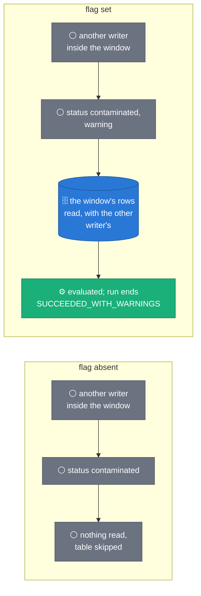
```mermaid
flowchart LR
  classDef cpu   fill:#1baf7a,color:#fff,stroke:#127a55
  classDef store fill:#2a78d6,color:#fff,stroke:#1d5599
  classDef data  fill:#6b7280,color:#fff,stroke:#4b5563
  subgraph OFF["flag absent"]
    A1["⚪ another writer<br/>inside the window"]:::data --> A2["⚪ status contaminated"]:::data --> A3["⚪ nothing read,<br/>table skipped"]:::data
  end
  subgraph ON["flag set"]
    B1["⚪ another writer<br/>inside the window"]:::data --> B2["⚪ status contaminated,<br/>warning"]:::data --> B3[("🗄️ the window's rows<br/>read, with the other<br/>writer's")]:::store --> B4["⚙️ evaluated; run ends<br/>SUCCEEDED_WITH_WARNINGS"]:::cpu
  end
```

Unverified until the first GCP run: whether `APPENDS` returns exactly the
job's rows on a load-only window, whether it also returns copy-job rows,
whether the difference runs within budget on a large table (it reads about
twice the table's bytes), whether a snapshot with an expiration can be
created with the evaluator's roles (the
[documented permissions][bq-snapshots-create] include
`tables.createSnapshot` and, for the expiration, `tables.deleteSnapshot`),
and how a table's creation time behaves after an overwrite. The module
docstring of `context/scope.py` lists these checks.

### 3.3 The source as the job saw it

Within the source's time-travel window, the source is read through a
snapshot clone as of the generation job's create time (D4). Outside it, or
when the create time is unknown, the source is read as it is now, the plan
says so, and the reference digest check of §3.5 then tells whether the
source still yields the generator's sample.

A pin that BigQuery **refuses** degrades to the unpinned source with a
warning: an HTTP 400, 403 or 404, as a clone across organisations or
regions would give. Any other error (a 5xx, a 429, a conflict) may succeed
on a retry, so it fails the run with a `FAILED` registry row rather than
silently changing what the evaluation reads (R89). The same rule holds for
a read-only parent that cannot be read, for the free-text pools read and
for the read of the generator's source statistics behind
`column.source_stats_drift` (R113): a refusal leaves the metric
`not_evaluated` with the reason, any other error fails the run.
*Code:* `beam/pipeline.py::prepare_evaluation`, `context/bq.py::is_refusal`.

### 3.4 `--mode`: exact or sampled

**One panel per mode.** The DirectRunner defaults to `sampled`, Dataflow to
`exact`.

**`exact`: every row of both sides.**

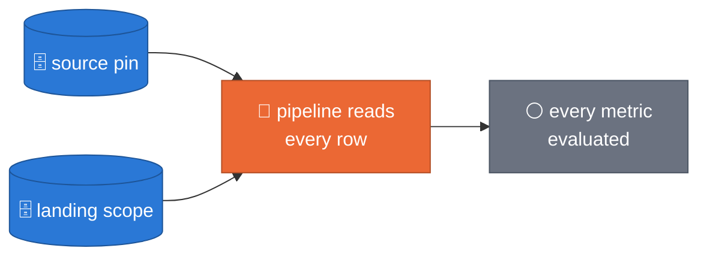
```mermaid
flowchart LR
  classDef beam  fill:#eb6834,color:#fff,stroke:#b44f26
  classDef store fill:#2a78d6,color:#fff,stroke:#1d5599
  classDef data  fill:#6b7280,color:#fff,stroke:#4b5563
  S[("🗄️ source pin")]:::store --> P["🔀 pipeline reads<br/>every row"]:::beam
  L[("🗄️ landing scope")]:::store --> P
  P --> M["⚪ every metric<br/>evaluated"]:::data
```

**`sampled`: a salted hash sample of each side above `--sample_rows`.**

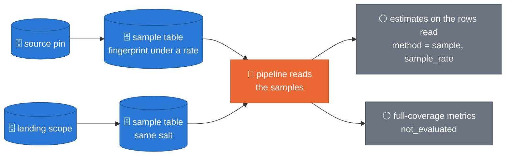
```mermaid
flowchart LR
  classDef beam  fill:#eb6834,color:#fff,stroke:#b44f26
  classDef store fill:#2a78d6,color:#fff,stroke:#1d5599
  classDef data  fill:#6b7280,color:#fff,stroke:#4b5563
  S[("🗄️ source pin")]:::store --> SS[("🗄️ sample table<br/>fingerprint under a rate")]:::store
  L[("🗄️ landing scope")]:::store --> LS[("🗄️ sample table<br/>same salt")]:::store
  SS --> P["🔀 pipeline reads<br/>the samples"]:::beam
  LS --> P
  P --> M1["⚪ estimates on the rows read<br/>method = sample, sample_rate"]:::data
  P --> M2["⚪ full-coverage metrics<br/>not_evaluated"]:::data
```

The sample keeps the rows whose salted [`FARM_FINGERPRINT`][bq-hash] of the
row's JSON text falls under a rate, so the same rows are kept for the same
salt and identical rows are kept together. A sample cannot support a
verdict that needs every row of a side. In sampled mode the full-source
match rates, the key duplicate rates, internal duplicates, and the orphan
rates and fan-out metrics of an edge whose child side or parent side was
sampled are
`not_evaluated` with the reason "sampled mode cannot measure …; run exact
mode" and the observed lower bound in `detail` (R72). An integrity pass
never comes from a sample, with one stated exception: `field.type_validity`
is `not_evaluated` when the synthetic side is a sample, and
`column.source_stats_drift` (integrity) is not withheld. It compares the
generator's stats row with the evaluator's profile of the source, so under
a sampled source it is stored as an estimate (`method = sample`, with the
rate) and can pass; it audits the generator's input, never the output. Rates and lifts that
compare the panel with the rows read stay evaluated, with `method = sample`
and the sampling rate on the row.

The same rule holds for the per-column metrics (R72, R113). A metric
defined by the value set of a side, or by an exact count or extreme of it,
is `not_evaluated` when that side is a sample:

| Metric | Needs in full | Why a sample cannot measure it |
|---|---|---|
| `field.category_adherence`, `column.novelty_mass` | the source | a synthetic value whose source rows were not sampled looks invented |
| `field.substantive_copy_rate` | the source | a copy of an unsampled source value goes unseen, and a value's source count (the rare-below-10 rule) is thinned |
| `field.shape_adherence` | the source | a synthetic shape whose source rows were not sampled looks unseen |
| `column.coverage_mass` | the synthetic | a source value whose synthetic rows were not sampled looks uncovered |
| `column.distinct_ratio`, `column.entropy_ratio` | both sides | defined at m = min(n_src, n_syn); a row sample thins repeats and the ratio drifts toward 1, whichever side was sampled (`detail` keeps the sample's `sample_ratio` and distinct counts, named so they are not read as the table's) |
| `field.type_validity` | the synthetic | the invalid cells may all lie outside the rows read (a sampled source alone leaves it evaluated on the full synthetic side, and not stamped `sample`) |
| `column.distinct_ceiling_hit` | the synthetic | the exact synthetic distinct count is not measured |
| `column.range_coverage` | both sides | a sample's extremes fall inside its side's range |

Every other per-column, pair and row-pattern metric that reads a sampled
side is an estimate over the rows read: `method = sample`, `sample_rate` =
the lowest rate among the sampled sides it reads, and
`detail.sample_rates` names each side's rate. `n_source` and `n_synthetic`
are the rows read, so every interval and noise floor is the sample's own.
`field.range_adherence` stays evaluated because its bounds come from the
planning scan, which reads the whole source before a sample is drawn. A
profile of a sampled side carries `sample_rate` in its payload.

### 3.5 The reference panel: R, E, H and H_E

**Claim:** one ranking of the source gives the rows the generator read, an
equally sized set it never saw, and inside each the rows a prompt could
have shown.

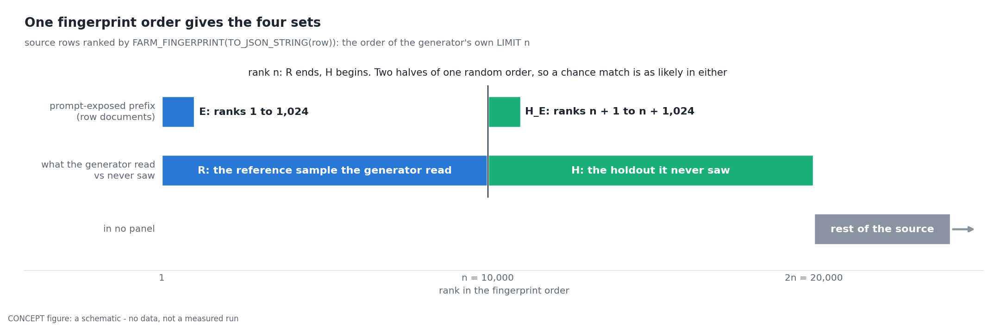

*CONCEPT figure (schematic, no data; n = 10,000 is an example).*
*Intuition:* the generator's sample is "the first n rows" of a shuffled
source. The next n rows were shuffled the same way and were never read, so
they are a fair control group for anything said about the first n.
*Formally:* with ranks under `ORDER BY FARM_FINGERPRINT(TO_JSON_STRING(row))`,
R = ranks 1..n, H = ranks n+1..2n, E = ranks 1..1,024 and H_E = ranks
n+1..n+1,024. R and H are exchangeable halves of one ranking, so under "no
memorization" a synthetic table hits records exclusive to R and records
exclusive to H at the same rate; this is the holdout design of
[Platzer & Reutterer 2021][platzer2021] applied to exact matches as well as
distances. *Code:* `context/reference.py` (`REFERENCE_ORDER_BY`,
`panel_sql`, `EXPOSURE_ROWS`).

R is hashed again with the generator's digest and compared with the digest
the generator recorded in `validation_runs`. When they differ (the source
changed before the pin, or could not be pinned), or when no digest was
recorded, the panel is **unverified**: every metric that rests on R, E or
H is `not_evaluated` with the reason, the metrics against the full source
are still computed, and the run is `PARTIAL`. E is the first 1,024 ranks because those are the rows the
retrieval engine embeds as row documents, which is what a prompt could have
shown ([ADR 0019](../adr/0019-rag-population-scoped-to-consumers.md)).

## 4. The metric catalogue

### 4.1 One file, three readers

`catalogue/metrics.yaml` is the single place a metric is defined: its id,
level, family, the column kinds it applies to, formula, estimator,
direction, thresholds, score function, noise method, and the text shown to
a reader (purpose, interpretation, pitfalls, references).

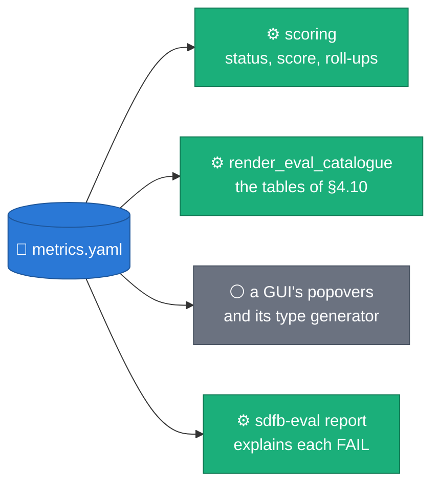
```mermaid
flowchart LR
  classDef cpu   fill:#1baf7a,color:#fff,stroke:#127a55
  classDef store fill:#2a78d6,color:#fff,stroke:#1d5599
  classDef data  fill:#6b7280,color:#fff,stroke:#4b5563
  Y[("📄 metrics.yaml")]:::store --> S["⚙️ scoring<br/>status, score, roll-ups"]:::cpu
  Y --> D["⚙️ render_eval_catalogue<br/>the tables of §4.10"]:::cpu
  Y --> G["⚪ a GUI's popovers<br/>and its type generator"]:::data
  Y --> R["⚙️ sdfb-eval report<br/>explains each FAIL"]:::cpu
```

The loader is strict: a missing or unknown key, an unknown vocabulary
value or a non-numeric threshold fails at load time, so a bad edit cannot
mis-score a run. The tables in §4.10 are generated from the file and
checked in CI, so this document cannot disagree with the code about a
threshold, a formula or a noise method.

### 4.2 How to read a metric row

A row of `evaluation_metrics` holds the value and what is needed to judge
it without opening another table: the per-side statistics
(`source_value`, `synthetic_value`), the floor (`baseline_value`), the
sampling noise (`noise_floor`, or `ci_low` and `ci_high`), how it was
computed (`method`, `sample_rate`, the digests of the encoding plan and
feature set used), the thresholds it was graded against, and `status` and
`score`.

**Claim (D4):** a value is read against its baseline, not against zero,
because a generator that read only R cannot be expected to score below
`metric(R, source)`.

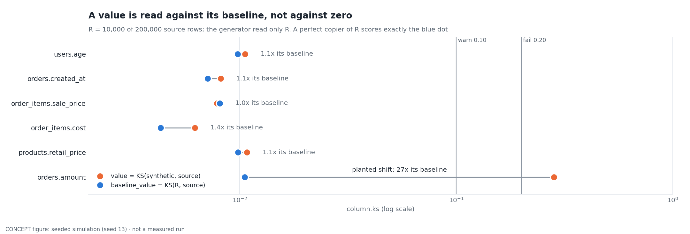

*CONCEPT figure (seeded simulation, seed 13; not a measurement of a run).*
*Intuition:* the blue dot is how far the 10,000-row sample itself sits
from the full table. A generator that learned the column only from that
sample lands on or just right of it; a generator with a real defect lands
far to the right. *Formally:* `baseline_value = metric(R, source)`, the
value a perfect copier of the reference sample would score, stored on
every row whose catalogue entry has `baseline: true`. *Code:*
`beam/dense.py::dense_outputs` and `beam/census.py` compute it from the
`reference` side; the detection metrics compute theirs in
`beam/privacy.py`.

Two limits on the baseline. It is withheld when the reference holds fewer
than 10 values of the column (§4.9). And the detection baseline is taken at
n = |R|, not at the metric's own n (`detail.baseline_n`): it is a floor to
read, not a matched comparison.

**Claim (D5):** the same KS value is noise at 1,000 rows and a real effect
at a million, so each row carries its own floor and status reads both.

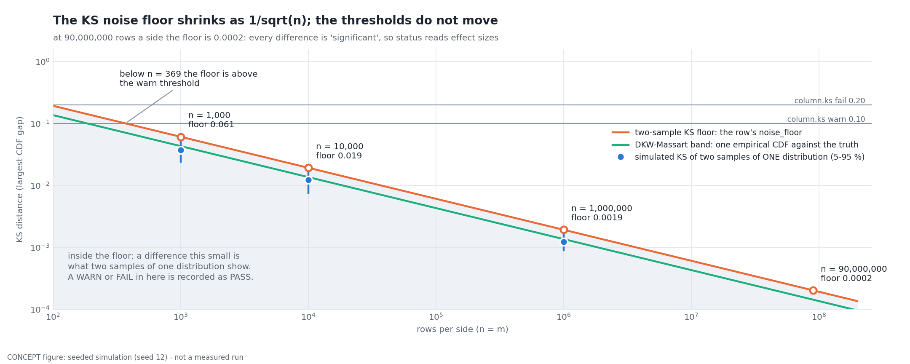

*CONCEPT figure (seeded simulation, seed 12; not a measurement of a run).*
*Intuition:* two samples of the very same distribution never have identical
CDFs. The orange line is how large their gap gets by chance; it shrinks as
tables grow, while the thresholds stay where they are. Under the line a
difference means nothing; far above it, it means something at every size.
*Formally:* the two-sample KS statistic exceeds
`sqrt(-ln(α/2)/2) · sqrt((n+m)/(n·m))` with probability α under the null
([Smirnov 1948][smirnov1948]); one empirical CDF stays within
`sqrt(ln(2/α)/(2n))` of the truth with probability 1 − α
([Dvoretzky, Kiefer & Wolfowitz 1956][dkw1956], with the tight constant of
[Massart 1990][massart1990]). *Code:* `stats/noise.py::ks_critical`,
`dkw_epsilon`; `scoring.status_for`, step 9. The DKW band is the one
drawn, for the reference sample alone, in
[the reference-sample scaling design](2026-07-24-reference-sample-scaling.md)
(`assets/sampling-error-dkw.png`); this figure redraws it beside the
two-sample KS floor.

Each noise method of the catalogue is one such estimate:

| `noise_floor` | What it sizes | Form | Source |
| --- | --- | --- | --- |
| `ks_two_sample` | KS on two samples | scalar floor | [Smirnov 1948][smirnov1948] |
| `tvd_null` | TVD between two samples of one distribution | scalar: the expected TVD under the null | normal approximation per category |
| `jsd_null` | JSD on k categories | scalar: `(k−1)(1/n+1/m)/(8 ln 2)` bits | the bias expansion of [Treves & Panzeri 1995][treves1995] |
| `fisher_z` | a difference of two correlations | scalar: `1.96·sqrt(1/(n−3)+1/(m−3))` | [Fisher 1915][fisher1915] |
| `mi_bias` | mutual information on an r × c table | scalar: `(r−1)(c−1)/(2n)` nats | [Treves & Panzeri 1995][treves1995] |
| `wilson` | a share | interval | [Wilson 1927][wilson1927] |
| `newcombe` | a difference of two shares | interval, folded for an absolute difference | [Newcombe 1998][newcombe1998] |
| `delong` | an AUC | interval | [DeLong, DeLong & Clarke-Pearson 1988][delong1988] |
| `rate_ratio` | a ratio of two rates | interval; the metric gates on its bound | [Przyborowski & Wilenski 1940][przyborowski1940], [Clopper & Pearson 1934][clopper1934] |

Scalar methods call a difference noise when the value is within the floor
of its reference; interval methods when the interval covers the reference.
§7.1 gives the full rule.

### 4.3 Distributions on a fixed grid

A column of a hundred million rows cannot be sorted in a Beam combiner, and
it does not need to be. Planning asks BigQuery for a 1,001-point quantile
grid per side ([`APPROX_QUANTILES`][bq-approx]); the Beam pass then counts
every row exactly against that fixed grid. Two passes, plan then count,
replace a sort.

**Claim:** on a fixed grid the KS distance is known exactly at the edges
and bounded inside the bins, and where the source holds a point mass only
the union of both sides' grids closes the bracket.

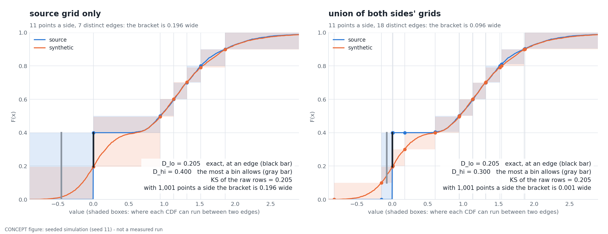

*CONCEPT figure (seeded simulation, seed 11; not a measurement of a run).
Eleven grid points a side are drawn so the bins are visible; the evaluator
uses 1,001, and each panel prints the bracket at that size.* *Intuition:*
at an edge both CDFs are counted exactly, so the gap there is real (the
black bar). Between two edges each CDF can run anywhere inside its shaded
box, so the worst case is one side at the top of its box and the other at
the bottom (the gray bar). Here 40 % of the source is exactly 0 and the
generator smeared that mass around 0: the source's own grid has no point
inside the smear however fine it is, the synthetic side's grid does.
*Formally:* with edges e_i, `D_lo = max_i |F_src(e_i) − F_syn(e_i)|` and
`D_hi = max_i max(F_src(e_i) − F_syn(e_{i−1}), F_syn(e_i) − F_src(e_{i−1}))`,
so `D_lo ≤ D ≤ D_hi` for the KS statistic D of the raw rows
([Smirnov 1948][smirnov1948]), and `D_hi − D_lo` is at most the largest
mass both sides put in one bin. *Code:* `stats/binned.py::union_edges`,
`bin_counts`, `ks_bracket`. `column.ks` is `D_lo`; `detail` carries `d_lo`
and `d_hi`.

**Claim:** KS and Wasserstein see different failures, so the catalogue
keeps a sup-statistic and a mass-statistic.

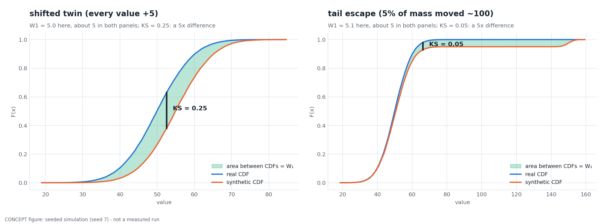

*CONCEPT figure (seeded simulation, seed 7; not a measurement of a run).*
*Intuition:* moving every value a little and moving a few values a long way
can cost the same total "earth moved", yet the first opens a wide gap
between the CDFs and the second barely any. *Formally:* KS is the largest
vertical gap between the CDFs; Wasserstein-1 is the area between them,
`∫ |F_syn − F_src| dx` ([Ramdas, García Trillos & Cuturi 2017][ramdas2017]).
*Code:* `stats/binned.py::ks_bracket`, `w1_from_bins`, `pit_w1`.

`column.wasserstein` is in the column's own units, so it has no threshold
and is reported as information. The gated mass-statistic is
`column.pit_w1`, the same distance after both columns are mapped through
the source's CDF (the probability integral transform,
[Gneiting, Balabdaoui & Raftery 2007][gneiting2007]). It is unit-free and
lies in [0, ½]. On a grid it is

`W1_PIT = Σ_b p_src(b) · |F̄_syn(b) − F̄_src(b)|`, with
`F̄(b) = cumsum(p)(b) − p(b)/2`,

summed over every bin, the open last one included. `F̄` is the
mid-distribution function, not the right-edge CDF: it puts a bin's mass
halfway, which keeps the measure unbiased on a column with a large point
mass, a constant column or an integer column
([Czado, Gneiting & Held 2009][czado2009]; R16). The same mid-CDF transform
feeds the Spearman correlation and the Gower features, so a tied value maps
to the middle of its run everywhere.

**Pitfall: the approximate aggregates.** BigQuery documents
`APPROX_QUANTILES`, `APPROX_COUNT_DISTINCT` and `APPROX_TOP_COUNT` as
[approximate][bq-approx] ("a statistical estimate"; its sketch-based
cardinality functions use HyperLogLog++,
[Heule, Nunkesser & Hall 2013][heule2013], [PDF][heule2013pdf]) and does
not say whether two runs over identical data return the same value. Two
plannings of the same data may therefore differ slightly in grids, atoms,
dictionaries, column kinds and census methods, and so in
`encoding_plan_digest`. Metrics are deterministic **for a given plan**, and
the `evaluation_key` does not depend on these values. Whether repeated
plannings do differ in practice is unverified.

The other distribution metrics keep their textbook forms on the same
counts: Jensen–Shannon divergence in bits without smoothing
([Lin 1991][lin1991]); the population stability index over the ten
source-decile bins with half-a-row smoothing, whose value depends on that
pseudo-count and on n when a bin is nearly empty
([Yurdakul & Naranjo 2020][yurdakul2020]); Cohen's w
([Cohen 1988][cohen1988]) and the standardised mean difference
([Austin 2009][austin2009]) for effect-size thresholds taken from the
literature. Several metric names follow [SDMetrics][sdmetrics], which a
reader may know; no SDMetrics code runs here.

### 4.4 Dependence

Correlations are computed from **centred co-moments** that merge exactly
across bundles, the pairwise update of
[Chan, Golub & LeVeque 1983][chan1983] generalised to covariances
([Pébay 2008][pebay2008]). Nothing sums a large raw value, so a timestamp
in epoch microseconds does not lose its variance to rounding.
`pair.pearson_delta` uses values standardised by the plan's mean and
standard deviation; `pair.spearman_delta` is the Pearson correlation of
each side's mid-CDF transform ([Spearman 1904][spearman1904]), which
agrees with rank correlation under ties. Categorical dependence uses the
bias-corrected Cramér's V of [Bergsma 2013][bergsma2013] and normalised
mutual information, whose plug-in bias is its noise floor
([Treves & Panzeri 1995][treves1995]).

Pairs are chosen at plan time: the `--pair_max_columns` columns with the
most information on a 10-cell grid, never a key, and every pair among
them. A pair metric therefore says nothing about columns outside that set.

### 4.5 Diversity at matched n

**Claim (D5):** plug-in entropy and distinct counts grow with the rows
read, so a faithful generator fails their ratio until both sides are read
at the same n.

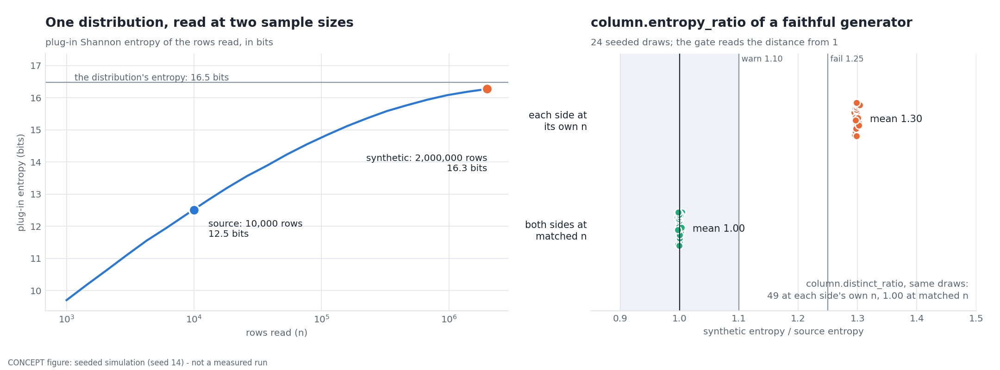

*CONCEPT figure (seeded simulation, seed 14; not a measurement of a run).*
*Intuition:* in a long-tailed column, the more rows you read, the more
rare values you meet. A 2-million-row synthetic table looks more varied
than a 10,000-row source even when both come from one distribution.
*Formally:* the plug-in estimate `Ĥ = −Σ (c_v/n) log2(c_v/n)`
([Shannon 1948][shannon1948]) is biased low by about `(K−1)/(2n ln 2)`
bits ([Miller 1955][miller1955]; [Paninski 2003][paninski2003]), a bias
that depends on n. Both sides are therefore compared on subsamples of
`m = min(n_src, n_syn)` rows. *Code:* `beam/encode.py` (`subsample_m`, a
Bernoulli draw on the row hash at rate m/n), `stats/diversity.py`;
`column.entropy_ratio` and `column.distinct_ratio` have `n_dependent:
true`. The row's `detail` adds the Miller–Madow and
[Chao & Shen 2003][chaoshen2003] estimates, the latter built on the
sample-coverage estimate of [Good 1953][good1953], which also gives
`column.novelty_mass` its data-dependent target.

**Claim (R73):** the share of rows in a duplicate group grows with the rows
compared; rarefied to one m, a faithful generator shows no excess and a
generator that repeats itself keeps it.

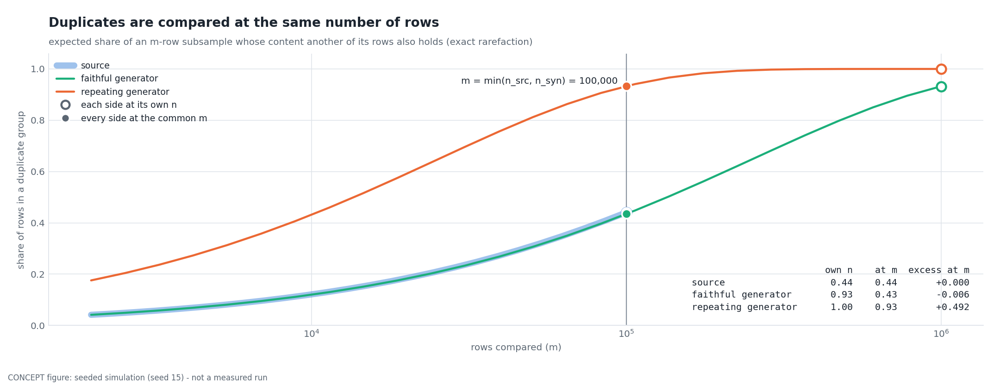

*CONCEPT figure (seeded simulation, seed 15; not a measurement of a run).*
*Intuition:* draw more rows from a finite set of contents and more of them
collide. A synthetic table ten times the size of its source has more
duplicates for that reason alone. Reading both curves at the same number
of rows removes the effect. *Formally:* for a record held c times among N
rows, the number X kept in an m-row subsample is hypergeometric, and the
expected rows in duplicate groups are `E[D_m] = Σ_c f_c (c·m/N − P(X = 1))`,
computed exactly from the frequency of frequencies f_c
([Hurlbert 1971][hurlbert1971]; [Heck, van Belle & Simberloff 1975][heck1975]).
`row.internal_duplicate_excess` is `(E[D_m]_syn − E[D_m]_src)/m`. *Code:*
`beam/membership.py` (the keyed counts, `duplicate_null_variance`).

How the rule got here, because the earlier version is still visible in
some docstrings:

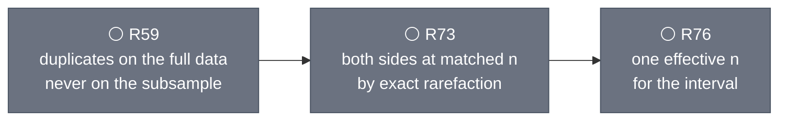
```mermaid
flowchart LR
  classDef data fill:#6b7280,color:#fff,stroke:#4b5563
  A["⚪ R59<br/>duplicates on the full data<br/>never on the subsample"]:::data --> B["⚪ R73<br/>both sides at matched n<br/>by exact rarefaction"]:::data --> C["⚪ R76<br/>one effective n<br/>for the interval"]:::data
```

R59 kept the duplicate rate independent of the row sampler by computing it
on the full data. That left it dependent on n. R73 keeps the full-data
counts and rarefies them, which needs no sampler at all. Rows of one
duplicate group are not independent draws, so the interval is Newcombe's
on one effective sample size for both sides
([Korn & Graubard 1998][korn1998]; [PDF][korn1998pdf]), from the exact null
variance of the duplicate count. **Pitfall:** the value still depends on
m, so compare runs of similar size; and a side read as a row sample is not
evaluated.

### 4.6 The value census, and value sampling

Metrics that need one count per distinct value (TVD, coverage, novelty,
copy rate, the value lifts, top-k lists) come from a keyed census: one
shuffle key per distinct value. A column with tens of millions of distinct
values would dominate the shuffle, so the plan gives each census column a
share of `--max_shuffle_gb` and **value-samples** the columns that do not
fit (§5.3).

A top-k list keeps at most 50 values a side (`census.TOPK_ITEMS`, the
literal policy's column cap, D6). The size is a constant, not a flag: every
knob enters the evaluation key, so a knob that changed nothing would still
change the salt and every sample (R113).

Value sampling is a stratified design (R67). The source's and the
synthetic side's top values are a certainty stratum, always counted; the
tail is sampled by value hash, a value entering when its hash falls under
the rate. Every retained value's counts are exact, so sums over values are
unbiased with weight 1/rate ([Horvitz & Thompson 1952][horvitz1952]), and
shares are ratios of two such sums ([Woodruff 1971][woodruff1971]). The
values, not the rows, are the sampling units: a share on a value-sampled
column carries a cluster-robust interval on an effective number of
sampled values ([Korn & Graubard 1998][korn1998]), so a sample without a
single copy still bounds the copy rate. The row's `method` says
`value_sampled` and `detail` carries the rate.

### 4.7 Privacy

#### Copies and the memorization lifts

`row.exact_match_rate` compares whole rows with the full source;
`row.exact_match_rate_nonkey` leaves out primary-key, identity and
foreign-key columns, so a record copied under a fresh id still matches.
Both are raw rates. A table with a few low-cardinality columns collides
with its source by chance, so a raw rate cannot tell chance from copying.
The lifts can.

**Pitfall: two absolute rates fail by chance on a narrow table.**
`row.exact_match_rate_nonkey` and `row.near_match_rate` are graded against
fixed thresholds (warn 0.001, fail 0.01), whatever the table's width. With
few non-key columns a fresh row equals a source row in all of them, or in
all but one, by coincidence: in a check on invented rows with two non-key
columns (not a measurement of a run) the near-match rate was 0.996 and the
non-key exact-match rate 1.2 %, both FAIL, with nothing copied. The FAIL is
the safe direction and stays as built; whether these two rates should gate
on narrow tables is a privacy policy left to the operator (R113). The
calibrated signal is the lifts below, which compare R with the holdout:
read a FAIL of either rate next to its lift.

**Claim (D3):** chance hits R and H alike, so only copying lifts the
ratio, and status reads the interval's lower bound.

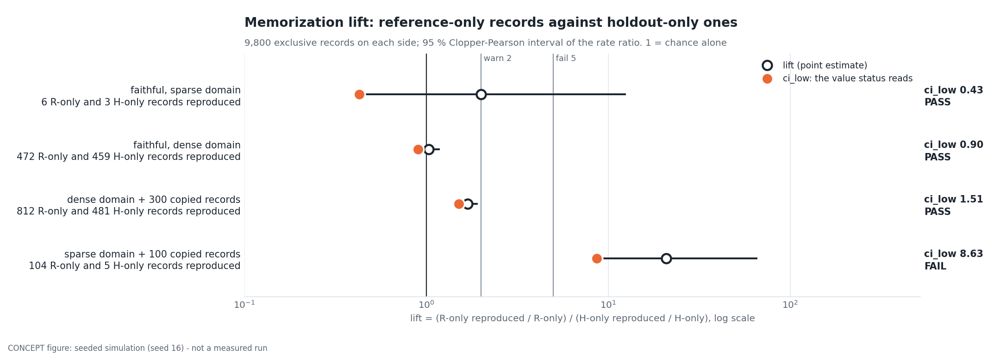

*CONCEPT figure (seeded simulation, seed 16; not a measurement of a run).*
*Intuition:* count the records only the reference sample holds that come
back in the synthetic table, and the same for the holdout. In a dense
domain both counts are large and equal: many exact matches, no lift. Copy
a hundred reference records on top and the first count runs away from the
second. With a handful of events the estimate swings, so the verdict
reads the cautious end of the interval. The third row is the limit of
this: 300 copied records on top of about 480 chance hits lift the ratio
to about 1.7, and its lower bound, about 1.5, stays under the warn line of
2, so that table passes. The lifts see a small copy fraction only where
chance hits are few; in a dense domain a few hundred copies hide among the
chance hits. *Formally:* with exclusive sets
`R∖H` and `H∖R` and m_S the distinct exclusive records of S reproduced,
`lift = (m_R/|R∖H|) / (m_H/|H∖R|)`; conditional on `m_R + m_H`, m_R is
binomial under equal rates ([Przyborowski & Wilenski 1940][przyborowski1940]),
and the [Clopper & Pearson 1934][clopper1934] interval on that proportion
maps onto the ratio. *Code:* `stats/noise.py::rate_ratio`,
`beam/membership.py`. Verbatim reproduction of training text is the
failure these lifts are built to catch ([Carlini et al. 2021][carlini2021]).

Pitfalls, each of which the catalogue repeats in the metric's own text:

- **The event is a distinct record, not a row.** A record reproduced a
  thousand times is one event. Counting rows would weight every chance hit
  by the rows its pattern draws and make the interval far too narrow on a
  skewed table. The row counts are in `detail`; the raw rates and the row
  flags still show the volume.
- **The value-lift pitfall.** `field.value_memorization_lift` applies the
  same test to rare values (held by fewer than 10 source rows) found only
  in R against those found only in H, with the interval corrected for the
  number of columns tested. A generator that draws categorical values from
  the empirical distribution of R reproduces rare R-only values by
  construction, so it fails unless its own source scrub removed them first
  ([ADR 0027](../adr/0027-verified-wave4-operational-integrity.md)). That
  fail is the metric working: rare sample values did reach the output.
- **`field.substantive_copy_rate` is gated on free text only.** On every
  other kind it is information: numeric and temporal values collide with a
  dense source by domain size, and reusing a rare real category is not
  evidence of memorization (R66). The lift is the gated test there.
- **Pool-lift multiplicity.** `field.pool_memorization_lift` runs the test
  on the persisted free-text pool of the run
  ([ADR 0020](../adr/0020-freetext-pools-as-persisted-artifact.md)). Each
  pooled column is its own test at an uncorrected 5 % level: the pool
  lifts are a separate family from the value lift, which is corrected
  across columns, so with many pooled columns the intervals hold one by
  one, not jointly. A pool holds at most 512 values, so each interval is
  wide. The metric is evaluated only when a pool for exactly this
  reference digest and model is found.
- **The exposure formula.** `row.exposure_lift` restricts the test to what
  a prompt could have shown: records of E that H lacks against records of
  H_E that R lacks, `(m_E/|E∖H|) / (m_{H_E}/|H_E∖R|)`. `detail.unexposed`
  repeats it for the exclusive records outside E and H_E, or says why it
  cannot: on a steep-tailed source every exclusive record of R can sit
  inside E. With 1,024 rows a side matches are rare and a pass is weak
  evidence alone.
- **`row.near_match_rate` excludes exact matches.** A synthetic row is a
  near match when it equals a reference row in every non-key column but
  exactly one, found by leave-one-column-out hashes and then checked cell
  by cell. A row that matches a reference or holdout record exactly is
  counted as exact and never as near, so the two rates do not overlap.

#### Distances: DCR, NNDR and the holdout share

**Claim:** distance to the closest record flags a synthetic row parked on a
real record; the nearest-neighbour distance ratio flags a row for which
one real record is uniquely closest.

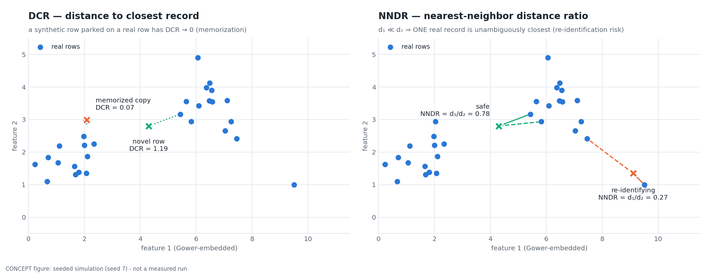

*CONCEPT figure (hand-placed geometry with seed 7; not a measurement of a
run).* *Intuition:* a near-zero distance to a real row is a copy. A row
that is not especially close to anything, but much closer to one record
than to the next, singles that record out. *Formally:* with the Gower
distance d ([Gower 1971][gower1971]), `DCR(y) = min_x d(y, x)` and
`NNDR(y) = d_1(y)/d_2(y)`; numeric features are compared on the source's
rank scale, in the spirit of [Podani 1999][podani1999], and a categorical
feature matches only on the identical value. NNDR follows the singling-out
reading of [Giomi et al. 2023][giomi2023]. *Code:*
`stats/privacy.py::GowerSpace`, `gower_knn`; `row.dcr_p5_ratio` and
`row.nndr_p5_ratio` divide the synthetic side's 5th percentile by the
holdout's.

**Claim (R87):** a copy fraction f moves the closer-to-reference share by
only f/2, so the share fails only when a large part of the table is copied.

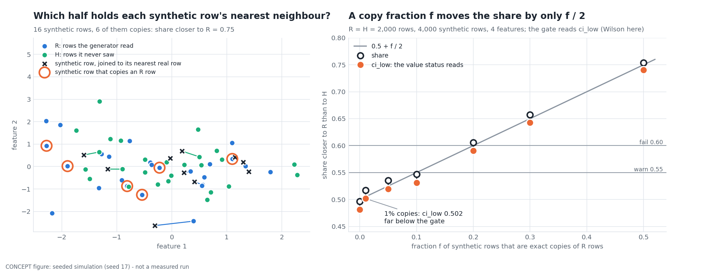

*CONCEPT figure (seeded simulation, seed 17; not a measurement of a run).*
*Intuition:* ask of each synthetic row whether its nearest real row is one
the generator read or one it never saw. With no memorization it is a coin
flip. A copied row always answers "read", but the rest still flip the
coin, so 1 % of copies moves the share from 0.500 to 0.505.
*Formally:* `share = mean(1[d_R < d_H] + ½·1[d_R = d_H])` on equal-size R
and H ([Platzer & Reutterer 2021][platzer2021]); with a fraction f of exact
copies the expectation is `½ + f/2`. Status reads the lower confidence
bound. *Code:* `stats/privacy.py`, `beam/privacy.py::_PrivacyEmitFn`.

Pitfalls:

- **The share is blunt by design.** A small number of copies cannot fail
  it. Exact copies are the job of the exact-match rates and the lifts,
  which fail on a 1 % copy in the acceptance run where the share does not.
- **One heavy copied cluster looks like split noise.** The interval is the
  larger of the Wilson interval and a permutation interval over the R/H
  split, which accounts for rows repeated many times. A single record
  copied thousands of times widens that interval instead of moving the
  bound, so the share cannot tell it from an unlucky split. The exact-copy
  metrics own that case too.
- **The permutation interval is conservative on lattice tables.** When
  many rows sit at exactly the same distance (a table of few categorical
  columns), all tied mass on a side is credited to one nearest row. The
  interval is then wider than the truth: fewer false alarms, less power on
  categorical-only tables.
- **A heavy key can be under-sampled.** The privacy sample is a bottom-k
  sample of distinct keys with each key's exact multiplicity
  ([Cohen & Kaplan 2007][cohenkaplan2007]). Every key is equally likely to
  be held, whatever its weight, so when a side has more distinct keys than
  k, a key that holds a large share of the rows may be left out.
  `detail.sample_short` marks a sample that holds fewer keys than asked.

Density and coverage ([Naeem et al. 2020][naeem2020]) use k = 5 at equal
sample sizes; coverage reads about `1 − 2⁻ᵏ`, not 1, for identical
distributions. They draw their rows by systematic sampling over the held
keys ([Madow 1949][madow1949]) so that a table of repeated rows is not
read as a few heavy clusters (R85).

#### Detection

**Claim:** an AUC is read with its interval against 0.5, never alone.

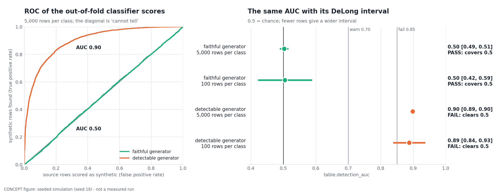

*CONCEPT figure (seeded simulation of classifier scores, seed 18; not a
measurement of a run, and no classifier is trained for it).* *Intuition:*
train a model to tell synthetic rows from source rows. If it cannot, the
tables are alike. With few rows a model can look good or bad by luck, and
the interval shows how much. *Formally:* the classifier two-sample test of
[Lopez-Paz & Oquab 2017][lopezpaz2017]; the metric is the out-of-fold ROC
AUC, with the interval of [DeLong, DeLong & Clarke-Pearson 1988][delong1988]
computed from midranks ([Sun & Xu 2014][sunxu2014]). *Code:*
`stats/detection.py::c2st_auc`, `featurize`; `beam/privacy.py::_DetectionFn`.

Keys are never features: they differ between the tables by construction.
An AUC under 0.5 is noise, not "more real than real", and a flexible
classifier also finds harmless artifacts such as rounding. Rows flagged
`detectable` are written only when the AUC reaches the warn threshold and
its interval clears 0.5. Detection draws a simple random sample of rows
rather than the systematic one, because exactly balanced duplicates score
below chance under cross-validation (R86).

`table.pmse_ratio` is the propensity mean squared error of
[Woo et al. 2009][woo2009] over its null expectation, in the manner of
[Snoke et al. 2018][snoke2018], with one change: the expectation used is
`E0 = (k−1)·c·(1−c)/N`, the null for two independent samples, not the
expression for synthetic rows drawn from the source sample itself, which
would put a perfect generator at 2 here (R31). The ratio cannot exceed
`N/(k−1)`; when that ceiling is below the fail threshold the metric is
`not_evaluated` rather than passed (R33).

### 4.8 Relational metrics

**Claim:** an equal mean fan-out can hide a wrong shape, so the catalogue
gates the distribution of children per parent and the mean separately.

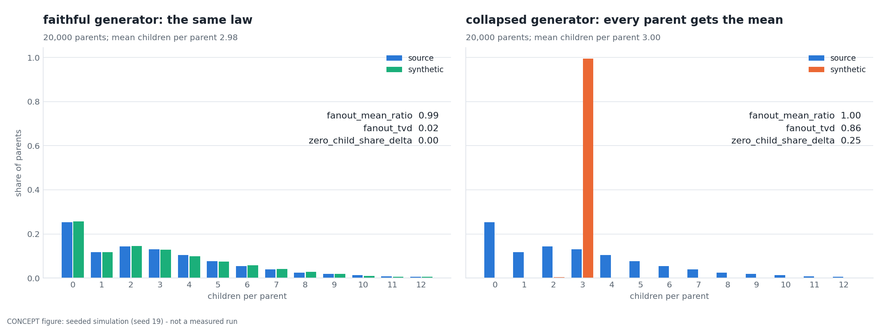

*CONCEPT figure (seeded simulation, seed 19; not a measurement of a run).*
*Intuition:* if every order gets exactly three items, the average is right
and the table is wrong: no order is empty, none is large. *Formally:*
`relationship.fanout_tvd` is the total variation between the two
distributions of children per parent, one bin per count from 0 to 49 and
one for 50 or more; parent-child cardinality as a generation target is
from [Patki, Wedge & Veeramachaneni 2016][patki2016]. *Code:*
`stats/relational.py::fanout_metrics`, `beam/relational.py`.

Rules a reader needs:

- **Key columns of one type family (R113).** Key tuples are compared by
  the hash of their canonical values, and an `INT64` 5, a `NUMERIC` 5 and a
  `FLOAT64` 5 have different canonical forms. An edge whose child column
  and referenced column are of different type families (integer, decimal,
  float, string, …) would read every child as an orphan on both sides, so
  every metric of that edge is `not_evaluated` with a reason naming both
  columns and their types. Cast one side, or correct the relationship
  model.
- **The mean ratio is a ratio of row counts (R82).**
  `fanout_mean_ratio = (n_child/n_parent)_syn / (n_child/n_parent)_src`,
  where n_child is every child row read, matched, orphaned or with a NULL
  key, and n_parent every parent row read. It answers "is the child table
  the right size for its parents?". The histogram, the TVD and the W1
  distance are over matched children per distinct parent key. The two can
  disagree, on purpose: a source in which a quarter of the orders have no
  user (guest checkouts) against a synthetic side with none still scores a
  mean ratio of 1 if the row counts agree. When only one parent side is a
  row sample, or the two are sampled at different rates, the mean ratio is
  not evaluated.
- **Orphans follow SQL's `MATCH SIMPLE`.** A child tuple with a NULL part
  is counted, never joined, and is never an orphan. A generator that nulls
  every foreign key scores an orphan rate of 0; `column.null_rate_delta`
  on the key columns catches that.
- **Documented edges.** On an edge the model declares but does not enforce,
  `relationship.orphan_rate` is information, compared with the source's own
  orphan rate; the fan-out metrics stay graded (R42).
- **Fewer than 10 parents.** When either side holds fewer than 10 distinct
  parent keys, every fan-out metric is `not_evaluated` and no mean or count
  is published: a fan-out over a handful of parents is theirs (R83). The
  orphan rate stays evaluated, because an integrity verdict must exist for
  every edge. **Pitfall:** its rate and n still give the matched total,
  which below 10 parents is those parents' summed fan-out. That one sum is
  accepted for the sake of the integrity gate; nothing per parent is
  revealed.
- **A missing source twin.** A read-only parent with no source table leaves
  only the metrics that need the source side unevaluated; the synthetic
  orphan rate is still measured against the parent's landing table (R84).

### 4.9 What the outputs may reveal

The evaluation tables describe the source. Three rules bound what they can
say about any one record, and the channels they leave open are listed at
the end of this section.

**Literals (D6).** A top-k label is the value itself only when the column's
source top list covers every non-NULL row with at most 50 values, each
counted at least 10 times, and the value is one of them. Everything else,
every value only the synthetic side holds included, is `h:<8 hex>`.

**The label key.** A plain hash of a low-entropy value can be reversed by
enumeration, so labels and the source keys of row flags are keyed hashes
(keyed BLAKE2b). **One panel per mode of `--label_key_uri`:**

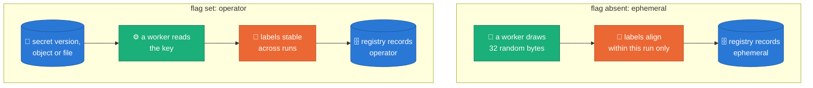
```mermaid
flowchart TB
  classDef beam  fill:#eb6834,color:#fff,stroke:#b44f26
  classDef cpu   fill:#1baf7a,color:#fff,stroke:#127a55
  classDef store fill:#2a78d6,color:#fff,stroke:#1d5599
  classDef data  fill:#6b7280,color:#fff,stroke:#4b5563
  subgraph EPH["flag absent: ephemeral"]
    E1["🎲 a worker draws<br/>32 random bytes"]:::cpu --> E2["🔀 labels align<br/>within this run only"]:::beam --> E3[("🗄️ registry records<br/>ephemeral")]:::store
  end
  subgraph OPE["flag set: operator"]
    O1[("📄 secret version,<br/>object or file")]:::store --> O2["⚙️ a worker reads<br/>the key"]:::cpu --> O3["🔀 labels stable<br/>across runs"]:::beam --> O4[("🗄️ registry records<br/>operator")]:::store
  end
```

In both modes only the URI enters the job graph; the key is resolved on a
worker and passed to the transforms as a side input. A key given to a
transform's constructor would be pickled into the graph, where anyone who
can read the job could recover it (R68). For the same reason the
experiment `enable_data_sampling` is refused: it would sample the key into
the monitoring interface. The registry records the mode, never the key or
its URI.

**The count rule.** An exact minimum or maximum is one record's value.

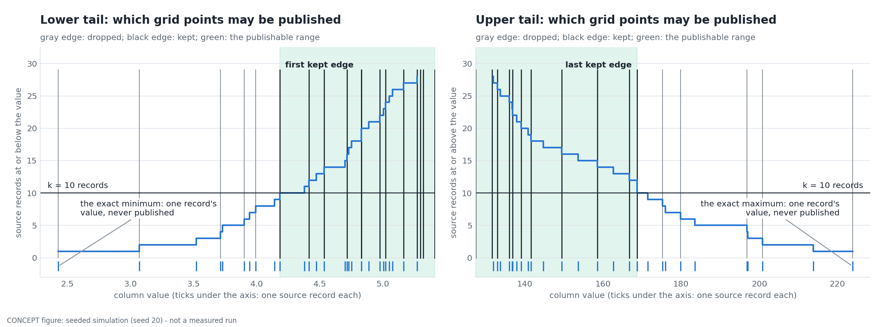

*CONCEPT figure (seeded simulation, seed 20; not a measurement of a run).*
*Intuition:* the outermost points of a quantile grid sit on single
records. A point is safe to show only when a crowd of records lies on each
side of it, and two shown points are safe together only when a crowd lies
between them. *Formally:* an edge e is kept if and only if at least k = 10
source records satisfy `x ≤ e` and at least k satisfy `x ≥ e`; both counts
are monotone in e, so the kept edges form one contiguous range, and a
quantile outside it is withheld, never clamped to the nearest kept edge.
The threshold is the k of k-anonymity ([Sweeney 2002][sweeney2002]) that
the repository already uses for rare values. *Code:* `beam/dense.py`
(`RARE_COUNT`, the right- and left-closed counts), `beam/census.py`.

**What is published, exactly (R113, R116).** The kept range says where a
value may be shown. Inside it, everything the persisted profiles of one
column publish that is an exact source value (the histogram edges, the
quantile values of the source, reference and holdout sides, and the pair
axis's labels) comes from one set, the published histogram edges, and no
two of those are closer than k source records apart:

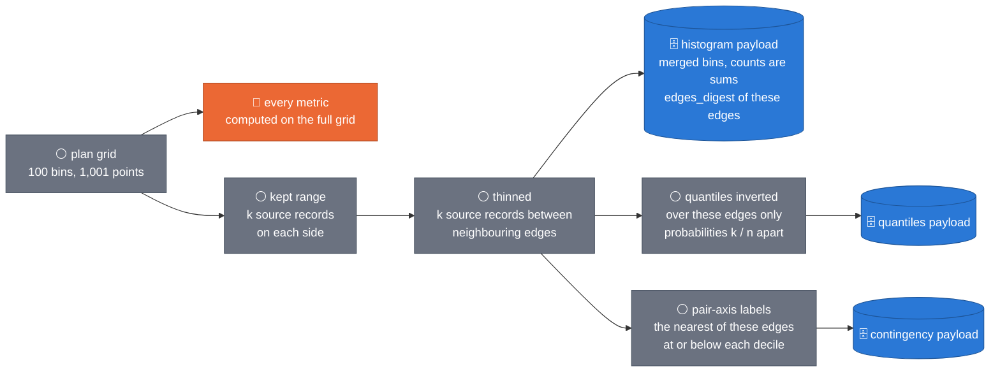
```mermaid
flowchart LR
  classDef beam  fill:#eb6834,color:#fff,stroke:#b44f26
  classDef data  fill:#6b7280,color:#fff,stroke:#4b5563
  classDef store fill:#2a78d6,color:#fff,stroke:#1d5599
  G["⚪ plan grid<br/>100 bins, 1,001 points"]:::data --> M["🔀 every metric<br/>computed on the full grid"]:::beam
  G --> K["⚪ kept range<br/>k source records<br/>on each side"]:::data
  K --> T["⚪ thinned<br/>k source records between<br/>neighbouring edges"]:::data
  T --> H[("🗄️ histogram payload<br/>merged bins, counts are sums<br/>edges_digest of these edges")]:::store
  T --> Q["⚪ quantiles inverted<br/>over these edges only<br/>probabilities k / n apart"]:::data --> P[("🗄️ quantiles payload")]:::store
  T --> X["⚪ pair-axis labels<br/>the nearest of these edges<br/>at or below each decile"]:::data --> C[("🗄️ contingency payload")]:::store
```

- **Histogram edges.** Going up from the first kept edge, an edge is
  published only once at least k source records lie in the bin since the
  last published one. A dropped edge's two bins merge, so every side's
  counts stay sums over the same edges, and `edges_digest` is the digest
  of the edges published.
- **Pair axes.** Each decile cut a contingency axis shows is labelled with
  the nearest published histogram edge at or below it; two cuts on one edge
  keep the lower, and cuts are k source records apart, so a small column
  gets a coarser axis. The cell counts are the decile's, so a label may name
  an edge up to one bin below its cut.
- **Quantiles.** A side publishes a probability p only when `p · n ≥ k`,
  `(1 − p) · n ≥ k` and p is at least `k / n` above the last published
  one, with n the side's own count; its value is inverted over the
  published histogram edges, on every side alike (the synthetic one
  included). From 1,000 values on, all 99 percentiles pass this rule. A
  value interpolated inside a bin is computed from published edges and
  counts; it can equal a source record only by chance, and reveals none.
  The `below_mass` and `above_mass` of a quantiles payload are the shares
  outside the published edges.
- **Not in the set.** The p0.5 and p99.5 bounds of a histogram payload
  (published from 2,000 values on) are interpolated over the kept union
  edges: each is at least k records from the end of the column (R69), and
  not necessarily k from a published edge.

The thinning is a publication step only: no metric reads it. On a column
of a few hundred rows the plan's grid points are single source records one
or two apart, so without it the payloads list most of the column:

| Source rows | Histogram edges before | Histogram edges now | Fewest source records between two edges, before → now | Quantile probabilities (source side) before → now |
| ---: | ---: | ---: | --- | --- |
| 120 | 85 (71 % of the column's values) | 11 (9 %) | 1 → 10 | 83 → 10 |
| 795 | 97 | 49 | 7 → 15 | 97 → 49 |
| 2,000 | 99 | 99 | 19 → 19 | 99 → 99 |

Taken across payloads (R116), the exact source records one column
publishes (edges, the exact values among the source, reference and holdout
quantiles, and the records nearest the pair-axis labels) were, on the same
invented columns:

| Source rows | Records published before the union rule | Records now | Fewest source records between two of them, before → now |
| ---: | ---: | ---: | --- |
| 120 | 29 (24 %) | 11 (9 %) | 1 → 10 |
| 795 | 77 | 49 | 1 → 15 |
| 2,000 | 166 | 99 | 1 → 19 |

*Worked example on invented data (seeded lognormal values; not a
measurement of a run). The 120- and 795-row rows of the first table are
pinned by
`tests/beam/test_dense.py::test_small_columns_publish_grid_values_k_source_records_apart`,
its 2,000-row row by `test_a_large_column_is_published_as_before`, and the
second table by
`test_one_column_publishes_one_k_spaced_set_of_source_values`.*

The rule was reached in steps, each closing a channel the previous one
left open:

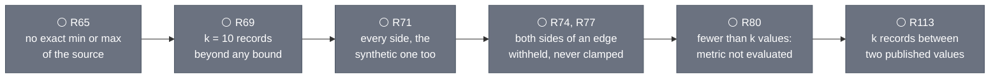
```mermaid
flowchart LR
  classDef data fill:#6b7280,color:#fff,stroke:#4b5563
  A["⚪ R65<br/>no exact min or max<br/>of the source"]:::data --> B["⚪ R69<br/>k = 10 records<br/>beyond any bound"]:::data --> C["⚪ R71<br/>every side, the<br/>synthetic one too"]:::data --> D["⚪ R74, R77<br/>both sides of an edge<br/>withheld, never clamped"]:::data --> E["⚪ R80<br/>fewer than k values:<br/>metric not evaluated"]:::data --> F["⚪ R113<br/>k records between<br/>two published values"]:::data
```

| Step | What it closed |
| --- | --- |
| R65 | An exact source extreme in a payload is a single record's literal value. Payloads carry the p0.5 and p99.5 bounds instead; range metrics still use the extremes internally |
| R69 | A bound, an end edge or a tail quantile is itself close to an extreme on a small column. It is published only with at least 10 records at or beyond it |
| R71 | A generator that clamps to the source range publishes the source extreme through the **synthetic** side. Every side gets the same treatment |
| R74, R77 | Which edges are kept depends only on publishable counts, never on a value or on which grid contributed the edge. The rule is symmetric, and each payload carries `below_mass` and `above_mass` so a reader still sees how much lies outside. A side with fewer than 10 values has its moments withheld: a handful of values is determined by them |
| R80 | A metric's value together with the synthetic side's published moments would give back the source's mean and deviation. `column.smd` and `column.std_ratio` are not evaluated when either side holds fewer than 10 values |
| R113 | Inside the kept range the grid of a small column is still one record to a point: a 120-row column published 85 of its 120 values as histogram edges. Published edges are at least 10 source records apart, and quantile probabilities at least 10 of the side's records apart |
| R116 | Each payload was k apart on its own, not together: at 120 rows the edges, the source quantile values and the pair-axis labels published 29 records, every neighbour gap below k. The quantile values and the labels now come from the published edges, so one column publishes one set |

**Accepted channels.** Four channels are accepted and documented.

1. **The range adherence count.** The adherent count of
   `field.range_adherence` can pin a source extreme when values are dense
   integers.
2. **The cardinality adherence count.** The adherent count of
   `relationship.cardinality_adherence` can pin the source's smallest or
   largest fan-out in the same way (§4.8).
3. **Row flag keys.** Row flags carry keys only, never an attribute value:
   the synthetic row's own key, and a keyed hash of the matched source
   record's key (`source_key` is always NULL). The synthetic key is the
   synthetic table's own key in clear, not hashed, so for a whole-row copy
   (keys included) it is the copied source row's key in clear.
4. **The reference panel travels in the job graph (R113).** The R and H
   rows of every table, up to 2n source rows in clear, are read on the
   driver and embedded in the pipeline (`beam.Create` in `beam/io.py`);
   the panel inputs of the privacy pass travel the same way. Whoever can
   read the Dataflow job can read them, and with the `upload_graph`
   experiment the graph is also an object under the job's staging
   location. Restrict that bucket to the evaluator's service account and
   its operators and give it a lifecycle rule; see
   [`DEPLOYMENT_PREREQUISITES.md`](../DEPLOYMENT_PREREQUISITES.md).

**Counts below k, by design.** The count rule governs which grid VALUES
are published. These payloads and rows still store a count that can be
below k = 10, and are kept:

| Where | What is stored | Why it is kept |
| --- | --- | --- |
| `topk` items | the count of a value shown under a keyed hash label | the label hides the value (D6); a literal label needs at least 10 source rows |
| `null_patterns` | the count of each pattern of NULL columns | a pattern names columns, never a value |
| `contingency` cells | the count of each cell of two binned or hashed axes | the axes are published under the rules above; a cell locates no record on its own |
| `length_hist` | the count at every string length; its two ends are the column's exact minimum and maximum length | a length is not a value; the ends are stated here as a known exception to the extremes rule |
| histogram bins of the panel and synthetic sides | each side's own count in a bin of at least 10 source records | the edges are the source's; a side's count says how many of ITS rows fall there |
| `column.null_rate_delta`, `column.empty_rate_delta`, `column.zero_rate_delta` | a rate and its n, so rate × n is the count of NULL, empty or zero cells | the count names no row and no value other than NULL, empty or zero |
| `temporal_mix` | the count of rows in each weekday, month and hour | a calendar part is not a record's value; the counts are of a small closed set |
| `shape_mix` | the count of each shape item on each side | a mask with fewer than 10 source rows is shown under a keyed hash label, so the count names no pattern; a shape is a pattern of character classes, not a value |
| histogram and quantiles payloads | `below_mass` and `above_mass`, so × n is the count of values outside the published edges | the share names no value; it says how much lies beyond the published range |

### 4.10 The catalogue

Generated from `catalogue/metrics.yaml` by
`scripts/doc/render_eval_catalogue.py`; `--check` runs in CI. How to read
the columns: `direction` and the thresholds are as the YAML states them
(for `lower_better`, WARN at `value ≥ warn`; for `higher_better`, at
`value ≤ warn`; for `target`, on the distance from the target; warn and
fail both 0 means any value above 0 fails). Flags: `matched n` = computed
at matched sample size; `baseline` = the row stores `baseline_value`; `CI
bound` = status and score read the confidence bound instead of the value.

<!-- eval-catalogue:start -->
<!-- Generated by scripts/doc/render_eval_catalogue.py from packages/sdfb-evaluation/src/sdfb_evaluation/catalogue/metrics.yaml. Do not edit: change the YAML and run the script. -->

Metric catalogue `1.0.0`: 79 metrics over 7 levels and 5 families.

| level | fidelity | privacy | integrity | diversity | overall | total |
| --- | --- | --- | --- | --- | --- | --- |
| field | 3 | 3 | 1 | — | — | 7 |
| column | 19 | — | 1 | 7 | — | 27 |
| pair | 5 | — | — | — | — | 5 |
| row | 2 | 9 | — | 2 | — | 13 |
| table | 7 | 1 | 4 | 1 | 1 | 14 |
| relationship | 5 | — | 2 | 1 | — | 8 |
| model | 1 | 1 | 1 | 1 | 1 | 5 |
| **total** | 42 | 14 | 9 | 12 | 2 | 79 |

#### field (7)

| metric | family | kinds | formula | estimator | direction | target | warn | fail | score | noise floor | flags |
| --- | --- | --- | --- | --- | --- | --- | --- | --- | --- | --- | --- |
| `field.category_adherence`<br/>Category adherence | fidelity | categorical, boolean | $`\operatorname{CA} = \frac{1}{\lvert Y \rvert} \sum_{y \in Y} \mathbf{1}\left[ y \in \mathcal{D}_{src} \right]`$ | exact/value_sampled | higher_better | 1 | 0.99 | 0.95 | linear | wilson | — |
| `field.range_adherence`<br/>Range adherence | fidelity | numeric, temporal | $`\operatorname{RA} = \frac{1}{\lvert Y \rvert} \sum_{y \in Y} \mathbf{1}\left[ \min_{src} \le y \le \max_{src} \right]`$ | binned | higher_better | 1 | 0.99 | 0.95 | linear | wilson | — |
| `field.shape_adherence`<br/>Shape (mask) adherence | fidelity | text, identifier | $`\operatorname{SA} = \frac{1}{\lvert Y \rvert} \sum_{y \in Y} \mathbf{1}\left[ \operatorname{mask}(y) \in H_{src} \cup T_{src} \right]`$ | exact | higher_better | 1 | 0.95 | 0.8 | linear | wilson | baseline |
| `field.substantive_copy_rate`<br/>Substantive copy rate | privacy | categorical, text, identifier, numeric, temporal | $`\operatorname{SCR} = \frac{1}{\lvert Y_{sub} \rvert} \sum_{y \in Y_{sub}} \mathbf{1}\left[ 1 \le c_{src}(y) < 10 \right]`$ | exact/value_sampled | lower_better | — | 0.0001 | 0.001 | linear | wilson | — |
| `field.value_memorization_lift`<br/>Value memorization lift (reference vs holdout) | privacy | categorical, text, identifier, numeric, temporal | $`\operatorname{lift} = \frac{m_R / \lvert V_R \rvert}{m_H / \lvert V_H \rvert}, \quad \text{CI at } \alpha / m`$ | exact/value_sampled | lower_better | 1 | 2 | 5 | linear | rate_ratio | CI bound |
| `field.pool_memorization_lift`<br/>Pool memorization lift (LLM free-text pools) | privacy | text | $`\operatorname{lift}_{pool} = \frac{m_R / \lvert V_R \rvert}{m_H / \lvert V_H \rvert}, \quad m_S = \lvert P \cap V_S \rvert`$ | exact/value_sampled | lower_better | 1 | 2 | 5 | linear | rate_ratio | CI bound |
| `field.type_validity`<br/>Type validity | integrity | numeric, temporal, categorical, boolean, text, identifier, nested | $`\operatorname{TV} = \frac{1}{\lvert Y \rvert} \sum_{y \in Y} \mathbf{1}\left[ y \text{ parses as the declared type} \right]`$ | exact | higher_better | — | 0.9999 | 0.999 | linear | — | — |

#### column (27)

| metric | family | kinds | formula | estimator | direction | target | warn | fail | score | noise floor | flags |
| --- | --- | --- | --- | --- | --- | --- | --- | --- | --- | --- | --- |
| `column.null_rate_delta`<br/>Null-rate difference | fidelity | numeric, temporal, categorical, boolean, text, identifier, nested | $`\Delta_{null} = \lvert p^{syn}_{null} - p^{src}_{null} \rvert`$ | exact | lower_better | — | 0.02 | 0.05 | linear | newcombe | baseline |
| `column.empty_rate_delta`<br/>Empty-string-rate difference | fidelity | categorical, text, identifier | $`\Delta_{empty} = \lvert p^{syn}_{empty} - p^{src}_{empty} \rvert`$ | exact | lower_better | — | 0.02 | 0.05 | linear | newcombe | baseline |
| `column.ks`<br/>Kolmogorov–Smirnov distance (exact at bin edges) | fidelity | numeric, temporal | $`D_{lo} = \max_i \lvert F_{src}(e_i) - F_{syn}(e_i) \rvert`$ | binned | lower_better | — | 0.1 | 0.2 | complement | ks_two_sample | baseline |
| `column.pit_w1`<br/>PIT Wasserstein-1 (scale-free) | fidelity | numeric, temporal | $`W_1^{PIT} = \int \lvert F_{syn}(x) - F_{src}(x) \rvert \, dF_{src}(x) \in \left[ 0, \frac{1}{2} \right]`$ | binned | lower_better | — | 0.05 | 0.1 | linear | — | baseline |
| `column.wasserstein`<br/>Wasserstein-1 distance (column units) | fidelity | numeric, temporal | $`W_1 = \int_{-\infty}^{\infty} \lvert F_{syn}(x) - F_{src}(x) \rvert \, dx`$ | binned | lower_better | — | — | — | none | — | baseline |
| `column.decile_ks_legacy`<br/>Decile KS (legacy, for continuity) | fidelity | numeric | $`D_{dec} = \max_{x \in G} \lvert \tilde{F}_{src}(x) - \tilde{F}_{syn}(x) \rvert, \quad G = Q^{src}_{0..10} \cup Q^{syn}_{0..10}`$ | binned | lower_better | — | 0.2 | 0.4 | complement | — | baseline |
| `column.jsd`<br/>Jensen–Shannon divergence (bits) | fidelity | numeric, temporal, categorical, boolean | $`\operatorname{JSD}(p, q) = \frac{1}{2} \sum_k p_k \log_2 \frac{p_k}{m_k} + \frac{1}{2} \sum_k q_k \log_2 \frac{q_k}{m_k}, \quad m = \frac{p + q}{2}`$ | exact/binned/value_sampled | lower_better | — | 0.05 | 0.1 | linear | jsd_null | baseline |
| `column.tvd`<br/>Total variation distance (categories) | fidelity | categorical, boolean | $`\operatorname{TVD}(p, q) = 1 - \sum_k \min(p_k, q_k) = \frac{1}{2} \sum_k \lvert p_k - q_k \rvert`$ | exact/value_sampled | lower_better | — | 0.1 | 0.2 | complement | tvd_null | baseline |
| `column.psi`<br/>Population stability index (deciles) | fidelity | numeric, temporal | $`\operatorname{PSI} = \sum_{b=1}^{B} (q_b - p_b) \ln \frac{q_b}{p_b}, \quad p_b = \frac{c^{src}_b + 0.5}{n_{src} + 0.5 B}`$ | binned | lower_better | — | 0.1 | 0.25 | linear | — | baseline |
| `column.smd`<br/>Standardized mean difference | fidelity | numeric, temporal | $`\operatorname{SMD} = \frac{\lvert \mu_{syn} - \mu_{src} \rvert}{\sigma_{src}}`$ | exact | lower_better | — | 0.1 | 0.2 | linear | — | baseline |
| `column.std_ratio`<br/>Standard-deviation ratio | fidelity | numeric, temporal | $`\operatorname{SR} = \frac{\sigma_{syn}}{\sigma_{src}}`$ | exact | target | 1 | 0.1 | 0.25 | ratio_to_one | — | baseline |
| `column.zero_rate_delta`<br/>Zero-rate difference | fidelity | numeric | $`\Delta_{0} = \lvert p^{syn}_{0} - p^{src}_{0} \rvert`$ | exact | lower_better | — | 0.02 | 0.05 | linear | newcombe | baseline |
| `column.range_coverage`<br/>Range coverage | diversity | numeric, temporal | $`\operatorname{RC} = \frac{\max\left(0, \min(M_{syn}, M_{src}) - \max(m_{syn}, m_{src})\right)}{M_{src} - m_{src}}`$ | binned | higher_better | — | 0.9 | 0.75 | linear | — | baseline |
| `column.dow_tvd`<br/>Day-of-week mix (TVD) | fidelity | temporal | $`\operatorname{TVD}_{dow} = \frac{1}{2} \sum_{d=1}^{7} \lvert p_d - q_d \rvert`$ | exact | lower_better | — | 0.1 | 0.2 | complement | tvd_null | baseline |
| `column.month_tvd`<br/>Month-of-year mix (TVD) | fidelity | temporal | $`\operatorname{TVD}_{month} = \frac{1}{2} \sum_{k=1}^{12} \lvert p_k - q_k \rvert`$ | exact | lower_better | — | 0.1 | 0.2 | complement | tvd_null | baseline |
| `column.hour_tvd`<br/>Hour-of-day mix (TVD) | fidelity | temporal | $`\operatorname{TVD}_{hour} = \frac{1}{2} \sum_{h=0}^{23} \lvert p_h - q_h \rvert`$ | exact | lower_better | — | 0.1 | 0.2 | complement | tvd_null | baseline |
| `column.cohens_w`<br/>Cohen's w (category effect size) | fidelity | categorical, boolean | $`w = \sqrt{\sum_{k : p_k > 0} \frac{(q_k - p_k)^2}{p_k}}`$ | exact/value_sampled | lower_better | — | 0.1 | 0.3 | linear | — | baseline |
| `column.top1_share_delta`<br/>Top-value share difference | diversity | categorical, boolean | $`\Delta_{top1} = \lvert \max_k q_k - \max_k p_k \rvert`$ | exact/value_sampled | lower_better | — | 0.05 | 0.15 | linear | newcombe | baseline |
| `column.coverage_mass`<br/>Coverage mass | diversity | categorical, boolean | $`\operatorname{Cov} = \sum_{v \in S \cap Y} p_v`$ | exact/value_sampled | higher_better | — | 0.95 | 0.8 | linear | — | baseline |
| `column.novelty_mass`<br/>Novelty mass vs the source's unseen mass | diversity | categorical, text, identifier | $`\nu_{syn} = \sum_{v \notin S} q_v, \quad t = \hat{\nu}_{src} = \frac{f_1}{N}, \quad d = \lvert \nu_{syn} - t \rvert`$ | exact/value_sampled | target | source value | 0.1 | 0.25 | ratio_to_one | — | — |
| `column.entropy_ratio`<br/>Entropy ratio at matched n | diversity | categorical, boolean, text, identifier | $`\operatorname{ER} = \frac{\hat{H}^{(m)}_{syn}}{\hat{H}^{(m)}_{src}}, \quad \hat{H}^{(m)} = -\sum_v \frac{c_v}{m} \log_2 \frac{c_v}{m}`$ | exact/value_sampled | target | 1 | 0.1 | 0.25 | ratio_to_one | — | matched n, baseline |
| `column.distinct_ratio`<br/>Distinct-count ratio at matched n | diversity | categorical, text, identifier | $`\operatorname{DR} = \frac{K^{(m)}_{syn}}{K^{(m)}_{src}}`$ | exact/value_sampled | target | 1 | 0.1 | 0.3 | ratio_to_one | — | matched n, baseline |
| `column.distinct_ceiling_hit`<br/>Distinct-count ceiling hit (pool cap) | diversity | text | $`\operatorname{hit} = \mathbf{1}\left[ K_{syn} \in \{ 512, K_{target} \} \right]`$ | exact | lower_better | — | 0.5 | 1 | none | — | — |
| `column.length_ks`<br/>String-length KS | fidelity | categorical, text, identifier | $`D_{len} = \max_{\ell} \lvert F^{len}_{src}(\ell) - F^{len}_{syn}(\ell) \rvert`$ | binned | lower_better | — | 0.1 | 0.2 | complement | ks_two_sample | baseline |
| `column.shape_head_tv`<br/>Shape head total variation | fidelity | text, identifier | $`\operatorname{TV}_{head} = \frac{1}{2} \left( \sum_{s \in H_{src}} \lvert p_s - q_s \rvert + \lvert p_{tail} - q_{tail} \rvert \right)`$ | exact | lower_better | — | 0.1 | 0.2 | complement | tvd_null | baseline |
| `column.char_class_l1`<br/>Character-class profile distance | fidelity | categorical, text, identifier | $`L_1 = \sum_{k \in K} \lvert f^{syn}_k - f^{src}_k \rvert, \quad K = \{ \text{digit}, \text{upper}, \text{lower}, \text{space}, \text{punct} \}`$ | exact | lower_better | — | 0.1 | 0.2 | linear | — | baseline |
| `column.source_stats_drift`<br/>Source-stats drift (evaluator vs generator) | integrity | numeric, temporal, categorical, boolean, text, identifier | $`\delta = \max\left( \lvert \Delta p_{null} \rvert,\, \max_{i=1}^{9} \operatorname{dist}\left( \frac{i}{10}, \left[ F^{-}_{src}(d_i), F_{src}(d_i) \right] \right),\, \frac{\lvert D_{gen} - D_{src} \rvert}{\max(D_{gen}, D_{src})} \right)`$ | exact | lower_better | — | 0.05 | 0.15 | none | — | — |

#### pair (5)

| metric | family | kinds | formula | estimator | direction | target | warn | fail | score | noise floor | flags |
| --- | --- | --- | --- | --- | --- | --- | --- | --- | --- | --- | --- |
| `pair.pearson_delta`<br/>Pearson correlation difference | fidelity | numeric, temporal | $`\Delta\rho = \lvert \rho_{src} - \rho_{syn} \rvert`$ | exact | lower_better | — | 0.1 | 0.2 | linear | fisher_z | baseline |
| `pair.spearman_delta`<br/>Spearman rank-correlation difference | fidelity | numeric, temporal | $`\Delta\rho^S = \lvert \rho^S_{src} - \rho^S_{syn} \rvert, \quad \rho^S = \operatorname{corr}\left( F_X(x), F_Y(y) \right)`$ | binned | lower_better | — | 0.1 | 0.2 | linear | fisher_z | baseline |
| `pair.cramers_v_delta`<br/>Cramér's V difference (bias-corrected) | fidelity | categorical, boolean, numeric, temporal | $`\Delta\tilde{V} = \lvert \tilde{V}_{src} - \tilde{V}_{syn} \rvert, \quad \tilde{V} = \sqrt{\frac{\tilde{\varphi}^2}{\min(\tilde{k} - 1, \tilde{r} - 1)}}, \quad \tilde{\varphi}^2 = \max\left(0, \frac{\chi^2}{n} - \frac{(k-1)(r-1)}{n-1}\right), \quad \tilde{k} = k - \frac{(k-1)^2}{n-1}, \quad \tilde{r} = r - \frac{(r-1)^2}{n-1}`$ | exact | lower_better | — | 0.1 | 0.2 | linear | — | baseline |
| `pair.nmi_delta`<br/>Normalized mutual information difference | fidelity | categorical, boolean, numeric, temporal | $`\Delta\operatorname{NMI} = \lvert \operatorname{NMI}_{src} - \operatorname{NMI}_{syn} \rvert, \quad \operatorname{NMI} = \frac{I(X; Y)}{\min(H_X, H_Y)}`$ | exact | lower_better | — | 0.05 | 0.15 | linear | mi_bias | baseline |
| `pair.contingency_tvd`<br/>Contingency-table total variation | fidelity | categorical, boolean, numeric, temporal | $`\operatorname{TVD}_{2D} = \frac{1}{2} \sum_{a, b} \lvert p_{ab} - q_{ab} \rvert`$ | exact | lower_better | — | 0.1 | 0.2 | complement | tvd_null | baseline |

#### row (13)

| metric | family | kinds | formula | estimator | direction | target | warn | fail | score | noise floor | flags |
| --- | --- | --- | --- | --- | --- | --- | --- | --- | --- | --- | --- |
| `row.exact_match_rate`<br/>Exact row match rate | privacy | — | $`\operatorname{EMR} = \frac{1}{n_{syn}} \sum_{i} \mathbf{1}\left[ h(y_i) \in h(\text{source}) \right]`$ | exact | lower_better | — | 1e-5 | 0.0001 | linear | wilson | — |
| `row.exact_match_rate_nonkey`<br/>Exact row match rate (keys excluded) | privacy | — | $`\operatorname{EMR}_{nk} = \frac{1}{n_{syn}} \sum_{i} \mathbf{1}\left[ h_{nk}(y_i) \in h_{nk}(\text{source}) \right]`$ | exact | lower_better | — | 0.001 | 0.01 | linear | wilson | — |
| `row.memorization_lift`<br/>Row memorization lift (reference vs holdout) | privacy | — | $`\operatorname{lift} = \frac{m_R / \lvert R \cap \bar{H} \rvert}{m_H / \lvert H \cap \bar{R} \rvert}, \quad m_S = \text{distinct exclusive records of } S \text{ the synthetic side reproduces}`$ | exact | lower_better | 1 | 2 | 5 | linear | rate_ratio | CI bound |
| `row.exposure_lift`<br/>Prompt-exposure lift | privacy | — | $`\operatorname{lift}_E = \frac{m_E / \lvert E \cap \bar{H} \rvert}{m_{H_E} / \lvert H_E \cap \bar{R} \rvert}, \quad m_S = \text{distinct exclusive records of } S \text{ reproduced}`$ | exact | lower_better | 1 | 2 | 5 | linear | rate_ratio | CI bound |
| `row.near_match_rate`<br/>Near-match rate (all but one column) | privacy | — | $`\operatorname{NMR} = \frac{1}{n_{syn}} \sum_i \mathbf{1}\left[ \exists x \in R, \exists j : h_{-j}(y_i) = h_{-j}(x) \text{ and } h_{nk}(y_i) \notin h_{nk}(R \cup H) \right]`$ | exact | lower_better | — | 0.001 | 0.01 | linear | wilson | — |
| `row.near_match_lift`<br/>Near-match lift (reference vs holdout) | privacy | — | $`\operatorname{lift}_{near} = \frac{m^{near}_R / \lvert L_R \cap \bar{L}_H \rvert}{m^{near}_H / \lvert L_H \cap \bar{L}_R \rvert}, \quad L_S = \text{leave-one-out keys of } S \text{, per column}`$ | exact | lower_better | 1 | 2 | 5 | linear | rate_ratio | CI bound |
| `row.internal_duplicate_excess`<br/>Internal duplicate excess | diversity | — | $`\Delta_{dup} = \frac{\operatorname{E}[D_m]_{syn} - \operatorname{E}[D_m]_{src}}{m}, \quad \operatorname{E}[D_m] = \sum_{c} f_c \left( \frac{c\,m}{N} - \Pr(X_c = 1) \right), \quad m = \min(n_{src}, n_{syn})`$ | exact | lower_better | — | 0.01 | 0.05 | linear | newcombe | matched n, baseline |
| `row.dcr_train_holdout_share`<br/>Closer-to-reference share (DCR holdout test) | privacy | — | $`\operatorname{share} = \frac{1}{n} \sum_i \left( \mathbf{1}\left[ d_R(y_i) < d_H(y_i) \right] + \frac{1}{2} \mathbf{1}\left[ d_R(y_i) = d_H(y_i) \right] \right)`$ | sample | lower_better | 0.5 | 0.55 | 0.6 | linear | wilson | matched n, CI bound |
| `row.dcr_p5_ratio`<br/>Distance to closest record, 5th-percentile ratio | privacy | — | $`\operatorname{DCR}_{p5} = \frac{Q_{0.05}\left( d(Y \to R) \right)}{Q_{0.05}\left( d(H \to R) \right)}`$ | sample | higher_better | — | 0.8 | 0.5 | linear | — | matched n |
| `row.nndr_p5_ratio`<br/>Nearest-neighbour distance ratio, 5th-percentile ratio | privacy | — | $`\operatorname{NNDR}_{p5} = \frac{Q_{0.05}\left( d_1 / d_2 \text{ of } Y \right)}{Q_{0.05}\left( d_1 / d_2 \text{ of } H \right)}`$ | sample | higher_better | — | 0.8 | 0.5 | linear | — | matched n |
| `row.density`<br/>Density (k-NN precision) | fidelity | — | $`\operatorname{density} = \frac{1}{k M} \sum_{j=1}^{M} \sum_{i=1}^{N} \mathbf{1}\left[ Y_j \in B\left( X_i, \operatorname{NND}_k(X_i) \right) \right]`$ | sample | target | 1 | 0.2 | 0.4 | ratio_to_one | — | matched n, baseline |
| `row.coverage`<br/>Coverage (k-NN recall) | diversity | — | $`\operatorname{coverage} = \frac{1}{N} \sum_{i=1}^{N} \mathbf{1}\left[ \exists j : Y_j \in B\left( X_i, \operatorname{NND}_k(X_i) \right) \right]`$ | sample | higher_better | — | 0.85 | 0.7 | linear | — | matched n, baseline |
| `row.null_pattern_tvd`<br/>Null-pattern total variation | fidelity | — | $`\operatorname{TVD}_{null} = \frac{1}{2} \sum_{b} \lvert p_b - q_b \rvert, \quad b \in \text{top-64 source patterns} \cup \{ \text{tail} \}`$ | exact | lower_better | — | 0.1 | 0.2 | complement | tvd_null | baseline |

#### table (14)

| metric | family | kinds | formula | estimator | direction | target | warn | fail | score | noise floor | flags |
| --- | --- | --- | --- | --- | --- | --- | --- | --- | --- | --- | --- |
| `table.row_count_ratio`<br/>Row-count ratio | integrity | — | $`\operatorname{RCR} = \frac{n_{syn}}{n_{expected}}`$ | exact | target | 1 | 0.01 | 0.05 | ratio_to_one | — | — |
| `table.pk_duplicate_rate`<br/>Primary-key duplicate rate | integrity | — | $`\operatorname{dup}_{pk} = \frac{1}{n_{syn}} \sum_i \mathbf{1}\left[ c\left( \operatorname{pk}(y_i) \right) \ge 2 \right]`$ | exact | lower_better | — | 0 | 0 | linear | — | — |
| `table.identity_duplicate_rate`<br/>Identity-column duplicate rate | integrity | — | $`\operatorname{dup}_{id} = \frac{1}{n_{syn}} \sum_i \mathbf{1}\left[ c\left( \operatorname{id}(y_i) \right) \ge 2 \right]`$ | exact | lower_better | — | 0 | 0 | linear | — | — |
| `table.detection_auc`<br/>Detection AUC (classifier two-sample test) | fidelity | — | $`\operatorname{AUC} = \Pr\left( \hat{s}(y) > \hat{s}(x) \right) + \frac{1}{2} \Pr\left( \hat{s}(y) = \hat{s}(x) \right)`$ | sample | lower_better | 0.5 | 0.7 | 0.85 | auc | delong | matched n, baseline |
| `table.pmse_ratio`<br/>Propensity MSE ratio | fidelity | — | $`\frac{\operatorname{pMSE}}{E_0}, \quad \operatorname{pMSE} = \frac{1}{N} \sum_{i=1}^{N} (\hat{\pi}_i - c)^2, \quad E_0 = \frac{(k-1)\, c\, (1-c)}{N}`$ | sample | lower_better | — | 3 | 10 | linear | — | matched n, baseline |
| `table.corr_rms_delta`<br/>Correlation-matrix RMS difference | fidelity | — | $`\operatorname{RMS}_{\Delta\rho} = \sqrt{\frac{2}{d(d-1)} \sum_{a < b} \left( \rho^{src}_{ab} - \rho^{syn}_{ab} \right)^2}`$ | exact | lower_better | — | 0.05 | 0.1 | linear | — | baseline |
| `table.corr_max_delta`<br/>Correlation-matrix maximum difference | fidelity | — | $`\max_{a < b} \lvert \rho^{src}_{ab} - \rho^{syn}_{ab} \rvert`$ | exact | lower_better | — | 0.15 | 0.3 | linear | — | baseline |
| `table.column_shape_score`<br/>Column shape score | fidelity | — | $`\operatorname{CSS} = \frac{1}{\lvert C \rvert} \sum_{c \in C} \bar{s}_c`$ | exact | higher_better | — | 0.85 | 0.7 | none | — | — |
| `table.pair_trend_score`<br/>Column pair trend score | fidelity | — | $`\operatorname{PTS} = \frac{1}{\lvert P \rvert} \sum_{(a, b) \in P} \bar{s}_{ab}`$ | exact | higher_better | — | 0.85 | 0.7 | none | — | — |
| `table.fidelity_score`<br/>Table fidelity score | fidelity | — | $`S_{fidelity} = \frac{1}{\lvert U_{f} \rvert} \sum_{u \in U_{f}} \bar{s}_{u}, \quad U_{f} = C \cup \{ P \} \cup M_{row} \cup M_{table} \cup E_{child}`$ | exact | higher_better | — | 0.85 | 0.7 | none | — | — |
| `table.privacy_score`<br/>Table privacy score | privacy | — | $`S_{privacy} = \frac{1}{\lvert U_{f} \rvert} \sum_{u \in U_{f}} \bar{s}_{u}, \quad U_{f} = C \cup \{ P \} \cup M_{row} \cup M_{table} \cup E_{child}`$ | exact | higher_better | — | 0.85 | 0.7 | none | — | — |
| `table.integrity_score`<br/>Table integrity score | integrity | — | $`S_{integrity} = \frac{1}{\lvert U_{f} \rvert} \sum_{u \in U_{f}} \bar{s}_{u}, \quad U_{f} = C \cup \{ P \} \cup M_{row} \cup M_{table} \cup E_{child}`$ | exact | higher_better | — | 0.85 | 0.7 | none | — | — |
| `table.diversity_score`<br/>Table diversity score | diversity | — | $`S_{diversity} = \frac{1}{\lvert U_{f} \rvert} \sum_{u \in U_{f}} \bar{s}_{u}, \quad U_{f} = C \cup \{ P \} \cup M_{row} \cup M_{table} \cup E_{child}`$ | exact | higher_better | — | 0.85 | 0.7 | none | — | — |
| `table.overall_score`<br/>Table overall score | overall | — | $`S_{overall} = \frac{1}{\lvert F \rvert} \sum_{f \in F} S_f`$ | exact | higher_better | — | 0.85 | 0.7 | none | — | — |

#### relationship (8)

| metric | family | kinds | formula | estimator | direction | target | warn | fail | score | noise floor | flags |
| --- | --- | --- | --- | --- | --- | --- | --- | --- | --- | --- | --- |
| `relationship.orphan_rate`<br/>Orphan rate (foreign key) | integrity | — | $`\operatorname{orphan} = \frac{\#\{ \text{non-null child key tuples with no parent} \}}{\#\{ \text{non-null child key tuples} \}}`$ | exact | lower_better | — | 0 | 0 | linear | — | — |
| `relationship.orphan_rate_source`<br/>Orphan rate on the source (baseline) | integrity | — | $`\operatorname{orphan}_{src} = \frac{\#\{ \text{non-null source child key tuples with no parent} \}}{\#\{ \text{non-null source child key tuples} \}}`$ | exact | lower_better | — | — | — | none | — | — |
| `relationship.fanout_tvd`<br/>Fan-out distribution (TVD) | fidelity | — | $`\operatorname{TVD}_{fan} = \frac{1}{2} \sum_{c \in \{0, \dots, 49, \ge 50\}} \lvert p_c - q_c \rvert`$ | exact | lower_better | — | 0.1 | 0.2 | complement | tvd_null | — |
| `relationship.fanout_w1`<br/>Fan-out Wasserstein-1 (children per parent) | fidelity | — | $`W_1^{fan} = \sum_i (x_{i+1} - x_i) \lvert F^{fan}_{src}(x_i) - F^{fan}_{syn}(x_i) \rvert, \quad \{x_i\} = \{0, \dots, 49\} \cup \{\bar c_{src}, \bar c_{syn}\}`$ | exact | lower_better | — | — | — | none | — | — |
| `relationship.fanout_mean_ratio`<br/>Mean fan-out ratio | fidelity | — | $`\operatorname{FMR} = \frac{n^{syn}_{child} / n^{syn}_{parent}}{n^{src}_{child} / n^{src}_{parent}}`$ | exact | target | 1 | 0.05 | 0.15 | ratio_to_one | — | — |
| `relationship.zero_child_share_delta`<br/>Childless-parent share difference | fidelity | — | $`\Delta_z = \lvert z_{syn} - z_{src} \rvert, \quad z = \frac{\#\{ \text{parents with no child} \}}{n_{parent}}`$ | exact | lower_better | — | 0.02 | 0.05 | linear | newcombe | — |
| `relationship.cardinality_adherence`<br/>Cardinality adherence | fidelity | — | $`\operatorname{CBA} = \frac{1}{n^{syn}_{parent}} \sum_{p} \mathbf{1}\left[ \min_{src} \le c_p \le \max_{src} \right]`$ | exact | higher_better | 1 | 0.99 | 0.95 | linear | wilson | — |
| `relationship.parent_coverage`<br/>Parent coverage | diversity | — | $`\operatorname{PC} = \frac{\Pr_{syn}\left[ c_p \ge 1 \right]}{\Pr_{src}\left[ c_p \ge 1 \right]}`$ | exact | higher_better | — | 0.95 | 0.8 | linear | — | — |

#### model (5)

| metric | family | kinds | formula | estimator | direction | target | warn | fail | score | noise floor | flags |
| --- | --- | --- | --- | --- | --- | --- | --- | --- | --- | --- | --- |
| `model.overall_score`<br/>Model overall score | overall | — | $`S^{model}_{overall} = \frac{1}{\lvert F \rvert} \sum_{f \in F} S^{model}_{f}`$ | exact | higher_better | — | 0.85 | 0.7 | none | — | — |
| `model.fidelity_score`<br/>Model fidelity score | fidelity | — | $`S^{model}_{fidelity} = \frac{1}{\lvert T \rvert} \sum_{t \in T} S_{t, fidelity}`$ | exact | higher_better | — | 0.85 | 0.7 | none | — | — |
| `model.privacy_score`<br/>Model privacy score | privacy | — | $`S^{model}_{privacy} = \frac{1}{\lvert T \rvert} \sum_{t \in T} S_{t, privacy}`$ | exact | higher_better | — | 0.85 | 0.7 | none | — | — |
| `model.integrity_score`<br/>Model integrity score | integrity | — | $`S^{model}_{integrity} = \frac{1}{\lvert T \rvert} \sum_{t \in T} S_{t, integrity}`$ | exact | higher_better | — | 0.85 | 0.7 | none | — | — |
| `model.diversity_score`<br/>Model diversity score | diversity | — | $`S^{model}_{diversity} = \frac{1}{\lvert T \rvert} \sum_{t \in T} S_{t, diversity}`$ | exact | higher_better | — | 0.85 | 0.7 | none | — | — |
<!-- eval-catalogue:end -->

## 5. The Beam plan and the cost model

### 5.1 Planning before a row is read

Everything the Beam job needs to know is decided from BigQuery metadata and
one aggregate scan per table side: the column kinds, the quantile grids,
the dictionaries, which columns are censused exactly, which pairs are
measured, and what the run will cost. Dry runs come first, so nothing is
billed before the byte budget has been checked.

| Planned per column | From |
| --- | --- |
| NULL and empty counts | `COUNTIF` |
| distinct count | `APPROX_COUNT_DISTINCT` |
| 1,001-point grid, mean, deviation, extremes, atoms | `APPROX_QUANTILES(v, 1000)`, `AVG`, `STDDEV_POP`, `MIN`, `MAX`, `APPROX_TOP_COUNT(v, 11)` |
| dictionaries, census head | `APPROX_TOP_COUNT(x, 255)`, values over 1 KiB excluded |

A string column is routed by source statistics alone: a key or identity
column is an `identifier`; at most 1,000 distinct values is `categorical`;
near-unique and long is `text`; near-unique and short is an `identifier`;
of the rest, long is `text` and short is a high-cardinality `categorical`.
The engines' own classifiers are never consulted. Temporal values are
handled as epoch microseconds everywhere.

### 5.2 The graph

**Claim:** one Beam graph evaluates every table of the launch, each row is
encoded once, and the registry's final row is written last.

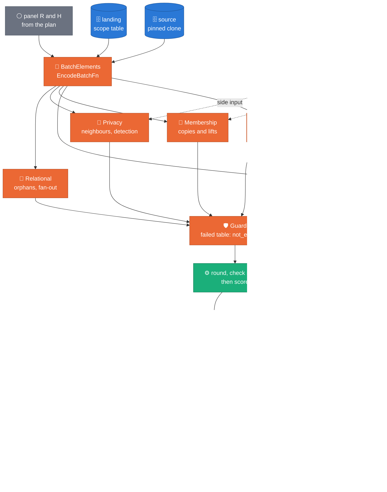
```mermaid
flowchart TB
  classDef beam  fill:#eb6834,color:#fff,stroke:#b44f26
  classDef cpu   fill:#1baf7a,color:#fff,stroke:#127a55
  classDef store fill:#2a78d6,color:#fff,stroke:#1d5599
  classDef data  fill:#6b7280,color:#fff,stroke:#4b5563

  SRC[("🗄️ source<br/>pinned clone")]:::store --> ENC
  SYN[("🗄️ landing<br/>scope table")]:::store --> ENC
  PANEL["⚪ panel R and H<br/>from the plan"]:::data --> ENC
  ENC["🔀 BatchElements<br/>EncodeBatchFn"]:::beam
  KEY["🛡️ LabelKey<br/>made on a worker"]:::cpu

  ENC --> DENSE["🔀 DenseMetrics<br/>grids, moments, pairs"]:::beam
  ENC --> CENSUS["🔀 CensusMetrics<br/>one count per value"]:::beam
  ENC --> MEMBER["🔀 Membership<br/>copies and lifts"]:::beam
  ENC --> PRIV["🔀 Privacy<br/>neighbours, detection"]:::beam
  ENC --> REL["🔀 Relational<br/>orphans, fan-out"]:::beam
  DENSE -- "exact totals" --> CENSUS
  KEY -. "side input" .-> DENSE
  KEY -. "side input" .-> CENSUS
  KEY -. "side input" .-> MEMBER
  KEY -. "side input" .-> PRIV

  DENSE --> GUARD
  CENSUS --> GUARD
  MEMBER --> GUARD
  PRIV --> GUARD
  REL --> GUARD
  GUARD["🛡️ Guard<br/>failed table: not_evaluated"]:::beam --> ROW["⚙️ round, check interval<br/>then score"]:::cpu
  ROW --> ROLL["🔀 roll-up rows"]:::beam
  ROW --> SINK[("🗄️ metrics, profiles<br/>row flags")]:::store
  ROLL --> SINK
  SINK -- "load and copy jobs done" --> FINAL["🔀 FINAL row"]:::beam
  FINAL --> REG[("🗄️ evaluation_data_history")]:::store
```

| Transform | Shape | Metrics it owns |
| --- | --- | --- |
| `beam/encode.py` | Batches of 512 to 8,192 rows become numpy arrays: numbers, value codes, text, and row-level hashes (whole row, non-key content, keys, foreign keys, NULL pattern, the matched-n draw) | — |
| `beam/dense.py` | One mergeable profile per table and side: exact counts on plan-time grids, moments, co-moments | Column distances, rate deltas, pair metrics, NULL patterns, type and range adherence |
| `beam/census.py` | A keyed count per distinct value and per shape mask | Category distributions, diversity, copy rate, value lifts, shapes, top-k |
| `beam/membership.py` | Hash lookups against the panel and the full source; exact keyed counts | Exact and near matches, row lifts, key duplicates, internal duplicates |
| `beam/privacy.py` | A bottom-k sample per side, an exact Gower search, one classifier per table | The DCR family, density, coverage, detection |
| `beam/relational.py` | Child-key counts joined to parent keys, by side input or by `CoGroupByKey` | Orphan rates, fan-out |

Writes use `WriteToBigQuery` with file loads, append, and no table
creation; the driver's own registry events are client load jobs. Streaming
inserts are never used.

**Reading the rows: two paths, one rule.**

**Claim:** a read table is paged if and only if its project refused a read
session; every other read table keeps the fast read.

The source and synthetic sides are read by `ReadFromBigQuery` with
`DIRECT_READ`, the [BigQuery Storage Read API][bq-storage-read]. Opening a
read session needs `bigquery.readsessions.create` **on the project of the
table being read**: Beam 2.74 asks with that project as the session's
parent (`_CustomBigQueryStorageSource.split`, read in the installed
package). A project may refuse it. A deployment may not grant
`roles/bigquery.readSessionUser`, and a public project is expected to
refuse: the caller holds no role there (an inference from the parent
project Beam uses, not something observed). A read-only parent's source
twin and an unpinned source are read from the source's own project, which
may be one. A worker that is refused fails the
job four attempts later: the first job launched in a deployment without
the role, on 2026-10-09, failed on every read that way. That launch is the
only observation in this subsection. The paged read below is tested on a
laptop against the real BigQuery client over a fake connection and has not
read from BigQuery yet.

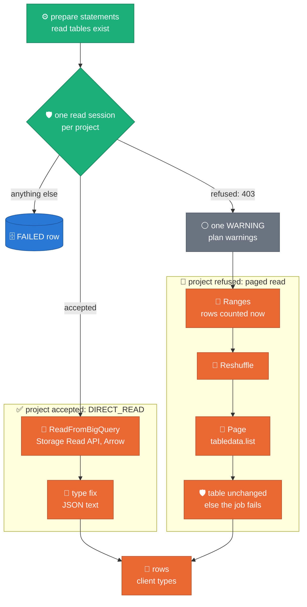
```mermaid
flowchart TB
  classDef beam  fill:#eb6834,color:#fff,stroke:#b44f26
  classDef cpu   fill:#1baf7a,color:#fff,stroke:#127a55
  classDef store fill:#2a78d6,color:#fff,stroke:#1d5599
  classDef data  fill:#6b7280,color:#fff,stroke:#4b5563

  PREP["⚙️ prepare statements<br/>read tables exist"]:::cpu --> PROBE{"🛡️ one read session<br/>per project"}:::cpu
  PROBE -- "anything else" --> FAILED[("🗄️ FAILED row")]:::store

  subgraph fast["✅ project accepted: DIRECT_READ"]
    direction TB
    DR["🔀 ReadFromBigQuery<br/>Storage Read API, Arrow"]:::beam --> FIX["🔀 type fix<br/>JSON text"]:::beam
  end

  subgraph paged["🚫 project refused: paged read"]
    direction TB
    CUT["🔀 Ranges<br/>rows counted now"]:::beam --> SHUF["🔀 Reshuffle"]:::beam --> PAGE["🔀 Page<br/>tabledata.list"]:::beam --> SAME["🛡️ table unchanged<br/>else the job fails"]:::beam
  end

  PROBE -- "accepted" --> DR
  PROBE -- "refused: 403" --> WARN["⚪ one WARNING<br/>plan warnings"]:::data --> CUT
  FIX --> ROWS["🧺 rows<br/>client types"]:::beam
  SAME --> ROWS
```

The driver decides before the graph is built (`cli/driver.py::_Run.read_path`).
Once the prepare statements have created the read tables, it asks for one
read session per project of the planned read tables
(`beam/io.py::probe_direct_read`: the call a worker makes, one stream, no row
read). A 403 is a refusal; any other error raises and the driver writes
the `FAILED` row, so a transient error never changes how an evaluation
reads. The probe is bounded at 45 seconds a project, the retries of an
unavailable service included, because it runs inside the launcher's twelve
minutes. `beam/io.py::RoutedBigQuerySources.paged` is the one rule. A run
that reads nothing from BigQuery (a fixture) is not probed. A table with
one side paged and the other read by `DIRECT_READ` differs between its
sides only on the types `DIRECT_READ` already could not normalise (a JSON
sub-field inside a RECORD, INTERVAL, RANGE), which the generator does not
write.

| | `DIRECT_READ` | Paged read |
| --- | --- | --- |
| Chosen for a read table when | its project accepted the read session | its project refused it |
| Needs | `bigquery.readsessions.create` on the read table's project | `bigquery.tables.get` (the table's metadata) and `bigquery.tables.getData` (its rows) on the read table; `roles/bigquery.dataViewer` has both, and planning uses both on the source and landing tables |
| Transport | Storage Read API streams, Arrow | REST [`tabledata.list`][bq-paging] through the BigQuery client's `list_rows`, the plan's columns only |
| Parallelism | the API's streams | row ranges of about 64 MB of the table's logical bytes, cut when the job reads from the table's own row count, reshuffled over the workers |
| Cell types | Arrow's; top-level JSON text is parsed (`normalize_direct_read`) | the client's own, the types of the panel, with no conversion in between |
| Bound | the API's throughput | [3.7 GB of row data per minute, 7.5 GB in the US and EU multi-regions][bq-quotas], charged to the project that contains the table and shared with every other reader of that project and with `jobs.getQueryResults`; 1,000 requests per second; at most 100,000 rows in a response |

**The quota belongs to the table's project.** For the job's own tables
that is the job's project, where a large paged evaluation competes with
everyone else who pages rows or fetches query results. For a source read
from another project it is that project's quota: for a public source, one
shared with every reader of the public project.

**One request per page.** The API cuts a response at about 10 MB, so a
request for the rest of a range comes back short. The next request starts
at the row after the last one returned (`startIndex`), never at a page
token: every request is a first-page request, and nothing rests on how a
client mixes the two.

**A table that changes while it is read fails the job.** A range holds the
rows it claims only on a table that does not change, so the paged read
checks instead of trusting:

| Check | When | Catches |
| --- | --- | --- |
| the metadata's `numRows` is the `totalRows` of one `tabledata.list` request for one row | when the ranges are cut | a table whose metadata and rows disagree (a streaming buffer); metadata that counts no row over a table that holds rows |
| the response carries a `totalRows`, and it is the row count of the cut | every response | rows added or removed; a response that cannot be checked |
| the range returned exactly its row count | every range | a response that ends early |
| `tables.get` again: the row count and the modification time of the cut | after every range, inside the bundle that emitted its rows, so a range that fails commits none of them | a table rewritten with as many rows |
| the rows the ranges emitted add up to the cut (each range counts what it yields), and the metadata is still the cut's | after the last range | a range that never ran; a row lost on the way out |

The row count of the cut is `tabledata.list`'s own: row positions address
that count, and it is there to be asked whatever the metadata says. So a
table is read as empty only when the list counts no row, never because
its metadata does. Metadata that says nothing is not taken for an answer
either:

| `tables.get` carries | Then |
| --- | --- |
| a `numRows` equal to the list's count | the ranges are cut from it |
| a `numRows` that differs | the job fails, naming both counts |
| no `numRows` | the list's count is used, and one `WARNING` names the table |
| no `lastModifiedTime` | the read goes on without the check for a rewrite with as many rows, and one `WARNING` says so |

What these checks cannot see is a table whose rows changed order while
its row count and modification time did not. Nothing BigQuery publishes
says that a row index addresses the same row on two calls to an unchanged
table; the paged read assumes it. Which read tables are exposed:

| Read table | Kind | Can it change during the read? |
| --- | --- | --- |
| source, pinned | a snapshot in the temporary dataset | no |
| source or landing sample (`--mode sampled`) | a table the prepare statements wrote | only by its 24-hour expiry |
| landing, scope `as_of` | a snapshot | no |
| landing, scope `appends` or `as_of_diff` | a table the prepare statements wrote | only by its expiry |
| landing, scope `table` or `manual` | the landing table itself | yes |
| source, unpinned; a read-only parent, both sides | the table itself | yes |

**Throttling.** A page BigQuery throttles waits and is asked for again,
with exponential back-off up to 60 seconds between attempts, for 15
minutes in all (`beam/io.py::page_retry_waits`). The error's reason
decides: `rateLimitExceeded`, `quotaExceeded` or a backend error waits;
`accessDenied` and every other reason fail at once, and so does a 403
without a reason. Google's [troubleshooting page][bq-quota-errors] names
the error (`exceeded quota for tabledata.list bytes per second per
project`) and prescribes "retries with exponential backoff". Its section
on that error does not name the reason the error carries; the page's
general example of a quota error is a 403 with `quotaExceeded`, which the
BigQuery client's own retry does not wait for. So both reasons wait. The 15
minutes are a bound on purpose: a per-minute limit comes back within it,
a daily or custom quota does not, and the range then fails naming the
reason instead of holding the job for hours.

**The cost is speed.** Above the quota Google's own advice is the Storage
Read API. A table too large to page is evaluated with `--mode sampled`
(§3.4), which reads at most `sample_rows` per side. An export to Cloud
Storage was considered and not built; [ADR 0041's note of
2026-10-10](../adr/0041-evaluation-standalone-package.md) records why.

The launch says what it does in one `WARNING`: per refusing project, why
it refused and the table sides it pages, each with its rows and the
table's logical bytes (an upper bound on what is paged: only the plan's
columns are read), then the quota and the role whose holder gets the
fast read. The same text joins the plan's warnings, so the registry's
`FINAL` (or `FAILED`) row carries it.

**Failures stay per table.** Nothing is dropped silently: every skip
becomes a written row with a reason.

| Where it fails | What is written |
| --- | --- |
| The driver cannot read a side, or build the table's layout | Every metric the table owns, `not_evaluated` with the reason. No transform sees the table |
| A batch fails to encode on a worker | Every metric row the table produced is rewritten `not_evaluated`; its profiles and flags are dropped |
| Inside a transform | That transform's own rows for the table, edge or block are `not_evaluated`; the other tables and the run carry on |

These are DATA errors: a malformed row, a degenerate count. A worker that
runs out of memory is not one. Its `MemoryError` is raised, so the bundle
fails and the runner retries it, in the encoder and inside every transform
(R113). Swallowed, it would become a permanent `not_evaluated` block that
leaves the run `SUCCEEDED` with, for example, its privacy verdicts missing.

### 5.3 Cost model

Three budgets, each with a place where it is enforced.

**BigQuery bytes: `--max_bytes_billed`.** The planner dry-runs the planning
queries, the panel query, the prepare DDL and, in sampled mode, the
worst-case sample reads, and refuses the run above the cap before anything
is billed. Per BigQuery's documented billing model, columnar billing reads each
column once, so splitting a wide table's planning into several statements
is expected to cost what one would; no dry run has reached BigQuery. The panel
query ranks the whole source once. An `as_of_diff` scope reads the table
and its start snapshot once each, about twice the table's bytes. The
registry stores the total in `bq_bytes_processed`.

**Shuffle: `--max_shuffle_gb`.** The plan predicts the shuffle of what the
pipeline will actually read and stores it in `predicted_shuffle_gb`:

| Part | Per evaluated table and side | Sampled? |
| --- | --- | --- |
| value census | `(head + (keys − head)·rate) × 24 B`, keys = `min(distinct, rows)` | yes, by value |
| shape masks | text and identifier keys × `(24 B + 1.5 × average length)` | never |
| relational | child rows × 16 B per edge | no |
| membership | codes × `(12 B + bytes of the table name)` | no |
| NULL patterns | `min(rows, 4096) × 16 B` | no |

The fixed parts are subtracted first. The census gets what is left, shared
max-min fairly, first across tables and then across one table's columns,
so a column that needs little is never sampled to feed one that needs
much, and a column expecting at most 1,000 keys is always exact. A column
granted less than its demand is value-sampled at a rate of K/10,000. The
12 B of a membership code is an amortised estimate taken from the
encoding of bundle-merged elements, not an upper bound. *Code:*
`context/budget.py::predict_shuffle_gb`, `water_fill`. How close the
prediction is to a real job's shuffle is unverified: no job has run.

**Memory: bounded side inputs.** A side input is held by every worker, so
each has a cap, and above it the transform shuffles instead:

| Side input | Cap | Above it |
| --- | --- | --- |
| The full source's sorted record hashes (membership) | 160 MB, 8 B a row and array | exact keyed counts by shuffle; no full-source copy flags |
| A parent's key set (relational) | 10 million keys, 80 MB | `CoGroupByKey` |
| The panel, encoded once per worker | the plan's R and H | — |

Beam 2.74 keeps no side-input cache by default, so every bundle would
re-read them. The evaluator sets `max_cache_memory_usage_mb` to the sum of
the side inputs a worker may hold at once, with 25 % headroom and at least
512 MB. The Gower search charges 64 MB per chunk. On Dataflow the
experiment `upload_graph` is always set, because a graph this wide is
expected to exceed the job-creation request limit. No job has been
submitted, so the limit has not been hit.

**CPU: the per-row pass and the fixed block.**

**Claim:** on one laptop core every statistic outran the encoder, and
the nearest-neighbour block is set by the sample knobs, not by the
table.

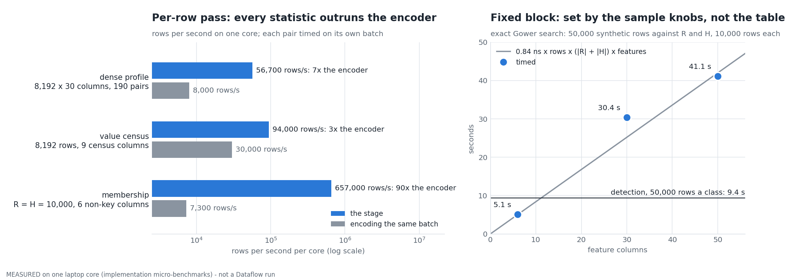

*MEASURED figure, interim: laptop micro-benchmarks recorded while each
transform was built, one Intel i5-6267U core. Not a Dataflow run and not a
committed evidence bundle; the first Dataflow run is to replace it.* Left:
each stage against the encoder's rate (the dense profile and the census
were timed with the encoder on the same batch; for membership, 7,300 rows/s
is the encoder's general rate from another task's notes, not that batch, so
read the third pair as an order of magnitude). Right: the exact Gower
search of the default `--privacy_sample_rows` against R and H, with a
per-operation model fitted at 50 feature columns; the points at 6 and 30
columns and the 9.4 s detection figure were timed on 4 cores at a load
average of 6 to 10, the 50-column point single-threaded. A reader can
reproduce the dense-pass row with `pytest
packages/sdfb-evaluation/tests/beam/test_dense.py::test_throughput_8192_by_30_batch -s`.
*Code:* `beam/encode.py`, `beam/dense.py`, `beam/census.py`,
`beam/membership.py`, `stats/privacy.py::gower_knn`. A floor on the dense
pass is pinned by `tests/beam/test_dense.py::test_throughput_8192_by_30_batch`.

What follows for sizing, as a model to be checked on the first run:

- The per-row pass scales with rows × columns and is dominated by turning
  BigQuery rows into arrays. Worker count should be sized from the
  encoder, not from the statistics.
- The privacy block costs about rows sampled × (|R| + |H|) × feature
  columns distance evaluations per table, whatever the table's size. It is
  split across workers in batches of at most 4,096 rows.
- Detection trains on one worker per table, on at most
  `--detection_sample_rows` rows a class.

### 5.4 Runners and the side-input contract

The pipeline rests on one contract of batch execution: a side input is
**complete** before the step that reads it runs. The failure map, the label
key, the panel sets, the parent key sets and the "write the final row
after every sink" ordering all depend on it.

| Runner | The contract |
| --- | --- |
| Dataflow, batch | Expected to hold. Unverified here: no job has run |
| Beam's in-process `FnApiRunner` | Holds: a stage runs to completion before the stages that read it |
| Prism, which Beam's `DirectRunner` hands a batch pipeline to | Did **not** hold on Beam 2.74.0 in this package's tests: a step ran with a side input that was still empty, and a failed table's row was published as a pass |

So a local run is in process. `--runner DirectRunner` is what the operator
says and what the registry's `runner` column records; the pipeline itself
runs on `FnApiRunner`, and `--runner PrismRunner` is refused as a usage
error (R92, R94). The behaviour was reproduced with a short pipeline that
holds no evaluator code (the reproducer is not committed). The upstream
report on the same subject is [apache/beam#36563][beam-36563], "Prism's
handling of side inputs could fail sometime", now closed; this package
pins Beam 2.74.0 and has not been re-tested on a later release. What the driver saw fail before the pipeline
started is passed to the Guard as a constant, not a side input, so no
runner can publish a graded row for such a table.

### 5.5 Determinism

`evaluation_key` is a BLAKE2b digest of the generation job id, the run
ids, the tables, the catalogue and evaluator versions, the mode and every
knob that can change a value; the salt of every sample and hash derives
from it. The same plan and rows give byte-identical metric and profile
rows. Two details make that true:

- **Rows are rounded before they are graded (R89).** Counts merge exactly,
  but moments merge in floating point in the order the runner chooses, so
  a rerun differs in the last digits. Each gated field is rounded to 9
  significant digits first, and status and score are then computed from
  the rounded fields, so a persisted row scored again from its own fields
  gives the same status and score. Integrity metrics and count-derived
  rates keep no absolute floor: one orphan in thirty billion rows must
  persist as more than 0 beside its FAIL.
- **Only what moments make is rounded in profiles.** The one exception
  is the `roc_curve` payload, whose restated AUC and interval are rounded
  like the `table.detection_auc` row. Histogram edges,
  quantiles and counts persist as computed, so edges stay strictly
  increasing and still hash to the row's `edges_digest`.

**Pitfall:** a temporal column's mean is moment-derived, so it keeps 9
significant digits of an epoch value: a step of about ten seconds on
present-day timestamps. Thresholds do not enter the key: two runs that
differ only in `--thresholds_uri` share an `evaluation_key` and are told
apart by the recorded digest of the overrides.

## 6. Data model and comparison queries

### 6.1 Four tables and two views

```mermaid
flowchart LR
  classDef store fill:#2a78d6,color:#fff,stroke:#1d5599
  classDef data  fill:#6b7280,color:#fff,stroke:#4b5563
  H[("🗄️ evaluation_data_history<br/>one row per event")]:::store
  M[("🗄️ evaluation_metrics<br/>one row per metric and scope")]:::store
  P[("🗄️ evaluation_profiles<br/>distribution payloads")]:::store
  F[("🗄️ evaluation_row_flags<br/>bounded row evidence")]:::store
  V1["⚪ view evaluation_latest<br/>last event per evaluation"]:::data
  V2["⚪ view evaluation_latest_per_job<br/>last FINAL per generation job"]:::data
  M -- "evaluation_id" --> H
  P -- "evaluation_id" --> H
  F -- "evaluation_id" --> H
  H --> V1
  H --> V2
```

| Table | Grain | Partition, cluster | Holds |
| --- | --- | --- | --- |
| `evaluation_data_history` | One row per event (`RUNNING`, `FINAL`) | day on `recorded_at`; `relationship_model, engine, evaluation_id` | The run: status, versions, the generation context as typed columns and as JSON, per-table scope and panel facts, family scores, metric counts, bytes, predicted shuffle, warnings |
| `evaluation_metrics` | One row per metric × table × column, pair or edge | month on `evaluated_at`; `table_name, metric_id, evaluation_id` | Value, per-side values, baseline, score, status, the thresholds it was graded against, noise floor or interval, n, method, digests, detail |
| `evaluation_profiles` | One row per profile × table × column or edge × side | month on `evaluated_at`; `table_name, profile_kind, evaluation_id` | Histograms, quantiles, top-k, length and shape mixes, temporal mixes, NULL patterns, correlation matrices, contingency tables, fan-out, distance histograms, ROC curves, moments |
| `evaluation_row_flags` | At most `--row_flags_top_k` rows per table and check | month on `evaluated_at`, expiring after 180 days; `table_name, check, evaluation_id` | `exact_copy`, `near_copy`, `nearest_record`, `detectable`: keys and keyed hashes only |

The schemas live inside the package (`schemas/*.schema.json`), not under
`config/bq_schema/`, which belongs to the generator's Terraform. `sdfb-eval
schemas` prints the `bq mk` commands; `--apply` creates missing tables and
replaces the two views, and never alters an existing table. Every field
carries a description, because the files are also a GUI's data contract.

### 6.2 The registry lifecycle

**Claim (D7):** an evaluation leaves one `RUNNING` row and exactly one
terminal row, written by whoever owns the outcome and by nobody while that
is not known.

```mermaid
flowchart TD
  classDef beam  fill:#eb6834,color:#fff,stroke:#b44f26
  classDef cpu   fill:#1baf7a,color:#fff,stroke:#127a55
  classDef store fill:#2a78d6,color:#fff,stroke:#1d5599
  classDef data  fill:#6b7280,color:#fff,stroke:#4b5563

  A["⚙️ driver mints<br/>evaluation_id"]:::cpu --> B{"plan built?"}:::cpu
  B -- "no" --> X[("🗄️ FAILED<br/>by the driver")]:::store
  B -- "yes" --> R[("🗄️ RUNNING")]:::store --> C["⚙️ prepare DDL<br/>submit the job"]:::cpu
  C -- "raised" --> X
  C --> D{"job state"}:::cpu
  D -- "DONE" --> E["🔀 the pipeline's<br/>own FINAL row"]:::beam
  D -- "FAILED or CANCELLED" --> X
  D -- "still running:<br/>interrupt or polling error" --> N["⚪ no terminal row yet<br/>job id printed"]:::data
  E --> G{"read back:<br/>FINAL present?"}:::cpu
  G -- "yes" --> OK["⚪ exit code<br/>from the gate"]:::data
  G -- "no" --> X
  G -- "cannot read" --> U["⚪ no row written<br/>one may exist"]:::data
```

| Terminal status | When |
| --- | --- |
| `SUCCEEDED` | Every launch table was evaluated, no warning |
| `SUCCEEDED_WITH_WARNINGS` | As above, with warnings: a contaminated scope that was allowed, an unpinned source, a fallback taken |
| `PARTIAL` | A launch table was not evaluated while another was; or a scope count mismatch; or a reference panel absent or unverified, so its privacy block was not evaluated |
| `SKIPPED` | No launch table can be evaluated by plan: an empty scope, for example. A planned outcome |
| `FAILED` | The driver caught an exception; or the pipeline ran and could evaluate none of the tables it meant to. In the second case the pipeline writes the row itself, keeps its counts, and names each table's reason |

`PARTIAL` means a launch table or a whole metric block was not evaluated
for a plan-level or driver-level reason. A metric that a transform could
not compute and reported itself, as a `not_evaluated` row with a reason,
shows in `metrics_not_evaluated` only and does not change the status.

Two contradicting terminal rows are worse than a `RUNNING` row that stays
open, so the driver never cancels a submitted job and never closes one it
cannot see the end of (R93). When the wait fails but the job is found
`DONE`, the pipeline's own row stands: after a polling error the driver
warns and reads the result as usual; after an interrupt it writes nothing
and prints how to read the result (R98). A job that ended in another state
may have loaded its `FINAL` row before it was cancelled, so the driver reads
the registry back before it appends `FAILED`, and appends nothing when a
`FINAL` row is there or the read fails (R113). A launch handed to Dataflow
as a template (`--template_location`, which is how a flex-template launcher
runs the entry) has no job id and nothing to wait for: the driver ends 0 and
leaves the `RUNNING` row for the job to close (R113). A `RUNNING` row with
no terminal row therefore means the job is still running, or died after the
command stopped watching; an orchestrator's failure callback closes that
one once the job is in a terminal state other than done (§8.3).

### 6.3 Four queries

These are written against the schema files and have **not** been run
against BigQuery. Replace `demo-project` with a project.

**A metric's trend over runs.**

```sql
SELECT h.evaluated_at, h.evaluation_id, h.generation_job_id, h.engine,
       m.value, m.baseline_value, m.noise_floor, m.status
FROM `demo-project.synthetic_data_quality.evaluation_metrics` AS m
JOIN `demo-project.synthetic_data_quality.evaluation_latest` AS h
  ON h.evaluation_id = m.evaluation_id
WHERE h.event = 'FINAL'
  AND h.status IN ('SUCCEEDED', 'SUCCEEDED_WITH_WARNINGS')
  AND m.evaluated_at >= TIMESTAMP_SUB(CURRENT_TIMESTAMP(), INTERVAL 90 DAY)
  AND m.table_name = 'orders'
  AND m.metric_id = 'column.ks'
  AND m.column_name = 'amount'
ORDER BY h.evaluated_at;
```

Read `value` beside `baseline_value` and `noise_floor`: a trend inside the
floor is not a trend.

**A/B between two evaluations.** The scope columns are NULL on rows that
do not use them, so the join key is their JSON text.

```sql
WITH rows_of AS (
  SELECT evaluation_id,
         TO_JSON_STRING(STRUCT(table_name, metric_id, column_name,
                               column_name_2, edge)) AS scope_key,
         table_name, metric_id, column_name, column_name_2, edge,
         value, status, noise_floor, ci_low, ci_high
  FROM `demo-project.synthetic_data_quality.evaluation_metrics`
  WHERE evaluation_id IN (@evaluation_a, @evaluation_b)
)
SELECT a.table_name, a.metric_id, a.column_name, a.column_name_2, a.edge,
       a.value AS value_a, b.value AS value_b, b.value - a.value AS delta,
       a.status AS status_a, b.status AS status_b,
       CASE
         WHEN a.noise_floor IS NOT NULL AND b.noise_floor IS NOT NULL
           THEN ABS(b.value - a.value)
                <= SQRT(POW(a.noise_floor, 2) + POW(b.noise_floor, 2))
         WHEN a.ci_low IS NOT NULL AND b.ci_low IS NOT NULL
           THEN a.ci_low <= b.ci_high AND b.ci_low <= a.ci_high
       END AS within_noise
FROM rows_of AS a
JOIN rows_of AS b USING (scope_key)
WHERE a.evaluation_id = @evaluation_a
  AND b.evaluation_id = @evaluation_b
  AND a.status != b.status  -- only what changed status; drop for every delta
ORDER BY a.table_name, a.metric_id;
```

`within_noise` is the rule `sdfb-eval compare` applies: two scalar floors
combine in quadrature, two intervals must overlap, and with neither the
delta has no noise judgement (NULL). Add each run's own `evaluated_at` to
the filter to prune partitions.

**The worst columns of the latest evaluation.**

```sql
WITH latest AS (
  SELECT evaluation_id
  FROM `demo-project.synthetic_data_quality.evaluation_latest`
  WHERE event = 'FINAL' AND status != 'FAILED'
  ORDER BY recorded_at DESC
  LIMIT 1
)
SELECT m.table_name, m.column_name,
       COUNTIF(m.status = 'fail') AS fails,
       COUNTIF(m.status = 'warn') AS warns,
       ROUND(AVG(m.score), 3) AS mean_score,
       ARRAY_AGG(IF(m.status = 'fail', m.metric_id, NULL)
                 IGNORE NULLS ORDER BY m.score LIMIT 5) AS failing_metrics
FROM `demo-project.synthetic_data_quality.evaluation_metrics` AS m
JOIN latest USING (evaluation_id)
WHERE m.level IN ('field', 'column')
  AND m.column_name IS NOT NULL
GROUP BY m.table_name, m.column_name
ORDER BY fails DESC, mean_score
LIMIT 20;
```

Statuses in the metric table are lower-case; in the registry they are
upper-case run statuses. As above, a filter on the run's `evaluated_at`
prunes partitions.

**Fidelity against privacy, per engine.**

```sql
SELECT engine,
       COUNT(*) AS evaluations,
       ROUND(AVG(fidelity_score), 3) AS mean_fidelity,
       ROUND(AVG(privacy_score), 3) AS mean_privacy,
       ROUND(MIN(privacy_score), 3) AS worst_privacy,
       COUNTIF(metrics_fail > 0) AS evaluations_with_a_fail
FROM `demo-project.synthetic_data_quality.evaluation_latest_per_job`
WHERE status IN ('SUCCEEDED', 'SUCCEEDED_WITH_WARNINGS')
  AND engine IS NOT NULL
  AND recorded_at >= TIMESTAMP_SUB(CURRENT_TIMESTAMP(), INTERVAL 90 DAY)
GROUP BY engine
ORDER BY engine;
```

A score is a summary for ranking runs, never a verdict: an average hides a
failed primary key. Read the counts beside it, and note in
`evaluation_params` whether a run was graded with overridden thresholds
before comparing its scores with another's.

`sdfb-eval compare` adds one thing SQL cannot do simply: the population
stability index between the two runs' stored histograms of a column,
given only when both carry the same `edges_digest`. The same digest means
the same bin edges, so the counts line up bin for bin; different digests
are reported as not comparable and nothing is re-binned. This replaces the
previous-run lookup of the retired in-job design.

## 7. Scoring

### 7.1 Status

**Claim (D5):** a threshold crossing that sampling noise explains is a
pass, and the row says it was downgraded.

```mermaid
flowchart TD
  classDef cpu   fill:#1baf7a,color:#fff,stroke:#127a55
  classDef data  fill:#6b7280,color:#fff,stroke:#4b5563
  G["⚪ gated value g<br/>the value, or its<br/>confidence bound"]:::data --> N{"missing?"}:::cpu
  N -- "yes" --> NE["⚪ not_evaluated"]:::data
  N -- "no" --> I{"no thresholds,<br/>or an INFO rule?"}:::cpu
  I -- "yes" --> INFO["⚪ info"]:::data
  I -- "no" --> Z{"warn and fail<br/>both 0?"}:::cpu
  Z -- "yes" --> ZT["⚪ fail if g above 0<br/>else pass"]:::data
  Z -- "no" --> C{"crosses warn<br/>or fail?"}:::cpu
  C -- "no" --> PASS["⚪ pass"]:::data
  C -- "yes" --> F{"explained by<br/>sampling noise?"}:::cpu
  F -- "yes" --> DOWN["⚪ pass, with<br/>noise_downgraded_from"]:::data
  F -- "no" --> WF["⚪ warn or fail"]:::data
```

The points where the rule is easy to misread:

- **The gated value.** For a metric with `uses_ci_bound`, status and score
  read the confidence bound on the cautious side: `ci_low` for a
  lower-is-better metric and `ci_high` for a higher-is-better one. In
  catalogue 1.0.0 every such metric is lower-is-better (the five lifts and
  the holdout share), so in practice it is `ci_low`. A lift with no event
  on either side has no point value and a lower bound of 0: it passes
  rather than being `not_evaluated`. A producer's reversed interval is
  treated as no interval, and a metric that gates on its bound is then
  `not_evaluated`.
- **Crossing is inclusive.** Lower-is-better reaches a threshold at
  `value ≥ threshold`, higher-is-better at `value ≤ threshold`; a `target`
  metric reads the distance from its target, which for
  `column.novelty_mass` is the row's own `source_value`.
- **Zero tolerance.** Warn and fail both 0 means integrity by
  construction: any value above 0 fails, exactly 0 passes, and no noise
  check applies. These are the key duplicate rates and the orphan rate on
  an enforced edge.
- **Information rules.** The orphan rate on a documented edge, and the
  copy rate on any kind but free text, are information whatever their
  value (§4.7, §4.8).
- **The noise check.** A scalar method calls a crossing noise when the
  value is within the row's `noise_floor` of its reference; an interval
  method when the interval covers the reference. The reference is the
  metric's target, else 0 for lower-is-better and 1 for higher-is-better.
  When the input a check needs is missing, nothing is downgraded and
  `detail.noise_check` says `unavailable`.
- **A downgraded row is scored at its reference.** D5 treats an effect
  inside sampling resolution as no effect for status and for score alike,
  so that roll-ups raise no false alarm on small tables. The score given
  is the score function's value at the reference, which is 1 for every
  metric of catalogue 1.0.0 that has a noise method. Every other row keeps
  the score of its own value (R40).

### 7.2 Score

A score maps a value to [0, 1], higher better, through one of five
functions named in the catalogue:

| `score` | Function |
| --- | --- |
| `complement` | `clip(1 − abs(v) / range_hi, 0, 1)` |
| `linear` | 1 at or inside warn, 0 at or beyond fail, linear between; mirrored for higher-is-better |
| `ratio_to_one` | as `linear`, on the distance `abs(v − target)` |
| `auc` | `1 − 2·max(0, v − 0.5)` |
| `none` | the value itself for a roll-up row; no score otherwise |

`info` and `not_evaluated` rows have no score.

### 7.3 Roll-ups

```mermaid
flowchart LR
  classDef cpu   fill:#1baf7a,color:#fff,stroke:#127a55
  classDef data  fill:#6b7280,color:#fff,stroke:#4b5563
  U1["⚪ each column<br/>mean of its field and<br/>column metrics"]:::data --> T
  U2["⚪ the pair group<br/>mean of pair metrics"]:::data --> T
  U3["⚪ each row-level and<br/>table-level metric"]:::data --> T
  U4["⚪ each edge where the<br/>table is the child"]:::data --> T
  T["⚙️ table family score<br/>mean over units"]:::cpu --> MF["⚙️ model family score<br/>mean over tables"]:::cpu --> O["⚙️ overall score<br/>mean of family scores"]:::cpu
  T --> TO["⚙️ table overall score<br/>mean of its family scores"]:::cpu
```

A unit is one thing a reader would name: a column, the pair group, a
row-level metric, an edge. Averaging over units rather than rows keeps a
wide table's many column metrics from drowning its one primary-key metric
(R11). Roll-up rows never feed themselves, and the registry's headline
counts leave them out, so `metrics_total` equals pass + warn + fail + info
+ not evaluated.

### 7.4 Thresholds for one run

The catalogue owns the defaults. `--thresholds_uri` overrides them for the
metrics a YAML file names, for the whole run: stored status, score,
`threshold_warn`, `threshold_fail`, roll-ups, registry counts and the gate
(R93). **One panel per case:**

```mermaid
flowchart TB
  classDef beam  fill:#eb6834,color:#fff,stroke:#b44f26
  classDef cpu   fill:#1baf7a,color:#fff,stroke:#127a55
  classDef store fill:#2a78d6,color:#fff,stroke:#1d5599
  classDef data  fill:#6b7280,color:#fff,stroke:#4b5563
  subgraph NO["flag absent"]
    N1[("📄 catalogue<br/>thresholds")]:::store --> N2["🔀 every row graded<br/>against the catalogue"]:::beam --> N3[("🗄️ registry: uri and<br/>digest NULL")]:::store
  end
  subgraph YES["flag set"]
    Y1[("📄 thresholds file")]:::store --> Y2{"valid?"}:::cpu
    Y2 -- "no" --> Y3["⚪ exit 2<br/>nothing started"]:::data
    Y2 -- "yes" --> Y4["🔀 named metrics graded<br/>and stored against the file"]:::beam --> Y5[("🗄️ registry: uri (base name<br/>if local) and digest")]:::store
  end
```

Nothing is graded twice: the gate reads the registry's counts, which are
counts of the stored rows. A file may only move a gate that exists. It is
refused, before anything starts, when it names a metric the catalogue
only reports, gives one bound without the other, a negative bound, bounds
in the wrong order for the metric's direction, or 0 and 0 on a
higher-is-better metric. Rows of an overridden run are not comparable
with a default run's without reading `evaluation_params`; `report` and
`compare` say when thresholds differ.

### 7.5 The gate and exit codes

`sdfb-eval run` waits for the job, so its exit code can carry the
`--fail_on` gate. **One panel for the three values of the flag:**

```mermaid
flowchart TD
  classDef cpu   fill:#1baf7a,color:#fff,stroke:#127a55
  classDef data  fill:#6b7280,color:#fff,stroke:#4b5563
  S{"FINAL status"}:::cpu
  S -- "FAILED" --> E3["⚪ exit 3<br/>whatever the flag"]:::data
  S -- "SKIPPED" --> E0A["⚪ exit 0<br/>whatever the flag"]:::data
  S -- "PARTIAL" --> P{"--fail_on"}:::cpu
  S -- "SUCCEEDED" --> Q{"--fail_on"}:::cpu
  P -- "none" --> E0B["⚪ exit 0"]:::data
  P -- "warn or fail" --> E1A["⚪ exit 1"]:::data
  Q -- "none" --> E0C["⚪ exit 0"]:::data
  Q -- "fail" --> F1["⚪ exit 1 if any<br/>metric is at FAIL"]:::data
  Q -- "warn" --> W1["⚪ exit 1 if any metric<br/>is at WARN or FAIL"]:::data
```

| Exit | Meaning |
| --- | --- |
| 0 | The evaluation finished and no gate tripped |
| 1 | The `--fail_on` gate tripped, and nothing else |
| 2 | A usage error: nothing was started. A malformed Beam argument, an invalid thresholds file and `--runner PrismRunner` are usage errors |
| 3 | The evaluation failed: its `FINAL` row reads `FAILED`, or the command raised. `--fail_on none` does not mask it |

Under an active gate `PARTIAL` trips it, because the gate cannot vouch for
a launch table that was not evaluated; `SKIPPED` does not, because an empty
scope is a planned outcome.

## 8. Integrations

### 8.1 The command line

| Command | Does |
| --- | --- |
| `sdfb-eval plan` | Builds and prints the plan: scopes, rows, the panel, the method per column, dry-run bytes, predicted shuffle. Runs no prepare DDL and writes no registry row |
| `sdfb-eval run` | One evaluation: `RUNNING` row, prepare DDL, pipeline, outputs, `FINAL` row |
| `sdfb-eval report` | A stored evaluation as markdown or JSON, each failing metric explained with the catalogue's own text |
| `sdfb-eval compare` | Two stored evaluations, noise-aware |
| `sdfb-eval catalogue` | The catalogue as JSON or markdown |
| `sdfb-eval schemas` | The four tables and two views: print, or create |

A target is exactly one of a generation job id, a base run id, tables
named by hand, a seed table (the table a launch targeted: evaluate what that
launch generated) or a relationship model alone (all its enabled tables). An `evaluation_id` is minted fresh per attempt and never
passed in, because temporary tables carry it and a retry within 24 hours
would collide. The [README](../../packages/sdfb-evaluation/README.md) has
the flags and their defaults.

**`--sink`, one panel per mode:**

```mermaid
flowchart TB
  classDef beam  fill:#eb6834,color:#fff,stroke:#b44f26
  classDef store fill:#2a78d6,color:#fff,stroke:#1d5599
  subgraph S1["bq_client: the DirectRunner default"]
    A1["🔀 pipeline"]:::beam --> A2[("📄 local NDJSON")]:::store --> A3[("🗄️ BigQuery<br/>client load jobs<br/>registry last")]:::store
  end
  subgraph S2["bq: the Dataflow default"]
    B1["🔀 pipeline"]:::beam --> B2[("🗄️ BigQuery<br/>file loads")]:::store
  end
  subgraph S3["local_json"]
    C1["🔀 pipeline"]:::beam --> C2[("📄 a directory per<br/>evaluation_id<br/>nothing in BigQuery")]:::store
  end
```

### 8.2 Dataflow: one image and one flex template, shared with the generator

**Not built, not launched.** Since 2026-10-06 the evaluator has no image
and no template of its own in this repository's deployment
([ADR 0041, amendment](../adr/0041-evaluation-standalone-package.md#amendment-2026-10-06-one-image-one-template)):
the generator's image carries the evaluator's source, and the generator's
template launches both jobs. The files are tested statically and their
shell steps are run as committed; nothing has been built.

```mermaid
flowchart LR
  classDef beam  fill:#eb6834,color:#fff,stroke:#b44f26
  classDef cpu   fill:#1baf7a,color:#fff,stroke:#127a55
  classDef store fill:#2a78d6,color:#fff,stroke:#1d5599
  classDef data  fill:#6b7280,color:#fff,stroke:#4b5563

  subgraph G["sdfb_job absent or generation"]
    P1["⚪ launch parameters"]:::data --> E1{"⚙️ flex_entry.py"}:::cpu
    E1 --> R1["🔀 run_pipeline.main<br/>generation job"]:::beam
  end
  subgraph E["sdfb_job = evaluation"]
    P2["⚪ launch parameters"]:::data --> E2{"⚙️ flex_entry.py"}:::cpu
    E2 --> R2["🔀 run_evaluation.main<br/>evaluation job"]:::beam
  end
  IMG[("📄 one image<br/>one template")]:::store -.-> E1
  IMG -.-> E2
```

*The two values of the template parameter `sdfb_job`. The selector is
removed and every other parameter reaches the chosen entry unchanged
(`docker/flex_entry.py::split_selector`, `::main`).*

What the files are written to do:

- **The image** (`docker/Dockerfile` at the repository root) takes the
  evaluator's `src` through a build stage that tolerates its absence, so
  the same file builds in a tree without the package. The evaluator is
  not installed: it has no virtualenv of its own and runs on what `uv
  sync` installs for the generator. Its source is last on the launcher's
  `PYTHONPATH` and a path line of the worker bridge `.pth`. A build step
  imports the evaluator's two entry modules in both contexts, so an image
  that lost a dependency the evaluator needs fails at build.
- **The entry** is a dispatcher, `docker/flex_entry.py`. Without
  `sdfb_job` it calls the generator's `main` with the launch's arguments,
  as when that file was the entry itself; with `sdfb_job=evaluation` it
  calls the evaluator's. It imports only the entry it runs. An unknown
  value, or `evaluation` on an image built without the package, is a
  usage error (exit 2) and nothing starts.
- **The template's parameters** (`docker/flex_template_metadata.json`) are
  the generator's, `sdfb_job`, and the evaluator's. The evaluator's are
  exactly the public flags of `sdfb-eval run`, minus runner, project and
  region, which the template launcher supplies (R97), plus two names that
  are not flags of the command: `sdfb_job` and Beam's own `disk_size_gb`.
  A test compares the metadata with the parser itself. Every parameter
  is optional: what a job requires is refused by its own parser, in the
  launcher. An unset parameter is expected to reach the command line as
  an empty string, which every flag of the evaluator reads as "not given".
- **The workers' boot disk.** The evaluation job's workers unpack the same
  multi-GB image as the generation job's. The generator pins a 200 GB
  boot disk for its own workers in code; the evaluator pins none, so an
  evaluation launch on this image passes `disk_size_gb=200`, which the
  evaluator hands to Beam like any Beam argument. Both DAGs do.
- **The worker image's coordinate** is baked into the image from the
  build argument the generator already uses, and applied when the launch
  gives none.
- **The dispatch entrypoint** is the generator's: Dataflow appends the
  worker's boot flags to the image's entrypoint and does not override it
  ([ADR 0009](../adr/0009-single-flex-template-image.md)), so one image
  serves the [flex-template][flex-templates] launcher and the workers.
- **The template entry** submits the job and returns. It does not wait
  and never applies `--fail_on`.

The package still holds a CPU `Dockerfile`, a copy of the entrypoint
script and its own template metadata: they are the surface of the
package copied out as a unit of its own (§9). Its build script builds
only an evaluator-only template from an existing image.

Unverified until a build and a launch: the build with and without the
evaluator's directory, the import check in both contexts, the dispatcher
under the template launcher, the entrypoint dispatch, the baked worker
image, the boot disk reaching the workers, the launcher supplying project
and region, an unset parameter reaching the command line as an empty
string, and which numpy, scipy and scikit-learn a worker imports (the
Beam base image's global packages come ahead of the image's virtualenv on
a worker's path, as they do for the generator).

### 8.3 Composer

**Not deployed and never run.** Both DAG files are read by `ast` in
tests and their pure functions are executed; Airflow has never parsed
either.

**The generation DAG evaluates its own run** when its parameter
`run_evaluation` is true. Nothing else has to be imported.

```mermaid
flowchart LR
  classDef beam  fill:#eb6834,color:#fff,stroke:#b44f26
  classDef cpu   fill:#1baf7a,color:#fff,stroke:#127a55
  classDef store fill:#2a78d6,color:#fff,stroke:#1d5599
  classDef data  fill:#6b7280,color:#fff,stroke:#4b5563

  S["🔀 start_sdfb<br/>launch, no wait"]:::beam --> G{"🛡️ run_evaluation_gate"}:::cpu
  G -- "false, the default" --> X["∅ the rest is skipped<br/>as before"]:::data
  G -- "true" --> W["⚙️ wait_for_generation<br/>job reached DONE"]:::cpu
  W --> T["🔀 trigger_evaluation<br/>same template<br/>sdfb_job=evaluation"]:::beam
  T --> L["⚙️ launcher: RUNNING row<br/>then submit"]:::cpu --> JOB["🔀 evaluation job<br/>CPU workers"]:::beam --> FIN[("🗄️ FINAL row")]:::store
  W -. "job failed<br/>or cancelled" .-> F["⚠️ task fails<br/>nothing evaluated"]:::data
```

- **The wait** is a sensor on the generation job's id (from the launch
  task's XCom) in reschedule mode: between two reads of the job's state
  the task holds no worker slot, and no triggerer is needed. It is
  not deferrable. It reads the state every two minutes for at
  most a day.
- **The launch** is a second launch of the generation template, with
  `sdfb_job=evaluation`, `generation_job_id` (the launch's identity: only the
  Dataflow job is read, for its window), `scope=manual` (each landing table read whole: this
  launch's rows under `overwrite`, earlier launches' too under `append`),
  `reference_rows_limit` and `validation_runs_table` (the generation's: the
  panel is rebuilt and verified against the digest on this launch's
  `validation_runs` rows, found by landing table and the job's window),
  `seed_table` (the launched table), `relationships_uri`
  (empty when `generate_fk_relationships` is false), `landing_dataset`,
  `reference_dataset` (the `source_dataset` parameter), `trigger=chained`
  and the boot disk; it reads no job log or BigQuery job labels, and one query on
  `validation_runs`; the row carries the job id and window, and a model the
  launch adjusted is not seen; it is a CPU job in the generation job's subnetwork,
  under the same service account. It does not wait: the evaluation job
  writes its own `FINAL` row.
- **Five new parameters**, all read only when `run_evaluation` is true:
  `evaluation_mode` (empty: the evaluator's default), `evaluation_machine_type`
  (`e2-standard-8`), `evaluation_max_workers` (4) and
  `evaluation_output_dataset` (`synthetic_data_quality`) and `source_dataset`
  (the dataset of the source tables; empty: that of `table_fqn`). No new
  substitution marker and no new Airflow Variable.
- **With `run_evaluation` false** the gate skips every task after the
  launch. The launch itself is unchanged: a test pins the operator's whole
  call to its shape before the chain existed.
- **A chained evaluation that dies after launch leaves its `RUNNING` row
  open.** Nothing in this DAG closes it. The standalone DAG below is the
  path that waits for its job and closes the row.

**The standalone DAG** (`composer/evaluation_framework.py`, DAG id
`sdfb_evaluation_framework`) is optional: it evaluates a run that has
already landed, on its own, by the seed path of the chain (no job log):
`seed_table` and the datasets, plus `generation_job_id` as the launch's
identity when known; the older shapes (job id alone with the seed emptied, run
id, tables) stay. Its markers are ones the import workflow already
substitutes for the generation DAG, three of them table names that give the
defaults. Neither `deferrable` nor a triggerer is used (a reschedule sensor
and `wait_until_finished`); both evaluation launches take a launcher machine
type, because the launch has 12 minutes in all, the image pull included. It
launches from the same template and passes `sdfb_job=evaluation`.

```mermaid
flowchart LR
  classDef beam  fill:#eb6834,color:#fff,stroke:#b44f26
  classDef cpu   fill:#1baf7a,color:#fff,stroke:#127a55
  classDef store fill:#2a78d6,color:#fff,stroke:#1d5599
  classDef data  fill:#6b7280,color:#fff,stroke:#4b5563

  M["⚪ manual run"]:::data --> B["⚙️ begin"]:::cpu --> FO{"🛡️ fan_out<br/>a list of job ids?"}:::cpu
  FO -- "yes: one run of<br/>this DAG per id" --> M
  FO -- "no" --> W{"wait_gate"}:::cpu
  W -- "wait_for_generation" --> S["⚙️ sensor: job<br/>reached DONE"]:::cpu --> ST
  FO -- "no" --> ST["🔀 start_evaluation<br/>launch the template"]:::beam
  ST --> L["⚙️ launcher: RUNNING row<br/>then submit"]:::cpu --> JOB["🔀 evaluation job"]:::beam --> FIN[("🗄️ FINAL row")]:::store
  ST -. "task fails" .-> CB{"⚙️ failure callback<br/>job state?"}:::cpu
  CB -- "FAILED, CANCELLED,<br/>UPDATED, DRAINED" --> FAILED[("🗄️ FINAL row<br/>status FAILED<br/>one INSERT SELECT")]:::store
  CB -- "no job id, running,<br/>done or not readable" --> OPEN["⚪ nothing written"]:::data
```

- **Parameters** map one to one onto template parameters, each from a DAG
  parameter or a constant. The DAG never passes runner, project, region,
  the worker image, experiments or `fail_on` as template parameters (R99).
  Its launch environment does pass `additionalExperiments`
  (`use_runner_v2`, `enable_secure_boot` and the network-tag experiments).
  `trigger` is `composer` for a manual run.
- **Several jobs in one go.** `generation_job_ids` is a list. With an id
  in it, the first task starts one run of this same DAG per id (the
  list, then the single `generation_job_id`; blanks and repeats dropped;
  each run gets an empty list, an empty `seed_table` and the other
  parameters unchanged) and skips the rest of its own run. Every job is
  so evaluated by its own run on the single-job path, which the sensor,
  the launch and the callback never see as a list. The seed is not handed
  down: the jobs of a list may have launched different tables, so each
  started run is the full lookup of its own job. The runs go one after another, because
  the DAG allows one active run; raising that limit runs several
  evaluation jobs at the same time.
- **The failure callback closes the open row, when the job cannot.** The
  launcher writes the `RUNNING` row and mints the id, so a job that dies
  afterwards leaves only that row. A task can also fail on the Airflow
  side while its job runs on, and a `FAILED` row written then would be
  followed by the job's own `FINAL` row. So the callback reads the job's
  state first (the provider's Dataflow hook, with the job id the launch
  pushed) and writes only when the job is in a terminal state other than
  done; with no job id, or a job still running, it logs and writes
  nothing (R113). The row is one `INSERT … SELECT` that copies the
  `RUNNING` row of this DAG run's evaluation, matched on the launch
  target, the trigger and the DAG run's start time, and skips any
  evaluation that already has a final event.
- **Limits.** Two DAG runs overlapping on the same target can close each
  other's row. A launch whose only target is `tables` cannot be matched,
  so a failed job leaves its row open and the callback logs a warning.

Unverified until a real environment: the reschedule-mode sensor and what
it does when the generation job fails or is cancelled (the provider's
source was not available to read), the launch task's wait
(`wait_until_finished`) of the standalone DAG, the DML, the callback's
operator call, the job id in XCom and the
hook's job read that the callback's state check relies on, a worker count
rendered as a string, how a trigger's configuration reaches the task, and
the DAG re-triggering itself. The README lists them.

### 8.4 The validation prompt, agents and a GUI

- **The end-to-end validation prompt** has an optional Step 3.6 that
  looks up the evaluation of a job (or, if the user agrees, runs one) and
  folds `sdfb-eval report` into the evidence bundle; its fidelity step
  takes the numbers from there when present
  ([the prompt](../../.github/prompts/end_to_end_validation_report_generation.prompt.md)).
  The step has not been exercised against a real evaluation.
- **Agents** read an evaluation through `sdfb-eval report --format json`,
  which carries every metric row, the failing metrics with the catalogue's
  explanations, and the run's warnings. No agent definition in
  `.claude/agents/` uses it yet.
- **A GUI** on another branch reads the two contracts of this package: the
  schema files and the catalogue. It grades nothing itself and must show
  when a run was graded with overridden thresholds. It is not part of
  this branch.

## 9. Packaging and the DSG unit

The package is a standalone uv project (D1): Python 3.11, Apache Beam
2.74.0 with the same pre-release pin the generator needs, numpy, scipy,
scikit-learn, PyYAML and the BigQuery client. Its lock holds no pandas
and no synthetic-data metrics library; scipy and scikit-learn double as
test oracles (§10). CI has a separate job that installs the package from
its own lock, checks that no generator module is importable, type-checks
it and runs its tests.

That lock serves development and CI. In the repository's image (§8.2) the
evaluator runs on the generator's environment, which holds the
generator's libraries too; the evaluator imports none of them. A test of
the generator's suite keeps the two in step: every dependency the
evaluator declares must be in the root lock inside its range and
installed by the extras the image names.

The Dataflow Solution Guides replica is built from a manifest
([ADR 0040](../adr/0040-dsg-donation-golden-source-sync.md)). The current
manifest ships the generator as one unit, and the evaluator is not in it:
`packages/sdfb-evaluation/` is not copied, and the root-side parity test
and the catalogue-renderer test are excluded because what they read stays
here. The evaluator is meant to ship as **its own unit**, with its own
manifest and overlay. That unit is planned and is not in this tree. The
package was built to make it possible: its schemas, its image entrypoint
and its relationship-model reader are inside it, and nothing in it reaches
outside.

## 10. Testing strategy

```mermaid
flowchart LR
  classDef beam  fill:#eb6834,color:#fff,stroke:#b44f26
  classDef cpu   fill:#1baf7a,color:#fff,stroke:#127a55
  classDef data  fill:#6b7280,color:#fff,stroke:#4b5563
  O["🛡️ oracles<br/>each statistic against<br/>an independent source"]:::cpu --> P["🔀 planted defects<br/>the whole pipeline on<br/>a launch with known faults"]:::beam --> C["🛡️ canaries<br/>properties that must<br/>never break"]:::cpu --> G["⚪ first GCP run<br/>what a laptop<br/>cannot prove"]:::data
```

**Oracles.** Each statistic is compared with an independent
implementation or a closed form: scipy for KS, Wasserstein, entropy,
Jensen–Shannon, rank correlation, association, skewness and kurtosis and
the beta and hypergeometric laws; scikit-learn for the ROC AUC; closed
forms and simulated null distributions for the noise floors and interval
coverage. Mergeable accumulators are tested with
property tests that split the same rows at random and merge in random
trees. The mirrors of generator code are pinned by the two-sided golden
file (D2).

**Planted defects.** The acceptance test runs the composed pipeline on an
invented three-table launch (`users`, `orders`, `order_items`) twice: once
against a faithful twin drawn from the same generator, which must fail
no fidelity, privacy or integrity check, and once against a twin with seven defects:

| # | Planted | Must fail |
| --- | --- | --- |
| 1 | 1 % of `users` rows carry the content of reference records | `row.memorization_lift`, `row.exact_match_rate_nonkey` |
| 2 | 0.5 % carry prompt-exposed records | `row.exposure_lift` |
| 3 | `orders.amount` shifted | `column.ks`, `column.pit_w1`, `column.jsd` |
| 4 | `order_items.cost` permuted across rows | `pair.pearson_delta` |
| 5 | 2 % extra items whose order does not exist | `relationship.orphan_rate` |
| 6 | `orders.status` collapsed to one value | `column.entropy_ratio`, `column.top1_share_delta` |
| 7 | 2 % of delivery notes copied from rare reference notes | `field.substantive_copy_rate`, `field.value_memorization_lift` |

The bad run must also be **specific**: it fails nothing outside the
scopes its defects touch. Defect 1 cannot fail the holdout share (§4.7);
that metric's fail is proved separately on a heavy copier.

**Canaries.**

| Canary | What it guards |
| --- | --- |
| No test reaches the network | A guard on Python's sockets and on credential discovery fails any non-`gcp` test that tries |
| The label key is not in the job graph | Every transform payload of the built pipeline is unpickled and searched for the key |
| A rerun is byte-identical | The same plan and rows give the same metric, profile and flag rows |
| Re-scoring is exact | Every persisted row, scored again from its own fields, gives its stored status and score |
| Every written row is schema-valid | Including `FAILED` rows built from the command's arguments alone |
| Prism is refused | The pipeline will not be built on a runner that breaks the side-input contract |
| The flag surface | The template metadata lists exactly the public flags of `run` |
| Independence | No import of the generator's packages, by syntax tree and by an isolated install |

Tests that need live GCP are marked `gcp` and excluded by default. None
has been run.

## 11. Acceptance criteria

Each criterion can be checked against something that exists in the code:
a test, a registry column, a command's exit code.

| # | Criterion | Checked by | State |
| --- | --- | --- | --- |
| 1 | A faithful twin fails no fidelity, privacy or integrity metric; each planted defect fails the metrics named for it; nothing else fails | `tests/beam/test_acceptance.py` | Met on a laptop |
| 2 | The same plan and rows give byte-identical output rows | the rerun tests | Met on a laptop |
| 3 | The package imports no generator module and installs alone | `tests/unit/test_independence.py`, CI job `evaluation` | Met |
| 4 | This document's catalogue tables equal the catalogue | `render_eval_catalogue.py --check` in CI | Met |
| 5 | `sdfb-eval schemas --apply` creates the four tables and two views in a real dataset | exit code 0, tables present | Pending the first GCP run |
| 6 | `plan --dry_run` on a real generation job resolves the launch from job labels, and every launch table has `scope_status = ok` | the printed plan, `tables[].scope_status` | Pending |
| 7 | On an append launch, `APPENDS` or the two-state difference returns exactly the job's rows | `scope_status = ok`, never `count_mismatch` | Pending |
| 8 | The source pin and the start snapshot are created with the evaluator's roles | no pin warning in `warnings` | Pending |
| 9 | The reference digest matches: `tables[].reference_verified` is true | registry row | Pending |
| 10 | The one image builds with the evaluator in it, a worker boots through the dispatch entrypoint, and a template launch with `sdfb_job=evaluation` runs with the launcher's project and region | a Dataflow job that reaches DONE | Pending |
| 11 | On Dataflow the `FINAL` row is recorded after the metric tables' load jobs finished | `recorded_at` of the row against the load jobs' end times in the JOBS view | Pending |
| 12 | Predicted shuffle is within a factor of two of the job's shuffled bytes | `predicted_shuffle_gb` against the job's metrics | Pending |
| 13 | A job killed after launch by the standalone DAG has its `RUNNING` row closed by the Composer callback | a `FAILED` final row for that `evaluation_id` | Pending |
| 14 | A generation DAG run with `run_evaluation` true waits for its job and launches the evaluation from the same template | an evaluation row whose `trigger` is `chained` and whose tables are the launched table's component | Pending |

Criterion 12's factor is a first target, not a measured tolerance; it
should be replaced by what the first runs show.

## 12. Out of scope

| Not built | Why |
| --- | --- |
| Train-on-synthetic, test-on-real utility (TSTR) | It needs a downstream task and labels per table. The detection and dependence metrics are the task-free proxy |
| Embedding-based text quality scores such as MAUVE | They need an embedding model at evaluation time on a CPU job. Free text is measured by length, shape, character classes and copying |
| Attack-based privacy: membership or attribute inference | These train attack models against the generator. The similarity metrics here are indicators, and a pass is not a guarantee ([Stadler, Oprisanu & Troncoso 2022][stadler2022]; [Ganev & De Cristofaro 2023][ganev2023]) |
| Differential privacy accounting | The generator makes no differential-privacy claim, so there is no budget to account for |
| A gate inside the generation job | Evaluation is post-hoc by decision. The generation job keeps its own blocker rules |
| Managed dashboards, lineage or data-quality-scan services | Results stay in BigQuery tables and local or object-store files ([ADR 0001](../adr/0001-no-managed-gcp-services.md)) |

## 13. Figure provenance

Regenerate every figure, and print the palette check, with:

```bash
uv run --no-sync python3 scripts/doc/make_eval_figures.py
uv run --no-sync python3 scripts/doc/make_eval_figures.py --only eval-fanout
```

The script needs numpy, matplotlib and PyYAML only. It imports nothing from
the evaluator; the warn and fail thresholds drawn in the figures are read
from `catalogue/metrics.yaml`, so no threshold is typed in the script. Two
consecutive runs produce byte-identical files. After a change to a
threshold in the catalogue, regenerate.

Palette: three series colours from the repository's asset set, with colour
following the entity in every figure. Blue is the source and the reference
sample R; orange is the synthetic side under test, or the reading that
misleads; aqua is the control: the holdout H, a faithful generator, the
corrected reading. Gray is context. The script prints the OKLab separation
of every pair in normal vision and under simulated colour-vision
deficiency on each run; every pair passes, and aqua's low contrast on white
is relieved by direct labels.

| Figure | File | Claim it carries | Kind | Seed |
| --- | --- | --- | --- | --- |
| Levels | `assets/eval-levels.png` | Every metric looks at one unit of the data | CONCEPT, schematic | — |
| Sets | `assets/eval-sets-rhe.png` | One fingerprint order gives R, E, H and H_E | CONCEPT, schematic | — |
| Baseline | `assets/eval-baseline.png` | `metric(R, source)` is the floor a generator that read only R can reach | CONCEPT | 13 |
| Noise floor | `assets/eval-noise-floor.png` | The same KS value is noise at 1,000 rows and an effect at a million | CONCEPT | 12 |
| KS bracket | `assets/eval-ks-bracket.png` | KS is exact at the edges and bounded inside the bins; the union grid closes the bracket at a point mass | CONCEPT | 11 |
| KS and W1 | `assets/eval-ks-vs-wasserstein.png` | Two failures with the same W1 can differ 5x in KS | CONCEPT | 7 |
| Matched n | `assets/eval-matched-n-entropy.png` | Plug-in entropy grows with n; at matched n a faithful generator sits at 1 | CONCEPT | 14 |
| Duplicates | `assets/eval-rarefied-duplicates.png` | The duplicate share grows with n; rarefied to one m a faithful generator shows no excess | CONCEPT | 15 |
| Lift | `assets/eval-memorization-lift.png` | Only copying lifts the ratio; status reads its lower bound | CONCEPT | 16 |
| DCR, NNDR | `assets/eval-dcr-nndr.png` | DCR flags a parked copy, NNDR a uniquely close record | CONCEPT, hand-placed | 7 |
| Holdout share | `assets/eval-holdout-dcr.png` | A copy fraction f moves the share by f/2 | CONCEPT | 17 |
| Detection | `assets/eval-c2st.png` | An AUC is read with its interval against 0.5 | CONCEPT | 18 |
| Fan-out | `assets/eval-fanout.png` | An equal mean fan-out can hide a wrong shape | CONCEPT | 19 |
| Count rule | `assets/eval-count-rule.png` | An edge is published only with 10 source records on each side | CONCEPT | 20 |
| CPU budget | `assets/eval-cpu-budget.png` | Encoding bounds the per-row pass; the neighbour block is fixed by the sample knobs | MEASURED, laptop | — |

`eval-cpu-budget` is the only figure with measured numbers, and it is
interim: laptop micro-benchmarks recorded while the package was built, not
a committed evidence bundle, to be replaced by the first Dataflow run. The
numbers are typed once, in the script's `MEASURED` block, with where they
came from: one laptop core. One command reproduces the dense-pass row:
`pytest packages/sdfb-evaluation/tests/beam/test_dense.py::test_throughput_8192_by_30_batch -s`. Diagrams are inline mermaid, in the
repository's house classes: orange for Beam code, blue for stores, green
for CPU work, gray for plain values.

## 14. References

Every link below was fetched on **2026-10-05** and resolved to the work
cited. A DOI was resolved through `doi.org` and its registered title,
authors and year were read back; other links were fetched and their titles
read. Exceptions are stated in the last column. In the code, sources are
cited by author and year only; URLs live in this document and in the
catalogue. Three links remain in code by exception: the Hellinger (1909)
DOI in `stats/distances.py`, which is not in this document's reference
list, and two BigQuery reference pages in `schemas/__init__.py`.

| Source | Used for | Fetch result |
| --- | --- | --- |
| [Smirnov 1948][smirnov1948], Ann. Math. Statist. | two-sample KS, §4.2, §4.3 | DOI resolves; title matches |
| [Dvoretzky, Kiefer & Wolfowitz 1956][dkw1956], Ann. Math. Statist. | the one-sample band, §4.2 | DOI resolves; title matches |
| [Massart 1990][massart1990], Ann. Probab. | the tight constant of the band, §4.2 | DOI resolves; title matches |
| [Gneiting, Balabdaoui & Raftery 2007][gneiting2007], JRSS B | the probability integral transform, §4.3 | DOI resolves; title matches |
| [Czado, Gneiting & Held 2009][czado2009], Biometrics | the mid-distribution transform, §4.3 | DOI resolves; title matches |
| [Ramdas, García Trillos & Cuturi 2017][ramdas2017], Entropy | Wasserstein-1 as the area between CDFs, §4.3 | DOI resolves; title matches |
| [Yurdakul & Naranjo 2020][yurdakul2020], J. Risk Model Validation | the population stability index, §4.3 | DOI resolves; title matches |
| [Lin 1991][lin1991], IEEE Trans. Inf. Theory | Jensen–Shannon divergence, §4.3 | DOI resolves; title matches |
| [Cohen 1988][cohen1988], 2nd ed. | effect-size thresholds, §4.3 | DOI resolves to the publisher's 2013 e-book record of the 1988 edition |
| [Austin 2009][austin2009], Statist. Med. | the standardised mean difference threshold, §4.3 | DOI resolves; title matches |
| [Shannon 1948][shannon1948], Bell Syst. Tech. J. | entropy, §4.5 | DOI resolves; title matches |
| [Miller 1955][miller1955], in *Information Theory in Psychology* | the plug-in bias of entropy, §4.5 | No DOI (a book chapter). The page answered a script with HTTP 202 and no content; the record (title, author, 1955) was read through the site's API |
| [Paninski 2003][paninski2003], Neural Comput. | entropy estimation, §4.5 | DOI resolves; title matches |
| [Chao & Shen 2003][chaoshen2003], Environ. Ecol. Stat. | entropy with unseen values, §4.5 | DOI resolves; title matches |
| [Good 1953][good1953], Biometrika | sample coverage, unseen mass, §4.5 | DOI resolves; title matches |
| [Hurlbert 1971][hurlbert1971], Ecology | rarefaction, §4.5 | DOI resolves; title matches |
| [Heck, van Belle & Simberloff 1975][heck1975], Ecology | exact rarefaction, §4.5 | DOI resolves; title matches |
| [Chan, Golub & LeVeque 1983][chan1983], Amer. Statist. | stable, mergeable variance, §4.4 | DOI resolves; title matches |
| [Pébay 2008][pebay2008], Sandia report | one-pass parallel co-moments, §4.4 | DOI resolves; title matches |
| [Spearman 1904][spearman1904], Amer. J. Psychol. | rank correlation, §4.4 | DOI resolves; title matches |
| [Fisher 1915][fisher1915], Biometrika | the z-transform floor, §4.2 | DOI resolves; title matches |
| [Bergsma 2013][bergsma2013], J. Korean Stat. Soc. | bias-corrected Cramér's V, §4.4 | DOI resolves; title matches |
| [Treves & Panzeri 1995][treves1995], Neural Comput. | the bias of information estimates, §4.2, §4.4 | DOI resolves; title matches |
| [Horvitz & Thompson 1952][horvitz1952], JASA | weighting a value sample, §4.6 | DOI resolves; title matches |
| [Woodruff 1971][woodruff1971], JASA | the variance of a ratio estimate, §4.6 | DOI resolves; title matches |
| [Korn & Graubard 1998][korn1998], Survey Methodology 24(2) | intervals on an effective sample size, §4.5, §4.6 | The catalogue page resolves and names the article and both authors. The [PDF][korn1998pdf] resolves as a PDF; its text could not be extracted here |
| [Wilson 1927][wilson1927], JASA | the score interval for a share, §4.2 | DOI resolves; title matches |
| [Newcombe 1998][newcombe1998], Statist. Med. | the interval for a difference of shares, §4.2 | DOI resolves; title matches |
| [Przyborowski & Wilenski 1940][przyborowski1940], Biometrika | the conditional test of two rates, §4.7 | DOI resolves; title matches |
| [Clopper & Pearson 1934][clopper1934], Biometrika | the exact binomial interval, §4.7 | DOI resolves; title matches |
| [Sweeney 2002][sweeney2002], IJUFKS | k-anonymity, §2.1, §4.9 | DOI resolves; title matches |
| [Carlini et al. 2021][carlini2021], arXiv | extraction of training data, §4.7 | arXiv page fetched; title matches |
| [Gower 1971][gower1971], Biometrics | the mixed-type distance, §4.7 | DOI resolves; title matches |
| [Podani 1999][podani1999], Taxon | ordinal features in Gower's coefficient, §4.7 | DOI resolves; title matches |
| [Platzer & Reutterer 2021][platzer2021], Front. Big Data | the holdout design, §3.5, §4.7 | DOI resolves; title matches |
| [Giomi et al. 2023][giomi2023], arXiv | singling out, §4.7 | arXiv page fetched; title matches |
| [Naeem et al. 2020][naeem2020], arXiv | density and coverage, §4.7 | arXiv page fetched; title matches |
| [Cohen & Kaplan 2007][cohenkaplan2007], PODC | bottom-k samples, §4.7 | DOI resolves; title matches |
| [Madow 1949][madow1949], Ann. Math. Statist. | systematic sampling, §4.7 | DOI resolves; title matches |
| [Lopez-Paz & Oquab 2017][lopezpaz2017], arXiv | the classifier two-sample test, §4.7 | arXiv page fetched; title matches |
| [DeLong, DeLong & Clarke-Pearson 1988][delong1988], Biometrics | the AUC interval, §4.2, §4.7 | DOI resolves; title matches |
| [Sun & Xu 2014][sunxu2014], IEEE Signal Process. Lett. | the fast midrank form, §4.7 | DOI resolves; title matches |
| [Woo et al. 2009][woo2009], J. Privacy Confid. | propensity mean squared error, §4.7 | DOI resolves; title matches |
| [Snoke et al. 2018][snoke2018], JRSS A | its null standardisation, §4.7 | DOI resolves; title matches |
| [Patki, Wedge & Veeramachaneni 2016][patki2016], DSAA | parent-child cardinality, §4.8 | DOI resolves; title matches |
| [Stadler, Oprisanu & Troncoso 2022][stadler2022], arXiv | limits of similarity metrics, §1, §12 | arXiv page fetched; title matches |
| [Ganev & De Cristofaro 2023][ganev2023], arXiv | the same, §1, §12 | arXiv page fetched; title matches |
| [Jordon et al. 2022][jordon2022], arXiv | the fidelity, privacy and utility framing, §1.1 | arXiv page fetched; title matches |
| [Lin, Lucas & Shmueli 2013][linlucas2013], Inf. Syst. Res. | large samples and p-values, §1 | DOI resolves; title matches |
| [Heule, Nunkesser & Hall 2013][heule2013], EDBT | HyperLogLog++, §4.3 | DOI resolves; title matches. The [PDF][heule2013pdf] was fetched and its first page read |
| [BigQuery: work with change history][bq-change-history] | what `APPENDS` returns, §3.2 | Fetched; the page lists the five operations and no copy job |
| [BigQuery: `FOR SYSTEM_TIME AS OF`][bq-as-of] | one point in time per table and statement, §3.2 | Fetched; the sentence quoted is on the page |
| [BigQuery: time travel][bq-time-travel] | the window a scope must fall in, §3.2 | Fetched; title matches |
| [BigQuery: table snapshots][bq-snapshots], [creating them][bq-snapshots-create] | the start snapshot and its permissions, §3.2 | Both fetched; the permissions named are on the second page |
| [BigQuery: `INFORMATION_SCHEMA.JOBS`][bq-jobs] | what a job wrote, §3.1 | Fetched; labels, job type and the required role are on the page |
| [BigQuery: approximate aggregate functions][bq-approx] | planning statistics, §4.3 | Fetched; "a statistical estimate" is on the page |
| [BigQuery: hash functions][bq-hash] | `FARM_FINGERPRINT`, §3.4 | Fetched; the function is on the page |
| [Dataflow: Flex Templates][flex-templates] | the launcher, §8.2 | Fetched; title matches |
| [BigQuery: Storage Read API][bq-storage-read] | the fast read and its permission, §5.2 | Fetched 2026-10-10; `bigquery.readsessions.create` "on the project" and `roles/bigquery.readSessionUser` are on the page, and so is "Sessions expire automatically" |
| [BigQuery: read with pagination][bq-paging] | `tabledata.list`, the size of a response, §5.2 | Fetched 2026-10-10; "more than 10 MB of data or more than `maxResults` rows" is on the page. The page says nothing about the order of rows across requests |
| [BigQuery: quotas and limits][bq-quotas] | the `tabledata.list` limits, §5.2 | Read on 2026-10-10 with `curl -sL` and a text search (the fetch tool used for the other pages returns this one's navigation only). On the page: "Maximum tabledata.list bytes per minute: 7.5 GB in multi-regions; 3.7 GB in all other regions", "This quota applies to the project that contains the table being read", "Other APIs including jobs.getQueryResults and fetching results from jobs.query and jobs.insert can also consume this quota", 1,000 `tabledata.list` requests per second and 100,000 rows per response. No rows-per-second limit is on the page |
| [BigQuery: troubleshoot quota errors][bq-quota-errors] | the throttling error and its remedy, §5.2 | Read on 2026-10-10 with `curl -sL`. The section "Maximum tabledata.list bytes per second per project quota errors" gives the message and "retries with exponential backoff" and names no reason; the overview's example of a quota error is a 403 whose reason is `quotaExceeded` |
| [BigQuery: export table data][bq-export] | the read path not built, ADR 0041 | Fetched 2026-10-10; `bigquery.tables.export`, the Cloud Storage permissions and DATETIME as a string in Avro are on the page. The page does not say whether a table snapshot can be exported |
| [apache/beam#36563][beam-36563] | Prism and side inputs, §5.4 | Fetched; the issue title matches and the issue is closed |
| [SDMetrics documentation][sdmetrics] | the origin of several metric names, §4.3 | Fetched; title matches |

[smirnov1948]: https://doi.org/10.1214/aoms/1177730256
[dkw1956]: https://doi.org/10.1214/aoms/1177728174
[massart1990]: https://doi.org/10.1214/aop/1176990746
[gneiting2007]: https://doi.org/10.1111/j.1467-9868.2007.00587.x
[czado2009]: https://doi.org/10.1111/j.1541-0420.2009.01191.x
[ramdas2017]: https://doi.org/10.3390/e19020047
[yurdakul2020]: https://doi.org/10.21314/JRMV.2020.227
[lin1991]: https://doi.org/10.1109/18.61115
[cohen1988]: https://doi.org/10.4324/9780203771587
[austin2009]: https://doi.org/10.1002/sim.3697
[shannon1948]: https://doi.org/10.1002/j.1538-7305.1948.tb01338.x
[miller1955]: https://www.semanticscholar.org/paper/922ef4c778a7145da54b0de3e8ef5240a8584cd7
[paninski2003]: https://doi.org/10.1162/089976603321780272
[chaoshen2003]: https://doi.org/10.1023/A:1026096204727
[good1953]: https://doi.org/10.1093/biomet/40.3-4.237
[hurlbert1971]: https://doi.org/10.2307/1934145
[heck1975]: https://doi.org/10.2307/1934716
[chan1983]: https://doi.org/10.1080/00031305.1983.10483115
[pebay2008]: https://doi.org/10.2172/1028931
[spearman1904]: https://doi.org/10.2307/1412159
[fisher1915]: https://doi.org/10.2307/2331838
[bergsma2013]: https://doi.org/10.1016/j.jkss.2012.10.002
[treves1995]: https://doi.org/10.1162/neco.1995.7.2.399
[horvitz1952]: https://doi.org/10.1080/01621459.1952.10483446
[woodruff1971]: https://doi.org/10.1080/01621459.1971.10482279
[korn1998]: https://www150.statcan.gc.ca/n1/en/catalogue/12-001-X19980024356
[korn1998pdf]: https://www150.statcan.gc.ca/n1/pub/12-001-x/1998002/article/4356-eng.pdf
[wilson1927]: https://doi.org/10.1080/01621459.1927.10502953
[newcombe1998]: <https://doi.org/10.1002/(SICI)1097-0258(19980430)17:8%3C873::AID-SIM779%3E3.0.CO;2-I>
[przyborowski1940]: https://doi.org/10.1093/biomet/31.3-4.313
[clopper1934]: https://doi.org/10.1093/biomet/26.4.404
[sweeney2002]: https://doi.org/10.1142/S0218488502001648
[carlini2021]: https://arxiv.org/abs/2012.07805
[gower1971]: https://doi.org/10.2307/2528823
[podani1999]: https://doi.org/10.2307/1224438
[platzer2021]: https://doi.org/10.3389/fdata.2021.679939
[giomi2023]: https://arxiv.org/abs/2211.10459
[naeem2020]: https://arxiv.org/abs/2002.09797
[cohenkaplan2007]: https://doi.org/10.1145/1281100.1281133
[madow1949]: https://doi.org/10.1214/aoms/1177729988
[lopezpaz2017]: https://arxiv.org/abs/1610.06545
[delong1988]: https://doi.org/10.2307/2531595
[sunxu2014]: https://doi.org/10.1109/LSP.2014.2337313
[woo2009]: https://doi.org/10.29012/jpc.v1i1.568
[snoke2018]: https://doi.org/10.1111/rssa.12358
[patki2016]: https://doi.org/10.1109/DSAA.2016.49
[stadler2022]: https://arxiv.org/abs/2011.07018
[ganev2023]: https://arxiv.org/abs/2312.05114
[jordon2022]: https://arxiv.org/abs/2205.03257
[linlucas2013]: https://doi.org/10.1287/isre.2013.0480
[heule2013]: https://doi.org/10.1145/2452376.2452456
[heule2013pdf]: https://research.google.com/pubs/archive/40671.pdf
[bq-change-history]: https://docs.cloud.google.com/bigquery/docs/change-history
[bq-as-of]: https://docs.cloud.google.com/bigquery/docs/reference/standard-sql/query-syntax#for_system_time_as_of
[bq-time-travel]: https://docs.cloud.google.com/bigquery/docs/time-travel
[bq-snapshots]: https://docs.cloud.google.com/bigquery/docs/table-snapshots-intro
[bq-snapshots-create]: https://docs.cloud.google.com/bigquery/docs/table-snapshots-create
[bq-jobs]: https://docs.cloud.google.com/bigquery/docs/information-schema-jobs
[bq-approx]: https://docs.cloud.google.com/bigquery/docs/reference/standard-sql/approximate_aggregate_functions
[bq-hash]: https://docs.cloud.google.com/bigquery/docs/reference/standard-sql/hash_functions
[flex-templates]: https://docs.cloud.google.com/dataflow/docs/guides/templates/using-flex-templates
[bq-storage-read]: https://docs.cloud.google.com/bigquery/docs/reference/storage
[bq-paging]: https://docs.cloud.google.com/bigquery/docs/paging-results
[bq-quotas]: https://docs.cloud.google.com/bigquery/quotas
[bq-quota-errors]: https://docs.cloud.google.com/bigquery/docs/troubleshoot-quotas
[bq-export]: https://docs.cloud.google.com/bigquery/docs/exporting-data
[beam-36563]: https://github.com/apache/beam/issues/36563
[sdmetrics]: https://docs.sdv.dev/sdmetrics
