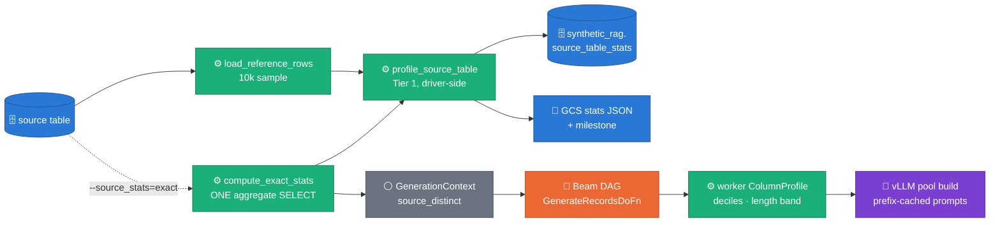
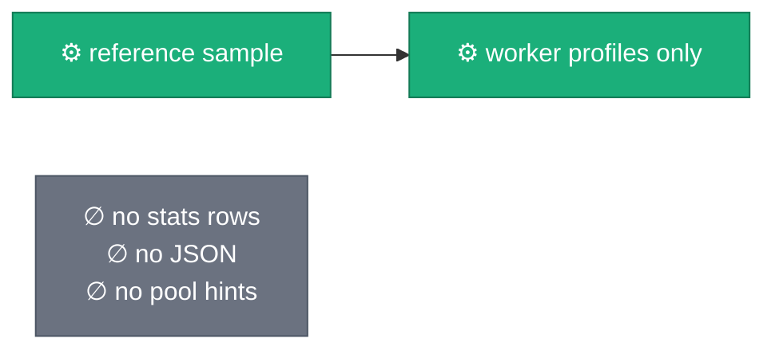
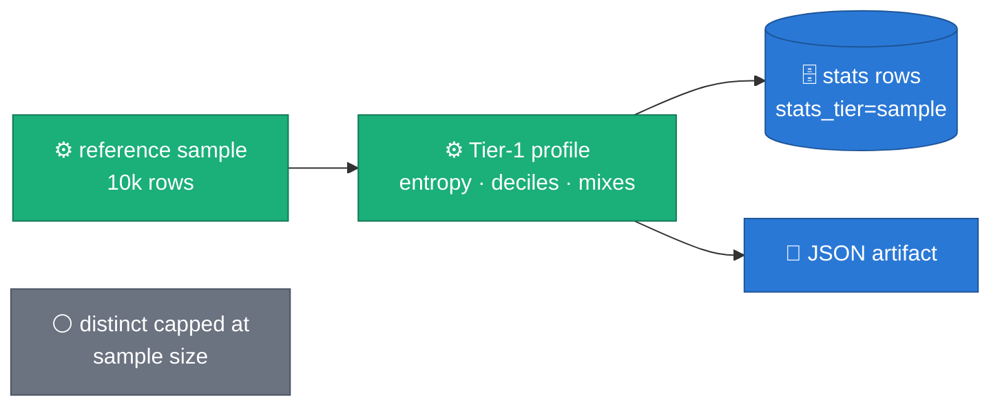
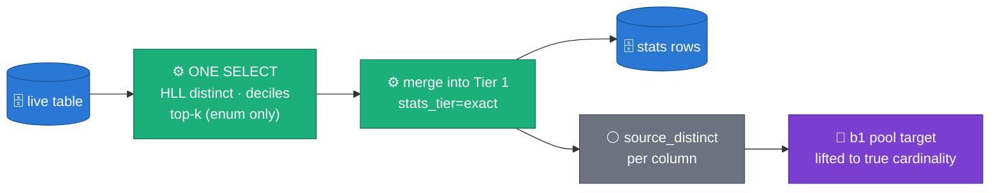

# source_table_stats as a generation input — tiers, consumers, and what each flag mode does

> **Status: ACCEPTED** · decision record: [ADR 0022](../adr/0022-stats-driven-generation.md)
> · sibling contract: [ADR 0021](../adr/0021-relational-contract-in-descriptions.md)
> · evidence: five-run postmortem §11 of
> [`2026-07-27-ws6-pipeline-shape.md`](2026-07-27-ws6-pipeline-shape.md) and the
> 2026-08-04 freetext crosscheck (`scripts/e2e/freetext_crosscheck.py`).

## Evidence (measured elsewhere, cited here)

Two measured findings drive this design — both live in their own evidence
docs, neither is re-typed here (visual-first rule: a number is typed once):

- **Synthetic free-text `distinct == pool size`** while source columns held
  4k–146k distinct values — the 10k reference sample caps what any profiler
  can see (postmortem §11).
- **11/13 columns had an empty-parity gap** and synthetic prose ran short —
  the crosscheck's trimmed-empty and length findings.

## Architecture — one profiling pass, tiered, workers stats-table-agnostic

Claim: *every stats consumer sits driver-side or reads a worker-local
profile; no worker ever queries the stats table.*

The stats *table* stays a human/drift artifact; the stats *values* reach
generation through exactly two seams: the worker-local `ColumnProfile`
(recomputed from the same reference rows) and `GenerationContext`
(driver-populated). That is the WS-B invariant, unchanged.

## `--source_stats` — one panel per mode

### `off`

Nothing is profiled driver-side. Engines still profile per worker (they
always do); there is simply no persisted record and no exact pool sizing.

### `sample` (default)

Zero extra BigQuery cost (the sample is already paid for). `distinct` is
sample-bound: a 4k-distinct source column with 95 distinct values in the
sample reads 95 — which is precisely the pool-starvation trap.

### `exact`

Adds exactly one aggregate scan of the source table
([HLL++](https://research.google.com/pubs/archive/40671.pdf) behind
[`APPROX_COUNT_DISTINCT`](https://docs.cloud.google.com/bigquery/docs/reference/standard-sql/hll_functions),
[`APPROX_QUANTILES` / `APPROX_TOP_COUNT`](https://cloud.google.com/bigquery/docs/reference/standard-sql/approximate_aggregate_functions)).
On failure the run degrades loudly to `sample` behavior
(`source_stats_exact_failed` milestone) and stays retryable — the skip key
records the tier actually achieved.

## Consumer map — which stat feeds which generation kind

Honesty column included: a stat that is measured but not yet consumed says
so. Measured-but-unconsumed is the M2 seed, not silent coverage.

| Generation kind | Stat consumed today | Consumer (code) | Not yet consumed (measured for M2) |
|---|---|---|---|
| constant | `is_constant` (route) | both profilers | — |
| categorical / BOOL | empirical frequency table (worker-side) | `_sample_categorical` | `entropy`/`top1_share` → WS-A skewed-FK weighting; `top_values` drift checks |
| integer / float / NUMERIC | **11-point decile vector → inverse-CDF** ([Devroye 1986](http://luc.devroye.org/rnbookindex.html)) | `b2 backends._sample_one`; b1 anchors empirically already | exact Tier-2 deciles as B.1 anchor supplement |
| dates / timestamps | **epoch decile vector → inverse-CDF** (+ sentinels, now−10y clamp) | `b2 temporal.sample_temporal` | `dow_mix`/`hour_mix`/`month_mix` bucket-preserving sampler |
| free text (LLM pool) | **`source_distinct` → pool target** (Tier 2); **`length_hint` p05–p95 band → prompt suffix** | `b1 engine._pool_target`, `_column_constraint`; `b2 freetext._generate_pool` | char-class/entropy prompt steering |
| shaped identifiers | shape templates (existing); never LLM | `text_shapes` | `gap_ratio` for sequential-PK realism |
| row nulls | per-column `null_fraction` (existing) | both engines | `__table__` null-pattern mix → joint null sampling |

## vLLM efficiency contract for prompt-side consumers

Prompt additions are **per-column constant suffixes appended after the
shared instruction prefix** — the pool prompt's shared prefix stays
byte-identical across calls and columns, so
[vLLM automatic prefix caching](https://docs.vllm.ai/en/stable/design/prefix_caching/)
keeps its KV blocks hot (the ADR 0018 rule that already governs
`kcenter_rotate`). Pool-size lifts stay under `_FREE_TEXT_POOL_MAX=512`:
pool build cost is linear in target size (batched 32-value array
completions), so `exact` improves *sizing accuracy*, not cost ceilings.

## Acceptance criteria (falsifiable, keyed to existing milestones)

1. `--source_stats=sample` run: `source_stats_written` milestone; every row
   carries `sample_rows`, `stats_tier='sample'`, `profiler_version='2'`.
2. Same digest re-run: `source_stats_skipped`; bumping `PROFILER_VERSION`
   re-writes (versioned skip key).
3. `--source_stats=exact` run: `source_stats_exact` milestone with column
   count; b1 logs pool targets ≥ sample-tier targets for starved columns.
4. Exact pass hard-failure (quota, missing table): job continues;
   `source_stats_exact_failed` at WARNING; rows land as `sample` tier.
5. B.2 synthetic numeric column vs skewed source: decile overlap beats the
   pre-ADR-0022 uniform baseline (KS-style check, see
   [SDMetrics KSComplement](https://docs.sdv.dev/sdmetrics/metrics/quality-metrics/kscomplement)).
6. No literal source values in stats rows for columns with distinct > 50
   (privacy gate — [Carlini et al. 2021](https://arxiv.org/abs/2012.07805)).

## Figure provenance

All figures are inline mermaid (house style: repo `classDef` vocabulary —
🟠 Beam, 🟢 CPU/pure-Python, 🟣 GPU/vLLM, 🔵 stores, ⚪ values); no generated
PNGs — every claim here is structural, no measured magnitudes are plotted.
Measured numbers cited belong to the five-run postmortem and crosscheck
evidence docs linked in the banner.

External references: [GReaT, Borisov et al. ICLR 2023](https://arxiv.org/abs/2210.06280)
(rejected alternative — per-row LLM generation) ·
[CTGAN, Xu et al. NeurIPS 2019](https://arxiv.org/abs/1907.00503)
(learned-joint alternative, owned by `SdgxBackend`) ·
[Shannon 1948](https://ieeexplore.ieee.org/document/6773024) (entropy) ·
retrieval date for all URLs: 2026-08-05.
