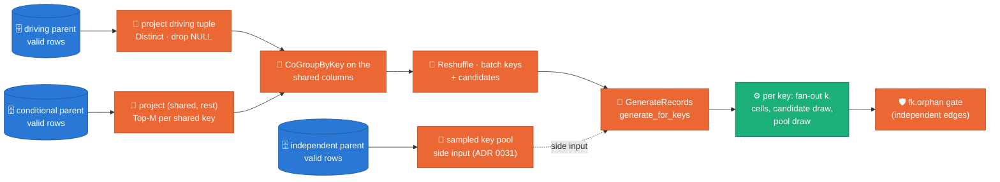
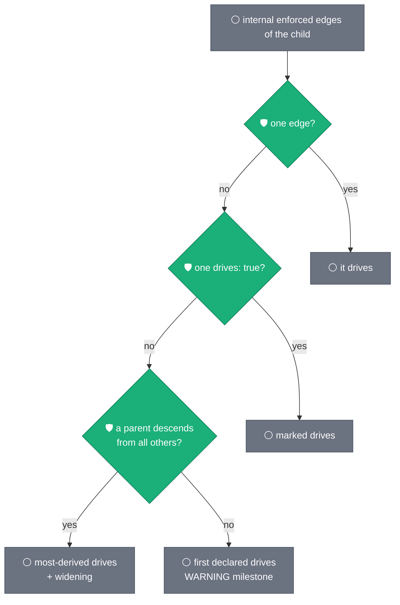

# Multi-parent children — independent and conditional edges

**Status:** DESIGN → implemented on `ws12-fanout-generation` (ADR 0037).
Extends [ADR 0036](../adr/0036-parent-driven-fanout-generation.md)
(parent-driven fan-out, one driving edge per child) and reuses
[ADR 0031](../adr/0031-joint-fk-key-draws.md) (joint key-tuple pools).
Companion: [ADR 0037](../adr/0037-multi-parent-children.md) records the
decision; this document is the argument and the contract.

## 1. Evidence — the shapes a model can declare and what the launch did

The 2026-09-11 five-table expansion of the anonymised core-accounts model
(`A_TABLE`, `C_TABLE`, `E_TABLE`, `F_TABLE` enabled; hub `B_TABLE` and
`D_TABLE` detached) stopped at preflight three times in one evening, each
on a shape ADR 0036 never saw: a root whose FK member points at a
disabled parent (fixed ef66717), a 3.6e27-string pattern member (fixed
ca8f948), a true 1:1 child whose PK **is** its driving edge (fixed
8573665). The shape sweep written afterwards
(`packages/sdfb-tests/tests/unit/contracts/test_relationship_shapes.py`)
pins what the registry resolves today and names the two shapes it
cannot:

| shape | registry today | why |
|---|---|---|
| hub with many children | resolves | one edge per child |
| chain / tree | resolves | one edge per child |
| forest of components, 1:1 chains | resolves | one edge per child |
| child → parent **and** grandparent | resolves | grandparent edge `implied` (carried through the parent, ADR 0036 D4) |
| **star-schema fact**: child → `dim_a`, child → `dim_b`, no ancestry between them | **stops** | second edge is neither driving nor implied |
| **true diamond**: `left`/`right` both under `top`, `bottom` → both | **stops** | second edge shares `T` with the driving edge and adds `R` |

Under ADR 0036 D4 an edge that is neither driving nor implied is a
`RelationshipError`, because before ADR 0036 the engine wrote every
edge's columns in turn and the last one silently won. This design
gives those two edges a role and a mechanism instead of a stop, and
keeps every guarantee ADR 0036 made for the driving edge.

## 2. The mechanism — four roles, three DAG paths



**Claim:** every enforced in-set edge of a child reaches the engine
through exactly one of three paths, and each path is correct by
construction for the columns it owns.

| role | when | DAG path | what the row gets | integrity |
|---|---|---|---|---|
| `driving` | the edge whose parent keys the child is generated from (ADR 0036) | key-batch request stream | the whole driving tuple, inherited columns, PK cells | by construction |
| `implied` | columns ⊆ driving columns and carried by the driving parent from that parent (ADR 0036 D4) | none | nothing to draw | by construction, through the driving edge |
| `independent` **(new)** | no column shared with the driving edge (a star-schema dimension) | sampled key pool as a side input (ADR 0030/0031 path, unchanged) | a whole parent key tuple, drawn per row | by construction from the pool; the `fk.orphan` gate measures it |
| `conditional` **(new)** | at least one column shared with the driving edge, and possibly more (a diamond branch) | co-partitioned `CoGroupByKey` on the shared columns, before batching | the shared columns come from the driving key; the rest is one candidate tuple that exists in the parent for that shared value | by construction; unmatched keys follow the NULL policy (§4) |
| `external` | parent outside the launch | driver-side pool (unchanged) | whole tuple | by construction; a column overlap with the driving edge is logged, not resolved (§9) |

Overlap is by **child column name**: the child column `T` in
`(T,L)->left` and in `(T,R)->right` is one column with one value, so it
must satisfy both parents. `rest` is the edge's columns outside the
overlap; it may be empty — then the edge is a pure existence filter
(`(K)->P` driving and `(K)->Q` conditional: the child's `K` must exist
in `Q` too).

## 3. Which edge drives — the rule, in order

1. One internal enforced edge → it drives.
2. Exactly one edge marked `drives: true` → it.
3. No marker: the parent that descends from every other candidate
   parent drives, and its edge to the other parent is widened with the
   child's pins (ADR 0036 rev 2 — unchanged).
4. **No marker and no ancestry between the parents (ruling A, 2026-09-11):
   the first declared internal enforced edge drives.** The launcher logs
   `fk_driving_edge_defaulted table= edge= hint='mark drives: true to
   choose'` at WARNING and the card tags it `DRIVES (first declared)`.
   Toggling `enabled` stays enough; `drives: true` remains the override.
5. More than one `drives: true` is still a `RelationshipError`.

The only stop left in `edge_roles` is rule 5. Every other internal edge
is driving, implied, independent or conditional.



**Claim:** the driving edge is a pure function of the model file and
never a launch stop unless two edges are both marked.

## 4. The conditional path in detail

For a driving edge `D` (`D.cols` → `P_D.ref_cols`) and a conditional
edge `X` (`X.cols` → `P_X.ref_cols`):

- `overlap(X) = [c for c in X.cols if c in D.cols]` (child names, in
  `X.cols` order); `rest(X) = [c for c in X.cols if c not in D.cols]`.
- **Driving side** — the projected key tuple `k` is aligned to
  `D.ref_cols`; its join key is `tuple(k[D.cols.index(o)] for o in overlap)`.
- **Parent side** — each `P_X` valid row maps to
  `(join_key, rest_value)` with `join_key = tuple(r[X.ref_cols[X.cols.index(o)]]
  for o in overlap)` and `rest_value = tuple(r[X.ref_cols[X.cols.index(c)]]
  for c in rest)`. Rows whose join key holds a NULL are dropped
  (`fanout/candidates_dropped_null`), Distinct unless the projection
  contains `P_X`'s declared PK, then **Top-M per join key** ordered by
  `blake2b(run_id, rest_value)` — a deterministic sample of at most
  `M = --fk_candidate_cap` (default 64) candidates per shared value, so a
  hot shared key never carries an unbounded list.
- **Join** — `{"k": keyed driving keys, "c": candidates} | CoGroupByKey`,
  then one element per driving key: `(k, {edge_id: [rest_value, …]})`.
  Several conditional edges chain one join each. The result goes through
  the existing Reshuffle → BatchElements → request payload, which gains
  `"matches": {edge_id: [candidates_for_key_0, …]}` aligned with `keys`.
  `edge_id = ",".join(X.cols)`.
- **Engine** — `generate_for_keys(keys, cfg, matches=None)`. Per key,
  `sdfb_core.engines.fanout.conditional_values` shuffles the key's
  candidate list once with `derive_key_seed(run_id, key, edge_id)` and
  hands child `i` the `i % len`-th entry: without replacement until the
  fan-out exceeds the candidate count, then wrapping. The values land on
  `rest(X)`'s child columns **after** the pool draws and **before** the
  driving/cell overrides, exactly where B.2 already applies pool tuples.
- **NULL policy (ruling B, 2026-09-11)** — a key with no candidate:
  when every `rest(X)` column is NULLABLE in the landing schema, the
  engine writes NULL there (the tuple is then legitimately parentless,
  ADR 0031); otherwise `GenerateRecordsDoFn` removes the key before
  generation, increments `fanout/keys_unmatched`, and emits one DLQ
  envelope `rule_id="fk.unmatched"`, `error_type="referential_integrity"`,
  weighted by the key's expected rows (`n / len(keys)`), so the BLOCKER
  gate sees the lost rows. `rest(X)` empty (pure existence filter) is
  never nullable: an unmatched key is dropped and counted.

**Claim (figure `multi-parent-candidate-cap.png`):** with the default
cap, wrapping starts only where the fan-out per shared value exceeds 64
children **and** the parent offers more than 64 candidates for that
value; the source's tail decides, and the cap is a flag.

```mermaid
sequenceDiagram
  participant K as driving key (T=t1, L=l7)
  participant J as CoGroupByKey on T
  participant C as right candidates for T=t1
  participant G as generate_for_keys
  K->>J: (t1) → key
  C->>J: (t1) → [r3, r9, r1] (Top-M by hash)
  J->>G: key + matches {"T,R": [r3, r9, r1]}
  G->>G: k = 5 children; order = shuffle([r3,r9,r1]) = [r9,r3,r1]
  G-->>G: rows get R = r9, r3, r1, r9, r3 (wrap after 3)
```

## 5. The independent path — nothing new, one wall removed

An independent edge is today's ADR 0030/0031 side-input pool: the
parent's landed keys, sampled to `key_sample_cap`, delivered to the
Generate ParDo as `fk_side`, drawn as whole tuples inside the engine
(`_draw_fk_columns` in B.1, the pool loop in B.2 — both already run
inside `generate_for_keys`), and checked by `EnforceFkIntegrityDoFn`.
The one change is in `_route_parent_edges`: a driven child may carry
side-input edges next to its driving edge. ADR 0036 D1 forbade it
because a side-input edge sharing columns with the driving edge would be
overwritten; that case is now `conditional`, so what remains on the
side-input path is disjoint by construction.

## 6. Preflight — capacity with the new members (P4, ADR 0035/0036)

`_check_driven_pk` keeps its shape (exact members only) and learns two
factors per key:

- an **independent** edge whose columns sit in the PK contributes its
  pool cap (`fk_key_sample_cap(derived_rows, other)`, bounded by the
  parent's rows) as a per-key factor: `max_k ≤ n_cells × Π caps` or the
  launch stops naming the edge.
- a **conditional** edge whose `rest` sits in the PK contributes at most
  `M`: `max_k ≤ n_cells × Π caps × Π M` or the launch stops naming
  `--fk_candidate_cap`.

Members outside the PK never enter P4. Inexact PKs (an unbounded member)
skip P4 as today; streaming uniqueness measures `pk.duplicate`.

## 7. Scale — what each path costs at 100M+ rows

| path | shuffle | memory | bound |
|---|---|---|---|
| independent | one sampled side input per edge (≤ 1M tuples, ADR 0035 ceiling) | per worker: the pool | unchanged from ADR 0031 |
| conditional | per edge: one Distinct (skipped when the projection holds the parent PK) + one Top-M combine on the parent side, one CoGroupByKey on the driving keys | per request: `keys_per_batch × M × |rest|` values | `keys_per_batch` is lowered so a request never exceeds 100k candidate values |
| driving | unchanged | unchanged | unchanged |

Hot shared keys: the parent side is capped at M by the combine, the
driving side is an iterable the runner streams. Both joins are keyed on
narrow tuples, never on rows. No new side input grows with the driving
parent.

## 8. Observability

| milestone / counter | where | meaning |
|---|---|---|
| `fk_edge_role … role=independent\|conditional overlap=` | launcher, per edge | the role and, for conditional, the shared columns |
| `fk_driving_edge_defaulted table= edge=` (WARNING) | launcher | rule 4 chose; mark `drives: true` to choose yourself |
| `relational_fk_edge mode=side_input\|conditional overlap=` | worker, per edge | the DAG path each edge took |
| `fanout_bound … conditional=<n> candidate_cap=` | worker, once | the engine's plan |
| `fanout/candidates_dropped_null`, `fanout/keys_unmatched` | counters | parent rows with a NULL shared key; keys with no candidate (non-nullable) |
| `fk.unmatched` | DLQ rule | one envelope per dropped key, weighted by its expected rows |

The card renders `[enforced, independent]` and
`[enforced, conditional on (T)]`; `card.py --mermaid` draws them as solid
edges with the role in the label.

## 9. Out of scope, named

- **External parent with a column overlap** — the driver-side pool is
  drawn as a whole tuple and the driving edge overwrites the shared
  columns (B.2's existing rule). Logged once as
  `fk_edge_overlap_external` (WARNING); resolving it needs the parent in
  the launch. Enable the parent.
- **Weighted conditional draws** — candidates are uniform within the
  match set. ADR 0031's IPF weighting stays on the independent path.
- **Correlation between branches** — a diamond's `L` and `R` are drawn
  independently given `T`; the source's joint `(L,R)` distribution is
  not reproduced. Documented as a limitation of the design.

## 10. Acceptance

DirectRunner, fake client, whole-tuple checks, one test per shape in
`packages/sdfb-tests/tests/unit/test_fanout_shapes.py`:

- **star**: `dim_a`, `dim_b`, `fact` — every `fact` row's `A_ID` in
  `dim_a`, `B_ID` in `dim_b`; PK unique; row count within the histogram.
- **diamond**: `top`, `left`, `right`, `bottom` — every `(T,L)` in
  `left`, every `(T,R)` in `right`, and the two `T`s are one value.
- **existence filter**: `(K)->P` driving, `(K)->Q` conditional with
  empty rest: every landed `K` is in `Q`; the keys not in `Q` reach the
  DLQ as `fk.unmatched` with the expected-row weight.
- **nullable branch**: `R` NULLABLE and half the `T`s absent from
  `right`: those rows land with `R = NULL`, no DLQ.
- **graph**: six tables mixing a tree, a star fact, a diamond and a 1:1
  chain; zero orphans on every enforced edge, `generation_waves` order
  respected.
- **registry**: the shape sweep's strict xfails pass with the marker
  removed; `test_unrelated_parents_still_need_drives` becomes
  "first declared drives, the other is conditional".

## 11. Figure provenance

| figure | file | generated by |
|---|---|---|
| candidate cap vs wrap | `docs/designs/assets/multi-parent-candidate-cap.png` | `scripts/doc/make_multi_parent_figures.py` (CONCEPT block: seeded Zipf fan-out per shared value, caps 16/64/256) |
| DAG shapes and the driving rule | inline mermaid above | — |

Regenerate: `uv run --no-sync python3 scripts/doc/make_multi_parent_figures.py`.
