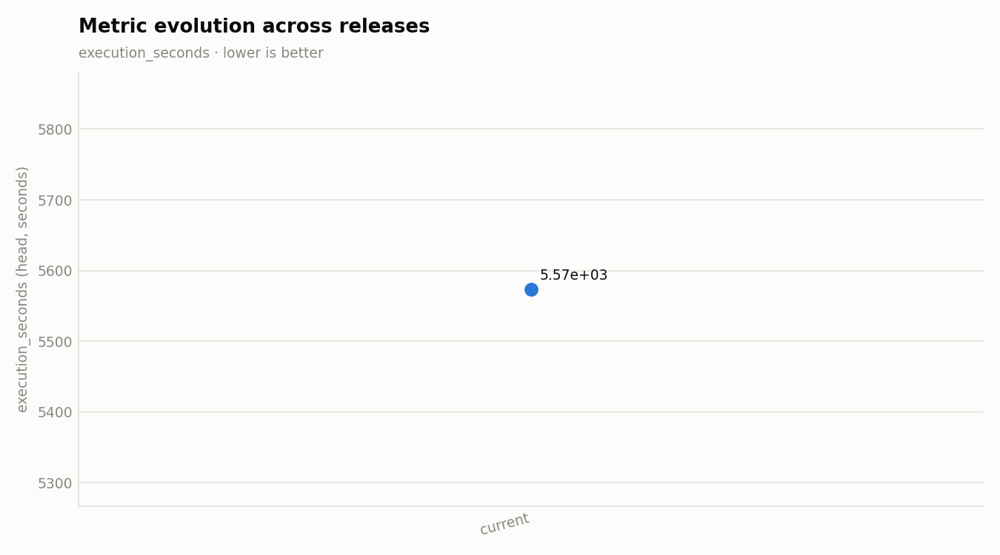

# Release v0.1.0

**Date:** 2026-08-28

## Change summary

### Features
- feat(ws8): relational generation by construction — relationships as config, joint FK draws, prompt constraints, marginal fidelity, ladder integrity (ADR 0022–0033)
- feat(preflight): step 10 free-text pool store + move schema to config/bq_schema (#10)
- feat: distinct/prompt_echoes yield diagnostics (echo vs saturated keyspace)
- feat: personal-GCP agents (deploy/interpret/audit) + ops/run/cost skills
- feat: teardown script (reverse-order cleanup, --full project delete)
- feat: run_e2e.sh — tier submit/poll/journal with EXPECT semantics
- feat: tiers.yaml run matrix + renderer with template drift guard
- feat: Cloud Build image + flex-template build scripts (mainline Dockerfile reuse)
- feat: model staging via Cloud Build (ModelScope+Kaggle -> GCS, manifest-gated)
- feat: budget + killswitch deploy script (hard cost cap at 90%)
- feat: billing killswitch function (budget alert -> detach billing)
- feat: snapshot public tables, extract DDL, create landing tables
- feat: personal-GCP storage/BQ script (buckets, datasets, DQ tables, bucket IAM)
- feat: personal-GCP IAM script (worker/build/killswitch SAs, minimal roles)
- feat: personal-GCP bootstrap script (project, billing, APIs, GAR keep-1)
- feat: scaffold personal-GCP E2E layer (env manifest + dry-run harness)
- feat: B.1 setup phase milestones — embed/index/pool timings to localize the 22-min stall
- feat: enforce pk.duplicate — PK dedup stage, PipelineConfig.pk_columns, --pk_cols, DAG param
- feat: strict_freetext fails loudly on LLM errors for vllm runs; engine_failure gates
- feat: Dataflow jobName carries a model slug derived from SDFB_MODEL_URI
- feat: vllm_dtype override enables bf16 Qwen on T4; Qwen-aware preflight + registry
- feat: bundle export scans recursively and redacts worker-image URIs
- feat: analysis gains batch-size-aware run flags + normalized entropy
- feat: probe mines SDFB_MILESTONE contract, vllm failure lines, run-id filter, engine labels
- feat: vendor e2e validation/probe/bundle scripts + report prompt from M4
- feat: row.duplicate + identity.unique BLOCKER gate rules with DLQ diversion
- feat: milestone instrumentation for DoFn setup/batches and vLLM client
- feat: SDFB_MILESTONE structured log contract in sdfb-core

### Fixes
- fix: fill free-text pools to target, route shaped strings off the LLM (2026-07-17 b1+b2 runs)
- fix: serialize vLLM spawn, drop free-text exemplar folding, probe memorization flags (2026-07-16 b1+b2 runs)
- fix: B.1 pool = one values-array completion, not n=32 blind choices
- fix: unclamp top_p/top_k on pool retries (Qwen generation_config pin)
- fix: DAG requests no_use_multiple_sdk_containers for vllm GPU workers
- fix: pool temperature retries, embed cap, vLLM server reuse (2026-07-16 5.4h run)
- fix: generic sampler fidelity + novel-only free-text pools (2026-07-15 E2E remediation)
- fix: vLLM 0.24 structured outputs, loud empty-yield fallback, deterministic reference sampling
- fix: final-review wave -- job-name sanitization, cost-cap hardening, report-recipe alignment
- fix: executable bit on 05_stage_models.sh and teardown.sh
- fix: run_e2e poll survives transient describe failures
- fix: resolve extract_ddl.py output at its real deterministic path
- fix: plumb vllm_max_model_len (default 8192) so the KV cache fits the GPU
- fix: strict_freetext covers mlx; weight engine_failure by lost batch size in gate
- fix: salt run_id per trigger (no cross-run seed replay); expose explicit seed param
- fix: declare pk_cols in flex-template metadata; pk_cols validation + CLI regression tests
- fix: GenerateRecordsDoFn drives ModelClient setup/teardown lifecycle
- fix: e2e_gcp_probe SAFE_OFFSET/ratio semantics, milestone name validation, eval-design caveat
- fix: correct uniqueness gate blind spots around synthesized identity values
- fix: reach identity_cols from the production Flex Template launch path
- fix: GPU dtype guard inspects the served model dir, not local_model_dir
- fix: loud freetext LLM fallback + fatal bf16-on-Turing guard in vLLM client
- fix: synthesize identity columns per row; never sample from reference (privacy)
- fix: derive per-batch seed from (run_id, batch_id) when --seed absent

### Docs
- docs: visual-first documentation convention for design docs (#8)
- docs: gcp-e2e-run recipe nits — report placeholder, bq --max_rows/--project_id
- docs: ADR 0016 + personal-GCP README + index updates
- docs: implementation plan for personal-GCP E2E layer (14 tasks, TDD)
- docs: E2E integration test matrix - tiered run configs beyond R1'-R4'
- docs: RUN_PLAYBOOK pass criteria - Dataflow job state + valid_count shortfall
- docs: scope L4-stockout maxWorkers reasoning to R4'; tier-agnostic rationale for T4 runs
- docs: consistent angle-bracket placeholders in RUN_PLAYBOOK run matrix
- docs: fix backwards R'-run GPU-tier references in RUN_PLAYBOOK prose
- docs: post-remediation M4 run matrix R1'-R4' with strict pass criteria
- docs: report prompt must extract fallback error=, vLLM lifecycle milestones, B.1 phase timings
- docs: refresh e2e report prompt for milestone contract; cross-link playbook + specs
- docs: fix misattributed fidelity citation; pin DCR/NNDR to tree-based kNN
- docs: evaluation framework design spec (tiered metrics, validation_data_history)
- docs: RAG layer design spec (BQ rag_chunks + VECTOR_SEARCH, idempotent embed job)
- docs: fix RUN_PLAYBOOK machine-type guidance contradiction
- docs: RUN_PLAYBOOK — GPU verdict, run matrix, Dataflow options, report recipe
- docs: register T4-safe Qwen3-4B model; document t4/Gemma incompatibility

### Tests
- test: lock _is_sequential edge branches; tighten entropy assertion to 1.0
- test: uniqueness gate edge cases + uniqueness DLQ pipeline_step mapping

### Other
- WS6: pipeline shape — pool store gate, VRAM-fit ignition, uniqueness modes (E2E-measured) (#11)
- WS5: free-text pools as a persisted artifact, generation-stage perf, and the RAG seeding experiment (#9)
- WS2 Phase A: standalone RAG package, rag_chunks persistence, pool scaling + per-column retrieval (#4)
- WS1: fix b2_library memorization (cardinality caps + TEMPORAL jitter) and lazy vLLM ignition (#3)
- default=ENGINE_DEFAULT
- job_id and intergration/test/job_id dir
- last settings.local.json
- adds DEPLOYMENT_PREREQUISITES.md * 2
- adds deployment_prerequisites.py
- adds DEPLOYMENT_PREREQUISITES.md
- gang of 5 for embedders: config.json, model.safetensors,tokenizer.json,tokenizer_config.json, special_tokens_map.json
- fix for embders gs://uri with localize_gcs_prefix
- Welcome synth for DB infra

## Before / after

- **Base:** no integration run landed for this release.

Base job: `n/a` · Head job: `2026-08-26_05_01_16-3186876581127148459`

### Performance

| Metric | Base | Head | Delta |
|---|---|---|---|
| execution_seconds | not measured | 5574 | not measured |
| dominant_stage_seconds | not measured | 1442 | not measured |
| counter_yielded | not measured | 10000000 | not measured |
| counter_failed | not measured | not measured | not measured |

### vLLM

| Metric | Base | Head | Delta |
|---|---|---|---|
| vllm_ignition_seconds | not measured | 25.81 | not measured |
| tokens_per_s | not measured | not measured | not measured |

### Quality

| Metric | Base | Head | Delta |
|---|---|---|---|
| dup_ratio_max | not measured | 0 | not measured |
| top_value_share_max | not measured | 1 | not measured |
| shape_recall_min | not measured | 0 | not measured |
| shape_precision_min | not measured | 0 | not measured |
| copy_fraction_max | not measured | 0.0022 | not measured |
| entropy_gap_max | not measured | 0.0391 | not measured |
| decile_ks_max | not measured | 0.1436 | not measured |

## Charts

_Evolution chart spans 0 prior tagged release(s) plus this one (execution_seconds, lower is better)._

---
_Generated deterministically by `scripts/release/make_release_report.py` — insights layer: `.claude/skills/release-report/SKILL.md`._
\n
## Insights

_Interpretation layer (`.claude/skills/release-report`), written 2026-08-29 on top of the generated tables above — none of the numbers or charts were edited. No ADC on the authoring machine: every statement below comes from the committed bundle and the run's worker logs; nothing was re-queried live. Parent columns are named by the generator's tokens; child columns are described, not named (their aliases share the token namespace)._

**Scope.** First tagged release, so there is no base side and every delta reads "not measured". The head job is the 2026-08-26 R6 run: the parent table and its FK child generated at **10,000,000 rows each in one Dataflow job** (wave 0 → wave 1, ADR 0030), `n1-highmem-8` × 2→4 workers with one T4 each, image `oss-pk-ready-6ed7b93`, `qwen3/4b-instruct-2507`. The deterministic tables read the **parent** bundle (`real/*_metrics.json`); the child's twins (`real/*_metrics_a_table.json`) are cited by hand here — the generator discovers one artifact set per job (backlog item below).

### Regression calls

No regression is callable against a base. Severity of the head-side readings, worst first:

| Reading | Call | Why |
|---|---|---|
| child stats-diff `decile_ks` **0.209 WARN** on one enforced-FK column (child bundle; not in the parent table above) | **INFO — documented v1 trade-off** | ADR 0031: the child draws whole parent key tuples from a 100k-key pool (`fk_key_pool_capped`; the parent holds 2.49M distinct keys), so the FK column's marginal is the pool's, not the source's. Referential integrity is what it buys: **0 orphans / 10,000,000 child rows** by an independent full join, `fk.orphan` BLOCKER fired 0 times |
| `decile_ks_max` 0.1436 (parent, `COL_006`) | INFO | within threshold (`ok`); the same column read 0.159 at 1M — sample-level noise on a heavy-tailed numeric |
| `shape_recall_min` 0 / `shape_precision_min` 0 | INFO — measurement artifact | the three parent identifier columns (`COL_045` opaque byte key, `ID_COL` UUID, `PK_COL` 24-hex PK) are near-unique-mask: exact-mask recall saturates at 0 for any faithful generator; the mass metric ADR 0026 designates for them, `shape_head_tv`, is **0.00 on all three**. The worst genuine shape gaps are on the child — a 12-char reference column at `shape_head_tv` 0.48 (a 29 % all-digit source shape reproduced at 0 %), a 31-char fixed-width code column at 0.24, a 12-char sparse reference column at 0.20 — all `copy_fraction` 0, all steerable, all already carrying `llm_prompt_constraint` |
| `copy_fraction_max` 0.0022 (`COL_050`) | INFO | after the identifier/domain exemption; `copy_fraction_raw` reaches 0.75 on a 5-char code column with 3,030 source distinct (`COL_051`) — in-domain collisions on a closed code set, not memorization. Live memorization probe: one INFO flag (`COL_041`, a day-granularity date domain), zero on the child |
| `top_value_share_max` 1 | INFO | 12 parent / 6 child columns are constants in source too (stats-diff `top1_delta` 0.000) — fidelity, not collapse |
| `dup_ratio_max` 0 · PK `uniqueness_ratio` 1.0 (10M/10M distinct, `max_repeat` 1) on both tables · `validation.pydantic_valid` = `generation.yielded` = 10,000,000 | PASS | |

### Bottleneck attribution (5,574 s wall)

| Phase | Minutes | Attribution |
|---|---|---|
| worker startup (image pull) | 15.4 | `workers_ready` at +15:22 — the GPU image; 8:03 on the 1M run the day before |
| pool branches (parent 7.0 · child 16.9, concurrent) | 16.9 | vLLM ignition 200 s operator-visible (65 s weight pull + fit + 43.7 s engine init + the 25.8 s `vllm_ignition_seconds` above + 65 s readiness handshake); ladders 304–537 s each; the child branch then spent ~6 min after its last pool on identifier/numeric domain fetches (a 944k-value identifier domain, ADR 0025/0027) |
| parent generate | 23.4 | `dominant_stage_seconds` 1,442 = `CreateRequests/…/Reshuffle` fused with GenerateRecords: 1,000 batches × 10k rows, `batch_done` p50 25.3 s → **7.1k rows/s** on 32 CPU threads; store-warm (`freetext_pool_store_hit`), no LLM call |
| parent PK enforce (`EnforceUniqueness/CombineByPk`) | 8.0 | a global combine over 10M keys — the ADR 0030 wave barrier: the child cannot start until this lands |
| child generate setup + generate | 3.2 + 16.5 | `fk_key_pool_bound key_tuples=100000 weighting=child_marginal` on every instance (side input), then 1,000 batches at p50 25.4 s → **10.2k rows/s** (45 columns vs the parent's 67) |
| BQ `FILE_LOADS` + cleanup | 13.2 | two 10M-row loads |

GPU: vLLM served pool builds for ~9 of the 93 minutes; `TotalGpuTime` 16,345 GPU-s = **272 GPU-minutes billed on four T4s**. `tokens_per_s` reads "not measured" because the probe has no vLLM throughput counter — not because vLLM was idle during the ladders.

Which commits plausibly shaped this profile: ADR 0030 (one job) put the parent's PK enforce + key side-input on the child's critical path (~12 min between the parent's last batch and the child's first); ADR 0031 is the 3.2-min child setup; ADR 0020/0023 (persisted, source-rejected pools) are why the generate stage never touches the GPU; ADR 0033 (this release, laptop-verified only — the head run predates it) removes the 1M run's failed pool-branch bundle (+8 min retry), one ~150 s ladder round per off-format-example column, and the sample-sized pool target on sparse columns.

### Optimization candidates

1. **CPU/GPU worker split** — pool branch on GPU workers, generate + PK enforce + loads on CPU-only workers (two jobs, or a store-warm replay that never requests a GPU): up to ~260 idle GPU-minutes per 10M relational job. Largest lever, no fidelity risk.
2. **Overlap the child with the parent's tail** — start the child's generate on the parent's PK-enforced keys as soon as the combine lands instead of after the side-input materialization; level-parallel scheduling for wider models (ROADMAP).
3. **PK enforce at 10M** — combiner lifting or skip-when-unique-by-construction for identifier-synthesized keys (8 min today, grows with rows).
4. **Image pull** — 8–15 min per launch; slimmer GPU image or a pre-pulled node image.
5. **Ladder cost** — ADR 0033's collapse exit + example preflight (measure on the next cold launch); raising `FREE_TEXT_POOL_MAX` past 512 for 45k–144k-distinct columns is a separate GPU-time decision.

### Follow-up backlog

- Next cold relational launch on an ADR 0033 image: the design doc's §8 milestone checks (`freetext_pool_ladder_retried` absent-or-recovered, sparse-column `target=512`, `format_collapse` at `attempts=2`, `length_clamped` on the 35-char narrative column, `freetext_pools_warm` on every generate setup).
- Probe: a vLLM tokens/s counter (`tokens_per_s`), and an FK-orphan check as a script (today an ad-hoc SQL in the E2E report).
- Release generator: discover multi-table bundles (`*_<table>.json` twins) and report per table — the child's 0-orphan result is this release's headline and is invisible to the deterministic tables.
- Fix the 28-char clause example on the child's 31-char fixed-width code column in the landing-table description; the engine now warns (`prompt_constraint_example_off_format`) but still spends one round on it.
- The FK-column marginal: co-partitioned join beyond the 100k key cap (ROADMAP).
