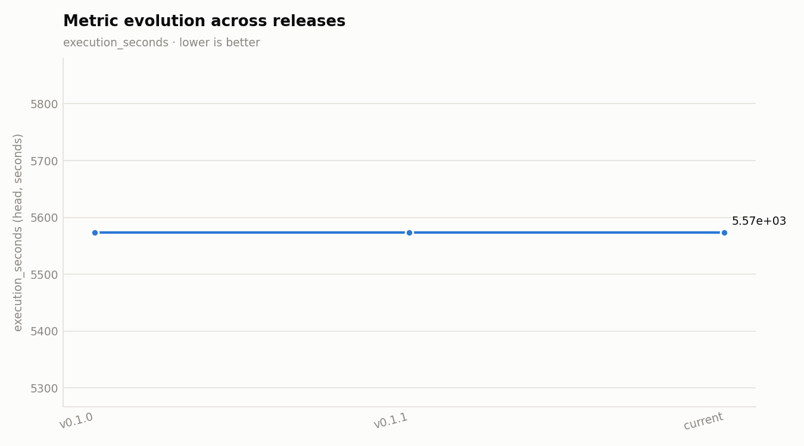

# Release v0.2.0

**Date:** 2026-09-08

## Change summary

### Features
- feat(ws10): generation throughput — single dedup barrier, shared engines, lazy embedder, Storage-API domains, initial_workers, multi-process SDK experiment (ADR 0034) (#15)

## Before / after

Base job: `2026-08-26_05_01_16-3186876581127148459` · Head job: `2026-08-26_05_01_16-3186876581127148459`

### Performance

| Metric | Base | Head | Delta |
|---|---|---|---|
| execution_seconds | 5574 | 5574 | 0 (unchanged) |
| dominant_stage_seconds | 1442 | 1442 | 0 (unchanged) |
| counter_yielded | 10000000 | 10000000 | 0 (unchanged) |
| counter_failed | not measured | not measured | not measured |

### vLLM

| Metric | Base | Head | Delta |
|---|---|---|---|
| vllm_ignition_seconds | 25.81 | 25.81 | 0 (unchanged) |
| tokens_per_s | not measured | not measured | not measured |

### Quality

| Metric | Base | Head | Delta |
|---|---|---|---|
| dup_ratio_max | 0 | 0 | 0 (unchanged) |
| top_value_share_max | 1 | 1 | 0 (unchanged) |
| shape_recall_min | 0 | 0 | 0 (unchanged) |
| shape_precision_min | 0 | 0 | 0 (unchanged) |
| copy_fraction_max | 0.0022 | 0.0022 | 0 (unchanged) |
| entropy_gap_max | 0.0391 | 0.0391 | 0 (unchanged) |
| decile_ks_max | 0.1436 | 0.1436 | 0 (unchanged) |

## Charts

_Evolution chart spans 2 prior tagged release(s) plus this one (execution_seconds, lower is better)._

---
_Generated deterministically by `scripts/release/make_release_report.py` — insights layer: `.claude/skills/release-report/SKILL.md`._

## Insights

_Interpretation layer (`.claude/skills/release-report`); the numbers in the
tables above are untouched._

**Evidence gap first.** The head job above is the v0.1.0 bundle, so every
delta reads "unchanged": no run of the code this release ships has a
promoted `real/*.json` bundle yet. What moved is read from the worker logs
of five 10M-row relational acceptance runs (two tables, FK enforced) in
[ADR 0034 § Acceptance evidence](../../adr/0034-generation-throughput-single-barrier-shared-engines.md)
and the figure `docs/designs/assets/throughput-evolution.png`; the
operator reports the merged code's own cold and warm acceptance runs under
50 minutes. To close the gap: export those two runs' bundles
(`scripts/e2e/e2e_bundle_export.py`, `real/` layout) into
`docs/releases/v0.2.0/evidence/<JOB_ID>/real/`, regenerate with
`scripts/release/make_release_report.py --version v0.2.0 --base-ref v0.1.1
--head-ref <sha> --out-dir docs/releases`, and commit with the
`[release-report]` marker.

**What this release changes on the same job shape** (10M rows per table,
`table_1` parent + `table_2` FK child, T4 workers): wall time 93.8 min on
the v0.1.0-era cold baseline (2026-08-29) → 76.5 min with one SDK process
per worker → 50.5 min with `sdk_containers=multi`; the two later multi runs
(52.5 min with pools rebuilt by the taint preflight, 56.9 min cold with the
CPU population embeds since reverted) are the regression story below.

**Bottleneck attribution, in order of minutes recovered:**

1. Generation was GIL-bound — one SDK process per worker, eight harness
   threads on one interpreter. The multi-process topology (ADR 0034 D6: a
   loopback-port spawn mutex, one vLLM server per worker shared by all
   processes) took a 10k-row batch from 26–29 s to 5.6–6.7 s.
2. Dedup ran three chained full-row shuffle barriers per table. One barrier
   with key-only PK/identity groups (`uniqueness_mode=exact`, D1) took
   dedup + load per table from 14.0 / 12.2 min to 3.4 / 3.0 min under multi,
   with identical DLQ envelopes and exact counts.
3. Thirty-two engine builds per table became one per process (D2,
   `engine_shared holders=`), and the embedder loads lazily (D3): a
   store-warm generate setup never opens a CUDA context beside vLLM.
4. A 944k-value identifier domain paged through the BigQuery REST iterator
   inside `DoFn.setup()` (5.5 min read as a "generation stall") now streams
   through the Storage Read API (D4).

**Regressions found during the acceptance cycle (both fixed before the
merge, severity high):**

- The Storage Read API fallback re-iterated a consumed iterator: on the
  first R7 pair every source-domain fetch failed, so the ADR 0023 rejection
  sets, identifier/numeric domains and the ADR 0033 pool-target sizing
  were silently inactive. Fixed with a fresh `QueryJob.result()` for the
  fallback and a per-process kill switch (`source_values_storage_api_disabled`,
  logged once). The worker service account still needs
  `roles/bigquery.readSessionUser`; until then every process pays one
  denied Storage attempt and pages over REST (22 s on the 09-08 run).
- CPU population embeds under multi (D8 rev. 1) starved the model pull
  (177.6 s vs 52.5 s) and the vLLM engine init (598.7 s) and turned a
  2.9-min population stage into 15.4 min. Reverted to the GPU with the
  fan-out bounded to `rag_embed_shards=2` and the pool branch waiting on
  the population (D8 rev. 2).

**Autoscaler churn:** both later multi runs dropped to 1–2 workers between
the parent and child stages and re-provisioned VMs for the child, ≈4 min
per job. `autoscaling=fixed` + `initial_workers=4` (D9) is the launch
setting for scale runs; tiers `R7`/`R7m` carry it.

**Backlog after this release:** flip the DAG default to `multi` once one
acceptance read shows at most two population embedders, ignition near
180–200 s with zero unfittable waits and no worker dip between stages;
slim the launcher image (10-min flex phase + 5-min boot); a quantized T4
checkpoint (the KV budget makes a 512-value ladder ≈4.4 min); B.2 pools
through the persisted store; the operator-owned clause example on
`col_1` (28 chars on a 31-char column, `prompt_constraint_example_off_format`).
