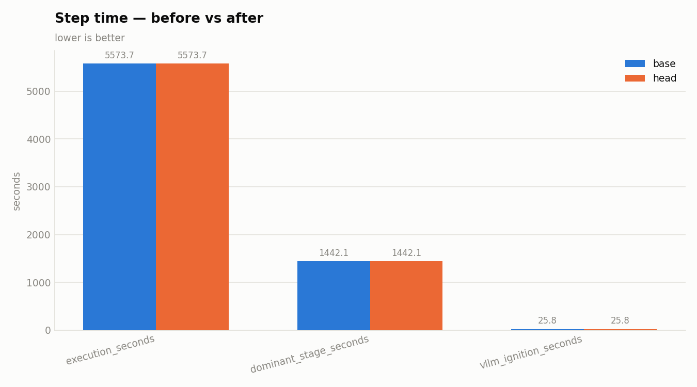
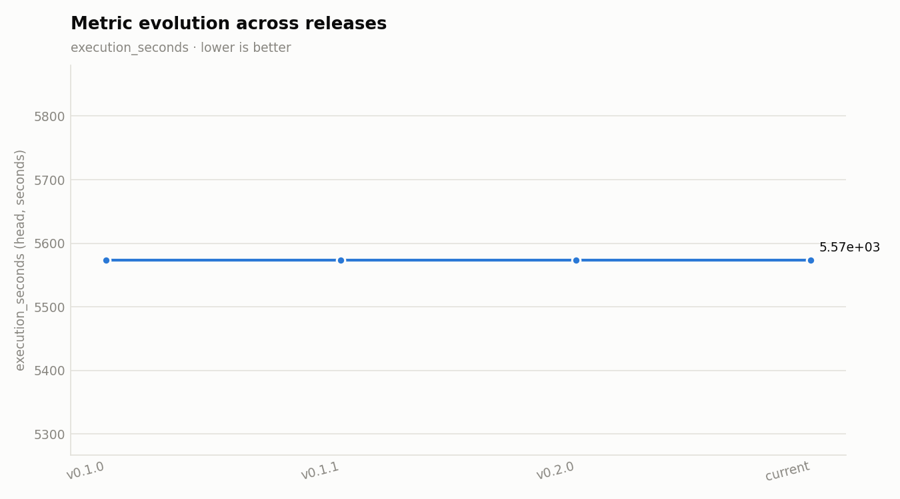

# Release v0.2.1

**Date:** 2026-09-09

## Change summary

### Docs
- docs(articles): article 2 — type system & freetext resolution: three drawio figures, lesson/fix ledger, 10k-sample section, references (#16)
- docs(releases): v0.2.0 insights [release-report]

## Before / after

Base job: `2026-08-26_05_01_16-3186876581127148459` · Head job: `2026-08-26_05_01_16-3186876581127148459`

### Performance

| Metric | Base | Head | Delta |
|---|---|---|---|
| execution_seconds | 5574 | 5574 | 0 (unchanged) |
| dominant_stage_seconds | 1442 | 1442 | 0 (unchanged) |
| counter_yielded | 10000000 | 10000000 | 0 (unchanged) |
| counter_failed | not measured | not measured | not measured |

### vLLM

| Metric | Base | Head | Delta |
|---|---|---|---|
| vllm_ignition_seconds | 25.81 | 25.81 | 0 (unchanged) |
| tokens_per_s | not measured | not measured | not measured |

### Quality

| Metric | Base | Head | Delta |
|---|---|---|---|
| dup_ratio_max | 0 | 0 | 0 (unchanged) |
| top_value_share_max | 1 | 1 | 0 (unchanged) |
| shape_recall_min | 0 | 0 | 0 (unchanged) |
| shape_precision_min | 0 | 0 | 0 (unchanged) |
| copy_fraction_max | 0.0022 | 0.0022 | 0 (unchanged) |
| entropy_gap_max | 0.0391 | 0.0391 | 0 (unchanged) |
| decile_ks_max | 0.1436 | 0.1436 | 0 (unchanged) |

## Charts

_Evolution chart spans 3 prior tagged release(s) plus this one (execution_seconds, lower is better)._

---
_Generated deterministically by `scripts/release/make_release_report.py` — insights layer: `.claude/skills/release-report/SKILL.md`._
