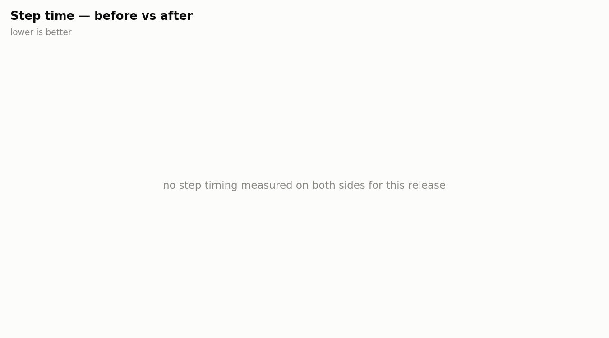
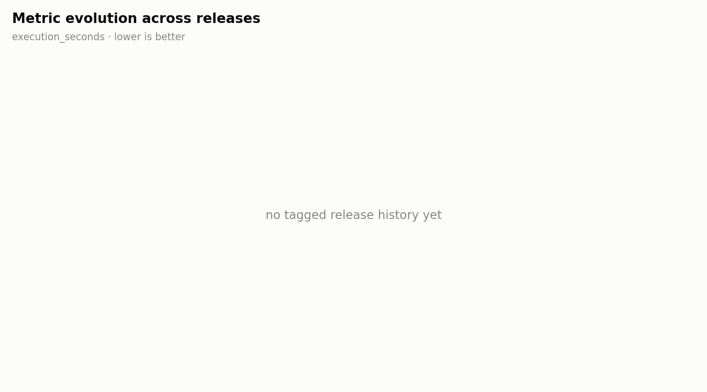

# Release v0.5.1

**Date:** 2026-09-15

## Change summary

### Fixes
- fix(dsg): thelook tables with the public and bq_schema schemas, versioned sync branches (#26)

## Before / after

- **Base:** no integration run landed for this release.
- **Head:** no integration run landed for this release.

Base job: `n/a` · Head job: `n/a`

### Performance

| Metric | Base | Head | Delta |
|---|---|---|---|
| execution_seconds | not measured | not measured | not measured |
| dominant_stage_seconds | not measured | not measured | not measured |
| counter_yielded | not measured | not measured | not measured |
| counter_failed | not measured | not measured | not measured |

### vLLM

| Metric | Base | Head | Delta |
|---|---|---|---|
| vllm_ignition_seconds | not measured | not measured | not measured |
| tokens_per_s | not measured | not measured | not measured |

### Quality

| Metric | Base | Head | Delta |
|---|---|---|---|
| dup_ratio_max | not measured | not measured | not measured |
| top_value_share_max | not measured | not measured | not measured |
| shape_recall_min | not measured | not measured | not measured |
| shape_precision_min | not measured | not measured | not measured |
| copy_fraction_max | not measured | not measured | not measured |
| entropy_gap_max | not measured | not measured | not measured |
| decile_ks_max | not measured | not measured | not measured |

## Charts

_Evolution chart spans 12 prior tagged release(s) plus this one (execution_seconds, lower is better)._

---
_Generated deterministically by `scripts/release/make_release_report.py` — insights layer: `.claude/skills/release-report/SKILL.md`._
