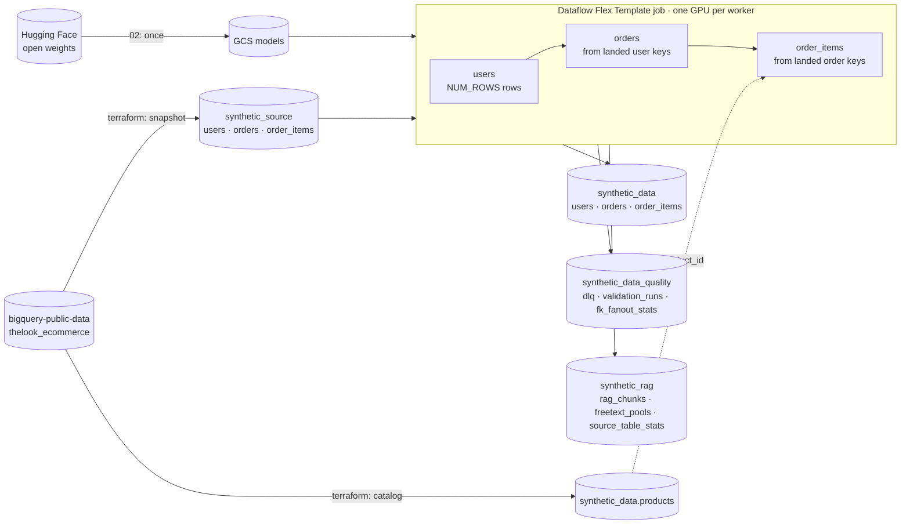

# Synthetic data generation with self-hosted LLMs (Python)

This pipeline is part of the [Dataflow synthetic data generation solution guide](../../use_cases/Synthetic_Data_Generation.md).

> [!NOTE]
> Developed at [albertols/synthetic-llm-dataflow-bigquery]({source_repo}),
> where the decision records and run reports live. This copy corresponds to
> release `{ref}` ([`{short_sha}`]({source_repo}/tree/{sha})); updates arrive
> here as ordinary pull requests.

## Deploy and run on Google Cloud

The job reads the DDL and a bounded sample of each source table, runs an
open-weight LLM with vLLM on NVIDIA L4 (or T4) Dataflow workers, and writes validated
synthetic rows to BigQuery. The demo generates three related tables from the
fictitious [`thelook_ecommerce`](https://console.cloud.google.com/marketplace/product/bigquery-public-data/thelook-ecommerce)
public dataset, keeping every foreign key valid.



| Step | Command (from this directory) | What it does |
| :-- | :-- | :-- |
| 0 | `terraform apply` in [`terraform/synthetic-llm-dataflow-bigquery`](../../terraform/synthetic-llm-dataflow-bigquery/README.md) | Service accounts, Artifact Registry, bucket, datasets, source snapshots, landing tables with the public schemas, `config/bq_schema` tables; writes `scripts/00_set_variables.sh` |
| 1 | `./scripts/01_build_and_push_container.sh` | Builds the launcher + GPU worker image with Cloud Build |
| 2 | `./scripts/02_stage_models.sh` | Copies Gemma 4 E4B-it (or `MODEL=qwen3-4b`) and the bge-small embedder from Hugging Face (or `MODEL_SOURCE=modelscope`) to GCS, once |
| 3 | `./scripts/03_build_flex_template.sh` | Publishes the Flex Template spec |
| 4 | `./scripts/04_run_dataflow.sh [NUM_ROWS]` | Launches users → orders → order_items in one job with `config/relationships/gcp_public_fk_example.yaml` and prints `RUN_ID`; or `terraform apply -var launch_job=true` |
| 5 | `./scripts/05_verify_run.sh RUN_ID` | Row counts, PK duplicates, FK orphans and the `validation_runs` verdicts |

The model repositories are public, so step 2 needs no credentials. The
[Terraform README](../../terraform/synthetic-llm-dataflow-bigquery/README.md)
shows which tables come from `thelook_ecommerce`, the configuration files the
job reads, how the weights reach the workers, and which GPU, machine type and
vLLM dtype go together: an L4 on G2 runs either model with `vllm_dtype=auto`;
a T4 on N1 runs only `qwen3-4b`, with `vllm_dtype=float16`. Workers use private IPs only
and run as the dedicated service account created by Terraform.

Local checks, the same ones the repository CI runs:

```sh
uv sync --group dev                                  # or: pip install -r requirements.txt -r requirements-dev.txt
uv run pytest packages/sdfb-tests/tests -m "not gpu and not gcp" -q
yapf --diff -r --style yapf . && pylint --rcfile ../pylintrc .
```

To clean up, cancel any running job and run `terraform destroy` in the
Terraform directory.

---

