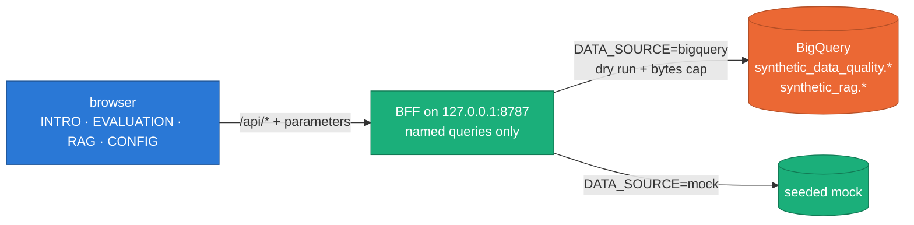

# Synthetic Platform

A self-hosted web app that reads and explains this project's data:
evaluations, validation runs, source statistics, the RAG embedding space and
the generation knobs. It reads BigQuery through a local backend with named,
read-only, bytes-capped queries, or runs entirely on a seeded mock.
The rule that allows it is [ADR 0042](../docs/adr/0042-self-hosted-platform-gui.md);
the pipeline never depends on it, and it is not part of the Dataflow Solution
Guides copy.



_The browser never sends SQL and never holds credentials._

## Quick start

Requires Node 22 LTS and npm 10.

```bash
cd gui
npm ci
npm run dev        # web on http://127.0.0.1:5173 (the BFF joins in task G0b)
npm run check      # typecheck, lint, unit tests, build, size budgets, contract drift
npm run e2e        # Playwright + axe (local: installed Google Chrome)
```

`/kit` shows the design system (tokens, components, chart and 3-D frames)
live, in both themes.

| Tab        | Shows                                                                                   |
| :--------- | :-------------------------------------------------------------------------------------- |
| INTRO      | the pipeline tour, "how it works" cards, the package map, a glossary                    |
| EVALUATION | evaluations, the run view, the compare view                                             |
| RAG        | the 384-d embedding explorer, the GReaT/embedder lab, FAISS, retrieval, free-text pools |
| CONFIG     | the knob console, the scenario calculator, source statistics, guardrails                |

## Documentation

- [`docs/ARCHITECTURE.md`](docs/ARCHITECTURE.md) — workspace, routes, shared
  components and their APIs, size budgets, dependencies, the ownership map.
- [`docs/UX.md`](docs/UX.md) — layout, InfoHint, chart, 3-D, motion and
  accessibility rules.
- [`docs/DATA_CONTRACTS.md`](docs/DATA_CONTRACTS.md) — the concept contract,
  the generated contracts, mock and BigQuery modes.
- [`BRANDING.md`](BRANDING.md) — name, mark, palette with measured contrast.
- [`ATTRIBUTION.md`](ATTRIBUTION.md) — third-party marks, figures and fonts.
