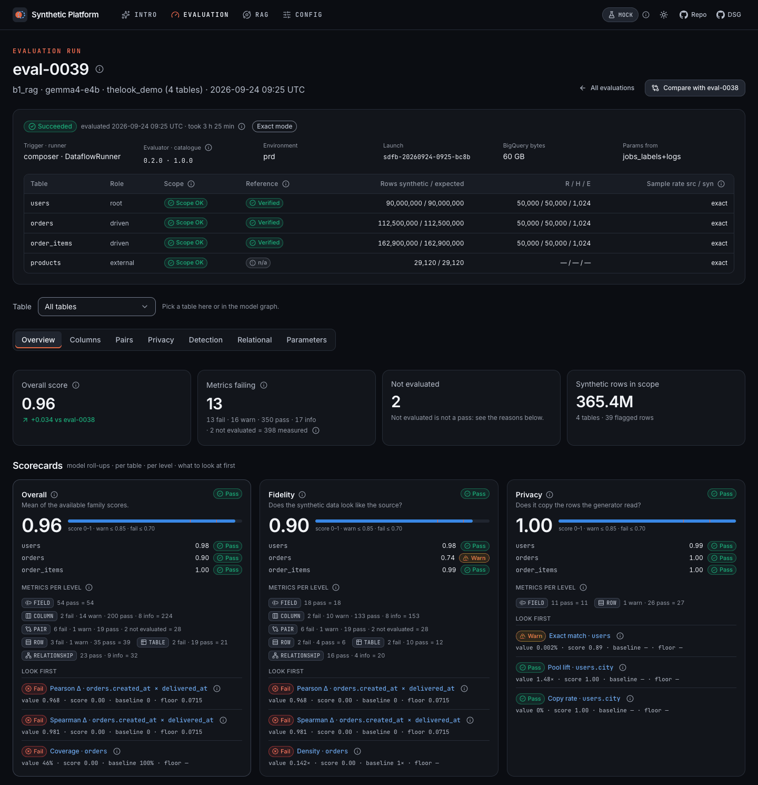
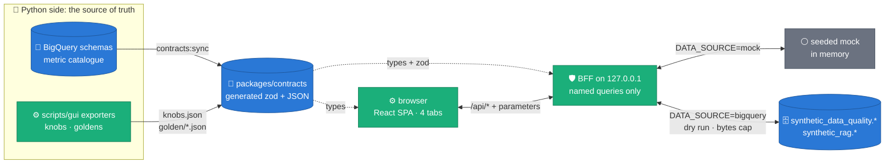
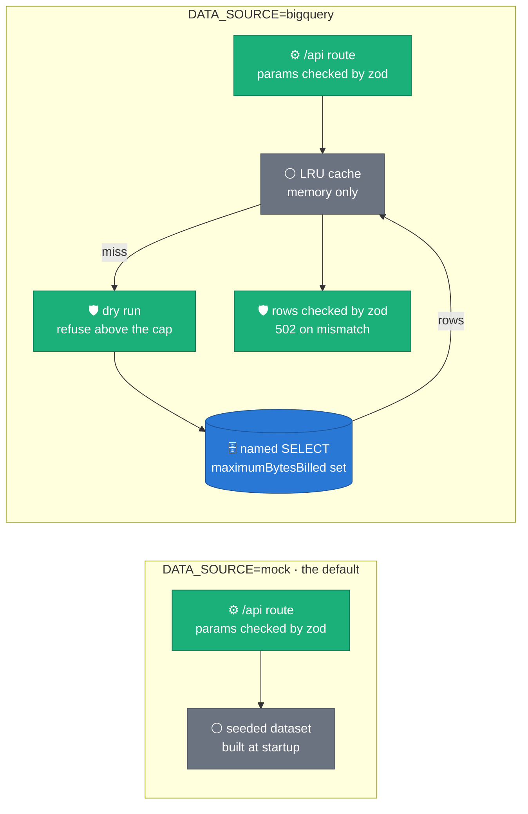
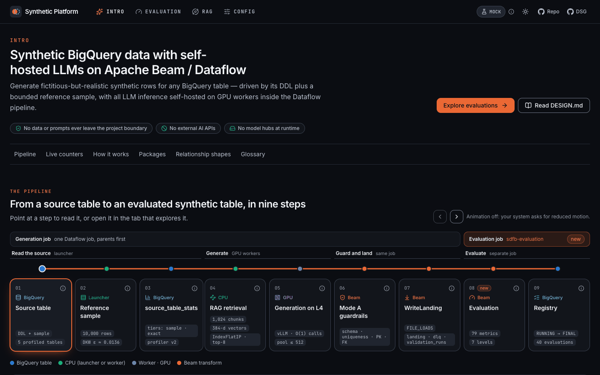
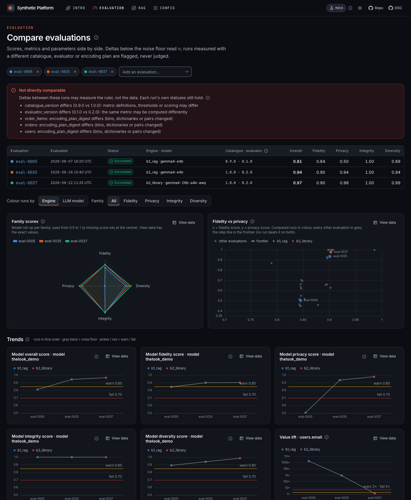
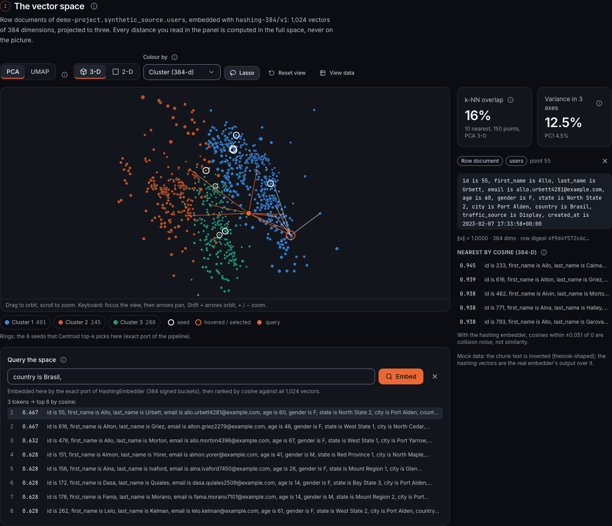
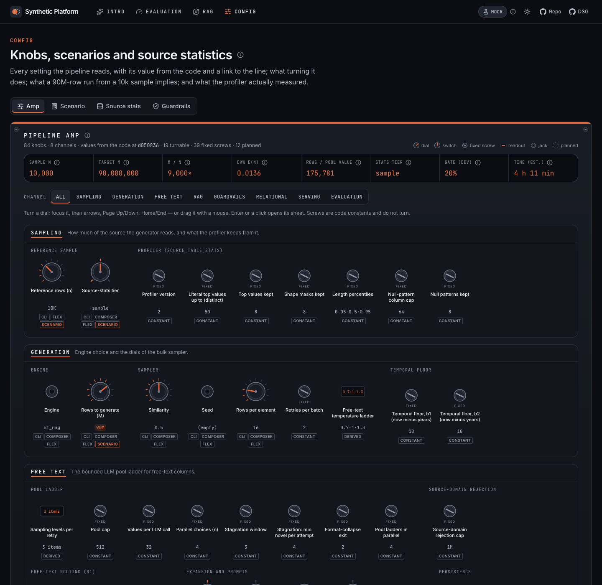
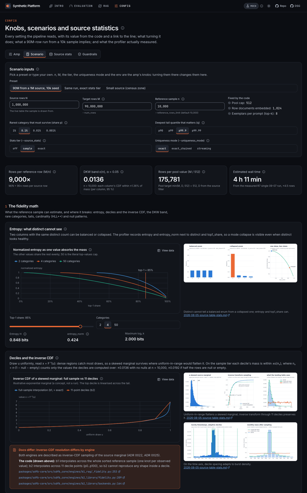
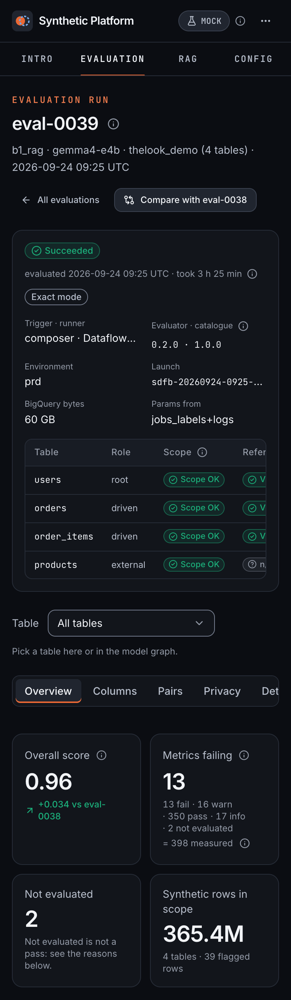

# Synthetic Platform

A local-first web app that reads and explains this project's data: evaluations,
validation runs, source statistics, the RAG embedding space and the generation
knobs. A React single-page app talks to a small Fastify backend-for-frontend (the
BFF) on `127.0.0.1`. The BFF answers from a seeded mock (the default; no GCP
needed) or from the project's BigQuery tables through named, read-only,
bytes-capped queries. The pipeline never depends on it, and it is not part of the
Dataflow Solution Guides copy. The rule that allows it is
[ADR 0042](../docs/adr/0042-self-hosted-platform-gui.md); the system view is
[`docs/DESIGN.md` §12](../docs/DESIGN.md#12-platform-gui).



_One evaluation at a glance: which tables were in scope, what failed, and which
family each failure belongs to. Mock mode, 1440 px; every screenshot's
provenance is in [`docs/assets/README.md`](docs/assets/README.md)._

- [Architecture](#architecture)
- [Quickstart: mock mode](#quickstart-mock-mode)
- [Quickstart: live mode (BigQuery)](#quickstart-live-mode-bigquery)
- [Environment variables](#environment-variables)
- [The four tabs](#the-four-tabs)
- [Developer loop](#developer-loop)
- [Future Cloud Run deployment](#future-cloud-run-deployment)
- [Documentation](#documentation)

## Architecture



_Types flow one way, from Python to TypeScript, and CI fails when they drift.
The browser holds no SQL and no credentials: it names a route and passes
parameters. Both data sources answer the same routes with the same shapes._

Details: [`docs/ARCHITECTURE.md`](docs/ARCHITECTURE.md) (routes, budgets, BFF
guards, scoring parity) and [`docs/DATA_CONTRACTS.md`](docs/DATA_CONTRACTS.md)
(what generates which type, drift checks).

## Quickstart: mock mode

Requires Node ≥ 22.12 and npm ≥ 10 (`engines` in `package.json`). No GCP
account, no credentials.

```bash
cd gui
npm ci
npm run build   # the SPA → apps/web/dist
npm start       # the BFF: mock data, serves the SPA
```

Open <http://127.0.0.1:8787>. The server logs
`Synthetic Platform BFF on http://127.0.0.1:8787 — data source mock`, then
`data provider ready in … ms` once the mock dataset is built (pages load as soon
as the socket is open). Ctrl-C stops it. Without `npm run build`, the API still
answers but every page returns 503 "The web app is not built".

The mock is 40 invented evaluations of a thelook-shaped model
(`users ──< orders ──< order_items >── products`), computed by the same maths
the views use; [`docs/DATA_CONTRACTS.md`](docs/DATA_CONTRACTS.md#the-mock-world-packagesmock)
describes its storyline and edge cases.

## Quickstart: live mode (BigQuery)

```bash
gcloud auth application-default login   # Application Default Credentials, used by the BFF only
cd gui
npm ci && npm run build
DATA_SOURCE=bigquery GCP_PROJECT=my-project npm start
```



_One panel per `DATA_SOURCE` value. Mock mode needs no credentials and bills
nothing; live mode prices every query before it runs and refuses it above the
cap._

What live mode guarantees:

- **A bytes cap on every query.** The BFF dry-runs each query first, adds its
  estimate to the `x-bq-bytes-estimate` response header (the UI shows it next to
  the data it cost), and refuses the query with HTTP 422 when the estimate is
  above `MAX_BYTES_BILLED`. The job itself also runs with `maximumBytesBilled`
  set, so BigQuery enforces the cap too
  ([restrict the bytes billed per query](https://docs.cloud.google.com/bigquery/docs/best-practices-costs)).
  The default is 10 GiB (`10 * 1024 ** 3` bytes in `apps/server/src/config.ts`);
  change it per run, e.g. 1 GiB:
  `MAX_BYTES_BILLED=1073741824 DATA_SOURCE=bigquery GCP_PROJECT=my-project npm start`.
  `/api/health` reports the active cap as `max_bytes_billed`.
- **Read-only named queries only.** The browser never sends SQL. The BFF runs
  only the queries registered in
  [`apps/server/src/queries/registry.ts`](apps/server/src/queries/registry.ts),
  binds client values as
  [query parameters](https://docs.cloud.google.com/bigquery/docs/parameterized-queries),
  and `assertReadOnly` rejects any statement that is not a single `SELECT` or
  `WITH`. The GUI writes nothing to BigQuery or GCS. Your ADC may hold more than
  BigQuery Data Viewer and Job User; read-only then rests on these named
  `SELECT`s (ADR 0042 D2).
- **Binds `127.0.0.1`.** `HOST` defaults to loopback, and a Host / Origin guard
  refuses requests addressed to any other name (a DNS-rebinding page) or sent
  from another site. A non-loopback `HOST` in live mode prints a warning banner
  at startup.
- **Never persists fetched rows.** Results live in an in-memory LRU
  (`CACHE_MAX_ENTRIES`, `CACHE_TTL_SECONDS`) and are gone when the process
  exits. The credentials never leave the BFF process.
- **Rows must match the contract.** Live rows are validated against the zod
  types generated from the Python schemas. A mismatch is a 502 naming the
  failing paths, never a silent pass; a vocabulary value newer than the
  contract passes as text with an `x-contract-warnings` header.

Without `GCP_PROJECT`, startup stops with
`GCP_PROJECT: GCP_PROJECT is required when DATA_SOURCE=bigquery`.

## Environment variables

Read and validated at startup by
[`apps/server/src/config.ts`](apps/server/src/config.ts); an invalid value stops
the server with one line per variable.

| Variable            | Default                        | What it does                                                                                                           |
| :------------------ | :----------------------------- | :--------------------------------------------------------------------------------------------------------------------- |
| `DATA_SOURCE`       | `mock`                         | `mock` or `bigquery`                                                                                                   |
| `GCP_PROJECT`       | —                              | required when `DATA_SOURCE=bigquery`: the project the queries run in (a GCP project id)                                |
| `BQ_LOCATION`       | `europe-west3`                 | the BigQuery location of the datasets                                                                                  |
| `QUALITY_DATASET`   | `synthetic_data_quality`       | the evaluation and validation dataset                                                                                  |
| `RAG_DATASET`       | `synthetic_rag`                | the RAG, free-text pool and source-stats dataset                                                                       |
| `MAX_BYTES_BILLED`  | `10737418240` (10 GiB)         | the per-query cap: the dry-run check and the job's `maximumBytesBilled`                                                |
| `HOST`              | `127.0.0.1`                    | the interface the BFF binds                                                                                            |
| `PORT`              | `GUI_SERVER_PORT`, then `8787` | the port the BFF listens on                                                                                            |
| `GUI_SERVER_PORT`   | `8787`                         | the BFF port when `PORT` is unset; the Vite dev proxy targets it                                                       |
| `GUI_WEB_PORT`      | `5173`                         | the Vite dev server; the Host guard also accepts it, because the dev proxy forwards the browser's `Host`               |
| `ALLOWED_HOSTS`     | empty                          | extra `host:port` values the Host / Origin guard accepts, comma-separated (e.g. a container published on another port) |
| `STATIC_DIR`        | `apps/web/dist`                | the built SPA the BFF serves                                                                                           |
| `CACHE_MAX_ENTRIES` | `500`                          | entries in the query-result LRU (bigquery mode)                                                                        |
| `CACHE_TTL_SECONDS` | `300`                          | how long a cached result lives                                                                                         |
| `LOG_LEVEL`         | `info`                         | `fatal`, `error`, `warn`, `info`, `debug`, `trace` or `silent`                                                         |

Read by the tooling, not the server:

| Variable                             | Read by                              | What it does                                                                                                 |
| :----------------------------------- | :----------------------------------- | :----------------------------------------------------------------------------------------------------------- |
| `GUI_E2E_PORT`                       | `playwright.config.ts`, Vite preview | the port of the BFF Playwright starts (default `4173`)                                                       |
| `GUI_E2E_SKIP_BUILD`                 | `playwright.config.ts`               | `1` serves the existing `apps/web/dist`; `0` always rebuilds; unset rebuilds only a stale build              |
| `GUI_SHOTS_DIR` / `GUI_SHOTS_SUFFIX` | the `screenshots of …` e2e tests     | set the directory to capture screenshots into; the suffix is appended by the smoke and CONFIG tests          |
| `GUI_BASE_REF`                       | `scripts/check-owned-paths.mjs`      | the base the ownership gate diffs against when `--base` is not given (default `feat/gui-synthetic-platform`) |
| `CI`                                 | `playwright.config.ts`               | bundled Chromium instead of the installed Chrome, one retry, two workers                                     |

When several worktrees share one machine, give each its own `GUI_E2E_PORT`,
`GUI_WEB_PORT` and `GUI_SERVER_PORT`
([table](docs/ARCHITECTURE.md#ports--each-worktree-sets-its-own)).

## The four tabs

**INTRO** (`/`) — the pipeline as a nine-step tour, "how it works" cards, the
package map, the relationship shapes and a glossary, each step linking to the
tab that explores it.



**EVALUATION** (`/evaluation`) — the list of evaluations, one run's scorecards
and drill-downs (columns, pairs, privacy, detection, relational), and a compare
view that flags runs measured with a different catalogue, evaluator or encoding
plan instead of judging them.



**RAG** (`/rag`) — the 384-d embedding space in 3-D (2-D fallback), the
row-to-sentence and embedder lab, the exact FAISS index, the seed strategies
and the free-text pools, computed in the browser by exact ports of the
pipeline's code.



**CONFIG** (`/config`) — the Pipeline amp (every knob with its value from the
code and a link to the line), the scenario calculator, the source-stats
explorer and the guardrails.





Every view also works at 390 px, where tables scroll inside their own frame:



`/kit` shows the design system (tokens, components, chart and 3-D frames) live,
in both themes.

## Developer loop

```bash
npm run dev     # BFF (tsx watch) + Vite on http://127.0.0.1:5173, /api proxied to the BFF
npm run check   # typecheck → lint (ESLint + Prettier) → unit tests → build → size budgets → contracts:check
npm run e2e     # Playwright + axe over the built app, desktop 1440 px and mobile 390 px, BFF in mock mode
```

`npm run e2e` locally drives the installed Google Chrome; CI uses Playwright's
bundled Chromium. It rebuilds the SPA only when the build is stale.

**Contracts.** `npm run contracts:sync` regenerates
`packages/contracts/generated/**` from the Python side;
`npm run contracts:check` regenerates into a temporary directory and fails on
any difference (CI runs it inside `npm run check`). Never edit `generated/**`
by hand.

**Exporters** (`scripts/gui/*`, Python). `export_knobs.py` writes
`knobs.json`, `relationships.json` and `dlq_rules.json`;
`export_golden_fixtures.py` writes `golden/*.json` (the scoring cases come from
`export_scoring_golden.py`). They run from the repository root in the root uv
workspace env, the one `uv sync --group dev` makes, which is what CI's
`exports` job uses. A worktree that must not share `.venv` points uv at its own
env, as this branch did:

```bash
UV_PROJECT_ENVIRONMENT=$PWD/.venv-gui uv run python scripts/gui/export_knobs.py            # --check in CI
UV_PROJECT_ENVIRONMENT=$PWD/.venv-gui uv run python scripts/gui/export_golden_fixtures.py  # --check in CI
cd gui && npm run contracts:sync
```

The evaluator (`packages/sdfb-evaluation`) is a separate uv project that the
root env does not install; `export_scoring_golden.py` imports its scoring
module from source and needs only numpy and PyYAML.

**Screenshots.** `GUI_SHOTS_DIR=/path/to/dir npx playwright test -g screenshots`
runs the screenshot tests in every spec, at both widths
([provenance](docs/assets/README.md)).

**Repository figures.** `npm run assets:sync` copies the repo figures the tabs
show into `apps/web/public/assets` (with `provenance.json`); `assets:check`
verifies them in CI.

**Ownership for parallel work.** Foundation code (shell, components, BFF,
packages, scripts, docs) and each tab's folder have one owner;
`npm run owned-paths -- feat/gui-<tab>` fails a tab branch that edits a path it
does not own. The map and its JSON block are in
[`docs/ARCHITECTURE.md` § Ownership map](docs/ARCHITECTURE.md#ownership-map).

## Future Cloud Run deployment

Not deployed. [`Dockerfile`](Dockerfile) builds a private image of the BFF and
the built SPA (multi-stage, `node:22-slim`, runs as `node`):

```bash
docker build -f gui/Dockerfile -t synthetic-platform gui
docker run --rm -p 127.0.0.1:8787:8787 synthetic-platform   # mock data; publish on loopback only
```

Inside the container the BFF binds `0.0.0.0` so the port can be published, so
publish it on `127.0.0.1` only. If it ever runs on Cloud Run:

- **Identity-Aware Proxy in front is required**
  ([IAP for Cloud Run](https://docs.cloud.google.com/iap/docs/enabling-cloud-run)).
  Never public: no `allUsers` invoker, no unauthenticated access.
- The service account holds only BigQuery Data Viewer and Job User, so IAM
  enforces read-only as well as the named queries.
- **The Host / Origin guard must learn HTTPS first.** It accepts only
  `host:port` names and `http://` origins. Cloud Run is reached as
  `https://<service>.run.app`, whose `Host` header carries no port, so today
  every request would get a 403. `ALLOWED_HOSTS` cannot express that host
  (its entries need a port).

The deployment modes are drawn in
[`docs/DESIGN.md` §12](../docs/DESIGN.md#12-platform-gui).

## Documentation

- [`docs/ARCHITECTURE.md`](docs/ARCHITECTURE.md) — workspace, routes, shared
  components and their APIs, size budgets with measured sizes, the BFF guards,
  scoring parity, CSP notes, dependencies, the ownership map.
- [`docs/DATA_CONTRACTS.md`](docs/DATA_CONTRACTS.md) — which Python files
  generate which types, drift checks, the `metrics_info` identity, how to add a
  metric, the mock world.
- [`docs/UX.md`](docs/UX.md) — layout, InfoHint, chart, 3-D, motion and
  accessibility rules.
- [`BRANDING.md`](BRANDING.md) — name, mark, palette with measured contrast.
- [`ATTRIBUTION.md`](ATTRIBUTION.md) — third-party marks, figures and fonts.
- [`docs/assets/README.md`](docs/assets/README.md) — how each screenshot was
  made.
