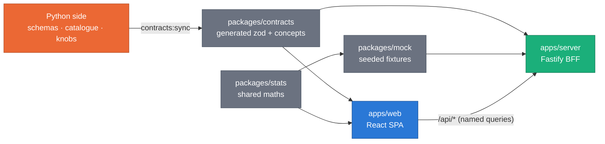
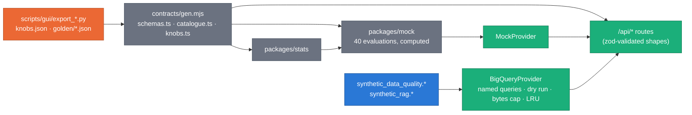

# Synthetic Platform — architecture

**Claim: one npm workspace, a React SPA and a small BFF, whose types are generated
from the Python side; the browser never holds SQL or credentials.** The rule
that allows the GUI is [ADR 0042](../../docs/adr/0042-self-hosted-platform-gui.md);
the system view is [`docs/DESIGN.md` §12](../../docs/DESIGN.md#12-platform-gui).



_Arrows are imports (and the one generation step from Python). Nothing in
`packages/` imports an app; `apps/web` never imports `apps/server`._

## Workspace

| Path                 | What                                                                                              | Owner                             |
| :------------------- | :------------------------------------------------------------------------------------------------ | :-------------------------------- |
| `apps/web`           | React 19 + TypeScript (strict) + Vite 8 SPA                                                       | G0a (shell, kit), tabs (features) |
| `apps/server`        | Fastify BFF: named read-only BigQuery queries or the mock provider; serves `apps/web/dist`        | G0b                               |
| `packages/contracts` | zod types generated from the Python side (`generated/**`), the concept contract and concept files | G0b (+ one concept file per tab)  |
| `packages/stats`     | Pure TS maths shared by web and mock (DKW, Wilson, TVD, hashing embedder …)                       | G0b                               |
| `packages/mock`      | Seeded, self-consistent mock data                                                                 | G0b                               |
| `scripts/`           | `check-owned-paths.mjs`, `assets-sync.mjs`                                                        | G0a                               |
| `../scripts/gui/`    | Python exporters: `export_knobs.py` (knobs.json), `export_golden_fixtures.py` (golden/*.json)     | G0b                               |

## The web app


_Orange is the shell chunk (budget 200 kB gzip); blue boxes are lazy chunks.
Dashed arrows are dynamic imports._

### Routes (code-based; `src/router.tsx`)

| Path                        | Module                                          | Search params (zod, owned by the tab)   |
| :-------------------------- | :---------------------------------------------- | :-------------------------------------- |
| `/`                         | `features/intro/route.tsx`                      | —                                       |
| `/evaluation`               | `features/evaluation/route.tsx` `listComponent` | `listSearchSchema` (filters)            |
| `/evaluation/$evaluationId` | `runComponent`                                  | `runSearchSchema`                       |
| `/evaluation/compare`       | `compareComponent`                              | `compareSearchSchema` (`ids` + filters) |
| `/rag`                      | `features/rag/route.tsx`                        | `table`, `digest`, `embedder`           |
| `/config`                   | `features/config/route.tsx`                     | `knob`, `scenario`                      |
| `/kit`                      | `app/kit/KitPage.tsx`                           | — (design-system reference)             |

**Route-module contract.** A tab's `route.tsx` exports its zod search
schema(s) and lazy component(s) (`lazyRouteComponent(() => import("./Page"), "Page")`).
Route modules are imported by the router, so they sit in the shell chunk:
write their schemas with **`zod/mini`** and keep page code behind the lazy
import. Inside a page, read typed params with `getRouteApi("/rag").useSearch()`
(avoids importing the router). Each route sets `staticData.title` (document
title and the navigation announcement).

### Shared components (foundation; tabs consume, never edit)

| Import                                        | API                                                                                                                                                                                                 | Notes                                                                                                                                                                                                                                                                                                                                                                                                                                                                                                                                                                                                                   |
| :-------------------------------------------- | :-------------------------------------------------------------------------------------------------------------------------------------------------------------------------------------------------- | :---------------------------------------------------------------------------------------------------------------------------------------------------------------------------------------------------------------------------------------------------------------------------------------------------------------------------------------------------------------------------------------------------------------------------------------------------------------------------------------------------------------------------------------------------------------------------------------------------------------------- |
| `@/lib/concepts`                              | `getConcept(id)`, `useConcept(id)`, `useConcepts()`, `listConcepts()`, `loadConcepts()`, types `Concept`, `ConceptLink`                                                                             | Registry merged from `packages/contracts/src/concepts/*.ts` by `import.meta.glob`. `core.ts` is eager; the rest is one lazy batch (prefetched at idle)                                                                                                                                                                                                                                                                                                                                                                                                                                                                  |
| `@/components/InfoHint`                       | `<InfoHint concept side? size? />`                                                                                                                                                                  | Radix Popover: hover 150 ms **and** click / Enter / Space; Esc closes; title, level, purpose, `<Formula>`, `<MiniDiagram>`, interpretation, pitfalls, links (`target=_blank`, `rel="noopener noreferrer"`). Unknown id → dev `console.error` + neutral icon                                                                                                                                                                                                                                                                                                                                                             |
| `@/components/Formula`                        | `<Formula tex display? />`                                                                                                                                                                          | KaTeX, lazy; TeX source shown until loaded; MathML for screen readers                                                                                                                                                                                                                                                                                                                                                                                                                                                                                                                                                   |
| `@/components/MiniDiagram`                    | `<MiniDiagram id />`, `hasDiagram(id)`                                                                                                                                                              | `src/components/diagrams/<name>.tsx` → `core:<name>`; `src/features/<tab>/diagrams/<name>.tsx` → `<tab>:<name>` (tabs add diagrams in their own folder)                                                                                                                                                                                                                                                                                                                                                                                                                                                                 |
| `@/components/ChartFrame`                     | `<ChartFrame title concept? option data height? empty? description? actions? columns? footer? onEvents? onReady? />`                                                                                | ECharts via `echarts/core` (lazy); token theme; "View data" → `DataTableFallback`; `empty.when` or `data=[]` → labelled empty state; `dataset.source = data` when `option.dataset` is absent; no animation under reduced motion. `onEvents`: `Record<eventName, (params: unknown) => void>` bound with `chart.on/off`, rebound when the map changes; `onReady(chart: EChartsType)` once after the first render (`dispatchAction`, `getDataURL` …). **Memoise `option`, `data` and `onEvents`** (`useMemo`): a new `option` re-renders from scratch (`notMerge`); a new object with identical top-level parts is skipped |
| `@/components/DeckFrame`                      | `<DeckFrame layers view initialViewState ariaLabel getTooltip? onWebglUnavailable? fallback? height? viewState? onViewStateChange? controller? onDeckReady? />`                                     | deck.gl (lazy), one canvas, released on unmount; WebGL2 missing or context lost → `onWebglUnavailable` once, a live warning `Banner`, then `fallback`; keyboard: arrows pan, Shift + arrows orbit, +/− zoom. Linked views / lasso: controlled `viewState` + `onViewStateChange(DeckViewStateChange)`, `controller` override (`false` or `{ dragRotate: false }` while lassoing), `onDeckReady(deck)` → `deck.pickObjects({ x, y, width, height })`                                                                                                                                                                      |
| `@/components/DataTableFallback`              | `<DataTableFallback caption rows columns? maxRows? />`                                                                                                                                              | The table twin of any visual                                                                                                                                                                                                                                                                                                                                                                                                                                                                                                                                                                                            |
| `@/components/Mermaid`                        | `<Mermaid chart ariaLabel />`                                                                                                                                                                       | Lazy, `securityLevel: "strict"`, themed from tokens                                                                                                                                                                                                                                                                                                                                                                                                                                                                                                                                                                     |
| `@/components/StatusPill`                     | `<StatusPill status label? tone? size? />`, `describeStatus()`                                                                                                                                      | Metric (`pass`…`not_evaluated`), run (`RUNNING`…`FAILED`) and scope (`ok`, `count_mismatch`, `contaminated`, `expired`, `empty`, `unknown`) statuses; icon + label + tone. `tone` (`good`, `warn`, `serious`, `critical`, `info`, `neutral`) overrides the map, and picks the icon for statuses it does not know                                                                                                                                                                                                                                                                                                        |
| `@/components/LevelChip`                      | `<LevelChip level withHint? size? />`, `LEVELS`, `LEVEL_ORDER`                                                                                                                                      | FIELD … MODEL, icon + label                                                                                                                                                                                                                                                                                                                                                                                                                                                                                                                                                                                             |
| `@/components/EmptyState`                     | `<EmptyState title description? icon? action? compact? headingLevel? />`                                                                                                                            | `headingLevel`: 2, 3, 4 or `"none"` (a message inside a figure)                                                                                                                                                                                                                                                                                                                                                                                                                                                                                                                                                         |
| `@/components/Callout`                        | `<Callout tone? title? action? live? onDismiss?>…</Callout>`, `<Banner …/>`                                                                                                                         | Tones `info`, `warn`, `danger`, `docs-differ` (where docs and code disagree: the UI shows the code); icon + visible label; `role="note"`, or `role="status"` when `live` (Banner is live and full width by default)                                                                                                                                                                                                                                                                                                                                                                                                     |
| `@/components/StatTile`                       | `<StatTile label value unit? format? delta? concept? trend? footnote? />`                                                                                                                           | One number: proportional figures; `delta: { value, vs, goodWhen?, format? }` signed with an arrow and "vs …" in words, good/bad colour only when `goodWhen` is set; `trend` sparkline is decorative, its range is in text                                                                                                                                                                                                                                                                                                                                                                                               |
| `@/components/PageHeader`                     | `<PageHeader eyebrow? title description? concept? actions? />`                                                                                                                                      | The page's one `h1`                                                                                                                                                                                                                                                                                                                                                                                                                                                                                                                                                                                                     |
| `@/components/SourceLink`                     | `<SourceLink source="path:line" />` or `path`/`line`/`gitRef`                                                                                                                                       | GitHub blob link, new tab                                                                                                                                                                                                                                                                                                                                                                                                                                                                                                                                                                                               |
| `@/components/GithubLinks`, `DataSourceBadge` | top-nav pieces                                                                                                                                                                                      |                                                                                                                                                                                                                                                                                                                                                                                                                                                                                                                                                                                                                         |
| `@/components/ui/*`                           | button, card, badge, tabs, popover, hover-card, dialog, sheet, select, combobox, slider, switch, table, skeleton, toast, tooltip, separator, scroll-area, toggle-group                              | Radix primitives styled with tokens (shadcn-style, local)                                                                                                                                                                                                                                                                                                                                                                                                                                                                                                                                                               |
| `@/lib/format`                                | `formatNumber`, `formatFixed`, `formatCompact`, `formatPercent`, `formatCount`, `formatBytes`, `formatDuration`, `formatDate(Time)`, `formatMetricValue(value, valueKind)`, `formatCell`, `MISSING` | en-US; never prints `NaN`                                                                                                                                                                                                                                                                                                                                                                                                                                                                                                                                                                                               |
| `@/lib/theme`                                 | `useTheme()`, `readToken("--chart-1")`                                                                                                                                                              | Canvas renderers read tokens here                                                                                                                                                                                                                                                                                                                                                                                                                                                                                                                                                                                       |
| `@/lib/color`                                 | `hexToRgb`, `tokenRgba("--chart-2")`                                                                                                                                                                | deck.gl colours from tokens                                                                                                                                                                                                                                                                                                                                                                                                                                                                                                                                                                                             |
| `@/lib/motion`                                | `useReducedMotion()`, `prefersReducedMotion()`                                                                                                                                                      | Wrap Motion code in `<MotionConfig reducedMotion="user">`                                                                                                                                                                                                                                                                                                                                                                                                                                                                                                                                                               |
| `@/lib/links`                                 | `REPO_URL`, `DSG_URL`, `repoBlobUrl`, `parseSource`                                                                                                                                                 |                                                                                                                                                                                                                                                                                                                                                                                                                                                                                                                                                                                                                         |
| `@/lib/webgl`                                 | `isWebGL2Available()`                                                                                                                                                                               |                                                                                                                                                                                                                                                                                                                                                                                                                                                                                                                                                                                                                         |
| `@/lib/dataSource`                            | `useDataSource()` → `{ mode: "mock" } \| { mode: "bigquery"; project; maxBytesBilled? } \| { mode: "connecting" } \| { mode: "offline" }`                                                           | Reads `/api/health` (TanStack Query); the badge shows MOCK, BIGQUERY <project>, CONNECTING or OFFLINE                                                                                                                                                                                                                                                                                                                                                                                                                                                                                                                   |
| `@/lib/api`                                   | `api.*` fetchers, `use*` hooks, `queryKeys`, `toQuery`, `ApiError`, `ApiResult<T>`                                                                                                                  | The BFF client (see "Data layer" below). Types only from `@contracts/api`: no zod in the browser                                                                                                                                                                                                                                                                                                                                                                                                                                                                                                                        |

**Route stamp.** `<main>` carries `data-route-id` (the matched route id)
and `data-route-search` (its validated search params as JSON). e2e specs
read deep-link state there instead of from a tab's copy.

**Concept files.** `packages/contracts/src/concepts/<owner>.ts` exports
`concepts` built with `defineConcepts([...])`. Ids are unique across files and
each file owns its namespaces (`conceptNamespaces` in
`packages/contracts/src/concept.ts`):

| File            | Namespaces                   | Owner                                     |
| :-------------- | :--------------------------- | :---------------------------------------- |
| `core.ts`       | `core:`                      | foundation                                |
| `intro.ts`      | `intro:`                     | INTRO                                     |
| `evaluation.ts` | `eval:`                      | EVALUATION                                |
| `rag.ts`        | `rag:`                       | RAG                                       |
| `config.ts`     | `knob:`, `config:`, `stats:` | CONFIG                                    |
| `catalogue.ts`  | `metric:` (reserved)         | G0b — generated from the metric catalogue |

`apps/web/src/lib/concepts.test.ts` validates every file: known file name,
namespace per file, the zod `conceptSchema`, KaTeX that parses, diagrams that
exist, a purpose of at most two sentences.

**Generated contracts.** `@contracts/generated/*` resolves to
`packages/contracts/generated/*` (tsconfig `paths`, Vite and Vitest aliases;
the package also exports `./generated/*`). It is listed before `@contracts/*`
so the more specific alias wins.

**ECharts modules registered** (`EChartCanvas.tsx`): bar, line, scatter,
heatmap, boxplot, radar, parallel, gauge, graph, custom; grid, dataset,
transform, tooltip, axis pointer (via tooltip), legend, title, mark
line/area/point, visual map, data zoom, brush, graphic, aria; label layout,
universal transition; canvas renderer. Pie is left out on purpose.

## Size budgets (`.size-limit.json`, gzip)

| Entry                                                                       | Budget |
| :-------------------------------------------------------------------------- | -----: |
| App shell: `index-*.js` + `index-*.css`                                     | 200 kB |
| Each tab: `tab-<tab>-*.js` (chunks whose facade is under `features/<tab>/`) | 350 kB |
| Lazy ECharts (`EChartCanvas-*.js`)                                          | 300 kB |
| Lazy KaTeX (`KatexRender-*.js`)                                             |  90 kB |
| Lazy deck.gl React binding (`DeckCanvas-*.js`)                              |  80 kB |

mermaid, KaTeX, deck.gl and umap-js are lazy by construction; a tab that
imports one statically pulls it into its own tab budget.

## Dependencies (pinned exactly; `.npmrc` `save-exact=true`)

Tab agents may not add dependencies. Versions were the current stable
releases on 2026-09-28, except where a peer range forced an older line.

| Package                                     |  Version | Workspace              | Why                                                                      |
| :------------------------------------------ | -------: | :--------------------- | :----------------------------------------------------------------------- |
| react, react-dom                            |   19.3.0 | web                    | UI                                                                       |
| @tanstack/react-router                      | 1.170.40 | web                    | code-based routes, typed search params                                   |
| @tanstack/react-query                       |  5.104.0 | web                    | server state (`/api/*`)                                                  |
| zod                                         |    4.6.5 | web, server, contracts | contracts; `zod/mini` in route modules                                   |
| tailwindcss, @tailwindcss/vite              |    4.3.3 | web (dev)              | tokens → utilities                                                       |
| radix-ui                                    |    1.6.7 | web                    | accessible primitives                                                    |
| class-variance-authority                    |    0.7.1 | web                    | component variants                                                       |
| clsx                                        |    2.1.1 | web                    | class joining                                                            |
| tailwind-merge                              |    3.7.0 | web                    | class conflict resolution                                                |
| lucide-react                                |   1.48.0 | web                    | icons (no brand marks; GitHub mark is inline)                            |
| katex                                       |   0.18.9 | web                    | formulas (mermaid 12 keeps its own katex 0.16 for math in diagrams)      |
| motion                                      |   13.4.4 | web                    | animation (reduced-motion aware)                                         |
| echarts                                     |    6.1.0 | web                    | 2-D charts via `echarts/core`                                            |
| @deck.gl/core, /layers, /react, /widgets    |    9.4.0 | web                    | 3-D point clouds (`widgets` is a required peer of `react`)               |
| mermaid                                     |   12.0.0 | web                    | diagrams                                                                 |
| umap-js                                     |    1.4.0 | web                    | UMAP projection (worker)                                                 |
| yaml                                        |    2.9.1 | web, server, contracts | catalogue YAML                                                           |
| @fontsource-variable/inter, /jetbrains-mono |    5.3.0 | web                    | self-hosted OFL fonts                                                    |
| fastify                                     |   5.12.5 | server                 | BFF                                                                      |
| @fastify/static                             |   10.1.5 | server                 | serves the SPA                                                           |
| @google-cloud/bigquery                      |    9.1.0 | server                 | named read-only queries                                                  |
| lru-cache                                   |   11.5.3 | server                 | in-memory row cache (never persisted)                                    |
| vite                                        |    8.3.1 | web (dev)              | bundler                                                                  |
| @vitejs/plugin-react                        |    6.1.1 | web (dev)              | JSX + Fast Refresh (not in the brief's list; required by Vite for React) |
| typescript                                  |    6.0.3 | root (dev)             | **not 7.0**: typescript-eslint 8.70 supports `<6.1`                      |
| vitest                                      |    5.0.2 | root (dev)             | unit tests (projects: web jsdom, node)                                   |
| @testing-library/react                      |   16.3.3 | web (dev)              |                                                                          |
| @testing-library/dom                        |   10.4.2 | web (dev)              | required peer of RTL                                                     |
| @testing-library/user-event                 |   14.6.7 | web (dev)              |                                                                          |
| @testing-library/jest-dom                   |    7.0.1 | web (dev)              |                                                                          |
| jsdom                                       |   30.1.1 | web (dev)              |                                                                          |
| @types/react, @types/react-dom              |   19.3.0 | web (dev)              |                                                                          |
| @types/node                                 |  22.20.4 | root (dev)             | matches the Node 22 runtime                                              |
| @playwright/test                            |   1.63.0 | root (dev)             | e2e (local: installed Chrome; CI: bundled Chromium)                      |
| @axe-core/playwright                        |   4.13.0 | root (dev)             | WCAG checks in e2e                                                       |
| eslint, @eslint/js                          |   9.39.5 | root (dev)             | **not 10.x**: eslint-plugin-jsx-a11y 6.10.2 supports `<=9`               |
| typescript-eslint                           |   8.70.1 | root (dev)             | type-aware lint                                                          |
| eslint-plugin-react-hooks                   |    7.1.1 | root (dev)             | hooks + React Compiler rules                                             |
| eslint-plugin-jsx-a11y                      |   6.10.2 | root (dev)             | a11y lint                                                                |
| globals                                     |  17.12.0 | root (dev)             | ESLint globals                                                           |
| prettier                                    |    3.9.9 | root (dev)             | formatting                                                               |
| size-limit, @size-limit/file                |   14.1.0 | root (dev)             | bundle budgets                                                           |
| tsx                                         |  4.23.15 | root (dev)             | runs the TS server in dev                                                |
| concurrently                                |   10.0.5 | root (dev)             | `npm run dev`                                                            |

`overrides`: `lodash-es` 4.18.1 (mermaid → chevrotain pulls 4.17.23, which
carries two high-severity advisories); `npm audit` is clean.

## Ownership map

Enforced on tab branches by `scripts/check-owned-paths.mjs` (reads the JSON
block below; CI runs it on every PR). A tab that needs a foundation change
writes `NEEDS_FOUNDATION: …` in its report instead of editing the file.

| Owner                | Paths                                                                                                                                                                          |
| :------------------- | :----------------------------------------------------------------------------------------------------------------------------------------------------------------------------- |
| G0a/G0b (foundation) | everything under `gui/` not listed for a tab, plus `scripts/gui/**` and `.github/workflows/gui.yml`                                                                            |
| G1 INTRO             | `gui/apps/web/src/features/intro/**`, `gui/packages/contracts/src/concepts/intro.ts`, `gui/e2e/intro.spec.ts`                                                                  |
| G2 EVALUATION        | `gui/apps/web/src/features/evaluation/**`, `gui/packages/contracts/src/concepts/evaluation.ts`, `gui/e2e/evaluation.spec.ts`, `gui/apps/server/src/routes/evaluation.extra.ts` |
| G3 RAG               | `gui/apps/web/src/features/rag/**`, `gui/packages/contracts/src/concepts/rag.ts`, `gui/e2e/rag.spec.ts`, `gui/apps/server/src/routes/rag.extra.ts`                             |
| G4 CONFIG            | `gui/apps/web/src/features/config/**`, `gui/packages/contracts/src/concepts/config.ts`, `gui/e2e/config.spec.ts`, `gui/apps/server/src/routes/config.extra.ts`                 |

<!-- owned-paths:start -->

```json
{
  "foundation": [
    "gui/package.json",
    "gui/package-lock.json",
    "gui/.npmrc",
    "gui/tsconfig*.json",
    "gui/eslint.config.js",
    "gui/.prettierrc.json",
    "gui/.prettierignore",
    "gui/playwright.config.ts",
    "gui/vitest.config.ts",
    "gui/.size-limit.json",
    "gui/Dockerfile",
    "gui/apps/web/{index.html,vite.config.ts,package.json,tsconfig.json}",
    "gui/apps/web/src/{main.tsx,router.tsx}",
    "gui/apps/web/src/{app,components,lib,styles,test}/**",
    "gui/apps/web/public/**",
    "gui/apps/server/**",
    "gui/packages/**",
    "gui/scripts/**",
    "gui/e2e/smoke.spec.ts",
    "gui/*.md",
    "gui/docs/**",
    "scripts/gui/**",
    ".github/workflows/gui.yml"
  ],
  "tabs": {
    "intro": [
      "gui/apps/web/src/features/intro/**",
      "gui/packages/contracts/src/concepts/intro.ts",
      "gui/e2e/intro.spec.ts"
    ],
    "evaluation": [
      "gui/apps/web/src/features/evaluation/**",
      "gui/packages/contracts/src/concepts/evaluation.ts",
      "gui/e2e/evaluation.spec.ts",
      "gui/apps/server/src/routes/evaluation.extra.ts"
    ],
    "rag": [
      "gui/apps/web/src/features/rag/**",
      "gui/packages/contracts/src/concepts/rag.ts",
      "gui/e2e/rag.spec.ts",
      "gui/apps/server/src/routes/rag.extra.ts"
    ],
    "config": [
      "gui/apps/web/src/features/config/**",
      "gui/packages/contracts/src/concepts/config.ts",
      "gui/e2e/config.spec.ts",
      "gui/apps/server/src/routes/config.extra.ts"
    ]
  }
}
```

<!-- owned-paths:end -->

## Ports — each worktree sets its own

Tab agents run in parallel worktrees on one machine, so nothing hard-codes a
port and Playwright never reuses a running server (`reuseExistingServer: false`):
one worktree's e2e must never test another worktree's build.

| Variable          | Used by                                                                                                | Default |
| :---------------- | :----------------------------------------------------------------------------------------------------- | ------: |
| `GUI_E2E_PORT`    | the BFF Playwright starts (`npm start`, mock data, serving the built SPA); also `vite preview`         |    4173 |
| `GUI_WEB_PORT`    | `vite` dev server (`npm run dev`)                                                                      |    5173 |
| `GUI_SERVER_PORT` | the BFF: the dev proxy targets `127.0.0.1:$GUI_SERVER_PORT` for `/api`, and G0b's server listens on it |    8787 |

Suggested assignment (export them in the worktree's shell before `npm run dev` / `npm run e2e`):

| Worktree           | `GUI_E2E_PORT` | `GUI_WEB_PORT` | `GUI_SERVER_PORT` |
| :----------------- | -------------: | -------------: | ----------------: |
| foundation (`gui`) |           4173 |           5173 |              8787 |
| `gui-intro`        |           4174 |           5174 |              8788 |
| `gui-evaluation`   |           4175 |           5175 |              8789 |
| `gui-rag`          |           4176 |           5176 |              8790 |
| `gui-config`       |           4177 |           5177 |              8791 |

```bash
export GUI_E2E_PORT=4176 GUI_WEB_PORT=5176 GUI_SERVER_PORT=8790   # gui-rag
npm run e2e
```

`GUI_E2E_SKIP_BUILD=1` makes Playwright serve the existing `apps/web/dist`
instead of building again (CI sets it after `npm run check`). Playwright's
web server is the real BFF (`npm start` with `PORT=$GUI_E2E_PORT`,
`DATA_SOURCE=mock`), so e2e specs can call `/api/*` with `request.get(...)`.

## Commands

| Command                                      | Does                                                                                   |
| :------------------------------------------- | :------------------------------------------------------------------------------------- |
| `npm run dev`                                | BFF (`tsx watch`, port `GUI_SERVER_PORT`) + Vite on `127.0.0.1:5173` (proxies `/api`)  |
| `npm start`                                  | the BFF alone (mock by default) serving `apps/web/dist` on `127.0.0.1:8787`            |
| `npm run check`                              | typecheck → lint (ESLint + Prettier) → test → build → size → `contracts:check`         |
| `npm run e2e`                                | Playwright + axe over the built app (desktop 1440 px and mobile 390 px)                |
| `npm run assets:sync` / `assets:check`       | copy / verify repo figures in `apps/web/public/assets` (+ `provenance.json`)           |
| `npm run owned-paths -- feat/gui-rag`        | the ownership gate for a tab branch                                                    |
| `npm run contracts:sync` / `contracts:check` | regenerate / verify `packages/contracts/generated/**`                                  |
| `docker build -f gui/Dockerfile gui`         | a private image of the BFF + SPA (multi-stage, `node:22-slim`, non-root; not deployed) |

## Data layer (G0b) — what the tabs build on



_Both providers implement one `DataProvider` interface
(`apps/server/src/providers/types.ts`) and share the assembly logic
(`providers/shared.ts`), so every route answers the same shapes in mock and
BigQuery mode._

### Routes (all GET; types in `packages/contracts/src/api.ts`; hooks in `@/lib/api`)

| Route                                                                         | Response (`@contracts/api` type)                                                                                    | Hook                              |
| :---------------------------------------------------------------------------- | :------------------------------------------------------------------------------------------------------------------ | :-------------------------------- |
| `/api/health`                                                                 | `Health` — mode, project, datasets, `max_bytes_billed`, catalogue version, contracts digest                         | `useHealth()`                     |
| `/api/facets`                                                                 | `Facets` — counts, latest evaluation, every filter's options, source tables, RAG sets, pool sets                    | `useFacets()`                     |
| `/api/evaluations?…EvaluationFilter`                                          | `Page<EvaluationSummary>` (latest registry row per evaluation, no JSON snapshots)                                   | `useEvaluations(filter)`          |
| `/api/evaluations/:id[?profiles=none]`                                        | `EvaluationDetail` — `evaluation` (latest event), `events` (RUNNING→FINAL), `metrics`, `profiles`, `flags`          | `useEvaluation(id, { profiles })` |
| `/api/evaluations/:id/profiles?table&column&kind&side`                        | `ProfileRow[]` (lazy drawers)                                                                                       | `useProfiles(id, query)`          |
| `/api/compare?ids=a,b`                                                        | `Comparison` — aligned `metrics[].cells[i]` (null = absent), `params` diffs, `comparability.not_comparable`         | `useCompare(ids)`                 |
| `/api/trend?metric_id&table&column&column_2&edge&…filters`                    | `TrendPoint[]` oldest first, with the generation parameters to colour by                                            | `useTrend(query)`                 |
| `/api/runs?run_ids&base_run_id&landing_table&engine&status&env&from&to&limit` | `ValidationRun[]` (+ `dlq_by_rule_map`)                                                                             | `useRuns(filter)`                 |
| `/api/dlq?run_ids=…`                                                          | `DlqSummary[]` grouped by rule, with one example, `blocker_declared` / `blocker_counted` (the fk.orphan gap)        | `useDlq(runIds)`                  |
| `/api/source-stats?table&tier&digest`                                         | `SourceStats` — snapshots, the selected ones (latest per tier by default), rows with `stats_parsed: ProfilerStats`  | `useSourceStats(query)`           |
| `/api/rag/chunks?digest&kind&embedder[/version]&limit&source_fqn&column`      | binary envelope (`@contracts/vectors`): `ChunkMeta[]` + Float32 `n × dim`; headers `x-vector-dim`, `x-vector-count` | `useRagChunks(query)`             |
| `/api/rag/pools?digest&model_uri&column`                                      | `FreetextPool[]` (+ `distinct`)                                                                                     | `usePools(query)`                 |
| `/api/knobs`                                                                  | `KnobsFile` (also importable statically: `@contracts/generated/knobs`)                                              | `useKnobs()`                      |
| `/api/catalogue`                                                              | `{ version, levels, families, metrics: CatalogueMetric[] }` (also `@contracts/generated/catalogue`)                 | `useCatalogue()`                  |

Lists in query strings are comma-separated. Every hook's `data` is an
`ApiResult<T>`: `{ data, bytesEstimate, dataSource }` — `bytesEstimate` is the
dry-run bytes of the BigQuery queries the route ran (null in mock mode); show
it next to the data it cost. Errors are `ApiError { status, message, details }`
(400 invalid params, 404 unknown id, 422 over the bytes cap, 502 live rows no
longer match the generated contract).

### Reading the rows

- Row types are the generated BigQuery schemas (`@contracts/generated/schemas`):
  TIMESTAMP → ISO string, INT64 → number, JSON → parsed value, NULLABLE → `null`
  (keys always present), REPEATED → array. Vocabularies (`status`, `level`,
  `family`, `profile_kind`, `side`, `check`, `scope_status` …) are `z.enum`s
  parsed from the column descriptions: `vocabularies["evaluation_metrics.status"]`.
- `evaluation_profiles.payload` is JSON the evaluator owns; read it with
  `parseProfile(kind, payload)` (`@contracts/payloads`), which returns `null`
  (show "profile unavailable") instead of throwing. Shapes: histogram
  (interior `edges`, `counts.length = edges.length + 1`), quantiles, topk
  (labels `h:<8 hex>` unless literal under D6), length_hist, shape_mix,
  char_classes, temporal_mix, null_patterns, corr_matrix, contingency,
  fanout_hist, dcr_hist / nndr_hist (side `synthetic` = syn→R, `holdout` = H→R),
  roc_curve, moments.
- Metric maths for views (noise floors, KS bracket, PIT-W1, scores, statuses,
  DKW, rarefaction, collision odds …) come from `@synthetic-platform/stats`;
  never re-derive them in a tab.

### Extra routes for a tab

A tab that needs a derived server-side result (e.g. a cached UMAP projection)
writes `apps/server/src/routes/<tab>.extra.ts` (`evaluation`, `rag`, `config`):

```ts
import type { FastifyPluginAsync } from "fastify";
import type { RouteOptions } from "./context";

const plugin: FastifyPluginAsync<RouteOptions> = async (app, { provider, cache }) => {
  app.get("/umap", async (request) => {
    /* compose provider calls; cache.get/set */
  });
};
export default plugin;
```

It is registered under `/api/x/<tab>` (e.g. `/api/x/rag/umap`) with the same
provider, config and a small in-memory LRU. Extra routes compose provider
calls; they never run SQL of their own.

### BFF safety

- Binds `127.0.0.1` by default (`HOST`); port `PORT` → `GUI_SERVER_PORT` → 8787.
- Only the named, parameterized, read-only queries of
  `apps/server/src/queries/registry.ts`; client values are parameters, never
  SQL text; `assertReadOnly` guards every statement.
- Each query dry-runs first; above `MAX_BYTES_BILLED` (10 GiB default) it is
  refused (422); the job itself also carries `maximumBytesBilled`.
- Live rows are validated against the generated zod (a mismatch is a 502, not a
  silent pass); results are cached in an LRU (TTL 5 min) and never persisted;
  the runner's ADC never leaves the server.
