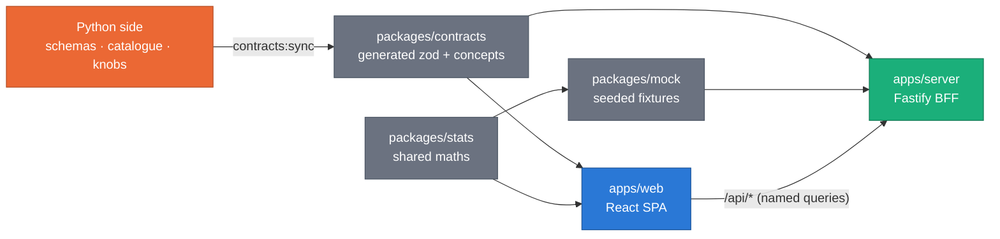
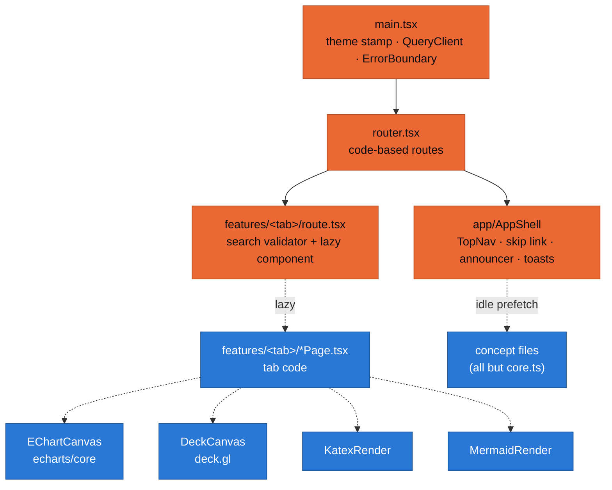
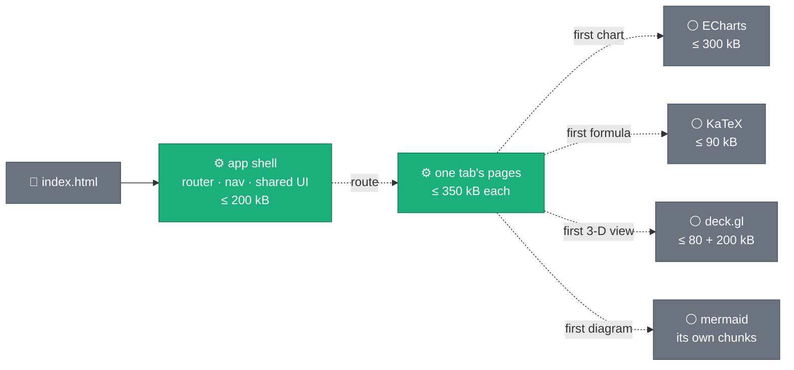
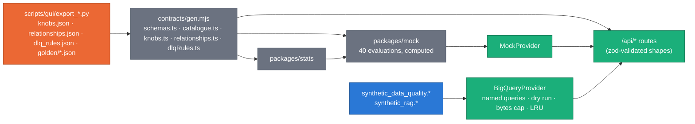
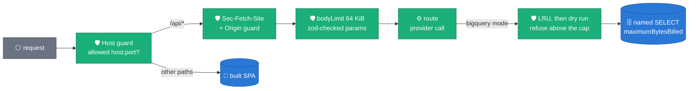
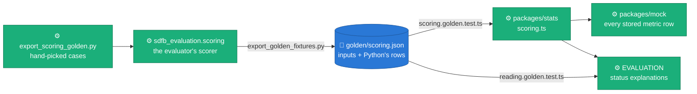

# Synthetic Platform — architecture

**Claim: one npm workspace, a React SPA and a small BFF, whose types are generated
from the Python side; the browser never holds SQL or credentials.** The rule
that allows the GUI is [ADR 0042](../../docs/adr/0042-self-hosted-platform-gui.md);
the system view is [`docs/DESIGN.md` §12](../../docs/DESIGN.md#12-platform-gui).



_Arrows are imports (and the one generation step from Python). Nothing in
`packages/` imports an app; `apps/web` never imports `apps/server`._

## Workspace

| Path                 | What                                                                                                                                            | Owner                             |
| :------------------- | :---------------------------------------------------------------------------------------------------------------------------------------------- | :-------------------------------- |
| `apps/web`           | React 19 + TypeScript (strict) + Vite 8 SPA                                                                                                     | G0a (shell, kit), tabs (features) |
| `apps/server`        | Fastify BFF: named read-only BigQuery queries or the mock provider; serves `apps/web/dist`                                                      | G0b                               |
| `packages/contracts` | zod types generated from the Python side (`generated/**`), the concept contract and concept files                                               | G0b (+ one concept file per tab)  |
| `packages/stats`     | Pure TS maths shared by web and mock (DKW, Wilson, TVD, hashing embedder …)                                                                     | G0b                               |
| `packages/mock`      | Seeded, self-consistent mock data                                                                                                               | G0b                               |
| `scripts/`           | `check-owned-paths.mjs`, `assets-sync.mjs`                                                                                                      | G0a                               |
| `../scripts/gui/`    | Python exporters: `export_knobs.py` (knobs.json …), `export_golden_fixtures.py` (golden/*.json), `export_scoring_golden.py` (the scoring cases) | G0b                               |

## The web app



_Orange is the shell chunk (budget 200 kB gzip); blue boxes are lazy chunks.
Dashed arrows are dynamic imports._

### Routes (code-based; `src/router.tsx`)

| Path                        | Module                                          | Search params (owned by the tab)                     |
| :-------------------------- | :---------------------------------------------- | :--------------------------------------------------- |
| `/`                         | `features/intro/route.tsx`                      | —                                                    |
| `/evaluation`               | `features/evaluation/route.tsx` `listComponent` | `listSearchSchema` (filters)                         |
| `/evaluation/$evaluationId` | `runComponent`                                  | `runSearchSchema`                                    |
| `/evaluation/compare`       | `compareComponent`                              | `compareSearchSchema` (`ids` + filters)              |
| `/rag`                      | `features/rag/route.tsx`                        | `table`, `digest`, `embedder`, `space`, `strategy` … |
| `/config`                   | `features/config/route.tsx`                     | `section`, `channel`, `knob`, `scenario` …           |
| `/kit`                      | `app/kit/KitPage.tsx`                           | — (design-system reference)                          |

**Route-module contract.** A tab's `route.tsx` exports its search
validator(s) and lazy component(s) (`lazyRouteComponent(() => import("./Page"), "Page")`).
Route modules are imported by the router, so they sit in the shell chunk:
build validators with `@/lib/search` (`searchParams`, `text`, `oneOf`,
`integer`, `finite`, `flag`, `list`, `withDefault`, `extend` — no zod in the
shell; zod/mini alone cost it about 13 kB gzip) and keep page code behind the
lazy import. Every field is catch-guarded: a malformed value becomes undefined
(or the field's default), never an error page; `lib/search.test.ts` checks each
route against the zod/mini schema it replaced. Inside a page, read typed params
with `getRouteApi("/rag").useSearch()`
(avoids importing the router). Each route sets `staticData.title` (document
title and the navigation announcement).

### Shared components (foundation; tabs consume, never edit)

| Import                                        | API                                                                                                                                                                                                 | Notes                                                                                                                                                                                                                                                                                                                                                                                                                                                                                                                                                                                                                   |
| :-------------------------------------------- | :-------------------------------------------------------------------------------------------------------------------------------------------------------------------------------------------------- | :---------------------------------------------------------------------------------------------------------------------------------------------------------------------------------------------------------------------------------------------------------------------------------------------------------------------------------------------------------------------------------------------------------------------------------------------------------------------------------------------------------------------------------------------------------------------------------------------------------------------- |
| `@/lib/concepts`                              | `getConcept(id)`, `useConcept(id)`, `useConcepts()`, `listConcepts()`, `loadConcepts()`, types `Concept`, `ConceptLink`                                                                             | Registry merged from `packages/contracts/src/concepts/*.ts` by `import.meta.glob`. `core.ts` is eager; the rest is one lazy batch (prefetched at idle). `getConcept` is synchronous: a non-core id before the batch merged returns undefined, starts the load and warns once in development                                                                                                                                                                                                                                                                                                                             |
| `@/components/InfoHint`                       | `<InfoHint concept side? size? />`                                                                                                                                                                  | Radix Popover: hover 150 ms **and** click / Enter / Space; Esc closes; title, level, purpose, `<Formula>`, `<MiniDiagram>`, interpretation, pitfalls, links (`target=_blank`, `rel="noopener noreferrer"`). Unknown id → dev `console.error` + neutral icon                                                                                                                                                                                                                                                                                                                                                             |
| `@/components/Formula`                        | `<Formula tex display? />`                                                                                                                                                                          | KaTeX, lazy; TeX source shown until loaded; MathML for screen readers; the wrapper is `position: relative` so KaTeX's MathML stays inside `overflow-x-auto`                                                                                                                                                                                                                                                                                                                                                                                                                                                             |
| `@/components/MiniDiagram`                    | `<MiniDiagram id />`, `hasDiagram(id)`                                                                                                                                                              | `src/components/diagrams/<name>.tsx` → `core:<name>`; `src/features/<tab>/diagrams/<name>.tsx` → `<tab>:<name>` (tabs add diagrams in their own folder)                                                                                                                                                                                                                                                                                                                                                                                                                                                                 |
| `@/components/ChartFrame`                     | `<ChartFrame title concept? option data height? empty? description? actions? columns? footer? onEvents? onReady? />`                                                                                | ECharts via `echarts/core` (lazy); token theme; "View data" → `DataTableFallback`; `empty.when` or `data=[]` → labelled empty state; `dataset.source = data` when `option.dataset` is absent; no animation under reduced motion. `onEvents`: `Record<eventName, (params: unknown) => void>` bound with `chart.on/off`, rebound when the map changes; `onReady(chart: EChartsType)` once after the first render (`dispatchAction`, `getDataURL` …). **Memoise `option`, `data` and `onEvents`** (`useMemo`): a new `option` re-renders from scratch (`notMerge`); a new object with identical top-level parts is skipped |
| `@/components/DeckFrame`                      | `<DeckFrame layers view initialViewState ariaLabel getTooltip? onWebglUnavailable? fallback? height? viewState? onViewStateChange? controller? onDeckReady? />`                                     | deck.gl (lazy), one canvas, released on unmount; WebGL2 missing or context lost → `onWebglUnavailable` once, a live warning `Banner`, then `fallback`; keyboard: arrows pan, Shift + arrows orbit, +/− zoom. Linked views / lasso: controlled `viewState` + `onViewStateChange(DeckViewStateChange)`, `controller` override (`false` or `{ dragRotate: false }` while lassoing), `onDeckReady(deck)` → `deck.pickObjects({ x, y, width, height })`                                                                                                                                                                      |
| `@/components/DataTableFallback`              | `<DataTableFallback caption rows columns? maxRows? />`                                                                                                                                              | The table twin of any visual                                                                                                                                                                                                                                                                                                                                                                                                                                                                                                                                                                                            |
| `@/components/Mermaid`                        | `<Mermaid chart ariaLabel narrowDirection? />`                                                                                                                                                      | Lazy, `securityLevel: "strict"`, themed from tokens. `narrowDirection="TB"` lays a `flowchart LR` out top-to-bottom below `md` (phones). A render error drops `role="img"` so the error text is read                                                                                                                                                                                                                                                                                                                                                                                                                    |
| `@/components/StatusPill`                     | `<StatusPill status label? tone? size? />`, `describeStatus()`                                                                                                                                      | Metric (`pass`…`not_evaluated`), run (`RUNNING`…`FAILED`) and scope (`ok`, `count_mismatch`, `contaminated`, `expired`, `empty`, `unknown`) statuses; icon + label + tone. `tone` (`good`, `warn`, `serious`, `critical`, `info`, `neutral`) overrides the map, and picks the icon for statuses it does not know                                                                                                                                                                                                                                                                                                        |
| `@/components/LevelChip`                      | `<LevelChip level withHint? size? />`, `LEVELS`, `LEVEL_ORDER`                                                                                                                                      | FIELD … MODEL, icon + label                                                                                                                                                                                                                                                                                                                                                                                                                                                                                                                                                                                             |
| `@/components/EmptyState`                     | `<EmptyState title description? icon? action? compact? headingLevel? />`                                                                                                                            | `headingLevel`: 2, 3, 4 or `"none"` (a message inside a figure)                                                                                                                                                                                                                                                                                                                                                                                                                                                                                                                                                         |
| `@/components/Callout`                        | `<Callout tone? title? action? live? onDismiss?>…</Callout>`, `<Banner …/>`                                                                                                                         | Tones `info`, `warn`, `danger`, `docs-differ` (where docs and code disagree: the UI shows the code); icon + visible label; `role="note"`, or `role="status"` when `live` (Banner is live and full width by default)                                                                                                                                                                                                                                                                                                                                                                                                     |
| `@/components/StatTile`                       | `<StatTile label value unit? format? delta? concept? trend? footnote? />`                                                                                                                           | One number: proportional figures; `delta: { value, vs, goodWhen?, format? }` signed with an arrow and "vs …" in words, good/bad colour only when `goodWhen` is set; `trend` sparkline is decorative, its range is in text                                                                                                                                                                                                                                                                                                                                                                                               |
| `@/components/PageHeader`                     | `<PageHeader eyebrow? title description? concept? actions? />`                                                                                                                                      | The page's one `h1`                                                                                                                                                                                                                                                                                                                                                                                                                                                                                                                                                                                                     |
| `@/components/SourceLink`                     | `<SourceLink source="path:line" />` or `path`/`line`/`gitRef`                                                                                                                                       | GitHub blob link, new tab                                                                                                                                                                                                                                                                                                                                                                                                                                                                                                                                                                                               |
| `@/components/GithubLinks`, `DataSourceBadge` | top-nav pieces                                                                                                                                                                                      |                                                                                                                                                                                                                                                                                                                                                                                                                                                                                                                                                                                                                         |
| `@/components/ui/*`                           | button, card, badge, tabs, popover, hover-card, dialog, sheet, select, combobox, slider, switch, table, skeleton, toast, tooltip, separator, scroll-area, toggle-group                              | Radix primitives styled with tokens (shadcn-style, local)                                                                                                                                                                                                                                                                                                                                                                                                                                                                                                                                                               |
| `@/lib/format`                                | `formatNumber`, `formatFixed`, `formatCompact`, `formatPercent`, `formatCount`, `formatBytes`, `formatDuration`, `formatDate(Time)`, `formatMetricValue(value, valueKind)`, `formatCell`, `MISSING` | en-US; never prints `NaN`                                                                                                                                                                                                                                                                                                                                                                                                                                                                                                                                                                                               |
| `@/lib/theme`                                 | `useTheme()`, `readToken("--chart-1")`                                                                                                                                                              | Canvas renderers read tokens here                                                                                                                                                                                                                                                                                                                                                                                                                                                                                                                                                                                       |
| `@/lib/color`                                 | `hexToRgb`, `tokenRgba("--chart-2")`                                                                                                                                                                | deck.gl colours from tokens                                                                                                                                                                                                                                                                                                                                                                                                                                                                                                                                                                                             |
| `@/lib/motion`                                | `useReducedMotion()`, `prefersReducedMotion()`                                                                                                                                                      | Wrap Motion code in `<MotionConfig reducedMotion="user">`                                                                                                                                                                                                                                                                                                                                                                                                                                                                                                                                                               |
| `@/lib/useInViewOnce`                         | `const [ref, seen] = useInViewOnce<HTMLDivElement>(margin?)`                                                                                                                                        | True once the element comes within `margin` (600 px) of the viewport, then stays true; heavy lazy pieces (mermaid, chart grids) wait for it                                                                                                                                                                                                                                                                                                                                                                                                                                                                             |
| `@/lib/search`                                | `searchParams({ q: text({ max }), k: integer({ min, max }), … })`, `extend`, `SearchOf<typeof v>`                                                                                                   | Route search validators (shell-sized, zod-free); a link's `search` is typed from them                                                                                                                                                                                                                                                                                                                                                                                                                                                                                                                                   |
| `@/lib/conceptExtras`                         | `<ConceptExtrasContext value={(conceptId) => node}>`                                                                                                                                                | What a page adds to its (i) popovers by concept id (InfoHint renders it after the links; portals keep context). EVALUATION's related-knob links use it                                                                                                                                                                                                                                                                                                                                                                                                                                                                  |
| `@/lib/links`                                 | `REPO_URL`, `DSG_URL`, `repoBlobUrl`, `parseSource`                                                                                                                                                 |                                                                                                                                                                                                                                                                                                                                                                                                                                                                                                                                                                                                                         |
| `@/lib/webgl`                                 | `isWebGL2Available()`                                                                                                                                                                               |                                                                                                                                                                                                                                                                                                                                                                                                                                                                                                                                                                                                                         |
| `@/lib/dataSource`                            | `useDataSource()` → `{ mode: "mock" } \| { mode: "bigquery"; project; maxBytesBilled? } \| { mode: "connecting" } \| { mode: "offline" }`                                                           | Reads `/api/health` (TanStack Query); the badge shows MOCK, BIGQUERY <project>, CONNECTING or OFFLINE                                                                                                                                                                                                                                                                                                                                                                                                                                                                                                                   |
| `@/lib/api`                                   | `api.*` fetchers, `use*` hooks, `queryKeys`, `toQuery`, `ApiError`, `ApiResult<T>`                                                                                                                  | The BFF client (see "Data layer" below). Types only from `@contracts/api`: no zod in the browser                                                                                                                                                                                                                                                                                                                                                                                                                                                                                                                        |

**Cross-tab links.** Real router links with typed search params (keyboard
reachable), checked by `src/test/cross-links.test.ts` (route exists, params
survive the target's validator, knob / channel / section ids exist):

| From                                         | To                                       | Where the map lives                                                                     |
| :------------------------------------------- | :--------------------------------------- | :-------------------------------------------------------------------------------------- |
| INTRO stage: source, reference sample, stats | `/config?section=sources`                | `features/intro/content/stages.ts` (`target`)                                           |
| INTRO stage: RAG retrieval                   | `/rag`                                   | same                                                                                    |
| INTRO stage: generation                      | `/config?section=amp&channel=generation` | same                                                                                    |
| INTRO stage: evaluation / registry           | `/evaluation` / the newest run           | same                                                                                    |
| EVALUATION metric (i): "Related knob"        | `/config?section=amp&knob=<id>`          | `features/evaluation/lib/relatedKnobs.ts` (one table + the catalogue's `baseline` rule) |
| RAG pool route badge                         | `/config?section=amp&channel=free_text`  | `features/rag/pools/PoolsPanel.tsx`                                                     |

**Route stamp.** `<main>` carries `data-route-id` (the matched route id)
and `data-route-search` (its validated search params as JSON). e2e specs
read deep-link state there instead of from a tab's copy.

**Concept files.** `packages/contracts/src/concepts/<owner>.ts` exports
`concepts` built with `defineConcepts([...])`. Ids are unique across files and
each file owns its namespaces (`conceptNamespaces` in
`packages/contracts/src/concept.ts`):

| File            | Namespaces                   | Owner                                     |
| :-------------- | :--------------------------- | :---------------------------------------- |
| `core.ts`       | `core:`                      | foundation                                |
| `intro.ts`      | `intro:`                     | INTRO                                     |
| `evaluation.ts` | `eval:`                      | EVALUATION                                |
| `rag.ts`        | `rag:`                       | RAG                                       |
| `config.ts`     | `knob:`, `config:`, `stats:` | CONFIG                                    |
| `catalogue.ts`  | `metric:` (reserved)         | G0b — generated from the metric catalogue |

`apps/web/src/lib/concepts.test.ts` validates every file: known file name,
namespace per file, the zod `conceptSchema`, KaTeX that parses, diagrams that
exist, a purpose of at most two sentences.

**MiniDiagram ids follow the folder, concept ids the namespace.** A diagram in
`features/evaluation/diagrams/metric-bar.tsx` is `evaluation:metric-bar`, while
EVALUATION's concepts are `eval:…`; likewise `config:dkw-band` is drawn for
`stats:` concepts. A concept's `diagram` field names the folder id.

**Generated contracts.** `@contracts/generated/*` resolves to
`packages/contracts/generated/*` (tsconfig `paths`, Vite and Vitest aliases;
the package also exports `./generated/*`). It is listed before `@contracts/*`
so the more specific alias wins.

**ECharts modules registered** (`EChartCanvas.tsx`): bar, line, scatter,
heatmap, boxplot, radar, parallel, gauge, graph, custom; grid, dataset,
transform, tooltip, axis pointer (via tooltip), legend, title, mark
line/area/point, visual map, data zoom, brush, graphic, aria; label layout,
universal transition; canvas renderer. Pie is left out on purpose.

## Size budgets (`.size-limit.mjs`, gzip)

Budgets are **import closures** read from Vite's manifest
(`apps/web/dist/.vite/manifest.json`): a chunk, its CSS, and every chunk it
imports statically, transitively. Measuring by chunk name let shared chunks
escape every budget (the deck.gl chunk had none, and the shell's own shared
chunks were uncounted).



_What a first visit downloads: the shell only. A tab's code arrives on its
route; each heavy library arrives the first time a view needs it. Dashed
arrows are dynamic imports._

Measured with `npm run build && npm run size` (size-limit, gzip) on
2026-09-29, on the tree of the commit that added this table (its parent is
`16b4294`). **This table is the only place the sizes are typed**; re-run the
command to refresh them.

| Budget                                                                                       |  Limit |  Measured |
| :------------------------------------------------------------------------------------------- | -----: | --------: |
| App shell: `index.html`'s closure (entry chunk, the shared chunks it imports, global CSS)    | 200 kB | 187.42 kB |
| Tab INTRO: the closure of its lazy page chunks (`src/features/intro/`), minus the shell      | 350 kB | 112.17 kB |
| Tab EVALUATION (same rule)                                                                   | 350 kB | 135.51 kB |
| Tab RAG (same rule)                                                                          | 350 kB |  80.06 kB |
| Tab CONFIG (same rule)                                                                       | 350 kB | 106.98 kB |
| Lazy ECharts: `EChartCanvas`'s closure beyond the shell                                      | 300 kB |  270.8 kB |
| Lazy KaTeX: `KatexRender`'s closure (JS + CSS)                                               |  90 kB |  80.56 kB |
| Lazy deck.gl React binding: the `DeckCanvas` chunk                                           |  80 kB |  44.27 kB |
| Lazy deck.gl core + layers: the shared chunks holding `@deck.gl/core` / `layers` / `luma.gl` | 200 kB | 169.34 kB |

Relative to its limit, the shell is the fullest budget, and every visitor
downloads it: a new eager import in `main.tsx`, `router.tsx`, a route module
or a shared component lands there. mermaid and umap-js have no budget line of
their own; the gate below keeps them out of the shell.

The same file is a gate: the shell's chunks must not bundle mermaid, KaTeX,
ECharts, deck.gl or umap-js (checked in their source maps, so the check holds
whatever Rolldown names a chunk). A tab that imports one of them statically
pulls it into its own tab budget. Fonts are never inlined as `data:` URIs
(`build.assetsInlineLimit`): an `@font-face` file loads only when its
unicode-range is on the page, an inlined one ships in the shell CSS to everyone.

## Dependencies (pinned exactly; `.npmrc` `save-exact=true`)

Tab agents may not add dependencies. Versions were the current stable
releases on 2026-09-28, except where a peer range forced an older line.

| Package                                     |  Version | Workspace              | Why                                                                      |
| :------------------------------------------ | -------: | :--------------------- | :----------------------------------------------------------------------- |
| react, react-dom                            |   19.3.0 | web                    | UI                                                                       |
| @tanstack/react-router                      | 1.170.40 | web                    | code-based routes, typed search params                                   |
| @tanstack/react-query                       |  5.104.0 | web                    | server state (`/api/*`)                                                  |
| zod                                         |    4.6.5 | web, server, contracts | contracts; EVALUATION parses profile payloads (`@contracts/payloads`)    |
| tailwindcss, @tailwindcss/vite              |    4.3.3 | web (dev)              | tokens → utilities                                                       |
| radix-ui                                    |    1.6.7 | web                    | accessible primitives                                                    |
| class-variance-authority                    |    0.7.1 | web                    | component variants                                                       |
| clsx                                        |    2.1.1 | web                    | class joining                                                            |
| tailwind-merge                              |    3.7.0 | web                    | class conflict resolution                                                |
| lucide-react                                |   1.48.0 | web                    | icons (no brand marks; GitHub mark is inline)                            |
| katex                                       |   0.18.9 | web                    | formulas (mermaid 12 keeps its own katex 0.16 for math in diagrams)      |
| motion                                      |   13.4.4 | web                    | animation (reduced-motion aware)                                         |
| echarts                                     |    6.1.0 | web                    | 2-D charts via `echarts/core`                                            |
| @deck.gl/core, /layers, /react, /widgets    |    9.4.0 | web                    | 3-D point clouds (`widgets` is a required peer of `react`)               |
| mermaid                                     |   12.0.0 | web                    | diagrams                                                                 |
| umap-js                                     |    1.4.0 | web                    | UMAP projection (worker)                                                 |
| yaml                                        |    2.9.1 | web, server, contracts | catalogue YAML                                                           |
| @fontsource-variable/inter, /jetbrains-mono |    5.3.0 | web                    | self-hosted OFL fonts                                                    |
| fastify                                     |   5.12.5 | server                 | BFF                                                                      |
| @fastify/static                             |   10.1.5 | server                 | serves the SPA                                                           |
| @google-cloud/bigquery                      |    9.1.0 | server                 | named read-only queries                                                  |
| lru-cache                                   |   11.5.3 | server                 | in-memory row cache (never persisted)                                    |
| vite                                        |    8.3.1 | web (dev)              | bundler                                                                  |
| @vitejs/plugin-react                        |    6.1.1 | web (dev)              | JSX + Fast Refresh (not in the brief's list; required by Vite for React) |
| typescript                                  |    6.0.3 | root (dev)             | **not 7.0**: typescript-eslint 8.70 supports `<6.1`                      |
| vitest                                      |    5.0.2 | root (dev)             | unit tests (projects: web jsdom, node)                                   |
| @testing-library/react                      |   16.3.3 | web (dev)              |                                                                          |
| @testing-library/dom                        |   10.4.2 | web (dev)              | required peer of RTL                                                     |
| @testing-library/user-event                 |   14.6.7 | web (dev)              |                                                                          |
| @testing-library/jest-dom                   |    7.0.1 | web (dev)              |                                                                          |
| jsdom                                       |   30.1.1 | web (dev)              |                                                                          |
| @types/react, @types/react-dom              |   19.3.0 | web (dev)              |                                                                          |
| @types/node                                 |  22.20.4 | root (dev)             | matches the Node 22 runtime                                              |
| @playwright/test                            |   1.63.0 | root (dev)             | e2e (local: installed Chrome; CI: bundled Chromium)                      |
| @axe-core/playwright                        |   4.13.0 | root (dev)             | WCAG checks in e2e                                                       |
| eslint, @eslint/js                          |   9.39.5 | root (dev)             | **not 10.x**: eslint-plugin-jsx-a11y 6.10.2 supports `<=9`               |
| typescript-eslint                           |   8.70.1 | root (dev)             | type-aware lint                                                          |
| eslint-plugin-react-hooks                   |    7.1.1 | root (dev)             | hooks + React Compiler rules                                             |
| eslint-plugin-jsx-a11y                      |   6.10.2 | root (dev)             | a11y lint                                                                |
| globals                                     |  17.12.0 | root (dev)             | ESLint globals                                                           |
| prettier                                    |    3.9.9 | root (dev)             | formatting                                                               |
| size-limit, @size-limit/file                |   14.1.0 | root (dev)             | bundle budgets                                                           |
| tsx                                         |  4.23.15 | root (dev)             | runs the TS server in dev                                                |
| concurrently                                |   10.0.5 | root (dev)             | `npm run dev`                                                            |

`overrides`: `lodash-es` 4.18.1 (mermaid → chevrotain pulls 4.17.23, which
carries two high-severity advisories); `npm audit` is clean.

## Ownership map

Enforced on tab branches by `scripts/check-owned-paths.mjs` (reads the JSON
block below; CI runs it on every PR). A tab that needs a foundation change
writes `NEEDS_FOUNDATION: …` in its report instead of editing the file.

| Owner                | Paths                                                                                                                                                                          |
| :------------------- | :----------------------------------------------------------------------------------------------------------------------------------------------------------------------------- |
| G0a/G0b (foundation) | everything under `gui/` not listed for a tab, plus `scripts/gui/**` and `.github/workflows/gui.yml`                                                                            |
| G1 INTRO             | `gui/apps/web/src/features/intro/**`, `gui/packages/contracts/src/concepts/intro.ts`, `gui/e2e/intro.spec.ts`                                                                  |
| G2 EVALUATION        | `gui/apps/web/src/features/evaluation/**`, `gui/packages/contracts/src/concepts/evaluation.ts`, `gui/e2e/evaluation.spec.ts`, `gui/apps/server/src/routes/evaluation.extra.ts` |
| G3 RAG               | `gui/apps/web/src/features/rag/**`, `gui/packages/contracts/src/concepts/rag.ts`, `gui/e2e/rag.spec.ts`, `gui/apps/server/src/routes/rag.extra.ts`                             |
| G4 CONFIG            | `gui/apps/web/src/features/config/**`, `gui/packages/contracts/src/concepts/config.ts`, `gui/e2e/config.spec.ts`, `gui/apps/server/src/routes/config.extra.ts`                 |

<!-- owned-paths:start -->

```json
{
  "foundation": [
    "gui/package.json",
    "gui/package-lock.json",
    "gui/.npmrc",
    "gui/tsconfig*.json",
    "gui/eslint.config.js",
    "gui/.prettierrc.json",
    "gui/.prettierignore",
    "gui/playwright.config.ts",
    "gui/vitest.config.ts",
    "gui/.size-limit.mjs",
    "gui/Dockerfile",
    "gui/apps/web/{index.html,vite.config.ts,package.json,tsconfig.json}",
    "gui/apps/web/src/{main.tsx,router.tsx}",
    "gui/apps/web/src/{app,components,lib,styles,test}/**",
    "gui/apps/web/public/**",
    "gui/apps/server/**",
    "gui/packages/**",
    "gui/scripts/**",
    "gui/e2e/smoke.spec.ts",
    "gui/*.md",
    "gui/docs/**",
    "scripts/gui/**",
    ".github/workflows/gui.yml"
  ],
  "tabs": {
    "intro": [
      "gui/apps/web/src/features/intro/**",
      "gui/packages/contracts/src/concepts/intro.ts",
      "gui/e2e/intro.spec.ts"
    ],
    "evaluation": [
      "gui/apps/web/src/features/evaluation/**",
      "gui/packages/contracts/src/concepts/evaluation.ts",
      "gui/e2e/evaluation.spec.ts",
      "gui/apps/server/src/routes/evaluation.extra.ts"
    ],
    "rag": [
      "gui/apps/web/src/features/rag/**",
      "gui/packages/contracts/src/concepts/rag.ts",
      "gui/e2e/rag.spec.ts",
      "gui/apps/server/src/routes/rag.extra.ts"
    ],
    "config": [
      "gui/apps/web/src/features/config/**",
      "gui/packages/contracts/src/concepts/config.ts",
      "gui/e2e/config.spec.ts",
      "gui/apps/server/src/routes/config.extra.ts"
    ]
  }
}
```

<!-- owned-paths:end -->

## Ports — each worktree sets its own

Tab agents run in parallel worktrees on one machine, so nothing hard-codes a
port and Playwright never reuses a running server (`reuseExistingServer: false`):
one worktree's e2e must never test another worktree's build.

| Variable          | Used by                                                                                                | Default |
| :---------------- | :----------------------------------------------------------------------------------------------------- | ------: |
| `GUI_E2E_PORT`    | the BFF Playwright starts (`npm start`, mock data, serving the built SPA); also `vite preview`         |    4173 |
| `GUI_WEB_PORT`    | `vite` dev server (`npm run dev`); the BFF's Host guard also accepts this port (the proxy's Host)      |    5173 |
| `GUI_SERVER_PORT` | the BFF: the dev proxy targets `127.0.0.1:$GUI_SERVER_PORT` for `/api`, and G0b's server listens on it |    8787 |

Suggested assignment (export them in the worktree's shell before `npm run dev` / `npm run e2e`):

| Worktree           | `GUI_E2E_PORT` | `GUI_WEB_PORT` | `GUI_SERVER_PORT` |
| :----------------- | -------------: | -------------: | ----------------: |
| foundation (`gui`) |           4173 |           5173 |              8787 |
| `gui-intro`        |           4174 |           5174 |              8788 |
| `gui-evaluation`   |           4175 |           5175 |              8789 |
| `gui-rag`          |           4176 |           5176 |              8790 |
| `gui-config`       |           4177 |           5177 |              8791 |

```bash
export GUI_E2E_PORT=4176 GUI_WEB_PORT=5176 GUI_SERVER_PORT=8790   # gui-rag
npm run e2e
```

`npm run e2e` builds the SPA only when `apps/web/dist` is missing or older
than one of its inputs (`apps/web/src`, `public`, `index.html`, the Vite
config, `packages/contracts`, `packages/stats/src`, the lockfile), so
`npm run check && npm run e2e` builds once. `GUI_E2E_SKIP_BUILD=1` always
serves the existing `dist` (CI sets it after `npm run check`);
`GUI_E2E_SKIP_BUILD=0` always rebuilds. Playwright's
web server is the real BFF (`npm start` with `PORT=$GUI_E2E_PORT`,
`DATA_SOURCE=mock`), so e2e specs can call `/api/*` with `request.get(...)`.

## Commands

| Command                                      | Does                                                                                   |
| :------------------------------------------- | :------------------------------------------------------------------------------------- |
| `npm run dev`                                | BFF (`tsx watch`, port `GUI_SERVER_PORT`) + Vite on `127.0.0.1:5173` (proxies `/api`)  |
| `npm start`                                  | the BFF alone (mock by default) serving `apps/web/dist` on `127.0.0.1:8787`            |
| `npm run check`                              | typecheck → lint (ESLint + Prettier) → test → build → size → `contracts:check`         |
| `npm run e2e`                                | Playwright + axe over the built app (desktop 1440 px and mobile 390 px)                |
| `npm run assets:sync` / `assets:check`       | copy / verify repo figures in `apps/web/public/assets` (+ `provenance.json`)           |
| `npm run owned-paths -- feat/gui-rag`        | the ownership gate for a tab branch                                                    |
| `npm run contracts:sync` / `contracts:check` | regenerate / verify `packages/contracts/generated/**`                                  |
| `docker build -f gui/Dockerfile gui`         | a private image of the BFF + SPA (multi-stage, `node:22-slim`, non-root; not deployed) |

## Data layer (G0b) — what the tabs build on



_Both providers implement one `DataProvider` interface
(`apps/server/src/providers/types.ts`) and share the assembly logic
(`providers/shared.ts`), so every route answers the same shapes in mock and
BigQuery mode._

### Routes (all GET; types in `packages/contracts/src/api.ts`; hooks in `@/lib/api`)

| Route                                                                         | Response (`@contracts/api` type)                                                                                                                                 | Hook                              |
| :---------------------------------------------------------------------------- | :--------------------------------------------------------------------------------------------------------------------------------------------------------------- | :-------------------------------- |
| `/api/health`                                                                 | `Health` — mode, project, datasets, `max_bytes_billed`, catalogue version, contracts digest                                                                      | `useHealth()`                     |
| `/api/facets`                                                                 | `Facets` — counts, latest evaluation, every filter's options, source tables, RAG sets, pool sets (each with the `table_fqn` its digest was sampled from)         | `useFacets()`                     |
| `/api/evaluations?…EvaluationFilter`                                          | `Page<EvaluationSummary>` (latest registry row per evaluation, no JSON snapshots); `total` is right past the last page too                                       | `useEvaluations(filter)`          |
| `/api/evaluations/:id[?profiles=all]`                                         | `EvaluationDetail` — `evaluation` (latest event), `events` (RUNNING→FINAL), `metrics`, `flags`; `profiles` **empty by default** (`?profiles=all` embeds them)    | `useEvaluation(id, { profiles })` |
| `/api/evaluations/:id/profiles?table&column&kind&side`                        | `ProfileRow[]` — how a detail page loads profiles: per drawer, table, column or kind                                                                             | `useProfiles(id, query)`          |
| `/api/compare?ids=a,b`                                                        | `Comparison` — aligned `metrics[].cells[i]` (null = absent), `params` diffs, `comparability.not_comparable` (catalogue, evaluator and encoding-plan differences) | `useCompare(ids)`                 |
| `/api/trend?metric_id&table&column&column_2&edge&…filters&limit`              | `TrendPoint[]` — the **newest** `limit` points (default 500), ordered oldest first, with the generation parameters to colour by                                  | `useTrend(query)`                 |
| `/api/runs?run_ids&base_run_id&landing_table&engine&status&env&from&to&limit` | `ValidationRun[]` (+ `dlq_by_rule_map`); `base_run_id` matches a launch's `<base>-NN-<table>` rows (a one-table launch's row is `<base>`)                        | `useRuns(filter)`                 |
| `/api/dlq?run_ids=…`                                                          | `DlqSummary[]` grouped by rule, with one example, `blocker_declared` / `blocker_counted` (the fk.orphan gap); rule → step map: `@contracts/generated/dlqRules`   | `useDlq(runIds)`                  |
| `/api/source-stats?table&tier&digest&snapshot`                                | `SourceStats` — snapshots keyed by (digest, tier, profiler_version, run_id), the selected keys (newest per tier by default), rows with `stats_parsed`            | `useSourceStats(query)`           |
| `/api/rag/chunks?digest&kind&embedder[/version]&limit&source_fqn&column`      | binary envelope (`@contracts/vectors`): `ChunkMeta[]` + Float32 `n × dim`, ≤ 3,000 chunks (`RAG_CHUNKS_MAX`); headers `x-vector-dim`, `x-vector-count`           | `useRagChunks(query)`             |
| `/api/rag/pools?digest&model_uri&column`                                      | `FreetextPool[]` (+ `distinct`)                                                                                                                                  | `usePools(query)`                 |
| `/api/relationships`                                                          | `RelationshipsResponse` — the committed sample models (`generated/relationships.json`) and, in mock mode, the mock's `thelook_demo`                              | `useRelationships()`              |
| `/api/knobs`                                                                  | `KnobsFile` (also importable statically: `@contracts/generated/knobs`)                                                                                           | `useKnobs()`                      |
| `/api/catalogue`                                                              | `{ version, levels, families, metrics: CatalogueMetric[] }` (also `@contracts/generated/catalogue`)                                                              | `useCatalogue()`                  |

Lists in query strings are comma-separated; `from` / `to` are ISO timestamps
with an offset (`…Z`, `…+02:00`) or dates. Every hook's `data` is an
`ApiResult<T>`: `{ data, bytesEstimate, dataSource, warnings }` —
`bytesEstimate` is the dry-run bytes of the BigQuery queries the route ran
(null in mock mode); show it next to the data it cost. `warnings` lists the
vocabulary values live rows carried that the contract does not know yet
(`x-contract-warnings`). Errors are `ApiError { status, message, details }`
(400 invalid params, 403 refused by the Host / Origin guard, 404 unknown id,
422 over the bytes cap, 502 live rows no longer match the generated contract).

### Named queries (`apps/server/src/queries/registry.ts`)

The only SQL the GUI runs. The BigQuery provider runs a query by its name
(`QueryName` is the type of `QUERIES`' keys, so an unknown name does not
compile), and a route reaches BigQuery only through the provider.

| Name                                                                                              | Reads                                                                 | Serves                               |
| :------------------------------------------------------------------------------------------------ | :-------------------------------------------------------------------- | :----------------------------------- |
| `evaluations.list`, `evaluations.count`                                                           | `evaluation_latest` (filtered, sorted, one page, and its total)       | `/api/evaluations`                   |
| `evaluations.events`                                                                              | `evaluation_data_history` (every event of one evaluation)             | `/api/evaluations/:id`, `…/profiles` |
| `evaluations.latestByIds`, `metrics.byEvaluations`                                                | the latest row and the metrics of several evaluations                 | `/api/compare`                       |
| `evaluations.slim`, `metrics.ids`, `runs.count`, `sourceStats.tables`, `rag.sets`, `rag.poolSets` | what the filters offer                                                | `/api/facets`                        |
| `metrics.byEvaluation`, `flags.byEvaluation`                                                      | one evaluation's metrics and flagged rows (keys only)                 | `/api/evaluations/:id`               |
| `profiles.byEvaluation`                                                                           | one evaluation's profiles, narrowed by table, column, kind, side      | `/api/evaluations/:id/profiles`      |
| `trend`                                                                                           | one metric across evaluations                                         | `/api/trend`                         |
| `runs.list`, `dlq.summary`                                                                        | `validation_runs`; `dlq` grouped by run, rule, type, step, stage      | `/api/runs`, `/api/dlq`              |
| `sourceStats.tables`, `sourceStats.byTable`                                                       | `source_table_stats`: the profiled tables, then one table's snapshots | `/api/source-stats`                  |
| `rag.chunks`, `rag.pools`                                                                         | `rag_chunks` (≤ 3,000 vectors), `freetext_pools`                      | `/api/rag/chunks`, `/api/rag/pools`  |

`/api/health`, `/api/knobs`, `/api/catalogue` and `/api/relationships` run no
query: they answer from the configuration and the generated contracts.
`providers/bigquery.contract.test.ts` ("the named-query registry") holds every
entry to one read-only statement whose `@params` are exactly its declared
types, and checks that `assertReadOnly` rejects anything that writes.

**Relational views.** A registry row names its model (`relationship_model`);
resolve it through `/api/relationships`. Real models are gitignored or on GCS
and never served, so when the name is not listed, rebuild the graph from the
metric rows' `edge` labels with `parseEdge` (`@contracts/relational`; it reads
the evaluator's `child(col,col) -> parent(col,col)` and the launcher's
`(col,col)->parent`). `formatEdge` / `findEdge` go the other way. Edge roles:
driving, implied, conditional, independent, external, **documented**
(`enforced: false` — its `relationship.orphan_rate` is `info`, compared with
`relationship.orphan_rate_source`), disabled.

**Source stats.** One reference digest can be profiled on the sample tier by
one launch and on the exact tier by a later one, and by several profiler
versions (the profiler skips only an existing (table, digest, version, tier)),
so snapshots are keyed by all four plus the run and `selected` holds those
keys. `?digest=` returns the newest snapshot of each tier of that digest (the
tier compare of one reference sample); `?snapshot=key,key` picks exactly. A
NULL `stats_tier` (written before the exact tier existed) is the sample tier
everywhere (`effectiveTier`, `snapshotKey` in `@contracts/sourceStats`).

**RAG chunks.** At most 3,000 per response (`RAG_CHUNKS_MAX`): 3,000 × 384-d
Float32 is 4.6 MB of vectors, inside the 5 MB vector budget (text and
metadata come on top; a wider embedder needs a smaller `limit`).
`chunk_text` is the operator's own governed reference data,
shown to the operator on a loopback-only server; `source_pk` (a source row's
key) is never selected nor sent.

### Reading the rows

- Row types are the generated BigQuery schemas (`@contracts/generated/schemas`):
  TIMESTAMP → `YYYY-MM-DDTHH:MM:SS.ffffffZ` (UTC, **six** fraction digits:
  BigQuery keeps microseconds, a `Date` keeps milliseconds — never round-trip
  a timestamp through `Date` before sending it back; compare them as strings),
  INT64 → number, JSON → parsed value, NULLABLE → `null` (keys always present),
  REPEATED → array. Vocabularies (`status`, `level`, `family`, `profile_kind`,
  `side`, `check`, `scope_status` …) are `z.enum`s parsed from the column
  descriptions: `vocabularies["evaluation_metrics.status"]`. On live data a
  value newer than the contract passes through as a plain string (with a
  warning), so render unknown values as text and give every `switch` over a
  vocabulary a default branch.
- `evaluation_profiles.payload` is JSON the evaluator owns; read it with
  `parseProfile(kind, payload)` (`@contracts/payloads`), which returns `null`
  (show "profile unavailable") instead of throwing. Shapes: histogram
  (interior `edges`, `counts.length = edges.length + 1`), quantiles, topk
  (labels `h:<8 hex>` unless literal under D6), length_hist, shape_mix,
  char_classes, temporal_mix, null_patterns, corr_matrix, contingency,
  dcr_hist / nndr_hist (side `synthetic` = syn→R, `holdout` = H→R),
  roc_curve, moments. One contract per kind the schema names
  (`mock.schema-conformance.test.ts` holds the two lists equal); the
  evaluator publishes no fan-out histogram, only the edge's metrics.
- Metric maths for views (noise floors, KS bracket, PIT-W1, scores, statuses,
  DKW, rarefaction, collision odds …) come from `@synthetic-platform/stats`;
  never re-derive them in a tab.

### Extra routes for a tab

A tab that needs a derived server-side result (e.g. a cached UMAP projection)
writes `apps/server/src/routes/<tab>.extra.ts` (`evaluation`, `rag`, `config`):

```ts
import type { FastifyPluginAsync } from "fastify";
import type { RouteOptions } from "./context";

const plugin: FastifyPluginAsync<RouteOptions> = async (app, { provider, cache }) => {
  app.get("/umap", async (request) => {
    /* compose provider calls; cache.get/set */
  });
};
export default plugin;
```

It is registered under `/api/x/<tab>` (e.g. `/api/x/rag/umap`) with the same
provider, config and a small in-memory LRU. Extra routes compose provider
calls; they never run SQL of their own. Registered today:

| Route                                                        | File                  | What                                                                                                                                                         |
| :----------------------------------------------------------- | :-------------------- | :----------------------------------------------------------------------------------------------------------------------------------------------------------- |
| `GET /api/x/rag/projection?digest&embedder&space&ids&params` | `routes/rag.extra.ts` | a cached 3-D layout (`{ hit: false }` on a miss, not a 404)                                                                                                  |
| `POST /api/x/rag/projection`                                 | `routes/rag.extra.ts` | stores a finished UMAP/PCA layout: base64 Float32 coordinates, ≤ 3,000 points, no chunk text and no vectors; memory only; the only request with a body (201) |

EVALUATION and CONFIG have no extra routes.

### BFF safety



_Every request crosses the same guards, in this order, before a route runs; a
refusal is a 403 (Host, site or origin), 413 (body over the limit), 400
(parameters) or 422 (bytes cap). Only bigquery mode adds the cache, the dry
run and the cap._

- **Binding.** `127.0.0.1` by default (`HOST`); port `PORT` → `GUI_SERVER_PORT`
  → 8787. A non-loopback `HOST` with `DATA_SOURCE=bigquery` logs a loud warning
  at startup (in a container: publish only on loopback,
  `-p 127.0.0.1:8787:8787`).
- **Host guard** (an `onRequest` hook, before any route): the `Host` header must
  be `127.0.0.1`, `localhost` or `[::1]` on `PORT` or on `GUI_WEB_PORT` (the
  Vite dev proxy forwards the browser's Host), `HOST` itself when it names a
  specific interface, or one of `ALLOWED_HOSTS` (comma-separated `host:port`).
  A DNS-rebinding page reaches 127.0.0.1 under its own name and gets a 403.
- **Sec-Fetch-Site / Origin guard** (same hook, `/api/*` only): a browser
  request whose `Sec-Fetch-Site` is not `same-origin` or `none` (`cross-site`,
  and `same-site`, since another port of the same host is another local app),
  or whose `Origin` is not `http://` plus an allowed host, is refused, so a
  foreign page cannot make the BFF spend BigQuery bytes. Both guards know only
  `host:port` names and `http://` origins; an HTTPS deployment behind a proxy
  (Cloud Run) needs them extended first.
- **Body limit.** Fastify's `bodyLimit` is 64 KiB. The one route with a body,
  `POST /api/x/rag/projection`, sends 3,000 points as 48,000 base64
  characters; the same layout as a JSON number array would not fit.
- **Named queries only.** The queries of `apps/server/src/queries/registry.ts`
  ([above](#named-queries-appsserversrcqueriesregistryts)); client values are
  parameters, never SQL text; `assertReadOnly` guards every statement.
- **Bytes cap.** Each query not in the cache dry-runs first; its bytes are
  summed into the response's `x-bq-bytes-estimate` (a cache hit adds nothing),
  and above `MAX_BYTES_BILLED` (10 GiB by default) the query is refused with 422
  before it runs. The job itself also carries `maximumBytesBilled`
  ([BigQuery: restrict the bytes billed](https://docs.cloud.google.com/bigquery/docs/best-practices-costs)),
  a 60 s job timeout, and the labels `app=synthetic-platform` and
  `query=<name>`, so its spend is traceable in `INFORMATION_SCHEMA.JOBS`.
- **Contract on the way in.** Live rows are normalized (TIMESTAMP → ISO string
  with microseconds, INT64 → number, JSON → parsed) and validated against the
  generated zod on every read, cached or not (a mismatch is a 502, not a silent
  pass, except an unknown vocabulary value, which passes as a string with
  `x-contract-warnings`).
- **Two in-memory LRUs, never persisted.** The BigQuery provider caches query
  results keyed by the full SQL text and parameters (`CACHE_MAX_ENTRIES`,
  default 500; `CACHE_TTL_SECONDS`, default 300). Extra routes share a second
  LRU for derived results such as RAG layouts (64 entries, 15 minutes, set in
  `app.ts`). Both vanish with the process; nothing is written to disk.
- **Credentials.** The runner's ADC stays in the BFF process; no response body
  or header carries it. Every response sets `x-content-type-options: nosniff`,
  `referrer-policy: no-referrer` and `x-frame-options: DENY`; `/api/*` adds
  `cache-control: no-store` and `x-data-source`.

### Scoring parity (Python → TypeScript)



_The GUI never re-derives a status: it mirrors the evaluator's scorer in
TypeScript, and the mirror must reproduce Python's output case for case._

- **The cases.** `scripts/gui/export_scoring_golden.py` lists metric readings
  chosen to hit every scoring ruling in both directions: inclusive thresholds
  and the 1e-9 tolerance, target metrics, CI-bound lifts, the zero-tolerance
  integrity rule, noise downgrades, the noise-method dispatch, documented edges,
  infinities and NaN, the pMSE ceiling, aggregate ids left out of the
  headline counts, and the copy rate gated only on a free-text column (R66). `export_golden_fixtures.py` runs them through
  `sdfb_evaluation.scoring` (`to_metric_row`, `status_for`, `score_value`,
  `aggregate_scores`, `headline_counts`) and writes
  `packages/contracts/generated/golden/scoring.json`: its cases
  (`node -p 'require("./packages/contracts/generated/golden/scoring.json").cases.length'`
  counts them), plus score-function values and one roll-up.
- **The replay.** `packages/stats/src/scoring.golden.test.ts` feeds every case
  to `scoring.ts` and asserts the same status, score, detail notes and stored
  numbers (scores to a 1e-12 relative tolerance). `reading.golden.test.ts`
  (EVALUATION) checks that each explanation agrees with the stored status and
  names what the evaluator recorded.
- **Downstream.** The mock scores every metric row with the same `scoreRow`, and
  `mock.storyline.test.ts` recomputes the stored status, score, roll-ups and
  headline counts from its profiles.
- **Drift.** CI's `exports` job re-runs the exporter with `--check`, so a
  change to the evaluator's scorer that the golden does not match fails; the
  TS tests then fail until `scoring.ts` follows.

### Content-Security-Policy (notes; the BFF does not send one yet)

The BFF sets `x-content-type-options`, `referrer-policy` and
`x-frame-options: DENY`, but no CSP. What a policy has to allow, from what the
build does today — roll it out as `Content-Security-Policy-Report-Only` first:

| Directive         | Value                    | Why                                                                                                                                                                              |
| :---------------- | :----------------------- | :------------------------------------------------------------------------------------------------------------------------------------------------------------------------------- |
| `default-src`     | `'self'`                 | everything is served by the BFF; no CDN, no external API                                                                                                                         |
| `script-src`      | `'self'`                 | Vite chunks and `public/theme-init.js` (the pre-paint theme stamp is a file, not inline, so it needs no hash); no `eval` or `new Function` in the built chunks                   |
| `worker-src`      | `'self'`                 | RAG's UMAP/PCA worker is a same-origin module (`new Worker(new URL("./projection.worker.ts", import.meta.url))`), not a `blob:`                                                  |
| `style-src`       | `'self' 'unsafe-inline'` | KaTeX output carries `style="…"` attributes and mermaid writes a `<style>` element into every SVG, both inserted as HTML strings; ECharts and React set styles through the CSSOM |
| `font-src`        | `'self'`                 | Inter / JetBrains Mono / KaTeX woff2 files, always served as files: `build.assetsInlineLimit` never inlines a font as a `data:` URI (see the budgets above)                      |
| `img-src`         | `'self' data:`           | repo figures under `/assets/`, inline SVG icons, ECharts `getDataURL` exports                                                                                                    |
| `connect-src`     | `'self'`                 | `fetch("/api/…")` only                                                                                                                                                           |
| `frame-ancestors` | `'none'`                 | the same as `x-frame-options: DENY`                                                                                                                                              |

mermaid runs with `securityLevel: "strict"` (labels sanitised, click handlers
off) and KaTeX with `trust: false`, so neither needs `'unsafe-eval'`; tightening
`style-src` past `'unsafe-inline'` would need nonces threaded into both
libraries' HTML output.
