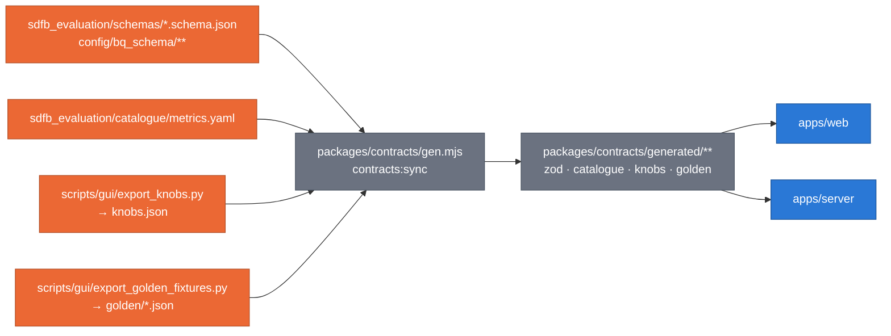

# Synthetic Platform — data contracts

**Claim: the Python side is the single source of truth; the GUI generates
its types from it and CI fails on drift** ([ADR 0042](../../docs/adr/0042-self-hosted-platform-gui.md) D5).



_`contracts:check` regenerates into a temporary directory and diffs; any
difference fails CI. `generated/**` is never edited by hand._

## Status

| Contract                                                      | Owner | State                                                                                  |
| :------------------------------------------------------------ | :---- | :------------------------------------------------------------------------------------- |
| Concept (`packages/contracts/src/concept.ts`)                 | G0a   | **done** — type, `defineConcepts`, `conceptSchema` (zod, in `concept.schema.ts`)       |
| Core concepts (`src/concepts/core.ts`)                        | G0a   | **done** — noise floor, baseline, score, status, family, data source, the seven levels |
| Tab concepts (`src/concepts/<tab>.ts`)                        | G1–G4 | one file per tab                                                                       |
| Generated zod from BigQuery JSON schemas                      | G0b   | `gen.mjs` is a stub until then (`contracts:check` passes with nothing to compare)      |
| Catalogue → typed catalogue + `metric:<id>` concepts          | G0b   |                                                                                        |
| `knobs.json` (values from code, `source: path:line`)          | G0b   |                                                                                        |
| Golden fixtures (hashing embedder, GReaT, retrieval)          | G0b   |                                                                                        |
| API client + TanStack Query hooks (`apps/web/src/lib/api.ts`) | G0b   |                                                                                        |

## The concept contract

```ts
type ConceptLink = { label: string; url: string; kind: "paper" | "docs" | "adr" | "code" };
type Concept = {
  id: string; // namespaced: "core:noise-floor", "metric:column.ks", "knob:reference_rows_limit"
  title: string;
  purpose: string; // ≤ 2 sentences
  formula?: string; // KaTeX, standard macros only
  interpretation?: { good?: string; bad?: string; tip?: string };
  pitfalls?: string;
  diagram?: string; // MiniDiagram id: "core:<name>" or "<tab>:<name>"
  links: ConceptLink[]; // https only
  level?: "field" | "column" | "pair" | "row" | "table" | "relationship" | "model";
};
```

Rules, enforced by `apps/web/src/lib/concepts.test.ts`:

- ids match `^[a-z][a-z0-9_-]*:[a-z0-9][a-z0-9._-]*$` and are unique across files;
- each file defines only its namespaces: `core.ts` → `core:`, `intro.ts` → `intro:`,
  `evaluation.ts` → `eval:`, `rag.ts` → `rag:`, `config.ts` → `knob:` / `config:` / `stats:`;
  `metric:` is reserved for the catalogue concepts G0b generates (`catalogue.ts`);
- every link is `https`; every formula renders in KaTeX with `throwOnError`;
- every `diagram` names a registered MiniDiagram;
- `purpose` has at most two sentences.

Catalogue metrics map one-to-one: `metric:<catalogue id>`, `title`,
`purpose`, `formula`, `interpretation.{good,bad}`, `pitfalls` and
`references` → `links` (`kind: "paper"` or `"code"`), `level` from the id
prefix.

## Data sources

| Mode             | Set by                                | Reads                                                                                                                                                     | Credentials                            |
| :--------------- | :------------------------------------ | :-------------------------------------------------------------------------------------------------------------------------------------------------------- | :------------------------------------- |
| `mock` (default) | `DATA_SOURCE=mock`                    | seeded fixtures (`packages/mock`), invented or public thelook names                                                                                       | none                                   |
| `bigquery`       | `DATA_SOURCE=bigquery`, `GCP_PROJECT` | `synthetic_data_quality.*`, `synthetic_rag.*` through named, parameterized, read-only `SELECT`s with `maximumBytesBilled` (10 GB default) after a dry run | the runner's ADC, held by the BFF only |

Both modes serve the same routes and validate against the same generated zod.
Fetched rows are cached in memory (LRU) and never persisted.

## Mock data rules

- `.json` or `.ts` only (the precheck forbids csv, jsonl, parquet, avro).
- E-mail addresses only at `example.com`; no 15–16-digit integers; no real
  corporate identifiers — invented or public thelook names only.
- Every metric value is computed from mock distributions by `packages/stats`,
  never typed.
