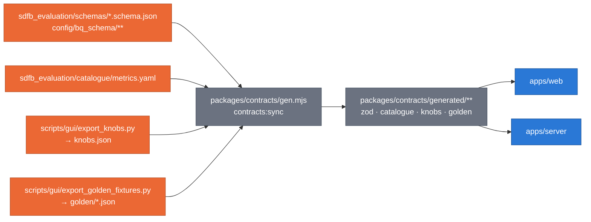

# Synthetic Platform — data contracts

**Claim: the Python side is the single source of truth; the GUI generates
its types from it and CI fails on drift** ([ADR 0042](../../docs/adr/0042-self-hosted-platform-gui.md) D5).



_`contracts:check` regenerates into a temporary directory and diffs; any
difference fails CI. `generated/**` is never edited by hand._

## Status

| Contract                                                      | Owner | State                                                                                                    |
| :------------------------------------------------------------ | :---- | :------------------------------------------------------------------------------------------------------- |
| Concept (`packages/contracts/src/concept.ts`)                 | G0a   | **done** — type, `defineConcepts`, `conceptSchema` (zod, in `concept.schema.ts`)                         |
| Core concepts (`src/concepts/core.ts`)                        | G0a   | **done** — noise floor, baseline, score, status, family, data source, the seven levels                   |
| Tab concepts (`src/concepts/<tab>.ts`)                        | G1–G4 | one file per tab                                                                                         |
| Generated zod from BigQuery JSON schemas                      | G0b   | **done** — `generated/schemas.ts`: 10 tables, `vocabularies`, `bqTables` field metadata, `bqViews`       |
| Catalogue → typed catalogue + `metric:<id>` concepts          | G0b   | **done** — `generated/catalogue.ts` (79 metrics); `src/concepts/catalogue.ts` hands them to the registry |
| `knobs.json` (values from code, `source: path:line`)          | G0b   | **done** — `scripts/gui/export_knobs.py`; typed as `generated/knobs.ts`                                  |
| Golden fixtures (hashing embedder, GReaT, retrieval)          | G0b   | **done** — `scripts/gui/export_golden_fixtures.py` → `generated/golden/*.json`                           |
| API contract (`src/api.ts`), payloads, profiler entry         | G0b   | **done** — hand-written zod on top of the generated rows                                                 |
| API client + TanStack Query hooks (`apps/web/src/lib/api.ts`) | G0b   | **done**                                                                                                 |

### How drift is caught

| Change on the Python side                                      | Caught by                                                                    |
| :------------------------------------------------------------- | :--------------------------------------------------------------------------- |
| a column, type, mode or vocabulary in a `*.schema.json`        | `npm run contracts:check` (gui CI) — `schemas.ts` and `manifest.json` differ |
| a vocabulary description that no longer parses (`a \| b \| c`) | `contracts:sync` fails, naming the field                                     |
| `metrics.yaml`                                                 | `contracts:check` — `catalogue.ts` differs                                   |
| a knob's default, constant or `path:line`                      | `export_knobs.py --check` (root pytest `test_gui_exporters.py`)              |
| a "Docs differ" anchor that moved or vanished                  | `export_knobs.py` fails (the annotation is re-verified every run)            |
| `HashingEmbedder`, `serialize_row`, retrieval                  | `export_golden_fixtures.py --check`, then the TS golden tests                |
| a hand edit of `knobs.json` or a golden file                   | `contracts:check` — the input sha256 in `manifest.json`                      |
| live BigQuery rows that no longer match                        | the BigQuery provider (502 `Contract Mismatch`, with the failing paths)      |

Refresh everything after a Python change:

```bash
UV_PROJECT_ENVIRONMENT=$PWD/.venv-gui uv run python scripts/gui/export_knobs.py
UV_PROJECT_ENVIRONMENT=$PWD/.venv-gui uv run python scripts/gui/export_golden_fixtures.py
cd gui && npm run contracts:sync
```

## knobs.json

`channels` (SAMPLING, GENERATION, FREE TEXT, RAG, GUARDRAILS, RELATIONAL,
SERVING, EVALUATION), `knobs` (`id`, `channel`, `group`, `label`, `value`,
`unit`, `settable_via` ⊆ cli / composer / flex / constant / derived,
`cli_flag`, `composer_param` + `composer_default` when it differs,
`flex_param`, `choices`, `help` (argparse), `comment` (the code comment above a
constant), `source` = `path:LINE` or `planned`, `related_adrs`, `docs`),
`annotations` (docs-vs-code: `docs_say`, `code_does`, `evidence[]` with
`path:line` + the verbatim excerpt), `measured_sources` and `measured` (the
figure scripts' MEASURED constants with their block header). The EVALUATION
channel is `source: "planned"` until `sdfb_evaluation/cli/main.py` exists
(Ruling G2): its values then come from that file's argparse by AST.

## Golden fixtures

| File                    | Python original                                              | TS port (packages/stats)                                         | Pinned                                                     |
| :---------------------- | :----------------------------------------------------------- | :--------------------------------------------------------------- | :--------------------------------------------------------- |
| `hashing_embedder.json` | `sdfb_core.rag.embedding.HashingEmbedder`                    | `hashingEmbed`, `pySplit`, `hashingBucket`                       | tokens, uint64-modulo buckets and signs exact; values 1e-6 |
| `great_serialize.json`  | `sdfb_core.rag.serialize.serialize_row`                      | `serializeGreat`, `pyFloatRepr`, `pyStr`                         | the text, exactly                                          |
| `retrieval.json`        | `retrieve_centroid_top_k` (pure index), `retrieve_kcenter_k` | `centroidTopK`, `kcenter`, `kcenterRotate`, `selectSeedExamples` | the picks, exactly (duplicates and a collapsed matrix)     |

## The concept contract

```ts
type ConceptLink = { label: string; url: string; kind: "paper" | "docs" | "adr" | "code" };
type Concept = {
  id: string; // namespaced: "core:noise-floor", "metric:column.ks", "knob:reference_rows_limit"
  title: string;
  purpose: string; // ≤ 2 sentences
  formula?: string; // KaTeX, standard macros only
  interpretation?: { good?: string; bad?: string; tip?: string };
  pitfalls?: string;
  diagram?: string; // MiniDiagram id: "core:<name>" or "<tab>:<name>"
  links: ConceptLink[]; // https only
  level?: "field" | "column" | "pair" | "row" | "table" | "relationship" | "model";
};
```

Rules, enforced by `apps/web/src/lib/concepts.test.ts`:

- ids match `^[a-z][a-z0-9_-]*:[a-z0-9][a-z0-9._-]*$` and are unique across files;
- each file defines only its namespaces: `core.ts` → `core:`, `intro.ts` → `intro:`,
  `evaluation.ts` → `eval:`, `rag.ts` → `rag:`, `config.ts` → `knob:` / `config:` / `stats:`;
  `metric:` is reserved for the catalogue concepts G0b generates (`catalogue.ts`);
- every link is `https`; every formula renders in KaTeX with `throwOnError`;
- every `diagram` names a registered MiniDiagram;
- `purpose` has at most two sentences.

Catalogue metrics map one-to-one: `metric:<catalogue id>`, `title`,
`purpose`, `formula`, `interpretation.{good,bad}`, `pitfalls` and
`references` → `links` (`kind: "paper"` or `"code"`), `level` from the id
prefix.

## Data sources

| Mode             | Set by                                | Reads                                                                                                                                                     | Credentials                            |
| :--------------- | :------------------------------------ | :-------------------------------------------------------------------------------------------------------------------------------------------------------- | :------------------------------------- |
| `mock` (default) | `DATA_SOURCE=mock`                    | seeded fixtures (`packages/mock`), invented or public thelook names                                                                                       | none                                   |
| `bigquery`       | `DATA_SOURCE=bigquery`, `GCP_PROJECT` | `synthetic_data_quality.*`, `synthetic_rag.*` through named, parameterized, read-only `SELECT`s with `maximumBytesBilled` (10 GB default) after a dry run | the runner's ADC, held by the BFF only |

Both modes serve the same routes and validate against the same generated zod.
Fetched rows are cached in memory (LRU) and never persisted.

## Mock data rules

- `.json` or `.ts` only (the precheck forbids csv, jsonl, parquet, avro); the
  mock is generated in memory at startup, nothing is written.
- E-mail addresses only at `example.com`; no 15–16-digit integers; no real
  corporate identifiers — invented or public thelook names only.
- Every metric value is computed from mock distributions by `packages/stats`,
  never typed.

### The mock world (`packages/mock`)

- **Model:** `users ──< orders ──< order_items >── products` (products external),
  as `config/relationships/gcp_public_fk_example.yaml`, in project
  `demo-project`: sources in `synthetic_source`, landings in `synthetic_data`.
  Plus `user_features`, an isolated 200-column table.
- **Storyline** (`storyline.ts`): 40 evaluations, 2026-08-03 … 2026-09-27.
  Weeks 1–4: b1 on the sample tier, the 512-value pool collapses on
  `users.city` (`column.distinct_ceiling_hit` = 1) and e-mails leak from the
  reference sample (memorization lifts FAIL); weeks 5–8: the exact tier and
  identifier expansion, no leak, fidelity up. Edge cases: `eval-0003` sampled
  on the DirectRunner, `eval-0014` FAILED, `eval-0017` PARTIAL (scope
  `count_mismatch`), `eval-0024` SKIPPED (empty appends scope), `eval-0027`
  PARTIAL (reference not verified: privacy `not_evaluated`), `eval-0032` the
  200-column table, `eval-0040` still RUNNING (no FINAL event); scope notes
  `expired` (`eval-0007`, users) and `contaminated` (`eval-0030`,
  order_items) come with warnings (SUCCEEDED_WITH_WARNINGS). b2 runs keep
  joint structure (pair metrics pass more often) but interpolate through 11
  deciles. Evaluator 0.1.0 → 0.2.0 at `eval-0021` changes
  `encoding_plan_digest`, so comparisons across it are flagged not comparable.
- **Computation** (`evaluate.ts`): profiles are counts drawn at the stated n
  from the generated rows' distributions; every metric is a `packages/stats`
  function of those profiles (KS bracket, PIT-W1, TVD, JSD, PSI, rate-ratio
  lifts, Gower DCR/NNDR, PRDC density/coverage …), with `baseline_value` =
  metric(reference sample, source) and noise floors from the same package;
  score and status apply the catalogue. `mock.storyline.test.ts` recomputes
  them from the stored profiles.
