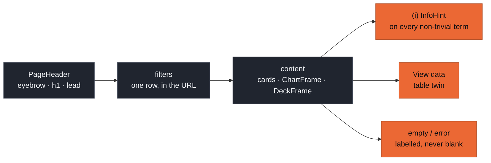

# Synthetic Platform — UX rules

**Claim: every view reads the same way — one `h1`, explanations one (i) away,
every chart with a table twin, status never colour-only — at 1440 px and at
390 px, in dark and light.** These rules bind every tab; the `/kit` page shows
each piece live.

_The page skeleton every tab follows; orange boxes are the non-negotiable
accessibility gates._

## Layout

- **One `h1` per page** through `PageHeader` (eyebrow = tab name). Sections use
  `h2`, cards `h3`.
- Content width is capped at 1440 px with a 16 px gutter on phones (24 px from
  `md`). No horizontal page scroll at 390 px: wide tables scroll inside
  `TableContainer` (focusable), the tab bar scrolls inside the nav.
- Filters sit in **one row above the content they scope**, stored in URL search
  params (shareable, back-button safe). Never inside a chart card.
- Refetching keeps the previous render at reduced opacity; skeletons only on
  first load.

## Explanations — InfoHint

- Put an `(i)` next to every metric, knob, level, formula-bearing term and
  unusual word. Content comes from the concept registry, never inline strings.
- It opens on **hover after 150 ms** (mouse and pen) **and** on **click,
  Enter or Space**; a click on a hover-opened hint pins it. **Esc** closes and
  returns focus. Touch opens by tap.
- Purpose: at most two sentences. Formula: KaTeX. Interpretation: _Good_,
  _Watch_, _Tip_; _Pitfall_ when there is one. Links go to primary sources and
  code (`kind`: paper, docs, adr, code) and open in a new tab.
- A (i) is 24 × 24 px (WCAG 2.5.8 target size).

## Charts — ChartFrame

Follow the dataviz method: pick the form first, colour last.

- **Categorical colour is assigned in fixed slot order** (`--chart-1..8`),
  never cycled, never re-ordered by rank; a filter must not repaint survivors.
  Past 8 series fold into "Other" (`--chart-other`) or facet. Scatter-like
  forms (any two marks can touch) cap at the first **3** slots.
- **Sequential** = one hue (`--seq-1..7`, "near zero" first); **diverging** =
  `--div-neg` / `--div-mid` / `--div-pos`.
- **Status colours are reserved** for status and always come with an icon and
  a label (`StatusPill`). A series that _means_ good/bad wears status tokens; a
  series that is just "series 4" wears categorical — never both in one chart.
- **One y-axis.** Two measures of different scale → two charts or small
  multiples.
- Marks: bars ≤ 24 px with a 4 px rounded data end; 2 px lines; ≥ 8 px markers
  with a 2 px surface ring; hairline solid grid. Text uses text tokens, never
  the series colour.
- A legend for ≥ 2 series; direct labels selectively. A tooltip on hover
  (crosshair on line/area, per-mark on bar/dot/cell) — tooltips enhance, the
  table twin carries every value.
- **Every chart has "View data"** (`DataTableFallback`). Degenerate data —
  `null`, `not_evaluated`, empty profiles, one run, 200 columns — renders a
  labelled empty state or a scrolling table, never a `NaN` axis.
- **Noise floor**: wherever a metric has one, show it (band or marker) and say
  "≈" for differences below it.

## 3-D — DeckFrame

- One canvas per view; it is released when the route unmounts.
- Keyboard: focus the canvas; arrows pan, Shift + arrows orbit, + / − zoom.
  The hint line under the canvas says so.
- **WebGL2 missing or context lost** (Intel iGPU reset, a background tab):
  the frame swaps to `fallback` (a 2-D projection) and calls
  `onWebglUnavailable` once. Show a banner that says why.
- Keep a 2-D or table twin of the same data on the page.

## Status, levels, data source

- `StatusPill` for metric statuses (`pass`, `warn`, `fail`, `info`,
  `not_evaluated`) and run statuses (`RUNNING` … `FAILED`). `not_evaluated`
  and `SKIPPED` are neutral, not green.
- `LevelChip` for FIELD, COLUMN, PAIR, ROW, TABLE, RELATIONSHIP, MODEL.
- The top nav always shows the data source: **MOCK** or **BIGQUERY
  <project>**. Views that show a BigQuery bytes estimate (from the BFF's
  response header) put it next to the data it cost.

## Data on screen

- **Source text.** RAG chunk text (`chunk_text`) and pool values are the
  operator's own governed reference data, shown to that operator by a
  loopback-only server; show them where they explain a view (a hovered point,
  a nearest-neighbour list). Source row keys (`source_pk`) never reach the
  browser, and flagged rows name the matched source record by a keyed hash
  only (`h:` and eight hex digits): the evaluator never writes a raw source
  key. Nothing on screen is written back or exported by the GUI.
- **Values newer than the contract.** A status, level, kind or side the
  contract does not list yet arrives as plain text (the response lists it in
  `warnings`): render it neutral (`StatusPill` falls back to a neutral pill
  with the raw text), never blank, never an error.
- **Timestamps** carry microseconds; display them rounded (seconds or
  minutes), but pass the exact string back when it identifies a row.

## Motion

- Respect `prefers-reduced-motion`: CSS animations collapse globally,
  ECharts animation is off, deck.gl inertia is off; Motion code uses
  `<MotionConfig reducedMotion="user">` or `useReducedMotion()`.
- Motion explains a change (a pipeline stage lighting up, a greedy k-center
  walk); it never decorates.

## Theme

Dark by default; the sun/moon button switches to light (kept for
accessibility), stored per browser. Colours live only in
`src/styles/tokens.css`; components use the Tailwind token utilities
(`bg-surface-1`, `text-text-2`, `border-border`, `text-status-good-text` …).
Canvas renderers read tokens with `readToken()` and re-read them when
`useTheme().resolved` changes.

## Writing

Sentence case. Short sentences, active voice, concrete numbers with units
(`10,000 rows`, `1.5 MB`, `ε ≈ 0.0136`). Say what the reader can do next in
every empty and error state. Where docs and code disagree, show what the code
does and add `<Callout tone="docs-differ">` next to it. Single numbers go in a
`StatTile`, never a one-bar chart.

## Accessibility checklist (WCAG 2.2 AA)

- Skip link, landmarks (`header`, `nav "Tabs"`, `main`), `aria-current` on the
  active tab, a polite route announcement and focus moved to `main` after
  navigation.
- Text contrast ≥ 4.5 : 1, UI boundaries ≥ 3 : 1 (tokens are measured; see
  `gui/BRANDING.md`). Focus ring: 2 px `--focus-ring`, 2 px offset.
- Every icon-only control has an `aria-label`; tooltips repeat, never replace, it.
- Radix modals (Dialog, Sheet) `aria-hide` the page behind them while open,
  which axe reports as `aria-hidden-focus`. Run page-level axe with overlays
  closed, and check an open overlay with `new AxeBuilder({ page }).include('[role="dialog"]')`.
  Menus that do not need a focus trap use `modal={false}`.
- `npm run e2e` runs axe (wcag2a/aa, 2.1, 2.2) on every tab and on `/kit` in
  both themes; serious and critical violations fail the build.
