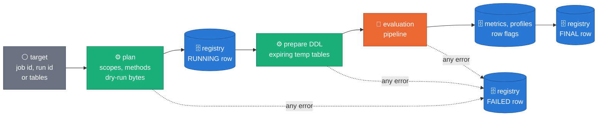
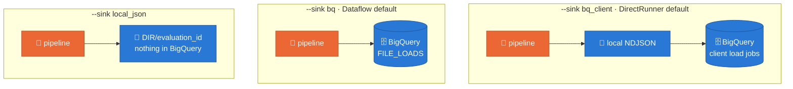
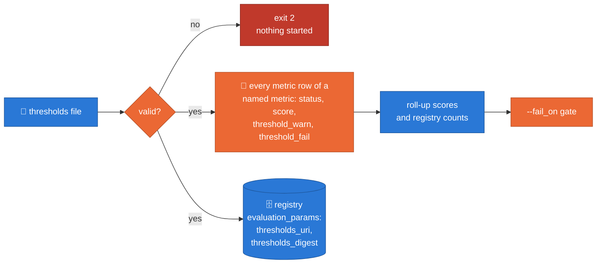
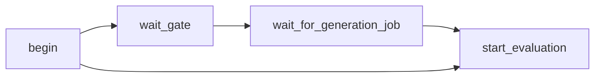

# sdfb-evaluation

Standalone statistical evaluation of synthetic BigQuery tables against their
live source: fidelity, privacy, integrity, and diversity, computed with Apache Beam and
written to BigQuery (`synthetic_data_quality.*`).

This package is **not** a workspace member of the root
`synthetic-llm-dataflow-bigquery` project (`[tool.uv.workspace] exclude`,
ADR 0041). It has its own `pyproject.toml`, `uv.lock`, and Python 3.11 pin,
and it installs and runs with none of the generator packages — `sdfb-core`,
`sdfb-beam`, `sdfb-tests` — present. An AST test
(`tests/unit/test_independence.py`) enforces that nothing under `src/` ever
imports them.

See
[`docs/designs/2026-07-07-evaluation-framework-design.md`](../../docs/designs/2026-07-07-evaluation-framework-design.md)
for the design.

## Quickstart

One command line, `sdfb-eval`, plans, runs, reports on and compares
evaluations. What a run does, whatever the runner:



Every attempt mints its own `evaluation_id`
(`eval-<UTC yyyymmddThhmmssZ>-<8 hex>`), printed first; it is never passed
in. The registry is append-only: a run leaves a RUNNING row and a final one
(SUCCEEDED, SUCCEEDED_WITH_WARNINGS, PARTIAL, SKIPPED or FAILED). A status
describes the run, not the data: a run whose metrics fail still SUCCEEDED.

### 1. Install, and create the tables once

```bash
cd packages/sdfb-evaluation
uv sync --frozen
uv run pytest -q -m "not gcp"

# prints the four `bq mk` commands and the two view statements
uv run sdfb-eval schemas --project demo-project
# or creates them: tables are kept if they exist, views are replaced
uv run sdfb-eval schemas --project demo-project --apply
```

The dataset (`synthetic_data_quality` unless `--dataset` says otherwise)
must exist. The commands below read Application Default Credentials.

### 2. Plan first (nothing runs)

```bash
uv run sdfb-eval plan --dry_run \
  --project demo-project --region europe-west1 --job_id <GENERATION_JOB_ID>
```

It prints each table's scope, row counts, reference panel and the method
per column, the BigQuery bytes the dry runs counted against
`--max_bytes_billed`, and the predicted shuffle against `--max_shuffle_gb`.
A plan never runs the prepare DDL and never writes a registry row, with or
without `--dry_run`. It does issue the planning queries, and it creates
one kind of table: the zero-byte, 24-hour start snapshot of a table whose
rows were landed by copy jobs (scope `as_of_diff`), because that scope is
read through it. `--no_planning_snapshots` plans without them; those
tables are then reported `UNPLANNED`.

A target is exactly one of:

| Target | Flags |
|---|---|
| a generation Dataflow job | `--job_id J --region R` |
| a launch by its base run id | `--run_id B` (read from `validation_runs` in `--output_dataset`) |
| tables named by hand | `--tables users,orders --landing_dataset L --reference_dataset D` |

`--relationships_uri` (a file or directory, local or `gs://`, for example
`config/relationships/gcp_public_fk_example.yaml`) may accompany any of
them; it supplies the relationship model when the launch's own records name
none. A hand-named target carries no write disposition, so pass
`--scope manual` to evaluate the tables as they are now.

### 3. Run on the DirectRunner

```bash
uv run sdfb-eval run \
  --project demo-project --region europe-west1 --job_id <GENERATION_JOB_ID>
```

The DirectRunner defaults to `--mode sampled --sink bq_client`: it reads a
salted sample of each side above `--sample_rows` (200,000), writes local
files, then loads them with one BigQuery load job per table, the
registry's FINAL row last.

`--runner DirectRunner` means "run it on this machine", and it is what the
registry records. The pipeline itself runs on Beam's in-process
`FnApiRunner`: Beam's own `DirectRunner` hands a batch pipeline to Prism,
which can start a step before its side input is complete, so the evaluator
does not run on Prism and refuses `--runner PrismRunner` as a usage error.



`--output_local DIR` keeps the local files under `DIR/<evaluation_id>`
(`bq_client` otherwise uses a temporary directory; `local_json` requires
it). The other flags, with their defaults:

| Group | Flags |
|---|---|
| mode and scope | `--mode exact\|sampled`, `--scope auto\|table\|as_of\|appends\|as_of_diff\|manual`, `--allow_contaminated` |
| sampling | `--sample_rows 200000`, `--privacy_sample_rows 50000`, `--detection_sample_rows 50000` |
| limits | `--pair_max_columns 20`, `--topk_profile 1000`, `--row_flags_top_k 100`, `--row_flags_source_keys hashed` |
| budgets | `--max_bytes_billed 1099511627776`, `--max_shuffle_gb 500` |
| output | `--output_dataset synthetic_data_quality`, `--temp_dataset` (default: the output dataset), `--sink`, `--output_local DIR` |
| control | `--fail_on none\|warn\|fail`, `--thresholds_uri Y`, `--trigger cli`, `--label_key_uri U` |

Any other argument goes to Beam (`--temp_location`, `--num_workers`,
`--experiments`, …). The experiment `enable_data_sampling` is refused.

Row flags and profile labels are hashed with a label key. Without
`--label_key_uri` the key is random and lives for one run; with it (a
Secret Manager version `projects/P/secrets/S/versions/V`, a `gs://` object
or an absolute path) labels are stable across runs. A worker reads the
key; the registry records only `operator` or `ephemeral`.

### 4. Read the result

```bash
uv run sdfb-eval report  --project demo-project --evaluation_id <ID>            # markdown
uv run sdfb-eval report  --project demo-project --evaluation_id <ID> \
  --format json --out evaluation_metrics.json
uv run sdfb-eval report  --local DIR/<ID>                                        # a local_json run
uv run sdfb-eval compare --project demo-project --evaluation_ids <ID_A>,<ID_B>
uv run sdfb-eval catalogue --format md
```

A report explains every failing metric with the catalogue's own text (what
it measures, what a bad value means, its pitfalls). A comparison marks a
delta `≈` when it lies inside the two rows' own sampling noise, and gives
the population stability index between the two runs' histograms only where
both carry the same `edges_digest` (the same bin edges); otherwise it says
`not comparable`.

Exit codes of `run`:

| Code | Meaning |
|---|---|
| 0 | the evaluation finished and no gate tripped |
| 1 | the `--fail_on` gate tripped, and nothing else |
| 2 | a usage error: nothing was started (no registry row, no DDL). A malformed Beam argument, a thresholds file that does not validate and `--runner PrismRunner` are usage errors too |
| 3 | the evaluation failed: its FINAL row reads FAILED (no table could be evaluated), or the command raised an error and its traceback is on stderr. The command appends a FAILED row first when the outcome is its own to record (the table below); it appends none while a submitted job is still running, or when the registry could not be read back. `--fail_on none` does not mask it |

The `--fail_on` gate, by the status of the run:

| Run status | `--fail_on none` | `--fail_on warn` or `fail` |
|---|---|---|
| SUCCEEDED, SUCCEEDED_WITH_WARNINGS | 0 | 1 if a metric is at FAIL (`fail`), or at WARN or FAIL (`warn`) |
| PARTIAL | 0 | 1: the gate cannot vouch for a launch table that was not evaluated |
| SKIPPED | 0 | 0: an empty scope is a planned outcome (one line on stderr says nothing was evaluated) |
| FAILED | 3 | 3 |

The registry never holds two terminal rows for one evaluation: the row is
written by whoever owns the outcome, and by nobody while that is not yet
known.

| What happened | The terminal row |
|---|---|
| the run completed | the pipeline's FINAL row |
| planning, the prepare DDL or the submission raised | the command's FAILED row |
| the job ended FAILED or CANCELLED | the command's FAILED row |
| the job ended DONE and the registry, read back, holds no FINAL row | the command's FAILED row ("the job finished without a FINAL row") |
| Ctrl-C, or an error while polling, and the Dataflow job is still running | none yet. The job is not cancelled: it goes on and writes its own. The command prints the job id and how to read the result later |
| the wait failed, but the job had finished DONE | the pipeline's FINAL row. After a polling error the command warns and reads the result as usual (the evaluation completed); after Ctrl-C it writes nothing and prints how to read the result |
| the job finished, and the registry could not be read back | none: the FINAL row may well be there. The command says the registry could not be read |

So a RUNNING row without a terminal row means the job is still running, or
that it died after the command had stopped watching it.

#### Your own thresholds

The catalogue owns the default warn and fail thresholds. `--thresholds_uri`
(a local path or a `gs://` object) overrides them for the metrics a YAML
file names, for the whole run:

```yaml
thresholds:
  column.ks: {warn: 0.05, fail: 0.10}
  row.coverage: {warn: 0.90, fail: 0.80}
```



| Without the flag | With it |
|---|---|
| every row is graded against the catalogue | the rows of each named metric are graded, scored and stored against the file's `warn` and `fail`; the other metrics keep the catalogue's |
| `evaluation_params.thresholds_uri` and `thresholds_digest` are NULL | both are set: the file's URI and a digest of the overrides it held |

The stored `status`, `score`, `threshold_warn` and `threshold_fail` are the
override's, so the roll-up scores, the registry's counts and the `--fail_on`
gate follow from them: nothing is graded twice. Measured values do not
change, so the `evaluation_key` does not either. `report` names the file
and its digest and shows the thresholds a failing metric was graded
against; `compare` says when two runs were graded against different
thresholds.

The file is checked before anything starts. Each entry names a metric id of
the catalogue (`sdfb-eval catalogue --format md` lists them) and gives both
`warn` and `fail`, each a finite number of 0 or more, in the order of the
metric's direction: `warn <= fail` for a lower-is-better or target metric
(a target metric's thresholds are distances from its target),
`warn >= fail` (and not both 0) for a higher-is-better one. A metric the catalogue only
reports (it has no thresholds) cannot be given a gate.

### 5. Dataflow

The CPU image (`packages/sdfb-evaluation/docker/Dockerfile`, Python 3.11 on
the Beam 2.74.0 SDK image) and the flex template metadata
(`packages/sdfb-evaluation/deploy/flex_template_metadata.json`, one optional
parameter per `run` flag) are in this repository, with the script that
builds them. **The image has not been built and the template has not been
launched yet**: that happens on the GPU/GCP machine, not on a laptop.

- `sdfb-eval run --runner DataflowRunner` defaults to `--mode exact
  --sink bq` (the pipeline writes BigQuery itself, the FINAL row after
  every other write committed) and waits for the job, so `--fail_on` still
  decides the exit code.
- On Dataflow the evaluator always sets `--experiments=upload_graph` and
  sizes the workers' side-input cache from the plan; your own Beam
  arguments are kept. `enable_data_sampling` is refused.
- The template's entry point, `src/sdfb_evaluation/cli/run_evaluation.py`,
  takes the same flags as `run`, submits the job and returns without
  waiting, and never applies `--fail_on` (the parameter is accepted, and
  has no effect on a template launch).

Build the image and the template (needs `gcloud` and GCP access; set the
four variables, no defaults are baked in):

```bash
PROJECT_ID=demo-project REGION=europe-west1 REPOSITORY=demo-repo \
TEMPLATES_BUCKET=demo-bucket \
  packages/sdfb-evaluation/deploy/build_flex_template.sh
# image:    europe-west1-docker.pkg.dev/demo-project/demo-repo/sdfb-evaluation:<VERSION>
# template: gs://demo-bucket/synthetic/sdfb-evaluation-<VERSION>-template.json
```

`VERSION` is `EVALUATOR_VERSION` from `src/sdfb_evaluation/version.py`
unless you set it. Launch the template with the same image as the workers'
harness: the image knows its own coordinate (the build script bakes it in) and
the evaluator applies it as `sdk_container_image` when the launch gives none;
an explicit `--parameters sdk_container_image=...` overrides it. The evaluator
adds `--experiments=upload_graph` itself, and the template launcher supplies
the runner, project and region (they are not template parameters). An unset
parameter reaches the CLI as an empty string, which it reads as "not given":

```bash
gcloud dataflow flex-template run sdfb-evaluation-$(date +%s) \
  --project demo-project --region europe-west1 \
  --template-file-gcs-location \
    gs://demo-bucket/synthetic/sdfb-evaluation-<VERSION>-template.json \
  --parameters job_id=<GENERATION_JOB_ID> \
  --temp-location gs://demo-bucket/tmp
```

From the command line, without the template:

```bash
uv run sdfb-eval run --runner DataflowRunner \
  --project demo-project --region europe-west1 --job_id <GENERATION_JOB_ID> \
  --temp_location gs://demo-bucket/tmp \
  --sdk_container_image <EVALUATION_WORKER_IMAGE>
```

### 6. Composer

**Not deployed and never run.** The DAG files below are checked only by
static tests (`tests/unit/test_composer_dag.py` reads them with `ast`);
Airflow has never parsed them and no Composer environment has run them.

`composer/evaluation_framework.py` is the DAG `sdfb_evaluation_framework`
(`schedule_interval=None`, manual or chained). It is a template: workflow 3
substitutes `{{EVALUATOR_VERSION}}`, `{{ENV}}`, `{{GCS_DATAFLOW_STAGING}}` and
`{{GCS_DATAFLOW_TEMPLATES}}`; it reads the Variables `PROJECT_ID`, `REGION`,
`SA_DATAFLOW` and `DATAFLOW_SUBNET` (optional `DATAFLOW_NETWORK_TAGS`). It
launches `gs://<templates>/synthetic/sdfb-evaluation-<version>-template.json`.



| Param | Default | Goes to |
|---|---|---|
| `generation_job_id` | empty | template `job_id`; the sensor's job |
| `run_id`, `tables`, `landing_dataset`, `reference_dataset`, `relationships_uri` | empty | the template parameter of the same name |
| `mode` | empty (`exact`, `sampled`) | template `mode` |
| `allow_contaminated` | false | template `allow_contaminated` (lower-case) |
| `output_dataset` | `synthetic_data_quality` | template `output_dataset`; the registry the callback writes |
| `trigger` | `composer` (`chained`) | template `trigger` |
| `wait_for_generation` | false | the `wait_gate` short-circuit |
| `machine_type`, `max_workers` | `e2-standard-8`, 4 | the launch environment, not the template |

Exactly one of `generation_job_id`, `run_id`, `tables` names the target; the
launcher refuses otherwise. The DAG never passes `runner`, `project`,
`region`, `sdk_container_image`, `experiments` or `fail_on`.

With `wait_for_generation` true (and a `generation_job_id`) a deferrable
`DataflowJobStatusSensor` waits for `JOB_STATE_DONE` first; with it false the
gate skips the sensor and the launch still runs.

**Chaining.** The generation DAG has an opt-in Param `run_evaluation`
(default false). When true, after its launch it triggers this DAG with
`conf={"generation_job_id": <the launched job's id>, "wait_for_generation":
true, "trigger": "chained"}`. With it false its task chain and arguments are
exactly as before.

**Failure callback.** The launch task waits for the job (deferrably). The
launcher writes the RUNNING registry row before submitting and mints the
`evaluation_id`; a job that dies afterwards leaves only that row. The task's
`on_failure_callback` closes it with one `INSERT ... SELECT` into
`evaluation_data_history`: it copies the RUNNING row of this DAG run's
evaluation (matched on the launch target, the same trigger, and `recorded_at`
at or after the DAG run's start), sets `event` FINAL, `status` FAILED, the
reason and the times (and `evaluation_job_id` when the launch pushed it), and
skips evaluations that already have a FINAL event. No match, no row. Two DAG
runs overlapping on the same target can close each other's row, and where two
RUNNING rows exist for one evaluation only the latest is closed.

Limits to know before the first launch:

- A launch whose only target is `tables` (no `generation_job_id`, no `run_id`)
  cannot be matched: the callback logs one warning and writes nothing, so a
  failed job leaves its RUNNING row open.
- The deploy workflow's substitution list must add `{{EVALUATOR_VERSION}}`;
  without it the DAG carries the literal marker as its version and launches a
  template that does not exist.
- Unverified until a real launch: `maxWorkers` is passed as the rendered string
  of `max_workers` (proto3 JSON should accept a numeric string for an int32;
  native rendering DAG-wide would turn digit-only run ids into ints), the
  deferrable wait semantics of the installed provider, the DML on real
  BigQuery, `BigQueryInsertJobOperator.execute` inside a callback, the
  trigger's conf reaching `context["params"]`, and the trigger rule when the
  sensor is skipped.
