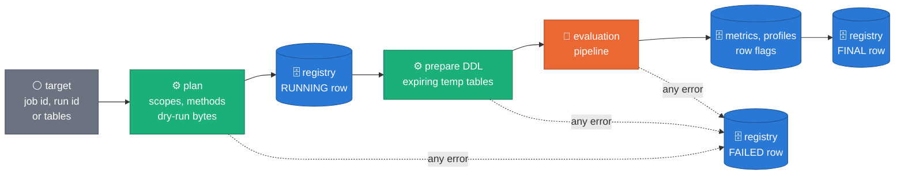
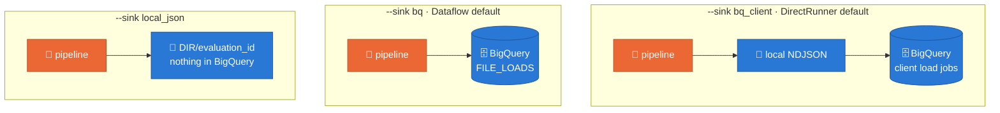
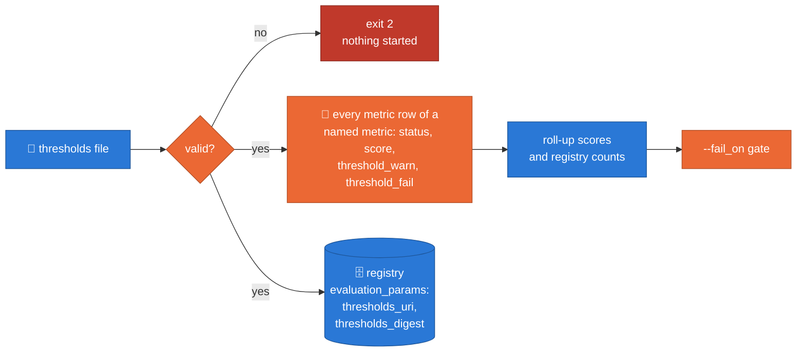
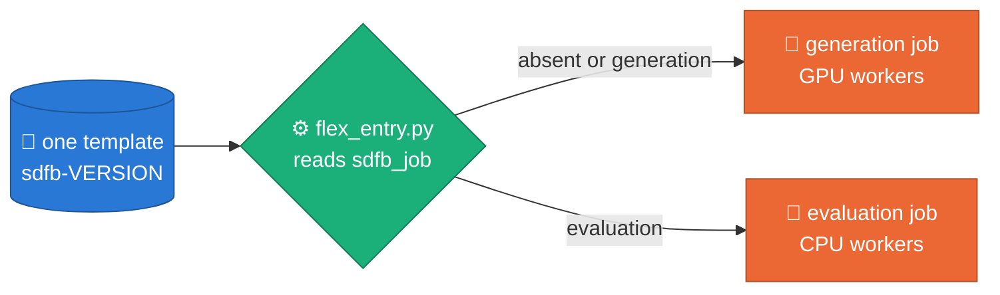
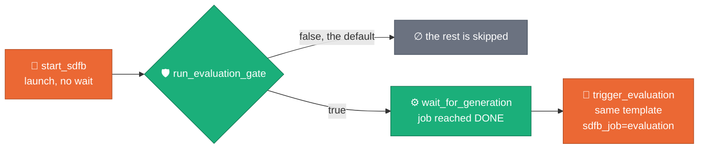
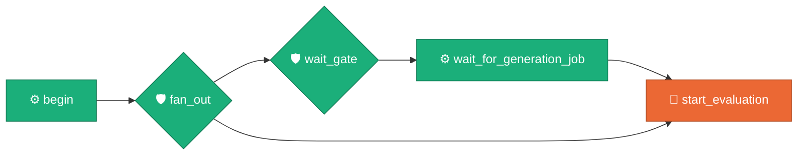
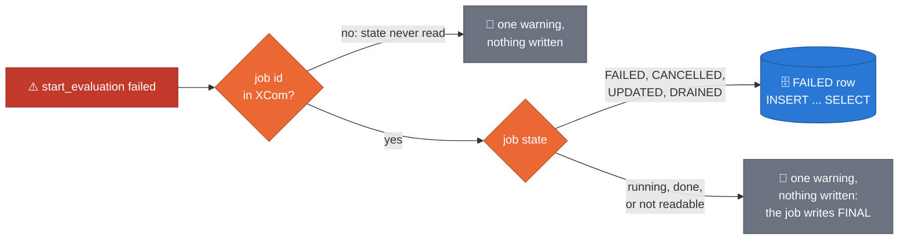

# sdfb-evaluation

Standalone statistical evaluation of synthetic BigQuery tables against their
live source: fidelity, privacy, integrity, and diversity, computed with Apache Beam and
written to BigQuery (`synthetic_data_quality.*`).

This package is **not** a workspace member of the root
`synthetic-llm-dataflow-bigquery` project (`[tool.uv.workspace] exclude`,
ADR 0041). It has its own `pyproject.toml`, `uv.lock`, and Python 3.11 pin,
and it installs and runs with none of the generator packages — `sdfb-core`,
`sdfb-beam`, `sdfb-tests` — present. An AST test
(`tests/unit/test_independence.py`) enforces that nothing under `src/` ever
imports them.

On Dataflow, this repository's deployment runs it from the generator's
image and template (section 5): the package has no image of its own there,
and still imports nothing of the generator.

See
[`docs/designs/2026-07-07-evaluation-framework-design.md`](../../docs/designs/2026-07-07-evaluation-framework-design.md)
for the design.

## Quickstart

One command line, `sdfb-eval`, plans, runs, reports on and compares
evaluations. What a run does, whatever the runner:



Every attempt mints its own `evaluation_id`
(`eval-<UTC yyyymmddThhmmssZ>-<8 hex>`), printed first; it is never passed
in. The registry is append-only: a run leaves a RUNNING row and a final one
(SUCCEEDED, SUCCEEDED_WITH_WARNINGS, PARTIAL, SKIPPED or FAILED). A status
describes the run, not the data: a run whose metrics fail still SUCCEEDED.

### 1. Install, and create the tables once

```bash
cd packages/sdfb-evaluation
uv sync --frozen
uv run pytest -q -m "not gcp"   # about 5 to 15 minutes; a test that hangs fails after 300 s

# prints the four `bq mk` commands and the two view statements
uv run sdfb-eval schemas --project demo-project
# or creates them: tables are kept if they exist, views are replaced
uv run sdfb-eval schemas --project demo-project --apply
```

The dataset (`synthetic_data_quality` unless `--dataset` says otherwise)
must exist. The commands below read Application Default Credentials.

This package has its own environment (`packages/sdfb-evaluation/.venv`). If
your shell has the repository root's environment active, `uv` warns that
`VIRTUAL_ENV` does not match and ignores it. Run the commands as
`env -u VIRTUAL_ENV uv run …` to silence the warning. Never pass `--active`
here: it would install this package's dependencies into the root
environment.

### 2. Plan first (nothing runs)

```bash
uv run sdfb-eval plan --dry_run \
  --project demo-project --region europe-west1 --job_id <GENERATION_JOB_ID>
```

It prints each table's scope, row counts, reference panel and the method
per column, the BigQuery bytes the dry runs counted against
`--max_bytes_billed`, and the predicted shuffle against `--max_shuffle_gb`.
A plan never runs the prepare DDL and never writes a registry row, with or
without `--dry_run`. It does issue the planning queries, and it creates
one kind of table: the zero-byte, 24-hour start snapshot of a table whose
rows were landed by copy jobs (scope `as_of_diff`), because that scope is
read through it. `--no_planning_snapshots` plans without them; those
tables are then reported `UNPLANNED`.

A target is exactly one of:

| Target | Flags |
|---|---|
| a generation Dataflow job | `--job_id J --region R` |
| a launch by its base run id | `--run_id B` (read from `validation_runs` in `--output_dataset`) |
| tables named by hand | `--tables users,orders --landing_dataset L --reference_dataset D` |
| what a launch of one table generated, with the job that ran it | `--seed_table T --generation_job_id J --region R --landing_dataset L --reference_dataset D` (the job id only says which job the row belongs to and gives its window: only the Dataflow job is read) |
| what a launch of one table generated | `--seed_table T --landing_dataset L --reference_dataset D` (with `--relationships_uri`: T's enabled component, parents first; T alone when no model names it, none is given, or the URI holds no model file, which the plan's warnings say) |
| every enabled table of a model | `--relationships_uri M --landing_dataset L --reference_dataset D` alone |

`--relationships_uri` (a file or directory, local or `gs://`, for example
`config/relationships/gcp_public_fk_example.yaml`) may accompany any of
them; it supplies the relationship model when the launch's own records name
none, and with `--seed_table` it is where the seed's component is read. A hand-named target carries no write disposition, so pass
`--scope manual` to evaluate the tables as they are now (without it every
table is planned as not evaluated, "scope unknown"). A manual scope reads
each landing table whole, and a hand-named target cannot read the generation's
reference sample size from the launch's records, so pass
`--reference_rows_limit` (the generation's) or the reference-based privacy
metrics are not evaluated.

### 3. Run on the DirectRunner

```bash
uv run sdfb-eval run \
  --project demo-project --region europe-west1 --job_id <GENERATION_JOB_ID>
```

The DirectRunner defaults to `--mode sampled --sink bq_client`: it reads a
salted sample of each side above `--sample_rows` (200,000), writes local
files, then loads them with one BigQuery load job per table, the
registry's FINAL row last.

A sampled run never stores a sample's number as exact. A row computed from
a sampled side carries `method = sample` and its `sample_rate`, and its
interval or noise floor uses the rows actually read. A metric that needs
every row of a side is `not_evaluated` with the reason "sampled mode cannot
measure …; run exact mode": the full-source match rates, the key and
internal duplicate rates, the orphan and fan-out metrics of a sampled edge,
and, per column, category and shape adherence, novelty, the substantive
copy rate, coverage, the pool-cap hit, range coverage, the distinct and
entropy ratios (a row sample thins repeats), and type validity when the
synthetic side is the sample. Run `--mode exact` for those verdicts.

`--runner DirectRunner` means "run it on this machine", and it is what the
registry records. The pipeline itself runs on Beam's in-process
`FnApiRunner`: Beam's own `DirectRunner` hands a batch pipeline to Prism,
which can start a step before its side input is complete, so the evaluator
does not run on Prism and refuses `--runner PrismRunner` as a usage error.



`--output_local DIR` keeps the local files under `DIR/<evaluation_id>`
(`bq_client` otherwise uses a temporary directory; `local_json` requires
it). The other flags, with their defaults:

| Group | Flags |
|---|---|
| mode and scope | `--mode exact\|sampled`, `--scope auto\|table\|as_of\|appends\|as_of_diff\|manual`, `--allow_contaminated` |
| sampling | `--sample_rows 200000`, `--privacy_sample_rows 50000`, `--detection_sample_rows 50000` |
| limits | `--pair_max_columns 20`, `--row_flags_top_k 100`, `--row_flags_source_keys hashed` |
| budgets | `--max_bytes_billed 1099511627776`, `--max_shuffle_gb 500` |
| output | `--output_dataset synthetic_data_quality`, `--temp_dataset` (default: the output dataset), `--sink`, `--output_local DIR` |
| control | `--fail_on none\|warn\|fail`, `--thresholds_uri Y`, `--trigger cli`, `--label_key_uri U` |

Any other argument goes to Beam (`--temp_location`, `--num_workers`,
`--experiments`, …). The experiment `enable_data_sampling` is refused.

Row flags and profile labels are hashed with a label key. Without
`--label_key_uri` the key is random and lives for one run; with it (a
Secret Manager version `projects/P/secrets/S/versions/V`, a `gs://` object
or an absolute path) labels are stable across runs. A worker reads the
key; the registry records only `operator` or `ephemeral`.

The key stays out of the job graph, but source rows do not: the reference
panel of every table (the R and H rows, up to twice `reference_rows_limit`
source rows, in clear) is embedded in the pipeline. On Dataflow the graph
is also uploaded to the job's staging location, so treat that bucket as
holding source data: restrict who can read it and expire its objects with a
lifecycle rule
([`DEPLOYMENT_PREREQUISITES.md`](../../docs/DEPLOYMENT_PREREQUISITES.md),
design §4.9).

### 4. Read the result

```bash
uv run sdfb-eval report  --project demo-project --evaluation_id <ID>            # markdown
uv run sdfb-eval report  --project demo-project --evaluation_id <ID> \
  --format json --out evaluation_metrics.json
uv run sdfb-eval report  --local DIR/<ID>                                        # a local_json run
uv run sdfb-eval compare --project demo-project --evaluation_ids <ID_A>,<ID_B>
uv run sdfb-eval catalogue --format md
```

A report explains every failing metric with the catalogue's own text (what
it measures, what a bad value means, its pitfalls). A comparison marks a
delta `≈` when it lies inside the two rows' own sampling noise, and gives
the population stability index between the two runs' histograms only where
both carry the same `edges_digest` (the same bin edges); otherwise it says
`not comparable`.

**Two absolute match rates fail by chance on a narrow table.**
`row.near_match_rate` and `row.exact_match_rate_nonkey` are raw shares
graded against fixed thresholds (warn 0.001, fail 0.01). On a table with
few non-key columns, or only low-cardinality ones, fresh rows equal a
source row in all columns, or in all but one, by coincidence: in a check
on invented rows with two non-key columns the near-match rate was 0.996 and
the non-key exact-match rate 1.2 %, both FAIL, with no copying at all. That
FAIL is the safe direction and it is kept. The calibrated signal is the
lifts: `row.memorization_lift` and `row.near_match_lift` compare the
reference sample with a holdout the generator never read, so chance hits
both alike and only copying lifts them above 1. Read a FAIL of either rate
next to its lift before calling it memorization.

Exit codes of `run`:

| Code | Meaning |
|---|---|
| 0 | the evaluation finished and no gate tripped |
| 1 | the `--fail_on` gate tripped, and nothing else |
| 2 | a usage error: nothing was started (no registry row, no DDL). A malformed Beam argument, a thresholds file that does not validate and `--runner PrismRunner` are usage errors too |
| 3 | the evaluation failed: its FINAL row reads FAILED (no table could be evaluated), or the command raised an error and its traceback is on stderr. The command appends a FAILED row first when the outcome is its own to record (the table below); it appends none while a submitted job is still running, or when the registry could not be read back. `--fail_on none` does not mask it |

The `--fail_on` gate, by the status of the run:

| Run status | `--fail_on none` | `--fail_on warn` or `fail` |
|---|---|---|
| SUCCEEDED, SUCCEEDED_WITH_WARNINGS | 0 | 1 if a metric is at FAIL (`fail`), or at WARN or FAIL (`warn`) |
| PARTIAL | 0 | 1: the gate cannot vouch for a launch table that was not evaluated |
| SKIPPED | 0 | 0: an empty scope is a planned outcome (one line on stderr says nothing was evaluated) |
| FAILED | 3 | 3 |

The registry never holds two terminal rows for one evaluation: the row is
written by whoever owns the outcome, and by nobody while that is not yet
known.

| What happened | The terminal row |
|---|---|
| the run completed | the pipeline's FINAL row |
| planning, the prepare DDL or the submission raised | the command's FAILED row |
| the job ended FAILED or CANCELLED and the registry, read back, holds no FINAL row | the command's FAILED row |
| the job ended FAILED or CANCELLED after it had loaded its FINAL row (cancelled late) | the pipeline's FINAL row: the command reads the registry back first and appends nothing |
| the launch was handed to Dataflow as a template (`--template_location`, which is how a flex-template launcher runs the entry): there is no job id and nothing to wait for | none from the command: it ends 0 and the RUNNING row stays open until the job writes its FINAL row |
| the job ended DONE and the registry, read back, holds no FINAL row | the command's FAILED row ("the job finished without a FINAL row") |
| Ctrl-C, or an error while polling, and the Dataflow job is still running | none yet. The job is not cancelled: it goes on and writes its own. The command prints the job id and how to read the result later |
| the wait failed, but the job had finished DONE | the pipeline's FINAL row. After a polling error the command warns and reads the result as usual (the evaluation completed); after Ctrl-C it writes nothing and prints how to read the result |
| the job finished, and the registry could not be read back | none: the FINAL row may well be there. The command says the registry could not be read |

So a RUNNING row without a terminal row means the job is still running, or
that it died after the command had stopped watching it.

#### Your own thresholds

The catalogue owns the default warn and fail thresholds. `--thresholds_uri`
(a local path or a `gs://` object) overrides them for the metrics a YAML
file names, for the whole run:

```yaml
thresholds:
  column.ks: {warn: 0.05, fail: 0.10}
  row.coverage: {warn: 0.90, fail: 0.80}
```



| Without the flag | With it |
|---|---|
| every row is graded against the catalogue | the rows of each named metric are graded, scored and stored against the file's `warn` and `fail`; the other metrics keep the catalogue's |
| `evaluation_params.thresholds_uri` and `thresholds_digest` are NULL | both are set: the file's URI and a digest of the overrides it held |

The stored `status`, `score`, `threshold_warn` and `threshold_fail` are the
override's, so the roll-up scores, the registry's counts and the `--fail_on`
gate follow from them: nothing is graded twice. Measured values do not
change, so the `evaluation_key` does not either. `report` names the file
and its digest and shows the thresholds a failing metric was graded
against; `compare` says when two runs were graded against different
thresholds.

The file is checked before anything starts. Each entry names a metric id of
the catalogue (`sdfb-eval catalogue --format md` lists them) and gives both
`warn` and `fail`, each a finite number of 0 or more, in the order of the
metric's direction: `warn <= fail` for a lower-is-better or target metric
(a target metric's thresholds are distances from its target),
`warn >= fail` (and not both 0) for a higher-is-better one. A metric the catalogue only
reports (it has no thresholds) cannot be given a gate.

### 5. Dataflow

**One image and one template, shared with the generator.** In this repository's
deployment the evaluator has no image and no template of its own
([ADR 0041, amendment of 2026-10-06](../../docs/adr/0041-evaluation-standalone-package.md#amendment-2026-10-06-one-image-one-template)).
The image built from `docker/Dockerfile` at the repository root carries this
package's source, and the template built from it launches both jobs. **Nothing
has been built or launched yet**: that happens on the GPU/GCP machine or in CI,
not on a laptop.



| What | Where | Note |
|---|---|---|
| The image | `docker/Dockerfile` (repository root) | carries `packages/sdfb-evaluation/src`; the evaluator runs on the generator's environment, not on this package's lock |
| The entry | `docker/flex_entry.py` | `sdfb_job=evaluation` calls `sdfb_evaluation.cli.run_evaluation.main`; without it the launch is a generation launch |
| The template's parameters | `docker/flex_template_metadata.json` | the generator's, `sdfb_job`, and the ones below; every one optional |
| This package's parameters | `deploy/flex_template_metadata.json` | one per `run` flag (minus runner, project, region), plus `sdfb_job` and Beam's `disk_size_gb` |

- `sdfb-eval run --runner DataflowRunner` defaults to `--mode exact
  --sink bq` (the pipeline writes BigQuery itself, the FINAL row after
  every other write committed) and waits for the job, so `--fail_on` still
  decides the exit code.
- On Dataflow the evaluator always sets `--experiments=upload_graph` and
  sizes the workers' side-input cache from the plan; your own Beam
  arguments are kept. `enable_data_sampling` is refused.
- The template's entry point, `src/sdfb_evaluation/cli/run_evaluation.py`,
  takes the same flags as `run`, submits the job and returns without
  waiting, and never applies `--fail_on` (the parameter is accepted, and
  has no effect on a template launch).

Launch an evaluation from the deployment's template. Two parameters are not
flags of `run`:

- `sdfb_job=evaluation` selects this package's entry. Without it the launch
  is a generation launch and fails for lack of the generator's parameters.
- `disk_size_gb=200` is Beam's own worker boot disk, handed to Beam
  unchanged. The shared image is multi-GB and Dataflow's default disk
  overflows while a worker unpacks it; the generator pins 200 for its own
  workers, the evaluator pins nothing.

Workers run the same image as the launcher: the image knows its own
coordinate and the evaluator applies it as `sdk_container_image` when the
launch gives none; an explicit `--parameters sdk_container_image=...`
overrides it. The evaluator adds `--experiments=upload_graph` itself, and the
template launcher supplies the runner, project and region (they are not
template parameters). An unset parameter reaches the CLI as an empty string,
which it reads as "not given":

```bash
gcloud dataflow flex-template run sdfb-evaluation-$(date +%s) \
  --project demo-project --region europe-west1 \
  --template-file-gcs-location \
    gs://demo-bucket/synthetic/sdfb-<VERSION>-template.json \
  --parameters sdfb_job=evaluation,generation_job_id=<GENERATION_JOB_ID>,disk_size_gb=200 \
  --worker-machine-type e2-standard-8 \
  --temp-location gs://demo-bucket/tmp
```

From the command line, without the template:

```bash
uv run sdfb-eval run --runner DataflowRunner \
  --project demo-project --region europe-west1 --job_id <GENERATION_JOB_ID> \
  --temp_location gs://demo-bucket/tmp \
  --sdk_container_image <THE_DEPLOYMENT_IMAGE> --disk_size_gb 200
```

**An evaluator-only template (optional).** `deploy/build_flex_template.sh`
builds a second template that declares this package's parameters alone, from
an image that already exists. It builds no image:

```bash
IMAGE=<THE_DEPLOYMENT_IMAGE> PROJECT_ID=demo-project TEMPLATES_BUCKET=demo-bucket \
  packages/sdfb-evaluation/deploy/build_flex_template.sh
# template: gs://demo-bucket/synthetic/sdfb-evaluation-<VERSION>-template.json
```

`VERSION` is `EVALUATOR_VERSION` from `src/sdfb_evaluation/version.py`
unless you set it. Launch it with `sdfb_job=evaluation` too: on the shared
image the entry is the same dispatcher.

**The standalone CPU image.** `docker/Dockerfile` in this package builds a
small image with the evaluator on its own lock and nothing else. The
repository's deployment does not use it; it is for the package copied out as
a unit of its own. No script builds it: its header gives the `docker build`
command. On that image the entry is `run_evaluation.py` itself, `sdfb_job`
has no effect, and the default worker disk is enough.

### 6. Composer

**Not deployed and never run.** The DAG files below are checked only by
static tests (`tests/unit/test_composer_dag.py` reads them with `ast` and
executes their pure functions); Airflow has never parsed them and no Composer
environment has run them.

#### 6.1 The generation DAG evaluates its own run

`composer/synthetic_beam_bigquery.py` is the only DAG the deployment has to
import. Trigger it with the parameter `run_evaluation` true and it evaluates
the run it has just launched:



| Param | Default | Goes to |
|---|---|---|
| `run_evaluation` | false | the `run_evaluation_gate` short-circuit |
| `evaluation_mode` | empty (`exact`, `sampled`) | template `mode`; empty is the evaluator's default |
| `evaluation_machine_type`, `evaluation_max_workers` | `e2-standard-8`, 4 | the evaluation launch's environment |
| `evaluation_output_dataset` | the dataset of the DAG's validation-runs table (`synthetic_data_quality` when that value is not `project.dataset.table`) | template `output_dataset` |
| `source_dataset` | empty (the dataset of `table_fqn`) | template `reference_dataset`: the dataset of the source tables, same names as the landed ones |

- `wait_for_generation` is a `DataflowJobStatusSensor` on the job id the
  launch pushed to XCom, in **reschedule mode**: it reads the job's state
  every two minutes for at most a day and holds no worker slot in between.
  It is not deferrable, so the environment needs no triggerer. A generation
  job that fails or is cancelled is expected to fail the sensor, and nothing
  is evaluated.
- `trigger_evaluation` launches the same template as `start_sdfb` with
  `sdfb_job=evaluation`, `generation_job_id`, `scope=manual`, `reference_rows_limit` (the
  generation's own value), `seed_table` (the last part of `table_fqn`),
  `relationships_uri` (empty when `generate_fk_relationships` is false),
  `landing_dataset` (the generation's own), `reference_dataset` (the
  `source_dataset` param, else the dataset of `table_fqn`), `trigger=chained`,
  the mode, the output dataset and `disk_size_gb=200`. The tables are what
  the launch generated: the seed's enabled component in the model, parents
  first, or the seed alone, each read with its source before the job starts
  (a table that cannot be read is skipped with a warning; only a target with
  none readable fails); nothing reads the generation job's log: `generation_job_id` is passed as the
  launch's identity and the evaluator reads only the Dataflow job resource
  (needs `roles/dataflow.viewer`; without it a warning and no window), so the
  row carries the job id and window and is listed in
  `evaluation_latest_per_job`. The window pins the source as of the job's
  create time (within its time-travel window). The launch's own record of
  its tables, run ids and reference digest, and a model the launch adjusted
  (ADR 0038), are not seen. Each landing table is read whole: with the DAG's
  `write_disposition` overwrite that is this launch's rows, with append it
  includes earlier launches' rows. A landing table named differently from its
  source is not found. It is a CPU job (no
  accelerator) in the generation job's subnetwork, under the same service
  account, which therefore needs the evaluator's roles; of the three that
  read a job, only `roles/dataflow.viewer`, for the generation window
  (without it the run still works, with a warning and no window)
  ([`DEPLOYMENT_PREREQUISITES.md`](../../docs/DEPLOYMENT_PREREQUISITES.md)).
  The relationship models are read from `relationships_uri`; the default
  folder is in the same image.
- It submits the job and does not wait: the evaluation job writes its own
  FINAL row. **A chained evaluation that dies after it was launched leaves
  its RUNNING row open**; nothing in this DAG closes it. Run the standalone
  DAG for that job to get an evaluation whose row is closed either way.
- **Run slot.** With `run_evaluation` true a run of this DAG stays running
  until the generation job ends (hours), and the DAG has `max_active_runs=1`:
  every later trigger queues behind it, so launches of this DAG run one
  generation at a time. `max_active_runs` is the knob; raising it lets several
  generation jobs run at once (GPU quota). It is not changed here.
- **Relationship models.** The evaluator follows what the generation did,
  by where the URI came from and whether the launch's log was read.
  An explicit `--relationships_uri` that resolves to no model file always
  raises. For the URI the generation job's own record names: when the log was
  read and shows no model loaded (the generator logged `relationships_absent`
  and generated each table alone) the evaluator evaluates without
  relationships, with one plan warning naming the URI; when the log could not
  be read it does the same and the warning says whether a model was loaded is
  unknown; when the record shows a model was loaded (`relationships_loaded`
  names the model and its sha) and its files are not readable from where the
  evaluator runs, it raises, naming the model, its sha and the URI. The
  warning reaches the registry row's `warnings`. An adjusted model (ADR 0038) is loaded from where the
  launch wrote it, as before. First-deploy check: when a model is expected,
  the generation launcher log says `relationships_loaded`.
- With `run_evaluation` false the gate skips every task after the launch,
  and the launch and its arguments are what they were before the chain: a
  test pins the operator's whole call.

#### 6.2 The standalone DAG (optional)

`composer/evaluation_framework.py` is the DAG `sdfb_evaluation_framework`
(`schedule_interval=None`, manual). Import it to evaluate a run that has
already finished. It is a template: run the import workflow's substitution
on it, the markers are ones that workflow already substitutes for the
generation DAG (`{{PROJECT_VERSION}}`, `{{ENV}}`, `{{GCS_DATAFLOW_STAGING}}`
and `{{GCS_DATAFLOW_TEMPLATES}}`); it reads the Variables `PROJECT_ID`,
`REGION`, `SA_DATAFLOW` and `DATAFLOW_SUBNET` (optional
`DATAFLOW_NETWORK_TAGS`). It launches the deployment's template,
`gs://<templates>/synthetic/sdfb-<version>-template.json`, with
`sdfb_job=evaluation`. To launch an evaluator-only template instead, change
the one constant `flex_template` in the file (its header says how).



| Param | Default | Goes to |
|---|---|---|
| `generation_job_id` | empty | template `job_id`; the sensor's job |
| `generation_job_ids` | empty list | `fan_out`: one run of this DAG per id |
| `run_id`, `tables`, `landing_dataset`, `reference_dataset`, `relationships_uri` | empty | the template parameter of the same name |
| `mode` | empty (`exact`, `sampled`) | template `mode` |
| `allow_contaminated` | false | template `allow_contaminated` (lower-case) |
| `output_dataset` | `synthetic_data_quality` | template `output_dataset`; the registry the callback writes |
| `trigger` | `composer` (`chained`) | template `trigger` |
| `wait_for_generation` | false | the `wait_gate` short-circuit |
| `machine_type`, `max_workers` | `e2-standard-8`, 4 | the launch environment, not the template |

Exactly one of `generation_job_id`, `run_id`, `tables` names the target; the
launcher refuses otherwise. The DAG never passes `runner`, `project`,
`region`, `sdk_container_image`, `experiments` or `fail_on`.

With `wait_for_generation` true (and a `generation_job_id`) a deferrable
`DataflowJobStatusSensor` waits for `JOB_STATE_DONE` first; with it false the
gate skips the sensor and the launch still runs.

**Several jobs in one go.** Give `generation_job_ids` on one manual run (a
list of Dataflow job ids; in the trigger form, one id per line):

| `generation_job_ids` | `generation_job_id` | What the run does |
|---|---|---|
| empty | empty or one id | evaluates its one target, as a run always did |
| one id or more | empty or one id | `fan_out` starts one run of this DAG per id (the list, then the single id; blanks and repeats dropped) and skips the rest of its own run |

Each started run gets the triggering run's other params unchanged, its one
id as `generation_job_id` and an empty list, so it is a plain single-job run:
one Dataflow job per id, with the sensor, the launch and the failure
callback described here. Leave `run_id` and `tables` empty with a list (the
started runs would carry them and the launcher refuses two targets). The run
ids are `fan_out__<logical date>__<job id>`, so clearing `fan_out` does not
start a job's run twice.

The runs go **one after another**: the DAG has `max_active_runs=1`. That is
the knob for evaluating several jobs at once. Raising it to N means up to N
evaluation Dataflow jobs at the same time, each with its own workers, and
two runs on the same target can then close each other's registry row. Like
the rest of the DAG, the fan-out has not been parsed or run by Airflow.

**Failure callback.** The launch task waits for the job (deferrably). The
launcher writes the RUNNING registry row before submitting and mints the
`evaluation_id`; a job that dies afterwards leaves only that row. The task's
`on_failure_callback` closes it, but only when the job cannot close it
itself. A task can fail on the Airflow side (a deferral timeout, a lost
trigger) while its Dataflow job runs on and later writes its own FINAL row,
so the callback first reads the job's state through the provider's
`DataflowHook.get_job`, with the job id the launch pushed to XCom (the
task's return value, else the `dataflow_job_config` entry the operator
pushes before it can fail). With no job id it writes nothing:



The row itself is one `INSERT ... SELECT` into `evaluation_data_history`: it
copies the RUNNING row of this DAG run's evaluation (matched on the launch
target, the same trigger, and `recorded_at` at or after the DAG run's
start), sets `event` FINAL, `status` FAILED, the reason and the times (and
`evaluation_job_id`), and skips evaluations that
already have a FINAL event. No match, no row. Two DAG runs overlapping on
the same target can close each other's row, and where two RUNNING rows exist
for one evaluation only the latest is closed. A job left running by a failed
task keeps its RUNNING row open until it writes FINAL; if it then dies, no
callback runs again and the row stays open. So does a job that dies after
launch while no job id reached XCom: a RUNNING row left open is the lesser
harm than a FAILED row on a run that succeeds (a launch that failed itself
has its FAILED row from the launcher, or never wrote RUNNING).

Limits to know before the first launch:

- A launch whose only target is `tables` (no `generation_job_id`, no `run_id`)
  cannot be matched: the callback logs one warning and writes nothing, so a
  failed job leaves its RUNNING row open.
- Unverified until a real launch: `maxWorkers` is passed as the rendered string
  of `max_workers` (and of `evaluation_max_workers` in the generation DAG;
  proto3 JSON should accept a numeric string for an int32; native rendering
  DAG-wide would turn digit-only run ids into ints), the deferrable wait
  semantics of the installed provider, the DML on real BigQuery,
  `BigQueryHook().insert_job(configuration=, project_id=)` and the job's
  `result()` in the failure callback (written from the operator's documented
  behaviour; the provider was not available to read), a trigger's conf
  reaching `context["params"]`, and the trigger rule when the sensor is
  skipped.
- Unverified until Composer, for the generation DAG's chain: that the
  reschedule-mode sensor fails when the generation job ends in a state other
  than done (the provider's source was not available to read), and that
  `disk_size_gb` reaches the evaluation job's workers.
- Unverified until Composer, for the fan-out: `airflow.api.common.trigger_dag.
  trigger_dag(dag_id=, run_id=, conf=, replace_microseconds=False)` called
  inside a task's callable (Airflow 2's function, which the trigger operator
  itself calls; `replace_microseconds=False` keeps two runs started in one
  second from sharing a logical date), the `DagRunAlreadyExists` it raises
  for a run id that exists, an array param in the trigger form, and the
  started runs queueing behind `max_active_runs`. A list of job ids together
  with `run_id` or `tables` fails the first task with one message.
- Also unverified until Composer, for the callback's job-state check: that a
  failed deferrable launch has pushed the job to XCom by the time the
  callback runs (as `{"job_id": ...}` under the key `dataflow_job_config`;
  the key and shape are unverified against a real provider, and the return
  value's `id` is most likely absent for a task that raised), that `DataflowHook().get_job(job_id=, project_id=,
  location=)` of the installed provider returns the job with `currentState`,
  and that the hook can be built inside a callback with the default
  connection. If the job id is missing, or the state cannot be read, the callback
  writes nothing.
