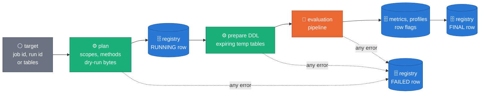
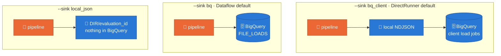

# sdfb-evaluation

Standalone statistical evaluation of synthetic BigQuery tables against their
live source: fidelity, privacy, and utility, computed with Apache Beam and
written to BigQuery (`synthetic_data_quality.*`).

This package is **not** a workspace member of the root
`synthetic-llm-dataflow-bigquery` project (`[tool.uv.workspace] exclude`,
ADR 0041). It has its own `pyproject.toml`, `uv.lock`, and Python 3.11 pin,
and it installs and runs with none of the generator packages — `sdfb-core`,
`sdfb-beam`, `sdfb-tests` — present. An AST test
(`tests/unit/test_independence.py`) enforces that nothing under `src/` ever
imports them.

See
[`docs/designs/2026-07-07-evaluation-framework-design.md`](../../docs/designs/2026-07-07-evaluation-framework-design.md)
for the design.

## Quickstart

One command line, `sdfb-eval`, plans, runs, reports on and compares
evaluations. What a run does, whatever the runner:



Every attempt mints its own `evaluation_id`
(`eval-<UTC yyyymmddThhmmssZ>-<8 hex>`), printed first; it is never passed
in. The registry is append-only: a run leaves a RUNNING row and a final one
(SUCCEEDED, SUCCEEDED_WITH_WARNINGS, PARTIAL, SKIPPED or FAILED). A status
describes the run, not the data: a run whose metrics fail still SUCCEEDED.

### 1. Install, and create the tables once

```bash
cd packages/sdfb-evaluation
uv sync --frozen
uv run pytest -q -m "not gcp"

# prints the four `bq mk` commands and the two view statements
uv run sdfb-eval schemas --project demo-project
# or creates them: tables are kept if they exist, views are replaced
uv run sdfb-eval schemas --project demo-project --apply
```

The dataset (`synthetic_data_quality` unless `--dataset` says otherwise)
must exist. The commands below read Application Default Credentials.

### 2. Plan first (nothing runs)

```bash
uv run sdfb-eval plan --dry_run \
  --project demo-project --region europe-west1 --job_id <GENERATION_JOB_ID>
```

It prints each table's scope, row counts, reference panel and the method
per column, the BigQuery bytes the dry runs counted against
`--max_bytes_billed`, and the predicted shuffle against `--max_shuffle_gb`.
A plan never runs the prepare DDL and never writes a registry row, with or
without `--dry_run`. It does issue the planning queries, and it creates
one kind of table: the zero-byte, 24-hour start snapshot of a table whose
rows were landed by copy jobs (scope `as_of_diff`), because that scope is
read through it. `--no_planning_snapshots` plans without them; those
tables are then reported `UNPLANNED`.

A target is exactly one of:

| Target | Flags |
|---|---|
| a generation Dataflow job | `--job_id J --region R` |
| a launch by its base run id | `--run_id B` (read from `validation_runs` in `--output_dataset`) |
| tables named by hand | `--tables users,orders --landing_dataset L --reference_dataset D` |

`--relationships_uri` (a file or directory, local or `gs://`, for example
`config/relationships/gcp_public_fk_example.yaml`) may accompany any of
them; it supplies the relationship model when the launch's own records name
none. A hand-named target carries no write disposition, so pass
`--scope manual` to evaluate the tables as they are now.

### 3. Run on the DirectRunner

```bash
uv run sdfb-eval run \
  --project demo-project --region europe-west1 --job_id <GENERATION_JOB_ID>
```

The DirectRunner defaults to `--mode sampled --sink bq_client`: it reads a
salted sample of each side above `--sample_rows` (200,000), writes local
files, then loads them with one BigQuery load job per table, the
registry's FINAL row last.



`--output_local DIR` keeps the local files under `DIR/<evaluation_id>`
(`bq_client` otherwise uses a temporary directory; `local_json` requires
it). The other flags, with their defaults:

| Group | Flags |
|---|---|
| mode and scope | `--mode exact\|sampled`, `--scope auto\|table\|as_of\|appends\|as_of_diff\|manual`, `--allow_contaminated` |
| sampling | `--sample_rows 200000`, `--privacy_sample_rows 50000`, `--detection_sample_rows 50000` |
| limits | `--pair_max_columns 20`, `--topk_profile 1000`, `--row_flags_top_k 100`, `--row_flags_source_keys hashed` |
| budgets | `--max_bytes_billed 1099511627776`, `--max_shuffle_gb 500` |
| output | `--output_dataset synthetic_data_quality`, `--temp_dataset` (default: the output dataset), `--sink`, `--output_local DIR` |
| control | `--fail_on none\|warn\|fail`, `--thresholds_uri Y`, `--trigger cli`, `--label_key_uri U` |

Any other argument goes to Beam (`--temp_location`, `--num_workers`,
`--experiments`, …). The experiment `enable_data_sampling` is refused.

Row flags and profile labels are hashed with a label key. Without
`--label_key_uri` the key is random and lives for one run; with it (a
Secret Manager version `projects/P/secrets/S/versions/V`, a `gs://` object
or an absolute path) labels are stable across runs. A worker reads the
key; the registry records only `operator` or `ephemeral`.

### 4. Read the result

```bash
uv run sdfb-eval report  --project demo-project --evaluation_id <ID>            # markdown
uv run sdfb-eval report  --project demo-project --evaluation_id <ID> \
  --format json --out evaluation_metrics.json
uv run sdfb-eval report  --local DIR/<ID>                                        # a local_json run
uv run sdfb-eval compare --project demo-project --evaluation_ids <ID_A>,<ID_B>
uv run sdfb-eval catalogue --format md
```

A report explains every failing metric with the catalogue's own text (what
it measures, what a bad value means, its pitfalls). A comparison marks a
delta `≈` when it lies inside the two rows' own sampling noise, and gives
the population stability index between the two runs' histograms only where
both carry the same `edges_digest` (the same bin edges); otherwise it says
`not comparable`.

Exit codes of `run`:

| Code | Meaning |
|---|---|
| 0 | the evaluation finished and no gate tripped |
| 1 | the `--fail_on` gate tripped, and nothing else |
| 2 | a usage error: nothing was started (no registry row, no DDL). A malformed Beam argument or thresholds file is one too |
| 3 | the evaluation failed: its FINAL row reads FAILED (no table could be evaluated), or the run raised an error. The FAILED row is written first, the traceback goes to stderr. `--fail_on none` does not mask it |

The `--fail_on` gate, by the status of the run:

| Run status | `--fail_on none` | `--fail_on warn` or `fail` |
|---|---|---|
| SUCCEEDED, SUCCEEDED_WITH_WARNINGS | 0 | 1 if a metric is at FAIL (`fail`), or at WARN or FAIL (`warn`) |
| PARTIAL | 0 | 1: the gate cannot vouch for a launch table that was not evaluated |
| SKIPPED | 0 | 0: an empty scope is a planned outcome (one line on stderr says nothing was evaluated) |
| FAILED | 3 | 3 |

The registry holds exactly one terminal row per evaluation. If you
interrupt `run` (Ctrl-C) while it waits for a Dataflow job, the job is not
cancelled and the driver writes no row: the job goes on and writes its
own. The command prints the job id and how to read the result later.

`--thresholds_uri` points at a YAML file of the warn and fail thresholds
the gate applies instead of the catalogue's:

```yaml
thresholds:
  column.ks: {warn: 0.05, fail: 0.10}
```

It moves the gate only. Stored rows always carry the catalogue's status, so
two runs with the same `catalogue_version` stay comparable.

### 5. Dataflow

**Not runnable from this repository yet.** Dataflow workers need this
package installed, and the CPU worker image and flex template that provide
it (`packages/sdfb-evaluation/docker/Dockerfile` and
`packages/sdfb-evaluation/deploy/`, this package's own, not the generator's
GPU image at the repository root) have not landed. What is already here is
the command line itself:

- `sdfb-eval run --runner DataflowRunner` defaults to `--mode exact
  --sink bq` (the pipeline writes BigQuery itself, the FINAL row after
  every other write committed) and waits for the job, so `--fail_on` still
  decides the exit code.
- On Dataflow the evaluator always sets `--experiments=upload_graph` and
  sizes the workers' side-input cache from the plan; your own Beam
  arguments are kept.
- The template's entry point, `src/sdfb_evaluation/cli/run_evaluation.py`,
  takes the same flags as `run`, submits the job and returns without
  waiting, and never applies `--fail_on`.

Once the image exists, a run from the command line will look like this:

```bash
uv run sdfb-eval run --runner DataflowRunner \
  --project demo-project --region europe-west1 --job_id <GENERATION_JOB_ID> \
  --temp_location gs://demo-bucket/tmp \
  --sdk_container_image <EVALUATION_WORKER_IMAGE>
```

### 6. Composer

**Not in this repository yet.** The evaluation DAG
(`composer/evaluation_framework.py`) and the opt-in trigger from the
generation DAG follow the flex template. What they will call is in place:
the template entry above, with `--trigger composer` or `--trigger chained`
recorded in the registry. One thing is theirs to do: a Dataflow job that
dies after it was submitted leaves only its RUNNING row, and the DAG's
failure callback has to close it with a FAILED row.
